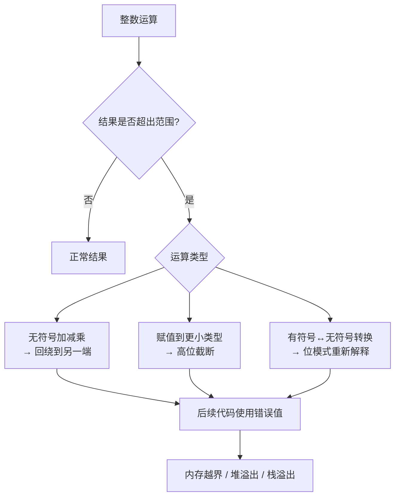
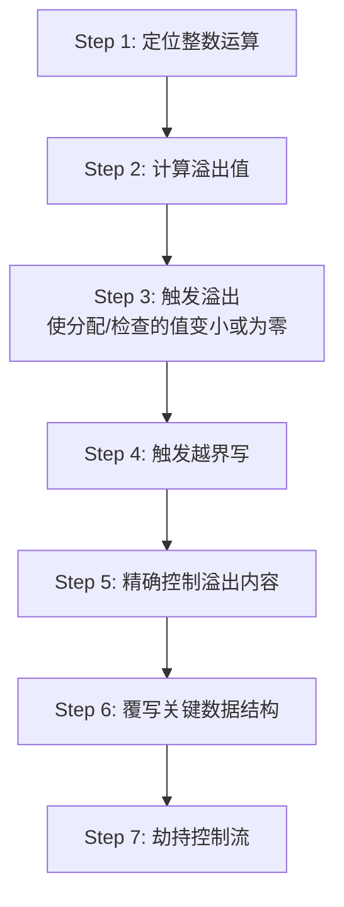

## 3. 整数溢出利用

整数溢出（Integer Overflow）是一类隐蔽性极强的内存安全漏洞。与栈溢出、格式化字符串漏洞不同，整数溢出本身并不直接写入非法内存——它通过改变程序的数值逻辑，间接导致后续的内存操作越界。正是这种"间接性"，使得整数溢出在代码审计中极易被忽略，却能在攻击者手中转化为堆溢出、栈溢出、越界写等高危漏洞。

### 3.1 整数表示与溢出原理

#### 3.1.1 计算机中的整数表示

现代计算机使用固定位数的二进制表示整数。C/C++ 中常见的整数类型及其范围如下：

| 类型 | 字节数 | 无符号范围 | 有符号范围 |
|------|--------|-----------|-----------|
| `char` | 1 | 0 ~ 255 | -128 ~ 127 |
| `short` | 2 | 0 ~ 65,535 | -32,768 ~ 32,767 |
| `int` | 4 | 0 ~ 4,294,967,295 | -2,147,483,648 ~ 2,147,483,647 |
| `long long` | 8 | 0 ~ 2^64-1 | -2^63 ~ 2^63-1 |
| `size_t` | 4/8 | 0 ~ 2^32-1 或 2^64-1 | 无符号 |

**关键概念——二进制补码（Two's Complement）：** 有符号整数使用补码表示。以 8 位为例，`01111111` 表示 +127，加 1 后变为 `10000000`，即 -128。符号位翻转，数值"回绕"到另一端。

```c
// 补码回绕的直观演示
#include <stdio.h>
#include <limits.h>

int main() {
    // 无符号溢出：回绕到 0
    unsigned int u = UINT_MAX;      // 4294967295
    printf("UINT_MAX + 1 = %u\n", u + 1);  // 输出 0

    // 有符号溢出：回绕到最小负数（未定义行为，但大多数实现如此）
    int s = INT_MAX;                // 2147483647
    printf("INT_MAX + 1 = %d\n", s + 1);   // 输出 -2147483648

    // 负数回绕
    unsigned int zero = 0;
    printf("0 - 1 = %u\n", zero - 1);      // 输出 4294967295
    return 0;
}
```

> **重要区分：** C 标准规定无符号整数溢出是"回绕"（well-defined wraparound），而有符号整数溢出是"未定义行为"（Undefined Behavior, UB）。在实际的 x86/ARM 平台上，有符号溢出通常也表现为回绕，但编译器有权假设它不会发生并据此优化代码，这可能消除安全检查。

#### 3.1.2 溢出的三种基本模式

整数溢出并非单一现象，它包含三种不同的机制：

**模式一：算术回绕（Wraparound）**

运算结果超出类型可表示范围，高位被截断，数值从另一端"绕回"。

```text
  0xFFFFFFFF  (UINT_MAX = 4294967295)
+ 0x00000001
= 0x100000000 → 截断为 0x00000000 (0)
```

**模式二：类型截断（Truncation）**

将较大类型的值赋给较小类型时，高位数据丢失。

```c
int big = 0x10000;           // 65536
short small = (short)big;    // 截断为 0
char tiny = (char)big;       // 截断为 0
```

**模式三：符号转换（Sign Conversion）**

有符号与无符号之间的隐式转换导致数值解释错误。这是 C 语言中最危险的陷阱之一。

```c
#include <stdio.h>

int main() {
    int len = -1;
    unsigned int ulen = (unsigned int)len;  // 4294967295
    printf("-1 as unsigned: %u\n", ulen);

    // 真实漏洞场景
    if (ulen > 1024) {
        printf("Too large!\n");  // 这行会执行
    } else {
        printf("OK\n");          // 但很多代码错误地认为不会到这里
    }
    return 0;
}
```



### 3.2 整数溢出的分类与触发条件

#### 3.2.1 按运算类型分类

| 运算类型 | 触发条件 | 典型场景 | 危害程度 |
|---------|---------|---------|---------|
| 加法 | `a + b > MAX` 或 `a + b < MIN` | 长度累加、偏移计算 | 高 |
| 减法 | `a - b < 0`（无符号）或 `a - b < MIN` | 范围检查、差值计算 | 高 |
| 乘法 | `a * b > MAX` | `count * element_size` 的分配计算 | 极高 |
| 除法 | `a / 0` 或 `INT_MIN / -1` | 边界条件处理 | 中 |
| 左移 | 移位后超出范围 | 位操作、乘法替代 | 中 |

#### 3.2.2 按漏洞成因分类

**一、算术回绕漏洞**

最常见的类型，发生在大小计算、长度校验等场景。

```c
// 经典的 malloc 大小计算漏洞
void *allocate_buffer(unsigned int count, unsigned int element_size) {
    unsigned int total = count * element_size;  // 可能溢出！
    // 例如: count=0x40000001, element_size=4
    // total = 0x100000004 → 截断为 0x4
    return malloc(total);  // 只分配 4 字节
}
```

**二、符号转换漏洞**

有符号与无符号比较时，有符号数被隐式转为无符号。

```c
// 安全检查被绕过
int process_data(char *buf, int user_len) {
    if (user_len < 0) return -1;          // 检查 1：负数
    if (user_len > MAX_BUF) return -1;    // 检查 2：过大
    // 但如果 user_len 来自网络，某处被转为 unsigned...
    memcpy(internal_buf, buf, user_len);
    return 0;
}

// 更隐蔽的变体
void dangerous_copy(char *src, int len) {
    // len 为负数时，(sizeof(buf) - len) 会溢出为一个巨大的正数
    if (len > (int)sizeof(buf)) return;
    memcpy(buf, src, len);  // len 为负时，memcpy 的 size_t 参数变成巨大值
}
```

**三、截断漏洞**

大类型赋值给小类型时高位丢失。

```c
// 网络协议中的经典截断漏洞
struct packet {
    unsigned short data_len;   // 16 位，最大 65535
    char data[];
};

void process_packet(char *raw) {
    struct packet *pkt = (struct packet *)raw;
    unsigned int alloc_size = pkt->data_len + sizeof(struct packet);
    // 上面不会溢出，但如果 alloc_size 被截断为 short...

    // 另一种截断：从 32 位读入 16 位
    unsigned int big_len = get_network_length();  // 返回 0x10000
    unsigned short small_len = (unsigned short)big_len;  // 截断为 0
    char *buf = malloc(small_len);  // 分配 0 字节
}
```

#### 3.2.3 隐式转换规则（Usual Arithmetic Conversions）

C 语言在混合类型运算时会进行隐式提升，理解这些规则是发现整数溢出漏洞的关键：

```c
// 整型提升规则
// 1. 如果两个操作数类型相同，结果也是该类型
// 2. 如果不同，较小的类型被提升到较大的类型
// 3. 有符号 + 无符号 → 转为无符号

unsigned int a = 10;
int b = -5;
// a + b 的结果是 unsigned int 类型
// b 被转为 unsigned: -5 → 4294967291
// a + b = 10 + 4294967291 = 4294967301 → 溢出为 5
printf("a + b = %u\n", a + b);  // 输出 5，而不是预期的 5 或报错

// sizeof 返回 size_t（无符号）
int len = 5;
if (len - sizeof(int) > 0) {  // 5 - 4 = 1 > 0 → true
    printf("positive\n");
}

int len2 = 3;
if (len2 - sizeof(int) > 0) {  // 3 - 4 = -1，但转为 unsigned → 极大正数 > 0
    printf("positive!\n");      // 这行会执行！
}
```

### 3.3 整数溢出到内存破坏的转化

整数溢出本身不是内存破坏漏洞，但它是内存破坏漏洞的"催化剂"。以下展示三种最常见的转化路径。

#### 3.3.1 整数溢出 → 堆溢出

这是最常见的利用路径：溢出导致 `malloc` 分配过小的缓冲区，后续操作写入正常大小的数据。

```c
#include <stdio.h>
#include <stdlib.h>
#include <string.h>

// 模拟从不可信源读取数据的场景
typedef struct {
    unsigned int data_len;
    char data[];
} message_t;

void process_message(message_t *msg) {
    // 漏洞点：data_len + 1 可能溢出
    // 如果 data_len = 0xFFFFFFFF，则 data_len + 1 = 0
    char *buf = malloc(msg->data_len + 1);
    if (!buf) return;

    // 此处 malloc(0) 返回一个极小的堆块（通常 16-32 字节）
    // 但 memcpy 写入 msg->data_len 字节 = 4GB
    memcpy(buf, msg->data, msg->data_len);  // 巨大的堆溢出！
    buf[msg->data_len] = '\0';              // 空终止符也越界
    free(buf);
}

int main() {
    // 构造恶意消息
    char payload[64];
    message_t *msg = (message_t *)payload;
    msg->data_len = 0xFFFFFFFF;
    memset(msg->data, 'A', 32);

    process_message(msg);
    return 0;
}
```

**堆溢出的完整利用链：**


#### 3.3.2 整数溢出 → 栈溢出

当整数溢出影响到栈上缓冲区的 `alloca` 或 VLA（变长数组）大小计算时：

```c
#include <alloca.h>
#include <string.h>

void vulnerable_vla(int count) {
    // count * sizeof(int) 可能溢出
    // 如果 count = 0x40000000，则 count * 4 = 0x100000000 → 0
    int *arr = alloca(count * sizeof(int));  // 在栈上分配 0 字节

    // 但后续循环写入 count 个 int
    for (int i = 0; i < count; i++) {
        arr[i] = 0x41414141;  // 栈溢出
    }
}

// 另一种：VLA
void vulnerable_vla2(unsigned int n) {
    // 如果 n = 0x80000001 (on 32-bit), n * 4 = 0x200000004 → 截断为 4
    char buf[n * 4];  // VLA，实际只分配 4 字节
    memset(buf, 0, n * 4);  // 写入 0x200000004 字节
}
```

#### 3.3.3 整数溢出 → 越界读写

溢出导致索引计算错误，产生越界访问。

```c
// 数组越界写
void oob_write(unsigned int index) {
    int table[256];
    // index * sizeof(int) 溢出
    // 例如 index = 0x40000000 → index * 4 = 0x100000000 → 0
    unsigned int offset = index * sizeof(int);
    // 如果 offset 被用作数组偏移...
    *(int *)((char *)table + offset) = 0xdeadbeef;
}

// 数组越界读
int oob_read(int idx, int *array, int size) {
    // 如果 idx 为负数，且被隐式转为无符号...
    unsigned int uidx = (unsigned int)idx;
    if (uidx < size) {  // 负数变成巨大正数，通常不会 < size
        return array[uidx];
    }
    return -1;
}
```

### 3.4 真实世界中的整数溢出漏洞

#### 3.4.1 CVE-2014-0160（Heartbleed）—— 间接相关

虽然 Heartbleed 的根因是缺少边界检查，但整数溢出类漏洞在 TLS/SSL 库中同样常见。OpenSSL 的 `d1_both.c` 中，heartbeat 扩展的 payload 长度字段为 16 位无符号整数，服务端未验证该长度是否与实际接收的数据匹配，导致越界读取。

#### 3.4.2 CVE-2015-8607 —— Linux 内核整数溢出

Linux 内核的 `drivers/usb/serial/io_ti.c` 中，端点描述符的 `wMaxPacketSize` 字段乘以缓冲区数量时未做溢出检查，导致 `kmalloc` 分配的缓冲区过小，后续 USB 数据传输写入时发生堆溢出。

#### 3.4.3 CVE-2019-0211 —— Apache 整数溢出提权

Apache HTTP Server 的 `event MPM` 中，共享内存区域的对齐计算存在整数溢出。攻击者利用此漏洞在子进程中写入越界内存，最终实现从 www-data 用户提权到 root。

#### 3.4.4 CVE-2021-22555 —— Netfilter 整数溢出

Linux 内核 Netfilter 的 `x_tables` 模块中，`setsockopt` 传入的 `xt_compat_match` 结构体大小计算存在整数溢出（32 位 `user_size + match_size` 溢出），导致内核堆越界写入，可实现本地提权。该漏洞影响了 15 年以上的内核代码。

```c
// CVE-2021-22555 简化示意
struct xt_entry_match {
    unsigned short user_size;
    // ... 其他字段 ...
    char data[];   // match 数据
};

// 漏洞代码：
// user_size + sizeof(xt_entry_match) 在 32 位上可能溢出
// user_size = 0xFFFFFFFC → user_size + 4 = 0x100000000 → 0
// 导致后续的 copy_from_user 写入越界
```

### 3.5 整数溢出利用技术详解

#### 3.5.1 利用流程概览

整数溢出的利用不像栈溢出那样"直接控制返回地址"，它需要多步配合：



#### 3.5.2 Step 1 —— 定位目标整数运算

在代码审计中，重点关注以下模式：

```c
// 高危模式清单
malloc(a + b);              // 加法后分配
malloc(a * b);              // 乘法后分配
malloc(a * b + c);          // 复合运算后分配
alloca(a * sizeof(T));      // 栈上分配
if (len > sizeof(buf)) ...  // 有符号/无符号混合比较
memcpy(dst, src, n - m);    // 减法后拷贝
recv(fd, buf, len - offset, 0);  // 减法后接收
```

**自动化发现方法：** 使用编译器的 sanitizer 可以在运行时捕获整数溢出：

```bash
# GCC/Clang 的 UBSan（Undefined Behavior Sanitizer）
gcc -fsanitize=integer -fsanitize=undefined -g -o target target.c

# 运行时会报告：
# runtime error: unsigned integer overflow: 4294967295 + 1 cannot be represented
#   in type 'unsigned int'

# 或者更精确的子选项：
gcc -fsanitize=signed-integer-overflow -fsanitize=unsigned-integer-overflow \
    -fsanitize=bounds -g -o target target.c
```

#### 3.5.3 Step 2 —— 计算溢出值

攻击者需要找到一个输入值 `x`，使得某个表达式 `f(x)` 溢出到目标值 `t`。

**加法溢出：** `x + y ≡ t (mod 2^n)`，即 `x = t - y (mod 2^n)`

```text
// 需要 total = count + header_size 溢出为 small_value
// count = small_value - header_size (mod 2^32)
// 例如 header_size=16, 需要 total=0 → count = 0 - 16 = 0xFFFFFFF0 (4294967280)
```

**乘法溢出：** `x * y ≡ t (mod 2^n)`

```text
// 需要 total = count * element_size 溢出为 64
// element_size=4, count = 64/4 = 16 → 没溢出
// 需要 total 溢出为 16 → count * 4 ≡ 16 (mod 2^32)
// count = 16/4 = 4 → 没溢出
// 需要 total 溢出为 4 → count * 4 ≡ 4 (mod 2^32)
// count = (4 + 2^32) / 4 = 1073741825 = 0x40000001
```

**Python 快速计算溢出值：**

```python
import struct

def find_overflow_add(target, constant, bits=32):
    """找到 x 使得 (x + constant) mod 2^bits == target"""
    mask = (1 << bits) - 1
    x = (target - constant) & mask
    verify = (x + constant) & mask
    print(f"x = {x} (0x{x:08x})")
    print(f"验证: {x} + {constant} = {(x + constant) & mask} (mod 2^{bits})")
    return x

def find_overflow_mul(target, factor, bits=32):
    """找到 x 使得 (x * factor) mod 2^bits == target"""
    mask = (1 << bits) - 1
    # 需要 factor 的模逆元（仅当 gcd(factor, 2^bits) 整除 target 时有解）
    from math import gcd
    g = gcd(factor, 1 << bits)
    if target % g != 0:
        print(f"无解：gcd({factor}, 2^{bits}) = {g} 不整除 {target}")
        return None
    # 简化问题
    f, t, m = factor // g, target // g, (1 << bits) // g
    inv = pow(f, -1, m)
    x = (t * inv) & mask
    # 需要加上所有可能的偏移
    solutions = []
    for k in range(g):
        sol = (x + k * m) & mask
        if (sol * factor) & mask == target:
            solutions.append(sol)
    print(f"解: {[f'0x{s:08x}' for s in solutions[:5]]}")
    return solutions

# 示例：需要 malloc(count * 4) 分配 16 字节
find_overflow_mul(16, 4)
# 解: ['0x00000004', '0x40000001', '0x80000002', '0xc0000003']

# 验证 0x40000001 * 4
print(f"0x40000001 * 4 = {0x40000001 * 4 & 0xFFFFFFFF:08x}")  # 00000004
```

#### 3.5.4 Step 3-7 —— 从溢出到代码执行

一旦整数溢出导致缓冲区分配过小，后续利用与普通堆溢出/栈溢出类似。以下是完整的 exploit 框架：

```c
// 整数溢出 → 堆溢出 → 覆盖 __malloc_hook 的完整利用
#include <stdio.h>
#include <stdlib.h>
#include <string.h>
#include <stdint.h>

// 模拟有漏洞的服务端处理函数
typedef struct {
    uint32_t type;
    uint32_t data_len;
    char data[];
} request_t;

// 漏洞函数
int handle_request(request_t *req) {
    // 漏洞：data_len + sizeof(request_t) 可能溢出
    uint32_t alloc_size = req->data_len + sizeof(request_t);

    if (alloc_size < sizeof(request_t)) {
        // 溢出检测——但很多代码缺少这个检查！
        return -1;
    }

    char *buf = malloc(alloc_size);
    if (!buf) return -1;

    // 如果溢出为小值，这里写入大量数据 → 堆溢出
    memcpy(buf, req, sizeof(request_t) + req->data_len);
    free(buf);
    return 0;
}

// 构造利用 payload
void exploit() {
    // 计算溢出值：需要 data_len + 8 = 小值
    // 令 alloc_size = 24 (典型的 fastbin 大小)
    // data_len = 24 - 8 = 16 → 没溢出
    // 令 alloc_size = 0 (溢出到 0)
    // data_len = 0 - 8 = 0xFFFFFFF8 (4294967288)

    uint32_t evil_len = 0xFFFFFFF8;  // -8 in unsigned

    // 分配一个足够大的缓冲区来存放请求头+恶意数据
    char *payload = malloc(sizeof(request_t) + 256);
    request_t *req = (request_t *)payload;
    req->type = 1;
    req->data_len = evil_len;

    // 填充恶意数据：覆盖堆元数据 + __malloc_hook
    // 具体偏移取决于堆布局，需要用 GDB 调试确定
    memset(req->data, 'A', 256);

    handle_request(req);
    free(payload);
}
```

### 3.6 整数溢出在不同架构下的差异

#### 3.6.1 32 位 vs 64 位

| 维度 | 32 位 | 64 位 |
|------|-------|-------|
| `size_t` 大小 | 4 字节 | 8 字节 |
| `int` 大小 | 4 字节 | 4 字节（不变） |
| 整数溢出风险 | 更高（`size_t` 与 `int` 同宽） | 更低（`size_t` 更宽，但仍存在） |
| 常见溢出 | `int` + `int` → `int` 溢出 | `int` → `size_t` 隐式转换 |
| 堆利用难度 | 较低 | 较高（地址 6 字节，部分为零字节） |

**64 位环境下的特殊陷阱：**

```c
// 在 64 位系统中，int 仍然是 32 位
// 但 size_t 是 64 位
int count = get_user_count();  // 32 位有符号
size_t total = count * sizeof(item_t);  // 危险！

// count 先与 int 做乘法（32 位结果），再隐式提升到 size_t
// 如果 count * sizeof(item_t) 在 32 位上溢出，提升后的值仍然是错的

// 正确做法：
size_t total = (size_t)count * sizeof(item_t);
```

#### 3.6.2 编译器优化的影响

编译器可能利用 UB 规则删除你认为存在的安全检查：

```c
// 源代码
int safe_add(int a, int b) {
    if (a + b < a) {  // 溢出检测
        return -1;
    }
    return a + b;
}

// 编译器优化后（-O2），可能变成：
// int safe_add(int a, int b) { return a + b; }
// 因为编译器假设 int 溢出不会发生（UB），
// 所以 "a + b < a" 永远为假，整个 if 分支被删除

// 查看编译器优化后的汇编：
// gcc -O2 -S safe_add.c
// 或使用 Godbolt Compiler Explorer 在线查看
```

**防御方法：** 使用编译器内建的溢出检查函数：

```c
// GCC/Clang 内建函数
int result;
if (__builtin_add_overflow(a, b, &result)) {
    // 溢出发生了
    handle_error();
} else {
    // result 是安全的加法结果
}

// 或使用 __builtin_mul_overflow
size_t total;
if (__builtin_mul_overflow(count, element_size, &total)) {
    return NULL;  // 乘法溢出
}
void *buf = malloc(total);
```

### 3.7 检测与审计方法

#### 3.7.1 静态分析

**手动审计检查清单：**

1. **搜索所有 `malloc`/`calloc`/`realloc` 调用**，检查大小参数是否包含算术运算
2. **搜索所有 `memcpy`/`memmove`/`memset` 调用**，检查长度参数的来源
3. **搜索有符号/无符号混合比较**，特别是 `int` 与 `size_t`/`unsigned` 的比较
4. **搜索类型截断**，即将较大类型赋值给较小类型的语句
5. **搜索 `alloca`/VLA**，检查大小参数

**工具推荐：**

| 工具 | 类型 | 擅长领域 |
|------|------|---------|
| `cppcheck` | 静态分析 | 整数溢出、类型转换警告 |
| `Coverity` | 商业静态分析 | 深度数据流分析 |
| `Semgrep` | 规则驱动 | 自定义模式匹配 |
| `CodeQL` | 语义查询 | 跨函数污点追踪 |
| `Clang Static Analyzer` | 编译器集成 | 路径敏感分析 |

**CodeQL 查询示例——查找 malloc 的整数溢出参数：**

```ql
import cpp

from FunctionCall fc, Expr sizeArg
where
  fc.getTarget().getName() = "malloc" and
  sizeArg = fc.getArgument(0) and
  sizeArg.(AddExpr).getAnOperand().getType().getUnderlyingType().getSize() < 8
select sizeArg, "malloc size argument may overflow"
```

#### 3.7.2 动态检测

```bash
# 1. UBSan —— 运行时整数溢出检测
gcc -fsanitize=integer,undefined -fno-sanitize-recover=all -g -o test test.c
./test

# 2. ASan —— 内存越界检测（配合 UBSan 使用效果最佳）
gcc -fsanitize=address,undefined -g -o test test.c
./test

# 3. AFL++ 模糊测试 —— 自动生成触发溢出的输入
afl-clang-fast -fsanitize=integer -g -o fuzz_target fuzz_target.c
afl-fuzz -i seeds/ -o findings/ ./fuzz_target @@

# 4. Valgrind —— 内存错误检测（不直接检测整数溢出，但能捕获后续的堆损坏）
valgrind --tool=memcheck --leak-check=full ./test
```

### 3.8 防御与缓解

#### 3.8.1 安全的整数运算库

**方法一：使用编译器内建函数**

```c
#include <stdbool.h>
#include <stdint.h>
#include <stdlib.h>

void *safe_malloc_mul(size_t count, size_t size) {
    size_t total;
    if (__builtin_mul_overflow(count, size, &total)) {
        return NULL;  // 乘法溢出，拒绝分配
    }
    return malloc(total);
}
```

**方法二：手动溢出检查**

```c
#include <stdint.h>

bool safe_add_uint32(uint32_t a, uint32_t b, uint32_t *result) {
    if (a > UINT32_MAX - b) return false;  // 会溢出
    *result = a + b;
    return true;
}

bool safe_mul_uint32(uint32_t a, uint32_t b, uint32_t *result) {
    if (a == 0 || b == 0) {
        *result = 0;
        return true;
    }
    if (a > UINT32_MAX / b) return false;  // 会溢出
    *result = a * b;
    return true;
}

// 注意：除法也有陷阱
bool safe_div_int32(int32_t a, int32_t b, int32_t *result) {
    if (b == 0) return false;                          // 除零
    if (a == INT32_MIN && b == -1) return false;       // INT_MIN / -1 溢出
    *result = a / b;
    return true;
}
```

**方法三：使用安全库**

```c
// OpenBSD 的 strlcpy/strlcat 自带安全检查
#include <string.h>
strlcpy(dst, src, sizeof(dst));  // 自动截断，不会溢出

// SafeInt (C++ 库)
// https://github.com/dcleblanc/SafeInt
#include "safeint.h"
SafeInt<unsigned int> a(0xFFFFFFFF);
SafeInt<unsigned int> b(1);
unsigned int c = a + b;  // 抛出 SafeInt 异常，不会静默溢出
```

#### 3.8.2 编译器和系统级缓解

| 缓解措施 | 原理 | 效果 |
|---------|------|------|
| `-ftrapv`（GCC） | 有符号溢出时插入检查，触发 SIGABRT | 捕获有符号溢出，但有性能开销 |
| `-fsanitize=integer`（Clang） | 运行时检测所有整数溢出 | 开发/测试环境使用 |
| `-fwrapv`（GCC） | 定义有符号溢出为回绕（消除 UB） | 防止编译器优化掉溢出检查 |
| C++ `std::checked_arithmetic` (C++26) | 标准库级溢出检查 | 未来标准化方案 |

```bash
# 推荐的编译选项（安全敏感代码）
gcc -Wall -Wextra -Wconversion -Wsign-conversion \
    -Wshift-overflow=2 -Wstrict-overflow=5 \
    -fsanitize=undefined -fno-sanitize-recover=all \
    -g -o target target.c
```

### 3.9 练习与进阶

#### 3.9.1 CTF 典型题目模式

整数溢出在 CTF 竞赛中是常见考点，通常出现在以下场景：

1. **菜单堆题**：`malloc(user_size * element_size)` 乘法溢出 → 小堆块 → 堆溢出
2. **内核题**：`kmalloc(size + header)` 加法溢出 → 小分配 → 内核堆溢出
3. **协议题**：长度字段截断（`unsigned short` ← `unsigned int`）→ 缓冲区过小
4. **符号混淆题**：`if (len < 0) return; if (len > MAX) return;` 但传给 `read` 时被隐式转为 `size_t`

#### 3.9.2 推荐练习资源

- **pwnable.kr** —— `passcode`、`input` 等题目涉及整数理解
- **CTF Wiki** —— Integer Overflow 章节
- **Exploit Education —— Phoenix** —— 整数溢出专项练习
- **Google FuzzBench** —— 模糊测试整数溢出的标准化基准

#### 3.9.3 高级话题：整数溢出与编译器优化的博弈

在安全关键代码中，开发者写的溢出检测可能被编译器"吃掉"。理解这一博弈是高级利用和防御的核心：

```c
// 场景：开发者写了溢出检查
size_t alloc_size = count * element_size;
if (alloc_size / element_size != count) {
    return ERROR;  // 溢出检查
}
void *buf = malloc(alloc_size);

// 但在 -O2 下，编译器可能推断：
// 1. count 和 element_size 来自 size_t（无符号）
// 2. 无符号溢出是回绕，不是 UB
// 3. alloc_size / element_size != count 这个检查是合法的，编译器不会删除

// 真正危险的是有符号版本：
int alloc_size = count * element_size;  // 有符号
if (alloc_size < count) {               // 编译器可能删除这个检查（UB）
    return ERROR;
}

// 解决方案：始终使用无符号类型 + unsigned overflow 是 well-defined
// 或者使用 __builtin_mul_overflow 强制编译器生成正确的检查
```

整数溢出利用是二进制安全领域的基础技能，掌握它之后，你可以进一步学习堆利用（第 5 节）、Use-After-Free（第 4 节）等更高级的技术——它们都依赖于对内存分配器行为的精确理解，而整数溢出正是触发分配器异常的最常见入口之一。
