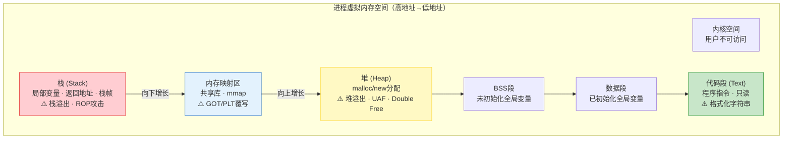
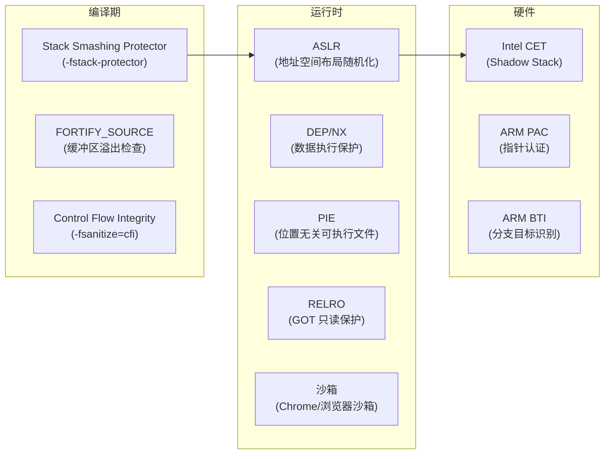
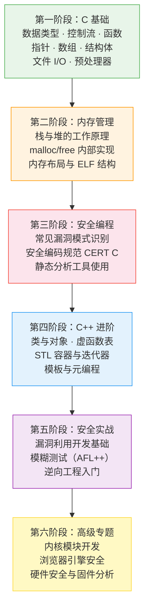

## 1. C/C++在安全领域的核心地位

安全研究的本质是对计算机系统底层机制的深度理解与攻防博弈，而 C/C++ 正是这场博弈的核心语言。从操作系统内核到浏览器引擎，从嵌入式固件到网络协议栈，现代计算基础设施几乎全部构建在 C/C++ 之上。这意味着：**不懂 C/C++，就无法真正理解漏洞的成因、利用的原理和防御的根基。**

### 1.1 进程内存布局与安全攻击面

理解 C/C++ 程序的内存布局是安全研究的第一步。每一个进程在运行时都拥有独立的虚拟地址空间，不同区域承担不同职责，也对应着不同类型的安全风险：



**各区域的攻击向量详解：**

| 内存区域 | 存储内容 | 典型漏洞类型 | 攻击原理 |
|----------|---------|-------------|---------|
| 栈 (Stack) | 局部变量、函数参数、返回地址、保存的寄存器 | 栈缓冲区溢出、栈帧劫持、格式化字符串 | 向栈上缓冲区写入超长数据，覆盖返回地址，劫持控制流 |
| 堆 (Heap) | 动态分配的对象、大型数据结构 | Use-After-Free、Double Free、堆溢出、堆喷射 | 释放后继续使用指针，或利用分配器元数据损坏执行任意代码 |
| BSS/Data | 全局变量、静态变量 | 全局缓冲区溢出、未初始化变量利用 | 覆写全局指针或函数表，未初始化变量可能泄露栈内容或堆地址 |
| 代码段 (Text) | 程序指令、常量字符串 | 格式化字符串攻击（%n写入） | 利用 printf 系列函数的 %n 格式符向任意地址写入数据 |
| 内存映射区 | 共享库（.so/.dll）、mmap 映射 | GOT/PLT 覆写、共享库注入 | 覆写全局偏移表(GOT)中的函数地址，使下次调用该函数时跳转到攻击者控制的代码 |
| 内核空间 | 内核代码和数据 | 内核提权、系统调用劫持 | 通过内核漏洞获取 Ring 0 权限，完全控制目标系统 |

### 1.2 为什么安全研究者必须掌握 C/C++

C/C++ 不是"可选的技能"，而是安全研究的**必要条件**。以下从六个维度论证其不可替代性：

#### 1.2.1 操作系统：全部用 C 构建

Linux 内核约 2800 万行 C 代码，Windows 内核同样以 C 为主。macOS/Darwin 的 XNU 内核混合了 C 和少量 C++。这意味着：

- **内核漏洞研究**（CVE 分析、提权利用）完全依赖 C 知识
- **系统调用分析**需要理解 C 的 ABI（Application Binary Interface）
- **驱动程序逆向**的输出就是 C 代码

实际案例：2016 年的 Dirty COW（CVE-2016-5195）是 Linux 内核中一个存在了 9 年的竞争条件漏洞，影响所有基于 Linux 的系统（包括 Android）。漏洞代码仅涉及 `get_user_pages()` 函数中的几行 C 代码，但理解和利用它需要深入理解内核内存管理的 C 实现。

#### 1.2.2 浏览器安全：C++ 的主战场

三大浏览器引擎全部用 C++ 编写：

| 浏览器引擎 | 语言 | 代码规模 | 代表性 CVE |
|-----------|------|---------|-----------|
| Chromium (V8/Blink) | C++ | ~2500 万行 | CVE-2023-2033 (V8 类型混淆) |
| Firefox (Gecko/SpiderMonkey) | C++/Rust | ~2100 万行 | CVE-2022-26485 (XSLT UAF) |
| Safari (WebKit) | C++/Objective-C | ~800 万行 | CVE-2022-22620 (UAF) |

浏览器漏洞是最高价值的目标之一：一个 Chrome 0day 在黑市上的价格可达 50 万到 250 万美元（Zerodium 2024 报价）。研究这些漏洞必须精通 C++ 的内存模型、虚函数表、智能指针机制。

#### 1.2.3 恶意软件分析：读懂攻击者的代码

根据 Recorded Future 和各类威胁情报报告，超过 90% 的系统级恶意软件（远控木马、勒索软件、Rootkit、Bootkit）使用 C 或 C++ 编写。原因很简单：

- **性能**：恶意软件需要最小化资源占用以避免被发现
- **可控性**：直接操作系统 API，无需运行时依赖
- **反检测**：编译后的二进制代码比脚本语言更难分析

分析恶意软件时，你需要在 IDA Pro 或 Ghidra 中阅读反编译的 C 代码，理解其网络通信协议、文件加密算法、持久化机制。不懂 C，就无法完成这项工作。

#### 1.2.4 漏洞利用开发：从 PoC 到 Weaponized Exploit

漏洞利用开发是安全研究的高阶领域，几乎完全基于 C/C++：

- **Shellcode 编写**：必须使用 C 或汇编，精确控制每一条指令
- **ROP（Return-Oriented Programming）链**：需要理解函数调用约定和栈布局
- **堆风水（Heap Feng Shui）**：需要深入理解 malloc/new 的分配算法
- **沙箱逃逸**：需要理解进程间通信和系统调用机制

一个典型的漏洞利用开发流程：

```text
漏洞发现 → PoC 触发崩溃 → 分析崩溃现场（寄存器、栈、堆）
→ 确定利用原语（读/写/执行） → 绕过缓解措施（ASLR、DEP、CFI）
→ 编写稳定利用 → 测试多环境兼容性
```

每一步都需要 C/C++ 知识。例如，绕过 ASLR 需要通过信息泄露获取内存地址，这通常涉及格式化字符串漏洞或类型混淆漏洞的 C/C++ 细节。

#### 1.2.5 安全工具开发：基础设施的语言选择

主流安全工具几乎全部用 C/C++ 编写或底层依赖 C/C++：

| 工具 | 用途 | 核心语言 |
|------|------|---------|
| Nmap | 网络扫描与服务识别 | C/C++ |
| Wireshark | 网络流量分析 | C/C++ |
| Metasploit | 漏洞利用框架 | Ruby + C |
| GDB/LLDB | 调试器 | C/C++ |
| Valgrind | 内存错误检测 | C |
| AFL++ | 模糊测试 | C |
| Hashcat | 密码破解 | C |
| Binwalk | 固件分析 | C + Python |
| radare2 | 逆向工程框架 | C |

即使你使用 Python 等高级语言编写安全工具，底层的性能关键部分（如包解析、加密运算、模糊测试引擎）仍然需要用 C/C++ 实现或通过 FFI 调用 C 库。

#### 1.2.6 逆向工程：反汇编的终点是 C

逆向工程的核心任务是将二进制代码还原为可理解的高级语言表示，而这个表示几乎总是 C/C++：

```text
机器码 → 反汇编（汇编语言） → 反编译（C 伪代码） → 理解逻辑
```

IDA Pro 的 Hex-Rays 反编译器、Ghidra 的反编译器、Binary Ninja 的 HLIL，输出的都是类 C 的伪代码。如果你不懂 C 的指针运算、结构体内存布局、函数调用约定、位域操作，就无法正确解读反编译结果。

### 1.3 C 与 C++ 的关系与安全研究分工

#### 1.3.1 语言演进概览

```cpp
C 语言（1972，Dennis Ritchie，Bell Labs）
│  设计目标：替代汇编编写 Unix 操作系统
│  特征：过程式、手动内存管理、极简抽象、直接映射硬件
│  标准演进：K&R C → ANSI C89 → C99 → C11 → C17 → C23
│
└── C++（1983，Bjarne Stroustrup，Bell Labs）
     设计目标：C + 类 + 引用 + 类型检查增强
     特征：多范式（OOP/泛型/函数式）、STL、RAII、模板元编程
     标准演进：C++98 → C++03 → C++11 → C++14 → C++17 → C++20 → C++23
     安全相关的语言特性：
       ├── RAII（自动资源管理，减少内存泄漏）
       ├── 智能指针（unique_ptr/shared_ptr/weak_ptr）
       ├── std::string/std::vector（替代裸数组）
       ├── 引用（减少指针滥用）
       └── 异常处理（错误传播机制）
```

#### 1.3.2 安全研究中的分工

C 和 C++ 在安全研究中的侧重点不同，但并非互相替代的关系：

| 研究领域 | 主要语言 | 原因 |
|----------|---------|------|
| 操作系统内核安全 | C | Linux/Windows 内核用 C 编写 |
| 嵌入式/IoT 固件安全 | C | 资源受限环境使用 C |
| Shellcode 与底层利用 | C + 汇编 | 需要精确控制二进制输出 |
| 网络协议安全 | C | 网络栈实现用 C |
| 浏览器安全 | C++ | 浏览器引擎用 C++ |
| 应用程序逆向 | C/C++ | 目标程序可能是任一种 |
| 恶意软件分析 | C/C++ | 恶意软件可能用任一种 |
| 漏洞利用框架开发 | C++ | 需要复杂数据结构和抽象 |

#### 1.3.3 C 的安全弱点恰恰是学习价值所在

C 没有边界检查、没有自动内存管理、没有类型安全的字符串操作。这些"缺陷"恰恰让 C 成为学习安全的最佳语言：

```c
// C 的危险性：以下代码都有安全问题，但理解它们就是理解安全的基础

// 1. 栈缓冲区溢出
void vulnerable_function(char *input) {
    char buffer[64];
    strcpy(buffer, input);  // 无边界检查，input 超过 64 字节就溢出
}

// 2. 格式化字符串漏洞
void format_string_bug(char *user_input) {
    printf(user_input);  // 用户可以插入 %x, %n 等格式符
    // 正确写法：printf("%s", user_input);
}

// 3. 整数溢出导致堆溢出
void integer_overflow(size_t count) {
    // 如果 count = SIZE_MAX/2 + 1，则 count * 2 溢出为 0
    char *buf = malloc(count * 2);  // 分配了 0 字节
    memset(buf, 0, count * 2);      // 写入大量数据到 0 字节的缓冲区
}

// 4. Use-After-Free
void uaf_example() {
    char *ptr = malloc(100);
    free(ptr);
    // ptr 仍然指向已释放的内存
    strcpy(ptr, "attacker data");  // 写入已释放的堆块
}

// 5. Double Free
void double_free() {
    char *ptr = malloc(100);
    free(ptr);
    free(ptr);  // 同一块内存释放两次，破坏分配器元数据
}
```

每一种漏洞类型背后都有深刻的安全原理。掌握 C 的危险性，就是掌握安全研究的核心。

### 1.4 C/C++ 安全漏洞的历史影响

回顾安全史上最具影响力的漏洞，绝大多数都与 C/C++ 有关：

| 年份 | 漏洞名称 | CVE | 类型 | 影响范围 | 语言 |
|------|---------|-----|------|---------|------|
| 1988 | Morris Worm | — | 缓冲区溢出 (fingerd) | 6000 台计算机（当时互联网 10%） | C |
| 2001 | Code Red | CVE-2001-0500 | 缓冲区溢出 (IIS) | 35.9 万台服务器 | C |
| 2003 | Slammer Worm | CVE-2002-0649 | 缓冲区溢出 (SQL Server) | 7.5 万台服务器，10 分钟内全球传播 | C |
| 2008 | Debian OpenSSL 漏洞 | CVE-2008-0166 | 弱随机数生成 | 所有 Debian/Ubuntu 生成的 SSH 密钥可预测 | C |
| 2014 | Heartbleed | CVE-2014-0160 | 缓冲区越界读取 (OpenSSL) | 全球 17% 的 HTTPS 服务器 | C |
| 2014 | Shellshock | CVE-2014-6271 | 代码注入 (Bash) | 所有 Unix/Linux 系统 | C |
| 2016 | Dirty COW | CVE-2016-5195 | 竞争条件 (Linux 内核) | 所有 Linux 系统，包括 Android | C |
| 2017 | EternalBlue | CVE-2017-0144 | 缓冲区溢出 (SMB) | WannaCry 勒索软件的基础，影响全球 | C |
| 2019 | BlueKeep | CVE-2019-0708 | 远程代码执行 (RDP) | 数百万 Windows 系统 | C |
| 2021 | Log4Shell | CVE-2021-44228 | JNDI 注入 (Java) | 虽然是 Java，但底层依赖 C 编写的 JNI 库 | C/Java |
| 2023 | Citrix Bleed | CVE-2023-4966 | 缓冲区越界读取 | 企业级 VPN 设备 | C |
| 2024 | XZ Utils 后门 | CVE-2024-3094 | 供应链攻击 | 几乎所有 Linux 发行版的 SSH | C |

这些案例说明了一个残酷的事实：**C/C++ 的内存不安全性不是一个学术问题，而是持续造成数十亿美元损失的现实威胁。**

### 1.5 现代安全缓解措施概览

操作系统和编译器厂商针对 C/C++ 的内存安全问题开发了一系列缓解技术。理解这些缓解措施是漏洞利用开发的必备知识：



| 缓解措施 | 保护目标 | 已知绕过技术 |
|----------|---------|-------------|
| Stack Canary | 防止栈缓冲区溢出覆盖返回地址 | 泄露 canary 值、信息泄露漏洞 |
| ASLR | 随机化内存布局，阻止跳转到已知地址 | 信息泄露、部分覆盖、侧信道 |
| DEP/NX | 阻止数据段代码执行 | ROP、JOP、ret2libc |
| PIE | 随机化可执行文件基址 | 信息泄露、部分覆盖 |
| RELRO (Full) | 使 GOT 表只读 | 覆写 __free_hook 等其他钩子 |
| CFI | 验证间接调用目标的合法性 | 构造合法的 gadget、利用 CFI 实现缺陷 |
| Shadow Stack (CET) | 硬件保护返回地址 | 需要更复杂的攻击技术 |

### 1.6 C/C++ 与现代安全语言的对比

近年来，Rust、Go、Zig 等语言试图在系统编程领域替代 C/C++。理解它们的优劣有助于做出技术选择：

| 维度 | C | C++ | Rust | Go | Zig |
|------|---|-----|------|-----|-----|
| 内存安全 | 无保护 | 部分（RAII/智能指针） | 所有权系统（编译期保证） | GC（运行时） | 部分（可选安全检查） |
| 性能 | 极致 | 极致 | 接近 C | 较好（GC 暂停） | 接近 C |
| 现有安全代码库 | 最多 | 很多 | 增长中 | 少 | 极少 |
| 学习曲线 | 中等 | 陡峭 | 陡峭 | 平缓 | 中等 |
| 安全研究价值 | 最高 | 高 | 中等（新兴） | 低 | 中等（新兴） |
| 内核开发 | 首选 | 不适用 | 正在进入 Linux 内核 | 不适用 | 不适用 |
| 浏览器引擎 | 不适用 | 首选 | Servo/部分 Firefox | 不适用 | 不适用 |

**关键结论：**

- **Rust 的安全性**：Rust 的所有权系统在编译期消除了大部分内存安全问题。Linux 内核已开始接受 Rust 代码，Android 的蓝牙栈已用 Rust 重写。但大量遗留代码仍然是 C/C++，安全研究者仍需掌握后者。
- **Go 的定位**：Go 的 GC 使其不适合底层安全工具开发，但非常适合编写安全工具的控制层和 Web 接口。
- **现实是**：即使 Rust 在新项目中逐步替代 C/C++，现有的数十亿行 C/C++ 代码不会消失。安全研究者需要面对的是**现实中的代码**，而不是理想中的代码。

### 1.7 学习路线图

针对安全研究者的 C/C++ 学习路径，按阶段递进：



**每个阶段的核心产出：**

| 阶段 | 核心技能 | 实践项目 |
|------|---------|---------|
| 第一阶段 | 阅读和编写 C 程序 | 实现简易 shell、文件加密工具 |
| 第二阶段 | 理解进程内存模型 | 手动分析 core dump、阅读 GDB 输出 |
| 第三阶段 | 识别和报告漏洞 | 使用 AddressSanitizer 发现内存错误 |
| 第四阶段 | 阅读 C++ 代码 | 逆向分析 C++ 程序的虚函数调用链 |
| 第五阶段 | 编写 PoC 和利用 | 参加 CTF PWN 赛题、AFL 模糊测试 |
| 第六阶段 | 领域专精 | 内核模块开发、浏览器 fuzzing |

### 1.8 常见误区与纠正

| 误区 | 正确理解 |
|------|---------|
| "安全研究只需要会用工具，不需要懂 C" | 工具的底层实现就是 C，不懂原理只能做脚本小子 |
| "C++ 比 C 安全，所以学 C++ 就够了" | C++ 的 STL 和 RAII 降低了部分风险，但底层内存操作同样危险，且大量目标代码是纯 C |
| "学 Python 就能做安全" | Python 是胶水语言，适合编写自动化脚本和工具接口，但无法替代对底层机制的理解 |
| "内存安全语言会淘汰 C/C++ 安全研究" | 现有数十亿行 C/C++ 代码不会消失，且内存安全语言本身也有安全问题（逻辑漏洞、供应链攻击） |
| "背下漏洞类型就能做安全" | 漏洞利用是工程问题，同样的漏洞在不同环境、不同缓解措施下的利用方式完全不同 |
| "只需要关注用户态，内核太难" | 内核提权是高价值攻击路径，且内核漏洞的密度通常高于用户态 |

### 1.9 本章小结

C/C++ 在安全领域的核心地位源于三个事实：

1. **基础设施依赖**：操作系统、浏览器、网络栈、嵌入式设备的实现语言是 C/C++
2. **漏洞根源**：绝大多数高危漏洞（缓冲区溢出、UAF、整数溢出）是 C/C++ 特有的内存安全问题
3. **工具链基础**：安全工具、调试器、反编译器的核心都是 C/C++ 实现

掌握 C/C++ 不是为了写更多 C/C++ 代码，而是为了**理解系统的真实运行方式**。当你可以读懂反编译的 C 代码、手动分析 core dump、编写利用 PoC 时，你才真正进入了安全研究的核心领域。

在接下来的章节中，我们将从 C 语言的基础语法开始，逐步深入到内存管理、漏洞原理和利用技术，最终建立完整的 C/C++ 安全研究能力体系。
