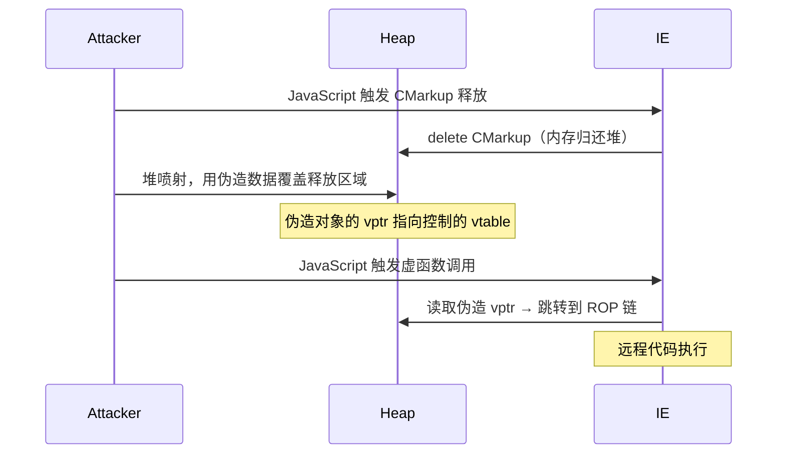
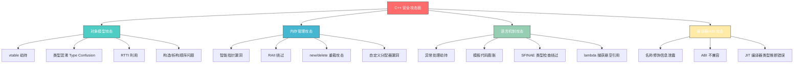

## 8. C++安全相关知识

C 语言的安全问题（栈溢出、格式化字符串等）在前几章已有系统讲解。本节聚焦 **C++ 特有的安全攻击面**——虚函数表（vtable）、类型混淆（Type Confusion）、对象生命周期、异常处理、RTTI、智能指针等。这些攻击面是浏览器漏洞、游戏引擎漏洞、数据库漏洞的核心成因，也是 CTF PWN 题中高难度方向的基础。

> **定位**：本节假设读者已理解 C 语言内存模型和基础溢出技术。如果对栈帧结构、GOT/PLT 机制不熟悉，建议先完成前面章节的学习。

### 8.1 虚函数表（vtable）：C++ 多态的底层实现

C++ 的虚函数机制是面向对象多态的基石，也是攻击者劫持控制流的高价值目标。理解 vtable 的内存布局，是理解后续所有 C++ 特定漏洞类型的前提。

#### 8.1.1 vtable 的内存布局

当一个类包含虚函数时，编译器会为该类生成一个**虚函数表（vtable）**——一个函数指针数组，存储在只读数据段（`.rodata`）。每个包含虚函数的对象实例的头部会插入一个**虚表指针（vptr）**，指向其所属类的 vtable。

```cpp
class Base {
public:
    virtual void func1() { printf("Base::func1\n"); }
    virtual void func2() { printf("Base::func2\n"); }
};

class Derived : public Base {
public:
    void func1() override { printf("Derived::func1\n"); }
    virtual void func3() { printf("Derived::func3\n"); }
};
```

内存布局如下：

```text
Base 的 vtable（位于 .rodata）：
┌────────────────────────────────┐
│  [0] &Base::func1              │
│  [1] &Base::func2              │
└────────────────────────────────┘

Derived 的 vtable（位于 .rodata）：
┌────────────────────────────────┐
│  [0] &Derived::func1           │  ← 覆盖了 Base::func1
│  [1] &Base::func2              │  ← 未覆盖，沿用基类
│  [2] &Derived::func3           │  ← 新增虚函数
└────────────────────────────────┘

对象实例（位于栈或堆）：
Base obj:     [vptr] → Base::vtable
Derived obj:  [vptr] → Derived::vtable
```

编译器在调用 `obj->func1()` 时生成的汇编大致为：

```asm
; obj->func1() 的调用过程
mov  rax, [obj]          ; 读取 vptr（对象首 8 字节）
mov  rax, [rax]          ; 从 vtable 读取 func1 的地址（vtable[0]）
call rax                 ; 调用虚函数
```

**安全意义**：如果攻击者能修改 vptr 或 vtable 中的函数指针，就能将虚函数调用重定向到任意地址，实现**控制流劫持**。这比覆盖栈上的返回地址更加灵活——vtable 攻击不依赖栈布局，且可以在堆上触发。

#### 8.1.2 vtable 劫持的攻击手法

**手法一：覆盖 vptr（vptr Overwrite）**

当堆溢出或 UAF 漏洞允许修改对象内容时，攻击者可以覆盖对象头部的 vptr，使其指向攻击者伪造的 vtable：

```cpp
// 攻击伪代码
// 假设存在堆溢出，可以覆盖相邻对象的 vptr
// 步骤：
// 1. 在可控内存区域构造伪造的 vtable
// 2. 将目标对象的 vptr 修改为伪造 vtable 的地址
// 3. 当程序调用虚函数时，跳转到攻击者指定的地址

// 伪造的 vtable
void* fake_vtable[] = {
    (void*)system,     // func1 的位置被替换为 system
    (void*)exit        // func2 的位置被替换为 exit
};

// 覆盖对象的 vptr 指向 fake_vtable
// 当程序调用 obj->func1() 时，实际调用的是 system()
```

**手法二：覆写 vtable 条目（Vtable Entry Overwrite）**

如果 vtable 所在的内存可写（某些情况下编译器选项或链接器行为导致 vtable 不在只读段），攻击者可以直接修改 vtable 中的函数指针。不过在现代系统中，vtable 通常位于 `.rodata` 段且受 RELRO 保护，这种手法的可行性较低。

**手法三：Use-After-Free + 虚函数调用**

这是浏览器漏洞中最常见的攻击模式。当一个包含虚函数的对象被 `delete` 后，如果程序仍持有该对象的指针并调用虚函数，攻击者可以通过堆喷射（Heap Spraying）在被释放的内存位置布置伪造的对象和 vtable：

```cpp
// UAF + vtable 劫持的简化模型
class Widget {
public:
    virtual void execute() { /* 正常逻辑 */ }
};

Widget* ptr = new Widget();
delete ptr;          // 对象被释放，但 ptr 未置空

// 攻击者在此处分配内存，覆盖释放的区域
// 布置伪造的对象，其 vptr 指向伪造的 vtable

ptr->execute();      // UAF：调用攻击者控制的虚函数
```

#### 8.1.3 真实漏洞案例：CVE-2014-1776（IE11 UAF）

微软 Internet Explorer 11 的 CMarkup 对象存在 UAF 漏洞。攻击者通过 JavaScript 触发对象释放，然后在相同内存位置重新分配精心构造的数据，当程序再次通过虚函数调用该对象时，执行流被重定向到 ROP 链，最终实现远程代码执行。

**攻击流程**：



#### 8.1.4 vtable 在安全研究中的实战工具

```bash
# 使用 GDB + pwndbg 查看 vtable
pwndbg> vtable <address>       # 查看地址处对象的 vtable 内容
pwndbg> vfunc <address>        # 列出虚函数地址

# 使用 readelf 查看 vtable 符号
readelf -s ./binary | grep vtable
# 输出示例：
#  123: 0000000000404040     8 OBJECT  GLOBAL DEFAULT   15 _ZTV4Base
# _ZTV 表示 vtable（virtual table），4Base 是 Base 类的 mangled name

# 使用 Ghidra/IDA 查看虚函数调用
# IDA 中 Ctrl+X 在 vtable 条目上交叉引用
# Ghidra 中查看 Class 结构可以看到虚函数布局
```

### 8.2 类型混淆（Type Confusion）

类型混淆是 C++ 中仅次于 vtable 劫持的第二大安全威胁。当程序错误地将一种类型的对象当作另一种类型使用时，对象内部数据的解释方式发生变化，可能导致内存越界读写或控制流劫持。

#### 8.2.1 类型混淆的原理

C++ 的类型系统在运行时并非完全安全。`static_cast`、`reinterpret_cast`、C 风格强制类型转换都不会进行运行时类型检查。只有 `dynamic_cast` 会检查，但它依赖 RTTI 且有性能开销，很多项目会关闭 RTTI（`-fno-rtti`）。

```cpp
// 类型混淆的基本示例
class Animal {
public:
    virtual void speak() { printf("...\n"); }
    int age;
};

class Dog : public Animal {
public:
    void speak() override { printf("Woof!\n"); }
    char name[32];       // 派生类新增成员
};

class Cat : public Animal {
public:
    void speak() override { printf("Meow!\n"); }
    int* dangerous_ptr;  // 派生类新增成员（不同类型）
};

// 类型混淆：将 Dog* 当作 Cat* 使用
Dog* dog = new Dog();
Cat* cat = reinterpret_cast<Cat*>(dog);
cat->dangerous_ptr;  // 实际读取的是 dog->name 的前 8 字节作为指针
```

**安全影响**：如果 `dog->name` 的内容可控（比如用户输入），那么 `cat->dangerous_ptr` 就是一个被攻击者控制的指针。后续对 `dangerous_ptr` 的解引用将导致任意地址读写。

#### 8.2.2 浏览器中的类型混淆

浏览器是类型混淆的重灾区。JavaScript 引擎和 DOM 对象大量使用 C++ 的类继承体系，当 JavaScript 层面的类型检查与 C++ 层面的对象类型不一致时，就会产生类型混淆漏洞。

**V8 引擎中的典型模式**：

```cpp
// 简化的 V8 对象类型混淆模型
class JSObject {
    Map* map;          // 类型描述符（hidden class）
    // ... 其他字段
};

class JSArray : public JSObject {
    uint32_t length;
    double* elements;  // 指向数组元素
};

class JSTypedArray : public JSObject {
    void* buffer;      // 底层 ArrayBuffer
    size_t byte_length;
};

// 如果引擎在优化代码中假设某个 JSObject* 总是 JSArray*
// 但实际运行时它变成了 JSTypedArray*
// 那么对 length 和 elements 的访问就会读取错误的偏移量
// 导致越界读写
```

**CVE-2018-4464（Safari JSC 类型混淆）**：WebKit 的 JavaScriptCore 引擎中，`DFG` JIT 编译器对某些操作的类型推断存在缺陷。攻击者可以通过精心构造的 JavaScript 代码使 JIT 编译器生成错误的优化代码，将一个非数组对象当作数组访问，实现越界读写，最终获取任意代码执行。

#### 8.2.3 类型混淆的检测方法

```bash
# 静态分析：查找危险的强制类型转换
grep -rn "reinterpret_cast" --include="*.cpp" --include="*.h" src/
grep -rn "static_cast" --include="*.cpp" --include="*.h" src/
grep -rn "dynamic_cast" --include="*.cpp" --include="*.h" src/

# 查找 C 风格的强制类型转换（更容易出问题）
grep -rn "(\w+\s*\*)" --include="*.cpp" src/  # 匹配 (Type*) 模式

# 使用 Clang Static Analyzer
scan-build make

# 使用 UBSan 在运行时检测类型混淆
# UBSan 的 vptr 检查可以捕获对象虚表不匹配的情况
g++ -fsanitize=undefined -fsanitize=vptr -o test test.cpp
```

### 8.3 异常处理机制的安全问题

C++ 的异常处理（`try`/`catch`/`throw`）引入了复杂的栈展开（Stack Unwinding）和异常处理链（Exception Handling Chain）机制。这些机制在内存中维护额外的数据结构，为攻击者提供了新的利用路径。

#### 8.3.1 异常处理的底层机制

在 Linux 上，C++ 异常处理基于 DWARF 异常处理框架（Itanium C++ ABI）。关键数据结构包括：

```cpp
异常处理流程：
1. throw 异常 → 调用 __cxa_throw()
2. __cxa_throw() 创建异常对象，调用 _Unwind_RaiseException()
3. _Unwind_RaiseException() 遍历调用栈，查找匹配的 catch 块
4. 找到匹配 → 执行栈展开 → 跳转到 catch 块
5. 未找到 → 调用 std::terminate()

栈展开过程：
┌─────────────────────────┐
│  catch 块               │  ← 最终跳转到这里
├─────────────────────────┤
│  try 块                 │  ← 异常发生处
├─────────────────────────┤
│  函数 A（有清理代码）    │  ← 展开时调用析构函数
├─────────────────────────┤
│  函数 B（有清理代码）    │  ← 展开时调用析构函数
└─────────────────────────┘
```

#### 8.3.2 异常处理的攻击面

**攻击面一：覆盖异常处理相关的栈数据**

如果栈溢出可以覆盖与异常处理相关的数据（如 `.eh_frame` 段的解析数据或 LSDA——Language Specific Data Area），攻击者可以在异常触发时劫持控制流：

```cpp
void vulnerable() {
    char buffer[64];
    // 栈溢出可以覆盖 buffer 后面的数据
    gets(buffer);  // 危险函数

    // 如果溢出覆盖了异常处理的上下文数据
    // 当下面的 throw 触发时，栈展开过程可能跳转到攻击者控制的地址
    if (error_condition) {
        throw std::runtime_error("error");
    }
}
```

**攻击面二：利用析构函数调用**

栈展开过程中会自动调用局部对象的析构函数。如果攻击者能控制析构函数的调用目标（通过覆盖对象的 vptr），就能在异常处理过程中执行任意代码：

```cpp
void vulnerable() {
    SmartObject obj;  // 有虚析构函数的对象
    char buffer[64];

    // 栈溢出覆盖 obj 的 vptr
    gets(buffer);

    // 如果这里触发异常，栈展开会调用 obj 的析构函数
    // vptr 已被覆盖 → 析构函数调用被劫持
    risky_operation();  // 可能抛出异常
}
```

**攻击面三：C++11 的 `noexcept` 与 `std::terminate`**

当异常传播到 `noexcept` 函数时，程序会调用 `std::terminate()`，后者默认调用 `abort()`。攻击者可以通过覆盖 `std::terminate_handler` 或 `__terminate` 的函数指针来劫持执行流。

#### 8.3.3 实验：观察异常处理的栈布局

```cpp
// exception_demo.cpp
// 编译：g++ -o demo exception_demo.cpp -no-pie -g
#include <cstdio>
#include <stdexcept>

class Guard {
public:
    Guard() { printf("Guard constructed at %p\n", this); }
    ~Guard() { printf("Guard destructed at %p\n", this); }
    virtual void action() { printf("Guard::action\n"); }
};

void inner() {
    Guard g;
    throw std::runtime_error("test exception");
}

void outer() {
    try {
        inner();
    } catch (const std::exception& e) {
        printf("Caught: %s\n", e.what());
    }
}

int main() {
    outer();
    return 0;
}
```

用 GDB 调试这个程序，在 `throw` 处设断点，可以观察到：

```bash
gdb ./demo
(gdb) break inner
(gdb) run
(gdb) info locals           # 查看局部变量
(gdb) x/30xg $rsp           # 查看栈帧内容
(gdb) disassemble           # 查看异常处理相关的函数调用
(gdb) watch *(void**)($rsp) # 监视栈上指针的变化
```

### 8.4 RTTI（运行时类型信息）的安全影响

RTTI（Run-Time Type Information）是 C++ 提供的运行时类型识别机制，主要通过 `typeid` 和 `dynamic_cast` 使用。RTTI 数据结构中包含类名字符串和类继承关系信息。

#### 8.4.1 RTTI 的内存布局

```text
typinfo 对象布局（Itanium ABI）：
┌──────────────────────────┐
│  vptr (指向 __cxx...)    │
├──────────────────────────┤
│  name_ptr → 类名字符串   │  ← 指向 mangled 类名
├──────────────────────────┤
│  parent_class_ptr        │  ← 指向父类的 typeinfo
└──────────────────────────┘

vtable 与 RTTI 的关系：
vtable[-1] 指向对应类的 typeinfo 对象
```

#### 8.4.2 RTTI 的安全影响

**信息泄露**：RTTI 中的类名字符串可以泄露程序的内部结构和类层次关系。逆向工程师可以通过 RTTI 重建类继承体系，快速理解程序架构：

```bash
# 使用 rtti.py（IDA/Ghidra 插件）提取 RTTI
# 或手动搜索 typeinfo 符号
readelf -s ./binary | grep _ZTI | head -20
# 输出示例：
# _ZTI9Exception  → typeinfo for Exception
# _ZTI10BaseObject → typeinfo for BaseObject

# 还原 C++ 类名
echo "_ZTI9Exception" | c++filt
# 输出：typeinfo for Exception
```

**利用 RTTI 结构**：在某些攻击场景中，攻击者可以利用 RTTI 的 `typeinfo` 对象来绕过类型检查。如果能修改 `typeinfo` 指针，可以使 `dynamic_cast` 返回错误的类型，或使 `catch` 块匹配错误的异常类型。

#### 8.4.3 禁用 RTTI 的安全考量

```bash
# 编译时禁用 RTTI
g++ -fno-rtti -o binary source.cpp

# 禁用 RTTI 的影响：
# - dynamic_cast 不可用（编译错误）
# - typeid 不可用（编译错误）
# - 类型信息减少，逆向难度增加
# - 二进制体积减小
# - 但不意味着类型混淆风险降低（编译器不强制类型安全）
```

> **安全实践**：禁用 RTTI 可以减少信息泄露，但不能替代安全的类型管理。真正的防御在于避免不安全的类型转换。

### 8.5 C++ 对象生命周期与析构安全

C++ 的 RAII（Resource Acquisition Is Initialization）机制要求对象在销毁时自动释放资源。对象的构造和析构顺序在复杂的继承体系中容易出错，导致安全漏洞。

#### 8.5.1 析构顺序问题

```cpp
class Base {
public:
    Base() { printf("Base::Base\n"); buffer = new char[64]; }
    ~Base() { printf("Base::~Base\n"); delete[] buffer; }
    char* buffer;
};

class Derived : public Base {
public:
    Derived() { printf("Derived::Derived\n"); extra = new char[128]; }
    ~Derived() { printf("Derived::~Derived\n"); delete[] extra; }
    char* extra;
};

// 如果 Base 的析构函数不是 virtual，通过基类指针删除派生类对象：
Base* ptr = new Derived();
delete ptr;  // 只调用 Base::~Base()，不调用 Derived::~Derived()
             // extra 指针泄漏（128 字节）
             // 如果 extra 中有敏感数据，也不会被清理
```

**安全影响**：

1. **资源泄漏**：派生类的资源未被释放，长期运行的程序（服务器、浏览器）中累积泄漏可能导致内存耗尽
2. **敏感数据残留**：包含密钥、密码的对象析构不完整，敏感数据残留在内存中
3. **双重释放**：如果派生类在析构函数中有额外的释放逻辑被跳过，后续可能触发重复释放

#### 8.5.2 构造函数中的虚函数调用陷阱

```cpp
class Base {
public:
    Base() {
        printf("Base::Base - calling init()\n");
        init();  // 危险！在构造函数中调用虚函数
    }
    virtual void init() { printf("Base::init\n"); }
};

class Derived : public Base {
public:
    Derived() { printf("Derived::Derived\n"); }
    void init() override { printf("Derived::init - accessing members\n"); }
};

// 创建 Derived 对象时：
// 1. 先调用 Base::Base()
// 2. 在 Base::Base() 中调用 init()
// 3. 此时 Derived 部分还未构造，vptr 指向 Base 的 vtable
// 4. 实际调用的是 Base::init()，不是 Derived::init()
// 5. 如果 Derived::init() 依赖 Derived 的成员变量 → 未初始化的内存
```

**安全影响**：在构造期间，虚函数调用不会分派到派生类的实现。如果开发者期望 `init()` 被派生类覆盖，但实际上基类版本被调用，可能导致初始化逻辑不完整，产生未初始化内存的使用。

#### 8.5.3 多重继承下的析构问题

```cpp
class A {
public:
    virtual ~A() {}
    int* data;
};

class B {
public:
    virtual ~B() {}
    int* buffer;
};

class C : public A, public B {
public:
    ~C() override { /* 清理 */ }
};

// C 对象在内存中有两个 vptr：
// [vptr_A] [A::data] [vptr_B] [B::buffer]
//         ↑ 偏移 0            ↑ 偏移 16（64 位系统）

// 如果通过 B* 指针删除 C 对象，编译器需要调整 this 指针
// 如果调整逻辑有 bug → 析构不完整
```

### 8.6 智能指针的安全问题

C++11 引入的智能指针（`unique_ptr`、`shared_ptr`、`weak_ptr`）旨在解决手动内存管理的问题。但它们本身也可能成为攻击目标。

#### 8.6.1 shared_ptr 的引用计数攻击

`shared_ptr` 内部维护一个控制块（control block），包含引用计数和弱引用计数：

```text
shared_ptr 内存结构：
┌─────────────────┐     ┌───────────────────┐
│ shared_ptr 对象  │     │ 控制块             │
│  - ptr → 实例   │     │  - strong_count=2  │
│  - ctrl → 控制块 │────→│  - weak_count=1    │
└─────────────────┘     │  - deleter         │
                        │  - allocator       │
                        └───────────────────┘
```

**攻击手法：引用计数溢出**

```cpp
// 如果引用计数存储在可控内存中
// 通过堆溢出覆盖控制块的引用计数
// 使引用计数提前归零 → 对象被过早释放
// 但仍有 shared_ptr 持有指向已释放内存的指针 → UAF

// 简化攻击模型：
// 1. 创建 shared_ptr<A> 指向堆上的对象
// 2. 堆溢出覆盖控制块的 strong_count 为 0
// 3. 任意一个 shared_ptr 析构 → 对象被释放
// 4. 后续的 shared_ptr 使用 → UAF
```

**CVE-2017-5130（libxml2 shared_ptr 问题）**：libxml2 的自定义引用计数实现存在整数溢出，当大量引用导致计数回绕为零时，对象被提前释放，触发 UAF。

#### 8.6.2 unique_ptr 的所有权转移风险

```cpp
// unique_ptr 的 move 语义
std::unique_ptr<Widget> ptr1 = std::make_unique<Widget>();
std::unique_ptr<Widget> ptr2 = std::move(ptr1);

// move 后 ptr1 为 nullptr
// 如果在 move 之前有异常被抛出，对象可能被双重管理
// C++17 的保证复制消除减少了这种情况，但 C++14 及之前仍有风险
```

#### 8.6.3 智能指针与原始指针的混用

```cpp
// 最常见的安全反模式
Widget* raw = new Widget();
std::shared_ptr<Widget> sp1(raw);
std::shared_ptr<Widget> sp2(raw);  // 错误！两个独立的控制块

// sp1 和 sp2 各自的引用计数都是 1
// 当 sp1 析构时 → 引用计数归零 → delete raw
// 当 sp2 析构时 → 引用计数归零 → 再次 delete raw → 双重释放！
```

**防御规则**：

```text
安全使用智能指针的规则：
1. 永远不要从同一个原始指针创建多个 shared_ptr
2. 优先使用 make_shared / make_unique 而不是 new
3. 不要在成员函数中返回 this 的 shared_ptr（使用 enable_shared_from_this）
4. 跨模块传递智能指针时注意 ABI 兼容性
5. 避免在异常处理路径中混用智能指针和原始指针
```

### 8.7 C++ 名称修饰（Name Mangling）与逆向工程

C++ 的函数重载、命名空间、模板等特性导致编译后的符号名不能直接使用源代码中的名称。编译器通过**名称修饰（Name Mangling）**将 C++ 名称编码为唯一的符号名。

#### 8.7.1 名称修饰规则

```cpp
namespace Utils {
    class Parser {
    public:
        void parse(const char* input);
        void parse(const std::string& input);
        static int count;
    };
}

// 编译后的符号名（GCC/Clang，Itanium ABI）：
// _ZN5Utils6Parser5parseEPKc        → Utils::Parser::parse(const char*)
// _ZN5Utils6Parser5parseERKNSt7__cxx1112basic_stringIcSt11char_traitsIcESaIcEEE
// _ZN5Utils6Parser5countE            → Utils::Parser::count

// 编译后的符号名（MSVC，decorated name）：
// ?parse@Parser@Utils@@QAEXPBD@Z    → Utils::Parser::parse(const char*)
// ?count@Parser@Utils@@2HA           → int Utils::Parser::count
```

#### 8.7.2 逆向中的符号恢复

```bash
# 使用 c++filt 还原符号名
echo "_ZN5Utils6Parser5parseEPKc" | c++filt
# 输出：Utils::Parser::parse(char const*)

# 批量还原
nm ./binary | c++filt | grep Parser

# 使用 demangle 工具（Python）
python3 -c "
import subprocess
symbol = '_ZN5Utils6Parser5parseEPKc'
result = subprocess.run(['c++filt', symbol], capture_output=True, text=True)
print(result.stdout.strip())
"

# Ghidra / IDA 会自动 demangle 符号名
# 但如果二进制被 strip 过，需要通过 RTTI 和虚表结构重建类层次
```

#### 8.7.3 去除符号的反逆向手段

```bash
# strip 二进制文件，移除所有符号
strip --strip-all ./binary

# 编译时隐藏符号
g++ -fvisibility=hidden -o binary source.cpp

# 使用 -fno-rtti -fno-exceptions 减少类型信息
g++ -fno-rtti -fno-exceptions -s -o binary source.cpp

# 使用 LLVM obfuscator（Hikari/OLLVM）混淆控制流
# 进一步增加逆向难度
```

### 8.8 C++ 模板元编程的安全考量

C++ 模板在编译期展开，本身不直接产生运行时漏洞。但模板的滥用会导致代码膨胀和复杂性增加，间接增加安全风险。

#### 8.8.1 模板实例化导致的代码膨胀

```cpp
// 每个不同的模板参数组合都会生成独立的代码
template<typename T>
void process(T* data, size_t len) {
    char buffer[256];
    memcpy(buffer, data, len * sizeof(T));  // 潜在溢出
}

// process<int>、process<char>、process<double> 各生成一份代码
// 如果每份都有相同的漏洞，攻击面被放大
```

#### 8.8.2 SFINAE 与类型推断的安全隐患

```cpp
// SFINAE（Substitution Failure Is Not An Error）可能导致
// 预期的安全检查被静默跳过
template<typename T>
auto serialize(const T& obj) -> decltype(obj.to_bytes()) {
    return obj.to_bytes();  // 调用自定义序列化
}

// 如果某个类型没有 to_bytes() 方法
// SFINAE 会匹配到其他重载（可能是不安全的默认版本）
// 开发者可能没有意识到安全检查被绕过
```

### 8.9 C++ 安全编码实践

#### 8.9.1 C++11/14/17/20 中的安全特性

| 特性 | 引入版本 | 安全作用 | 使用方式 |
|------|----------|----------|----------|
| `std::unique_ptr` | C++11 | 独占所有权，防止内存泄漏 | `auto p = std::make_unique<T>()` |
| `std::shared_ptr` | C++11 | 共享所有权，自动引用计数 | `auto p = std::make_shared<T>()` |
| `std::array` | C++11 | 替代 C 数组，带边界检查（`.at()`） | `std::array<int, 10> arr` |
| `std::string_view` | C++17 | 避免不必要的字符串拷贝 | `std::string_view sv = "hello"` |
| `std::optional` | C++17 | 替代可能为 null 的指针 | `std::optional<int> opt` |
| `std::span` | C++20 | 安全的数组视图，带边界检查 | `std::span<int> sp(arr)` |
| `constexpr` | C++11/14/17 | 编译期计算，减少运行时错误 | `constexpr int size = 100` |
| `[[nodiscard]]` | C++17 | 防止忽略返回值（如错误码） | `[[nodiscard]] int check()` |
| `std::format` | C++20 | 类型安全的格式化（替代 printf） | `std::format("x={}", x)` |
| Concepts | C++20 | 约束模板参数，减少类型错误 | `template<std::integral T>` |

#### 8.9.2 危险函数的安全替代

```cpp
// ❌ 危险：缓冲区溢出
char buf[64];
strcpy(buf, user_input);       // 无长度检查
strcat(buf, suffix);           // 无长度检查
sprintf(buf, "%s", data);      // 无长度检查
gets(buf);                     // 完全不安全

// ✅ 安全替代方案一：使用 C++ 标准库
std::string safe_buf;
safe_buf = user_input;         // 自动管理内存
safe_buf += suffix;            // 自动扩展
std::string formatted = std::format("{}", data);  // C++20

// ✅ 安全替代方案二：使用安全的 C 函数
char buf[64];
strncpy(buf, user_input, sizeof(buf) - 1);
buf[sizeof(buf) - 1] = '\0';  // 确保终止
snprintf(buf, sizeof(buf), "%s", data);

// ✅ 安全替代方案三：使用 std::span (C++20) 做边界检查
void process(std::span<int> data) {
    for (size_t i = 0; i < data.size(); i++) {
        data[i] *= 2;  // 安全的边界访问
    }
}
```

#### 8.9.3 编译器安全加固选项

```bash
# 全面的安全编译选项
g++ -o binary source.cpp \
    -Wall -Wextra -Werror \           # 开启所有警告，警告即错误
    -Wformat=2 \                      # 格式化字符串检查
    -Wconversion \                    # 隐式类型转换警告
    -Wshadow \                        # 变量遮蔽警告
    -Wstack-protector \               # 栈保护
    -fstack-protector-all \           # 所有函数都加栈保护
    -fstack-clash-protection \        # 防止栈冲突攻击
    -fcf-protection=full \            # 控制流完整性（Intel CET）
    -D_FORTIFY_SOURCE=2 \             # 运行时缓冲区溢出检测
    -Wl,-z,relro,-z,now \            # Full RELRO
    -Wl,-z,noexecstack \             # NX 栈
    -pie -fPIE \                      # PIE
    -fsanitize=address \              # ASan（调试/测试用）
    -fsanitize=undefined              # UBSan（调试/测试用）
```

### 8.10 C++ 安全问题全景图



### 8.11 综合案例：C++ 对象模型漏洞的完整利用链

以下是一个综合案例，展示如何将 vtable 劫持、堆布局控制、信息泄露串联为完整的利用链：

```cpp
// vuln.cpp — 教学用途的有漏洞程序
// 编译：g++ -o vuln vuln.cpp -no-pie -fno-stack-protector
#include <cstdio>
#include <cstdlib>
#include <cstring>

class Handler {
public:
    virtual void process(const char* data) {
        printf("Processing: %s\n", data);
    }
    virtual void cleanup() {
        printf("Cleanup\n");
    }
};

class NullHandler : public Handler {
public:
    void process(const char* data) override {
        printf("NullHandler: ignoring %s\n", data);
    }
};

// 全局对象数组（堆上）
Handler* handlers[4];
char input_buffer[256];

void setup() {
    setvbuf(stdout, NULL, _IONBF, 0);
    setvbuf(stdin, NULL, _IONBF, 0);
}

int main() {
    setup();
    handlers[0] = new Handler();

    printf("Handler vtable at: %p\n", *(void**)handlers[0]);
    printf("system at: %p\n", (void*)system);

    // 漏洞：读取超长输入，溢出 input_buffer
    // 但在真实场景中，这里可能是堆溢出覆盖相邻的 handlers 数组
    printf("Enter command: ");
    gets(input_buffer);  // 危险！

    // 调用虚函数 — 如果 vptr 被控制，这里就是劫持点
    handlers[0]->process(input_buffer);

    return 0;
}
```

**利用分析**：

```text
攻击步骤：
1. 泄露 system() 的地址（程序已打印）
2. 泄露 vtable 的地址（程序已打印）
3. 在堆上伪造 vtable，将 process 条目替换为 system
4. 利用堆溢出将 handlers[0] 的 vptr 指向伪造 vtable
5. 当 handlers[0]->process(input_buffer) 执行时
   → 实际调用 system(input_buffer)
   → input_buffer 的内容作为命令执行
```

### 8.12 常见误区与纠正

| 误区 | 正确认识 |
|------|----------|
| "vtable 在 .rodata 所以不能改" | vtable 本身通常不可写，但 vptr 在对象中（栈或堆），可以被溢出覆盖 |
| "C++ 比 C 安全" | C++ 提供更多安全工具（智能指针、RAII），但引入了新的攻击面（vtable、类型混淆、异常处理） |
| "智能指针不会内存泄漏" | shared_ptr 的循环引用会导致泄漏；混用原始指针和智能指针会导致双重释放 |
| "禁用 RTTI 和异常就安全了" | 减少了信息泄露和异常攻击面，但核心的内存安全问题（溢出、UAF）不受影响 |
| "virtual 析构函数只是好习惯" | 缺少 virtual 析构函数是真实的安全漏洞来源——派生类资源未释放，可能导致 UAF |
| "类型混淆只影响浏览器" | 任何使用多态和类型转换的 C++ 代码都可能受影响，包括服务器、数据库、游戏引擎 |
| "C++ 模板是零成本所以没有安全问题" | 模板实例化可能隐藏 SFINAE 导致的安全检查绕过，且代码膨胀扩大了攻击面 |

### 8.13 进阶：自动化工具与漏洞挖掘

#### 8.13.1 使用 LibFuzzer 发现 C++ 漏洞

```cpp
// fuzz_target.cpp
#include <cstdint>
#include <cstddef>

class Parser {
public:
    // 被测函数
    bool parse(const uint8_t* data, size_t size) {
        if (size < 4) return false;
        uint32_t length = *(uint32_t*)data;
        if (length > size - 4) return false;  // 检查是否正确
        // 处理 data+4 到 data+4+length
        char buffer[64];
        memcpy(buffer, data + 4, length);  // 如果 length > 64 → 溢出
        return true;
    }
};

extern "C" int LLVMFuzzerTestOneInput(const uint8_t* data, size_t size) {
    Parser p;
    p.parse(data, size);
    return 0;
}
```

```bash
# 编译并运行 fuzzer
g++ -fsanitize=address,fuzzer -o fuzzer fuzz_target.cpp
./fuzzer -max_len=256 -jobs=4
```

#### 8.13.2 使用 AddressSanitizer 检测 UAF

```bash
# ASan 可以检测：堆溢出、栈溢出、UAF、双重释放、内存泄漏
g++ -fsanitize=address -fno-omit-frame-pointer -g -o test test.cpp
./test

# ASan 输出示例（检测到 UAF）：
# ==12345==ERROR: AddressSanitizer: heap-use-after-free on address 0x...
# READ of size 8 at 0x... thread T0
#     #0 0x... in Derived::func() test.cpp:15
#     #1 0x... in main() test.cpp:25
# 0x... is located 0 bytes inside of 64-byte region [0x...,0x...)
# freed by thread T0 here:
#     #0 0x... in operator delete(void*)
#     #1 0x... in main() test.cpp:23
```

#### 8.13.3 C++ 安全审计检查清单

```text
C++ 代码安全审计要点：

[ ] 1. 虚函数安全性
    - 所有基类是否有 virtual 析构函数
    - 虚函数调用前对象是否保证有效
    - 是否存在构造/析构期间的虚函数调用

[ ] 2. 类型安全
    - 是否存在 reinterpret_cast / C 风格强转
    - dynamic_cast 的 null 检查是否完备
    - 是否存在 union 的类型混淆使用

[ ] 3. 内存管理
    - 是否使用原始 new/delete（应改用智能指针）
    - 是否有异常安全的内存管理（异常抛出时资源是否泄漏）
    - shared_ptr 是否有循环引用

[ ] 4. 异常安全
    - 异常处理路径中是否有资源泄漏
    - 析构函数是否 noexcept（应标记）
    - 是否在析构函数中抛出异常（禁止）

[ ] 5. 输入验证
    - 所有外部输入是否在使用前验证长度和格式
    - 整数运算是否检查溢出
    - 数组/容器访问是否检查边界

[ ] 6. 并发安全
    - shared_ptr 的引用计数是否线程安全（标准库的是）
    - 对象生命周期是否跨线程管理
    - 是否有数据竞争（data race）
```

### 8.14 本节小结

C++ 相较于 C 引入了对象模型、模板、异常处理等高级特性，这些特性在提供便利的同时也显著扩展了攻击面：

| 攻击面 | 威胁等级 | 主要目标 | 防御要点 |
|--------|----------|----------|----------|
| **vtable 劫持** | 高 | 浏览器、服务器 | CFI、vtable 保护（VTGuard） |
| **类型混淆** | 高 | 浏览器 JS 引擎 | 避免不安全的强制转换 |
| **异常处理** | 中 | 有异常的程序 | noexcept、避免栈上对象被覆盖 |
| **智能指针** | 中 | 长期运行的服务 | 避免混用原始指针和智能指针 |
| **析构安全** | 中 | 复杂继承体系 | virtual 析构函数、RAII |
| **RTTI 信息泄露** | 低 | 逆向工程 | -fno-rtti |
| **模板安全** | 低 | 泛型库代码 | 审计 SFINAE 分支 |

**核心原则**：

1. **理解 C++ 的零成本抽象不是零风险抽象**——每个高级特性都有安全代价
2. **浏览器和 JS 引擎是 C++ 安全研究的前沿战场**——几乎所有 Pwn2Own 获奖漏洞都涉及 C++ 对象模型
3. **防御的根基是安全编码**——工具（ASan、CFI、智能指针）是辅助，编码习惯才是根本
4. **攻击和防御是同一枚硬币的两面**——理解攻击技术才能设计有效的防御

***
