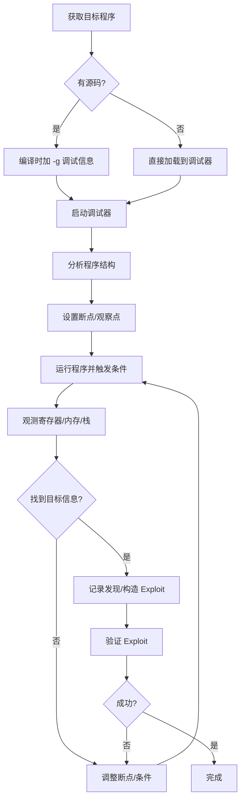

## 9. 调试工具基础

调试是安全研究的核心技能。无论是分析未知二进制程序、追踪漏洞成因、还是开发和验证 Exploit，都离不开调试器的支撑。一个熟练的安全研究者，在调试器中花费的时间可能比写代码还多。本章从调试思维讲起，系统覆盖 GDB 及其安全插件、LLDB、动态分析工具（Valgrind/Sanitizers）、Core Dump 分析、远程调试等核心内容，最终落脚到安全研究中的实战调试工作流。

### 9.1 调试的本质与方法论

#### 9.1.1 调试不仅仅是"打断点"

很多初学者对调试的理解停留在"打断点→单步执行→看变量"的循环中。对于安全研究来说，调试的本质是**对程序运行时行为的精确观测和控制**。你需要回答的问题包括：

- 程序在哪个确切的指令上崩溃了？寄存器和内存状态是什么？
- 用户输入经过了哪些处理？在哪个环节可以注入恶意数据？
- 堆上的内存布局是什么样的？能否通过溢出覆盖关键数据结构？
- GOT/PLT 表中某个函数的真实地址是什么？是否已经被修改（hook/劫持）？
- 安全保护机制（ASLR、NX、Stack Canary、PIE）的具体状态是什么？

这些问题推动了安全研究者对调试器的需求远超普通开发者。

#### 9.1.2 调试的三个层次

| 层次 | 内容 | 典型场景 | 工具 |
|------|------|----------|------|
| 源码级调试 | 在 C/C++ 源码上设断点、查看变量 | 有源码的漏洞分析 | GDB/LLDB + 调试信息 |
| 汇编级调试 | 在反汇编指令上设断点、查看寄存器和内存 | 无源码的二进制分析、Exploit 开发 | GDB + pwndbg/peda/gef |
| 内存级调试 | 直接观测和修改进程内存 | 堆利用、格式化字符串、ROP 链构造 | GDB + vmmap/hexdump |

安全研究者必须熟练掌握汇编级和内存级调试。这是和普通开发者最大的区别。

#### 9.1.3 调试工作流总览



### 9.2 GDB 完全指南

GDB（GNU Debugger）是 Linux 平台上最强大的调试器，也是安全研究的事实标准工具。它支持源码级和汇编级调试，可通过 Python 脚本扩展，并拥有庞大的插件生态。

#### 9.2.1 启动与基本操作

```bash
# 直接启动 GDB 加载程序
gdb ./program

# 安静模式（不显示启动 banner）
gdb -q ./program

# 附加到已运行的进程
gdb -p <PID>

# 使用核心转储文件调试崩溃现场
gdb ./program core.12345

# 启动时执行 GDB 命令
gdb -q -ex "break main" -ex "run" ./program

# 加载 GDB 初始化脚本
gdb -q -x ~/.gdbinit ./program
```

GDB 启动后进入交互式命令行环境。所有命令都可以用简写（如 `b` 代替 `break`，`r` 代替 `run`），但初学者建议使用全称以增强可读性。

#### 9.2.2 运行控制

```bash
# 运行程序（可带命令行参数）
run                          # 无参数运行
run arg1 arg2                # 带参数运行
run < input.txt              # 重定向标准输入
run < <(python exploit.py)   # 用 Python 脚本作为输入（常用）

# 继续执行到下一个断点
continue                     # 简写 c

# 单步执行
next                         # 简写 n — 源码级单步，不进入函数内部
step                         # 简写 s — 源码级单步，进入函数内部
nexti                        # 简写 ni — 汇编级单步，不进入 call 指令
stepi                        # 简写 si — 汇编级单步，进入 call 指令

# 执行到当前函数返回
finish                       # 执行到函数返回，显示返回值

# 执行到指定位置
until 100                    # 执行到第100行
until main                   # 执行到 main 函数
```

**安全研究关键点**：在二进制分析中，通常使用 `ni` 和 `si`（汇编级单步）而不是 `n` 和 `s`（源码级单步），因为目标程序往往没有调试信息。

#### 9.2.3 断点系统

断点是调试的核心机制。GDB 支持多种断点类型：

```bash
# === 普通断点 ===
break main                   # 在 main 函数入口设断点
break vuln.c:10              # 在 vuln.c 第10行设断点
break *0x401234              # 在绝对地址设断点（二进制分析常用）
break *main+42               # 在 main 函数偏移42字节处设断点

# === 条件断点 ===
break vuln.c:10 if x == 0    # 仅当 x==0 时触发
break *0x401234 if $rdi == 0x42  # 仅当 rdi 寄存器值为 0x42 时触发
condition 1 x == 0           # 给已有断点1添加条件

# === 硬件断点（不修改代码，适用于自修改程序） ===
hbreak *0x401234             # 硬件断点，数量有限（通常4个）

# === 监视点（watchpoint） ===
watch *0x601050              # 当该地址的值被写入时暂停
rwatch *0x601050             # 当该地址被读取时暂停
awatch *0x601050             # 当该地址被读取或写入时暂停
watch *(int*)0x601050        # 当该地址的 int 值变化时暂停

# === 捕获点（catchpoint） ===
catch syscall open           # 捕获 open 系统调用
catch throw                  # 捕获 C++ 异常抛出
catch signal SIGSEGV         # 捕获段错误信号

# === 断点管理 ===
info breakpoints             # 查看所有断点（简写 i b）
delete 1                     # 删除断点1
delete                       # 删除所有断点
disable 1                    # 禁用断点1
enable 1                     # 启用断点1
ignore 1 100                 # 忽略断点1的前100次命中
```

**条件断点的高级用法**：

条件断点在安全研究中非常有用。例如，在分析一个循环中的漏洞时，你可能只想在特定迭代暂停：

```bash
# 在循环的第100次迭代暂停
break *0x401300 if $rbx == 100

# 当某个指针指向用户输入的字符串时暂停
break *0x401400 if *(char*)$rdi == 'A'

# 当返回地址被覆盖时暂停（栈溢出检测）
watch *(long*)($rsp) if *(long*)($rsp) != 0x401234
```

#### 9.2.4 查看信息

```bash
# === 寄存器 ===
info registers               # 查看所有通用寄存器（简写 i r）
info registers rax rbx       # 只看指定寄存器
print/x $rax                 # 以十六进制打印 rax
print/d $rax                 # 以十进制打印
print/t $rax                 # 以二进制打印
print/a $rax                 # 以地址格式打印
set $rax = 0x42              # 修改寄存器值

# === 内存查看（x 命令） ===
# 格式：x/[数量][格式][单位] 地址
# 格式：x=十六进制, d=十进制, s=字符串, i=指令, t=二进制
# 单位：b=字节, h=半字(2B), w=字(4B), g=巨字(8B)

x/20gx $rsp                  # 从栈顶开始，显示20个8字节十六进制值
x/40wx $rsp                  # 从栈顶开始，显示40个4字节十六进制值
x/10i $rip                   # 从当前指令开始，显示10条反汇编指令
x/s 0x401234                 # 显示该地址处的字符串
x/100gx $rsp                 # 查看栈上的100个QWORD
x/gx $rbp                    # 查看基址指针指向的值
x/gx $rbp+8                  # 查看返回地址

# === 内存搜索 ===
find /b 0x7fffe0000000, 0x7fffffffffff, "flag"  # 在内存范围搜索字符串
find /w 0x400000, 0x401000, 0xdeadbeef           # 搜索4字节值

# === 栈帧 ===
info frame                   # 当前栈帧信息
info args                    # 当前函数参数
info locals                  # 当前函数局部变量
backtrace                    # 调用栈（简写 bt）
backtrace full               # 带局部变量的调用栈
frame 2                      # 切换到第2帧
up                           # 切换到上一帧
down                         # 切换到下一帧

# === 反汇编 ===
disassemble main             # 反汇编 main 函数
disassemble /m main          # 反汇编并混合源码
disassemble /r main          # 反汇编并显示原始字节
set disassembly-flavor intel # 设置为 Intel 语法（默认 AT&T）

# === 内存映射 ===
info proc mappings           # 查看进程内存映射
info files                   # 查看加载的文件和段

# === 线程 ===
info threads                 # 查看所有线程
thread 2                     # 切换到线程2
thread apply all bt          # 所有线程的调用栈
```

#### 9.2.5 修改运行时状态

调试器不仅能"看"，还能"改"。在安全研究中，修改运行时状态是验证漏洞假设和构造 Exploit 的关键手段：

```bash
# 修改内存中的值
set {char}0x601050 = 0x41           # 写入一个字节
set {int}0x601050 = 0xdeadbeef      # 写入一个 int
set {long}$rsp = 0x401234           # 修改返回地址

# 写入字符串
set {char [6]}0x601050 = "hello"

# 使用 memcpy 方式写入多字节
set *(long*)0x601050 = 0x4141414141414141

# 修改寄存器
set $rax = 0x42
set $rip = 0x401234                  # 跳转到指定地址
set $rsp = $rsp + 8                  # 调整栈指针

# 修改标志寄存器（绕过条件跳转）
set $eflags = $eflags | 0x40        # 设置零标志 ZF
set $eflags = $eflags & ~0x40       # 清除零标志 ZF

# 调用进程中的函数
call (void)printf("debug: %s\n", $rdi)
call (int)system("/bin/sh")          # 在调试器中直接获取 shell（验证利用）
```

**安全研究技巧**：在调试 ROP 链时，可以提前修改 `$rip` 到你想测试的 gadget 地址，跳过前面的链节直接测试某个片段是否正确。

#### 9.2.6 GDB 脚本化与 Python 扩展

GDB 内置 Python 解释器，可以编写自动化脚本处理复杂的调试任务：

```bash
# 在 GDB 中执行 Python
python print("GDB Python works!")

# Python 访问 GDB 对象
python
import gdb

# 获取当前帧
frame = gdb.selected_frame()
print("PC:", frame.read_register("pc"))

# 读取内存
mem = gdb.selected_inferior().read_memory(0x400000, 16)
print("".join("{:02x}".format(b) for b in mem))

# 自动化断点脚本：在每次命中时记录 rdi 的值
class RecordRdi(gdb.Breakpoint):
    def stop(self):
        rdi = int(gdb.parse_and_eval("$rdi"))
        with open("/tmp/rdi_log.txt", "a") as f:
            f.write(f"hit at {gdb.parse_and_eval('$rip')}: rdi=0x{rdi:x}\n")
        return False  # 不停止执行

RecordRdi("*0x401300")
end

# 定义自定义 GDB 命令
python
class HexdumpCmd(gdb.Command):
    """hexdump - hex dump memory at address"""
    def __init__(self):
        super().__init__("hexdump", gdb.COMMAND_DATA)
    def invoke(self, arg, from_tty):
        addr = int(arg, 0)
        inferior = gdb.selected_inferior()
        mem = inferior.read_memory(addr, 64)
        for i in range(0, 64, 16):
            hex_part = " ".join("{:02x}".format(b) for b in mem[i:i+16])
            ascii_part = "".join(chr(b) if 32 <= b < 127 else "." for b in mem[i:i+16])
            print(f"{addr+i:#018x}  {hex_part:<48s}  |{ascii_part}|")
HexdumpCmd()
end
```

#### 9.2.7 GDB 初始化配置（.gdbinit）

在 `~/.gdbinit` 中配置常用设置，避免每次手动输入：

```bash
# ~/.gdbinit

# 设置 Intel 汇编语法
set disassembly-flavor intel

# 保存历史命令
set history save on
set history filename ~/.gdb_history
set history size 10000

# 取消分页
set pagination off

# 自动显示汇编指令和寄存器
display/10i $rip
display/i $rip

# 设置 follow-fork-mode（多进程调试）
set follow-fork-mode child    # 跟踪子进程（分析 fork 服务型程序时常用）

# 加载 GDB 插件
# source /path/to/pwndbg/gdbinit.py
# source /path/to/peda/peda.py
# source /path/to/gef/gef.py
```

### 9.3 安全增强 GDB 插件

原生 GDB 的界面和功能对安全研究来说不够友好。社区开发了三个主流的 GDB 增强插件，极大地提升了二进制分析和漏洞利用开发的效率。

#### 9.3.1 pwndbg（推荐）

pwndbg 是目前最活跃、功能最全面的安全研究 GDB 插件。它自动显示丰富的上下文信息（寄存器、反汇编、栈、内存映射），并提供大量安全研究专用命令。

```bash
# 安装
git clone https://github.com/pwndbg/pwndbg
cd pwndbg
./setup.sh

# 会在 ~/.gdbinit 中自动添加 source 行
```

**核心命令速查**：

```bash
# === 堆分析（glibc malloc） ===
heap                       # 显示所有堆 chunk 及其状态
bins                       # 查看所有 bins（fastbin、unsorted、small、large）
vis_heap_chunks             # 可视化堆 chunk 布局（ASCII 图）
heap --verbose              # 详细堆信息
arenas                      # 查看 arena 信息
malloc_chunk <addr>         # 查看指定地址的 chunk 结构
find_fake_fast <addr>       # 查找可用于 fastbin attack 的伪造 chunk

# === 内存分析 ===
vmmap                       # 进程内存映射（比 info proc mappings 更可读）
vmmap [filter]              # 过滤映射（如 vmmap heap）
search -s "flag"            # 在进程内存中搜索字符串
search -x "41424344"        # 搜索十六进制字节序列
telescope $rsp 20           # 递归展开栈上的指针（比 x 更智能）
telescope $rdi              # 递归展开放在 rdi 中的指针链
deref $rsp                  # 解引用指针并显示目标

# === GOT/PLT 分析 ===
got                         # 显示 GOT 表内容
plt                         # 显示 PLT 表内容

# === 栈分析 ===
stack 20                    # 显示栈上20个值并标注已知符号
canary                      # 显示栈 canary 值

# === 调试辅助 ===
context                     # 刷新上下文显示（自动在断点时调用）
regs                        # 寄存器信息（带颜色高亮）
cyclic 200                  # 生成200字节的去重模式串（用于找偏移）
cyclic -l <value>           # 查找值在模式串中的偏移
checksec                    # 检查二进制的安全保护机制
procinfo                    # 进程信息（uid、gid、maps等）
distance <addr1> <addr2>    # 计算两个地址之间的距离
```

**pwndbg 调试堆利用的典型工作流**：

```bash
# 1. 启动程序
gdb -q ./vuln

# 2. 在分配/释放函数设断点
b *main+100          # 在某次 malloc 之后
b __libc_malloc
b __libc_free

# 3. 运行到断点，查看堆状态
r
heap                 # 查看所有 chunk
vis_heap_chunks      # 可视化
bins                 # 查看 bins

# 4. 执行到下一次分配
c
heap                 # 再次查看，观察变化

# 5. 构造 fastbin attack 时，查找伪造 chunk
find_fake_fast &__malloc_hook
```

#### 9.3.2 GEF（GDB Enhanced Features）

GEF 是另一个功能强大的 GDB 插件，特点是零依赖（不需要 pip 包），适合在受限环境中使用：

```bash
# 安装
bash -c "$(curl -fsSL https://gef.blah.cat/sh)"
```

GEF 的命令与 pwndbg 类似但有差异：

```bash
# GEF 特有命令
gef➤ vmmap                     # 内存映射
gef➤ heap chunks               # 堆 chunk（注意命令格式不同）
gef➤ heap bins                  # 堆 bins
gef➤ heap arenas               # arena 信息
gef➤ checksec                  # 安全保护检查
gef➤ got                       # GOT 表
gef➤ search-pattern "flag"     # 内存搜索（不是 search -s）
gef➤ dereference $rsp 20       # 递归解引用
gef➤ pattern create 200        # 生成去重模式串
gef➤ pattern search <value>    # 查找偏移
```

#### 9.3.3 PEDA（Python Exploit Development Assistance）

PEDA 是最早的 GDB 安全插件之一，现在已经不太活跃，但在一些老环境中仍会遇到：

```bash
# 安装
git clone https://github.com/longld/peda.git ~/peda
echo "source ~/peda/peda.py" >> ~/.gdbinit
```

#### 9.3.4 三大插件对比

| 特性 | pwndbg | GEF | PEDA |
|------|--------|-----|------|
| 维护状态 | 活跃 | 活跃 | 停滞 |
| 安装复杂度 | 中等（需要 pip） | 低（零依赖） | 低 |
| 堆分析能力 | 最强（支持多种分配器） | 强 | 弱 |
| 内存搜索 | 支持 | 支持 | 支持 |
| Python3 支持 | 是 | 是 | 部分 |
| GDB 版本要求 | 8.0+ | 7.7+ | 7.6+ |
| 上下文显示 | 丰富可定制 | 丰富可定制 | 基本 |
| 推荐场景 | CTF/Pwn 专业研究 | 受限环境/快速部署 | 入门学习 |

**注意**：三个插件互相冲突，同一时间只能加载一个。通过注释/取消 `~/.gdbinit` 中的 `source` 行来切换。

### 9.4 LLDB — macOS/iOS 平台的调试器

LLDB 是 LLVM 项目的调试器，是 macOS 和 iOS 开发的默认调试器。如果你的目标是 macOS 或 iOS 二进制程序，LLDB 是必备工具。

#### 9.4.1 基本操作

```bash
# 启动
lldb ./program
lldb -p <PID>               # 附加到进程

# 运行
(lldb) run
(lldb) run arg1 arg2
(lldb) process launch -- arg1 arg2

# 断点
(lldb) breakpoint set --name main
(lldb) breakpoint set --file vuln.c --line 10
(lldb) breakpoint set --address 0x100001234
(lldb) breakpoint set --name vuln --condition 'x == 0'
(lldb) breakpoint list
(lldb) breakpoint delete 1

# 执行控制
(lldb) continue              # c
(lldb) next                  # n — 源码级
(lldb) step                  # s — 源码级进入
(lldb) nexti                 # ni — 指令级
(lldb) stepi                 # si — 指令级进入

# 查看信息
(lldb) register read         # 所有寄存器
(lldb) register read rax     # 指定寄存器
(lldb) memory read --size 8 --format x --count 20 $rsp  # 内存查看
(lldb) memory read -s 1 -c 64 0x100001000               # 字节查看
(lldb) x/20gx $rsp           # GDB 风格也支持
(lldb) disassemble --name main
(lldb) disassemble --pc
(lldb) thread backtrace       # 调用栈
(lldb) frame variable         # 当前帧变量

# 修改
(lldb) register write rax 0x42
(lldb) memory write 0x601050 0x41 0x42 0x43
```

#### 9.4.2 LLDB 与 GDB 命令对照

| 操作 | GDB | LLDB |
|------|-----|------|
| 运行 | `run` | `run` / `r` |
| 继续 | `continue` / `c` | `continue` / `c` |
| 单步（不进入） | `next` / `n` | `next` / `n` |
| 单步（进入） | `step` / `s` | `step` / `s` |
| 设断点 | `break main` | `breakpoint set -n main` |
| 查看断点 | `info breakpoints` | `breakpoint list` |
| 查看寄存器 | `info registers` | `register read` |
| 查看内存 | `x/20gx $rsp` | `memory read -f x -c 20 -s 8 $rsp` |
| 反汇编 | `disassemble main` | `disassemble -n main` |
| 调用栈 | `backtrace` | `thread backtrace` |
| 修改变量 | `set $rax = 0x42` | `register write rax 0x42` |

LLDB 支持 GDB 命令别名，可以通过 `~/.lldbinit` 添加：

```bash
# ~/.lldbinit
command alias -a gdb_run run
command alias -a gdb_break breakpoint set -n
command alias -a gdb_x memory read
```

#### 9.4.3 LLDB 的 Mach-O 与 DTrace 集成

在 macOS 上，LLDB 有一些 GDB 没有的优势：

```bash
# 查看 Objective-C/Swift 对象
(lldb) po [NSObject new]             # 打印 Objective-C 对象
(lldb) expression -l objc -- [UIView new]  # 在 ObjC 上下文中执行

# 查看 Mach-O 加载信息
(lldb) image list                     # 查看所有加载的动态库
(lldb) image lookup -n main           # 查找符号

# 断点在 Objective-C 方法上
(lldb) breakpoint set --selector viewDidLoad
```

### 9.5 动态分析工具

调试器是交互式的动态分析工具，但有些问题需要非交互式的自动化检测工具来发现。

#### 9.5.1 Valgrind — 内存错误检测

Valgrind 是一个二进制插桩框架，其最常用的工具是 Memcheck（内存错误检测器）。它不需要重新编译程序，直接在二进制层面工作：

```bash
# 安装
sudo apt install valgrind

# 基本使用
valgrind --leak-check=full --show-leak-kinds=all ./program

# 典型输出解读
# ==12345== Invalid read of size 4        ← 越界读
# ==12345==    at 0x401234: main (vuln.c:10)
# ==12345==  Address 0x5234567 is 0 bytes after a block of size 64 alloc'd
# ==12345==    at 0x4C2AB80: malloc (in /usr/lib/valgrind/vgpreload_memcheck-amd64-linux.so)
# ==12345==    by 0x401200: main (vuln.c:8)
```

**Valgrind 能检测的错误类型**：

| 错误类型 | 含义 | 安全影响 |
|----------|------|----------|
| Invalid read/write | 越界访问堆内存 | 信息泄露、堆溢出 |
| Use of uninitialized value | 使用未初始化的变量 | 不可预测行为 |
| Invalid free | 重复释放或释放非堆指针 | Double Free、任意写 |
| Mismatched free | malloc/new 与 free/delete 混用 | 堆损坏 |
| Overlap (memcpy) | 源和目标内存重叠 | 未定义行为 |
| Leak summary | 内存泄漏 | 资源耗尽 |

**Valgrind 的其他工具**：

```bash
# Callgrind — 函数调用分析和性能分析
valgrind --tool=callgrind ./program
callgrind_annotate callgrind.out.12345

# Cachegrind — 缓存命中分析
valgrind --tool=cachegrind ./program

# Helgrind — 多线程竞争检测
valgrind --tool=helgrind ./program

# DRD — 另一个多线程错误检测器
valgrind --tool=drd ./program
```

**Valgrind 的局限性**：运行速度极慢（10-50倍减速），不适合分析大型程序的性能敏感路径，也不适合做实时调试。它更适合作为开发阶段的自动化检测工具。

#### 9.5.2 AddressSanitizer (ASan) — 编译时插桩的内存检测

ASan 是 GCC/Clang 内置的内存错误检测器，通过编译时插桩实现，运行时开销远小于 Valgrind（约2倍减速）：

```bash
# 编译时启用 ASan
gcc -fsanitize=address -g -O1 -fno-omit-frame-pointer vuln.c -o vuln_asan

# 也可以用环境变量控制运行时行为
ASAN_OPTIONS=detect_leaks=1:halt_on_error=0 ./vuln_asan
```

**ASan 能检测的错误**：

```c
// 1. 堆缓冲区溢出
char *p = malloc(64);
p[65] = 'A';   // ASan 报错：heap-buffer-overflow

// 2. 栈缓冲区溢出
char buf[10];
buf[11] = 'A'; // ASan 报错：stack-buffer-overflow

// 3. 全局缓冲区溢出
static char global[10];
global[11] = 'A'; // ASan 报错：global-buffer-overflow

// 4. Use-After-Free
free(p);
p[0] = 'A';       // ASan 报错：heap-use-after-free

// 5. Double Free
free(p);
free(p);           // ASan 报错：double-free

// 6. 内存泄漏（需开启 detect_leaks）
// 程序退出时报告所有未释放的内存
```

**ASan 的典型错误输出解读**：

```text
=================================================================
==12345==ERROR: AddressSanitizer: heap-buffer-overflow on address 0x60200000eff4
WRITE of size 1 at 0x60200000eff4 thread T0
    #0 0x401234 in vuln vuln.c:10        ← 出错位置
    #1 0x401300 in main vuln.c:20        ← 调用栈

0x60200000eff4 is located 4 bytes to the right of 64-byte region [0x60200000efb0,0x60200000eff0)
allocated by thread T0 here:
    #0 0x4c2ab80 in malloc              ← 分配位置
    #1 0x401200 in vuln vuln.c:8        ← 用户代码中的分配

SUMMARY: AddressSanitizer: heap-buffer-overflow vuln.c:10 in vuln
```

#### 9.5.3 其他 Sanitizer 工具

```bash
# MemorySanitizer (MSan) — 检测未初始化内存读取
gcc -fsanitize=memory -g -O1 -fno-omit-frame-pointer vuln.c -o vuln_msan

# UndefinedBehaviorSanitizer (UBSan) — 检测未定义行为
gcc -fsanitize=undefined -g vuln.c -o vuln_ubsan
# 检测：整数溢出、空指针解引用、除零、数组越界等

# ThreadSanitizer (TSan) — 检测数据竞争
gcc -fsanitize=thread -g vuln.c -o vuln_tsan

# LeakSanitizer (LSan) — 仅检测内存泄漏（已集成到 ASan 中）
gcc -fsanitize=leak -g vuln.c -o vuln_lsan

# 组合使用
gcc -fsanitize=address,undefined -g vuln.c -o vuln_checked
```

**Sanitizer 对比**：

| 工具 | 检测内容 | 运行开销 | 内存开销 | 生产可用 |
|------|----------|----------|----------|----------|
| ASan | 堆/栈/全局越界、UAF、DoubleFree | ~2x | ~3x | 否 |
| MSan | 未初始化内存读取 | ~3x | ~3x | 否 |
| UBSan | 整数溢出、空指针等未定义行为 | ~1.5x | 较低 | 部分可 |
| TSan | 多线程数据竞争 | ~5-15x | ~5-10x | 否 |
| LSan | 内存泄漏 | ~1x | 极低 | 是 |

### 9.6 Core Dump 分析

Core Dump 是进程崩溃时的内存快照。当程序在生产环境中崩溃而你无法实时调试时，Core Dump 是唯一的"事后分析"手段。

#### 9.6.1 启用 Core Dump

```bash
# 查看当前 core dump 限制
ulimit -c

# 启用 core dump（不限制大小）
ulimit -c unlimited

# 永久设置（添加到 /etc/security/limits.conf）
# *  soft  core  unlimited
# *  hard  core  unlimited

# 配置 core dump 文件路径和命名
# /proc/sys/kernel/core_pattern 控制文件名格式
echo "/tmp/core.%e.%p.%t" | sudo tee /proc/sys/kernel/core_pattern
# %e = 程序名, %p = PID, %t = 时间戳

# 使用 systemd-coredump（现代 Linux 发行版默认）
coredumpctl list              # 列出所有 core dump
coredumpctl info <PID>        # 查看某个 core dump 信息
coredumpctl gdb <PID>         # 用 GDB 打开 core dump
```

#### 9.6.2 用 GDB 分析 Core Dump

```bash
# 加载 core dump
gdb ./program /tmp/core.program.12345.1634567890

# 或在 GDB 内加载
(gdb) core-file /tmp/core.program.12345.1634567890

# 立即查看崩溃位置
(gdb) bt                     # 调用栈 — 第一条就是崩溃点
(gdb) info registers         # 崩溃时的寄存器状态
(gdb) x/20i $rip-10          # 崩溃点附近的指令
(gdb) x/20gx $rsp            # 崩溃时的栈内容

# 查看崩溃原因
(gdb) info signals           # 查看信号
# SIGSEGV — 段错误（非法内存访问）
# SIGABRT — 程序主动 abort（assert 失败、double free）
# SIGFPE  — 浮点异常（除零）

# 如果有调试信息，直接看源码
(gdb) list                   # 显示崩溃点附近的源码
(gdb) print variable_name    # 查看变量值
```

#### 9.6.3 Core Dump 在安全研究中的应用

```bash
# 场景1：分析一个崩溃的 SUID 程序
# 如果程序有 SUID 位，core dump 默认不会生成
# 需要设置 suid_dump
echo 2 | sudo tee /proc/sys/fs/suid_dumpable
# 然后触发崩溃，分析 core dump

# 场景2：从 core dump 中提取敏感信息
# 即使程序不再运行，core dump 中保留了崩溃时的完整内存
gdb ./program core
(gdb) search -s "password"
(gdb) search -s "API_KEY"
(gdb) x/s <found_address>    # 可能找到内存中的密码、密钥等

# 场景3：自动化崩溃分析脚本
python
import gdb
gdb.execute("core-file /tmp/core.program")
frame = gdb.selected_frame()
pc = int(frame.read_register("pc"))
rsp = int(frame.read_register("rsp"))
print(f"Crash at: 0x{pc:x}")
print(f"RSP: 0x{rsp:x}")
# 检查是否为已知的可利用崩溃模式
if pc < 0x41414141:
    print("Possible: PC controlled (stack overflow)")
end
```

### 9.7 远程调试

安全研究中经常需要在远程服务器上调试程序（如 CTF 题目的远程服务、嵌入式设备、Docker 容器中的程序）。

#### 9.7.1 GDB 远程调试

```bash
# === 在目标机器上启动 GDB Server ===
gdbserver :1234 ./program             # 监听 TCP 端口 1234
gdbserver :1234 --attach <PID>        # 附加到已有进程
gdbserver host:1234 ./program         # 绑定到指定地址

# === 在本地连接 ===
gdb ./program
(gdb) target remote 192.168.1.100:1234
(gdb) target remote localhost:1234

# 连接后正常使用所有 GDB 命令
(gdb) break main
(gdb) continue
(gdb) x/20gx $rsp
```

#### 9.7.2 通过 SSH 隧道远程调试

当目标机器不允许直接连接端口时：

```bash
# 本地终端1：建立 SSH 隧道
ssh -L 1234:localhost:1234 user@remote

# 远程终端：启动 gdbserver
gdbserver :1234 ./program

# 本地终端2：GDB 连接
gdb ./program
(gdb) target remote localhost:1234
```

#### 9.7.3 Docker 容器中的调试

```bash
# 进入容器
docker exec -it <container_id> /bin/bash

# 安装 gdb（如果容器中没有）
apt update && apt install -y gdb

# 在容器内调试
gdb -q ./program

# 或者使用 docker cp 把 core dump 拿出来
docker cp <container_id>:/tmp/core.xxx /tmp/core.xxx
# 然后在宿主机上分析（注意需要对应的带调试信息的二进制）
```

#### 9.7.4 QEMU 用户模式调试

在分析不同架构的二进制（如 ARM、MIPS）时，QEMU 是必备工具：

```bash
# 启动 QEMU 用户模式并开启 GDB Server
qemu-arm -g 1234 ./arm_binary         # ARM
qemu-mips -g 1234 ./mips_binary       # MIPS
qemu-x86_64 -g 1234 ./x64_binary      # x86_64

# 本地 GDB 连接（需要对应架构的 GDB）
gdb-multiarch ./arm_binary
(gdb) set architecture arm
(gdb) target remote localhost:1234
(gdb) break *0x10000
(gdb) continue
```

### 9.8 常见安全场景的调试技巧

#### 9.8.1 调试栈溢出

```bash
# 1. 用 cyclic 找偏移
gdb -q ./vuln
pwndbg> cyclic 200
# 复制输出，通过程序输入触发崩溃
# 崩溃后查看 rip 被覆盖的值
pwndbg> cyclic -l <crash_value>
# 输出：28 — 这就是偏移量

# 2. 验证偏移
pwndbg> run < <(python -c "print('A'*28 + 'BBBB')")
# 确认 rip == 0x42424242（BBBB）

# 3. 观察栈布局
pwndbg> telescope $rsp 30
# 清晰看到：buf -> canary -> saved_rbp -> return_address
# 计算每个部分的偏移

# 4. 检查保护机制
pwndbg> checksec
# RELRO:    Partial RELRO    ← GOT 可写
# Stack:    Canary found      ← 需要泄露或绕过 canary
# NX:       NX enabled        ← 不能执行栈上的代码
# PIE:      No PIE            ← 固定地址，直接用绝对地址
```

#### 9.8.2 调试格式化字符串漏洞

```bash
# 1. 确认漏洞存在
run < <(python -c "print('AAAA' + '%x.'*20)")
# 输出中看到 41414141 — 确认可以读取栈上数据

# 2. 确定偏移
run < <(python -c "print('AAAA' + '%p.'*40)")
# 数 AAAA（0x41414141）出现在第几个位置

# 3. 测试写入
run < <(python -c "print('\x50\x10\x60' + '%10\$n')")
# 在 GOT 表地址处写入小值，观察程序行为

# 4. 在 GDB 中监视 GOT 表变化
pwndbg> got
# 记录目标函数的 GOT 地址
# 输入格式化字符串后再次查看
pwndbg> got
# 确认 GOT 已被修改
```

#### 9.8.3 调试堆利用

```bash
# 1. 分析分配器版本和特性
pwndbg> version
# 查看 glibc 版本，不同版本的 tcache/fastbin 行为不同

# 2. 在 malloc/free 处设断点
pwndbg> break __libc_malloc
pwndbg> break __libc_free

# 3. 每次命中时记录
# malloc: rdi = size, 返回值在 rax
# free: rdi = 被释放的 chunk 指针

# 4. 追踪堆布局
pwndbg> heap
# 记录每次分配/释放后的 chunk 状态
# 注意 chunk 大小、fd/bk 指针、是否在 bins 中

# 5. 触发漏洞（如 UAF/Double Free）并观察
pwndbg> bins
# 查看目标 chunk 是否进入了某个 bin
# fastbin 的 fd 指针是否指向可控位置

# 6. 构造 attack
# 设置 __malloc_hook 或 __free_hook
pwndbg> p &__malloc_hook
# 计算需要的 chunk 大小和伪造数据
```

#### 9.8.4 调试 ROP 链

```bash
# 1. 查找 gadget
$ ROPgadget --binary ./vuln > gadgets.txt
$ ropper --file ./vuln

# 2. 在 GDB 中验证 gadget
pwndbg> x/5i 0x401234          # 确认 gadget 指令序列

# 3. 测试 ROP 链片段
# 在第一个 gadget 处设断点
pwndbg> break *0x401234
# 运行并触发漏洞
pwndbg> run < <(python exploit.py)
# 单步执行每个 gadget
pwndbg> ni
# 检查每个寄存器的值是否符合预期

# 4. 调试 system("/bin/sh") 调用
pwndbg> break *system
# 继续执行
pwndbg> c
# 到达 system 时检查 rdi
pwndbg> x/s $rdi
# 应该看到 "/bin/sh"
```

### 9.9 反调试技术与绕过

恶意软件和商业软件常用反调试技术来阻止分析。安全研究者需要了解这些技术及其绕过方法。

#### 9.9.1 常见反调试技术

```c
// 1. ptrace 自检 — 进程只能被一个调试器附加
if (ptrace(PTRACE_TRACEME, 0, NULL, NULL) == -1) {
    printf("Debugger detected!\n");
    exit(1);
}

// 2. /proc/self/status 检测 TracerPid
int tracer_pid = 0;
FILE *f = fopen("/proc/self/status", "r");
// 扫描 "TracerPid:" 行，非0说明被调试

// 3. 时间检测 — 调试器单步会引入延迟
clock_t start = clock();
// 执行一些操作
clock_t end = clock();
if ((end - start) > THRESHOLD) {
    // 被调试（单步执行导致延迟）
    exit(1);
}

// 4. 信号处理 — 利用调试器截获的信号
signal(SIGTRAP, sigtrap_handler);
raise(SIGTRAP);  // 正常情况会调用 handler，调试器下会暂停

// 5. INT3 指令检测
// 在代码中插入 int3 (0xCC)，正常执行时触发 SIGTRAP
// 调试器会拦截该信号

// 6. 硬件断点检测
// 读取调试寄存器 DR0-DR3，非零表示有硬件断点
```

#### 9.9.2 反调试绕过方法

```bash
# 绕过 ptrace 自检
# 方法1：patch 掉 ptrace 调用
(gdb) break ptrace
(gdb) commands
> set $rax = 0
> continue
> end
(gdb) run

# 方法2：直接修改返回值
(gdb) break ptrace
(gdb) run
# 到达断点后
(gdb) set $rax = 0    # 返回0表示成功
(gdb) continue

# 方法3：patch 二进制
# 用 radare2 或 Binary Ninja 把 ptrace 调用 nop 掉

# 绕过 TracerPid 检测
# 方法：LD_PRELOAD hook fopen，当读取 /proc/self/status 时返回假数据

# 绕过时间检测
# 方法：patch rdtsc 或 clock 调用
# 或者用 GDB 的 catch syscall 在 clock_gettime 时修改返回值

# 绕过信号处理
# 方法：在 GDB 中用 handle 信号命令
(gdb) handle SIGTRAP nostop noprint pass  # 不暂停、不打印、直接传递给程序
```

### 9.10 辅助调试工具

#### 9.10.1 ltrace 和 strace

这两个工具不需要 GDB，是快速理解程序行为的第一步：

```bash
# strace — 跟踪系统调用
strace ./program                    # 跟踪所有系统调用
strace -f ./program                 # 包括子进程
strace -e open,read,write ./program # 只跟踪指定调用
strace -o output.txt ./program      # 输出到文件
strace -s 1000 ./program            # 字符串截断长度（默认32太短）

# strace 安全研究应用
# — 快速判断程序打开了哪些文件
# — 发现隐藏的网络连接
# — 追踪输入数据的流向

# ltrace — 跟踪库函数调用
ltrace ./program                    # 跟踪所有库函数
ltrace -e malloc+free ./program     # 只跟踪分配/释放
ltrace -S ./program                 # 同时显示系统调用

# ltrace 安全研究应用
# — 快速确认程序调用了哪些函数（strcmp、printf、gets 等）
# — 发现格式化字符串漏洞（看到 printf 直接用了用户输入）
# — 追踪加密函数的输入输出
```

#### 9.10.2 rr — 可逆调试器

rr（Record and Replay）是 Mozilla 开发的调试工具，可以录制程序执行过程，然后反复回放和反向执行：

```bash
# 安装
sudo apt install rr

# 录制
rr record ./program arg1 arg2

# 回放（可以反复调试同一次执行）
rr replay

# 在 GDB 中回放
(gdb) continue                  # 正向执行
(gdb) reverse-continue          # 反向执行到上一个断点
(gdb) reverse-next              # 反向单步
(gdb) reverse-step              # 反向单步（进入函数）

# 查看录制的执行
rr ps                           # 列出所有录制
rr dump <trace_dir>             # 转储录制信息
```

**rr 在安全研究中的价值**：

rr 解决了"偶现 bug"的调试难题。对于随机化（ASLR）导致的地址变化问题，rr 录制一次执行后可以反复回放，地址完全固定，方便反复分析同一段代码路径。对于需要精确重现崩溃的场景（如竞态条件、时间敏感漏洞），rr 是不可替代的。

#### 9.10.3 radare2/rizin — 逆向分析框架

radare2 及其 fork rizin 是命令行下的全能逆向分析工具，兼具静态分析和动态调试能力：

```bash
# 安装
sudo apt install radare2

# 基本分析
r2 -A ./program              # 打开并自动分析
[0x00401234]> afl             # 列出所有函数
[0x00401234]> pdf @main       # 反汇编 main
[0x00401234]> iz              # 列出字符串
[0x00401234]> ii              # 列出导入函数

# 调试模式
r2 -d ./program              # 调试模式打开
[0x00401234]> db main         # 设断点
[0x00401234]> dc              # 继续执行
[0x00401234]> dr              # 查看寄存器
[0x00401234]> px 64 @rsp      # 查看栈内存
[0x00401234]> pd 20 @rip      # 反汇编当前指令

# 写入 Exploit
[0x00401234]> wx 90909090     # 写入 NOP
[0x00401234]> wa jmp 0x401300 # 写入汇编指令
```

### 9.11 调试环境搭建最佳实践

#### 9.11.1 CTF/Pwn 调试环境

一个完整的安全研究调试环境应包含以下组件：

```bash
# 1. GDB + pwndbg
git clone https://github.com/pwndbg/pwndbg && cd pwndbg && ./setup.sh

# 2. Pwntools（Python exploit 开发框架）
pip install pwntools

# 3. ROPgadget（ROP gadget 搜索）
pip install ROPgadget

# 4. one_gadget（查找 execve("/bin/sh") 的单 gadget）
gem install one_gadget

# 5. ropper（另一个 gadget 搜索工具）
pip install ropper

# 6. radare2/rizin
sudo apt install radare2

# 7. libc-database（libc 版本识别）
git clone https://github.com/niklasb/libc-database

# 8. patchelf（修改二进制的解释器和库路径）
sudo apt install patchelf
# 用法：patchelf --set-interpreter /path/to/ld.so ./program
#       patchelf --set-rpath /path/to/libc ./program
```

#### 9.11.2 Docker 调试环境

在 Docker 中搭建隔离的调试环境，避免污染宿主系统：

```dockerfile
FROM ubuntu:22.04

RUN apt update && apt install -y \
    gdb gdbserver \
    python3 python3-pip \
    git curl wget \
    gcc g++ make \
    ltrace strace \
    file vim \
    libc6-dev-i386 \
    && rm -rf /var/lib/apt/lists/*

# 安装 pwndbg
RUN git clone https://github.com/pwndbg/pwndbg /opt/pwndbg \
    && cd /opt/pwndbg && ./setup.sh

# 安装 pwntools
RUN pip3 install pwntools ROPgadget ropper

# 安装 one_gadget
RUN apt install -y ruby-full && gem install one_gadget

WORKDIR /work
```

#### 9.11.3 远程调试环境（针对 CTF 远程题）

```bash
# 方法1：使用 socat 本地复现远程服务
socat TCP-LISTEN:9999,reuseaddr,fork EXEC:"./vuln"

# 方法2：用 pwntools 的 GDB 附加功能
from pwn import *
p = process("./vuln")
gdb.attach(p, '''
    break *main+100
    continue
''')
# 这会自动打开一个 GDB 窗口附加到进程

# 方法3：对于远程题目，用 gdbserver
# 在远程服务器上：gdbserver :1234 ./vuln
# 本地：gdb ./vuln → target remote remote_host:1234
```

### 9.12 常见误区与纠正

| 误区 | 纠正 |
|------|------|
| 只会用 `run` 和 `break` | 掌握条件断点、watchpoint、catchpoint，按需精确暂停 |
| 不会看汇编，只依赖源码 | 安全研究必须能读 x86-64 汇编，至少熟悉常见指令模式 |
| 调试时不检查保护机制 | 每次分析新程序，第一步就是 `checksec` |
| 忽略 ASLR 对地址的影响 | 调试器默认关闭 ASLR，`set disable-randomization off` 模拟真实环境 |
| 堆利用只看 chunk 不看 bin | chunk 状态和 bin 链表是互补信息，都要看 |
| Valgrind 和 ASan 同时使用 | 二者功能重叠，同时使用会冲突，选一个即可 |
| 在生产环境用 ASan | ASan 有 ~2倍性能开销和 ~3倍内存开销，不适合生产环境 |
| 不保存调试记录 | 每次调试的关键发现（断点、地址、偏移）都应该记录到笔记 |
| 调试多线程程序不设断点条件 | 多线程下用条件断点或 thread apply 命令精确定位 |
| core dump 分析时不匹配二进制版本 | core dump 必须和崩溃时运行的**完全相同的**二进制匹配，否则地址全错 |

### 9.13 本节小结

调试工具是安全研究者手中最强大的"显微镜"。本节覆盖了从 GDB 基础操作到安全增强插件、从动态分析工具到远程调试、从 Core Dump 分析到反调试绕过的完整知识体系。核心要点：

1. **GDB 是基础**：必须熟练掌握断点系统、内存查看、寄存器操作、执行控制，这些操作在每次安全分析中都会用到。
2. **插件提效率**：pwndbg/GEF 将 GDB 从通用调试器变成安全研究利器，堆分析、GOT/PLT 查看、canary 检测等一步到位。
3. **Sanitizer 补短板**：ASan/UBSan 等工具在开发阶段就能发现大量内存安全问题，比事后调试高效得多。
4. **自动化不可少**：strace/ltrace 快速侦察，rr 解决偶现问题，Python 脚本化处理重复任务。
5. **反调试是攻防**：了解常见的反调试手段及其绕过方法，是分析恶意软件和加固程序的必备技能。

下一节将进入 C 语言安全相关知识，讨论常见的安全函数替代和安全编码实践。
