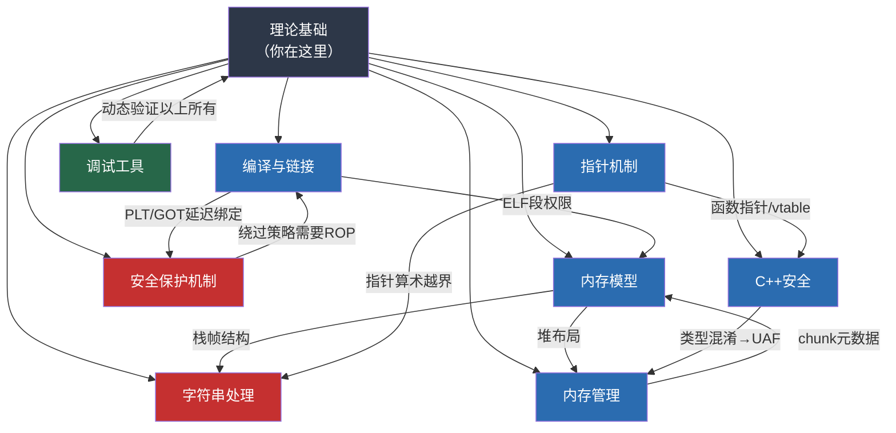
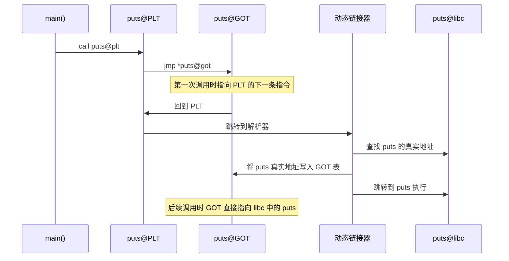

## 理论基础总结

理论基础部分共九个章节，从 C/C++ 在安全领域的地位出发，依次覆盖了内存模型、指针机制、内存管理、字符串处理、编译链接、安全保护机制、C++ 安全特性、调试工具八个核心知识域。本节将这些离散的知识点串联为一张完整的认知地图，帮助读者建立"看到一个漏洞 → 立即定位到理论根源"的反射能力。

### 知识体系全景



上图中红色节点是与漏洞利用直接关联的"热点"——字符串处理是栈溢出的根源，保护机制是利用技术需要绕过的障碍。蓝色节点是支撑理解的基础设施。绿色节点是验证手段。

### 核心概念回顾

#### 1. C/C++ 在安全领域的核心地位

C/C++ 之所以是安全研究的必修语言，不是因为"流行"，而是因为**现代计算基础设施的底层全部由 C/C++ 构建**：

| 目标 | 语言 | 关键安全事实 |
|------|------|-------------|
| Linux 内核 | 纯 C | 约 2800 万行代码，CVE 中内核漏洞占比极高 |
| Chromium 浏览器 | C++ | V8 引擎每年报告数百个内存安全漏洞 |
| Nginx/Apache | C | Web 服务器的核心网络处理代码 |
| OpenSSL | C | Heartbleed（CVE-2014-0160）影响全球 17% HTTPS 服务器 |
| Android 底层 | C/C++ | Stagefright 系列漏洞影响 95% Android 设备 |
| 游戏引擎 (Unreal/Unity native) | C++ | 反作弊和提权漏洞的核心攻击面 |

CVE 数据库统计显示，约 **70% 的已知内存安全漏洞**来自 C/C++ 代码。这个数字不是说 C/C++ "写得差"，而是因为 C/C++ 将内存安全的责任完全交给程序员——没有垃圾回收、没有边界检查、没有空指针保护。这种"信任程序员"的设计哲学在提供极致性能的同时，也打开了巨大的攻击面。

#### 2. 进程内存模型——一切利用的"地图"

进程虚拟内存布局是所有二进制漏洞分析的基础设施。不理解它，就无法理解任何利用技术为什么能工作。

```text
高地址 (0x7FFF...)
┌──────────────────────────┐
│  内核空间                  │ ← 用户态不可访问（Ring 0）
├──────────────────────────┤
│  栈 (Stack)               │ ← 局部变量、函数参数、返回地址
│      ↓ 向低地址增长        │    栈溢出会覆盖更早的栈帧
├──────────────────────────┤
│  ... 未使用空间 ...        │ ← 栈和堆之间的巨大空洞
├──────────────────────────┤
│  mmap 区域                │ ← 共享库（libc.so）加载位置
│      ↑ 向高地址增长        │    泄露此处可计算 libc 中任意函数地址
├──────────────────────────┤
│  堆 (Heap)                │ ← malloc/new 分配的动态内存
│      ↑ 向高地址增长        │    堆溢出可破坏 chunk 元数据
├──────────────────────────┤
│  .bss 段                  │ ← 未初始化全局变量
├──────────────────────────┤
│  .data 段                 │ ← 已初始化全局变量
├──────────────────────────┤
│  .text 段                 │ ← 程序指令（只读、可执行）
└──────────────────────────┘
低地址 (0x400000)
```

**安全意义速查**：

| 内存区域 | 存储内容 | 对应漏洞类型 | 攻击者的目标 |
|----------|----------|-------------|-------------|
| 栈 | 返回地址、栈帧指针、局部变量 | 栈溢出、格式化字符串 | 覆盖返回地址 → 劫持控制流 |
| 堆 | malloc/new 分配的对象 | 堆溢出、UAF、Double Free | 破坏 chunk 元数据 → 任意地址写 |
| mmap | libc.so、mmap 分配 | GOT 覆写 | 泄露 libc 基址 → 调用 system() |
| .bss/.data | 全局变量、静态变量 | 全局缓冲区溢出 | 覆盖全局函数指针或 hook |
| .text | 程序代码 | 格式化字符串读取 | 代码段本身通常不是攻击目标 |

栈向低地址增长、堆向高地址增长——这意味着**栈溢出是向"更早"的栈帧方向覆盖**，而不是向栈底。这个细节在手动计算偏移量时极其关键。

#### 3. 指针——安全漏洞的统一抽象

所有内存安全漏洞的本质都可以归结为**指针的错误使用**。理解指针不仅是理解 `*p` 和 `p->member`，而是理解指针的三重属性：

**（1）地址值**：指针指向哪里

```c
int x = 42;
int *p = &x;    // p 的值是 x 的内存地址
// 如果攻击者能修改 p 的值，就能让 p 指向任意内存位置
```

**（2）类型**：指针如何解释内存中的字节

```c
// 同一段内存，不同类型的指针会以不同方式解释
char *c = (char *)0x1000;    // *c 读取 1 字节
int  *i = (int  *)0x1000;    // *i 读取 4 字节
long *l = (long *)0x1000;    // *l 读取 8 字节（64位）

// 类型混淆就是把一种类型的对象当作另一种类型来使用
// C++ 中尤其常见：把 Derived* 当 Base* 使用时，如果对象布局不同
// 通过 Base* 调用虚函数会跳转到错误的地址
```

**（3）生命周期**：指针指向的内存是否仍然有效

```c
char *p = malloc(64);
free(p);         // 内存已释放
// p 仍然保存着原来的地址——这就是"悬垂指针"
p[0] = 'A';      // Use-After-Free：写入已释放的内存
// 如果这块内存被重新分配给其他对象，就可能破坏那个对象
```

**指针运算的安全含义**：

```c
char buf[16];
char *p = buf;

// 指针算术不会检查边界
p[100] = 'X';     // 写入 buf 起始地址 + 100 字节的位置
                  // 编译器不会报错，运行时也不会报错（除非触发 segfault）

// 整数和指针之间的隐式转换
int offset = user_controlled_input;
p[offset] = 'X';  // 如果 offset 可控，攻击者可以写入任意偏移
```

C/C++ 不对指针做任何运行时边界检查。这意味着程序员的每一个疏忽都可能成为一个可利用的漏洞。

#### 4. 堆管理器——PWN 方向的核心战场

glibc 的 ptmalloc2 堆管理器是 CTF PWN 题和真实漏洞利用中最常遇到的目标。理解它的内部机制是掌握堆利用的前提。

**堆管理器的核心数据结构**：

| 机制 | 管理的 chunk 大小 | 链表类型 | 安全利用方式 |
|------|-------------------|----------|-------------|
| Fast Bin | ≤ 0x80 字节（64位） | 单链表，LIFO | Fast Bin Attack：劫持 fd 指针实现任意地址分配 |
| Tcache | ≤ 0x418 字节（glibc 2.26+） | 单链表，LIFO | Tcache Poisoning：覆写 fd 实现任意地址分配 |
| Unsorted Bin | 大于 fast bin / tcache 上限 | 双链表 | 泄露 libc 地址：free 后 fd/bk 指向 main_arena |
| Small Bin | 0x20 ~ 0x3f0 | 双链表，FIFO | 类似 fast bin 但需要更多控制 |
| Large Bin | 大于 small bin 上限 | 双链表，按大小排序 | Large Bin Attack：任意地址写 |

**malloc → free → 再次 malloc 的利用闭环**：


堆利用的关键洞察：堆管理器**信任 chunk 的元数据**。如果攻击者能通过溢出或 UAF 修改 chunk 的 `fd`/`bk` 指针，堆管理器就会在被篡改的地址上分配内存——这就实现了任意地址写。

#### 5. 字符符串处理——漏洞之源

C 语言字符串没有长度信息，以 `\0` 结尾。所有字符串操作函数都需要程序员手动保证目标缓冲区足够大，但人类总会犯错。

**危险函数对照表**：

| 危险函数 | 安全替代 | 风险说明 |
|----------|----------|----------|
| `gets(s)` | `fgets(s, size, stdin)` | gets 完全无边界检查，是栈溢出教科书级案例 |
| `strcpy(dst, src)` | `strncpy(dst, src, n)` + 手动补 `\0` | 无长度限制，src 过长直接溢出 |
| `strcat(dst, src)` | `strncat(dst, src, n)` | 无长度限制，拼接时可能溢出 |
| `sprintf(buf, fmt, ...)` | `snprintf(buf, size, fmt, ...)` | 格式化结果长度不可预测 |
| `scanf("%s", buf)` | `scanf("%63s", buf)` 或用 fgets | 无长度限制 |
| `vsprintf(buf, fmt, ap)` | `vsnprintf(buf, size, fmt, ap)` | sprintf 的可变参数版本 |

**字符串溢出 → 栈溢出 → 控制流劫持的完整链条**：

```c
void vulnerable() {
    char buf[64];           // 栈上 64 字节缓冲区
    gets(buf);              // 读入任意长度数据
    // 如果输入超过 64 字节：
    //   → 覆盖 buf 之后的 saved RBP（8字节）
    //   → 覆盖返回地址（8字节）
    //   → 函数返回时 CPU 跳转到攻击者控制的地址
}
```

这不是一个"理论上的可能"——这正是 CVE-2014-6271 (Shellshock) 等无数真实漏洞的简化模型。

#### 6. 编译与链接——从源码到二进制的变换

编译链接过程将人类可读的 C 代码转化为 CPU 可执行的机器码。每一步变换都可能引入安全相关的特性：

**预处理 → 编译 → 汇编 → 链接**：

| 阶段 | 工具 | 输入 | 输出 | 安全相关点 |
|------|------|------|------|-----------|
| 预处理 | cpp | `.c` | `.i` | 宏展开可能隐藏危险代码 |
| 编译 | cc1 | `.i` | `.s` | 编译器优化可能改变栈布局 |
| 汇编 | as | `.s` | `.o` | 生成可重定位目标文件 |
| 链接 | ld | `.o` + `.so` | ELF 可执行文件 | 符号解析、GOT/PLT 创建、段权限设置 |

**ELF 文件格式的安全关键结构**：

```bash
# 查看 ELF 头
readelf -h ./program

# 查看段（Segment）—— 决定内存权限
readelf -l ./program
#   LOAD 段的 R/W/E 标志直接决定 NX 保护状态

# 查看节（Section）—— GOT/PLT 在这里
readelf -S ./program
#   .plt   —— 过程链接表，跳板函数
#   .got   —— 全局偏移表，存储全局变量地址
#   .got.plt —— 存储外部函数的实际地址（覆写目标）

# 查看符号表
readelf -s ./program
```

**GOT/PLT 延迟绑定机制**——这是 ret2libc 和 GOT 覆写攻击的基础：



攻击者如果能覆写 GOT 表中 `puts` 的地址，就可以在程序下次调用 `puts` 时劫持控制流。Full RELRO 通过在程序启动时立即解析所有 GOT 表项并设为只读来防御这种攻击。

#### 7. 安全保护机制——现代系统的防线

现代操作系统和编译器提供了多层保护机制，每种阻断一类攻击路径：

| 保护机制 | 保护对象 | 原理 | 绕过思路 |
|----------|----------|------|----------|
| **Stack Canary** | 返回地址 | 在返回地址前插入随机值，函数返回时校验 | 泄露 canary、覆盖 canary 之前的变量、fork 模式爆破 |
| **NX/DEP** | 栈和堆 | 标记为不可执行 | ROP（复用已有代码片段）、ret2libc |
| **ASLR** | 栈/堆/mmap 基址 | 每次运行随机化 | 信息泄露（格式化字符串、puts 泄露 GOT）、部分覆写 |
| **PIE** | 代码段基址 | 随机化 .text 加载地址 | 信息泄露、部分覆写 |
| **Full RELRO** | GOT 表 | 启动时立即解析并设为只读 | 放弃 GOT 覆写，转向 `__malloc_hook`/`__free_hook` |
| **FORTIFY_SOURCE** | 危险函数 | 编译时插入边界检查 | 寻找编译器未检测到的溢出路径 |

**绕过决策树**——拿到一个二进制后的分析流程：

```text
checksec 结果 → 制定策略

┌─ Stack Canary: NO
│  └─ 直接栈溢出覆盖返回地址
├─ Stack Canary: YES
│  └─ 需要泄露 canary（格式化字符串 / 逐字节爆破）
│
├─ NX: NO
│  └─ 直接注入 shellcode 到栈上执行
├─ NX: YES
│  └─ 使用 ROP / ret2libc
│
├─ ASLR: OFF
│  └─ 硬编码地址即可
├─ ASLR: ON
│  └─ 需要信息泄露（puts@PLT 泄露 GOT 中的 libc 地址）
│
├─ RELRO: Partial
│  └─ GOT 覆写可用
├─ RELRO: Full
│  └─ 转向 __malloc_hook / __free_hook / vtable 劫持
│
└─ PIE: OFF → 代码地址固定
   PIE: ON  → 需要泄露代码段基址
```

#### 8. C++ 安全特性——对象模型的攻击面

C++ 在 C 的基础上引入了类、虚函数、异常处理等特性，这些特性扩展了攻击面：

**虚函数表（vtable）劫持**：

```cpp
class Animal {
public:
    virtual void speak() { printf("...\n"); }
    virtual void move()  { printf("walking\n"); }
};

// 对象内存布局：
// [vptr] → vtable → [speak_addr, move_addr]
//
// 攻击路径：
// 1. 通过堆溢出/UAF 修改 vptr 指向攻击者控制的内存
// 2. 在该内存中构造假的 vtable
// 3. 调用虚函数时跳转到攻击者指定的地址
```

**C++ 特有的漏洞模式**：

| 漏洞类型 | 成因 | 典型利用 |
|----------|------|----------|
| vtable 劫持 | 对象被溢出/UAF，vptr 被篡改 | 控制虚函数调用目标 |
| 类型混淆 | 把一种类型的对象当作另一种使用 | 通过错误的指针类型访问不同的内存布局 |
| 异常处理劫持 | 异常处理链被溢出覆盖 | 控制异常抛出时的跳转目标 |
| 析构函数利用 | UAF 导致对象被释放后调用析构函数 | 析构函数中的虚调用被劫持 |
| 整数溢出 → new 分配不足 | `new char[user_input]` 中的整数溢出 | 分配小缓冲区 → 溢出覆盖相邻对象 |

#### 9. 调试工具——动态验证的利器

静态分析只能告诉你代码"应该"怎么运行，调试工具告诉你代码"实际"怎么运行。GDB + pwndbg 是安全研究的标配组合。

**核心调试命令速查**：

```bash
# 启动与运行
gdb -q ./program          # 安静模式启动
r                         # 运行程序
r < input.txt             # 用文件作为输入
r <<< $(python3 -c 'print("A"*100)')  # 用管道输入

# 断点
b main                    # 函数名断点
b *0x401234               # 地址断点
b vuln.c:10               # 文件:行号断点
c                         # 继续执行
si                        # 单步执行一条指令（步入 call）
ni                        # 单步执行一条指令（步过 call）

# 内存检查（pwndbg 特有）
vmmap                     # 查看内存映射（栈/堆/libc 的实际地址）
telescope $rsp 20         # 从 RSP 开始查看 20 个栈值
heap bins                 # 查看所有 bin 的链表状态
heap chunks               # 查看堆上所有 chunk
search -s "/bin/sh"       # 在内存中搜索字符串
```

**调试工作流——每个 exploit 开发必须经历的三个阶段**：

| 阶段 | 目的 | 关键检查 |
|------|------|----------|
| 溢出前 | 确认缓冲区位置和大小 | `telescope $rsp 20` 看栈布局 |
| 溢出后 | 确认覆盖了哪些数据 | 检查返回地址、canary 是否被覆盖 |
| exploit 执行时 | 确认控制流按预期转移 | `vmmap` 确认地址正确，`si` 跟踪跳转 |

### 理论到实践的桥梁

理论基础的每一个知识点都直接对应后续"核心技巧"部分的具体技术：

| 理论知识点 | 对应的利用技术 | 桥接逻辑 |
|-----------|---------------|----------|
| 栈帧结构 | 栈溢出利用 | 理解返回地址在栈上的位置才能准确覆盖 |
| 指针机制 | 格式化字符串 `%n` 写入 | `%n` 将已输出字符数写入指针指向的地址 |
| 堆管理器 bin 机制 | Fast Bin Attack / Tcache Poisoning | 理解 fd/bk 链表才能劫持分配目标 |
| 危险字符串函数 | Shellcode 注入 | gets/strcpy 无边界检查允许注入任意字节 |
| GOT/PLT 机制 | GOT 覆写 / ret2libc / ret2plt | GOT 表存储函数真实地址，PLT 是跳板 |
| NX 保护 | ROP 链构建 | NX 禁止执行栈上代码，ROP 复用已有代码段 |
| ASLR | 信息泄露 + 偏移计算 | 每次运行地址随机，需要泄露一个已知地址计算基址 |
| Stack Canary | 泄露/爆破 canary | canary 在返回地址之前，溢出必须保持其不变 |
| vtable | C++ 虚表劫持 | 修改 vptr 指向假 vtable 控制虚函数调用 |
| GDB/pwndbg | 所有利用技术的验证 | 每一步利用都需要动态确认地址和状态 |

### 常见误区与纠正

理论学习阶段最容易犯的错误，以及对应的正确理解：

| 误区 | 错误理解 | 正确理解 |
|------|---------|----------|
| "栈溢出就是覆盖变量" | 溢出只影响局部变量 | 溢出覆盖的是栈帧中更高地址的数据：saved RBP → 返回地址 → 调用者的栈帧 |
| "ASLR 无法绕过" | ASLR 开启就没办法了 | ASLR 只随机化基址，函数之间的相对偏移不变，泄露一个地址就能推算全部 |
| "NX 保护下不能执行任意代码" | NX 开启就没法执行 shellcode | NX 禁止的是在栈/堆上执行代码，但 ROP 可以复用 .text 和 libc 中已有的代码片段 |
| "malloc 和 free 是安全的" | 堆管理器会保护数据 | 堆管理器只管理元数据，不检查用户数据是否被篡改，被溢出破坏的 chunk 会被"信任" |
| "指针就是地址" | 理解就够了 | 指针有类型（决定访问宽度）、有所有权（决定生命周期）、有别名（可能被多个指针引用），三个维度的错误都会导致漏洞 |
| "编译器会帮我检查" | 用 gcc 编译就安全了 | gcc 默认不开启大多数保护机制，需要手动指定 `-fstack-protector`、`-z relro`、`-z now`、`-pie` 等标志 |
| "32 位和 64 位只是位宽不同" | 学一个就行 | 64 位程序的前 6 个参数通过寄存器传递（不是栈），地址是 8 字节（不是 4），空字节 `\x00` 更容易出现在地址中 |
| "格式化字符串只能泄露数据" | printf 读取没有威胁 | `%n` 格式化说明符可以**写入**任意地址，格式化字符串同时是读原语和写原语 |

### 能力自检清单

完成理论基础部分后，用以下清单检验自己的掌握程度。每一项都对应一个后续利用技术的前置知识。

#### 基础理解（必须达到）

- [ ] 能在纸上画出完整的进程内存布局图，标注每个区域的名称、内容、增长方向
- [ ] 能解释函数调用时栈帧的完整创建过程（参数压栈 → call → push rbp → sub rsp）
- [ ] 能说明 `malloc(64)` 在堆上实际分配了多少字节（chunk header 16 字节 + 用户数据 64 字节 + 对齐填充）
- [ ] 能列举至少 5 个危险的 C 标准库函数及其安全替代
- [ ] 能解释预处理→编译→汇编→链接每一步的输入、输出和安全意义
- [ ] 能用 `checksec` 正确解读每个保护机制的状态

#### 概念关联（应当达到）

- [ ] 能解释为什么栈溢出覆盖返回地址能控制程序执行流
- [ ] 能说明 GOT 表和 PLT 表的关系，以及 GOT 覆写攻击为什么能工作
- [ ] 能解释 ASLR 随机化了哪些地址、不随机化哪些地址
- [ ] 能说明 glibc 堆管理器的 fast bin 和 unsorted bin 的区别和各自的安全意义
- [ ] 能解释 C++ 对象的 vtable 布局以及 vtable 劫持的基本原理

#### 动手验证（优秀标准）

- [ ] 能用 GDB 单步跟踪一个栈溢出的完整过程，观察 RBP 和返回地址被覆盖
- [ ] 能用 `readelf` 和 `objdump` 分析一个 ELF 文件的 GOT/PLT 结构
- [ ] 能编译一个程序并分别用不同保护选项（开启/关闭 NX、Canary、PIE、RELRO）观察 `checksec` 输出的变化
- [ ] 能用 GDB 的 `heap` 命令（pwndbg）观察 malloc → free → 再次 malloc 过程中 chunk 和 bin 的状态变化

### 下一步：核心技巧

理论基础的全部内容都服务于一个目标：**理解漏洞为什么存在以及如何利用**。

进入"核心技巧"部分后，你将学习：

| 技术 | 前置理论 | 难度 |
|------|----------|------|
| 栈溢出利用 | 栈帧结构 + 危险函数 | ★☆☆ |
| 格式化字符串漏洞 | printf 实现机制 + 指针 | ★★☆ |
| Shellcode 编写 | 内存布局 + 系统调用 | ★☆☆ |
| 整数溢出利用 | 整数表示 + 内存分配 | ★★☆ |
| 堆利用基础 | 堆管理器 bin 机制 | ★★★ |
| UAF 利用 | 指针生命周期 + 堆管理 | ★★★ |
| ROP 链构建 | 栈帧结构 + NX 绕过 | ★★☆ |
| ret2libc | GOT/PLT + ASLR 绕过 | ★★☆ |
| GOT 覆写 | ELF 格式 + RELRO | ★★☆ |
| Shellcode 高级技巧 | 所有基础 | ★★☆ |

如果你对上述任何前置理论感到模糊，建议回头重读对应章节再继续。理论基础不扎实，核心技巧部分会处处碰壁。
