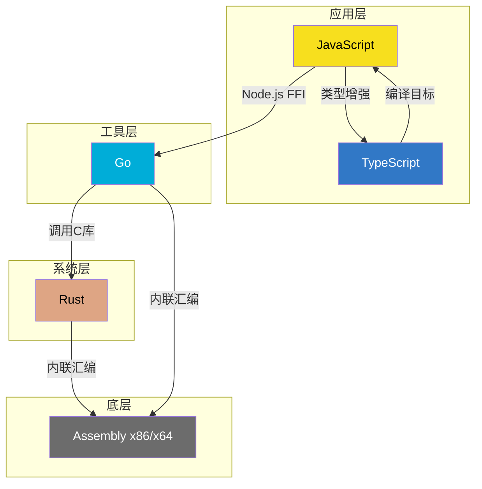
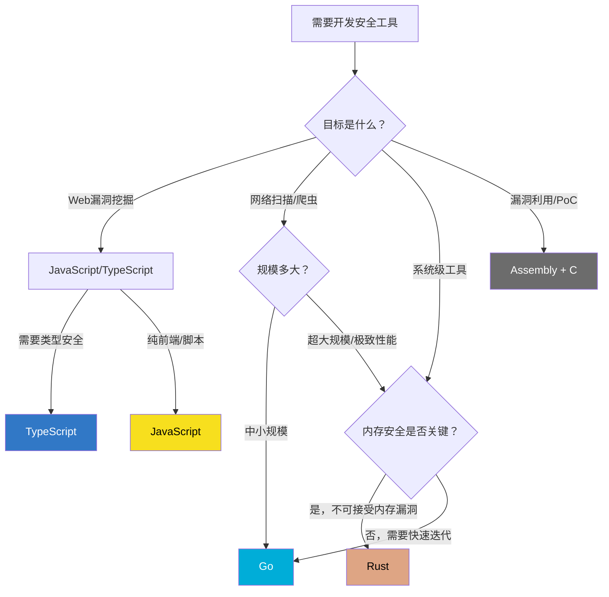
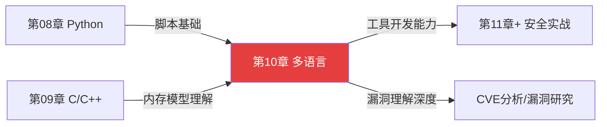

# 第10章 编程语言——JS/TS/Go/Rust/Assembly

## 为什么安全研究者需要掌握多种语言

单一语言无法覆盖安全研究的全部攻击面。Web前端漏洞只能用JavaScript去挖掘，高性能扫描器需要用Go去编写，绕过内存保护机制需要理解Assembly，而构建不会被自身漏洞反噬的安全工具则需要Rust。一个成熟的安全研究者至少需要在不同抽象层级上各掌握一种语言：

- **应用层**：JavaScript/TypeScript——浏览器和Web应用的原生语言，XSS/CSRF/原型链污染等漏洞的发现和利用离不开它
- **工具层**：Go——编译为单一二进制文件、原生并发支持、跨平台编译，是开发扫描器、代理、爬虫等安全基础设施的首选
- **系统层**：Rust——零成本抽象+所有权系统，在不牺牲性能的前提下消除整类内存安全漏洞，正逐步替代C/C++在安全工具中的角色
- **底层**：Assembly——Shellcode编写、漏洞利用开发、逆向工程、反调试技术的根基，不理解汇编就无法真正理解漏洞的运作机制

本章覆盖的四种语言恰好对应这四个抽象层级，形成完整的安全研究语言栈。



## 四种语言在安全生态中的真实坐标

每种语言在安全领域都不是抽象的"好用"，而是有大量实际工具和项目作为佐证。以下是各语言在安全生态中的标志性项目：

| 语言 | 标志性安全项目 | 项目用途 | Star量级 |
|------|--------------|---------|---------|
| JavaScript | Burp Suite扩展生态、DOMPurify、Retire.js | WAF绕过检测、XSS防护、前端库漏洞扫描 | — |
| TypeScript | OWASP ZAP的脚本引擎、Botguard绕过工具 | 自动化安全测试、反爬对抗 | — |
| Go | nuclei、subfinder、httpx、naabu、masscan-go | 漏洞扫描、子域名发现、端口扫描 | nuclei 20k+ |
| Rust | RustScan、feroxbuster、ripgrep、nushell | 超高速端口扫描、目录爆破、日志分析 | RustScan 15k+ |
| Assembly | Shellcode数据库、pwntools底层、各种Exploit-DB PoC | 漏洞利用、Payload生成 | — |

**关键洞察**：ProjectDiscovery（nuclei/subfinder/httpx的开发团队）从Python全面迁移到Go，根本原因是Go的并发模型和单二进制分发完美匹配安全工具的需求——扫描百万URL时，Go的goroutine比Python的asyncio在吞吐量上高出一个数量级。类似的，RustScan用Rust重写masscan的逻辑后，端口扫描速度提升了数倍。语言选择不是偏好问题，而是工程约束下的必然结果。

## 学习目标

通过本章学习，你将具备以下能力：

### JavaScript/TypeScript

- 理解JavaScript引擎（V8/SpiderMonkey/JSC）的执行模型，以及不同引擎差异如何影响漏洞利用
- 掌握DOM操作、事件循环、原型链机制，能够识别和构造XSS/原型链污染攻击
- 掌握TypeScript的结构化类型系统，理解类型安全如何在开发阶段消除整类安全缺陷
- 能够编写Burp Suite扩展、浏览器自动化脚本、安全扫描Payload生成器

### Go

- 掌握goroutine和channel的并发模型，能够编写高性能并发扫描器
- 熟练使用`net/http`、`crypto/tls`、`encoding/json`等标准库进行安全工具开发
- 理解Go的编译和交叉编译机制，能够构建跨平台的安全工具二进制文件
- 掌握Go在安全领域的完整工具链：cobra（CLI）、viper（配置）、gorm（数据库）

### Rust

- 理解所有权（Ownership）、借用（Borrowing）、生命周期（Lifetime）三大核心概念
- 掌握Rust的`unsafe`机制——何时必须使用、如何审计`unsafe`代码块
- 能够使用Tokio异步运行时编写高性能网络扫描器
- 理解Rust在安全工具开发中相比Go/C的取舍：何时选择Rust而非Go

### Assembly

- 掌握x86/x64架构的寄存器、指令集、调用约定（cdecl/stdcall/System V）
- 能够阅读反汇编输出（IDA Pro/Ghidra生成的汇编代码）
- 理解栈帧布局、函数调用过程、缓冲区溢出的底层机制
- 能够编写和分析Shellcode，理解NOP sled、egg hunter等经典技术

## 内容结构

本章按"理论→技巧→实战→纠偏→练习→总结→拓展"的七层递进结构组织，每一层都同时覆盖四种语言：


### 理论基础（理论基础/目录，共7节）

从各语言的核心语法和安全特性出发，建立完整的知识框架：

| 节次 | 内容 | 核心要点 |
|------|------|---------|
| 01 | JavaScript在安全领域的地位 | JS引擎执行模型、事件循环、DOM安全、同源策略、原型链机制 |
| 02 | TypeScript类型安全 | 结构化类型vs名义类型、类型守卫、泛型约束、编译期安全保证 |
| 03 | Go在安全领域的应用 | goroutine调度器、channel通信、net/http安全编程、CGO调用 |
| 04 | Rust的安全特性 | 所有权模型、借用检查器、生命周期标注、unsafe审计 |
| 05 | Assembly语言基础 | x86/x64寄存器组、指令集分类、调用约定、内存布局 |
| 06 | 语言对比与选择 | 性能基准对比、安全特性矩阵、适用场景决策树 |
| 07 | 总结 | 理论基础核心知识点回顾 |

### 核心技巧（核心技巧/目录，共7节）

每种语言的安全编程核心技术，从编码模式到攻击技术：

| 节次 | 内容 | 核心要点 |
|------|------|---------|
| 01 | JavaScript安全核心技巧 | XSS Payload构造、CSP绕过、原型链污染、JSFuck编码 |
| 02 | TypeScript类型安全技巧 | 条件类型、模板字面量类型、类型体操在安全校验中的应用 |
| 03 | Go安全编程技巧 | 并发安全模式、HTTP中间件、TLS指纹伪装、反检测技术 |
| 04 | Rust安全编程技巧 | 内存安全编码、Fuzzing集成、unsafe代码审计、FFI安全 |
| 05 | Assembly核心技巧 | Shellcode编写、编码与解码、反调试指令、SEH利用 |
| 06 | 语言间互操作 | JS调WASM、Go CGO调C、Rust FFI、Assembly内联 |
| 07 | 总结 | 核心技巧要点回顾 |

### 实战案例（实战案例/目录，共6节）

真实安全场景的完整项目，每个案例从需求分析到代码实现：

| 节次 | 案例 | 涉及技术 |
|------|------|---------|
| 01 | JavaScript XSS漏洞挖掘与利用 | DOM分析、Payload构造、CSP绕过、Beef框架 |
| 02 | Go自动化漏洞扫描器 | 并发爬虫、模板引擎、结果聚合、CLI工具 |
| 03 | Rust内存安全的网络代理 | Tokio异步、TLS中间人、流量分析、性能优化 |
| 04 | Assembly Shellcode实战 | Shellcode编写、编码器、免杀处理、漏洞利用 |
| 05 | TypeScript安全的JWT认证系统 | JWT实现、类型安全、密码学库、漏洞防护 |
| 06 | 案例总结 | 五个案例的横向对比与经验提炼 |

### 独立章节

- **04-常见误区**：各语言安全开发中最常犯的错误认知和实践陷阱
- **05-练习方法**：从零到精通的系统化学习路径，含CTF题目推荐和实战项目
- **06-本章小结**：全章核心知识点速查表
- **07-深度拓展**：进阶研究方向和前沿技术追踪

## 语言选择决策框架

选择语言不是偏好问题，而是基于具体场景的工程决策。以下决策树帮助你在实际项目中做出合理选择：



### 场景-语言速查表

| 安全场景 | 首选语言 | 备选语言 | 选择理由 |
|---------|---------|---------|---------|
| XSS漏洞挖掘与利用 | JavaScript | TypeScript | 浏览器原生语言，DOM操作能力最强 |
| Burp Suite插件开发 | Java/JavaScript | TypeScript | Burp扩展API基于Java，支持JS脚本 |
| 子域名枚举工具 | Go | Python | 高并发DNS查询，单二进制分发 |
| 端口扫描器 | Rust | Go | 极致I/O性能，异步模型成熟 |
| Web漏洞扫描器 | Go | Python | nuclei/httpx生态成熟，并发能力强 |
| 密码破解工具 | Rust | C | 计算密集型，需要极致CPU利用 |
| 流量代理/中间人 | Rust | Go | TLS处理需要内存安全保证 |
| Shellcode/Payload | Assembly | C | 必须直接操作机器指令 |
| 逆向工程辅助脚本 | Python | JavaScript | Ghidra/IDA脚本生态以Python为主 |
| CTF Web题 | JavaScript | Python | 前端漏洞题必须JS，后端用Python |
| CTF Pwn题 | Python + C | Assembly | pwntools框架 + 漏洞利用开发 |
| 安全监控/日志分析 | Go | Rust | 并发处理日志流，部署简单 |
| 安全编排(SOAR) | Python | Go | 胶水语言，集成能力强 |
| 恶意软件分析 | Python + Assembly | C | 脚本化分析 + 理解底层指令 |
| EDR/安全Agent | Rust | Go | 常驻进程，内存安全至关重要 |

## 开发环境快速搭建

在开始学习之前，先确保各语言的开发环境就绪：

### JavaScript/TypeScript

```bash
# 安装 Node.js（推荐 v20 LTS）
curl -fsSL https://deb.nodesource.com/setup_20.x | sudo -E bash -
sudo apt-get install -y nodejs

# 安装 TypeScript
npm install -g typescript ts-node

# 安装常用安全工具包
npm install -g js-beautify    # JS代码美化
npm install -g retire          # 前端库漏洞检测

# 验证安装
node --version && tsc --version
```

### Go

```bash
# 安装 Go（推荐 1.22+）
wget https://go.dev/dl/go1.22.5.linux-amd64.tar.gz
sudo tar -C /usr/local -xzf go1.22.5.linux-amd64.tar.gz
export PATH=$PATH:/usr/local/go/bin:$HOME/go/bin

# 配置代理（中国大陆）
go env -w GOPROXY=https://goproxy.cn,direct

# 安装安全开发常用工具
go install github.com/projectdiscovery/nuclei/v3/cmd/nuclei@latest
go install github.com/projectdiscovery/httpx/cmd/httpx@latest

# 验证安装
go version
```

### Rust

```bash
# 安装 Rust 工具链
curl --proto '=https' --tlsv1.2 -sSf https://sh.rustup.rs | sh
source $HOME/.cargo/env

# 安装常用组件
rustup component add clippy rustfmt
cargo install cargo-audit    # 依赖安全审计
cargo install cargo-fuzz     # Fuzzing支持

# 验证安装
rustc --version && cargo --version
```

### Assembly

```bash
# 安装汇编器和调试器
sudo apt-get install -y nasm gdb

# 安装反汇编工具
sudo apt-get install -y radare2    # 命令行反汇编
# Ghidra（图形化反汇编，需单独下载）：
# https://ghidra-sre.org/

# 安装 pwntools（漏洞利用框架）
pip install pwntools

# 验证安装
nasm --version && gdb --version
```

## 前置知识检查清单

在进入本章之前，请确认你已具备以下基础。如果某项不足，建议先回顾对应章节：

| 前置知识 | 要求程度 | 对应章节 | 自检标准 |
|---------|---------|---------|---------|
| Python编程 | 能编写脚本和简单工具 | 第08章 | 能用requests库写一个HTTP爬虫 |
| C/C++基础 | 理解指针和内存管理 | 第09章 | 能解释malloc/free的工作原理 |
| 计算机网络 | 理解TCP/IP和HTTP协议 | 基础知识 | 能用Wireshark分析HTTP请求 |
| Linux命令行 | 熟练使用终端 | 基础知识 | 能用grep/awk/sed处理日志 |
| 基本编程概念 | 变量、循环、函数、数据结构 | 基础知识 | 能用任意语言实现冒泡排序 |

**特别说明**：Assembly部分不要求C/C++精通，但要求理解指针和内存地址的概念。如果你对"变量在内存中如何存储"感到模糊，请先回顾第09章的内存管理部分。

## 学习路径建议

根据你的目标不同，有三种推荐的学习路径：

### 路径一：Web安全专项（4-6周）

重点投入JavaScript/TypeScript，兼顾Go：

```text
Week 1-2: JS理论基础 + 核心技巧（DOM安全、XSS、原型链）
Week 3:   TS类型安全 + 类型驱动的安全编码
Week 4:   实战案例01（XSS挖掘）+ 实战案例05（JWT认证）
Week 5-6: Go基础 + nuclei/httpx使用 + 自定义扫描器
```

### 路径二：系统安全专项（6-8周）

重点投入Assembly + Rust，兼顾Go：

```text
Week 1-2: Assembly理论基础 + 核心技巧（寄存器、指令集、调用约定）
Week 3:   C语言漏洞回顾 + 栈溢出原理（关联第09章）
Week 4:   Assembly实战（Shellcode编写 + 漏洞利用PoC）
Week 5-6: Rust所有权模型 + 内存安全编程
Week 7-8: Rust实战（网络代理/扫描器）+ Go补充
```

### 路径三：全栈安全工程师（8-12周）

按章节顺序完整学习：

```text
Week 1-2:   JavaScript/TypeScript全部内容
Week 3-5:   Go语言全部内容
Week 6-8:   Rust语言全部内容
Week 9-11:  Assembly全部内容
Week 12:    语言互操作 + 综合实战
```

每条路径都建议每天投入4-6小时，其中理论学习占30%，编码实践占70%。

## 学习时间预估

各语言的学习投入取决于你的基础和目标深度：

| 语言 | 仅了解原理 | 能写安全工具 | 精通/能做研究 | 前置要求 |
|------|-----------|-------------|-------------|---------|
| JavaScript/TypeScript | 10小时 | 20-30小时 | 50+小时 | 任意编程基础 |
| Go | 15小时 | 25-35小时 | 60+小时 | 理解并发概念 |
| Rust | 20小时 | 30-40小时 | 80+小时 | C/C++基础 |
| Assembly | 25小时 | 35-50小时 | 100+小时 | C语言+指针理解 |
| **合计** | **70小时** | **110-155小时** | **290+小时** | — |

> 💡 **效率提示**：不要试图同时学习四种语言。建议先完成一条学习路径，再扩展到其他语言。贪多嚼不烂——安全研究的深度比广度更重要。

## 各语言核心优势速览

在正式开始学习之前，先建立对每种语言"性格"的直觉理解：

### JavaScript——灵活的攻击面探索者

JavaScript的核心优势在于它无处不在。每一个Web应用、每一个浏览器、每一个Node.js服务器都在运行JavaScript。作为安全研究者，掌握JS意味着你能在最接近用户的地方发现和利用漏洞。它的动态类型系统既是漏洞的温床（类型混淆），也是灵活构造Payload的基础（动态原型链操作）。

**安全领域的关键词**：XSS、原型链污染、DOM Clobbering、CSP绕过、前端供应链攻击

### TypeScript——类型驱动的防御工事

TypeScript不是一种新语言，而是JavaScript的超集——它在编译时增加了类型检查层。在安全开发中，TypeScript的价值在于"让编译器替你做安全审计"：通过精心设计的类型定义，可以让整类安全错误（如SQL注入、未验证的用户输入）在编译阶段就被捕获。OWASP推荐在服务端使用TypeScript替代原生JavaScript。

**安全领域的关键词**：类型安全输入验证、编译期安全检查、DTO类型防护、Zod/io-ts运行时校验

### Go——安全工具的工业标准

Go的设计哲学是"简单即安全"。没有继承、没有泛型（1.18之前）、没有异常处理的复杂性——这意味着更少的Bug面。goroutine让并发编程变得像写同步代码一样简单，这对于需要同时扫描数千目标的安全工具来说至关重要。单二进制文件的编译产物消除了运行时依赖问题，在渗透测试中可以直接上传到目标服务器执行。

**安全领域的关键词**：nuclei、subfinder、并发扫描、单二进制部署、CGO调用C库

### Rust——零妥协的内存安全

Rust的所有权系统在编译期消除了use-after-free、double-free、buffer overflow等整类内存安全漏洞——而且不依赖垃圾回收器，性能与C/C++持平。对于安全工具来说，这意味着你写的工具本身不会成为攻击目标。`unsafe`关键字的存在则让你在必要时（如调用C库、操作硬件）突破编译器的限制，但每一个`unsafe`块都需要人工审计。

**安全领域的关键词**：所有权/借用/生命周期、unsafe审计、Fuzzing、Tokio异步、FFI安全

### Assembly——穿透一切抽象的底层视角

所有高级语言最终都被编译为机器指令，Assembly是人类可读的机器指令。理解Assembly意味着你能看穿一切抽象层——无论是JavaScript引擎的JIT编译结果、Go运行时的goroutine调度、还是Rust编译器生成的优化代码。在漏洞利用开发中，你需要直接编写机器指令（Shellcode）来实现任意代码执行。Assembly不是日常开发语言，但它是区分"脚本小子"和真正安全研究者的关键分水岭。

**安全领域的关键词**：Shellcode、ROP链、Shellcode编码器、反调试、调用约定、栈帧布局

## 与前后章节的关联



- **第08章（Python）** 提供了脚本化思维和快速原型能力，是学习Go/Rust的跳板
- **第09章（C/C++）** 提供了内存管理和指针的直觉理解，是学习Assembly和Rust的必要基础
- **本章（第10章）** 是安全研究的"语言工具箱"，完成后你将能够：
  - 用JS/TS挖掘Web漏洞
  - 用Go开发自动化安全工具
  - 用Rust构建高性能安全基础设施
  - 用Assembly理解和开发漏洞利用

## 核心重点与学习优先级

如果你的时间有限，按以下优先级分配学习精力：

### P0——必须掌握

1. **JavaScript安全编程**：Web安全的入门门票，不掌握JS就无法参与Web漏洞挖掘
2. **Go并发编程与网络编程**：现代安全工具的事实标准语言，nuclei/httpx/subfinder生态

### P1——强烈建议

3. **Assembly基础**：不需要能写复杂程序，但必须能读懂反汇编输出、理解栈溢出原理
4. **Rust所有权模型**：理解编译期如何消除内存安全漏洞，即使不日常使用Rust

### P2——按需深入

5. **TypeScript高级类型系统**：当你需要用TS开发安全工具时再深入
6. **Assembly高级技术**（Shellcode/ROP）：专注于漏洞利用研究时再深入
7. **Rust unsafe编程**：需要调用C库或操作系统接口时再深入

## 安全警告与免责声明

> ⚠️ **法律与伦理声明**
>
> 本章内容仅供**合法的安全测试与教育目的**使用。所有技术、工具和方法的讨论均旨在帮助安全从业者在**获得明确授权**的前提下进行防御性安全研究。
>
> - 🚫 **未经授权**对任何系统、网络或应用进行安全测试是**违法行为**，依据《中华人民共和国网络安全法》第二十七条，可处以拘留和罚款
> - ✅ 所有实践活动应在**隔离的实验环境**中进行（虚拟机、Docker容器、CTF平台）
> - ✅ 遵守所在国家和地区的**网络安全法律法规**
> - ✅ 遵循**负责任的漏洞披露**原则——发现漏洞后先报告厂商，给予合理修复时间
> - ✅ 建议使用 VulnHub、HackTheBox、TryHackMe 等合法靶场进行练习
>
> 作者不对因滥用本章内容造成的任何后果承担责任。安全研究的目的是让系统更安全，而非更脆弱。
