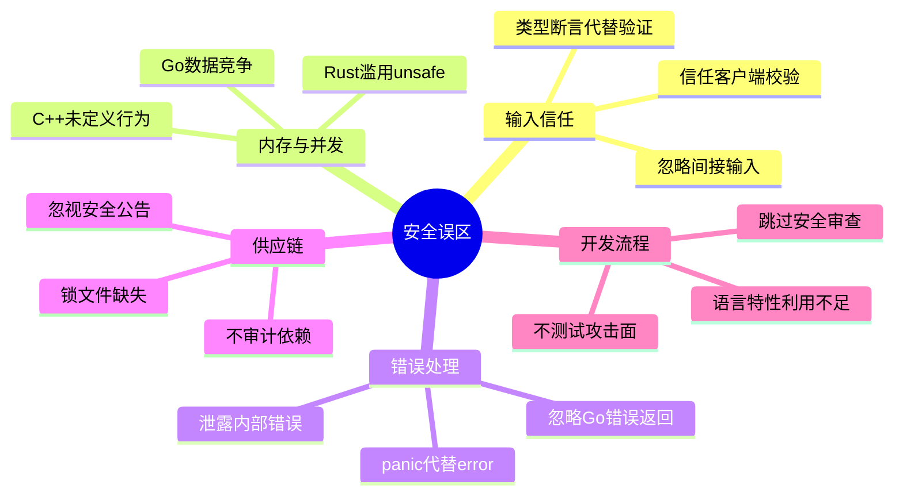
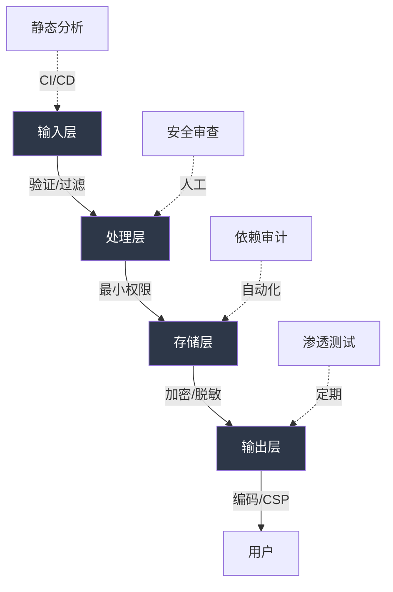

# 第10章 常见误区——多语言安全开发的陷阱

安全开发中最危险的不是未知的漏洞，而是**已知却被忽视的错误认知**。开发者在不同语言之间切换时，常常将一种语言的安全直觉带到另一种语言中，或者对语言的安全机制产生过度信任。本章梳理 JS/TS/Go/Rust/Assembly 五种语言中最常见的安全误区，每个误区都附带攻击场景、根因分析、正确做法和防御纵深策略。

## 误区分类总览



---

## 第一部分：输入与类型安全误区

### 误区一：JavaScript 中信任客户端输入

#### 错误认知

"前端已经校验过了，后端不用再检查。"这是 Web 安全中最根深蒂固的误区。浏览器是攻击者完全控制的环境——任何 JavaScript 校验都可以被绕过、任何 HTTP 请求都可以被伪造。

#### 为什么危险

攻击者有无数种方式绕过前端校验：

| 绕过方式 | 工具 | 原理 |
|---------|------|------|
| 禁用 JavaScript | 浏览器设置、NoScript | 前端校验根本不会执行 |
| 修改 DOM | DevTools | 删除 `required`、`pattern` 等属性 |
| 直接发请求 | curl、Burp Suite、Postman | 完全跳过浏览器 |
| 拦截并修改 | Burp Proxy、mitmproxy | 修改正在传输的数据 |
| 自动化脚本 | Python requests、Selenium | 程序化发送任意数据 |

#### 常见攻击场景

**场景1：XSS绕过不完整的过滤**

```javascript
// ❌ 错误：只过滤尖括号就认为安全
function escapeHTML(str) {
    return str.replace(/</g, '&lt;').replace(/>/g, '&gt;');
}

// 攻击者绕过方式——利用HTML属性中的事件处理器
// payload: " onmouseover="alert(1)" x="
// 生成: <div title="" onmouseover="alert(1)" x="">用户内容</div>
// 不需要任何<>标签！

// 另一种绕过：利用JavaScript模板字符串
// payload: ${alert(1)}
// 在某些模板引擎中会被执行
```

**场景2：SQL注入通过JSON字段**

```javascript
// ❌ 错误：假设JSON结构体面的字段是安全的
app.post('/api/search', (req, res) => {
    const { field, value } = req.body;
    // 攻击者发送 { "field": "1=1; DROP TABLE users; --", "value": "" }
    db.query(`SELECT * FROM users WHERE ${field} = '${value}'`);
});
```

**场景3：NoSQL注入**

```javascript
// ❌ 错误：直接将用户输入传入MongoDB查询
app.post('/api/login', async (req, res) => {
    const user = await db.collection('users').findOne({
        username: req.body.username,
        password: req.body.password
    });
});
// 攻击者发送 { "username": "admin", "password": { "$gt": "" } }
// $gt 匹配任何大于空字符串的值，绕过密码验证
```

#### 正确做法：多层防御

```javascript
const { z } = require('zod');
const createDOMPurify = require('dompurify');
const { JSDOM } = require('jsdom');
const mongoSanitize = require('mongo-sanitize');

const window = new JSDOM('').window;
const DOMPurify = createDOMPurify(window);

// 第1层：结构验证——用Zod定义严格的输入模式
const UserSchema = z.object({
    name: z.string().min(1).max(100).regex(/^[a-zA-Z\u4e00-\u9fa5\s]+$/),
    email: z.string().email().max(254),
    bio: z.string().max(500),
    role: z.enum(['user', 'editor']),  // 不允许客户端传admin
});

// 第2层：内容净化——对富文本使用DOMPurify
function sanitizeBio(html) {
    return DOMPurify.sanitize(html, {
        ALLOWED_TAGS: ['b', 'i', 'em', 'strong', 'a'],
        ALLOWED_ATTR: ['href'],
        ALLOW_DATA_ATTR: false,
    });
}

// 第3层：上下文输出编码
function encodeForHTML(str) {
    const map = { '&': '&amp;', '<': '&lt;', '>': '&gt;', '"': '&quot;', "'": '&#x27;' };
    return str.replace(/[&<>"']/g, c => map[c]);
}

// 第4层：Content Security Policy
app.use((req, res, next) => {
    res.setHeader('Content-Security-Policy', 
        "default-src 'self'; script-src 'self'; style-src 'self' 'unsafe-inline'");
    res.setHeader('X-Content-Type-Options', 'nosniff');
    res.setHeader('X-XSS-Protection', '1; mode=block');
    next();
});

// 组合使用
app.post('/api/user', (req, res) => {
    // 清理MongoDB注入
    const cleanBody = mongoSanitize(req.body);
    
    // 结构验证
    const userData = UserSchema.parse(cleanBody);
    
    // 内容净化
    userData.bio = sanitizeBio(userData.bio);
    
    // 参数化查询（永远不要拼接SQL）
    db.collection('users').insertOne({
        name: userData.name,
        email: userData.email,
        bio: userData.bio,
        role: userData.role,
        createdAt: new Date()
    });
});
```

#### 额外误区：原型污染（Prototype Pollution）

```javascript
// ❌ 错误：递归合并对象时不检查原型属性
function deepMerge(target, source) {
    for (let key in source) {
        if (typeof source[key] === 'object') {
            target[key] = deepMerge(target[key] || {}, source[key]);
        } else {
            target[key] = source[key];
        }
    }
    return target;
}

// 攻击者发送: { "__proto__": { "isAdmin": true } }
// 所有新创建的对象都会继承 isAdmin: true
const malicious = JSON.parse('{"__proto__": {"isAdmin": true}}');
deepMerge({}, malicious);
const victim = {};
console.log(victim.isAdmin);  // true —— 全局污染！

// ✅ 正确：过滤危险键
function safeMerge(target, source) {
    for (let key in source) {
        if (key === '__proto__' || key === 'constructor' || key === 'prototype') {
            continue;  // 跳过原型链相关的键
        }
        if (Object.prototype.hasOwnProperty.call(source, key)) {
            if (typeof source[key] === 'object' && source[key] !== null) {
                target[key] = safeMerge(target[key] || {}, source[key]);
            } else {
                target[key] = source[key];
            }
        }
    }
    return target;
}

// 或使用Object.create(null)创建没有原型的对象
const cleanObj = Object.create(null);
// cleanObj 没有 __proto__，天然免疫原型污染
```

---

### 误区二：TypeScript 中认为类型安全等于运行时安全

#### 错误认知

"TypeScript 的类型检查这么强，编译通过就安全了。"

#### 核心问题

TypeScript 类型系统是**编译时**的，代码运行时所有类型信息都被擦除（Type Erasure）。这意味着：

```typescript
// TypeScript 类型在编译后完全消失
interface User {
    id: number;
    name: string;
    role: 'admin' | 'user';
}

// 编译后的 JavaScript：
// var user = req.body;  // 类型注解全部被删除

// 攻击者可以发送任意 JSON
// curl -X POST /api/user -d '{"role":"admin","id":0,"name":"hacker"}'
```

#### 四种危险的类型断言模式

```typescript
// ❌ 危险模式1：as 断言
const user = req.body as User;  // 告诉编译器"相信我"，不做任何检查

// ❌ 危险模式2：! 非空断言
const config = getConfig()!;  // 如果返回null/undefined，运行时崩溃

// ❌ 危险模式3：any 类型
function process(data: any) {
    data.admin = true;  // 完全绕过类型系统
}

// ❌ 危险模式4：类型断言函数
function assertIsUser(obj: unknown): asserts obj is User {
    // 如果这个函数没有真正验证就断言，后果灾难性
    // 很多项目中这个函数是空的！
}
```

#### 正确做法：运行时验证 + 编译时类型推导

```typescript
import { z } from 'zod';

// 用Zod定义一次schema，同时获得运行时验证和TypeScript类型
const UserSchema = z.object({
    id: z.number().int().positive(),
    name: z.string().min(1).max(100),
    email: z.string().email(),
    role: z.enum(['admin', 'user']),
    createdAt: z.coerce.date().optional(),
});

// 从schema自动推导TypeScript类型——只定义一次
type User = z.infer<typeof UserSchema>;

// API处理函数
app.post('/api/user', (req, res) => {
    // safeParse做运行时验证，返回Result类型
    const result = UserSchema.safeParse(req.body);
    
    if (!result.success) {
        // 详细的验证错误信息（但不要直接暴露给用户）
        console.error('Validation errors:', result.error.flatten());
        return res.status(400).json({ 
            error: '输入数据不合法',
            // 只返回字段名，不返回期望值（防止信息泄露）
            fields: result.error.issues.map(i => i.path.join('.'))
        });
    }
    
    const user: User = result.data;  // 类型安全 + 运行时安全
    // user 既是TypeScript的User类型，也通过了Zod验证
});
```

#### 对比：不同验证库的适用场景

| 库 | 适用场景 | 性能 | 类型推导 |
|---|---------|------|---------|
| Zod | API输入验证、表单验证 | 中等 | 优秀 |
| Yup | 表单验证（配合Formik） | 中等 | 良好 |
| io-ts | 函数式风格、复杂类型 | 快 | 优秀 |
| Superstruct | 轻量级验证 | 快 | 良好 |
| AJV | JSON Schema验证 | 最快 | 需要额外工具 |
| TypeBox | JSON Schema + 类型推导 | 快 | 优秀 |

---

## 第二部分：错误处理与并发误区

### 误区三：Go 中忽视错误处理

#### 错误认知

"错误检查太啰嗦了，先忽略掉让代码跑起来。"

#### 为什么这是安全问题

在安全领域，忽略错误等于**静默失败**——系统以未定义的状态继续运行，可能产生严重的安全漏洞：

```go
// ❌ 致命错误：忽略证书验证错误
conn, err := tls.Dial("tcp", "bank.com:443", &tls.Config{
    InsecureSkipVerify: true,  // 忽略证书验证——允许中间人攻击！
})
// 即使不设置InsecureSkipVerify，忽略err也可能连接到错误的服务器

// ❌ 致命错误：忽略加密错误
ciphertext, err := encrypt(key, plaintext)
// 如果err不为nil，ciphertext可能是空的或损坏的
// 后续使用损坏的密文可能导致信息泄露

// ❌ 致命错误：忽略权限检查错误
_, err := os.Stat(secretFile)
// 如果err不为nil（文件不存在），但代码继续读取——可能读到错误的文件
```

#### 错误处理的三层策略

```go
package main

import (
    "crypto/rand"
    "encoding/json"
    "errors"
    "fmt"
    "log"
    "net/http"
    "os"
)

// 第1层：定义自定义错误类型，携带安全上下文
type AuthError struct {
    Username string
    Reason   string
    // 注意：不包含密码、token等敏感信息
}

func (e *AuthError) Error() string {
    return fmt.Sprintf("认证失败 [%s]: %s", e.Username, e.Reason)
}

// 第2层：错误包装与传播——保留上下文但不泄露内部细节
func authenticate(username, password string) (*User, error) {
    if username == "" || password == "" {
        return nil, &AuthError{Username: username, Reason: "凭据为空"}
    }
    
    user, err := db.FindUser(username)
    if err != nil {
        // 使用errors.Is和errors.As判断错误类型
        if errors.Is(err, ErrUserNotFound) {
            // 安全提示：不要告诉用户是"用户名不存在"还是"密码错误"
            // 否则攻击者可以枚举有效用户名
            return nil, &AuthError{Username: username, Reason: "凭据无效"}
        }
        // 对于意外错误，包装原始错误以便日志记录
        return nil, fmt.Errorf("authenticate: %w", err)
    }
    
    if !verifyPassword(password, user.HashedPassword) {
        return nil, &AuthError{Username: username, Reason: "凭据无效"}
    }
    
    return user, nil
}

// 第3层：HTTP层面——对用户隐藏一切内部信息
func handleLogin(w http.ResponseWriter, r *http.Request) {
    user, err := authenticate(r.FormValue("username"), r.FormValue("password"))
    if err != nil {
        // 记录详细错误到日志（安全团队需要这些信息）
        log.Printf("[AUTH] %s from %s: %v", 
            r.FormValue("username"), r.RemoteAddr, err)
        
        // 返回通用错误（攻击者只能看到这个）
        http.Error(w, `{"error":"用户名或密码错误"}`, http.StatusUnauthorized)
        return
    }
    
    // 成功登录
    token, err := generateToken(user)
    if err != nil {
        // 生成token失败是服务器内部错误
        log.Printf("[AUTH] Token生成失败: %v", err)
        http.Error(w, `{"error":"服务器内部错误"}`, http.StatusInternalServerError)
        return
    }
    
    json.NewEncoder(w).Encode(map[string]string{"token": token})
}

// 第4层：密码学操作的错误处理——绝不能忽略
func generateSecureToken(length int) ([]byte, error) {
    token := make([]byte, length)
    // crypto/rand.Read在正常情况下不会失败
    // 但如果熵源枯竭（极罕见），它会返回错误
    // 忽略这个错误可能导致使用弱随机数——灾难性的安全漏洞
    if _, err := rand.Read(token); err != nil {
        return nil, fmt.Errorf("生成安全随机数失败: %w", err)
    }
    return token, nil
}
```

#### Go 1.13+ 错误链：安全的错误传播模式

```go
// 使用errors.Is判断错误类别（不泄露内部细节）
if errors.Is(err, sql.ErrNoRows) {
    // 数据库中没有找到记录
} else if errors.Is(err, context.DeadlineExceeded) {
    // 操作超时
}

// 使用errors.As提取特定错误类型
var authErr *AuthError
if errors.As(err, &authErr) {
    // 可以安全地访问authErr.Username（不包含敏感信息）
    metrics.Increment("auth_failure", map[string]string{
        "username": authErr.Username,
    })
}
```

---

### 误区四：Rust 中过度使用 unsafe

#### 错误认知

"unsafe 能让代码更快，多用无妨。"或者"unsafe 只是绕过编译器检查，逻辑没问题就行。"

#### 为什么 Rust 的 unsafe 是特殊的风险

Rust 的安全保证建立在所有权系统之上。一旦使用 unsafe，编译器的所有安全检查都被绕过——你必须手动保证所有安全不变量。一个 unsafe 块中的错误可能影响整个程序的安全性。

```rust
// ❌ 经典错误：在unsafe中制造悬垂引用
fn dangling_reference() -> &'static str {
    let s = String::from("hello");
    let r = &s;  // r 引用 s
    drop(s);     // s 被释放
    // 在safe Rust中这会被编译器阻止
    // 但在unsafe中，你可以用裸指针制造悬垂引用
    r  // r 现在指向已释放的内存——未定义行为
}
```

#### unsafe 的五种危险模式

```rust
// 危险模式1：不必要的unsafe——安全代码完全可以做到
// ❌
fn get_element(arr: &[i32], idx: usize) -> i32 {
    unsafe { *arr.get_unchecked(idx) }  // 跳过边界检查
}
// ✅ 安全版本，性能差异微乎其微
fn get_element_safe(arr: &[i32], idx: usize) -> Option<i32> {
    arr.get(idx).copied()
}

// 危险模式2：unsafe中不验证前提条件
// ❌
fn process_raw_ptr(ptr: *mut u8, len: usize) {
    unsafe {
        let slice = std::slice::from_raw_parts_mut(ptr, len);
        // 如果ptr是null或者len超出分配大小——未定义行为
        slice[0] = 42;
    }
}

// ✅ 正确做法：验证所有前提条件
fn process_raw_ptr_safe(ptr: *mut u8, len: usize) -> Result<(), String> {
    if ptr.is_null() {
        return Err("空指针".to_string());
    }
    if ptr as usize % std::mem::align_of::<u8>() != 0 {
        return Err("指针未对齐".to_string());
    }
    // len的合法性取决于调用者保证——这里记录审计日志
    log::debug!("process_raw_ptr: ptr={:p}, len={}", ptr, len);
    
    unsafe {
        let slice = std::slice::from_raw_parts_mut(ptr, len);
        slice[0] = 42;
    }
    Ok(())
}

// 危险模式3：FFI调用不处理外部代码的异常/错误
// ❌
extern "C" {
    fn dangerous_external_function(data: *const u8, len: usize) -> i32;
}

fn call_external(data: &[u8]) {
    unsafe {
        dangerous_external_function(data.as_ptr(), data.len());
        // 如果外部函数返回错误码但被忽略——可能产生未定义状态
    }
}

// ✅ 正确做法：检查FFI返回值，处理所有错误路径
fn call_external_safe(data: &[u8]) -> Result<(), String> {
    let result = unsafe {
        dangerous_external_function(data.as_ptr(), data.len())
    };
    match result {
        0 => Ok(()),
        -1 => Err("无效参数".to_string()),
        -2 => Err("内存不足".to_string()),
        code => Err(format!("未知错误: {}", code)),
    }
}

// 危险模式4：实现unsafe trait时违反约定
// ❌ 
unsafe impl Send for MyType {}
unsafe impl Sync for MyType {}
// 如果MyType内部包含非线程安全的类型（如Rc、Cell），
// 这会导致数据竞争——Rust编译器无法检查

// 危险模式5：在unsafe中使用全局可变状态
static mut GLOBAL_COUNTER: u64 = 0;

fn increment() {
    unsafe {
        GLOBAL_COUNTER += 1;  // 多线程下数据竞争！
    }
}

// ✅ 使用安全的原子操作
use std::sync::atomic::{AtomicU64, Ordering};
static SAFE_COUNTER: AtomicU64 = AtomicU64::new(0);

fn safe_increment() {
    SAFE_COUNTER.fetch_add(1, Ordering::Relaxed);
}
```

#### unsafe 代码的审计策略

```rust
// 在Cargo.toml中配置Clippy禁止unsafe
// [lints.clippy]
// unsafe_code = "deny"

// 或者在项目根文件中声明
#![forbid(unsafe_code)]  // 整个项目禁止unsafe
// 如果必须用unsafe，将它隔离在独立模块中
mod ffi {
    #![allow(unsafe_code)]  // 只在FFI模块中允许
    // 所有unsafe代码集中在这里
    // 其他模块只能通过安全的wrapper函数访问
    pub fn safe_wrapper(data: &[u8]) -> Result<Vec<u8>, String> {
        // 内部使用unsafe，但对外暴露安全接口
        todo!()
    }
}

// 使用cargo-geiger统计unsafe使用情况
// cargo geiger --features=your_feature
// 输出每个crate中unsafe表达式的数量
```

---

## 第三部分：并发与内存安全误区

### 误区五：Go 中不安全的并发

#### 错误认知

"Go 的 goroutine 很轻量，随便开就行。"或者"Go 是内存安全的语言，不会有并发问题。"

#### Go 并发安全的三大陷阱

**陷阱1：数据竞争——Go最常见的并发bug**

```go
// ❌ 数据竞争：多个goroutine同时读写共享变量
var (
    userSessions = make(map[string]*Session)
)

func handleRequest(sessionID string) {
    session := userSessions[sessionID]  // 读
    session.LastAccess = time.Now()     // 写
}

func cleanup() {
    for id, session := range userSessions {  // 读+遍历
        if session.Expired() {
            delete(userSessions, id)  // 写
        }
    }
}

// 上面的代码在并发访问时会触发 "concurrent map read and map write" panic
// 这不是普通的bug——在安全上下文中，它可能导致：
// 1. 拒绝服务（程序崩溃）
// 2. 数据损坏（读到不一致的状态）
// 3. 竞态条件利用（TOCTOU攻击）

// ✅ 正确方案1：sync.RWMutex（适用于读多写少）
var (
    sessions   = make(map[string]*Session)
    sessionMu  sync.RWMutex
)

func getSession(id string) *Session {
    sessionMu.RLock()
    defer sessionMu.RUnlock()
    return sessions[id]
}

func setSession(id string, s *Session) {
    sessionMu.Lock()
    defer sessionMu.Unlock()
    sessions[id] = s
}

// ✅ 正确方案2：sync.Map（适用于键值对相对稳定的场景）
var sessions sync.Map

func getSession(id string) (*Session, bool) {
    val, ok := sessions.Load(id)
    if !ok {
        return nil, false
    }
    return val.(*Session), true
}

// ✅ 正确方案3：Channel（Go的惯用方式——"不要通过共享内存通信"）
type SessionRequest struct {
    ID       string
    Response chan *Session
}

func sessionManager(requests <-chan SessionRequest) {
    sessions := make(map[string]*Session)
    for req := range requests {
        req.Response <- sessions[req.ID]
    }
}
```

**陷阱2：goroutine泄漏——看不见的资源耗尽**

```go
// ❌ goroutine泄漏：goroutine永远阻塞
func fetchWithTimeout(url string) ([]byte, error) {
    ch := make(chan []byte)
    go func() {
        data, _ := http.Get(url)  // 如果url无响应，这个goroutine永远阻塞
        ch <- data
    }()
    return <-ch  // 永远等不到——goroutine泄漏
}

// ✅ 正确：使用context控制超时
func fetchWithTimeout(ctx context.Context, url string) ([]byte, error) {
    ctx, cancel := context.WithTimeout(ctx, 5*time.Second)
    defer cancel()  // 确保资源释放
    
    req, err := http.NewRequestWithContext(ctx, "GET", url, nil)
    if err != nil {
        return nil, err
    }
    
    resp, err := http.DefaultClient.Do(req)
    if err != nil {
        return nil, err  // 超时或取消时返回错误
    }
    defer resp.Body.Close()
    
    return io.ReadAll(resp.Body)
}
```

**陷阱3：errgroup中的错误丢失**

```go
// ❌ 错误：goroutine中的panic不会被主goroutine捕获
func scanTargets(targets []string) {
    for _, t := range targets {
        go func(target string) {
            result, err := scan(target)
            if err != nil {
                // 这个错误被静默丢弃了！
                return
            }
            process(result)
        }(t)
    }
}

// ✅ 正确：使用errgroup收集所有错误
import "golang.org/x/sync/errgroup"

func scanTargets(ctx context.Context, targets []string) error {
    g, ctx := errgroup.WithContext(ctx)
    g.SetLimit(10)  // 限制并发数
    
    results := make([]Result, len(targets))
    
    for i, t := range targets {
        i, t := i, t  // 捕获循环变量
        g.Go(func() error {
            result, err := scan(ctx, t)
            if err != nil {
                return fmt.Errorf("扫描 %s 失败: %w", t, err)
            }
            results[i] = result
            return nil
        })
    }
    
    return g.Wait()  // 返回第一个非nil错误
}
```

#### 使用 -race 检测数据竞争

```bash
# 编译时启用竞态检测
go build -race -o myapp .
go test -race ./...

# 生产环境也可以启用（性能开销约2-10倍）
# 但注意：race detector只能检测到实际发生的竞争
# 没检测到不等于没有竞争
```

---

### 误区六：Assembly 中不考虑坏字符

#### 错误认知

"写出能执行的 shellcode 就行，不需要关心字节内容。"

#### 为什么坏字符是致命问题

Shellcode 通常通过缓冲区溢出注入到目标进程。注入过程中，shellcode 会经过各种字符串处理函数，如果包含特定字节就会被截断或修改：

| 坏字符 | 十六进制 | 截断函数 | 场景 |
|--------|---------|---------|------|
| NULL | 0x00 | strcpy, strcat | 最常见——几乎所有字符串函数 |
| LF | 0x0a | gets, fgets | 按行读取的函数 |
| CR | 0x0d | gets | 回车符 |
| 0xFF | 0xff | 某些宽字符函数 | Windows Unicode处理 |
| ; | 0x3b | 某些解析器 | 命令注入上下文 |
| + | 0x2b | URL编码 | Web上下文 |
| 空格 | 0x20 | 命令行解析 | 命令注入上下文 |

#### 坏字符绕过的五种技术

**技术1：XOR编码**

```asm
; 将shellcode用XOR密钥编码，运行时解码
; 原始字节包含0x00，XOR后可以消除

; 解码存根（这段代码本身不能包含坏字符！）
decode:
    xor rcx, rcx
    mov cl, 0x40            ; shellcode长度（不能是0x00）
    lea rsi, [rel encoded]  ; 编码后的shellcode地址
.decode_loop:
    xor byte [rsi], 0x5a    ; XOR密钥（选择不含坏字符的值）
    inc rsi
    dec cl
    jnz .decode_loop
    jmp encoded             ; 跳转到解码后的shellcode

encoded:
    ; 这里是XOR编码后的shellcode字节
    ; 用Python生成: bytes(b ^ 0x5a for b in original_shellcode)
```

**技术2：ADD/SUB替代XOR**

```asm
; 当XOR结果也包含坏字符时，使用ADD或SUB
mov rax, 0x6e69622f68730000  ; 包含0x00
; 替代方案：
xor rax, rax
mov al, 0x6e              ; 'n'
shl rax, 8
mov al, 0x69              ; 'i'
shl rax, 8
mov al, 0x62              ; 'b'
shl rax, 8
mov al, 0x2f              ; '/'
shl rax, 8
mov al, 0x73              ; 's'
shl rax, 8
mov al, 0x68              ; 'h'
; 最终rax = /bin/sh (不含null字节，因为高位不是0x00)
```

**技术3：使用pwntools自动生成**

```python
from pwn import *

context.arch = 'amd64'

# 定义目标程序的坏字符
bad_chars = b'\x00\x0a\x0d\xff'

# 方法1：在shellcraft中指定avoid参数
shellcode = asm(shellcraft.sh(), avoid=bad_chars)

# 方法2：手动编码
original = asm(shellcraft.sh())
encoded = pwnlib.encoders.encoder.encode(original, avoid=bad_chars)

# 验证结果
for bc in bad_chars:
    assert bc not in encoded, f"编码后仍包含坏字符: {bc.hex()}"

print(f"原始长度: {len(original)}, 编码后长度: {len(encoded)}")
```

**技术4：利用算术指令构造任意值**

```asm
; 用不含坏字符的算术操作构造目标值
; 目标: rax = 0x0000000068732f6e ("/bin/sh"倒序)
; 问题: 包含0x00字节

; 解决: 先构造一个大数，然后右移
mov rax, 0x6e69622f68730000  ; 仍有问题
; 更好的方法：
xor rax, rax
mov eax, 0x6e69622f        ; 不含坏字符
shl rax, 16
mov ax, 0x6873             ; 不含坏字符
; rax = 0x00006e69622f6873 —— 但这不是我们要的值
; 实际上需要根据具体需求灵活组合
```

**技术5：利用已存在于内存中的值**

```asm
; 在某些场景下，目标进程中已有我们需要的字符串
; 比如libc中一定存在"/bin/sh"
; 可以通过信息泄露找到它的地址，然后直接引用
; 这样完全避免了手动构造包含坏字符的值

; 使用ROPgadget找gadget
; ROPgadget --binary /lib/x86_64-linux-gnu/libc.so.6 --string "/bin/sh"
```

---

## 第四部分：跨语言安全误区

### 误区七：不利用语言特定的安全特性

#### 错误认知

"安全防护是通用的，不需要了解每种语言的特性。"

每种语言都内建了独特的安全能力，不利用它们等于放弃免费的防线：

#### JavaScript/TypeScript 安全特性矩阵

```javascript
// 1. Content Security Policy (CSP)——最强的XSS防线
app.use((req, res, next) => {
    res.setHeader('Content-Security-Policy', [
        "default-src 'self'",                      // 默认只加载同源资源
        "script-src 'self' 'nonce-abc123'",        // 只允许带nonce的脚本
        "style-src 'self' 'unsafe-inline'",        // 允许内联样式
        "img-src 'self' data: https:",             // 允许data URL和HTTPS图片
        "connect-src 'self' api.example.com",      // AJAX只能访问指定域名
        "frame-ancestors 'none'",                  // 禁止被iframe嵌入
        "base-uri 'self'",                         // 限制base标签
        "form-action 'self'",                      // 表单只能提交到同源
    ].join('; '));
    next();
});

// 2. Subresource Integrity (SRI)——防止CDN被篡改
// <script src="https://cdn.example.com/lib.js" 
//   integrity="sha384-abc123..." 
//   crossorigin="anonymous"></script>

// 3. SameSite Cookie——防止CSRF
app.use(session({
    cookie: {
        sameSite: 'strict',  // 或 'lax'
        secure: true,        // 只在HTTPS下发送
        httpOnly: true,      // JavaScript无法访问
    }
}));

// 4. Trusted Types——防止DOM XSS
// 在CSP中启用: require-trusted-types-for 'script'
// 然后所有innerHTML、eval等操作都必须通过Trusted Types策略
```

#### Go 安全特性

```go
// 1. crypto/rand——密码学安全的随机数（不要用math/rand！）
import "crypto/rand"

func generateToken(length int) (string, error) {
    bytes := make([]byte, length)
    if _, err := rand.Read(bytes); err != nil {
        return "", err
    }
    return base64.URLEncoding.EncodeToString(bytes), nil
}

// 2. context包——防止请求处理超时和资源泄漏
func handleRequest(w http.ResponseWriter, r *http.Request) {
    ctx, cancel := context.WithTimeout(r.Context(), 30*time.Second)
    defer cancel()
    
    result, err := doSlowOperation(ctx)
    if err != nil {
        if ctx.Err() == context.DeadlineExceeded {
            http.Error(w, "请求超时", http.StatusGatewayTimeout)
            return
        }
    }
}

// 3. http.Server的安全配置
server := &http.Server{
    Addr:              ":8080",
    ReadHeaderTimeout: 10 * time.Second,  // 防止Slowloris攻击
    ReadTimeout:       30 * time.Second,
    WriteTimeout:      30 * time.Second,
    IdleTimeout:       120 * time.Second,
    MaxHeaderBytes:    1 << 20,  // 1MB，防止头部溢出
}
```

#### Rust 安全特性

```rust
// 1. 所有权系统——编译期防止数据竞争和悬垂引用
fn transfer_ownership() {
    let s1 = String::from("hello");
    let s2 = s1;  // s1的所有权转移到s2
    // println!("{}", s1);  // 编译错误！s1不再有效
    // 这防止了double-free和use-after-free
}

// 2. Result类型——强制处理错误
use std::fs;

fn read_config() -> Result<Config, Box<dyn std::error::Error>> {
    let content = fs::read_to_string("config.toml")?;  // ?自动传播错误
    let config: Config = toml::from_str(&content)?;
    Ok(config)
    // 必须处理Result——要么unwrap()显式忽略，要么match/?
    // 编译器会警告未使用的Result
}

// 3. #[must_use]属性——防止忽略返回值
#[must_use = "这个返回值包含安全检查结果，忽略它可能导致安全漏洞"]
fn check_permissions(user: &User, resource: &Resource) -> bool {
    // ...
}

// 4. Secret类型——防止敏感数据泄露到日志
use secrecy::{Secret, ExposeSecret};

fn handle_password(password: Secret<String>) {
    // println!("{}", password);  // 编译错误！Secret不实现Display
    // 必须显式调用expose_secret()——提醒开发者这是敏感操作
    verify(password.expose_secret());
}
```

#### C/C++ 安全特性（与第9章呼应）

```c
// 1. AddressSanitizer (ASan)——检测内存错误
// 编译: gcc -fsanitize=address -g program.c
// 检测: 堆溢出、栈溢出、use-after-free、double-free

// 2. FORTIFY_SOURCE——编译期和运行期缓冲区溢出检测
// 编译: gcc -D_FORTIFY_SOURCE=2 -O1 program.c
// 自动检查strcpy、memcpy等函数的长度参数

// 3. Stack Canaries——栈溢出防护
// gcc默认启用-fstack-protector
// 在栈帧中插入随机值，函数返回前检查是否被修改
```

---

## 第五部分：开发流程误区

### 误区八：不进行安全代码审查

#### 错误认知

"代码能跑就行，安全审查是安全团队的事。"

#### 安全审查不只是"找bug"

安全代码审查的目标是发现**设计层面的安全缺陷**——这些缺陷不会导致程序崩溃，但会让攻击者获得未授权的访问。

#### 分语言的安全审查清单

**通用检查项（所有语言）**

```text
1. 输入验证
   - [ ] 所有外部输入（HTTP参数、文件、环境变量、数据库读取）都经过验证
   - [ ] 使用白名单验证（允许什么），而非黑名单（拒绝什么）
   - [ ] 验证在服务端进行，不依赖客户端
   - [ ] 验证逻辑在业务逻辑之前执行

2. 认证与授权
   - [ ] 密码使用强哈希（bcrypt/argon2id，不是MD5/SHA1）
   - [ ] Session/Token有过期时间且可撤销
   - [ ] 每个敏感操作前检查权限（不是只在入口检查一次）
   - [ ] 使用常量时间比较防止时序攻击

3. 数据保护
   - [ ] 敏感数据（密码、token、密钥）不记录到日志
   - [ ] 敏感数据传输使用TLS
   - [ ] 敏感数据存储使用适当的加密
   - [ ] 错误消息不包含内部实现细节

4. 依赖管理
   - [ ] 所有依赖有版本锁定文件
   - [ ] 定期运行安全扫描（npm audit / cargo audit / govulncheck）
   - [ ] 审查新依赖的维护状态和下载量
   - [ ] 检查依赖的许可证合规性
```

**JavaScript/TypeScript 特有检查项**

```text
- [ ] 没有使用eval()、new Function()、innerHTML（或有严格CSP保护）
- [ ] JSON.parse包裹在try-catch中
- [ ] URL构造使用new URL()而非字符串拼接
- [ ] 定时器（setTimeout/setInterval）的回调没有引用可能被释放的变量
- [ ] 没有将用户输入直接插入正则表达式（ReDoS攻击）
```

**Go 特有检查项**

```text
- [ ] 所有错误返回值都被检查（没有 _ = err）
- [ ] HTTP Handler调用了r.Body.Close()
- [ ] goroutine有退出机制（context或done channel）
- [ ] 没有在init()函数中做有副作用的操作
- [ ] 使用crypto/rand而非math/rand生成安全敏感的随机数
```

**Rust 特有检查项**

```text
- [ ] unsafe代码有详细的安全注释（SAFETY: ...）
- [ ] unsafe代码验证了所有前提条件
- [ ] FFI函数有正确的extern "C"声明
- [ ] 没有在安全代码中使用unwrap()处理可能失败的操作
- [ ] 敏感类型使用#[must_use]或Secret<T>
```

#### 审查工具自动化

```bash
# JavaScript/TypeScript
npx eslint --ext .ts,.js src/          # 静态分析
npm audit                              # 依赖漏洞扫描
npx semgrep --config=p/typescript src/ # 安全模式检测

# Go
go vet ./...                           # 静态分析
golangci-lint run --enable-all         # 综合lint
govulncheck ./...                      # 漏洞扫描
staticcheck ./...                      # 高级静态分析

# Rust
cargo clippy -- -D warnings            # Clippy lint
cargo audit                            # 依赖漏洞
cargo geiger                           # unsafe使用统计
cargo deny check                       # 许可证和依赖检查
```

---

### 误区九：不测试安全边界情况

#### 错误认知

"功能测试覆盖了就行了，安全测试是渗透测试阶段的事。"

#### 安全测试应该在开发阶段就做

```javascript
// 完整的安全测试示例（Jest + Supertest）
describe('API Security Tests', () => {
    
    // SQL注入测试
    test('应拒绝SQL注入', async () => {
        const payloads = [
            "admin'--",
            "admin' OR '1'='1",
            "'; DROP TABLE users; --",
            "1 UNION SELECT * FROM users",
            "1; WAITFOR DELAY '0:0:5'--",  // 时间盲注
        ];
        
        for (const payload of payloads) {
            const res = await request(app)
                .post('/api/login')
                .send({ username: payload, password: 'test' });
            expect(res.status).toBe(401);
            expect(res.body.error).not.toContain('SQL');
            expect(res.body.error).not.toContain('syntax');
        }
    });
    
    // XSS测试
    test('应过滤XSS payload', async () => {
        const payloads = [
            '<script>alert(1)</script>',
            '',
            'javascript:alert(1)',
            '<svg/onload=alert(1)>',
            '">',
            '"><details/open/ontoggle=alert(1)>',
        ];
        
        for (const payload of payloads) {
            const res = await request(app)
                .post('/api/comment')
                .send({ text: payload });
            
            // 响应中不应包含未转义的payload
            expect(res.text).not.toContain('<script>');
            expect(res.text).not.toContain('onerror');
            expect(res.text).not.toContain('javascript:');
        }
    });
    
    // 认证绕过测试
    test('应拒绝未授权的访问', async () => {
        const endpoints = [
            ['GET', '/api/admin/users'],
            ['DELETE', '/api/users/1'],
            ['PUT', '/api/users/1/role'],
        ];
        
        for (const [method, path] of endpoints) {
            const res = await request(app)[method.toLowerCase()](path);
            expect(res.status).toBe(401);
        }
    });
    
    // 速率限制测试
    test('应限制暴力破解', async () => {
        const responses = [];
        for (let i = 0; i < 20; i++) {
            responses.push(
                request(app)
                    .post('/api/login')
                    .send({ username: 'admin', password: `attempt${i}` })
            );
        }
        const results = await Promise.all(responses);
        const rateLimited = results.filter(r => r.status === 429);
        expect(rateLimited.length).toBeGreaterThan(0);
    });
    
    // 信息泄露测试
    test('错误响应不应泄露内部信息', async () => {
        const res = await request(app)
            .get('/api/nonexistent');
        
        // 不应包含栈追踪、数据库信息、框架版本等
        const text = JSON.stringify(res.body);
        expect(text).not.toMatch(/at\s+\w+\s+\(/);  // 栈追踪
        expect(text).not.toContain('postgresql');     // 数据库名
        expect(text).not.toContain('node_modules');   // 文件路径
    });
});
```

#### Go 安全测试

```go
func TestSQLInjection(t *testing.T) {
    payloads := []string{
        "admin'--",
        "admin' OR '1'='1",
        "'; DROP TABLE users; --",
    }
    
    for _, payload := range payloads {
        t.Run(payload, func(t *testing.T) {
            req := httptest.NewRequest("POST", "/login", 
                strings.NewReader(fmt.Sprintf("username=%s&password=test", payload)))
            req.Header.Set("Content-Type", "application/x-www-form-urlencoded")
            w := httptest.NewRecorder()
            
            handleLogin(w, req)
            
            if w.Code != http.StatusUnauthorized {
                t.Errorf("期望401，得到%d", w.Code)
            }
            // 检查响应不包含数据库错误信息
            if strings.Contains(w.Body.String(), "SQL") {
                t.Error("响应中泄露了SQL错误信息")
            }
        })
    }
}

func TestRaceCondition(t *testing.T) {
    // 使用t.Parallel()和-race检测并发安全
    counter := 0
    var wg sync.WaitGroup
    
    for i := 0; i < 100; i++ {
        wg.Add(1)
        go func() {
            defer wg.Done()
            // 如果safeIncrement没有正确同步，-race会报告
            safeIncrement(&counter)
        }()
    }
    wg.Wait()
    
    if counter != 100 {
        t.Errorf("期望100，得到%d（可能存在数据竞争）", counter)
    }
}
```

---

### 误区十：不关注语言安全公告

#### 错误认知

"依赖装好就不管了，反正不会出事。"

#### 真实案例：被忽视的供应链攻击

- **event-stream (2018)**：npm包被注入恶意代码窃取比特币钱包，影响数百万下载
- **Log4Shell (2021)**：Log4j的JNDI注入漏洞，全球数百万Java应用受影响
- **colors.js (2022)**：作者故意破坏自己的包，输出无限循环
- **xz-utils (2024)**：维护者被社工，后门植入OpenSSH的构建依赖

#### 自动化依赖安全管理

```yaml
# .github/workflows/security-audit.yml
name: Security Audit

on:
  schedule:
    - cron: '0 6 * * 1'  # 每周一早上6点
  push:
    paths:
      - 'package-lock.json'
      - 'go.sum'
      - 'Cargo.lock'

jobs:
  npm-audit:
    runs-on: ubuntu-latest
    steps:
      - uses: actions/checkout@v4
      - run: npm audit --audit-level=high
      # 使用audit-ci在CI中失败（不只是警告）
      - run: npx audit-ci --high

  go-audit:
    runs-on: ubuntu-latest
    steps:
      - uses: actions/checkout@v4
      - uses: actions/setup-go@v5
      - run: go install golang.org/x/vuln/cmd/govulncheck@latest
      - run: govulncheck ./...

  rust-audit:
    runs-on: ubuntu-latest
    steps:
      - uses: actions/checkout@v4
      - run: cargo install cargo-audit
      - run: cargo audit
```

```bash
# 本地定期检查脚本（可放入CI或cron）
#!/bin/bash
set -e

echo "=== JavaScript ==="
npm audit 2>/dev/null || echo "npm audit发现问题"

echo "=== Go ==="
govulncheck ./... 2>/dev/null || echo "govulncheck发现问题"

echo "=== Rust ==="
cargo audit 2>/dev/null || echo "cargo audit发现问题"

echo "=== 检查依赖更新 ==="
npm outdated 2>/dev/null
go list -m -u all 2>/dev/null | grep '\['
```

#### 依赖锁定文件的重要性

```bash
# 没有锁文件=每次安装可能得到不同的版本=供应链攻击的温床

# npm: 确保package-lock.json提交到git
echo "package-lock.json" >> .gitignore  # ❌ 不要这样做！

# Go: go.sum包含依赖的哈希值
# 确保go.sum提交到git
# go mod verify 验证本地缓存是否匹配go.sum

# Rust: Cargo.lock对于应用程序应该提交到git
# 对于库（library），Cargo.lock不应该提交（让使用者决定版本）
```

---

## 总结

### 十大误区速查表

| # | 误区 | 核心教训 | 关键防御 |
|---|------|---------|---------|
| 1 | 信任客户端输入 | 所有输入都是恶意的 | 多层验证 + 输出编码 + CSP |
| 2 | TS类型=运行时安全 | 编译时检查在运行时消失 | Zod/Yup运行时验证 |
| 3 | 忽视Go错误处理 | 静默失败=安全漏洞 | 错误包装 + 不泄露详情 |
| 4 | Rust滥用unsafe | 一个bug可能污染全局 | 最小unsafe + 安全审计 |
| 5 | 不考虑坏字符 | Shellcode被截断=利用失败 | XOR编码 + pwntools |
| 6 | Go不安全并发 | 数据竞争=拒绝服务/数据损坏 | sync包 + -race检测 |
| 7 | 不利用语言特性 | 放弃免费的安全防线 | CSP/所有权/Result类型 |
| 8 | 跳过安全审查 | 设计缺陷比代码bug更危险 | 分语言检查清单 + 工具链 |
| 9 | 不测试攻击面 | 功能正常≠安全 | 安全测试用例集成到CI |
| 10 | 不关注安全公告 | 今天安全≠明天安全 | 自动化扫描 + Dependabot |

### 防御纵深原则

安全不是单一措施能解决的问题。每个误区的"正确做法"都遵循纵深防御原则：



**记住**：最安全的代码是**不需要信任任何外部输入**的代码。假设你的用户是攻击者，你的依赖库明天就会被入侵，你的网络随时可能被监听——然后在这些假设下设计你的系统。
