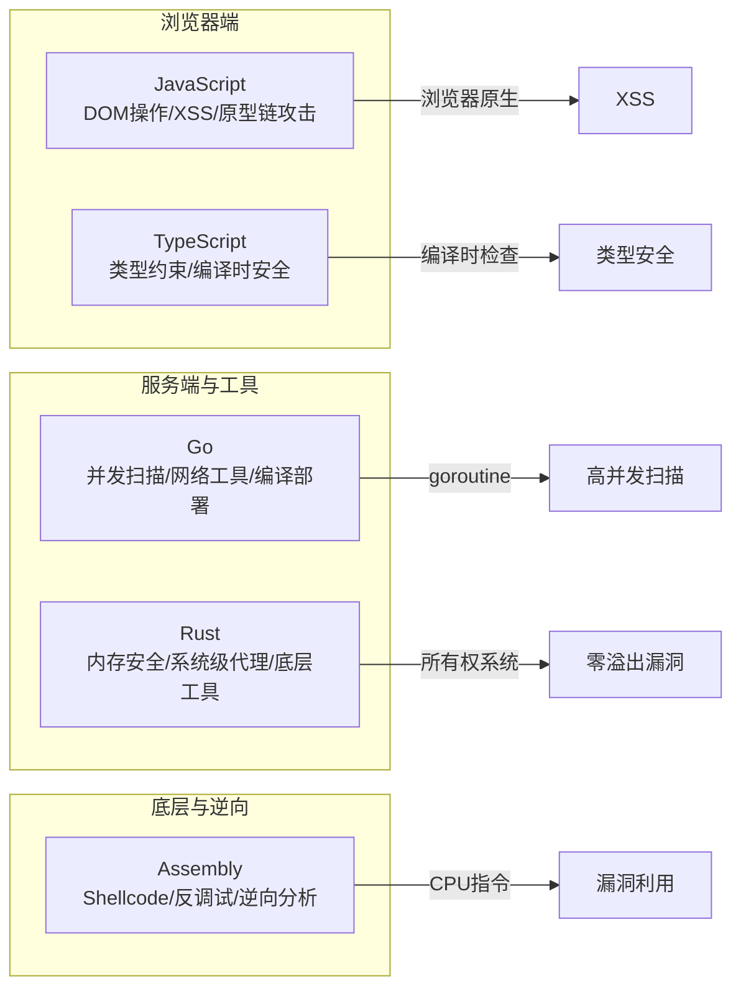
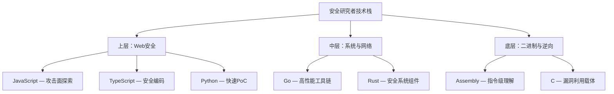
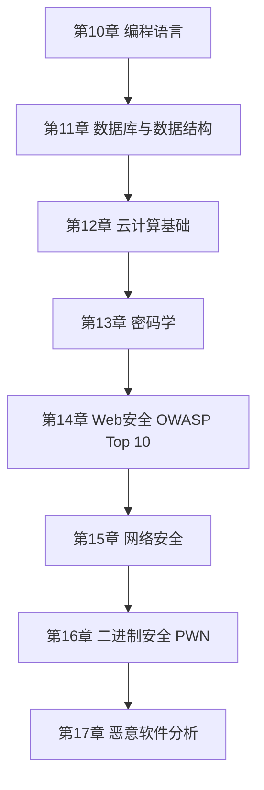

# 第10章 本章小结

本章从理论基础、核心技巧、实战案例、常见误区、练习方法五个维度，系统构建了 JavaScript/TypeScript、Go、Rust、Assembly 四种语言在安全领域的完整知识体系。作为总结，本节将回顾每种语言的核心要点，梳理跨语言的安全思维框架，并给出后续学习的精确路线图。

## 一、五种语言的安全定位全景

每种语言在安全领域都有不可替代的生态位。理解这种定位差异，是选择正确工具的前提。

### 1.1 语言特性与安全能力对照



| 维度 | JavaScript | TypeScript | Go | Rust | Assembly |
|------|-----------|-----------|-----|------|----------|
| **核心安全场景** | Web前端攻击与防御、浏览器扩展开发 | 安全API设计、类型约束驱动的输入验证 | 网络扫描器、爬虫、安全工具链 | 系统代理、内存安全的网络服务 | Shellcode编写、反调试、二进制逆向 |
| **内存安全** | GC管理，无手动内存控制 | 同JS，编译时消除部分类型错误 | GC管理，goroutine栈自动增长 | 所有权+借用检查器，编译时保证 | 完全手动，必须自行管理每个字节 |
| **并发安全** | 事件循环单线程，Web Workers隔离 | 同JS | CSP模型（goroutine+channel），内置data race detector | 所有权系统天然防止数据竞争，Send/Sync trait | 无内置并发支持，需OS级线程 |
| **学习曲线** | 低 | 中 | 中 | 高 | 极高 |
| **安全工具生态** | Burp扩展、浏览器插件、PoC脚本 | 类型安全的后端框架（NestJS） | Nuclei、Subfinder、HTTPX、自研扫描器 | RustScan、cargo-audit、内存安全代理 | pwntools集成、GDB/WinDbg调试 |
| **典型部署形态** | 浏览器内执行、Node.js服务端 | 编译为JS后部署 | 单二进制文件，无依赖跨平台 | 单二进制文件，极小体积 | 嵌入exploit或独立loader |

### 1.2 安全研究者的技术栈分层



## 二、理论基础核心回顾

### 2.1 JavaScript 安全理论要点

JavaScript 在安全领域的理论基础围绕三个核心机制展开：

**原型链继承机制**。JavaScript 通过 `__proto__` 和 `Prototype` 实现属性继承，攻击者利用 `Object.prototype` 的可变性注入恶意属性，导致所有对象实例被污染。防御的关键在于理解原型链的查找顺序：实例属性 → 构造函数原型 → Object.prototype，污染发生在原型层而非实例层。

**同源策略与 DOM 模型**。浏览器的同源策略（Same-Origin Policy）限制跨域资源访问，但存在大量绕过路径：CORS 配置不当、`postMessage` 未校验来源、`document.domain` 降级等。XSS 的本质是绕过同源策略，在目标域的上下文中执行恶意脚本。

**事件循环与异步安全**。Node.js 的单线程事件循环模型意味着阻塞操作会影响整个服务。`process.nextTick`、`Promise`、`setImmediate` 的执行顺序决定了竞态条件的触发时机。未捕获的 Promise rejection 可能导致信息泄露。

### 2.2 TypeScript 类型安全理论要点

TypeScript 的安全价值在于将运行时错误前移到编译时。核心机制包括：

- **结构化类型系统**：鸭子类型（duck typing）确保接口兼容性，减少类型不匹配导致的安全漏洞
- **泛型约束**：通过 `extends` 关键字限制泛型参数范围，防止类型逃逸
- **字面量类型与模板字面量类型**：精确约束字符串格式，防止路径遍历、SQL注入等注入类漏洞
- **严格模式配置**：`strictNullChecks`、`noImplicitAny`、`strictFunctionTypes` 等编译器选项是安全编码的基石

关键认知：TypeScript 类型信息在编译后完全擦除，运行时收到的外部输入（API请求、文件读取、环境变量）仍需 Zod、Yup、io-ts 等运行时验证库进行二次校验。

### 2.3 Go 语言安全理论要点

Go 的安全理论核心在于 **CSP（Communicating Sequential Processes）并发模型**：

- **goroutine** 是轻量级协程，栈初始仅 2KB，可动态增长到 1GB，适合大规模并发扫描
- **channel** 是 goroutine 间通信的唯一推荐方式，避免共享内存带来的数据竞争
- **`sync.Mutex`/`sync.RWMutex`** 用于保护共享状态，但应优先使用 channel 而非锁
- **`context` 包** 提供超时控制和取消传播，防止 goroutine 泄露和无限等待

Go 的错误处理哲学（多返回值 `error`）要求每个可能失败的操作都显式处理错误。安全工具中忽略错误可能导致静默失败，攻击者利用未处理的错误条件绕过检测。

### 2.4 Rust 内存安全理论要点

Rust 的安全性建立在三大核心机制上：

1. **所有权系统**：每个值有且仅有一个所有者，所有者离开作用域时值被自动释放。这从根本上消除了 use-after-free 和 double-free 漏洞
2. **借用检查器**：在任意时刻，要么只有一个可变引用（`&mut T`），要么有多个不可变引用（`&T`），二者不能共存。这消除了数据竞争
3. **生命周期标注**：编译器通过生命周期参数确保引用不会悬垂（dangling reference）

`unsafe` 关键字允许绕过借用检查器，但使用 `unsafe` 时程序员必须手动保证内存安全。安全审计中，`unsafe` 代码块是首要检查目标——它打开了 Rust 安全保证的缺口。

### 2.5 Assembly 底层安全理论要点

汇编语言的安全价值在于提供 CPU 视角的理解：

- **寄存器与栈帧**：x86 的 ESP/EBP 管理栈帧布局，缓冲区溢出的本质是覆盖返回地址（EIP/RIP）
- **系统调用**：用户态到内核态的切换通过 `int 0x80`（32位）或 `syscall`（64位）实现，Shellcode 的核心就是构造系统调用参数
- **指令编码**：坏字符（null byte `0x00`、换行 `0x0a`、回车 `0x0d`）会导致 Shellcode 截断，需要使用编码器绕过
- **ASLR/DEP/Stack Canary**：现代操作系统的三大防护机制，理解它们是绕过它们的前提

## 三、核心技巧与实战能力回顾

### 3.1 各语言安全技术速查表

| 技术领域 | JavaScript/TypeScript | Go | Rust | Assembly |
|---------|----------------------|-----|------|----------|
| **Web攻击** | XSS构造、原型链污染、CSP绕过、SSRF | HTTP走私检测、并发爬虫、API模糊测试 | 异步HTTP客户端、TLS MITM代理 | 不适用 |
| **输入验证** | DOMPurify白名单过滤、CSP nonce | 结构体标签验证、中间件链 | Serde反序列化验证、类型状态模式 | 不适用 |
| **网络编程** | fetch/Axios、WebSocket劫持 | net/http高性能HTTP、原始socket | Tokio异步运行时、raw socket | syscall直接网络调用 |
| **密码学** | Web Crypto API、bcrypt | crypto标准库、argon2id | ring/RustCrypto、constant-time比较 | AES-NI指令加速 |
| **漏洞利用** | Prototype Pollution Chain | 不适用 | 不适用 | Shellcode编写、ROP Chain、格式化字符串 |
| **逆向分析** | 不适用 | 不适用 | 不适用 | 反汇编、反调试、脱壳 |
| **安全审计** | ESLint安全规则、npm audit | go vet、govulncheck | cargo-audit、cargo-geiger | 手动代码审计 |

### 3.2 关键实战场景回顾

**场景一：XSS 漏洞挖掘与利用（JavaScript）**

反射型 XSS 通过 URL 参数注入脚本，存储型 XSS 持久化到数据库影响所有访问者，DOM 型 XSS 完全在客户端执行不经过服务端。防御必须多层叠加：输出编码（HTML实体、JS编码、URL编码）+ CSP `script-src` 白名单 + HttpOnly Cookie 阻止 `document.cookie` 读取。单一防御均可被绕过。

**场景二：自动化漏洞扫描器（Go）**

Go 开发的扫描器利用 goroutine 实现数千并发任务。核心架构：任务队列（channel）→ Worker 池（goroutine）→ 结果收集（select 多路复用）→ 报告生成。`context.WithTimeout` 确保单个任务超时不影响整体流程。编译为单个二进制文件，无需运行时依赖，适合渗透测试现场部署。

**场景三：内存安全的网络代理（Rust）**

Rust 编写的中间人代理利用所有权系统保证：每个 TCP 连接的所有权明确归属，连接断开时资源自动释放，不存在 C 语言中常见的 socket 泄露。`tokio` 异步运行时处理万级并发连接，零拷贝缓冲区减少内存分配开销。

**场景四：Shellcode 实战（Assembly）**

Shellcode 编写的核心流程：确定目标系统调用号 → 构造参数到正确寄存器 → 使用 `syscall`/`int 0x80` 触发 → 处理坏字符 → 测试执行。64 位 Linux 的 `execve("/bin/sh", NULL, NULL)` Shellcode 最小可压缩到 23 字节。实际利用中还需要处理 ASLR（信息泄露计算基址）、DEP（ROP 绕过 NX 位）、Stack Canary（泄露 canary 值或覆盖更高栈帧）。

### 3.3 跨语言安全设计模式

安全开发中存在跨语言通用的设计模式，掌握这些模式比掌握具体 API 更有价值：

**输入验证的洋葱模型**。从外到内依次为：网络层过滤（WAF）→ 应用层白名单验证 → 业务层类型检查 → 数据层参数化查询。每一层独立防御，不依赖上层的正确性。TypeScript 的类型系统覆盖编译时检查，Zod 覆盖运行时验证，Go 的中间件链覆盖请求级过滤——三层各司其职。

**最小权限原则**。Rust 的 `pub(crate)` 限制可见性到当前 crate，Go 的包级可见性（小写开头的标识符不导出），TypeScript 的 `private`/`protected` 访问修饰符——不同语言用不同语法表达相同的最小暴露原则。

**纵深防御（Defense in Depth）**。不要依赖单一安全机制。Rust 的所有权系统防止内存错误，但仍需 `cargo-audit` 检查依赖漏洞；Go 的类型系统防止类型混淆，但仍需 `govulncheck` 检查已知 CVE；TypeScript 的编译时检查减少运行时错误，但仍需 ESLint 安全规则检查编码模式。

## 四、常见误区深度剖析

### 4.1 各语言关键误区与纠正

| 语言 | 常见误区 | 正确认知 | 后果 |
|------|---------|---------|------|
| **JavaScript** | 信任客户端输入 | 所有客户端数据必须在服务端重新验证，包括 header、cookie、URL 参数 | XSS、SQL注入、权限绕过 |
| **JavaScript** | CSP 完全防御 XSS | CSP 可被 JSONP 端点、base-uri 注入、meta tag 覆盖绕过 | XSS 防御失效 |
| **TypeScript** | TypeScript 等于运行时安全 | 编译后类型信息完全擦除，`as any` 类型断言绕过所有检查 | 类型安全的虚假安全感 |
| **Go** | 忽略错误返回值 | `err` 必须检查，安全工具中静默失败等于安全盲区 | 漏洞扫描遗漏、连接泄露 |
| **Go** | 用 mutex 代替 channel | Go 哲学是 "不要通过共享内存来通信，而要通过通信来共享内存" | 死锁、竞态条件、代码难维护 |
| **Rust** | 滥用 `unsafe` 逃逸借用检查器 | `unsafe` 代码应被隔离为最小块，封装在安全抽象之后 | 失去 Rust 的核心安全保证 |
| **Rust** | 认为 Rust 代码不可能有安全漏洞 | 逻辑漏洞、依赖漏洞、TOCTOU 竞态仍可能存在 | 过度信任导致审计不足 |
| **Assembly** | 不考虑坏字符 | Shellcode 中的 `0x00`/`0x0a`/`0x0d` 会导致截断 | Exploit 在运行时静默失败 |
| **Assembly** | 忽略 ASLR/DEP | 现代系统默认开启地址随机化和数据执行保护 | Exploit 可靠性为零 |
| **通用** | 不测试边界条件 | 安全测试必须覆盖空输入、超长输入、特殊字符、Unicode | 边界漏洞被忽略 |

### 4.2 安全代码审查检查清单

审查任何安全相关代码时，按以下优先级逐项检查：

**P0 — 必须修复**：
1. 是否存在未验证的外部输入（用户输入、API响应、文件内容）
2. 是否存在硬编码的密钥、密码、Token
3. 是否存在命令注入、SQL注入、路径遍历的可能
4. `unsafe` 代码块是否经过充分审计
5. 错误处理是否可能泄露敏感信息（堆栈跟踪、内部路径）

**P1 — 强烈建议**：
1. 是否存在资源泄露（未关闭的连接、文件句柄、goroutine）
2. 是否存在竞态条件（共享状态无同步保护）
3. 依赖版本是否有已知 CVE
4. 日志是否包含敏感数据
5. 加密是否使用了安全的算法和参数

**P2 — 最佳实践**：
1. 是否遵循最小权限原则
2. 是否有充分的安全测试用例
3. 错误消息是否对用户友好且不暴露实现细节
4. 是否有速率限制和超时控制

## 五、语言选择决策框架

面对具体安全任务时，语言选择不应凭偏好，而应基于任务需求的理性决策。

### 5.1 决策树

```text
安全任务类型判断：
│
├── 涉及浏览器/DOM？
│   ├── 是 → JavaScript（攻击面探索）/ TypeScript（安全开发）
│   └── 否 ↓
│
├── 需要高性能并发（>1000并发连接）？
│   ├── 是 → Go（开发效率优先）/ Rust（安全优先）
│   └── 否 ↓
│
├── 需要操作内存/系统调用/硬件？
│   ├── 是 → Rust（安全系统编程）/ Assembly + C（漏洞利用）
│   └── 否 ↓
│
├── 快速PoC/脚本/自动化？
│   └── Python / JavaScript
│
└── 部署约束严苛（无运行时依赖/极小体积）？
    ├── Go（单二进制，~10MB）
    └── Rust（单二进制，~1MB，无GC开销）
```

### 5.2 性能与安全特性综合对比

| 维度 | JavaScript | TypeScript | Go | Rust | Assembly |
|------|-----------|-----------|-----|------|----------|
| 执行速度 | 中 | 中 | 快 | 极快 | 极快 |
| 内存占用 | 高 | 高 | 低 | 极低 | 极低 |
| 编译速度 | N/A | 快 | 快（增量编译优化） | 慢（借用检查开销） | N/A |
| 开发效率 | 高 | 高 | 高 | 中 | 低 |
| 内存安全保证 | GC | GC | GC | 编译时 | 无 |
| 类型安全 | 弱 | 强 | 强 | 强 | 无 |
| 并发安全 | 单线程事件循环 | 同JS | CSP模型 | 所有权系统 | 需手动同步 |
| 部署复杂度 | 低（浏览器/Node） | 中（需编译） | 极低（单二进制） | 极低（单二进制） | 极低 |
| 安全工具生态 | 丰富（Web方向） | 中等 | 极丰富 | 快速增长 | 底层工具链 |

## 六、能力自检清单

学习完本章后，对照以下清单评估自身掌握程度。每项能力标注了入门（L1）、进阶（L2）、精通（L3）三个层级。

### 6.1 JavaScript/TypeScript 安全能力

- [ ] **L1** 能识别反射型、存储型、DOM型 XSS 的区别并给出防御代码
- [ ] **L1** 能配置 CSP 头部，理解 `script-src`、`style-src`、`connect-src` 的作用
- [ ] **L2** 能构造原型链污染攻击链，理解 `__proto__`、`constructor`、`prototype` 的关系
- [ ] **L2** 能使用 TypeScript 泛型和条件类型设计类型安全的 API 验证层
- [ ] **L3** 能分析 V8/SpiderMonkey 引擎漏洞（类型混淆、JIT 优化错误）
- [ ] **L3** 能编写浏览器安全扩展，实现请求拦截和修改

### 6.2 Go 安全工具开发能力

- [ ] **L1** 能使用 goroutine + channel 实现并发端口扫描器
- [ ] **L1** 能使用 `net/http` 发送安全的 HTTP 请求，正确处理 TLS 证书验证
- [ ] **L2** 能实现 HTTP 走私检测工具，理解 CL-TE 和 TE-CL 差异
- [ ] **L2** 能使用 `context` 包实现超时控制和优雅关闭
- [ ] **L3** 能开发完整的企业级安全扫描平台（任务调度、结果存储、报告生成）
- [ ] **L3** 能使用 Go 的 `unsafe` 包进行底层内存操作（如解析二进制协议）

### 6.3 Rust 安全编程能力

- [ ] **L1** 能理解所有权、借用、生命周期的基本概念，编译通过无 `unsafe` 的安全代码
- [ ] **L1** 能使用 `Result<T, E>` 进行错误处理，不使用 `unwrap()`
- [ ] **L2** 能使用 Tokio 异步运行时开发高性能网络代理
- [ ] **L2** 能审计 `unsafe` 代码块，识别潜在的内存安全问题
- [ ] **L3** 能使用 FFI 与 C 代码交互，正确处理内存所有权转移
- [ ] **L3** 能开发使用零拷贝技术的高性能数据包解析器

### 6.4 Assembly 底层安全能力

- [ ] **L1** 能阅读 x86/x64 汇编代码，理解 `mov`/`push`/`call`/`ret` 等基本指令
- [ ] **L1** 能理解系统调用约定（32位 `int 0x80`，64位 `syscall`）
- [ ] **L2** 能编写 Shellcode，处理坏字符，测试在目标环境执行
- [ ] **L2** 能使用 GDB/pwndbg 调试二进制程序，分析栈布局
- [ ] **L3** 能构造 ROP Chain 绕过 DEP 保护
- [ ] **L3** 能分析和绕过反调试技术（`ptrace` 自检、时间检测、`int 3` 陷阱）

## 七、推荐工具速查

### 7.1 各语言安全工具链

**JavaScript/TypeScript 生态**：

| 工具 | 用途 | 安装/使用 |
|------|------|----------|
| ESLint + eslint-plugin-security | 静态安全规则检查 | `npm install eslint eslint-plugin-security` |
| npm audit / yarn audit | 依赖漏洞扫描 | `npm audit` |
| DOMPurify | XSS 防御（HTML 白名单过滤） | `npm install dompurify` |
| Helmet.js | HTTP 安全头设置（Express） | `npm install helmet` |
| jsonwebtoken | JWT 签发与验证 | `npm install jsonwebtoken` |
| Zod | 运行时类型验证 | `npm install zod` |

**Go 生态**：

| 工具 | 用途 | 安装/使用 |
|------|------|----------|
| govulncheck | Go 代码和依赖的已知漏洞检查 | `go install golang.org/x/vuln/cmd/govulncheck@latest` |
| gosec | Go 安全静态分析 | `go install github.com/securego/gosec/v2/cmd/gosec@latest` |
| Nuclei | 模板化漏洞扫描器 | `go install github.com/projectdiscovery/nuclei/v3/cmd/nuclei@latest` |
| Subfinder | 子域名枚举 | `go install github.com/projectdiscovery/subfinder/v2/cmd/subfinder@latest` |
| HTTPX | HTTP 探测工具 | `go install github.com/projectdiscovery/httpx/cmd/httpx@latest` |
| air | 热重载开发环境 | `go install github.com/air-verse/air@latest` |

**Rust 生态**：

| 工具 | 用途 | 安装/使用 |
|------|------|----------|
| cargo-audit | Cargo 依赖 CVE 扫描 | `cargo install cargo-audit` |
| cargo-geiger | 检测 `unsafe` 代码使用 | `cargo install cargo-geiger` |
| cargo-fuzz | 模糊测试框架 | `cargo install cargo-fuzz` |
| RustScan | 高速端口扫描器 | `cargo install rustscan` |
| Tokio | 异步运行时 | `Cargo.toml` 添加 `tokio = { version = "1", features = ["full"] }` |
| ring | 密码学原语库 | `Cargo.toml` 添加 `ring = "0.17"` |

**Assembly / 逆向工程工具链**：

| 工具 | 用途 | 安装/使用 |
|------|------|----------|
| pwntools | PWN/exploit 开发框架 | `pip install pwntools` |
| Ghidra | NSA 开源逆向工程平台 | https://ghidra-sre.org |
| Radare2 | 命令行逆向工程框架 | https://rada.re |
| GDB + pwndbg | 增强型调试器 | `git clone https://github.com/pwndbg/pwndbg && cd pwndbg && ./setup.sh` |
| nasm | x86/x64 汇编器 | `apt install nasm` |
| scdbg | Shellcode 模拟执行器 | https://github.com/dzzie/SCDBG |

### 7.2 综合安全测试平台

| 平台 | 类型 | 适用场景 |
|------|------|---------|
| Burp Suite | Web 安全测试 | 手动 Web 漏洞挖掘，代理拦截与修改 |
| OWASP ZAP | Web 安全扫描 | 自动化 Web 漏洞扫描 |
| Nmap | 网络扫描 | 端口发现、服务识别、OS 指纹 |
| Metasploit | 漏洞利用框架 | Exploit 开发与测试、Payload 生成 |
| sqlmap | SQL 注入检测 | 自动化 SQL 注入检测与利用 |

## 八、后续学习路线

### 8.1 推荐学习顺序

完成本章后，建议按以下路径继续深入：



**为什么按这个顺序？**
- 第11章（数据库）为 Web 安全中的 SQL 注入提供数据层基础
- 第12章（云计算）是现代部署环境的必备知识
- 第13章（密码学）为理解加密协议和攻击提供理论基础
- 第14章（Web安全）是本章 JavaScript/TypeScript 知识的直接应用
- 第16章（二进制安全）是本章 Assembly 知识的直接应用

### 8.2 按方向的深度学习路径

**Web 安全方向**：
1. 精通 JavaScript DOM 操作和浏览器 API
2. 深入学习 TypeScript + NestJS 构建安全后端
3. 学习 OWASP Top 10 每一类漏洞的原理与利用
4. 掌握 Burp Suite 高级用法（宏、会话处理、Intruder）
5. 研究浏览器安全机制（CSP、SOP、CORB、COOP/COEP）

**系统安全方向**：
1. 精通 x86/x64 汇编和系统调用
2. 深入学习 C 语言和内存管理
3. 学习二进制漏洞类型（栈溢出、堆溢出、UAF、格式化字符串）
4. 掌握 ROP/Shellcode 高级技术
5. 研究现代防护机制和绕过方法（ASLR、DEP、CFI、PAC）

**安全工具开发方向**：
1. 精通 Go 并发编程和网络编程
2. 学习 Rust 进行系统级安全工具开发
3. 掌握协议分析（HTTP/2、gRPC、WebSocket）
4. 学习数据库设计（SQLite 嵌入式、PostgreSQL 服务端）
5. 构建完整的安全工具链（扫描→检测→报告→修复）

### 8.3 语言学习优先级矩阵

根据你的安全研究方向，选择对应的优先级：

| 方向 | 第一语言 | 第二语言 | 第三语言 | 第四语言 |
|------|---------|---------|---------|---------|
| 初学者入门 | Python | JavaScript | Go | TypeScript |
| Web 安全 | JavaScript | TypeScript | Python | Go |
| 系统安全/逆向 | C | Assembly | Rust | Go |
| 安全工具开发 | Go | Python | Rust | TypeScript |
| 全栈安全 | Python | JavaScript | Go | Rust → Assembly |
| 恶意软件分析 | C | Assembly | Python | Rust |

### 8.4 实践项目建议

将理论转化为能力的唯一路径是动手实践。以下是针对不同水平的项目建议：

**入门项目（1-2周）**：
- 用 JavaScript 编写一个 XSS 检测浏览器扩展
- 用 Go 编写一个并发端口扫描器（支持 TCP/UDP）
- 用 TypeScript + Zod 实现一个安全的 REST API 输入验证层
- 用 NASM 编写一个 Linux x64 的 `execve("/bin/sh")` Shellcode

**进阶项目（2-4周）**：
- 用 Go 开发一个带任务调度的子域名枚举工具
- 用 Rust + Tokio 编写一个支持 HTTPS 的中间人代理
- 用 JavaScript 开发 Burp Suite 扩展实现自定义扫描规则
- 用 Assembly 实现一个绕过坏字符的 Shellcode 编码器

**高级项目（1-2月）**：
- 用 Go + React 开发一个完整的漏洞管理平台
- 用 Rust 开发一个高性能的网络流量分析器（支持 PCAP 解析）
- 用多种语言协作：Go 做扫描引擎 + TypeScript 做 Web 前端 + Rust 做数据处理
- 分析一个真实的 CVE，用 Assembly 复现漏洞利用

## 九、全章总结

本章的核心收获可以归纳为三个层次：

**认知层**——理解每种语言的安全哲学：JavaScript 追求灵活性但需要防御性编码；TypeScript 用类型系统前移错误发现；Go 用简洁的并发模型解决高并发安全工具需求；Rust 用所有权系统在编译时消除内存安全隐患；Assembly 提供不可替代的底层视角。

**技能层**——掌握各语言的核心安全技术栈：能用 JavaScript 构造和防御 XSS，能用 TypeScript 设计类型安全的验证层，能用 Go 开发高性能扫描工具，能用 Rust 编写内存安全的系统组件，能用 Assembly 理解 CPU 执行流。

**决策层**——面对安全任务时能选择最合适的语言：Web 安全用 JavaScript/TypeScript，工具开发用 Go，系统安全用 Rust，底层理解用 Assembly。不要试图用一种语言解决所有问题，而是根据任务特征选择最优工具。

> **"安全研究者应该是多面手。"**
>
> 现代安全威胁跨越技术栈的每一层——从浏览器到操作系统内核，从应用逻辑到 CPU 指令。只掌握一种语言的安全研究者，如同只带一把锤子的工匠，看什么都是钉子。多语言能力不是炫耀，而是理解攻击面全貌的必要条件。
>
> 最终目标不是成为五种语言的专家，而是理解每种语言的安全边界在哪里——知道什么时候该用什么工具，以及为什么。

***
