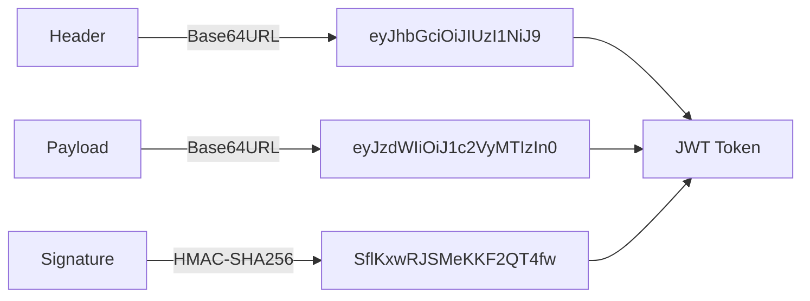
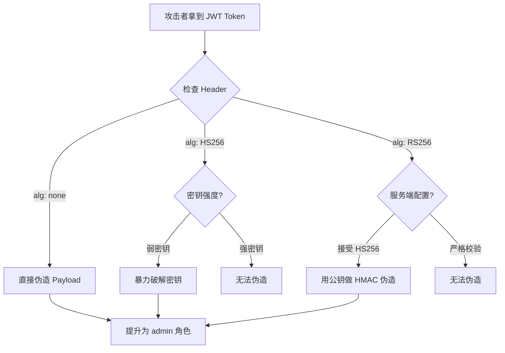
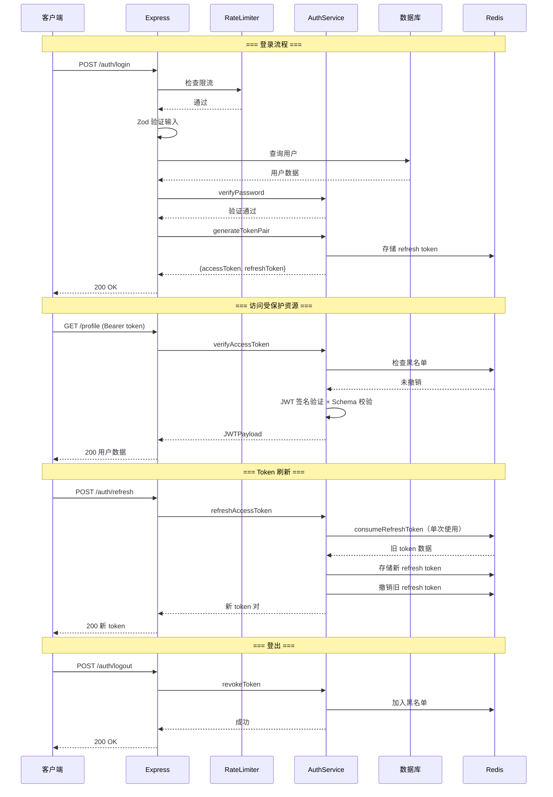

## 案例五：TypeScript安全的JWT认证系统

### 目标场景

构建一个基于 TypeScript 的生产级 JWT 认证系统。本案例从攻击者视角出发，先分析 JWT 的常见攻击面，再逐一实现防御措施，最终形成一套完整的、经过安全审计的认证方案。

认证系统是 Web 应用的核心基础设施。一个设计不当的认证系统会让攻击者绕过所有业务层防护——拿到了 Token 就等于拿到了身份。本案例使用 TypeScript + Express 技术栈，覆盖从密码哈希、Token 签发、中间件鉴权到 Refresh Token 轮转的完整生命周期。

### JWT 基础与威胁模型

#### JWT 结构解析

JWT（JSON Web Token，RFC 7519）由三部分组成，以 `.` 分隔：

```text
Header.Payload.Signature
```

| 部分 | 内容 | 编码方式 | 示例 |
|------|------|----------|------|
| Header | 算法类型和 Token 类型 | Base64URL | `{"alg":"HS256","typ":"JWT"}` |
| Payload | 声明（Claims） | Base64URL | `{"sub":"user123","exp":1700000000}` |
| Signature | 对 Header+Payload 的签名 | HMAC/RSA/ECDSA | 使用密钥计算 |



**关键认知：Header 和 Payload 只是 Base64URL 编码，不是加密。** 任何人拿到 Token 都能解码读取内容。JWT 的安全性完全依赖签名验证——签名保证 Payload 没有被篡改，但不保证机密性。

#### JWT 攻击面分析

作为安全工程师，必须理解攻击者如何针对 JWT 发起攻击：

| 攻击类型 | 原理 | 危害等级 | 防御手段 |
|----------|------|----------|----------|
| `alg:none` 攻击 | 将 Header 的 alg 改为 "none"，去除签名 | 致命 | 服务端强制指定允许的算法列表 |
| 密钥混淆攻击（RSA→HMAC） | 用 RSA 公钥作为 HMAC 密钥伪造签名 | 致命 | 严格区分对称/非对称算法 |
| 弱密钥爆破 | 短密钥或常见密码作为签名密钥 | 高危 | 密钥长度 ≥ 256 位，随机生成 |
| Payload 篡改 | 修改 Base64URL 编码的 Payload | 高危 | 签名验证 + Schema 校验 |
| Token 重放 | 截获合法 Token 后重复使用 | 中危 | 短过期时间 + Refresh Token |
| 密钥泄露 | 环境变量、代码仓库、日志泄露密钥 | 致命 | 密钥管理服务（KMS/Vault） |
| Kid 注入 | Header 中 kid 参数指向恶意文件 | 高危 | 白名单校验 kid 值 |



### 完整实现

#### 依赖选型与安全评估

| 包名 | 用途 | 安全评估 |
|------|------|----------|
| `jsonwebtoken` | JWT 签发/验证 | 最广泛使用的 Node.js JWT 库，维护活跃 |
| `bcrypt` | 密码哈希 | 抗 GPU/ASIC，自适应成本因子 |
| `zod` | 运行时输入验证 | 防止类型混淆和注入攻击 |
| `uuid` | 生成唯一标识符 | RFC 4122 v4，碰撞概率可忽略 |
| `ioredis` | Redis 客户端（可选） | 用于 Token 黑名单和 Refresh Token 存储 |

```bash
npm install jsonwebtoken bcrypt zod uuid
npm install -D @types/jsonwebtoken @types/bcrypt @types/uuid
```

> **为什么不用 argon2？** bcrypt 已经过 20+ 年实战检验，NPM 生态成熟。argon2 理论上更强，但 Node.js 绑定依赖原生编译，在某些环境（Alpine Docker、Lambda）安装困难。生产环境中 bcrypt cost=12 已足够安全，除非面临国家级攻击者。

#### 输入验证层——第一道防线

所有外部输入都必须经过严格验证。TypeScript 的类型系统只在编译时生效，运行时（来自 HTTP 请求的 JSON）需要额外的 Schema 验证：

```typescript
import { z } from 'zod';

// ============================================================
// 登录请求验证
// ============================================================
const LoginSchema = z.object({
  username: z.string()
    .min(3, '用户名至少3个字符')
    .max(20, '用户名最多20个字符')
    .regex(/^[a-zA-Z0-9_]+$/, '用户名只能包含字母、数字和下划线'),
  password: z.string()
    .min(8, '密码至少8个字符')
    .max(128, '密码最多128个字符'),
});

// ============================================================
// 注册请求验证（比登录多了确认密码和邮箱）
// ============================================================
const RegisterSchema = z.object({
  username: z.string()
    .min(3)
    .max(20)
    .regex(/^[a-zA-Z0-9_]+$/),
  email: z.string().email('邮箱格式不正确'),
  password: z.string()
    .min(8)
    .max(128)
    .regex(
      /^(?=.*[a-z])(?=.*[A-Z])(?=.*\d)(?=.*[@$!%*?&])[A-Za-z\d@$!%*?&]/,
      '密码必须包含大小写字母、数字和特殊字符'
    ),
  confirmPassword: z.string(),
}).refine((data) => data.password === data.confirmPassword, {
  message: '两次密码输入不一致',
  path: ['confirmPassword'],
});

// ============================================================
// JWT Payload 验证——防止类型混淆攻击
// ============================================================
const JWTPayloadSchema = z.object({
  sub: z.string().uuid(),         // 用户 ID
  role: z.enum(['user', 'moderator', 'admin']),
  iss: z.literal('my-app'),       // 签发者
  aud: z.literal('my-app-client'), // 受众
  jti: z.string().uuid(),         // Token 唯一 ID，用于黑名单
  iat: z.number(),                // 签发时间
  exp: z.number(),                // 过期时间
});

type LoginInput = z.infer<typeof LoginSchema>;
type RegisterInput = z.infer<typeof RegisterSchema>;
type JWTPayload = z.infer<typeof JWTPayloadSchema>;
```

**为什么必须做运行时验证？** 攻击者可以直接用 `curl` 发送任意 JSON，绕过前端 TypeScript 类型检查。`zod` 的 `.parse()` 在运行时验证每个字段，不匹配则抛出 `ZodError`，阻止恶意数据进入业务逻辑。

#### 密码哈希——bcrypt 的正确使用

```typescript
import bcrypt from 'bcrypt';
import crypto from 'crypto';

// 成本因子：每增加1，计算时间翻倍
// 12 在 2024 年硬件上约需 250ms，是安全性和性能的平衡点
const BCRYPT_COST = 12;

class PasswordService {
  /**
   * 哈希密码
   * bcrypt 自动处理 salt 的生成和嵌入，hash 结果中包含 salt
   * 格式: $2b$12$<22字符salt><31字符hash>
   */
  async hashPassword(password: string): Promise<string> {
    return bcrypt.hash(password, BCRYPT_COST);
  }

  /**
   * 验证密码——使用常量时间比较
   * bcrypt.compare 内部使用常量时间比较，防止时序攻击
   */
  async verifyPassword(password: string, hash: string): Promise<boolean> {
    return bcrypt.compare(password, hash);
  }

  /**
   * 生成密码重置 Token
   * 使用 crypto.randomBytes 而非 Math.random()
   * 存储哈希值而非明文，即使数据库泄露也无法直接使用
   */
  generateResetToken(): { token: string; hash: string } {
    const token = crypto.randomBytes(32).toString('hex');
    const hash = crypto.createHash('sha256').update(token).digest('hex');
    return { token, hash };
  }
}
```

**常见错误：**

- ❌ 使用 `Math.random()` 生成安全相关的随机数——可预测
- ❌ 自己实现密码哈希——极大概率存在漏洞
- ❌ bcrypt cost 设为 4-6——太快，容易被暴力破解
- ❌ 将 salt 单独存储——bcrypt 的 hash 字段已包含 salt
- ✅ 使用 `bcrypt.hash(password, 12)` ——salt 自动生成并嵌入结果

#### 核心认证服务

```typescript
import jwt from 'jsonwebtoken';
import { v4 as uuidv4 } from 'uuid';

interface TokenPair {
  accessToken: string;
  refreshToken: string;
  expiresIn: number;  // access token 过期秒数
}

interface TokenConfig {
  accessSecret: string;       // Access Token 签名密钥
  refreshSecret: string;      // Refresh Token 签名密钥——必须不同！
  accessExpiresIn: string;    // Access Token 有效期，如 '15m'
  refreshExpiresIn: string;   // Refresh Token 有效期，如 '7d'
  issuer: string;             // 签发者标识
  audience: string;           // 受众标识
}

class AuthService {
  private config: TokenConfig;
  private passwordService: PasswordService;
  // 生产环境应使用 Redis 存储
  private revokedTokens: Set<string> = new Set();
  private refreshTokens: Map<string, { userId: string; expiresAt: Date }> = new Map();

  constructor(config: TokenConfig) {
    this.validateConfig(config);
    this.config = config;
    this.passwordService = new PasswordService();
  }

  // ============================================================
  // 配置验证——启动时就发现问题
  // ============================================================
  private validateConfig(config: TokenConfig): void {
    const MIN_SECRET_LENGTH = 32;

    if (config.accessSecret.length < MIN_SECRET_LENGTH) {
      throw new Error(
        `Access Token 密钥太短（${config.accessSecret.length}字符），` +
        `至少需要 ${MIN_SECRET_LENGTH} 个字符`
      );
    }
    if (config.refreshSecret.length < MIN_SECRET_LENGTH) {
      throw new Error(
        `Refresh Token 密钥太短（${config.refreshSecret.length}字符），` +
        `至少需要 ${MIN_SECRET_LENGTH} 个字符`
      );
    }
    if (config.accessSecret === config.refreshSecret) {
      throw new Error(
        'Access Token 和 Refresh Token 不能使用相同的密钥！' +
        '泄露一个会导致两种 Token 都可伪造。'
      );
    }
  }

  // ============================================================
  // 生成 Token 对——Access + Refresh
  // ============================================================
  generateTokenPair(user: { id: string; role: string }): TokenPair {
    const jti = uuidv4();  // 唯一标识，用于 Token 黑名单

    const accessToken = jwt.sign(
      {
        sub: user.id,
        role: user.role,
        iss: this.config.issuer,
        aud: this.config.audience,
        jti,
      },
      this.config.accessSecret,
      {
        expiresIn: this.config.accessExpiresIn,
        algorithm: 'HS256',  // 明确指定算法，防止 alg:none 攻击
      }
    );

    const refreshJti = uuidv4();
    const refreshToken = jwt.sign(
      {
        sub: user.id,
        type: 'refresh',
        iss: this.config.issuer,
        aud: this.config.audience,
        jti: refreshJti,
      },
      this.config.refreshSecret,
      {
        expiresIn: this.config.refreshExpiresIn,
        algorithm: 'HS256',
      }
    );

    // 存储 refresh token 元数据，用于轮转和撤销
    const decoded = jwt.decode(refreshToken) as jwt.JwtPayload;
    this.refreshTokens.set(refreshJti, {
      userId: user.id,
      expiresAt: new Date((decoded.exp ?? 0) * 1000),
    });

    return {
      accessToken,
      refreshToken,
      expiresIn: 15 * 60,  // 15分钟 = 900秒
    };
  }

  // ============================================================
  // 验证 Access Token
  // ============================================================
  verifyAccessToken(token: string): JWTPayload {
    // 检查是否已被撤销（黑名单）
    const decoded = jwt.decode(token, { complete: true });
    if (decoded?.payload && typeof decoded.payload === 'object') {
      const jti = (decoded.payload as Record<string, unknown>).jti;
      if (typeof jti === 'string' && this.revokedTokens.has(jti)) {
        throw new Error('Token has been revoked');
      }
    }

    try {
      const verified = jwt.verify(token, this.config.accessSecret, {
        algorithms: ['HS256'],  // 限制允许的算法，关键防御！
        issuer: this.config.issuer,
        audience: this.config.audience,
      });
      return JWTPayloadSchema.parse(verified);
    } catch (error) {
      if (error instanceof jwt.TokenExpiredError) {
        throw new Error('Token has expired');
      }
      if (error instanceof jwt.NotBeforeError) {
        throw new Error('Token is not yet valid');
      }
      throw new Error('Invalid token');
    }
  }

  // ============================================================
  // Refresh Token 轮转——单次使用 + 自动轮转
  // ============================================================
  async refreshAccessToken(refreshToken: string): Promise<TokenPair> {
    let decoded: jwt.JwtPayload;
    try {
      decoded = jwt.verify(refreshToken, this.config.refreshSecret, {
        algorithms: ['HS256'],
        issuer: this.config.issuer,
        audience: this.config.audience,
      }) as jwt.JwtPayload;
    } catch {
      throw new Error('Invalid refresh token');
    }

    if (decoded.type !== 'refresh') {
      throw new Error('Token is not a refresh token');
    }

    const jti = decoded.jti;
    if (!jti || !this.refreshTokens.has(jti)) {
      throw new Error('Refresh token not found or already used');
    }

    // 撤销旧的 refresh token（单次使用）
    this.refreshTokens.delete(jti);

    // 查找用户信息（生产环境从数据库获取）
    const user = await this.findUserById(decoded.sub!);
    if (!user) {
      throw new Error('User not found');
    }

    // 签发新的 Token 对
    return this.generateTokenPair(user);
  }

  // ============================================================
  // 撤销 Token（登出）
  // ============================================================
  revokeToken(token: string): void {
    const decoded = jwt.decode(token, { complete: true });
    if (decoded?.payload && typeof decoded.payload === 'object') {
      const payload = decoded.payload as Record<string, unknown>;
      if (typeof payload.jti === 'string') {
        // 黑名单中存储 jti + 过期时间，过期后自动清理
        this.revokedTokens.add(payload.jti);
      }
    }
  }

  // 模拟数据库查询
  private async findUserById(id: string): Promise<{ id: string; role: string } | null> {
    // 生产环境替换为实际数据库查询
    return { id, role: 'user' };
  }
}
```

**设计要点：**

1. **Access Token 和 Refresh Token 使用不同密钥**——即使 Access Token 泄露（有效期短），攻击者无法伪造 Refresh Token
2. **Refresh Token 单次使用**——每次刷新后旧 Token 立即失效，防止重放攻击
3. **JWT 黑名单机制**——登出时将 Token 的 `jti` 加入黑名单，确保已登出的 Token 无法继续使用
4. **显式指定 `algorithms: ['HS256']`**——这是防御 `alg:none` 和密钥混淆攻击的关键一步

#### Express 中间件实现

```typescript
import { Request, Response, NextFunction } from 'express';

// ============================================================
// 扩展 Express Request 类型
// ============================================================
declare global {
  namespace Express {
    interface Request {
      user?: JWTPayload;
    }
  }
}

// ============================================================
// 认证中间件——从 Authorization 头提取和验证 Token
// ============================================================
function authenticate(req: Request, res: Response, next: NextFunction): void {
  const authHeader = req.headers.authorization;

  if (!authHeader) {
    res.status(401).json({ error: 'Missing Authorization header' });
    return;
  }

  // 支持 "Bearer <token>" 格式
  const parts = authHeader.split(' ');
  if (parts.length !== 2 || parts[0] !== 'Bearer') {
    res.status(401).json({
      error: 'Invalid Authorization header format. Expected: Bearer <token>',
    });
    return;
  }

  const token = parts[1];

  try {
    // Token 验证在 AuthService 中已完成所有安全检查
    req.user = authService.verifyAccessToken(token);
    next();
  } catch (error) {
    const message = error instanceof Error ? error.message : 'Authentication failed';
    res.status(401).json({ error: message });
  }
}

// ============================================================
// 授权中间件——基于角色的访问控制（RBAC）
// ============================================================
function authorize(...allowedRoles: string[]) {
  return (req: Request, res: Response, next: NextFunction): void => {
    if (!req.user) {
      res.status(401).json({ error: 'Not authenticated' });
      return;
    }

    if (!allowedRoles.includes(req.user.role)) {
      res.status(403).json({
        error: 'Insufficient permissions',
        required: allowedRoles,
        current: req.user.role,
      });
      return;
    }

    next();
  };
}

// ============================================================
// 限流中间件——防止暴力破解
// ============================================================
const loginAttempts = new Map<string, { count: number; resetAt: number }>();

function rateLimitLogin(req: Request, res: Response, next: NextFunction): void {
  const ip = req.ip || req.socket.remoteAddress || 'unknown';
  const now = Date.now();
  const windowMs = 15 * 60 * 1000;  // 15 分钟
  const maxAttempts = 5;

  const record = loginAttempts.get(ip);

  if (record) {
    if (now > record.resetAt) {
      // 窗口已过期，重置
      loginAttempts.set(ip, { count: 1, resetAt: now + windowMs });
    } else if (record.count >= maxAttempts) {
      const retryAfter = Math.ceil((record.resetAt - now) / 1000);
      res.status(429).json({
        error: 'Too many login attempts',
        retryAfterSeconds: retryAfter,
      });
      return;
    } else {
      record.count++;
    }
  } else {
    loginAttempts.set(ip, { count: 1, resetAt: now + windowMs });
  }

  next();
}
```

#### 路由整合

```typescript
import express from 'express';

const app = express();
app.use(express.json());

// 全局安全头
app.use((_req, res, next) => {
  res.setHeader('X-Content-Type-Options', 'nosniff');
  res.setHeader('X-Frame-Options', 'DENY');
  res.setHeader('Cache-Control', 'no-store');  // 不缓存认证响应
  next();
});

// ============================================================
// 公开路由
// ============================================================
app.post('/auth/register', async (req, res) => {
  try {
    const input = RegisterSchema.parse(req.body);

    // 检查用户名/邮箱是否已存在
    const existing = await findUser(input.username);
    if (existing) {
      return res.status(409).json({ error: 'Username already exists' });
    }

    const passwordHash = await passwordService.hashPassword(input.password);
    const user = await createUser({
      username: input.username,
      email: input.email,
      passwordHash,
    });

    return res.status(201).json({ userId: user.id });
  } catch (error) {
    if (error instanceof z.ZodError) {
      return res.status(400).json({
        error: 'Validation failed',
        details: error.errors.map((e) => ({
          field: e.path.join('.'),
          message: e.message,
        })),
      });
    }
    return res.status(500).json({ error: 'Internal server error' });
  }
});

app.post('/auth/login', rateLimitLogin, async (req, res) => {
  try {
    const input = LoginSchema.parse(req.body);

    const user = await findUser(input.username);
    if (!user) {
      // 故意模糊错误信息——不告诉攻击者是用户名还是密码错误
      return res.status(401).json({ error: 'Invalid credentials' });
    }

    const valid = await passwordService.verifyPassword(
      input.password,
      user.passwordHash
    );
    if (!valid) {
      return res.status(401).json({ error: 'Invalid credentials' });
    }

    const tokens = authService.generateTokenPair({
      id: user.id,
      role: user.role,
    });

    return res.json(tokens);
  } catch (error) {
    if (error instanceof z.ZodError) {
      return res.status(400).json({ error: 'Validation failed', details: error.errors });
    }
    return res.status(500).json({ error: 'Internal server error' });
  }
});

app.post('/auth/refresh', async (req, res) => {
  try {
    const { refreshToken } = req.body;
    if (!refreshToken || typeof refreshToken !== 'string') {
      return res.status(400).json({ error: 'Refresh token required' });
    }

    const tokens = await authService.refreshAccessToken(refreshToken);
    return res.json(tokens);
  } catch (error) {
    return res.status(401).json({ error: 'Invalid refresh token' });
  }
});

app.post('/auth/logout', authenticate, (req, res) => {
  const authHeader = req.headers.authorization!;
  const token = authHeader.split(' ')[1];
  authService.revokeToken(token);
  return res.json({ message: 'Logged out successfully' });
});

// ============================================================
// 受保护路由
// ============================================================
app.get('/profile', authenticate, (req, res) => {
  return res.json({
    userId: req.user!.sub,
    role: req.user!.role,
  });
});

app.get('/admin/users', authenticate, authorize('admin'), async (_req, res) => {
  const users = await listUsers();
  return res.json(users);
});

// 错误处理——不泄露内部信息
app.use((err: Error, _req: Request, res: Response, _next: NextFunction) => {
  console.error('Unhandled error:', err);
  return res.status(500).json({ error: 'Internal server error' });
});
```

### 安全审计清单

在将 JWT 认证系统部署到生产环境之前，逐项检查以下内容：

| # | 检查项 | 要求 | 本实现状态 |
|---|--------|------|------------|
| 1 | 算法白名单 | 服务端 `verify` 必须指定 `algorithms` | ✅ `['HS256']` |
| 2 | 密钥长度 | ≥ 256 位（32 字符） | ✅ 构造函数检查 |
| 3 | 密钥分离 | Access/Refresh 使用不同密钥 | ✅ 独立密钥 |
| 4 | 密钥来源 | 环境变量，非硬编码 | ✅ `process.env` |
| 5 | 输入验证 | 运行时 Schema 校验 | ✅ zod |
| 6 | 密码哈希 | bcrypt ≥ cost 10 | ✅ cost=12 |
| 7 | 错误信息 | 不泄露用户名是否存在 | ✅ 统一 "Invalid credentials" |
| 8 | 限流 | 登录接口限流 | ✅ 5次/15分钟 |
| 9 | Token 撤销 | 支持登出后失效 | ✅ jti 黑名单 |
| 10 | Refresh 轮转 | 单次使用，轮转时撤销旧 Token | ✅ |
| 11 | iss/aud 校验 | 验证签发者和受众 | ✅ |
| 12 | 过期时间 | Access ≤ 15min，Refresh ≤ 7d | ✅ |
| 13 | 安全头 | no-store 防缓存 | ✅ |
| 14 | HTTPS | 生产环境强制 HTTPS | ⚠️ 需 Nginx/TLS 层 |

### 常见漏洞与攻防实战

#### 漏洞一：`alg:none` 攻击

```typescript
// ❌ 漏洞代码：未限制算法
const decoded = jwt.verify(token, secret);
// 攻击者将 Header 改为 {"alg":"none","typ":"JWT"}
// 去掉签名部分，直接伪造任意 Payload
// verify 会接受这个 Token！

// ✅ 修复：显式限制算法
const decoded = jwt.verify(token, secret, {
  algorithms: ['HS256'],  // 只接受指定算法
});
```

#### 漏洞二：密钥混淆攻击

```typescript
// ❌ 场景：服务端使用 RS256，但验证时未限制算法
// 攻击者获取 RSA 公钥后，将 alg 改为 HS256
// 用 RSA 公钥作为 HMAC 密钥签名
// 因为 HMAC 用同一个密钥做签名和验证，攻击成功

// ✅ 修复：严格限制算法类型
jwt.verify(token, publicKey, {
  algorithms: ['RS256'],  // 不接受 HS256
});
```

#### 漏洞三：时序攻击

```typescript
// ❌ 漏洞代码：自定义 Token 比较使用 ===
function verifyTokenSimple(token: string, validToken: string): boolean {
  return token === validToken;  // 比较时间与匹配字符数成正比
}

// ✅ 修复：使用常量时间比较
import crypto from 'crypto';
function verifyTokenSafe(token: string, validToken: string): boolean {
  if (token.length !== validToken.length) return false;
  return crypto.timingSafeEqual(
    Buffer.from(token),
    Buffer.from(validToken)
  );
}
// 注：jsonwebtoken 库内部已使用常量时间比较
```

### 进阶：生产环境强化方案

#### Token 黑名单的 Redis 实现

内存中的 `Set` 和 `Map` 无法水平扩展。多实例部署时，必须使用共享存储：

```typescript
import Redis from 'ioredis';

class RedisTokenStore {
  private redis: Redis;

  constructor(redisUrl: string) {
    this.redis = new Redis(redisUrl);
  }

  /**
   * 将 Token 加入黑名单
   * 使用 TTL 自动过期，等于 Token 剩余有效期
   */
  async revokeToken(jti: string, expiresAt: number): Promise<void> {
    const ttl = expiresAt - Math.floor(Date.now() / 1000);
    if (ttl > 0) {
      await this.redis.setex(`revoked:${jti}`, ttl, '1');
    }
  }

  /**
   * 检查 Token 是否已被撤销
   */
  async isRevoked(jti: string): Promise<boolean> {
    const result = await this.redis.exists(`revoked:${jti}`);
    return result === 1;
  }

  /**
   * 存储 Refresh Token 元数据
   * 使用 Hash 结构，支持后续查询和管理
   */
  async storeRefreshToken(
    jti: string,
    userId: string,
    expiresAt: number
  ): Promise<void> {
    const ttl = expiresAt - Math.floor(Date.now() / 1000);
    await this.redis.setex(
      `refresh:${jti}`,
      ttl,
      JSON.stringify({ userId, expiresAt })
    );
  }

  /**
   * 消费 Refresh Token（单次使用）
   * GET + DELETE 原子操作，防止并发刷新
   */
  async consumeRefreshToken(jti: string): Promise<{ userId: string } | null> {
    const key = `refresh:${jti}`;
    const data = await this.redis.getdel(key);
    return data ? JSON.parse(data) : null;
  }

  /**
   * 撤销用户的所有 Refresh Token
   * 用于密码修改、管理员强制登出等场景
   */
  async revokeAllUserTokens(userId: string): Promise<void> {
    // 实际实现需要维护 userId → jti 的索引
    // 这里用 Redis SCAN 示意
    let cursor = '0';
    do {
      const [nextCursor, keys] = await this.redis.scan(
        cursor, 'MATCH', 'refresh:*', 'COUNT', 100
      );
      cursor = nextCursor;
      for (const key of keys) {
        const data = await this.redis.get(key);
        if (data) {
          const parsed = JSON.parse(data);
          if (parsed.userId === userId) {
            await this.redis.del(key);
          }
        }
      }
    } while (cursor !== '0');
  }
}
```

#### 密钥管理最佳实践

```bash
# ❌ 错误：硬编码在源代码中
const secret = 'my-super-secret-key-12345';

# ❌ 错误：使用简单的字符串
JWT_SECRET=secret

# ✅ 正确：使用 openssl 生成强随机密钥
openssl rand -base64 64

# ✅ 正确：环境变量注入
export JWT_ACCESS_SECRET=$(openssl rand -base64 64)
export JWT_REFRESH_SECRET=$(openssl rand -base64 64)

# ✅ 生产环境：使用 KMS/Vault
# AWS KMS、HashiCorp Vault、Azure Key Vault 等
# 密钥轮转时，新旧密钥并行验证一段时间
```

**密钥轮转策略：**

```typescript
interface KeyRotationConfig {
  currentKey: string;
  previousKey: string;  // 用于验证旧 Token
  rotatedAt: Date;
}

function verifyWithRotation(
  token: string,
  config: KeyRotationConfig
): JWTPayload {
  // 先用当前密钥验证
  try {
    return verifyAccessTokenWithKey(token, config.currentKey);
  } catch {
    // 失败后用旧密钥验证（Token 可能在轮转前签发）
    return verifyAccessTokenWithKey(token, config.previousKey);
  }
}
```

### 测试策略

```typescript
import { describe, it, expect, beforeEach } from 'vitest';

describe('AuthService', () => {
  let authService: AuthService;

  beforeEach(() => {
    authService = new AuthService({
      accessSecret: 'test-access-secret-at-least-32-chars-long!',
      refreshSecret: 'test-refresh-secret-at-least-32-chars-long!',
      accessExpiresIn: '15m',
      refreshExpiresIn: '7d',
      issuer: 'my-app',
      audience: 'my-app-client',
    });
  });

  describe('Token 生成与验证', () => {
    it('应生成有效的 Token 对', () => {
      const tokens = authService.generateTokenPair({
        id: '123e4567-e89b-12d3-a456-426614174000',
        role: 'user',
      });

      expect(tokens.accessToken).toBeDefined();
      expect(tokens.refreshToken).toBeDefined();
      expect(tokens.expiresIn).toBe(900);
    });

    it('应验证合法 Token', () => {
      const tokens = authService.generateTokenPair({
        id: '123e4567-e89b-12d3-a456-426614174000',
        role: 'admin',
      });

      const payload = authService.verifyAccessToken(tokens.accessToken);
      expect(payload.sub).toBe('123e4567-e89b-12d3-a456-426614174000');
      expect(payload.role).toBe('admin');
      expect(payload.iss).toBe('my-app');
    });

    it('应拒绝篡改的 Token', () => {
      const tokens = authService.generateTokenPair({
        id: '123e4567-e89b-12d3-a456-426614174000',
        role: 'user',
      });

      // 篡改 Payload（修改角色）
      const parts = tokens.accessToken.split('.');
      const payload = JSON.parse(
        Buffer.from(parts[1], 'base64url').toString()
      );
      payload.role = 'admin';
      parts[1] = Buffer.from(JSON.stringify(payload)).toString('base64url');
      const tamperedToken = parts.join('.');

      expect(() => authService.verifyAccessToken(tamperedToken)).toThrow(
        'Invalid token'
      );
    });

    it('应拒绝过期 Token', async () => {
      const shortLivedAuth = new AuthService({
        accessSecret: 'test-access-secret-at-least-32-chars-long!',
        refreshSecret: 'test-refresh-secret-at-least-32-chars-long!',
        accessExpiresIn: '1s',  // 1秒过期
        refreshExpiresIn: '7d',
        issuer: 'my-app',
        audience: 'my-app-client',
      });

      const tokens = shortLivedAuth.generateTokenPair({
        id: '123e4567-e89b-12d3-a456-426614174000',
        role: 'user',
      });

      // 等待 Token 过期
      await new Promise((resolve) => setTimeout(resolve, 1500));

      expect(() => shortLivedAuth.verifyAccessToken(tokens.accessToken)).toThrow(
        'Token has expired'
      );
    });

    it('应拒绝使用 Refresh Token 访问受保护资源', () => {
      const tokens = authService.generateTokenPair({
        id: '123e4567-e89b-12d3-a456-426614174000',
        role: 'user',
      });

      expect(() => authService.verifyAccessToken(tokens.refreshToken)).toThrow();
    });
  });

  describe('Token 撤销', () => {
    it('应撤销 Token 后拒绝验证', () => {
      const tokens = authService.generateTokenPair({
        id: '123e4567-e89b-12d3-a456-426614174000',
        role: 'user',
      });

      // 验证成功
      authService.verifyAccessToken(tokens.accessToken);

      // 撤销
      authService.revokeToken(tokens.accessToken);

      // 再次验证应失败
      expect(() => authService.verifyAccessToken(tokens.accessToken)).toThrow(
        'Token has been revoked'
      );
    });
  });

  describe('Refresh Token 轮转', () => {
    it('应轮转 Refresh Token 并撤销旧 Token', async () => {
      const tokens1 = authService.generateTokenPair({
        id: '123e4567-e89b-12d3-a456-426614174000',
        role: 'user',
      });

      // 第一次刷新——成功
      const tokens2 = await authService.refreshAccessToken(tokens1.refreshToken);
      expect(tokens2.accessToken).toBeDefined();
      expect(tokens2.refreshToken).not.toBe(tokens1.refreshToken);

      // 用旧的 Refresh Token 再次刷新——应失败
      await expect(
        authService.refreshAccessToken(tokens1.refreshToken)
      ).rejects.toThrow('Refresh token not found or already used');

      // 新的 Refresh Token 应该可用
      const tokens3 = await authService.refreshAccessToken(tokens2.refreshToken);
      expect(tokens3.accessToken).toBeDefined();
    });
  });

  describe('配置验证', () => {
    it('应拒绝短密钥', () => {
      expect(
        () =>
          new AuthService({
            accessSecret: 'short',
            refreshSecret: 'test-refresh-secret-at-least-32-chars-long!',
            accessExpiresIn: '15m',
            refreshExpiresIn: '7d',
            issuer: 'my-app',
            audience: 'my-app-client',
          })
      ).toThrow('Access Token 密钥太短');
    });

    it('应拒绝相同密钥', () => {
      const sameKey = 'test-same-secret-at-least-32-chars-long!';
      expect(
        () =>
          new AuthService({
            accessSecret: sameKey,
            refreshSecret: sameKey,
            accessExpiresIn: '15m',
            refreshExpiresIn: '7d',
            issuer: 'my-app',
            audience: 'my-app-client',
          })
      ).toThrow('不能使用相同的密钥');
    });
  });
});
```

### 架构总览



### 总结

本案例从攻击者视角出发，构建了一个生产级的 TypeScript JWT 认证系统。核心安全原则：

1. **永远不信任客户端输入**——Zod 运行时验证，TypeScript 类型只在编译时有效
2. **显式指定和限制 JWT 算法**——防御 `alg:none` 和密钥混淆攻击的最有效手段
3. **Access/Refresh 分离**——短生命周期 Access Token + 可撤销的 Refresh Token，平衡安全性和用户体验
4. **常量时间比较**——防止时序攻击，`jsonwebtoken` 和 `bcrypt` 内部已实现
5. **最小权限原则**——RBAC 中间件确保用户只能访问其角色允许的资源
6. **Defense in Depth**——限流 + 输入验证 + 签名验证 + 黑名单，多层防御

JWT 不是银弹。对于需要即时撤销的高安全场景（如银行系统），考虑使用数据库 Session 而非 JWT。JWT 最适合分布式系统中服务间的无状态认证。
