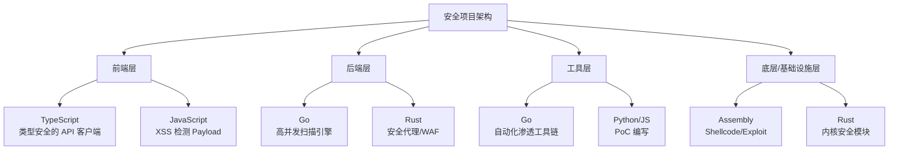

## 案例总结

本章通过五个实战案例，分别展示了 JavaScript、Go、Rust、Assembly 和 TypeScript 五种语言在安全领域的典型应用。每个案例不仅演示了具体技术实现，更揭示了不同语言在安全攻防中的独特定位和设计哲学。本节将对五个案例进行系统性回顾，提炼跨语言的安全设计模式，梳理各语言的能力矩阵，并为读者规划从入门到精通的学习路径。

### 案例全景回顾

五个案例覆盖了安全工程的完整光谱——从 Web 前端的漏洞挖掘，到后端的自动化扫描，再到网络层的流量过滤，直至底层的 Shellcode 编写和认证系统的设计。以下是每个案例的核心要点和技术亮点。

#### 案例一：JavaScript XSS 漏洞挖掘与利用

**核心场景：** 一个在线笔记应用，用户创建的笔记内容支持 HTML 渲染，服务端使用 Express + EJS 模板引擎。

**技术要点：**

- **漏洞根因：** 服务端直接将用户输入拼接进 HTML 响应（`${note.content}`），未做任何转义或过滤，导致反射型 XSS 和存储型 XSS 均可触发。
- **攻击手法：** 利用 `` 事件处理器注入恶意脚本，通过 `fetch()` 将管理员的 Cookie 外传到攻击者控制的服务器。攻击链为：创建恶意笔记 → 获取分享链接 → 诱骗管理员访问 → 窃取会话凭证。
- **防御方案：** 采用 DOMPurify 对用户输入进行 HTML 净化（sanitize），同时部署 Content-Security-Policy 头限制脚本来源，形成输入过滤 + 输出约束的双重防线。

**关键教训：** XSS 的本质是信任边界混淆——服务端错误地信任了用户提供的 HTML 内容。任何涉及 HTML 渲染的场景，都必须在输出阶段进行严格的上下文感知转义，而非仅依赖输入校验。

#### 案例二：Go 编写的自动化漏洞扫描器

**核心场景：** 一个并发漏洞扫描工具，支持 SQL 注入和反射型 XSS 的自动化检测。

**技术要点：**

- **并发模型：** 使用 goroutine + channel 信号量（`sem chan struct{}`）控制并发度，`sync.WaitGroup` 等待所有任务完成，`sync.Mutex` 保护共享结果集。这种 CSP（Communicating Sequential Processes）模式是 Go 并发编程的典范。
- **SQL 注入检测：** 向目标参数注入典型 payload（单引号、OR 逻辑、UNION SELECT），检查响应中是否泄露 SQL 错误信息（`SQL syntax`、`mysql_fetch`、`ORA-`、`PostgreSQL`、`SQLite` 等数据库特征字符串）。
- **XSS 检测：** 注入 `<script>alert('XSS')</script>` 标签，检查响应体是否原样返回该 payload，判断是否存在反射型 XSS。
- **工程细节：** 跳过 TLS 证书验证（`InsecureSkipVerify: true`）以支持扫描自签名 HTTPS 目标；设置 10 秒超时防止慢速目标阻塞扫描进度。

**关键教训：** Go 的并发原语使得编写高性能扫描器变得简单直接。信号量模式（buffered channel 控制并发数）比 WaitGroup 单独使用更加优雅，既避免了 goroutine 爆炸，又保持了高吞吐。

#### 案例三：Rust 内存安全的网络代理

**核心场景：** 一个基于 Tokio 异步运行时的 TCP 代理服务器，具备流量过滤能力。

**技术要点：**

- **异步架构：** 使用 `tokio::select!` 宏同时监听客户端和服务器两个方向的数据流，实现全双工代理。每个连接在独立的 Tokio task 中处理，天然支持高并发。
- **流量过滤：** 在代理层检查 HTTP 请求中是否包含路径遍历（`../`、`..\\`）、敏感文件访问（`/etc/passwd`）、命令注入（`cmd.exe`、`powershell`）、XSS（`<script`）和 SQL 注入（`UNION SELECT`）等攻击特征，命中则返回 403 并断开连接。
- **内存安全：** Rust 的所有权系统和借用检查器在编译期消除了缓冲区溢出、Use-After-Free、Double-Free 等内存安全漏洞，这在处理不可信网络数据的代理场景中尤为重要。
- **资源管理：** 使用 `Arc<ProxyConfig>` 在多个 task 间安全共享配置，避免了数据竞争。

**关键教训：** 安全基础设施（代理、防火墙、IDS）自身的安全性至关重要。如果安全工具本身存在内存漏洞，攻击者可以通过精心构造的数据包实现 RCE（远程代码执行）。Rust 的零成本抽象让开发者在不牺牲性能的前提下获得内存安全保障。

#### 案例四：Assembly Shellcode 实战

**核心场景：** 手工编写 Linux x86-64 反弹 Shell Shellcode，通过系统调用实现 socket 连接、文件描述符重定向和命令执行。

**技术要点：**

- **系统调用链：** `socket(41)` → `connect(42)` → `dup2(33) × 3` → `execve(59)`，四个系统调用完成从建立网络连接到获取交互式 Shell 的完整攻击链。
- **编码技巧：** 使用 `xor reg, reg` 清零寄存器（避免 NULL 字节），利用栈传递参数（将结构体压栈后传递栈指针），字符串 `/bin/sh` 以立即数形式编码为 `0x68732f6e69622f`（小端序）。
- **端口地址编码：** 端口号 4444 编码为 `0x5C11`，IP 地址 `192.168.1.1` 编码为 `0x0101A8C0`，均采用网络字节序（大端序）存储在 `sockaddr_in` 结构中。
- **测试工具：** 使用 pwntools 框架进行 Shellcode 的编译、加载和交互测试。

**关键教训：** Shellcode 编写要求对操作系统底层机制（系统调用约定、内存布局、字节序）有透彻理解。这是安全研究中最考验底层功力的技能，也是理解漏洞利用（Exploit）的基础。掌握 Assembly 不仅能编写攻击代码，更能帮助理解编译器输出、逆向工程和漏洞根因分析。

#### 案例五：TypeScript 安全的 JWT 认证系统

**核心场景：** 一个类型安全的 JWT 认证服务，集成输入验证、密码哈希和令牌管理。

**技术要点：**

- **输入验证：** 使用 Zod 库定义严格的 Schema——用户名限制为 3-20 位字母数字下划线，密码长度 8-128 位，在运行时自动校验并提供 TypeScript 类型推导。
- **密码安全：** 使用 bcrypt（cost factor = 12）进行密码哈希，bcrypt 的自适应性使其能够随硬件发展调整计算成本。
- **JWT 安全：** 明确指定 `HS256` 算法（防止 `alg: none` 攻击），强制验证算法白名单（`algorithms: ['HS256']`），要求 Secret 长度 ≥ 32 字符，设置 1 小时过期时间。
- **类型安全：** `JWTPayloadSchema.parse(decoded)` 在验证 JWT 签名后再次校验 payload 结构，确保解码后的数据符合预期类型，防止类型混淆攻击。

**关键教训：** TypeScript 的类型系统不仅是开发效率工具，更是安全防线的一部分。通过 Zod 等运行时验证库与 TypeScript 静态类型的结合，可以构建从输入到输出的全链路类型安全保障，大幅减少因类型错误导致的安全漏洞。

### 跨案例安全设计模式提炼

五个案例虽然使用不同语言、针对不同场景，但暴露出若干共性的安全设计模式。

#### 模式一：输入验证与输出编码的分离

```text
用户输入 → [输入验证：格式/长度/类型] → 业务处理 → [输出编码：上下文感知转义] → 响应
```

- **案例一（XSS）** 漏洞源于缺少输出编码；修复方案在输入端用 DOMPurify 净化，在输出端用 CSP 限制。
- **案例五（JWT）** 在输入端用 Zod Schema 验证，在输出端用类型系统约束。
- **案例三（代理）** 在网络层对请求内容进行模式匹配过滤。

**核心原则：** 永远不要信任外部输入，永远在最接近输出的位置进行安全处理。输入验证是第一道防线，输出编码是最后一道防线，两者缺一不可。

#### 模式二：最小权限原则

| 案例 | 最小权限体现 |
|------|-------------|
| JWT 认证（案例五） | 角色枚举限于 `user` 和 `admin`，令牌有过期时间 |
| 网络代理（案例三） | 代理仅转发必要流量，恶意请求被拦截 |
| 扫描器（案例二） | 并发数受信号量限制，防止资源耗尽 |
| Shellcode（案例四） | 仅执行必要的系统调用，减少攻击面 |

**核心原则：** 给每个组件、每个请求、每个会话分配刚好够用的权限，不多给一分。

#### 模式三：纵深防御

```text
第一层：网络边界（代理过滤）     → 案例三
第二层：应用输入验证（Schema）   → 案例五
第三层：业务逻辑校验（认证授权） → 案例五
第四层：输出安全处理（CSP/转义） → 案例一
第五层：系统层保护（内存安全）   → 案例三
```

没有单一的防御手段能应对所有攻击。真正的安全架构需要在每个层面部署独立的防御机制，使得任何单一防线被突破后，攻击者仍然面临后续障碍。

#### 模式四：安全的错误处理

- **案例二（扫描器）** 中 HTTP 请求失败时 `continue` 跳过，不中断整体扫描。
- **案例三（代理）** 中连接错误返回 `Ok(())` 而非传播 panic，确保单个连接的异常不影响代理整体。
- **案例五（JWT）** 中验证失败统一抛出 `'Invalid token'`，不泄露具体的失败原因（过期、签名错误、格式错误），防止信息泄露辅助攻击者。

**核心原则：** 错误信息对开发者要有用，对攻击者要无用。内部日志记录详细错误，对外响应只返回必要信息。

### 五种语言安全能力矩阵

| 维度 | JavaScript | TypeScript | Go | Rust | Assembly |
|------|-----------|-----------|-----|------|----------|
| **内存安全** | ✅ GC 管理 | ✅ GC 管理 | ✅ GC 管理 | ✅ 所有权系统 | ❌ 完全手动 |
| **类型安全** | ❌ 动态类型 | ✅ 静态类型 + 运行时验证 | ✅ 静态类型 | ✅ 强类型 + 所有权 | ❌ 无类型系统 |
| **并发安全** | ⚠️ 单线程事件循环 | ⚠️ 同 JS | ✅ CSP 模型 | ✅ Send/Sync trait | ❌ 需手动同步 |
| **Web 安全生态** | ✅ 极其丰富 | ✅ 类型安全的生态 | ✅ 标准库完善 | ⚠️ 生态较小 | ❌ 不适用 |
| **底层控制** | ❌ 抽象层高 | ❌ 抽象层高 | ⚠️ 部分支持 | ✅ 零成本抽象 | ✅ 完全控制 |
| **漏洞利用编写** | ⚠️ 仅限 XSS/CSRF | ⚠️ 同 JS | ⚠️ 有限场景 | ⚠️ 较少使用 | ✅ 核心工具 |
| **安全工具开发** | ⚠️ 性能受限 | ⚠️ 同 JS | ✅ 首选语言之一 | ✅ 新兴首选 | ❌ 不适合 |
| **学习曲线** | 🟢 低 | 🟢 低-中 | 🟡 中 | 🔴 高 | 🔴 极高 |

**各语言在安全领域的最佳定位：**

- **JavaScript/TypeScript：** Web 应用层攻防的主战场。XSS、CSRF、SSRF、原型链污染等 Web 漏洞的挖掘和防御都以 JS/TS 为核心。TypeScript 的类型系统为安全编码提供了额外保障。
- **Go：** 安全工具开发的首选语言之一。编译为单二进制文件、原生并发支持、跨平台编译、丰富的网络标准库，使其成为编写扫描器、代理、爬虫、安全中间件的理想选择。
- **Rust：** 对内存安全和性能都有极致要求的场景——网络代理、WAF、密码学库、操作系统安全模块。Rust 在安全基础设施领域的采用率正在快速增长。
- **Assembly：** Shellcode 编写、漏洞利用开发、逆向工程、Rootkit 开发的底层基础。虽然日常开发中很少直接编写 Assembly，但理解它是成为高级安全研究员的必经之路。

### 语言间的安全协同

在真实的安全工程项目中，这五种语言往往不是孤立使用的，而是各司其职、协同工作。



**典型协同场景：**

1. **渗透测试工作流：** 用 Go 编写的扫描器发现漏洞 → 用 Assembly 编写 Shellcode 验证可利用性 → 用 TypeScript 编写前端报告系统展示结果。
2. **安全产品开发：** 用 Rust 编写高性能流量检测引擎 → 用 Go 编写管理 API 和任务调度 → 用 TypeScript 开发 Web 管理控制台。
3. **漏洞研究：** 用 Assembly 分析二进制漏洞根因 → 用 Rust 编写概念验证的利用代码 → 用 JavaScript/TypeScript 开发漏洞信息展示页面。

### 五个案例的核心教训总结

| 案例 | 一句话教训 | 可迁移的安全原则 |
|------|----------|----------------|
| 案例一（XSS） | 永远不要信任用户输入的 HTML | 输出编码 > 输入过滤；CSP 是最后一道防线 |
| 案例二（扫描器） | Go 的并发模型天然适合安全工具 | 信号量控制资源；错误不能中断批量任务 |
| 案例三（代理） | 安全工具自身的安全性同样重要 | Rust 消除内存漏洞；纵深防御覆盖基础设施层 |
| 案例四（Shellcode） | 底层理解是高级安全能力的基石 | 系统调用是操作系统的"真面目"；编码技巧决定 Shellcode 质量 |
| 案例五（JWT） | 类型安全是安全编码的隐性防线 | 运行时验证 + 静态类型 = 双重保障；算法白名单防御 JWT 绕过 |

### 常见误区与纠偏

在学习和实践过程中，读者容易陷入以下误区：

**误区一：认为某种语言"绝对安全"。**
Rust 消除了内存安全类漏洞，但无法防止逻辑漏洞（如认证绕过、业务逻辑缺陷）。TypeScript 的类型系统无法阻止 XSS，只能降低类型混淆的风险。每种语言的安全特性都有边界。

**纠偏：** 安全是系统属性，不是语言属性。选择合适的语言只是安全工程的第一步，正确的设计模式和编码实践才是关键。

**误区二：只学攻不学防，或只学防不学攻。**
只学攻击的人容易忽视防御的工程复杂度；只学防御的人难以理解攻击者的真实能力和思路。

**纠偏：** 本章的案例设计刻意涵盖了攻防两面——案例一和案例四是攻击视角（漏洞挖掘、Shellcode 编写），案例二和案例五是防御视角（扫描器、认证系统），案例三则是攻防兼备（代理既是防御工具，其底层知识也可用于攻击）。建议读者按"先理解攻击 → 再构建防御 → 最后审视自身"的顺序学习。

**误区三：过度依赖工具，忽视底层原理。**
直接使用 Burp Suite、sqlmap 等工具可以发现漏洞，但不理解底层原理就无法应对工具失效的场景（如 WAF 绕过、自定义协议分析）。

**纠偏：** 案例四（Assembly）和案例三（Rust 代理）正是为了补足底层能力。理解系统调用、内存布局、网络协议栈的底层机制，才能在工具无法覆盖的场景中独立分析和解决问题。

**误区四：认为"小项目不需要安全"。**
许多开发者在个人项目或内部工具中跳过安全措施，认为"这只是内部使用"或"没有攻击价值"。

**纠偏：** 案例一的 XSS 漏洞就是一个看似简单的笔记应用中的典型问题。安全措施应该在项目初期就集成，而非事后补救。DOMPurify、CSP、bcrypt、Zod 等库的集成成本极低，但能防御绝大多数常见攻击。

### 学习路径建议

根据读者的基础水平，建议分三个阶段推进：

#### 第一阶段：基础构建（2-4 周）

**目标：** 理解每种语言的安全特性，能够读懂本章所有案例代码。

1. 复现案例一（XSS）—— 搭建 Express 应用，手动构造 Payload，体验攻击和防御的完整流程。
2. 复现案例五（JWT）—— 使用 TypeScript + Zod 构建认证系统，理解类型安全在安全场景中的价值。
3. 阅读案例二（扫描器）代码，理解 Go 的并发原语（goroutine、channel、WaitGroup、Mutex）。

**验证标准：** 能够独立解释每个案例的漏洞原理和防御机制，能在本地环境运行和修改代码。

#### 第二阶段：深入实践（4-8 周）

**目标：** 能够独立编写安全工具，理解底层机制。

1. 复现案例三（Rust 代理）—— 学习 Tokio 异步编程，扩展代理功能（如 HTTPS 支持、日志记录、规则引擎）。
2. 复现案例四（Shellcode）—— 在隔离环境中编写、编译和测试 Shellcode，理解系统调用机制。
3. 扩展案例二（扫描器）—— 添加新的检测模块（SSRF、文件包含、命令注入），实现结果持久化和报告生成。

**验证标准：** 能够为扫描器添加新的漏洞检测模块；能独立编写基础的 Shellcode；能修改代理的过滤规则。

#### 第三阶段：融会贯通（持续学习）

**目标：** 能够根据场景选择合适的技术栈，设计安全架构。

1. 综合项目：使用 Go/Rust 编写一个具备 Web 界面（TypeScript 前端）的安全扫描平台。
2. 漏洞研究：阅读 CVE 公告，尝试用 Assembly 理解漏洞利用原理，用 Go/Rust 编写自动化检测工具。
3. 参与开源安全项目（如 OWASP 工具、RustCrypto、Go 安全库）的贡献。

**验证标准：** 能够独立设计安全工具的架构；能够分析真实 CVE 并编写 PoC；能够在代码审查中识别安全问题。

### 进阶方向

掌握了本章内容后，读者可以向以下方向深入：

- **二进制安全：** 从 Assembly 基础出发，深入学习逆向工程（IDA Pro/Ghidra）、漏洞挖掘（Fuzzing/AFL++）、Exploit 开发（ROP 链/堆利用）。
- **Web 安全专家：** 从 XSS/SQLi 出发，深入学习 SSRF、XXE、反序列化、原型链污染、OAuth/JWT 高级攻击、GraphQL 安全等。
- **安全架构师：** 从代理/WAF 出发，学习零信任架构、微服务安全、云原生安全、DevSecOps 流程。
- **安全研究：** 从 Shellcode/系统调用出发，学习操作系统内核安全、硬件安全、密码学工程、形式化验证。

无论选择哪个方向，本章建立的多语言安全思维都是坚实的起点。安全的核心不在于掌握某一种语言或工具，而在于理解系统如何被攻击、如何被防御，以及如何在工程实践中持续平衡安全与效率。
