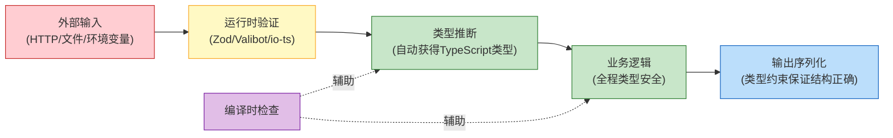

## 2. TypeScript类型安全技巧

TypeScript 的核心价值不仅在于开发体验的提升，更在于它能在编译阶段消除一整类运行时安全漏洞。本节从安全工程视角出发，系统讲解如何利用 TypeScript 的类型系统构建从边界到内核的纵深防御体系。

### 2.1 类型安全的哲学：编译期 vs 运行时

TypeScript 类型信息在编译后完全擦除（Type Erasure），这意味着**类型检查只存在于开发阶段**。安全关键的验证必须在运行时执行。正确的策略是"编译时 + 运行时"双保险：



**核心原则：永远不要信任 `any` 类型，永远不要假设外部数据的形状。**

| 策略 | 编译时 | 运行时 | 适用场景 |
|------|--------|--------|----------|
| 纯类型标注 | ✅ | ❌ | 内部函数调用、已验证的数据传递 |
| Zod/Valibot schema | ✅ | ✅ | API 边界、数据库查询结果、环境变量 |
| JSON Schema | ✅ | ✅ | OpenAPI 规范、配置文件验证 |
| 手动类型守卫 | ✅ | ✅ | 第三方库返回值、遗留代码桥接 |
| `as` 断言 | ✅ | ❌ | 危险！跳过运行时检查，仅用于你 100% 控制的场景 |

### 2.2 类型安全的 API 客户端

构建安全的 HTTP 客户端需要同时防御 SSRF、注入、类型混淆三类攻击。以下实现将域名白名单、请求体类型约束、响应体验证统一在一个泛型结构中。

#### 2.2.1 基础类型定义

```typescript
// === 请求层类型 ===
type HttpMethod = 'GET' | 'POST' | 'PUT' | 'DELETE' | 'PATCH';

interface RequestConfig<Body = never> {
    method: HttpMethod;
    url: string;
    body?: Body;
    headers?: Record<string, string>;
    timeout?: number;           // 超时控制，防止慢速攻击
    signal?: AbortSignal;       // 取消信号，支持请求中断
}

// === 响应层类型 ===
interface ApiResponse<T> {
    success: boolean;
    data: T;
    error?: string;
    requestId?: string;         // 请求追踪 ID，便于安全审计
}

// === 错误类型 ===
class ApiError extends Error {
    constructor(
        message: string,
        public readonly statusCode: number,
        public readonly requestId?: string,
    ) {
        super(message);
        this.name = 'ApiError';
    }
}
```

#### 2.2.2 SSRF 防御客户端

```typescript
import { z } from 'zod';

// 使用 Zod schema 作为"单一事实源"——编译时类型和运行时验证同时生效
const UserSchema = z.object({
    id: z.string().uuid(),
    name: z.string().min(1).max(100),
    email: z.string().email(),
    role: z.enum(['user', 'admin', 'moderator']),
    createdAt: z.string().datetime(),
});
type User = z.infer<typeof UserSchema>;

// 私有 IP 地址检测——防御 SSRF 攻击
const PRIVATE_IP_RANGES = [
    /^10\./,
    /^172\.(1[6-9]|2\d|3[01])\./,
    /^192\.168\./,
    /^127\./,
    /^0\./,
    /^169\.254\./,    // AWS 元数据服务
    /^\[::1\]/,       // IPv6 loopback
    /^\[fc00:/,       // IPv6 私有地址
    /^\[fe80:/,       // IPv6 链路本地
];

function isPrivateIP(hostname: string): boolean {
    return PRIVATE_IP_RANGES.some(range => range.test(hostname));
}

class SecureApiClient {
    private readonly allowedDomains: Set<string>;
    private readonly baseUrl: URL;

    constructor(baseUrl: string, allowedDomains: string[]) {
        this.baseUrl = new URL(baseUrl);
        this.allowedDomains = new Set(allowedDomains);

        // 启动时即校验基础域名——不要等到请求时才发现配置错误
        if (!this.allowedDomains.has(this.baseUrl.hostname)) {
            throw new Error(`Base domain ${this.baseUrl.hostname} not in allowlist`);
        }
    }

    async request<TBody, TResponse>(
        config: RequestConfig<TBody>,
        responseSchema: z.ZodType<TResponse>,
    ): Promise<ApiResponse<TResponse>> {
        // 1. 构造完整 URL
        const url = new URL(config.url, this.baseUrl);

        // 2. 域名白名单校验
        if (!this.allowedDomains.has(url.hostname)) {
            throw new ApiError(
                `Domain ${url.hostname} is not in the allowlist`,
                403,
            );
        }

        // 3. 协议校验——只允许 HTTPS
        if (url.protocol !== 'https:') {
            throw new ApiError(`Insecure protocol ${url.protocol} rejected`, 403);
        }

        // 4. 超时控制
        const controller = new AbortController();
        const timeoutId = config.timeout
            ? setTimeout(() => controller.abort(), config.timeout)
            : undefined;

        try {
            const response = await fetch(url.toString(), {
                method: config.method,
                headers: {
                    'Content-Type': 'application/json',
                    'Accept': 'application/json',
                    ...config.headers,
                },
                body: config.body !== undefined
                    ? JSON.stringify(config.body)
                    : undefined,
                signal: config.signal ?? controller.signal,
            });

            if (!response.ok) {
                throw new ApiError(
                    `HTTP ${response.status}: ${response.statusText}`,
                    response.status,
                    response.headers.get('x-request-id') ?? undefined,
                );
            }

            // 5. 响应体运行时验证——不信任服务端返回的数据形状
            const raw = await response.json();
            const data = responseSchema.parse(raw);
            return { success: true, data };
        } catch (error) {
            if (error instanceof z.ZodError) {
                throw new ApiError(
                    `Response validation failed: ${error.message}`,
                    502,
                );
            }
            throw error;
        } finally {
            if (timeoutId) clearTimeout(timeoutId);
        }
    }
}

// 使用示例——类型在声明时即已确定
const client = new SecureApiClient(
    'https://api.example.com',
    ['api.example.com', 'auth.example.com'],
);

// 编译时: TBody=never（GET 无 body），TResponse=User[]
// 运行时: Zod 验证每个 User 对象的字段
const result = await client.request<never, User[]>(
    { method: 'GET', url: '/v1/users', timeout: 5000 },
    z.array(UserSchema),
);
// result.data 的类型是 User[]，编译器会检查后续所有字段访问
```

#### 2.2.3 请求参数类型约束矩阵

```typescript
// 利用条件类型让不同 HTTP 方法拥有不同的 body 约束
type RequestWithBody = Extract<HttpMethod, 'POST' | 'PUT' | 'PATCH'>;
type RequestWithoutBody = Extract<HttpMethod, 'GET' | 'DELETE'>;

interface TypedRequest<M extends HttpMethod, Body = never> {
    method: M;
    url: string;
    headers?: Record<string, string>;
    // 有 body 的方法必须提供 body 参数
    body: M extends RequestWithBody ? Body : never;
}

// 编译时强制 POST/PUT/PATCH 必须有 body
function send<M extends HttpMethod, B>(
    req: TypedRequest<M, B>,
): Promise<Response> {
    const init: RequestInit = {
        method: req.method,
        headers: req.headers,
    };
    if (req.body !== undefined) {
        init.body = JSON.stringify(req.body);
    }
    return fetch(req.url, init);
}

// ✅ 合法——POST 带 body
send({
    method: 'POST',
    url: '/users',
    body: { name: 'Alice' },
});

// ❌ 编译错误——POST 缺少 body
send({ method: 'POST', url: '/users' });

// ✅ 合法——GET 无 body
send({ method: 'GET', url: '/users', body: undefined as never });
```

### 2.3 类型安全的输入验证

输入验证是 Web 应用安全的第一道防线。TypeScript 生态中，Zod 是目前最成熟的运行时验证库，它能将 schema 定义、运行时验证、TypeScript 类型推断三者合一。

#### 2.3.1 Zod 核心模式

```typescript
import { z } from 'zod';

// === 基础 Schema 定义 ===
const UserCreateSchema = z.object({
    username: z.string()
        .min(3, '用户名至少3个字符')
        .max(20, '用户名最多20个字符')
        .regex(/^[a-zA-Z0-9_]+$/, '用户名只能包含字母、数字和下划线')
        .transform(s => s.toLowerCase()),  // 输入规范化

    email: z.string()
        .email('无效的邮箱地址')
        .transform(s => s.toLowerCase()),

    age: z.number()
        .int('年龄必须是整数')
        .min(0, '年龄不能为负')
        .max(150, '年龄不能超过150')
        .optional(),

    role: z.enum(['user', 'admin', 'moderator']).default('user'),

    // 密码强度验证
    password: z.string()
        .min(8, '密码至少8个字符')
        .max(128, '密码最长128个字符')
        .regex(/[a-z]/, '密码必须包含小写字母')
        .regex(/[A-Z]/, '密码必须包含大写字母')
        .regex(/[0-9]/, '密码必须包含数字')
        .regex(/[^a-zA-Z0-9]/, '密码必须包含特殊字符'),

    // 确认密码——使用 refinement 做跨字段校验
    confirmPassword: z.string(),
}).refine(data => data.password === data.confirmPassword, {
    message: '两次输入的密码不一致',
    path: ['confirmPassword'],  // 错误归属到 confirmPassword 字段
});

// 从 schema 自动推断类型——单一事实源
type UserCreate = z.infer<typeof UserCreateSchema>;
// 等价于:
// {
//   username: string;
//   email: string;
//   age?: number | undefined;
//   role: 'user' | 'admin' | 'moderator';
//   password: string;
//   confirmPassword: string;
// }

// 使用 .output 做 transform 后的类型推断
type UserCreateOutput = z.output<typeof UserCreateSchema>;
// username 和 email 经过 toLowerCase() 后仍为 string，结构相同
```

#### 2.3.2 Express/Fastify 中间件集成

```typescript
import express, { Request, Response, NextFunction } from 'express';
import { z, ZodSchema } from 'zod';

// === 通用验证中间件工厂 ===
// 将 Zod schema 包装为 Express 中间件，支持 body/query/params 分别验证
function validate<T extends ZodSchema>(
    schema: T,
    source: 'body' | 'query' | 'params' = 'body',
) {
    return (req: Request, res: Response, next: NextFunction) => {
        const result = schema.safeParse(req[source]);
        if (!result.success) {
            // 返回结构化的验证错误，但不暴露内部实现细节
            res.status(400).json({
                success: false,
                error: 'Validation failed',
                details: result.error.issues.map(issue => ({
                    field: issue.path.join('.'),
                    message: issue.message,
                    code: issue.code,
                })),
            });
            return;
        }
        // 将验证后的数据挂载到请求对象上
        (req as any)[`validated_${source}`] = result.data;
        next();
    };
}

// === 使用示例 ===
const app = express();
app.use(express.json());

// 查询参数验证
const PaginationSchema = z.object({
    page: z.coerce.number().int().min(1).default(1),
    limit: z.coerce.number().int().min(1).max(100).default(20),
    sort: z.enum(['created_at', 'updated_at', 'name']).default('created_at'),
    order: z.enum(['asc', 'desc']).default('desc'),
});

app.get('/users', validate(PaginationSchema, 'query'), (req, res) => {
    const query = (req as any).validated_query as z.infer<typeof PaginationSchema>;
    // query.page 是 number，query.limit 是 number，全部经过验证
    // 即使 URL 是 /users?page=abc，也会在中间件层被拦截
    res.json({ page: query.page, limit: query.limit });
});

// URL 路径参数验证——防御路径注入
const UserIdSchema = z.object({
    id: z.string().uuid('无效的用户ID格式'),
});

app.get('/users/:id', validate(UserIdSchema, 'params'), (req, res) => {
    const { id } = (req as any).validated_params;
    // id 已经被验证为合法 UUID，可以安全地用于数据库查询
});
```

#### 2.3.3 Valibot——轻量替代方案

```typescript
// Valibot 是 Zod 的轻量替代（~2KB vs ~50KB），API 类似
import * as v from 'valibot';

const UserSchema = v.object({
    username: v.pipe(
        v.string(),
        v.minLength(3),
        v.maxLength(20),
        v.regex(/^[a-zA-Z0-9_]+$/),
    ),
    email: v.pipe(v.string(), v.email()),
    age: v.optional(v.pipe(v.number(), v.integer(), v.minValue(0), v.maxValue(150))),
    role: v.picklist(['user', 'admin', 'moderator']),
});

type User = v.InferOutput<typeof UserSchema>;

// 验证
const result = v.safeParse(UserSchema, inputData);
if (result.success) {
    // result.output 的类型是 User
} else {
    // result.issues 包含详细的错误信息
}
```

### 2.4 高级类型模式——编译期安全增强

TypeScript 的高级类型特性（条件类型、映射类型、模板字面量类型）可以将安全约束编码进类型系统，使得不安全的操作在编译时就被拒绝。

#### 2.4.1 Branded Types——防止类型混淆

类型混淆（Type Confusion）是安全漏洞的常见来源。当两个值底层都是 `string` 但语义不同时（如用户 ID 和订单 ID），TypeScript 的结构化类型系统无法区分它们。Branded Types 通过附加唯一的品牌标记来解决这个问题。

```typescript
// === Branded Type 基础设施 ===
declare const __brand: unique symbol;
type Brand<B> = { readonly [__brand]: B };
type Branded<T, B> = T & Brand<B>;

// === 定义语义化类型 ===
type UserId = Branded<string, 'UserId'>;
type OrderId = Branded<string, 'OrderId'>;
type Email = Branded<string, 'Email'>;
type SanitizedHTML = Branded<string, 'SanitizedHTML'>;
type RawUserInput = Branded<string, 'RawUserInput'>;

// 构造函数——带验证的类型转换
function UserId(id: string): UserId {
    if (!/^[a-f0-9]{24}$/.test(id)) {
        throw new Error(`Invalid UserId format: ${id}`);
    }
    return id as UserId;
}

function Email(value: string): Email {
    if (!/^[^\s@]+@[^\s@]+\.[^\s@]+$/.test(value)) {
        throw new Error(`Invalid email format: ${value}`);
    }
    return value.toLowerCase() as Email;
}

function SanitizedHTML(html: string): SanitizedHTML {
    // 实际项目中应使用 DOMPurify 等库
    return html
        .replace(/</g, '&lt;')
        .replace(/>/g, '&gt;')
        .replace(/"/g, '&quot;') as SanitizedHTML;
}

// === 使用——编译时防止类型混淆 ===
function getUserById(id: UserId): Promise<User> { /* ... */ }
function getOrderById(id: OrderId): Promise<Order> { /* ... */ }

const userId = UserId('507f1f77bcf86cd799439011');
const orderId = OrderId('ORD-2024-001');

await getUserById(userId);   // ✅ 正确
await getOrderById(orderId); // ✅ 正确

await getUserById(orderId);  // ❌ 编译错误: OrderId 不能赋值给 UserId
await getOrderById(userId);  // ❌ 编译错误: UserId 不能赋值给 OrderId
await getUserById('raw');    // ❌ 编译错误: string 不能赋值给 UserId

// === 安全渲染模式——强制开发者先消毒再渲染 ===
function renderUserComment(html: SanitizedHTML): string {
    return `<div class="comment">${html}</div>`;
}

const userInput: RawUserInput = '<script>alert("XSS")</script>' as RawUserInput;

// renderUserComment(userInput);  // ❌ 编译错误: RawUserInput 不是 SanitizedHTML
renderUserComment(SanitizedHTML(userInput));  // ✅ 必须先消毒
```

#### 2.4.2 Phantom Types——状态机约束

用类型参数编码对象的生命周期状态，使得不合法的状态转换在编译时就被拒绝。这在权限系统、事务流程、加密操作中尤其有用。

```typescript
// === 权限状态机 ===
type Unverified = { readonly _state: 'unverified' };
type Verified = { readonly _state: 'verified' };
type Authenticated = { readonly _state: 'authenticated' };
type Admin = { readonly _state: 'admin' };

interface UserSession<State> {
    readonly userId: string;
    readonly token: string;
    readonly _phantom?: State;  // phantom 字段，运行时为 undefined
}

// 状态转换函数——每个函数只接受合法的前置状态
function verifyEmail(session: UserSession<Unverified>): UserSession<Verified> {
    // 发送验证邮件，返回已验证状态
    return { ...session, _phantom: undefined } as UserSession<Verified>;
}

function authenticate(session: UserSession<Verified>): UserSession<Authenticated> {
    // 密码验证，返回已认证状态
    return { ...session, _phantom: undefined } as UserSession<Authenticated>;
}

function elevateToAdmin(session: UserSession<Authenticated>): UserSession<Admin> {
    // 提权操作，需要额外的安全检查
    return { ...session, _phantom: undefined } as UserSession<Admin>;
}

// 需要认证的操作——类型签名即文档
function getProfile(session: UserSession<Authenticated>): Promise<UserProfile> { /* ... */ }
function deleteUser(session: UserSession<Admin>): Promise<void> { /* ... */ }
function viewPublicProfile(session: UserSession<Unverified>): Promise<PublicProfile> { /* ... */ }

// 使用示例
declare const unverifiedSession: UserSession<Unverified>;

// getProfile(unverifiedSession);       // ❌ 编译错误: 未验证用户不能访问个人资料
viewPublicProfile(unverifiedSession);    // ✅ 公开资料不需要认证

const verified = verifyEmail(unverifiedSession);
const authed = authenticate(verified);
const admin = elevateToAdmin(authed);

getProfile(authed);    // ✅ 已认证
deleteUser(admin);     // ✅ 管理员可以删除用户
// deleteUser(authed); // ❌ 编译错误: 已认证不等于管理员
```

#### 2.4.3 条件类型与类型收窄

```typescript
// === API 响应的条件类型 ===
// 根据端点名自动推断响应类型
type ApiEndpoints = {
    '/users': {
        GET: { data: User[]; pagination: PaginationInfo };
        POST: { data: User };
    };
    '/users/:id': {
        GET: { data: User };
        PUT: { data: User };
        DELETE: { data: null };
    };
    '/posts': {
        GET: { data: Post[]; pagination: PaginationInfo };
        POST: { data: Post };
    };
};

// 类型安全的 API 调用——编译时即确定返回类型
type ApiResponseFor<
    Path extends keyof ApiEndpoints,
    Method extends keyof ApiEndpoints[Path],
> = ApiEndpoints[Path][Method];

// 使用
type UsersGetResponse = ApiResponseFor<'/users', 'GET'>;
// { data: User[]; pagination: PaginationInfo }

type UserDeleteResponse = ApiResponseFor<'/users/:id', 'DELETE'>;
// { data: null }

// === 模板字面量类型——安全的 SQL 列名约束 ===
type ColumnName<T extends string> = `${T}.${string}` | `${T}.*`;

function selectColumns<T extends string>(
    table: T,
    ...columns: ColumnName<T>[]
): string {
    return `SELECT ${columns.join(', ')} FROM ${table}`;
}

// ✅ 合法
selectColumns('users', 'users.name', 'users.email');
// ❌ 编译错误: 'posts.title' 不匹配 'users.*' | 'users.${string}'
// selectColumns('users', 'posts.title');
```

### 2.5 类型安全的数据库操作

数据库层是安全的关键节点——SQL 注入、类型不匹配、缺失字段都会导致严重问题。现代 TypeScript ORM 利用类型系统在编译时消除这些风险。

#### 2.5.1 Prisma——Schema 即类型

```prisma
// prisma/schema.prisma
model User {
    id        String   @id @default(uuid())
    email     String   @unique
    name      String
    role      Role     @default(USER)
    posts     Post[]
    createdAt DateTime @default(now())
    updatedAt DateTime @updatedAt

    @@map("users")
}

enum Role {
    USER
    ADMIN
    MODERATOR
}

model Post {
    id        String   @id @default(uuid())
    title     String
    content   String
    published Boolean  @default(false)
    author    User     @relation(fields: [authorId], references: [id])
    authorId  String

    @@map("posts")
}
```

```typescript
import { PrismaClient, Prisma } from '@prisma/client';

const prisma = new PrismaClient();

// 类型安全的查询——编译器检查字段名、关联、过滤条件
const users = await prisma.user.findMany({
    where: {
        role: 'ADMIN',  // ✅ 只能是 'USER' | 'ADMIN' | 'MODERATOR'
        // role: 'SUPERADMIN',  // ❌ 编译错误
    },
    include: {
        posts: {
            where: { published: true },
            orderBy: { createdAt: 'desc' },
            take: 10,
        },
    },
});

// 返回类型自动推断
// users: (User & { posts: Post[] })[]

// 类型安全的事务
const result = await prisma.$transaction(async (tx) => {
    const user = await tx.user.create({
        data: {
            email: 'alice@example.com',
            name: 'Alice',
            // role 字段有默认值，不需要手动指定
        },
    });

    const post = await tx.post.create({
        data: {
            title: 'Hello World',
            content: 'My first post',
            authorId: user.id,  // 编译器知道 user.id 是 string 类型
        },
    });

    return { user, post };
});

// 防止 SQL 注入——使用 Prisma 的查询构建器
// 错误示例: 直接拼接用户输入
// await prisma.$queryRaw(`SELECT * FROM users WHERE name = '${userInput}'`);

// 正确示例: 使用参数化查询
const unsafeName = "'; DROP TABLE users; --";
const safeUsers = await prisma.$queryRaw`
    SELECT * FROM users WHERE name = ${unsafeName}
`;
// Prisma 自动转义参数，SQL 注入无效
```

#### 2.5.2 Drizzle ORM——类型安全的 SQL 构建器

```typescript
import { pgTable, text, uuid, boolean, timestamp, pgEnum } from 'drizzle-orm/pg-core';
import { drizzle } from 'drizzle-orm/node-postgres';
import { eq, and, sql } from 'drizzle-orm';

// Schema 定义——与 TypeScript 类型一一对应
const roleEnum = pgEnum('role', ['user', 'admin', 'moderator']);

const users = pgTable('users', {
    id: uuid('id').primaryKey().defaultRandom(),
    email: text('email').notNull().unique(),
    name: text('name').notNull(),
    role: roleEnum('role').notNull().default('user'),
    createdAt: timestamp('created_at').notNull().defaultNow(),
});

const posts = pgTable('posts', {
    id: uuid('id').primaryKey().defaultRandom(),
    title: text('title').notNull(),
    content: text('content').notNull(),
    published: boolean('published').notNull().default(false),
    authorId: uuid('author_id').notNull().references(() => users.id),
});

// 初始化
const db = drizzle(pool);

// 类型安全的查询——Drizzle 的 where 条件类型严格绑定到表的列类型
const admins = await db
    .select()
    .from(users)
    .where(eq(users.role, 'admin'));  // ✅ role 列只接受枚举值

// 编译错误示例
// .where(eq(users.role, 'superadmin'))  // ❌ 不在枚举范围内
// .where(eq(users.nonExistent, 'value'))  // ❌ 列不存在

// 类型安全的 JOIN
const postsWithAuthors = await db
    .select({
        postId: posts.id,
        postTitle: posts.title,
        authorName: users.name,
        authorEmail: users.email,
    })
    .from(posts)
    .innerJoin(users, eq(posts.authorId, users.id))
    .where(eq(posts.published, true));

// 返回类型自动推断为 { postId: string; postTitle: string; authorName: string; authorEmail: string }[]
```

### 2.6 类型安全的环境变量与配置

环境变量是应用配置的主要来源，但 `process.env` 返回的全是 `string | undefined`，极易导致运行时崩溃。将环境变量纳入类型系统是生产级应用的基本要求。

#### 2.6.1 Zod 环境变量验证

```typescript
import { z } from 'zod';

// === 定义环境变量 Schema ===
const EnvSchema = z.object({
    NODE_ENV: z.enum(['development', 'production', 'test']).default('development'),
    PORT: z.coerce.number().int().min(1).max(65535).default(3000),

    // 数据库连接——强制格式
    DATABASE_URL: z.string().url().refine(
        url => url.startsWith('postgresql://') || url.startsWith('postgres://'),
        'DATABASE_URL must be a PostgreSQL connection string',
    ),

    // JWT 密钥——强制最小长度
    JWT_SECRET: z.string().min(32, 'JWT_SECRET must be at least 32 characters'),
    JWT_EXPIRES_IN: z.string().default('1h'),

    // Redis（可选）
    REDIS_URL: z.string().url().optional(),

    // CORS 白名单——逗号分隔的域名列表
    CORS_ORIGINS: z.string()
        .transform(s => s.split(',').map(s => s.trim()))
        .pipe(z.array(z.string().url())),

    // 日志级别
    LOG_LEVEL: z.enum(['debug', 'info', 'warn', 'error']).default('info'),

    // 加密密钥——AES-256 需要 32 字节
    ENCRYPTION_KEY: z.string()
        .length(64, 'ENCRYPTION_KEY must be 64 hex characters (32 bytes)')
        .regex(/^[0-9a-f]+$/, 'ENCRYPTION_KEY must be hex encoded'),
});

// === 启动时立即验证 ===
function loadEnv(): z.infer<typeof EnvSchema> {
    const result = EnvSchema.safeParse(process.env);

    if (!result.success) {
        console.error('❌ Invalid environment variables:');
        console.error(result.error.format());
        process.exit(1);  // 启动失败比运行时崩溃好
    }

    return result.data;
}

// 全局单例——整个应用只需加载一次
const env = loadEnv();

export { env, EnvSchema };
```

#### 2.6.2 类型安全的配置管理器

```typescript
import { z } from 'zod';
import { readFileSync } from 'fs';

// 多层配置 schema：文件配置 + 环境变量 + 默认值
const ConfigSchema = z.object({
    server: z.object({
        host: z.string().default('0.0.0.0'),
        port: z.number().int().min(1).max(65535),
        cors: z.object({
            origins: z.array(z.string()),
            credentials: z.boolean().default(true),
        }),
    }),
    database: z.object({
        host: z.string(),
        port: z.number().int().default(5432),
        name: z.string(),
        user: z.string(),
        password: z.string(),
        ssl: z.boolean().default(true),
        poolSize: z.number().int().min(1).max(100).default(10),
    }),
    auth: z.object({
        jwtSecret: z.string().min(32),
        bcryptRounds: z.number().int().min(10).max(14).default(12),
        sessionTimeout: z.number().int().min(300).max(86400).default(3600),
    }),
    rateLimit: z.object({
        windowMs: z.number().int().default(60000),
        maxRequests: z.number().int().default(100),
    }),
});

type Config = z.infer<typeof ConfigSchema>;

class ConfigManager {
    private config: Config;

    constructor(configPath?: string) {
        // 优先级：环境变量 > 配置文件 > 默认值
        let fileConfig: Record<string, unknown> = {};
        if (configPath) {
            try {
                fileConfig = JSON.parse(readFileSync(configPath, 'utf-8'));
            } catch {
                // 配置文件不存在或格式错误，使用默认值
            }
        }

        // 合并配置
        const merged = this.deepMerge(fileConfig, this.envOverrides());

        // 验证
        const result = ConfigSchema.safeParse(merged);
        if (!result.success) {
            throw new Error(`Invalid configuration:\n${result.error.format()}`);
        }

        this.config = result.data;
    }

    // 获取配置——类型由路径自动推断
    get<K extends keyof Config>(key: K): Config[K] {
        return this.config[key];
    }

    private envOverrides(): Record<string, unknown> {
        return {
            server: {
                port: process.env.PORT ? Number(process.env.PORT) : undefined,
            },
            database: {
                host: process.env.DB_HOST,
                password: process.env.DB_PASSWORD,
            },
            auth: {
                jwtSecret: process.env.JWT_SECRET,
            },
        };
    }

    private deepMerge(target: any, source: any): any {
        const result = { ...target };
        for (const key of Object.keys(source)) {
            if (source[key] && typeof source[key] === 'object' && !Array.isArray(source[key])) {
                result[key] = this.deepMerge(result[key] ?? {}, source[key]);
            } else if (source[key] !== undefined) {
                result[key] = source[key];
            }
        }
        return result;
    }
}
```

### 2.7 类型安全的错误处理

异常是隐式的控制流，TypeScript 不强制函数声明它可能抛出的异常类型。Result 模式（又称 Either 模式）将错误处理显式化，消除未捕获异常的风险。

#### 2.7.1 Result 类型

```typescript
// === Result 类型定义 ===
type Result<T, E = Error> =
    | { ok: true; value: T }
    | { ok: false; error: E };

// 构造函数
function Ok<T>(value: T): Result<T, never> {
    return { ok: true, value };
}

function Err<E>(error: E): Result<never, E> {
    return { ok: false, error };
}

// === 安全的 Result 操作 ===

// map: 变换成功值，失败时透传
function map<T, U, E>(result: Result<T, E>, fn: (value: T) => U): Result<U, E> {
    return result.ok ? Ok(fn(result.value)) : result;
}

// flatMap: 链式操作，每步都可能失败
function flatMap<T, U, E>(
    result: Result<T, E>,
    fn: (value: T) => Result<U, E>,
): Result<U, E> {
    return result.ok ? fn(result.value) : result;
}

// unwrapOr: 提供默认值
function unwrapOr<T, E>(result: Result<T, E>, defaultValue: T): T {
    return result.ok ? result.value : defaultValue;
}

// match: 模式匹配
function match<T, U, E>(
    result: Result<T, E>,
    handlers: { ok: (value: T) => U; err: (error: E) => U },
): U {
    return result.ok ? handlers.ok(result.value) : handlers.err(result.error);
}

// === 使用示例 ===
class ValidationError {
    constructor(
        public readonly field: string,
        public readonly message: string,
    ) {}
}

function parseAge(input: unknown): Result<number, ValidationError> {
    if (typeof input !== 'number' || isNaN(input)) {
        return new ValidationError('age', '年龄必须是数字');
    }
    if (!Number.isInteger(input)) {
        return new ValidationError('age', '年龄必须是整数');
    }
    if (input < 0 || input > 150) {
        return new ValidationError('age', '年龄必须在 0-150 之间');
    }
    return Ok(input);
}

function parseEmail(input: unknown): Result<string, ValidationError> {
    if (typeof input !== 'string') {
        return new ValidationError('email', '邮箱必须是字符串');
    }
    if (!/^[^\s@]+@[^\s@]+\.[^\s@]+$/.test(input)) {
        return new ValidationError('email', '邮箱格式无效');
    }
    return Ok(input.toLowerCase());
}

// 链式组合——每一步都可能失败，失败时自动短路
function createUser(input: unknown): Result<User, ValidationError> {
    const ageResult = parseAge((input as any).age);
    const emailResult = parseEmail((input as any).email);

    // 使用 flatMap 组合
    return flatMap(ageResult, (age) =>
        map(emailResult, (email) => ({
            age,
            email,
            name: (input as any).name,
        })),
    );
}

// 使用 match 处理结果
const result = createUser({ age: 25, email: 'alice@example.com', name: 'Alice' });
match(result, {
    ok: (user) => console.log(`Created user: ${user.name}`),
    err: (err) => console.error(`Validation error on ${err.field}: ${err.message}`),
});
```

#### 2.7.2 neverthrow——生产级 Result 库

```typescript
import { Result, ok, err, ResultAsync } from 'neverthrow';

// === 基础用法 ===
function divide(a: number, b: number): Result<number, string> {
    if (b === 0) return err('Division by zero');
    return ok(a / b);
}

// 链式操作——比手写 match 更优雅
const result = divide(10, 2)
    .map(n => n * 2)        // 20
    .map(n => n + 1);       // 21

// === 异步操作 ===
function fetchUser(id: string): ResultAsync<User, ApiError> {
    return ResultAsync.fromPromise(
        fetch(`/api/users/${id}`).then(r => r.json()),
        (error) => new ApiError(`Failed to fetch user: ${error}`),
    ).andThen((data) => {
        const parsed = UserSchema.safeParse(data);
        if (!parsed.success) {
            return err(new ApiError('Invalid user data'));
        }
        return ok(parsed.data);
    });
}

// === 并行组合 ===
import { combine } from 'neverthrow';

// 同时验证多个字段——全部成功才返回 ok
function validateForm(input: unknown): Result<FormData, ValidationError[]> {
    const nameResult = parseName((input as any).name);
    const emailResult = parseEmail((input as any).email);
    const ageResult = parseAge((input as any).age);

    return combine([nameResult, emailResult, ageResult]).map(
        ([name, email, age]) => ({ name, email, age })
    );
    // 如果任何一个验证失败，返回所有错误的数组
}
```

### 2.8 类型安全的事件系统与消息传递

事件驱动架构中，事件名称和负载的类型必须严格匹配，否则订阅者可能收到它无法处理的数据格式。

```typescript
// === 类型安全的事件总线 ===
interface EventMap {
    'user:created': { userId: string; email: string; role: string };
    'user:updated': { userId: string; changes: Partial<User> };
    'user:deleted': { userId: string; deletedBy: string };
    'order:placed': { orderId: string; userId: string; amount: number };
    'order:shipped': { orderId: string; trackingNumber: string };
    'security:login_failed': { email: string; ip: string; reason: string };
    'security:rate_limited': { ip: string; endpoint: string; count: number };
}

class TypedEventBus {
    private listeners = new Map<string, Set<Function>>();

    // 订阅——事件名和回调的负载类型自动关联
    on<K extends keyof EventMap>(
        event: K,
        handler: (payload: EventMap[K]) => void | Promise<void>,
    ): () => void {
        if (!this.listeners.has(event)) {
            this.listeners.set(event, new Set());
        }
        this.listeners.get(event)!.add(handler);

        // 返回取消订阅函数
        return () => this.listeners.get(event)?.delete(handler);
    }

    // 发布——只能发送已定义事件的合法负载
    async emit<K extends keyof EventMap>(event: K, payload: EventMap[K]): Promise<void> {
        const handlers = this.listeners.get(event);
        if (!handlers) return;

        await Promise.allSettled(
            [...handlers].map(handler => handler(payload))
        );
    }
}

// 使用
const bus = new TypedEventBus();

// ✅ 类型安全——payload 类型自动推断
bus.on('user:created', (payload) => {
    console.log(payload.userId);   // ✅ string
    console.log(payload.email);    // ✅ string
    // console.log(payload.trackingNumber);  // ❌ 编译错误: 属性不存在
});

// ❌ 编译错误: 事件名不在 EventMap 中
// bus.emit('unknown:event', {});

// ✅ 类型安全的发布
await bus.emit('user:created', {
    userId: '123',
    email: 'alice@example.com',
    role: 'admin',
});

// ❌ 编译错误: 缺少必需字段
// await bus.emit('user:created', { userId: '123' });
```

### 2.9 类型安全的加密操作

加密操作中，类型混淆（如把明文当密文使用、把公钥当私钥使用）会导致灾难性后果。用 Branded Types 强制区分不同语义的字节序列。

```typescript
import { createCipheriv, createDecipheriv, randomBytes, scryptSync } from 'crypto';

// === 加密类型系统 ===
type Plaintext = Branded<string, 'Plaintext'>;
type Ciphertext = Branded<string, 'Ciphertext'>;
type EncryptionKey = Branded<Buffer, 'EncryptionKey'>;
type IV = Branded<Buffer, 'IV'>;

function Plaintext(value: string): Plaintext {
    return value as Plaintext;
}

function Ciphertext(base64: string): Ciphertext {
    // 验证 base64 格式
    if (!/^[A-Za-z0-9+/=]+$/.test(base64)) {
        throw new Error('Invalid ciphertext format');
    }
    return base64 as Ciphertext;
}

function deriveKey(password: string, salt: Buffer): EncryptionKey {
    return scryptSync(password, salt, 32) as EncryptionKey;
}

function generateIV(): IV {
    return randomBytes(16) as IV;
}

// === 类型安全的加解密函数 ===
// 参数类型明确区分明文和密文——不能混用
function encrypt(plaintext: Plaintext, key: EncryptionKey): Ciphertext {
    const iv = generateIV();
    const cipher = createCipheriv('aes-256-gcm', key as unknown as Buffer, iv as unknown as Buffer);

    let encrypted = cipher.update(plaintext as unknown as string, 'utf8', 'base64');
    encrypted += cipher.final('base64');

    const authTag = cipher.getAuthTag();

    // IV + AuthTag + 密文 存储在一起
    const combined = Buffer.concat([
        iv as unknown as Buffer,
        authTag,
        Buffer.from(encrypted, 'base64'),
    ]);

    return Ciphertext(combined.toString('base64'));
}

function decrypt(ciphertext: Ciphertext, key: EncryptionKey): Plaintext {
    const combined = Buffer.from(ciphertext as unknown as string, 'base64');

    const iv = combined.subarray(0, 16);
    const authTag = combined.subarray(16, 32);
    const encrypted = combined.subarray(32);

    const decipher = createDecipheriv(
        'aes-256-gcm',
        key as unknown as Buffer,
        iv,
    );
    decipher.setAuthTag(authTag);

    let decrypted = decipher.update(encrypted, undefined, 'utf8');
    decrypted += decipher.final('utf8');

    return Plaintext(decrypted);
}

// === 使用——编译时防止类型混淆 ===
const key = deriveKey('my-password', randomBytes(16));
const secret = Plaintext('This is a secret message');

const encrypted = encrypt(secret, key);
// encrypt(encrypted, key);  // ❌ 编译错误: Ciphertext 不是 Plaintext

const decrypted = decrypt(encrypted, key);
// decrypt(secret, key);      // ❌ 编译错误: Plaintext 不是 Ciphertext
```

### 2.10 类型守卫与类型收窄

类型守卫（Type Guard）是连接运行时检查和编译时类型的桥梁。编写正确的类型守卫是 TypeScript 安全编程的基本功。

#### 2.10.1 自定义类型守卫

```typescript
// === 基础类型守卫 ===
function isString(value: unknown): value is string {
    return typeof value === 'string';
}

function isNonEmptyString(value: unknown): value is string {
    return isString(value) && value.length > 0;
}

function isNumber(value: unknown): value is number {
    return typeof value === 'number' && !isNaN(value);
}

// === 对象类型守卫 ===
function isUser(value: unknown): value is User {
    return (
        typeof value === 'object' &&
        value !== null &&
        'id' in value && typeof (value as any).id === 'string' &&
        'email' in value && typeof (value as any).email === 'string' &&
        'name' in value && typeof (value as any).name === 'string'
    );
}

// === 联合类型收窄 ===
type ApiResult =
    | { status: 'success'; data: unknown }
    | { status: 'error'; error: string; code: number }
    | { status: 'loading' };

function handleResult(result: ApiResult) {
    switch (result.status) {
        case 'success':
            // result 自动收窄为 { status: 'success'; data: unknown }
            console.log(result.data);
            break;
        case 'error':
            // result 自动收窄为 { status: 'error'; error: string; code: number }
            console.error(`Error ${result.code}: ${result.error}`);
            break;
        case 'loading':
            // result 自动收窄为 { status: 'loading' }
            console.log('Loading...');
            break;
    }
}
```

#### 2.10.2 Assertion Functions

```typescript
// 断言函数——如果不满足条件直接抛出异常
// 比类型守卫更激进，适用于"不可能失败"的场景
function assertDefined<T>(value: T | null | undefined, name: string): asserts value is T {
    if (value === null || value === undefined) {
        throw new Error(`Expected ${name} to be defined, got ${value}`);
    }
}

function assertIsAdmin(user: User): asserts user is User & { role: 'admin' } {
    if (user.role !== 'admin') {
        throw new Error(`User ${user.id} is not an admin`);
    }
}

// 使用——断言后变量类型自动收窄
function adminAction(user: User | undefined) {
    assertDefined(user, 'user');
    // user: User（不再是 undefined）

    assertIsAdmin(user);
    // user: User & { role: 'admin' }

    // 现在可以安全地调用需要管理员权限的函数
    deleteUser(user.id);
}
```

### 2.11 类型安全的第三方库桥接

第三方库的类型定义可能不完善或缺失，直接使用 `any` 会丧失类型保护。以下模式可以在保持安全性的同时桥接类型不完善的库。

```typescript
// === 模式1: 类型安全的包装器 ===
// 假设某个库返回 any
import unsafeLib from 'some-untyped-lib';

interface SafeConfig {
    host: string;
    port: number;
    timeout: number;
}

const ConfigSchema = z.object({
    host: z.string().min(1),
    port: z.number().int().min(1).max(65535),
    timeout: z.number().int().min(0),
});

function loadConfig(path: string): SafeConfig {
    const raw = unsafeLib.load(path);  // any
    return ConfigSchema.parse(raw);     // 运行时验证后获得类型安全的值
}

// === 模式2: 渐进式类型增强 ===
// 为没有类型的模块创建声明文件
// types/some-module.d.ts
declare module 'some-untyped-lib' {
    interface Options {
        timeout?: number;
        retries?: number;
        verbose?: boolean;
    }

    export function connect(url: string, options?: Options): Promise<Connection>;
    export function disconnect(): Promise<void>;

    interface Connection {
        query<T = unknown>(sql: string, params?: unknown[]): Promise<T[]>;
        close(): Promise<void>;
    }
}

// === 模式3: unknown 优先原则 ===
// 接收外部数据时，永远先用 unknown，再收窄
function processExternalData(raw: unknown) {
    // ❌ 危险
    // const data = raw as SomeType;

    // ✅ 安全——先验证再使用
    const result = SomeSchema.safeParse(raw);
    if (!result.success) {
        throw new ValidationError(result.error);
    }
    return result.data;  // 类型安全
}
```

### 2.12 实战：类型安全的中间件链

将以上所有技巧整合为一个完整的、类型安全的 HTTP 中间件系统。

```typescript
import { z } from 'zod';

// === 上下文类型——每层中间件添加自己的数据 ===
interface BaseContext {
    requestId: string;
    timestamp: number;
}

interface AuthenticatedContext extends BaseContext {
    userId: string;
    role: 'user' | 'admin';
}

interface RateLimitedContext extends AuthenticatedContext {
    remainingRequests: number;
}

// === 中间件类型 ===
type Middleware<TIn, TOut> = (ctx: TIn) => Promise<TOut>;

// === 类型安全的中间件组合 ===
// compose 保证中间件链的类型正确衔接
function compose<A, B>(
    first: Middleware<A, B>,
): Middleware<A, B>;
function compose<A, B, C>(
    first: Middleware<A, B>,
    second: Middleware<B, C>,
): Middleware<A, C>;
function compose<A, B, C, D>(
    first: Middleware<A, B>,
    second: Middleware<B, C>,
    third: Middleware<C, D>,
): Middleware<A, D>;
function compose(...middlewares: Middleware<any, any>[]): Middleware<any, any> {
    return async (ctx) => {
        let result = ctx;
        for (const mw of middlewares) {
            result = await mw(result);
        }
        return result;
    };
}

// === 实现中间件 ===
const requestIdMiddleware: Middleware<BaseContext, BaseContext> = async (ctx) => ({
    ...ctx,
    requestId: crypto.randomUUID(),
    timestamp: Date.now(),
});

const authMiddleware: Middleware<BaseContext, AuthenticatedContext> = async (ctx) => {
    // 实际实现中从请求头获取 token
    const token = '...'; // 从请求中获取
    const payload = verifyToken(token);
    return {
        ...ctx,
        userId: payload.userId,
        role: payload.role,
    };
};

const rateLimitMiddleware: Middleware<AuthenticatedContext, RateLimitedContext> = async (ctx) => {
    const remaining = await checkRateLimit(ctx.userId);
    if (remaining <= 0) {
        throw new Error('Rate limit exceeded');
    }
    return {
        ...ctx,
        remainingRequests: remaining,
    };
};

// === 组合——类型自动推断 ===
// authPipeline: Middleware<BaseContext, RateLimitedContext>
const authPipeline = compose(
    requestIdMiddleware,  // BaseContext -> BaseContext
    authMiddleware,       // BaseContext -> AuthenticatedContext
    rateLimitMiddleware,  // AuthenticatedContext -> RateLimitedContext
);

// 编译器验证整个链条的类型连贯性
// 如果中间件的输入输出类型不匹配，编译时即报错
```

### 2.13 性能考量与最佳实践

| 实践 | 说明 | 影响 |
|------|------|------|
| `strict: true` | 开启所有严格检查选项 | 编译时开销微增，但消除大量运行时 bug |
| `noUncheckedIndexedAccess` | 数组/对象索引访问返回 `T \| undefined` | 防止越界访问，但需要额外的空值检查 |
| `exactOptionalPropertyTypes` | 区分 `undefined` 和缺失属性 | 消除属性可选性歧义 |
| Zod schema 缓存 | 避免在热路径中重复创建 schema | 验证开销约 0.1-1ms/次，高频场景需注意 |
| `z.object().strict()` | 拒绝未知字段 | 防止攻击者注入额外字段影响逻辑 |
| `z.preprocess` | 类型强制转换 | 处理 query string 等全 string 输入 |
| Branded Type 开销 | 运行时为零 | Brand 仅存在于编译时，运行时无额外开销 |
| Type assertion (`as`) | 跳过类型检查 | 仅在 100% 确认类型时使用，优先用类型守卫 |

#### TypeScript 配置推荐（安全项目）

```jsonc
// tsconfig.json
{
    "compilerOptions": {
        "strict": true,
        "noUncheckedIndexedAccess": true,
        "exactOptionalPropertyTypes": true,
        "noImplicitOverride": true,
        "noPropertyAccessFromIndexSignature": true,
        "forceConsistentCasingInFileNames": true,
        "noFallthroughCasesInSwitch": true,
        "esModuleInterop": true,
        "skipLibCheck": true,
        "target": "ES2022",
        "module": "NodeNext",
        "moduleResolution": "NodeNext",
        "outDir": "dist",
        "rootDir": "src",
        "declaration": true,
        "sourceMap": true,
        "resolveJsonModule": true
    },
    "include": ["src/**/*"],
    "exclude": ["node_modules", "dist"]
}
```

### 2.14 常见误区与纠正

| 误区 | 问题 | 纠正 |
|------|------|------|
| 到处使用 `any` | 丧失类型检查，等于退回 JavaScript | 用 `unknown` + 类型守卫代替 |
| `as` 断言代替验证 | 运行时数据形状可能与断言不符 | 用 Zod/Valibot 做运行时验证 |
| 忽略 `null` 和 `undefined` | 运行时空指针错误 | 开启 `strictNullChecks`，用 `?.` 和 `??` |
| 类型守卫写得不精确 | `value is any` 等于没写 | 守卫必须精确描述收窄后的类型 |
| 只在入口验证一次 | 内部函数边界仍然可能收到非法数据 | 在每个信任边界（函数入口、进程边界、网络边界）都验证 |
| 过度使用类型断言 | 掩盖类型错误，bug 潜伏到生产环境 | 用类型守卫或 Result 模式代替 |
| 忽略第三方库类型安全 | npm 包可能包含错误的类型定义 | 用 Zod 验证第三方库的返回值 |
| `process.env` 直接使用 | 全是 `string \| undefined`，运行时易崩 | 启动时用 Zod 验证，导出类型安全的常量 |

TypeScript 的类型系统是构建安全应用的强大工具，但它不是银弹。**编译时类型安全 + 运行时数据验证 = 真正的安全**。将 Zod schema 作为边界守卫，利用高级类型模式约束内部逻辑，再配合严格的 TypeScript 编译选项，就能在开发阶段消灭绝大多数安全漏洞。

***
