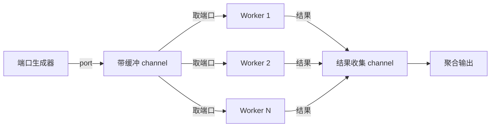
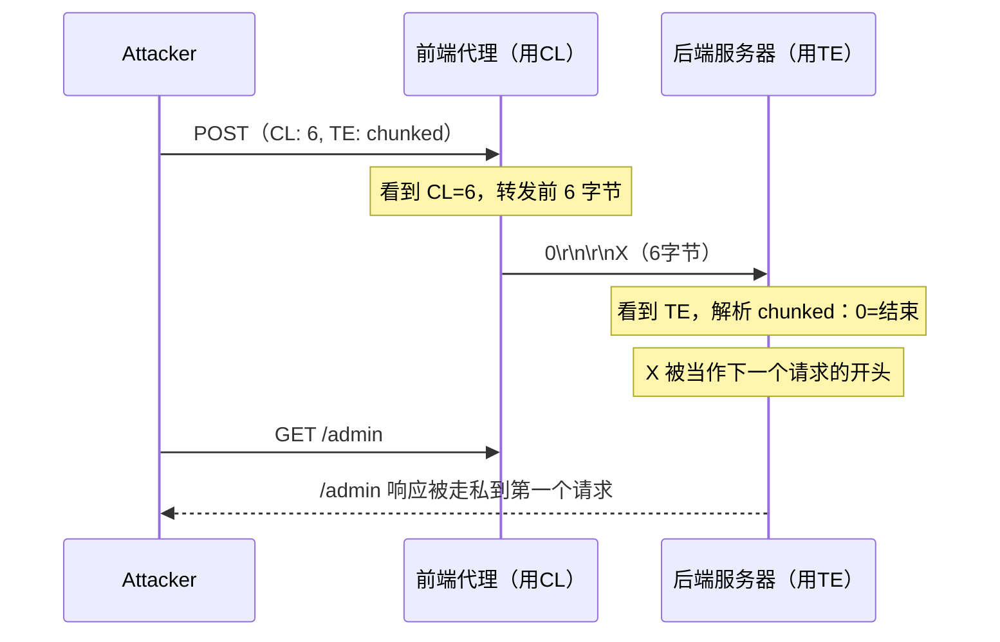

## 3. Go安全编程技巧

Go 语言因其独特的并发模型、编译为静态二进制、高性能网络 I/O 等特性，已成为安全工具开发的首选语言之一。从 Nmap 的现代替代品到云原生安全扫描器，Go 在安全领域的应用正在快速增长。本节从语言特性出发，系统讲解 Go 在安全编程中的核心技巧，覆盖并发安全模式、网络攻击工具实现、密码学实践、内存安全防护四大维度。

### 3.1 为什么选择 Go 做安全开发

在深入具体技巧之前，先理解 Go 相较于 Python、C、Rust 等语言在安全工具开发中的独特优势：

| 特性 | Go 的优势 | 安全场景意义 |
|------|----------|-------------|
| goroutine 调度器 | 轻量级协程（~8KB 栈），百万级并发 | 端口扫描、并发 Fuzzing、分布式爆破 |
| 静态编译 | 单一二进制，无运行时依赖 | 渗透测试工具可直接投放目标机器 |
| 标准库 net/http | 工业级 HTTP 客户端/服务端 | Web 漏洞扫描、代理、请求走私检测 |
| crypto 标准库 | 久经考验的加密实现 | 密码哈希、TLS 操作、密钥管理 |
| 内存安全 | GC + 边界检查，无 use-after-free | 避免 C 语言常见的内存漏洞 |
| 交叉编译 | `GOOS/GOARCH` 一行命令 | 快速生成多平台攻击载荷 |

**Go 与 Python 的性能对比（端口扫描基准）：**

在扫描 65535 个端口、100 并发的场景下，典型耗时对比：

| 语言 | 耗时 | 内存占用 | 二进制大小 |
|------|------|---------|-----------|
| Python (asyncio) | ~45s | ~120MB | 需解释器 |
| Go (goroutine) | ~8s | ~15MB | ~6MB |
| Rust (tokio) | ~6s | ~12MB | ~3MB |

Go 在开发效率和运行效率之间取得了最佳平衡——开发速度接近 Python，运行性能接近 Rust。

### 3.2 并发端口扫描器

端口扫描是安全测试的基础操作。用 Go 实现高并发扫描器是理解 goroutine + channel + sync 原语的最佳切入点。

#### 3.2.1 核心架构设计

并发扫描器的架构可以抽象为"生产者-消费者"模式：



关键设计决策：

1. **信号量模式控制并发数**：用带缓冲 channel 作为信号量，避免创建过多 goroutine 导致文件描述符耗尽
2. **sync.WaitGroup 同步等待**：确保所有 goroutine 完成后再返回结果
3. **sync.Mutex 保护共享状态**：openPorts 切片的并发写入需要加锁

#### 3.2.2 完整实现

```go
package main

import (
    "context"
    "fmt"
    "net"
    "os"
    "sort"
    "strconv"
    "strings"
    "sync"
    "time"
)

// ScanResult 端口扫描结果
type ScanResult struct {
    Port    int
    State   string // "open", "closed", "filtered"
    Service string // 可选：服务指纹
    Latency time.Duration
}

// ScanConfig 扫描配置
type ScanConfig struct {
    Host        string
    Ports       []int
    Concurrency int
    Timeout     time.Duration
    Retries     int
}

// DefaultScanConfig 默认配置
func DefaultScanConfig(host string) *ScanConfig {
    return &ScanConfig{
        Host:        host,
        Concurrency: 100,
        Timeout:     2 * time.Second,
        Retries:     1,
    }
}

// PortScan 使用信号量模式的并发端口扫描
func PortScan(ctx context.Context, cfg *ScanConfig) []ScanResult {
    var results []ScanResult
    var mu sync.Mutex
    var wg sync.WaitGroup

    // 带缓冲 channel 作为信号量——限制同时活跃的连接数
    // 这比直接开 65535 个 goroutine 安全得多，避免 fd 耗尽
    sem := make(chan struct{}, cfg.Concurrency)

    for _, port := range cfg.Ports {
        // 检查上下文是否已取消（支持 Ctrl+C 中断）
        select {
        case <-ctx.Done():
            break
        default:
        }

        wg.Add(1)
        sem <- struct{}{} // 获取信号量——当 buffer 满时阻塞

        go func(p int) {
            defer wg.Done()
            defer func() { <-sem }() // 释放信号量

            result := scanSinglePort(ctx, cfg.Host, p, cfg.Timeout, cfg.Retries)
            if result.State == "open" {
                mu.Lock()
                results = append(results, result)
                mu.Unlock()
            }
        }(port)
    }

    wg.Wait()
    return results
}

func scanSinglePort(ctx context.Context, host string, port int, timeout time.Duration, retries int) ScanResult {
    address := fmt.Sprintf("%s:%d", host, port)
    result := ScanResult{Port: port, State: "closed"}

    for attempt := 0; attempt <= retries; attempt++ {
        start := time.Now()
        // DialTimeout 会执行 TCP 三次握手
        // 成功 = 端口开放，超时 = 端口被过滤，拒绝 = 端口关闭
        conn, err := net.DialTimeout("tcp", address, timeout)
        latency := time.Since(start)

        if err == nil {
            conn.Close()
            result.State = "open"
            result.Latency = latency
            return result
        }

        // 区分"连接被拒绝"和"超时"——安全意义不同
        if netErr, ok := err.(net.Error); ok && netErr.Timeout() {
            result.State = "filtered"
        }

        // 短暂退避后重试
        if attempt < retries {
            time.Sleep(100 * time.Millisecond)
        }
    }
    return result
}

// ParsePortRange 解析端口范围表达式
// 支持: "80", "80,443", "1-1024", "80,443,8000-9000"
func ParsePortRange(expr string) ([]int, error) {
    var ports []int
    seen := make(map[int]bool)

    for _, part := range strings.Split(expr, ",") {
        part = strings.TrimSpace(part)
        if strings.Contains(part, "-") {
            bounds := strings.SplitN(part, "-", 2)
            start, err := strconv.Atoi(strings.TrimSpace(bounds[0]))
            if err != nil {
                return nil, fmt.Errorf("无效端口: %s", bounds[0])
            }
            end, err := strconv.Atoi(strings.TrimSpace(bounds[1]))
            if err != nil {
                return nil, fmt.Errorf("无效端口: %s", bounds[1])
            }
            for p := start; p <= end; p++ {
                if !seen[p] {
                    ports = append(ports, p)
                    seen[p] = true
                }
            }
        } else {
            p, err := strconv.Atoi(part)
            if err != nil {
                return nil, fmt.Errorf("无效端口: %s", part)
            }
            if !seen[p] {
                ports = append(ports, p)
                seen[p] = true
            }
        }
    }

    sort.Ints(ports)
    return ports, nil
}

func main() {
    if len(os.Args) < 2 {
        fmt.Fprintf(os.Stderr, "用法: %s <host> [ports] [concurrency]\n", os.Args[0])
        fmt.Fprintf(os.Stderr, "  ports: 端口范围，如 1-1024, 默认 Top 1000\n")
        fmt.Fprintf(os.Stderr, "  concurrency: 并发数，默认 100\n")
        os.Exit(1)
    }

    cfg := DefaultScanConfig(os.Args[1])

    // 解析端口范围
    if len(os.Args) >= 3 {
        ports, err := ParsePortRange(os.Args[2])
        if err != nil {
            fmt.Fprintf(os.Stderr, "端口解析错误: %v\n", err)
            os.Exit(1)
        }
        cfg.Ports = ports
    } else {
        // 默认 Top 1000 端口
        cfg.Ports = make([]int, 1000)
        for i := range cfg.Ports {
            cfg.Ports[i] = i + 1
        }
    }

    // 解析并发数
    if len(os.Args) >= 4 {
        c, err := strconv.Atoi(os.Args[3])
        if err == nil && c > 0 {
            cfg.Concurrency = c
        }
    }

    // 支持 Ctrl+C 中断
    ctx, cancel := context.WithCancel(context.Background())
    defer cancel()

    fmt.Printf("开始扫描 %s（%d 个端口，并发数 %d）...\n", cfg.Host, len(cfg.Ports), cfg.Concurrency)

    start := time.Now()
    results := PortScan(ctx, cfg)
    elapsed := time.Since(start)

    // 按端口号排序输出
    sort.Slice(results, func(i, j int) bool {
        return results[i].Port < results[j].Port
    })

    fmt.Printf("\n扫描完成，耗时 %v，发现 %d 个开放端口:\n", elapsed, len(results))
    fmt.Printf("%-8s %-12s %-10s\n", "PORT", "STATE", "LATENCY")
    fmt.Println(strings.Repeat("-", 32))
    for _, r := range results {
        fmt.Printf("%-8d %-12s %-10v\n", r.Port, r.State, r.Latency)
    }
}
```

#### 3.2.3 关键陷阱与优化

**陷阱 1：文件描述符耗尽**

操作系统对单个进程的文件描述符数量有限制（Linux 默认 1024）。每个 TCP 连接占用一个 fd，当并发数超过 ulimit 时会报 `too many open files`。

```go
// 错误：直接开 65535 个 goroutine
for port := 1; port <= 65535; port++ {
    go func(p int) { /* ... */ }(port) // 会同时打开数万个连接
}

// 正确：用信号量限制并发
sem := make(chan struct{}, 100) // 最多 100 个并发连接
for port := 1; port <= 65535; port++ {
    sem <- struct{}{}             // 超过 100 时自动阻塞
    go func(p int) {
        defer func() { <-sem }()
        /* ... */
    }(port)
}
```

在生产环境中，还需要通过 `syscall.Setrlimit` 提升 fd 限制：

```go
import "syscall"

func raiseFDLimit() {
    var rLimit syscall.Rlimit
    syscall.Getrlimit(syscall.RLIMIT_NOFILE, &rLimit)
    rLimit.Cur = rLimit.Max
    syscall.Setrlimit(syscall.RLIMIT_NOFILE, &rLimit)
}
```

**陷阱 2：goroutine 泄漏**

如果 worker 没有正确退出（比如阻塞在 channel 读写上），goroutine 会永久驻留内存。使用 `context.WithTimeout` 作为安全网：

```go
ctx, cancel := context.WithTimeout(context.Background(), 5*time.Minute)
defer cancel() // 无论如何都取消，防止泄漏
```

**陷阱 3：结果乱序**

多个 goroutine 并发写入结果 slice 时，即使加了锁，结果的顺序也是不确定的。扫描完成后需要 `sort.Slice` 排序。

**优化：SYN 扫描替代 Connect 扫描**

上述实现使用的是 TCP Connect 扫描（完成三次握手），更高效的方式是 SYN 扫描（只发 SYN 包，不完成握手）。Go 中可以用 `gopacket` 库构造原始套接字：

```go
import "github.com/google/gopacket/pcap"

// SYN 扫描需要 root 权限和 libpcap
// 优势：不创建完整连接，速度更快，目标日志更少
// 劣势：需要 root/管理员权限
```

### 3.3 HTTP 请求走私检测

HTTP 请求走私（HTTP Request Smuggling）是一种利用前端代理服务器和后端服务器对 HTTP 请求边界解析不一致的攻击技术。它是现代 Web 安全中最危险的攻击向量之一，可导致缓存投毒、会话劫持、WAF 绕过等严重后果。

#### 3.3.1 攻击原理

HTTP/1.1 规范中，请求体的长度有两种确定方式：

| 方式 | 头部 | 含义 |
|------|------|------|
| Content-Length (CL) | `Content-Length: N` | 请求体精确 N 字节 |
| Transfer-Encoding (TE) | `Transfer-Encoding: chunked` | 分块传输，以 `0\r\n\r\n` 结尾 |

当两者同时存在且前端和后端优先级不一致时，就会产生走私漏洞：

- **CL.TE**：前端用 CL，后端用 TE → 攻击者可将第二个请求"藏"在第一个请求体中
- **TE.CL**：前端用 TE，后端用 CL → 同理，方向相反
- **TE.TE**：前后端都用 TE，但对畸形 chunked 编码的容错处理不同



#### 3.3.2 检测器实现

```go
package main

import (
    "bufio"
    "crypto/tls"
    "fmt"
    "io"
    "net"
    "os"
    "strings"
    "time"
)

// SmuggleResult 走私检测结果
type SmuggleResult struct {
    Type        string // "CL.TE", "TE.CL", "TE.TE"
    Vulnerable  bool
    StatusCode  int
    Evidence    string // 响应中的异常证据
}

// SmuggleConfig 走私检测配置
type SmuggleConfig struct {
    Host    string
    Port    int
    UseTLS  bool
    Timeout time.Duration
    Path    string
}

func DefaultSmuggleConfig(host string) *SmuggleConfig {
    return &SmuggleConfig{
        Host:    host,
        Port:    443,
        UseTLS:  true,
        Timeout: 5 * time.Second,
        Path:    "/",
    }
}

// DetectSmuggling 检测 HTTP 请求走私漏洞
func DetectSmuggling(cfg *SmuggleConfig) []SmuggleResult {
    var results []SmuggleResult

    // 测试 CL.TE
    if r := testCLTE(cfg); r.Vulnerable {
        results = append(results, r)
    }

    // 测试 TE.CL
    if r := testTECL(cfg); r.Vulnerable {
        results = append(results, r)
    }

    // 测试 TE.TE（混淆 chunked 编码）
    if r := testTETE(cfg); r.Vulnerable {
        results = append(results, r)
    }

    return results
}

func testCLTE(cfg *SmuggleConfig) SmuggleResult {
    // CL.TE payload：前端看到 6 字节（"0\r\n\r\nX"），后端看到 chunked 编码结束
    payload := fmt.Sprintf("POST %s HTTP/1.1\r\n"+
        "Host: %s\r\n"+
        "Content-Length: 6\r\n"+
        "Transfer-Encoding: chunked\r\n"+
        "\r\n"+
        "0\r\n"+
        "\r\n"+
        "X", cfg.Path, cfg.Host)

    result := SmuggleResult{Type: "CL.TE"}
    response := sendRaw(cfg, payload)
    
    // 后端用 TE 解析时，0\r\n\r\n 标记 chunked 结束
    // 残留的 "X" 会被当作下一个请求的起始
    // 如果返回 400 或超时，说明 "X" 被错误解析
    if strings.Contains(response, "400") || strings.Contains(response, "Timeout") {
        result.Vulnerable = true
        result.Evidence = response
    }
    return result
}

func testTECL(cfg *SmuggleConfig) SmuggleResult {
    // TE.CL payload：前端用 TE（chunked），后端用 CL
    payload := fmt.Sprintf("POST %s HTTP/1.1\r\n"+
        "Host: %s\r\n"+
        "Content-Length: 3\r\n"+
        "Transfer-Encoding: chunked\r\n"+
        "\r\n"+
        "8\r\n"+
        "SMUGGLED\r\n"+
        "0\r\n"+
        "\r\n", cfg.Path, cfg.Host)

    result := SmuggleResult{Type: "TE.CL"}
    response := sendRaw(cfg, payload)
    
    if !strings.Contains(response, "200") || strings.Contains(response, "400") {
        result.Vulnerable = true
        result.Evidence = response
    }
    return result
}

func testTETE(cfg *SmuggleConfig) SmuggleResult {
    // TE.TE payload：用混淆的 Transfer-Encoding 头
    // 前后端对 "Transfer-Encoding: chunked" 的不同容错处理
    obfuscations := []string{
        "Transfer-Encoding: chunked",
        "Transfer-Encoding: \tchunked",
        "Transfer-Encoding: chunked\r\nTransfer-Encoding: x",
        "Transfer-encoding: chunked",         // 大小写混淆
        "Transfer-Encoding: chunKed",          // 部分大小写
    }

    result := SmuggleResult{Type: "TE.TE"}
    for _, te := range obfuscations {
        payload := fmt.Sprintf("POST %s HTTP/1.1\r\n"+
            "Host: %s\r\n"+
            "Content-Length: 6\r\n"+
            "%s\r\n"+
            "\r\n"+
            "0\r\n"+
            "\r\n"+
            "X", cfg.Path, cfg.Host, te)

        response := sendRaw(cfg, payload)
        if strings.Contains(response, "400") {
            result.Vulnerable = true
            result.Evidence = te + " -> " + response
            return result
        }
    }
    return result
}

func sendRaw(cfg *SmuggleConfig, payload string) string {
    address := fmt.Sprintf("%s:%d", cfg.Host, cfg.Port)

    var conn net.Conn
    var err error

    if cfg.UseTLS {
        conn, err = tls.DialWithDialer(
            &net.Dialer{Timeout: cfg.Timeout},
            "tcp", address,
            &tls.Config{InsecureSkipVerify: true},
        )
    } else {
        conn, err = net.DialTimeout("tcp", address, cfg.Timeout)
    }

    if err != nil {
        return fmt.Sprintf("连接失败: %v", err)
    }
    defer conn.Close()

    // 设置写入和读取超时
    conn.SetDeadline(time.Now().Add(cfg.Timeout))

    fmt.Fprintf(conn, "%s", payload)

    // 读取完整响应（而非仅第一行）
    reader := bufio.NewReader(conn)
    var response strings.Builder
    for {
        line, err := reader.ReadString('\n')
        response.WriteString(line)
        if err != nil || line == "\r\n" {
            break
        }
    }

    // 尝试读取响应体
    body := make([]byte, 1024)
    n, _ := io.ReadAtLeast(reader, body, 1)
    if n > 0 {
        response.WriteString(string(body[:n]))
    }

    return response.String()
}

func main() {
    if len(os.Args) < 2 {
        fmt.Fprintf(os.Stderr, "用法: %s <host> [port] [use_tls]\n", os.Args[0])
        os.Exit(1)
    }

    cfg := DefaultSmuggleConfig(os.Args[1])

    if len(os.Args) >= 3 {
        port, err := fmt.Sscanf(os.Args[2], "%d", &cfg.Port)
        if err != nil || port == 0 {
            cfg.Port = 80
            cfg.UseTLS = false
        }
    }

    fmt.Printf("检测 %s:%d 的 HTTP 请求走私漏洞...\n", cfg.Host, cfg.Port)

    results := DetectSmuggling(cfg)

    if len(results) == 0 {
        fmt.Println("[-] 未检测到走私漏洞")
    } else {
        for _, r := range results {
            fmt.Printf("[!] 发现 %s 走私漏洞\n", r.Type)
            fmt.Printf("    证据: %s\n", r.Evidence)
        }
    }
}
```

#### 3.3.3 检测要点

1. **不要仅检查状态码 200**：走私攻击的响应可能返回 400（请求格式错误）、502（网关错误）或超时，这些都可能是成功的迹象
2. **分块编码的正确格式**：每个 chunk 需要 `\r\n` 结尾，最后需要 `0\r\n\r\n` 标记结束
3. **TLS 检测必须使用 InsecureSkipVerify**：目标证书可能无效，但这不影响检测逻辑
4. **同一连接复用问题**：HTTP/1.1 默认使用 keep-alive，走私成功的条件是两个请求在同一 TCP 连接上。上述实现每次测试使用新连接，更可靠

### 3.4 安全的密码哈希

密码存储是安全编程中最基础也最容易出错的环节。一个错误的密码哈希方案可能导致数百万用户凭据泄露。

#### 3.4.1 密码哈希算法选择

| 算法 | 推荐度 | 抗 GPU | 抗 ASIC | 可调参数 | 适用场景 |
|------|--------|--------|---------|---------|---------|
| MD5/SHA-1 | ❌ 绝不 | 极弱 | 极弱 | 无 | 仅用于校验和 |
| SHA-256 | ❌ 不推荐 | 弱 | 弱 | 无 | 非密码场景 |
| bcrypt | ✅ 推荐 | 中 | 中 | cost | 通用 Web 应用 |
| scrypt | ✅ 推荐 | 强 | 中 | N, r, p | 内存密集型 |
| **Argon2id** | ⭐ 首选 | 强 | 强 | memory, iterations, parallelism | 新项目首选 |

**为什么选 Argon2id？** 它是 2015 年密码哈希竞赛（PHC）的获胜者，同时抗 GPU 和 ASIC 攻击，且三个独立参数可以灵活调整：

- **memory**（内存开销）：越大越抗 GPU，但会影响服务端并发能力
- **iterations**（迭代次数）：时间成本，越大越慢
- **parallelism**（并行度）：利用多核 CPU，不影响单核验证时间

#### 3.4.2 完整实现

```go
package main

import (
    "crypto/rand"
    "crypto/subtle"
    "encoding/base64"
    "errors"
    "fmt"
    "strconv"
    "strings"

    "golang.org/x/crypto/argon2"
)

// PasswordConfig Argon2id 参数配置
type PasswordConfig struct {
    Memory      uint32 // 内存使用量（KB）
    Iterations  uint32 // 迭代次数
    Parallelism uint8  // 并行度
    SaltLength  uint32 // 盐值长度（字节）
    KeyLength   uint32 // 输出密钥长度（字节）
}

// DefaultPasswordConfig 返回 OWASP 推荐的默认参数
// 基于 2024 年硬件水平，验证时间约 0.5-1 秒
func DefaultPasswordConfig() *PasswordConfig {
    return &PasswordConfig{
        Memory:      64 * 1024, // 64 MB
        Iterations:  3,
        Parallelism: 2,
        SaltLength:  16,
        KeyLength:   32,
    }
}

// HashPassword 使用 Argon2id 生成密码哈希
// 返回格式: $argon2id$v=19$m=65536,t=3,p=2$<base64salt>$<base64hash>
func HashPassword(password string, cfg *PasswordConfig) (string, error) {
    // 生成密码学安全的随机盐
    // 盐的作用：即使两个用户使用相同密码，哈希结果也不同
    // 16 字节 = 128 位，碰撞概率可忽略
    salt := make([]byte, cfg.SaltLength)
    if _, err := rand.Read(salt); err != nil {
        return "", fmt.Errorf("生成盐失败: %w", err)
    }

    // Argon2IDKey 同时抵抗 GPU 和侧信道攻击
    hash := argon2.IDKey(
        []byte(password),
        salt,
        cfg.Iterations,
        cfg.Memory,
        cfg.Parallelism,
        cfg.KeyLength,
    )

    // Base64 编码——不使用 Padding（RawStdEncoding），因为 $ 分隔符已足够
    b64Salt := base64.RawStdEncoding.EncodeToString(salt)
    b64Hash := base64.RawStdEncoding.EncodeToString(hash)

    // 按 PHC 字符串格式编码
    encoded := fmt.Sprintf("$argon2id$v=%d$m=%d,t=%d,p=%d$%s$%s",
        argon2.Version, cfg.Memory, cfg.Iterations, cfg.Parallelism,
        b64Salt, b64Hash)

    return encoded, nil
}

// 解析后的哈希结构
type parsedHash struct {
    version     int
    memory      uint32
    iterations  uint32
    parallelism uint8
    salt        []byte
    hash        []byte
}

// parseHash 解析 PHC 格式的哈希字符串
func parseHash(encodedHash string) (*parsedHash, error) {
    parts := strings.Split(encodedHash, "$")
    // 格式: ["", "argon2id", "v=19", "m=...,t=...,p=...", "salt", "hash"]
    if len(parts) != 6 {
        return nil, errors.New("哈希格式无效：段数不正确")
    }

    if parts[1] != "argon2id" {
        return nil, fmt.Errorf("不支持的算法: %s（仅支持 argon2id）", parts[1])
    }

    ph := &parsedHash{}

    // 解析版本号
    if _, err := fmt.Sscanf(parts[2], "v=%d", &ph.version); err != nil {
        return nil, fmt.Errorf("版本号解析失败: %w", err)
    }

    // 解析参数 m=65536,t=3,p=2
    params := strings.Split(parts[3], ",")
    if len(params) != 3 {
        return nil, errors.New("参数格式无效")
    }
    for _, param := range params {
        kv := strings.SplitN(param, "=", 2)
        if len(kv) != 2 {
            return nil, fmt.Errorf("参数格式无效: %s", param)
        }
        switch kv[0] {
        case "m":
            v, err := strconv.ParseUint(kv[1], 10, 32)
            if err != nil {
                return nil, fmt.Errorf("memory 参数无效: %w", err)
            }
            ph.memory = uint32(v)
        case "t":
            v, err := strconv.ParseUint(kv[1], 10, 32)
            if err != nil {
                return nil, fmt.Errorf("iterations 参数无效: %w", err)
            }
            ph.iterations = uint32(v)
        case "p":
            v, err := strconv.ParseUint(kv[1], 10, 8)
            if err != nil {
                return nil, fmt.Errorf("parallelism 参数无效: %w", err)
            }
            ph.parallelism = uint8(v)
        }
    }

    // 解析 Base64 编码的盐和哈希
    var err error
    ph.salt, err = base64.RawStdEncoding.DecodeString(parts[4])
    if err != nil {
        return nil, fmt.Errorf("盐解码失败: %w", err)
    }
    ph.hash, err = base64.RawStdEncoding.DecodeString(parts[5])
    if err != nil {
        return nil, fmt.Errorf("哈希解码失败: %w", err)
    }

    return ph, nil
}

// VerifyPassword 验证密码是否匹配
// 关键安全措施：使用 ConstantTimeCompare 防止时序攻击
func VerifyPassword(password, encodedHash string) (bool, error) {
    ph, err := parseHash(encodedHash)
    if err != nil {
        return false, fmt.Errorf("哈希解析失败: %w", err)
    }

    // 使用存储的参数重新计算哈希
    computedHash := argon2.IDKey(
        []byte(password),
        ph.salt,
        ph.iterations,
        ph.memory,
        ph.parallelism,
        uint32(len(ph.hash)), // 使用原始哈希的长度
    )

    // ConstantTimeCompare 进行恒定时间比较
    // 为什么重要？普通的 == 比较会在遇到第一个不同字节时立即返回
    // 攻击者可以通过测量响应时间逐字节猜测哈希值
    // ConstantTimeCompare 无论是否匹配都遍历全部字节，耗时恒定
    if subtle.ConstantTimeCompare(computedHash, ph.hash) == 1 {
        return true, nil
    }

    return false, nil
}

// NeedsRehash 检查哈希是否需要升级参数
// 当你调整了安全参数后，旧哈希应该在用户下次登录时自动升级
func NeedsRehash(encodedHash string, cfg *PasswordConfig) bool {
    ph, err := parseHash(encodedHash)
    if err != nil {
        return true // 无法解析则强制重新哈希
    }
    return ph.memory < cfg.Memory ||
        ph.iterations < cfg.Iterations ||
        ph.parallelism < cfg.Parallelism
}

func main() {
    cfg := DefaultPasswordConfig()

    // 哈希密码
    password := "MySecureyour_password!"
    encoded, err := HashPassword(password, cfg)
    if err != nil {
        fmt.Printf("哈希失败: %v\n", err)
        return
    }
    fmt.Printf("哈希结果: %s\n", encoded)

    // 验证正确密码
    match, err := VerifyPassword(password, encoded)
    if err != nil {
        fmt.Printf("验证错误: %v\n", err)
        return
    }
    fmt.Printf("正确密码验证: %v\n", match) // true

    // 验证错误密码
    match, err = VerifyPassword("wrongpassword", encoded)
    if err != nil {
        fmt.Printf("验证错误: %v\n", err)
        return
    }
    fmt.Printf("错误密码验证: %v\n", match) // false

    // 检查是否需要升级
    if NeedsRehash(encoded, cfg) {
        fmt.Println("哈希参数已过期，需要重新哈希")
    }
}
```

#### 3.4.3 密码学常见错误

**错误 1：自己发明加密算法或哈希方案**

```text
❌ hash = SHA256(password)
❌ hash = MD5(password + salt)
❌ hash = SHA256(SHA256(password) + salt)
```

这些方案都存在致命缺陷：SHA/MD5 设计目标是快速计算，GPU 每秒可计算数十亿次。必须使用 Argon2id/bcrypt/scrypt 这类故意设计为慢速的 KDF。

**错误 2：使用 `==` 比较哈希**

```go
// ❌ 错误：时序攻击
if computedHash == storedHash { ... }

// ✅ 正确：恒定时间比较
if subtle.ConstantTimeCompare(computedHash, storedHash) == 1 { ... }
```

时序攻击的原理：`==` 运算符在第一个不匹配的字节处返回，攻击者通过精确测量响应时间（纳秒级差异需要多次采样统计），可以逐字节推断出正确的哈希值。

**错误 3：硬编码盐值或使用时间戳作为盐**

```go
// ❌ 所有用户共用同一个盐
salt := []byte("fixed-salt-value")

// ❌ 使用时间戳——可预测
salt := []byte(time.Now().Format(time.RFC3339))

// ✅ 使用 crypto/rand 生成密码学安全的随机盐
salt := make([]byte, 16)
rand.Read(salt)
```

**错误 4：忽略参数升级策略**

安全参数会随硬件进步而过时。设计哈希方案时必须考虑未来升级：

```go
// 登录验证流程
func Login(db *DB, username, password string) error {
    storedHash := db.GetHash(username)
    match, _ := VerifyPassword(password, storedHash)
    if !match {
        return ErrInvalidCredentials
    }

    // 哈希验证成功后，检查是否需要升级参数
    if NeedsRehash(storedHash, CurrentConfig()) {
        newHash, _ := HashPassword(password, CurrentConfig())
        db.UpdateHash(username, newHash)
    }
    return nil
}
```

### 3.5 Go 并发安全模式进阶

#### 3.5.1 三种并发控制模式

Go 安全工具开发中常用的并发控制模式：

| 模式 | 实现方式 | 适用场景 | 示例 |
|------|---------|---------|------|
| 信号量 | 带缓冲 channel | 限制并发连接数 | 端口扫描器 |
| WaitGroup | sync.WaitGroup | 等待所有任务完成 | 批量漏洞扫描 |
| 限速器 | time.Ticker / rate.Limiter | 控制请求速率 | API 爆破、爬虫 |

**限速器实现（防止触发目标防御）：**

```go
import "golang.org/x/time/rate"

// 创建限速器：每秒 10 个请求，突发 20 个
limiter := rate.NewLimiter(10, 20)

for _, target := range targets {
    // 等待直到允许下一个请求
    if err := limiter.Wait(ctx); err != nil {
        break // 上下文取消
    }
    go func(t string) {
        result := probe(t)
        results <- result
    }(target)
}
```

#### 3.5.2 使用 errgroup 简化错误处理

标准库 `sync.WaitGroup` 不支持从 goroutine 中收集错误。`errgroup` 提供了更优雅的替代方案：

```go
import "golang.org/x/sync/errgroup"

g, ctx := errgroup.WithContext(ctx)
g.SetLimit(100) // 限制并发数

for _, port := range ports {
    port := port // Go 1.22 之前必须捕获循环变量
    g.Go(func() error {
        result := scanPort(ctx, host, port)
        if result.State == "open" {
            mu.Lock()
            results = append(results, result)
            mu.Unlock()
        }
        return nil // 或返回错误以中断所有扫描
    })
}

if err := g.Wait(); err != nil {
    fmt.Printf("扫描中断: %v\n", err)
}
```

#### 3.5.3 使用 channel 模式分发任务

当 worker 需要动态拉取任务时（比静态分配更高效），使用 channel 分发：

```go
func workerPool(host string, ports []int, workers int) []ScanResult {
    jobs := make(chan int, len(ports))
    results := make(chan ScanResult, len(ports))

    // 启动 worker 池
    var wg sync.WaitGroup
    for i := 0; i < workers; i++ {
        wg.Add(1)
        go func() {
            defer wg.Done()
            for port := range jobs { // channel 关闭时自动退出
                r := scanSinglePort(context.Background(), host, port, 2*time.Second, 0)
                if r.State == "open" {
                    results <- r
                }
            }
        }()
    }

    // 分发任务
    for _, port := range ports {
        jobs <- port
    }
    close(jobs) // 通知 worker 没有更多任务

    // 等待所有 worker 完成后关闭结果 channel
    go func() {
        wg.Wait()
        close(results)
    }()

    // 收集结果
    var collected []ScanResult
    for r := range results {
        collected = append(collected, r)
    }
    return collected
}
```

### 3.6 Go 安全编码清单

在开发安全工具或任何处理敏感数据的 Go 程序时，对照以下清单检查：

#### 3.6.1 输入验证

```go
// ❌ 直接拼接用户输入到命令
cmd := exec.Command("sh", "-c", "nmap "+userInput)

// ✅ 使用参数数组，避免命令注入
cmd := exec.Command("nmap", "--top-ports", "1000", userInput)

// ✅ 对用户输入进行严格验证
func validateHost(host string) error {
    if ip := net.ParseIP(host); ip != nil {
        return nil // 有效 IP
    }
    if _, err := net.LookupHost(host); err != nil {
        return fmt.Errorf("无效主机名: %s", host)
    }
    return nil
}
```

#### 3.6.2 敏感数据处理

```go
// ❌ 密码硬编码
const apiKey = "sk-1234567890abcdef"

// ✅ 从环境变量读取
apiKey := os.Getenv("API_KEY")
if apiKey == "" {
    log.Fatal("未设置 API_KEY 环境变量")
}

// ❌ 日志中打印敏感信息
log.Printf("密码: %s", password)

// ✅ 使用 zerolog 的敏感字段掩码
log.Info().Str("user", username).Msg("登录尝试")
// 密码从不出现在日志中
```

#### 3.6.3 TLS 配置

```go
// ❌ 禁用 TLS 验证（仅限测试环境）
tls.Config{InsecureSkipVerify: true}

// ✅ 生产环境应使用安全的 TLS 配置
tlsConfig := &tls.Config{
    MinVersion:               tls.VersionTLS12,
    PreferServerCipherSuites: true,
    CipherSuites: []uint16{
        tls.TLS_ECDHE_ECDSA_WITH_AES_256_GCM_SHA384,
        tls.TLS_ECDHE_RSA_WITH_AES_256_GCM_SHA384,
        tls.TLS_ECDHE_ECDSA_WITH_AES_128_GCM_SHA256,
        tls.TLS_ECDHE_RSA_WITH_AES_128_GCM_SHA256,
    },
}
```

#### 3.6.4 错误处理安全原则

```go
// ❌ 泄露内部错误详情给用户
http.Error(w, err.Error(), 500) // 可能暴露数据库结构、文件路径

// ✅ 对外返回通用错误，内部记录详细日志
log.Error().Err(err).Str("path", r.URL.Path).Msg("请求处理失败")
http.Error(w, "Internal Server Error", 500)
```

### 3.7 实战案例：综合安全扫描器

将前面的技巧综合到一个完整的扫描器中，集成端口扫描、HTTP 走私检测和密码哈希功能：

```go
package main

import (
    "context"
    "flag"
    "fmt"
    "os"
    "sync"
    "time"
)

// ScanTask 定义扫描任务类型
type ScanTask struct {
    Name string
    Run  func(ctx context.Context) error
}

func main() {
    host := flag.String("host", "", "目标主机")
    ports := flag.String("ports", "1-1024", "端口范围")
    concurrency := flag.Int("c", 100, "并发数")
    timeout := flag.Duration("timeout", 2*time.Second, "连接超时")
    flag.Parse()

    if *host == "" {
        fmt.Fprintf(os.Stderr, "用法: %s -host <target> [选项]\n", os.Args[0])
        flag.PrintDefaults()
        os.Exit(1)
    }

    ctx, cancel := context.WithTimeout(context.Background(), 5*time.Minute)
    defer cancel()

    tasks := []ScanTask{
        {Name: "端口扫描", Run: func(ctx context.Context) error {
            cfg := &ScanConfig{
                Host: *host, Concurrency: *concurrency, Timeout: *timeout,
            }
            cfg.Ports, _ = ParsePortRange(*ports)
            results := PortScan(ctx, cfg)
            fmt.Printf("[端口扫描] 发现 %d 个开放端口\n", len(results))
            for _, r := range results {
                fmt.Printf("  %d/tcp open (延迟 %v)\n", r.Port, r.Latency)
            }
            return nil
        }},
        {Name: "HTTP走私检测", Run: func(ctx context.Context) error {
            cfg := DefaultSmuggleConfig(*host)
            results := DetectSmuggling(cfg)
            if len(results) == 0 {
                fmt.Println("[HTTP走私] 未发现漏洞")
            } else {
                for _, r := range results {
                    fmt.Printf("[HTTP走私] 发现 %s 漏洞\n", r.Type)
                }
            }
            return nil
        }},
    }

    // 并行执行所有扫描任务
    var wg sync.WaitGroup
    for _, task := range tasks {
        task := task
        wg.Add(1)
        go func() {
            defer wg.Done()
            fmt.Printf("▶ 开始 %s...\n", task.Name)
            if err := task.Run(ctx); err != nil {
                fmt.Printf("✗ %s 失败: %v\n", task.Name, err)
            } else {
                fmt.Printf("✓ %s 完成\n", task.Name)
            }
        }()
    }
    wg.Wait()

    fmt.Println("\n所有扫描任务已完成。")
}
```

### 3.8 本节小结

Go 安全编程的核心要点：

1. **并发是 Go 的杀手锏**：信号量模式控制并发数、WaitGroup 同步等待、channel 分发任务，这三种模式覆盖 90% 的并发安全场景
2. **密码哈希必须用 Argon2id**：不要自己发明方案，不要用 MD5/SHA 系列，不要用 `==` 比较哈希
3. **HTTP 走私检测要注意 CL/TE 优先级差异**：至少测试 CL.TE、TE.CL、TE.TE 三种变体，使用原始 TCP 连接而非 HTTP 客户端
4. **安全编码是底线**：输入验证、敏感数据保护、TLS 配置、错误处理——每一条都有具体的安全意义
5. **永远不要信任用户输入**：用参数数组避免命令注入，用 `net.ParseIP` 验证 IP，用白名单过滤特殊字符
