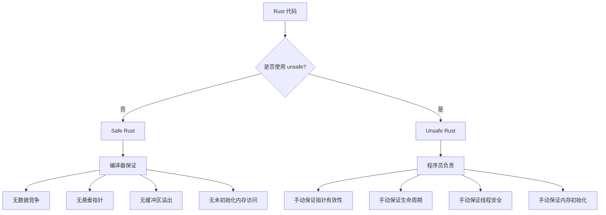

## 4. Rust安全编程技巧

Rust 是系统编程领域安全性最强的语言之一。其所有权系统、借用检查器和生命周期机制在编译阶段消除了整类内存安全漏洞——缓冲区溢出、释放后使用（use-after-free）、双重释放（double-free）、数据竞争（data race）——这些漏洞长期占据 CVE 总量的 60%-70%（Microsoft Security Response Center, 2019）。本章从安全工程视角系统讲解 Rust 的安全编程范式，涵盖内存安全、并发安全、unsafe 审计、FFI 边界防护、错误处理策略、供应链安全和实战漏洞模式。

### 4.1 Rust 安全模型总览

Rust 将代码分为两个区域：**安全 Rust（Safe Rust）** 和 **不安全 Rust（Unsafe Rust）**。安全 Rust 由编译器强制保证内存安全和线程安全；unsafe Rust 允许程序员绕过部分检查，但必须手动维护安全不变量。



**Safe Rust 的五项安全保证：**

| 保证类型 | 含义 | 编译器实现机制 |
|---------|------|---------------|
| 所有权唯一性 | 任意时刻每个值只有一个所有者 | 所有权系统 + 移动语义 |
| 借用规则 | 同一时刻：多个不可变引用 XOR 一个可变引用 | 借用检查器（Borrow Checker） |
| 生命周期约束 | 引用不能活得比被引用数据更久 | 生命周期标注 `'a` + 推断 |
| 无未初始化访问 | 所有变量使用前必须初始化 | 控制流分析 |
| 无数据竞争 | 编译时阻止跨线程的无保护可变访问 | `Send` / `Sync` trait |

### 4.2 所有权系统与内存安全

#### 4.2.1 所有权与移动语义

Rust 的所有权系统是内存安全的基石。每个值有且仅有一个所有者，所有者离开作用域时值被自动释放（drop）。赋值和函数传参默认执行移动（move），原变量失效。

```rust
fn ownership_demo() {
    let s1 = String::from("hello");
    let s2 = s1;             // s1 移动到 s2，s1 不再有效
    // println!("{}", s1);   // 编译错误：value used after move
    
    let s3 = s2.clone();     // 显式深拷贝，s2 仍然有效
    println!("{} {}", s2, s3); // OK
}
```

**安全意义：** 移动语义从根本上消除了双重释放漏洞。在 C/C++ 中，两个指针指向同一堆内存后各自释放是经典漏洞；Rust 通过所有权转移确保只有最后一个所有者负责释放。

#### 4.2.2 借用规则与引用安全

借用（borrowing）允许在不转移所有权的情况下访问数据，但受严格规则约束：

```rust
fn borrowing_rules() {
    let mut data = vec![1, 2, 3];
    
    // 规则1：可以有多个不可变引用
    let r1 = &data;
    let r2 = &data;
    println!("{:?} {:?}", r1, r2); // OK
    
    // 规则2：不可变引用和可变引用不能共存
    // let r3 = &mut data;          // 编译错误：cannot borrow as mutable
    // println!("{:?} {:?}", r1, r3); // 因为 r1 仍在使用中
    
    // r1, r2 的最后一次使用之后，可以创建可变引用
    let r3 = &mut data;             // OK：r1, r2 不再使用
    r3.push(4);
    println!("{:?}", r3);
}
```

**安全意义：** 借用规则在编译时消除了数据竞争和迭代器失效。当有可变引用存在时，不可能通过其他路径修改数据——这在 C++ 中需要程序员自律，在 Rust 中由编译器强制执行。

#### 4.2.3 生命周期与悬垂引用防护

生命周期标注告诉编译器引用的有效范围，防止悬垂引用：

```rust
// 正确：返回值的生命周期与输入参数绑定
fn longest<'a>(x: &'a str, y: &'a str) -> &'a str {
    if x.len() > y.len() { x } else { y }
}

// 错误示例：返回局部变量的引用
// fn dangling_ref() -> &String {  // 编译错误
//     let s = String::from("hello");
//     &s  // s 在函数结束时被释放，引用将悬垂
// }

// 安全替代方案：返回拥有所有权的值
fn safe_return() -> String {
    String::from("hello") // 移动所有权给调用者
}
```

**结构体中的生命周期：**

```rust
// 引用类型字段必须标注生命周期
struct PacketHeader<'a> {
    magic: &'a [u8],
    version: u8,
    payload_len: u32,
}

// 确保 PacketHeader 不能比它引用的数据活得更久
impl<'a> PacketHeader<'a> {
    fn parse(data: &'a [u8]) -> Result<Self, &'static str> {
        if data.len() < 9 {
            return Err("Data too short for header");
        }
        Ok(PacketHeader {
            magic: &data[0..4],
            version: data[4],
            payload_len: u32::from_be_bytes([data[5], data[6], data[7], data[8]]),
        })
    }
}
```

### 4.3 内存安全的缓冲区操作

#### 4.3.1 安全的输入读取

Rust 的标准库 API 设计天然防止缓冲区溢出：

```rust
use std::io::{self, Read, BufRead};

// 方式1：动态增长的 String，不会溢出
fn safe_read_line() -> io::Result<String> {
    let mut buffer = String::new();
    io::stdin().read_line(&mut buffer)?;
    Ok(buffer.trim().to_string())
}

// 方式2：带大小限制的读取，防止内存耗尽攻击
fn safe_read_with_limit(reader: &mut dyn BufRead, max_bytes: usize) -> io::Result<String> {
    let mut buffer = String::new();
    // take() 限制最大读取字节数，防止恶意超大输入
    reader.take(max_bytes as u64).read_line(&mut buffer)?;
    Ok(buffer)
}

// 方式3：读取二进制数据到固定大小缓冲区
fn safe_read_binary(reader: &mut dyn Read, buf: &mut [u8]) -> io::Result<usize> {
    // read() 返回实际读取的字节数，不会越界写入
    reader.read(buf)
}
```

#### 4.3.2 安全的网络包解析

网络数据包解析是缓冲区溢出的高发区域。Rust 的切片边界检查在运行时阻止越界访问：

```rust
fn parse_packet(data: &[u8]) -> Result<ParsedPacket, PacketError> {
    // 阶段1：最小长度校验
    if data.len() < 8 {
        return Err(PacketError::TooShort {
            expected: 8,
            got: data.len(),
        });
    }
    
    // 阶段2：解析头部字段（固定偏移量）
    let magic = &data[0..4];
    if magic != b"PKT\x00" {
        return Err(PacketError::InvalidMagic);
    }
    
    let version = data[4];
    if version > 3 {
        return Err(PacketError::UnsupportedVersion(version));
    }
    
    let flags = data[5];
    let payload_len = u16::from_be_bytes([data[6], data[7]]) as usize;
    
    // 阶段3：payload 长度校验（防止整数溢出导致的截断读取）
    let total_len = 8usize
        .checked_add(payload_len)
        .ok_or(PacketError::LengthOverflow)?;
    
    if data.len() < total_len {
        return Err(PacketError::Truncated {
            expected: total_len,
            got: data.len(),
        });
    }
    
    // 阶段4：安全提取 payload（边界检查自动执行）
    let payload = &data[8..total_len];
    
    Ok(ParsedPacket {
        version,
        flags,
        payload: payload.to_vec(),
    })
}

#[derive(Debug)]
struct ParsedPacket {
    version: u8,
    flags: u8,
    payload: Vec<u8>,
}

#[derive(Debug)]
enum PacketError {
    TooShort { expected: usize, got: usize },
    InvalidMagic,
    UnsupportedVersion(u8),
    LengthOverflow,
    Truncated { expected: usize, got: usize },
}
```

#### 4.3.3 零拷贝解析与安全权衡

高性能场景需要零拷贝解析，此时需谨慎使用 `unsafe`：

```rust
use std::mem;

/// 安全的零拷贝结构体视图（仅适用于 #[repr(C)] 布局）
/// 
/// # Safety 要求
/// - data 必须足够长（至少 mem::size_of::<T>() 字节）
/// - data 必须正确对齐
/// - T 必须是 #[repr(C)] 且所有字段都是合法的任意位模式
unsafe fn cast_bytes_to_ref<T>(data: &[u8]) -> &T {
    assert!(data.len() >= mem::size_of::<T>());
    assert!(
        data.as_ptr() as usize % mem::align_of::<T>() == 0,
        "Data not aligned for type {}", 
        std::any::type_name::<T>()
    );
    &*(data.as_ptr() as *const T)
}

// 更安全的替代方案：使用 bytemuck 或 zerocopy crate
// 这些 crate 在编译时验证类型安全条件
// use bytemuck::from_bytes;  // 编译时检查 Pod trait
```

> **安全提示：** 优先使用 `bytemuck`、`zerocopy`、`nom` 等经过审计的 crate 进行二进制解析，避免手写 `unsafe` 转换。只有在性能分析证明安全路径是瓶颈时，才考虑手动零拷贝。

### 4.4 并发安全

#### 4.4.1 Send 与 Sync：编译时的线程安全保证

Rust 通过两个 marker trait 实现编译时线程安全：

| Trait | 含义 | 典型类型 |
|-------|------|---------|
| `Send` | 类型的值可以安全地在线程间转移所有权 | `i32`, `String`, `Vec<T>`, `Arc<T>` |
| `Sync` | 类型的引用可以安全地在线程间共享 | `i32`, `Mutex<T>`, `AtomicUsize` |
| `!Send` | 不能跨线程转移 | `Rc<T>`, `*mut T`, 裸指针 |
| `!Sync` | 不能跨线程共享引用 | `Cell<T>`, `RefCell<T>`, `Rc<T>` |

```rust
use std::rc::Rc;
use std::sync::Arc;

fn thread_safety_demo() {
    let rc = Rc::new(42);
    // std::thread::spawn(move || {
    //     println!("{}", rc);  // 编译错误：Rc<i32> is not Send
    // });
    
    // Arc 是线程安全的引用计数类型
    let arc = Arc::new(42);
    let arc_clone = Arc::clone(&arc);
    std::thread::spawn(move || {
        println!("{}", arc_clone); // OK：Arc<i32> is Send
    }).join().unwrap();
}
```

#### 4.4.2 互斥锁与死锁防护

```rust
use std::sync::{Arc, Mutex};
use std::thread;
use std::time::Duration;

/// 安全的并发计数器
fn concurrent_counter() {
    let counter = Arc::new(Mutex::new(0u64));
    let mut handles = vec![];
    
    for i in 0..10 {
        let counter = Arc::clone(&counter);
        handles.push(thread::spawn(move || {
            // lock() 返回 MutexGuard，自动 RAII 释放锁
            // unwrap 是安全的：只有持有锁时 PoisonError 才会出现
            // （即另一个线程 panic 时，锁被"污染"）
            let mut num = counter.lock().unwrap();
            *num += 1;
            println!("Thread {} incremented counter to {}", i, *num);
            // MutexGuard 在此 drop，自动释放锁
        }));
    }
    
    for handle in handles {
        handle.join().unwrap();
    }
    
    println!("Final count: {}", *counter.lock().unwrap());
}

/// 死锁预防：使用 try_lock 避免无限等待
fn deadlock_safe_access(mutex: &Mutex<Vec<String>>) -> Result<(), &'static str> {
    // try_lock 在锁已被持有时立即返回 Err，不会阻塞
    match mutex.try_lock() {
        Ok(mut guard) => {
            guard.push("new item".to_string());
            Ok(())
        }
        Err(_) => Err("Lock is held by another thread, avoiding deadlock"),
    }
}
```

#### 4.4.3 Tokio 异步并发模型

异步运行时中的并发安全需要特别注意 `Send` 约束：

```rust
use tokio::net::TcpListener;
use tokio::io::{AsyncReadExt, AsyncWriteExt};
use tokio::sync::RwLock;
use std::sync::Arc;

/// 安全的异步 TCP 服务器
/// 
/// 安全要点：
/// 1. 使用 tokio::sync::Mutex（而非 std::sync::Mutex）跨 await 点持有锁
/// 2. 使用 Arc 共享状态，每个连接克隆 Arc
/// 3. 设置超时防止慢速连接耗尽资源
async fn run_server() -> Result<(), Box<dyn std::error::Error>> {
    let listener = TcpListener::bind("0.0.0.0:8080").await?;
    // 使用 RwLock 允许并发读，独占写
    let state = Arc::new(RwLock::new(Vec::<String>::new()));
    
    println!("Server listening on 0.0.0.0:8080");
    
    loop {
        let (mut socket, addr) = listener.accept().await?;
        let state = Arc::clone(&state);
        
        tokio::spawn(async move {
            let mut buf = [0u8; 4096];
            
            loop {
                // 使用 tokio::time::timeout 防止慢速读取攻击
                let n = match tokio::time::timeout(
                    Duration::from_secs(30),
                    socket.read(&mut buf)
                ).await {
                    Ok(Ok(0)) => return,  // 连接正常关闭
                    Ok(Ok(n)) => n,
                    Ok(Err(e)) => {
                        eprintln!("Read error from {}: {}", addr, e);
                        return;
                    }
                    Err(_) => {
                        eprintln!("Read timeout from {}", addr);
                        return; // 超时断开
                    }
                };
                
                // 处理请求
                let response = {
                    let state = state.read().await;
                    format!("Received {} bytes, {} items in state\n", n, state.len())
                };
                
                if socket.write_all(response.as_bytes()).await.is_err() {
                    return;
                }
            }
        });
    }
}
```

### 4.5 unsafe 代码审计

#### 4.5.1 何时需要 unsafe

以下场景可能需要 unsafe Rust：

| 场景 | 原因 | 常见替代方案 |
|------|------|-------------|
| FFI 调用 C 库 | 编译器无法验证外部代码安全性 | 使用 `bindgen` 自动生成安全包装 |
| 高性能零拷贝 | 避免不必要的内存分配 | 使用 `bytes`、`bytemuck` crate |
| 底层内存操作 | 实现自定义分配器、内存映射 | 使用 `mmap2`、`libc` 封装 |
| 访问硬件 | 嵌入式开发需要直接操作寄存器 | 使用 `svd2rust` 生成安全抽象 |
| 实现 unsafe trait | 如 `Send`、`Sync`、`GlobalAlloc` | 确保类型确实满足 trait 约定 |

#### 4.5.2 unsafe 审计清单

每段 unsafe 代码都必须通过以下检查：

```rust
/// unsafe 审计模板
///
/// # Safety Invariants（安全不变量）
/// 
/// 1. 前置条件：
///    - [ ] 指针非空
///    - [ ] 指针对齐到类型要求的边界
///    - [ ] 指针指向有效内存（已分配、未释放）
///    - [ ] 内存已正确初始化
/// 
/// 2. 生命周期：
///    - [ ] 引用的有效期不超过底层数据的生命周期
///    - [ ] 可变引用不存在别名
///    - [ ] 无悬垂指针
/// 
/// 3. 并发：
///    - [ ] 如果类型跨线程使用，已实现 Send + Sync
///    - [ ] 共享可变状态有适当的同步原语保护
///    - [ ] 无数据竞争
/// 
/// 4. 不变量维护：
///    - [ ] 类型的内部不变量在 unsafe 操作后仍然成立
///    - [ ] 所有权转移正确处理（drop 语义无误）
unsafe fn audited_raw_pointer_op(data: *mut u8, len: usize) -> Vec<u8> {
    // 检查1：非空
    assert!(!data.is_null(), "Null pointer passed to audited_raw_pointer_op");
    
    // 检查2：对齐（u8 对齐要求为 1，总是满足；此处演示通用模式）
    assert!(
        data as usize % std::mem::align_of::<u8>() == 0,
        "Misaligned pointer"
    );
    
    // 安全操作：从裸指针创建切片引用
    let slice = std::slice::from_raw_parts(data, len);
    
    // 拷贝到拥有所有权的 Vec，避免生命周期问题
    slice.to_vec()
}
```

#### 4.5.3 减少 unsafe 面积的策略

```rust
// 策略1：将 unsafe 包装在安全接口中
/// 安全包装：内部使用 unsafe，外部 API 完全安全
pub struct SafeBuffer {
    ptr: *mut u8,
    len: usize,
    cap: usize,
}

impl SafeBuffer {
    /// 创建新的 SafeBuffer
    /// 
    /// 安全性：内部使用 unsafe 分配内存，但对外完全安全
    pub fn new(capacity: usize) -> Self {
        let layout = std::alloc::Layout::array::<u8>(capacity)
            .expect("Invalid layout");
        let ptr = unsafe { std::alloc::alloc(layout) };
        if ptr.is_null() {
            std::alloc::handle_alloc_error(layout);
        }
        SafeBuffer { ptr, len: 0, cap: capacity }
    }
    
    /// 安全的 push 方法：自动检查容量
    pub fn push(&mut self, byte: u8) -> Result<(), &'static str> {
        if self.len >= self.cap {
            return Err("Buffer full");
        }
        unsafe {
            *self.ptr.add(self.len) = byte; // unsafe：偏移量已检查
        }
        self.len += 1;
        Ok(())
    }
    
    /// 安全的 as_slice 方法：返回不可变引用
    pub fn as_slice(&self) -> &[u8] {
        unsafe {
            std::slice::from_raw_parts(self.ptr, self.len)
            // unsafe：ptr 有效，len <= cap，数据已写入
        }
    }
}

impl Drop for SafeBuffer {
    fn drop(&mut self) {
        if !self.ptr.is_null() {
            let layout = std::alloc::Layout::array::<u8>(self.cap)
                .expect("Invalid layout");
            unsafe {
                std::alloc::dealloc(self.ptr, layout);
            }
        }
    }
}

// 策略2：使用 safe crate 替代手写 unsafe
// - bytes::Bytes / bytes::BytesMut 替代手动缓冲区管理
// - crossbeam 替代手写无锁数据结构
// - parking_lot 替代 std::sync（更高效的锁实现）
// - rayon 替代手写线程池并行
// - memmap2 替代手动 mmap 调用
```

### 4.6 错误处理与安全

#### 4.6.1 Result 类型与 panic 防护

```rust
use std::fmt;

/// 自定义错误类型：包含足够的上下文信息用于安全审计
#[derive(Debug)]
enum SecurityError {
    AuthenticationFailed { user: String, reason: String },
    AuthorizationDenied { user: String, resource: String },
    InputValidation { field: String, value: String, constraint: String },
    ProtocolViolation { detail: String },
    InternalError { context: String },
}

impl fmt::Display for SecurityError {
    fn fmt(&self, f: &mut fmt::Formatter<'_>) -> fmt::Result {
        match self {
            SecurityError::AuthenticationFailed { user, reason } => {
                // 安全：不在错误消息中泄露敏感信息
                write!(f, "Authentication failed for user '{}': {}", user, reason)
            }
            SecurityError::AuthorizationDenied { user, resource } => {
                write!(f, "User '{}' denied access to '{}'", user, resource)
            }
            SecurityError::InputValidation { field, constraint, .. } => {
                // 安全：不回显用户输入值（防止 XSS/日志注入）
                write!(f, "Field '{}' does not satisfy: {}", field, constraint)
            }
            SecurityError::ProtocolViolation { detail } => {
                write!(f, "Protocol violation: {}", detail)
            }
            SecurityError::InternalError { context } => {
                // 安全：内部错误不暴露实现细节
                write!(f, "Internal error: {}", context)
            }
        }
    }
}

impl std::error::Error for SecurityError {}

/// 安全的输入验证：使用 Result 而非 panic
fn validate_username(username: &str) -> Result<String, SecurityError> {
    if username.is_empty() {
        return Err(SecurityError::InputValidation {
            field: "username".to_string(),
            value: "[redacted]".to_string(),
            constraint: "must not be empty".to_string(),
        });
    }
    
    if username.len() > 64 {
        return Err(SecurityError::InputValidation {
            field: "username".to_string(),
            value: "[redacted]".to_string(),
            constraint: "must be at most 64 characters".to_string(),
        });
    }
    
    if !username.chars().all(|c| c.is_alphanumeric() || c == '_' || c == '-') {
        return Err(SecurityError::InputValidation {
            field: "username".to_string(),
            value: "[redacted]".to_string(),
            constraint: "must contain only alphanumeric, underscore, or hyphen".to_string(),
        });
    }
    
    Ok(username.to_string())
}
```

#### 4.6.2 panic 的安全使用原则

| 场景 | 是否应 panic | 替代方案 |
|------|-------------|---------|
| 程序逻辑不变量被违反（bug） | 是 | `assert!` / `unreachable!` |
| 解析硬编码常量失败 | 是 | `unwrap()` with comment |
| 用户输入不合法 | 否 | 返回 `Result::Err` |
| 网络/IO 失败 | 否 | 返回 `Result::Err` |
| 外部数据格式错误 | 否 | 返回 `Result::Err` |
| 库代码中的边界条件 | 否 | 返回 `Result::Err`（允许调用者决定） |

```rust
// 安全模式：在 main 中统一处理错误
fn main() {
    match run() {
        Ok(()) => {}
        Err(e) => {
            eprintln!("Fatal error: {}", e);
            std::process::exit(1);
        }
    }
}

fn run() -> Result<(), Box<dyn std::error::Error>> {
    // 所有可能失败的操作都返回 Result
    let config = load_config()?;
    let server = start_server(&config)?;
    server.run()?;
    Ok(())
}
```

### 4.7 FFI 边界安全

#### 4.7.1 调用 C 函数的安全封装

```rust
use std::ffi::{CStr, CString};
use std::os::raw::c_char;

// FFI 声明
extern "C" {
    fn strlen(s: *const c_char) -> usize;
    fn strdup(s: *const c_char) -> *mut c_char;
    fn free(ptr: *mut c_void);
}

/// 安全封装：将 unsafe FFI 调用包装为安全的 Rust API
/// 
/// # Safety
/// 此函数内部使用 unsafe，但对外完全安全：
/// 1. CString 确保以 null 结尾（C 字符串要求）
/// 2. CStr::from_ptr 检查 null 终止符
/// 3. to_string_lossy 处理非法 UTF-8
pub fn safe_strlen(s: &str) -> usize {
    let c_str = CString::new(s).expect("String contains null byte");
    unsafe { strlen(c_str.as_ptr()) }
}

/// 安全地调用 C 的 strdup 并接管返回的内存
pub fn safe_strdup(s: &str) -> String {
    let c_str = CString::new(s).expect("String contains null byte");
    let ptr = unsafe { strdup(c_str.as_ptr()) };
    
    if ptr.is_null() {
        panic!("strdup returned null (out of memory)");
    }
    
    // 从 C 内存创建 Rust String，然后释放 C 内存
    let result = unsafe {
        CStr::from_ptr(ptr)
            .to_string_lossy()
            .into_owned()
    };
    
    unsafe { free(ptr as *mut std::ffi::c_void); }
    
    result
}
```

#### 4.7.2 从 Rust 暴露安全的 C API

```rust
use std::ffi::CStr;
use std::os::raw::c_char;
use std::ptr;

/// 导出给 C 调用的安全函数
/// 
/// # Safety
/// 调用者必须传入有效的 null 结尾 UTF-8 字符串指针
#[no_mangle]
pub extern "C" fn rust_process_data(input: *const c_char) -> *mut c_char {
    // 防御1：检查 null 指针
    if input.is_null() {
        return ptr::null_mut();
    }
    
    // 防御2：安全地将 C 字符串转为 Rust &str
    let input_str = match unsafe { CStr::from_ptr(input) }.to_str() {
        Ok(s) => s,
        Err(_) => return ptr::null_mut(), // 无效 UTF-8
    };
    
    // 处理逻辑
    let result = process(input_str);
    
    // 转回 C 字符串
    match CString::new(result) {
        Ok(c_string) => c_string.into_raw(), // 调用者负责释放
        Err(_) => ptr::null_mut(),
    }
}

/// C 端调用者必须用此函数释放字符串
#[no_mangle]
pub extern "C" fn rust_free_string(s: *mut c_char) {
    if !s.is_null() {
        unsafe { drop(CString::from_raw(s)); }
    }
}

fn process(input: &str) -> String {
    // 实际处理逻辑
    input.to_uppercase()
}
```

### 4.8 依赖安全与供应链防护

#### 4.8.1 Cargo 安全最佳实践

```bash
# 1. 审计依赖中的已知漏洞
cargo install cargo-audit
cargo audit

# 2. 检查依赖的 unsafe 使用情况
cargo install cargo-geiger
cargo geiger

# 3. 生成依赖的详细报告（用于 SBOM）
cargo install cargo-cyclonedx
cargo cyclonedx

# 4. 锁定依赖版本（Cargo.lock 必须提交到版本控制）
# 生产项目中 Cargo.lock 应当被提交

# 5. 使用 cargo-vet 审计依赖的安全性
cargo install cargo-vet
cargo vet
```

#### 4.8.2 Cargo.toml 安全配置

```toml
[dependencies]
# 使用精确版本，避免意外升级引入漏洞
serde = "=1.0.203"
tokio = { version = "=1.38.0", features = ["full"] }

# 生产代码中禁用不安全的特性
# serde 的 arbitrary_precision 可能引入精度问题
# serde = { version = "1.0", features = ["derive"] }

[profile.release]
# 启用 LTO 和溢出检查
lto = true
overflow-checks = true
# 禁用调试信息（防止泄露源码位置）
debug = false
strip = "symbols"
```

### 4.9 常见安全漏洞模式与防护

#### 4.9.1 整数溢出

```rust
/// 整数溢出防护模式
fn safe_size_calculation(width: u32, height: u32, channels: u32) -> Option<usize> {
    // 使用 checked_* 系列方法检测溢出
    let pixels = width.checked_mul(height)?;
    let bytes = pixels.checked_mul(channels)?;
    let total = bytes.checked_add(header_size())?;
    Some(total as usize)
}

fn header_size() -> u32 { 14 }

/// 需要溢出行为时的显式处理
fn wrapping_counter(value: u8) -> u8 {
    // 明确使用 wrapping_* 表示"溢出是预期行为"
    value.wrapping_add(1)
}

/// 调试模式下捕获溢出
fn debug_checked_calculation(a: u32, b: u32) -> u32 {
    // debug_assert 在 release 模式下不生效
    // 用于检查"不应发生"的情况
    debug_assert!(a.checked_mul(b).is_some(), "Overflow in debug_checked_calculation");
    a * b
}
```

#### 4.9.2 时序攻击防护

```rust
/// 常量时间比较：防止时序侧信道攻击
/// 
/// 用于密码学场景：比较 MAC、密码哈希等安全敏感值
fn constant_time_eq(a: &[u8], b: &[u8]) -> bool {
    if a.len() != b.len() {
        return false;
    }
    
    let mut result = 0u8;
    for (x, y) in a.iter().zip(b.iter()) {
        // OR 累积所有差异位——即使在第一个字节就发现不同
        // 也会遍历完整个数组，不提前返回
        result |= x ^ y;
    }
    
    result == 0
}

// 生产环境推荐：使用 subtle crate
// use subtle::ConstantTimeEq;
// let equal = a.ct_eq(b);
```

#### 4.9.3 信息泄露防护

```rust
use std::fmt;
use zeroize::Zeroize;

/// 安全的密码类型：Debug 输出不泄露内容
struct Password(String);

impl fmt::Debug for Password {
    fn fmt(&self, f: &mut fmt::Formatter<'_>) -> fmt::Result {
        write!(f, "Password(***)")
    }
}

impl Drop for Password {
    fn drop(&mut self) {
        // 使用 zeroize crate 清零内存，防止密码残留在堆上
        self.0.zeroize();
    }
}

/// 安全的错误处理：不泄露内部细节
fn authenticate(username: &str, password: &str) -> Result<(), SecurityError> {
    // 错误消息不区分"用户不存在"和"密码错误"
    // 防止攻击者通过错误消息枚举有效用户名
    verify_credentials(username, password)
        .map_err(|_| SecurityError::AuthenticationFailed {
            user: username.to_string(),
            reason: "invalid credentials".to_string(), // 统一错误消息
        })
}

fn verify_credentials(_user: &str, _pass: &str) -> Result<(), ()> {
    // 实际验证逻辑
    Ok(())
}
```

### 4.10 安全测试与验证

#### 4.10.1 模糊测试（Fuzzing）

```rust
// fuzz/fuzz_targets/parse_packet.rs
// 使用 cargo-fuzz 进行持续模糊测试

#![no_main]
use libfuzzer_sys::fuzz_target;

fuzz_target!(|data: &[u8]| {
    // 模糊测试器自动生成随机数据
    // 目标：parse_packet 在任何输入下都不应 panic
    let _ = parse_packet(data);
});
```

```bash
# 安装和运行模糊测试
cargo install cargo-fuzz
cargo fuzz init
cargo fuzz add parse_packet
cargo fuzz run parse_packet -- -max_len=4096
```

#### 4.10.2 Miri：检测未定义行为

```bash
# Miri 是 Rust 的 UB 检测工具，能在测试中发现：
# - 使用未初始化内存
# - 越界内存访问
# - 违反借用规则
# - 数据竞争
# - 悬垂指针

rustup component add miri
cargo miri test
cargo miri run
```

#### 4.10.3 安全属性测试

```rust
#[cfg(test)]
mod security_tests {
    use super::*;
    
    #[test]
    fn test_parse_packet_rejects_truncated_input() {
        // 任何长度 < 8 的输入都应返回 Err，不应 panic
        for len in 0..8 {
            let data = vec![0u8; len];
            assert!(parse_packet(&data).is_err());
        }
    }
    
    #[test]
    fn test_parse_packet_rejects_invalid_magic() {
        let mut data = vec![0u8; 100];
        data[0..4].copy_from_slice(b"BAD!");
        assert!(matches!(parse_packet(&data), Err(PacketError::InvalidMagic)));
    }
    
    #[test]
    fn test_parse_packet_handles_max_length() {
        let mut data = vec![0u8; 100];
        data[0..4].copy_from_slice(b"PKT\x00");
        // 设置 payload_len 为最大值
        data[6..8].copy_from_slice(&u16::MAX.to_be_bytes());
        // 应返回 Truncated 错误，不应 panic 或分配过大内存
        assert!(matches!(parse_packet(&data), Err(PacketError::Truncated { .. })));
    }
    
    #[test]
    fn test_constant_time_eq_no_short_circuit() {
        // 验证常量时间比较确实遍历了所有字节
        let a = vec![0u8; 1000];
        let mut b = vec![0u8; 1000];
        b[0] = 1; // 仅第一个字节不同
        
        // 这两个比较的执行时间应该相近（粗略测试）
        assert!(!constant_time_eq(&a, &b));
        assert!(!constant_time_eq(&a, &a));
    }
    
    #[test]
    fn test_password_debug_no_leak() {
        let pw = Password("super_secret_123".to_string());
        let debug_str = format!("{:?}", pw);
        assert!(!debug_str.contains("super_secret"));
        assert!(debug_str.contains("***"));
    }
    
    #[test]
    fn test_validate_username_rejects_injection() {
        // 路径遍历
        assert!(validate_username("../etc/passwd").is_err());
        // 命令注入
        assert!(validate_username("user; rm -rf /").is_err());
        // XSS
        assert!(validate_username("<script>alert(1)</script>").is_err());
    }
}
```

### 4.11 安全编程检查清单

在代码审查中使用以下检查清单验证 Rust 代码的安全性：

| 类别 | 检查项 | 严重度 |
|------|--------|--------|
| **unsafe** | 每个 unsafe 块都有安全注释说明不变量 | 高 |
| **unsafe** | unsafe 块尽可能小，仅包含必要的操作 | 高 |
| **unsafe** | unsafe 函数的 # Safety 文档完整 | 高 |
| **内存** | 不使用 `mem::uninitialized()`（用 `MaybeUninit`） | 高 |
| **内存** | 不使用 `transmute`（用安全转换或 `bytemuck`） | 高 |
| **并发** | 共享状态使用 `Arc<Mutex<T>>` 而非 `static mut` | 高 |
| **并发** | 不在 `std::sync::Mutex` 守卫中跨 `.await` | 高 |
| **输入** | 所有外部输入都经过验证和边界检查 | 高 |
| **输入** | 整数运算使用 `checked_*` 防止溢出 | 中 |
| **错误** | 库代码不使用 `unwrap()`（除测试和 main） | 中 |
| **错误** | 错误消息不泄露内部实现细节 | 中 |
| **FFI** | FFI 包装函数检查 null 指针和非法 UTF-8 | 高 |
| **FFI** | C 字符串在使用后正确释放 | 高 |
| **依赖** | `cargo audit` 无已知漏洞 | 高 |
| **依赖** | `cargo geiger` 审计了所有 unsafe 依赖 | 中 |
| **测试** | 关键路径有模糊测试覆盖 | 中 |
| **构建** | release 配置启用 `overflow-checks = true` | 中 |
| **构建** | 生产二进制 strip 调试符号 | 低 |

### 4.12 推荐的安全生态 Crate

| Crate | 用途 | 替代的 unsafe 操作 |
|-------|------|-------------------|
| `bytemuck` | 安全的类型转换（Pod trait） | 手动 `transmute` |
| `zerocopy` | 零拷贝字节转换 | 手动指针转换 |
| `zeroize` | 安全清零敏感内存 | 手动 `ptr::write_bytes` |
| `subtle` | 常量时间密码学操作 | 手写比较循环 |
| `secrecy` | 秘密数据的 RAII 保护 | 手动清理 |
| `parking_lot` | 更高效的锁实现 | `std::sync::Mutex` |
| `crossbeam` | 无锁并发数据结构 | 手写原子操作 |
| `bytes` | 零拷贝缓冲区管理 | 手动管理指针+长度 |
| `mio` | 底层非阻塞 IO | 手动 epoll/kqueue |
| `tempfile` | 安全的临时文件（自动清理） | 手动管理临时文件路径 |

Rust 的安全优势不在于"写不出 bug"，而在于把安全责任的边界从程序员的自律转移到编译器的强制检查。善用 Safe Rust 的安全保证、最小化 unsafe 面积、结合模糊测试和 Miri 验证，就能构建出安全水位极高的系统软件。
