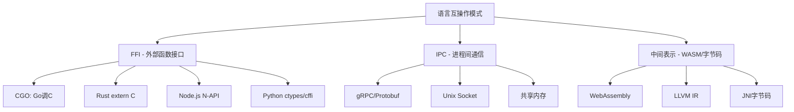
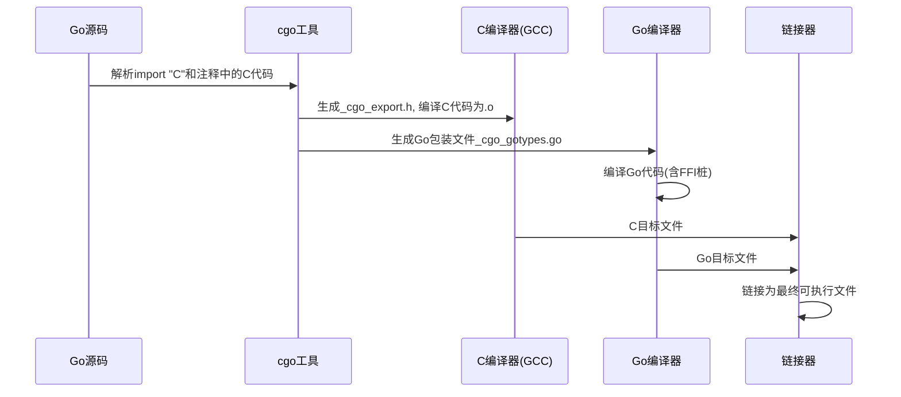
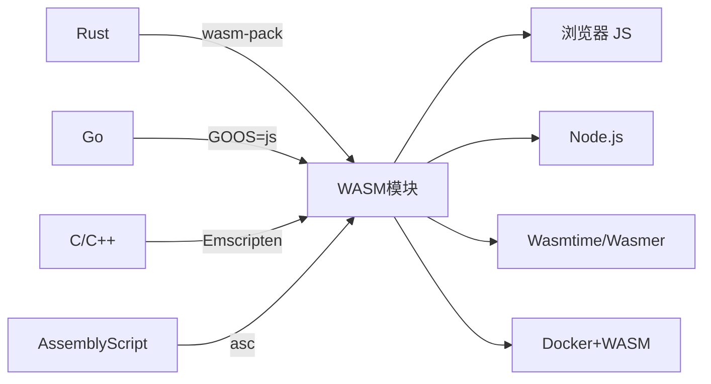
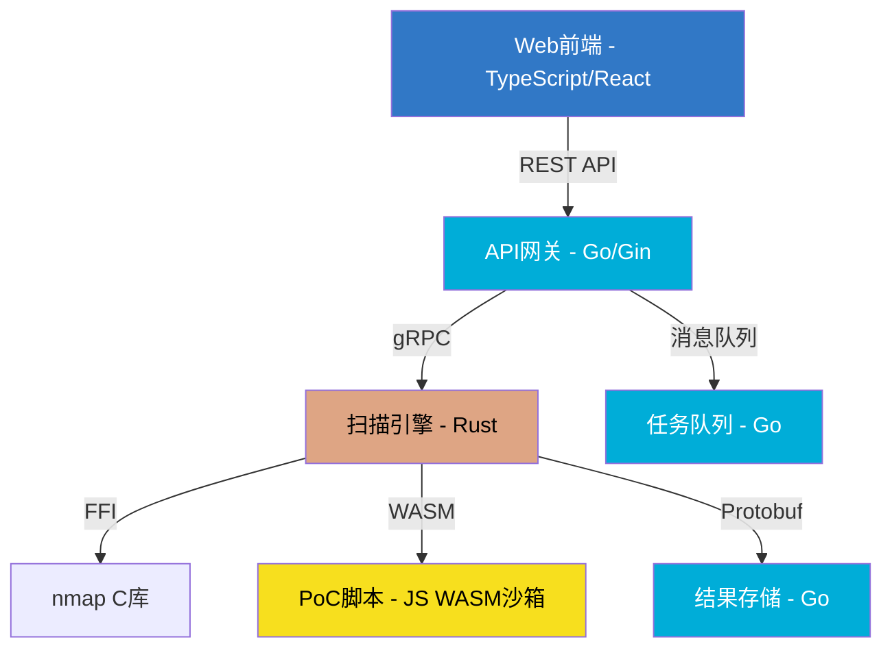

## 6. 语言间互操作

### 6.1 互操作基础理论

#### 6.1.1 为什么需要语言互操作

在安全工程实践中，没有任何一种语言能满足所有需求。JavaScript 擅长 Web 渗透和动态脚本，Go 擅长高并发网络工具，Rust 提供内存安全的系统级编程，Assembly 是 Shellcode 和底层利用的必备技能，TypeScript 在大型项目中提供类型保障。真实的安全工具链往往是多种语言协作的产物：

- **nuclei**（Go）加载 YAML 模板，模板中嵌入 JavaScript 引擎执行 PoC
- **sqlmap**（Python）通过 ctypes 调用 C 编写的加密库
- **Burp Suite 扩展**（Java）通过 WebAssembly 运行 Rust 编写的协议解析器
- **Chrome V8 漏洞利用**需要同时理解 JavaScript 语义和底层 Assembly 指令

语言互操作的核心挑战在于：不同语言有不同的内存模型、类型系统、调用约定和运行时环境。跨越这些边界需要深入理解底层机制。

#### 6.1.2 ABI 与调用约定

**ABI（Application Binary Interface）** 是互操作的基石。它定义了：

| ABI 要素 | 说明 | 示例 |
|----------|------|------|
| 参数传递 | 函数参数如何传递到被调用方 | x86-64 Linux 用 RDI, RSI, RDX, RCX, R8, R9 传前 6 个整数参数 |
| 返回值 | 函数返回值放在哪里 | x86-64 用 RAX 返回整数，XMM0 返回浮点数 |
| 栈帧布局 | 调用栈如何组织 | 调用者压栈 vs 寄存器传递 |
| 名称修饰 | 符号在目标文件中的命名规则 | C++ 的 `_Z3fooi` vs C 的 `foo` |
| 对齐要求 | 数据类型在内存中的对齐方式 | 结构体 padding 规则 |

**常见调用约定对比：**

| 约定 | 平台 | 参数传递 | 栈清理 | 特点 |
|------|------|----------|--------|------|
| cdecl | x86 Linux | 栈传递 | 调用者清理 | 支持可变参数 |
| stdcall | x86 Windows | 栈传递 | 被调用者清理 | Win32 API 标准 |
| System V AMD64 | x86-64 Linux/macOS | 寄存器+栈 | 调用者清理 | 高效，前 6 整数参数用寄存器 |
| Microsoft x64 | x86-64 Windows | 寄存器+栈 | 调用者清理 | 前 4 参数用寄存器 |
| AARCH64 | ARM64 | 寄存器 X0-X7 | 调用者清理 | 移动端/嵌入式 |

C 语言的调用约定（通常为 cdecl 或 System V AMD64）是事实上的"通用语言"。几乎所有语言的 FFI 都以 C ABI 作为桥梁。

#### 6.1.3 互操作的三种模式



| 模式 | 性能 | 安全性 | 复杂度 | 适用场景 |
|------|------|--------|--------|----------|
| FFI | 极高（零开销调用） | 低（绕过类型系统） | 中 | 高频调用、系统调用 |
| IPC | 中（有序列化开销） | 高（进程隔离） | 低 | 微服务、独立进程 |
| WASM | 高（接近原生） | 高（沙箱隔离） | 中 | 浏览器、插件系统 |

### 6.2 Go ↔ C：CGO 深度实战

#### 6.2.1 CGO 基础机制

CGO 是 Go 官方提供的 C 语言互操作方案。它不是简单的 FFI 包装，而是一个完整的构建系统集成——Go 编译器会同时调用 C 编译器（gcc/clang）来编译嵌入的 C 代码。

**CGO 的工作原理：**



**基本调用模式：**

```go
package main

/*
// 引入系统头文件
#include <stdlib.h>
#include <string.h>
#include <stdio.h>

// 在注释中直接定义C函数
// 这些代码会被cgo工具提取并编译
typedef struct {
    unsigned char data[32];
    size_t length;
} Buffer;

Buffer* buffer_create(const char* input, size_t len) {
    Buffer* buf = (Buffer*)malloc(sizeof(Buffer));
    if (!buf) return NULL;
    size_t copy_len = len > 32 ? 32 : len;
    memcpy(buf->data, input, copy_len);
    buf->length = copy_len;
    return buf;
}

void buffer_free(Buffer* buf) {
    if (buf) free(buf);
}
*/
import "C"

import (
    "fmt"
    "unsafe"
)

func main() {
    // Go字符串转C字符串：分配新内存，需要手动释放
    input := C.CString("Security Research")
    defer C.free(unsafe.Pointer(input))

    // 调用C函数
    buf := C.buffer_create(input, C.size_t(len("Security Research")))
    if buf == nil {
        fmt.Println("buffer创建失败")
        return
    }
    defer C.buffer_free(buf)

    // 将C数据拷贝回Go
    goData := C.GoBytes(unsafe.Pointer(&buf.data[0]), C.int(buf.length))
    fmt.Printf("数据: %s, 长度: %d\n", string(goData), buf.length)
}
```

#### 6.2.2 CGO 类型映射

Go 和 C 的类型系统差异很大，CGO 提供了明确的映射规则：

| C 类型 | CGO 类型 | Go 类型 | 转换函数 |
|--------|----------|---------|----------|
| `char*` | `*C.char` | `string` | `C.CString()` / `C.GoString()` |
| `void*` | `unsafe.Pointer` | `[]byte` | `C.GoBytes()` |
| `int` | `C.int` | `int32` | 直接赋值 |
| `long` | `C.long` | `int64` | 直接赋值 |
| `unsigned char` | `C.uchar` | `byte` | 直接赋值 |
| `size_t` | `C.size_t` | `uint` | 直接赋值 |
| `struct` | `C.struct_xxx` | Go struct | 字段逐个访问 |
| `enum` | `C.enum_xxx` | `int32` | 直接赋值 |
| 函数指针 | `(*C.func_t)(...)` | Go func | 通过 `//export` 暴露 |

**关键注意事项：**

- `C.CString()` 在 C 堆上分配内存，**必须**调用 `C.free()` 释放，否则内存泄漏
- `C.GoString()` 会复制一份数据到 Go 堆，原 C 内存仍需手动管理
- Go 的 GC 不能管理 C 分配的内存，反之亦然
- 传递指针给 C 时，Go 的 GC 可能在 C 函数执行期间移动 Go 内存（需使用 `runtime.Pinner` 或 `C` 分配）

#### 6.2.3 CGO 调用安全系统的 C 库

在安全工具开发中，CGO 最常见的用途是调用系统级 C 库。以下是调用 libpcap 进行网络抓包的实战示例：

```go
package main

/*
#cgo LDFLAGS: -lpcap
#include <pcap/pcap.h>
#include <stdlib.h>

// 包装回调函数，因为Go函数指针不能直接传给C
extern void goPacketHandler(u_char* user, const struct pcap_pkthdr* hdr, const u_char* data);

static void startCapture(const char* device, int count) {
    char errbuf[PCAP_ERRBUF_SIZE];
    pcap_t* handle = pcap_open_live(device, 65535, 1, 1000, errbuf);
    if (handle == NULL) {
        fprintf(stderr, "pcap_open_live failed: %s\n", errbuf);
        return;
    }
    // 设置BPF过滤器：只捕获TCP SYN包
    struct bpf_program fp;
    if (pcap_compile(handle, &fp, "tcp[tcpflags] & tcp-syn != 0", 0, PCAP_NETMASK_UNKNOWN) == -1) {
        fprintf(stderr, "pcap_compile failed\n");
        pcap_close(handle);
        return;
    }
    pcap_setfilter(handle, &fp);
    pcap_loop(handle, count, goPacketHandler, NULL);
    pcap_close(handle);
    pcap_freecode(&fp);
}
*/
import "C"

import (
    "encoding/hex"
    "fmt"
    "unsafe"
)

//export goPacketHandler
func goPacketHandler(user *C.u_char, hdr *C.struct_pcap_pkthdr, data *C.u_char) {
    length := hdr.caplen
    // 将C数据拷贝到Go切片
    goData := C.GoBytes(unsafe.Pointer(data), C.int(length))
    fmt.Printf("[抓包] 长度=%d 字节\n", length)
    fmt.Println(hex.Dump(goData[:min(64, int(length))]))
}

func min(a, b int) int {
    if a < b {
        return a
    }
    return b
}

func main() {
    fmt.Println("启动抓包（需要root权限）...")
    C.startCapture(C.CString("eth0"), 10)
}
```

编译运行：
```bash
# 需要安装libpcap-dev
# apt install libpcap-dev
go build -o pcap_demo
sudo ./pcap_demo
```

#### 6.2.4 CGO 的性能陷阱与安全风险

**性能陷阱：**

CGO 调用不是免费的。每次 Go 调用 C 函数，运行时需要：

1. 切换到系统栈（Go 使用分段栈或连续栈，C 使用系统栈）
2. 通知 GC 当前 goroutine 正在执行 C 代码（防止 GC 移动正在被 C 访问的内存）
3. 保存/恢复寄存器状态

实测数据（x86-64 Linux, Go 1.22）：

| 操作 | 耗时 |
|------|------|
| Go 函数调用 | ~1 ns |
| CGO 空调用（无参数） | ~50-80 ns |
| CGO 传递一个 int 参数 | ~60 ns |
| CGO 传递 []byte (1KB) | ~70 ns（指针传递，不拷贝） |
| CGO 传递 string（需转换） | ~200 ns（含内存分配） |

**安全风险：**

```go
// 危险：C代码中的缓冲区溢出会直接崩溃Go程序
// Go的类型安全和边界检查在C代码中完全失效
/*
#include <string.h>

void dangerous_copy(char* dst, const char* src) {
    // 没有长度检查，如果src过长将溢出dst
    strcpy(dst, src);
}
*/
import "C"

// 危险：传入C的指针可能被GC移动
func unsafeUsage() {
    data := make([]byte, 1024)
    // data的底层数组可能在C执行期间被GC移动
    // 正确做法：使用C.malloc分配或runtime.Pinner
    C.dangerous_copy((*C.char)(unsafe.Pointer(&data[0])), C.CString("test"))
}
```

**正确做法——使用 Pinner 防止 GC 移动内存（Go 1.21+）：**

```go
import "runtime"

func safeCall() {
    data := make([]byte, 1024)
    var pinner runtime.Pinner
    pinner.Pin(&data[0])         // 固定底层数组
    defer pinner.Unpin()
    // 现在可以安全地将 &data[0] 传给C
    C.some_function(unsafe.Pointer(&data[0]), C.size_t(len(data)))
}
```

### 6.3 Rust ↔ C：FFI 实战

#### 6.3.1 Rust 导出 C 兼容函数

Rust 通过 `extern "C"` 声明使用 C 调用约定，`#[no_mangle]` 防止 Rust 编译器对符号名进行名称修饰（name mangling）：

```rust
use std::ffi::{CStr, CString};
use std::os::raw::{c_char, c_int};
use std::ptr;

/// 计算字符串的 DJB2 哈希值
/// 安全性：调用者必须保证 data 指向有效的以 null 结尾的字符串
#[no_mangle]
pub extern "C" fn rust_djb2_hash(data: *const c_char) -> u64 {
    if data.is_null() {
        return 0;
    }
    let c_str = unsafe { CStr::from_ptr(data) };
    let bytes = c_str.to_bytes();

    let mut hash: u64 = 5381;
    for &byte in bytes {
        hash = hash.wrapping_mul(33).wrapping_add(byte as u64);
    }
    hash
}

/// 安全版本：通过长度指定数据，不依赖null终止符
/// 返回值通过输出参数传递，函数本身返回状态码（0=成功）
#[no_mangle]
pub extern "C" fn rust_hash_buffer(
    data: *const u8,
    len: usize,
    out_hash: *mut u64,
) -> c_int {
    // 检查所有指针
    if data.is_null() || out_hash.is_null() {
        return -1; // EINVAL
    }

    let slice = unsafe { std::slice::from_raw_parts(data, len) };

    let mut hash: u64 = 5381;
    for &byte in slice {
        hash = hash.wrapping_mul(33).wrapping_add(byte as u64);
    }

    unsafe {
        *out_hash = hash;
    }
    0 // 成功
}

/// Rust分配的内存，由Rust释放
#[no_mangle]
pub extern "C" fn rust_create_buffer(size: usize) -> *mut u8 {
    let mut buf = Vec::with_capacity(size);
    let ptr = buf.as_mut_ptr();
    std::mem::forget(buf); // 阻止Rust自动释放
    ptr
}

#[no_mangle]
pub extern "C" fn rust_free_buffer(ptr: *mut u8, size: usize) {
    if !ptr.is_null() {
        unsafe {
            // 重新构建Vec，让它在作用域结束时自动释放
            let _ = Vec::from_raw_parts(ptr, 0, size);
        }
    }
}
```

**Cargo.toml 配置：**
```toml
[lib]
crate-type = ["cdylib", "staticlib"]  # cdylib=动态库, staticlib=静态库

[dependencies]
```

**编译与使用：**
```bash
cargo build --release
# 生成: target/release/libsecurity_hash.so (Linux)
#       target/release/libsecurity_hash.dylib (macOS)
#       target/release/security_hash.dll (Windows)

# 用C程序链接
gcc -o test test.c -L./target/release -lsecurity_hash
```

#### 6.3.2 Rust 调用 C 库

Rust 调用 C 代码需要在 `build.rs` 中配置链接，在 `extern "C"` 块中声明 C 函数签名：

**build.rs：**
```rust
fn main() {
    // 告诉cargo链接libcurl
    println!("cargo:rustc-link-lib=curl");
    // 也可以用pkg-config自动查找
    // pkg_config::Config::new().probe("libcurl").unwrap();
}
```

**src/lib.rs：**
```rust
use std::ffi::{CStr, CString};
use std::os::raw::{c_char, c_long, c_void};

// 声明C库中的函数签名
extern "C" {
    fn curl_easy_init() -> *mut c_void;
    fn curl_easy_setopt(handle: *mut c_void, option: c_long, ...) -> c_long;
    fn curl_easy_perform(handle: *mut c_void) -> c_long;
    fn curl_easy_cleanup(handle: *mut c_void);
    fn curl_easy_strerror(code: c_long) -> *const c_char;
}

// curl常量
const CURLOPT_URL: c_long = 10002;
const CURLOPT_WRITEFUNCTION: c_long = 20011;
const CURLOPT_WRITEDATA: c_long = 10001;
const CURLE_OK: c_long = 0;

/// 安全封装的HTTP GET函数
pub fn http_get(url: &str) -> Result<String, String> {
    let c_url = CString::new(url).map_err(|_| "URL包含null字节")?;

    unsafe {
        let handle = curl_easy_init();
        if handle.is_null() {
            return Err("curl_easy_init失败".into());
        }

        // 设置URL
        curl_easy_setopt(handle, CURLOPT_URL, c_url.as_ptr());

        // 设置响应回调
        let mut response = Vec::<u8>::new();
        curl_easy_setopt(
            handle,
            CURLOPT_WRITEFUNCTION,
            write_callback as *const c_void,
        );
        curl_easy_setopt(
            handle,
            CURLOPT_WRITEDATA,
            &mut response as *mut Vec<u8> as *mut c_void,
        );

        // 执行请求
        let res = curl_easy_perform(handle);
        curl_easy_cleanup(handle);

        if res != CURLE_OK {
            let err = CStr::from_ptr(curl_easy_strerror(res));
            return Err(format!("curl错误: {}", err.to_string_lossy()));
        }

        String::from_utf8(response).map_err(|_| "响应不是有效UTF-8".into())
    }
}

// C回调函数：libcurl调用此函数写入数据
extern "C" fn write_callback(
    ptr: *const c_void,
    size: usize,
    nmemb: usize,
    userdata: *mut c_void,
) -> usize {
    let total = size * nmemb;
    unsafe {
        let response = &mut *(userdata as *mut Vec<u8>);
        let data = std::slice::from_raw_parts(ptr as *const u8, total);
        response.extend_from_slice(data);
    }
    total
}
```

#### 6.3.3 FFI 中的内存所有权

FFI 最危险的错误是内存所有权混乱。以下是核心规则：

| 分配方 | 释放方 | 是否正确 | 说明 |
|--------|--------|----------|------|
| Rust 的 `Box::into_raw()` | Rust 的 `Box::from_raw()` | ✅ | 谁分配谁释放 |
| C 的 `malloc()` | C 的 `free()` | ✅ | 谁分配谁释放 |
| Rust 的 `Box::into_raw()` | C 的 `free()` | ❌ | 分配器不同，可能崩溃 |
| C 的 `malloc()` | Rust 的 `drop` | ❌ | 分配器不同，可能崩溃 |
| Rust 的 `CString` | 手动 `libc::free` | ❌ | Rust可能使用不同分配器 |

**正确模式——分配器匹配：**

```rust
// 模式1：Rust分配，提供释放函数给C
#[no_mangle]
pub extern "C" fn create_string() -> *mut c_char {
    let s = CString::new("hello").unwrap();
    s.into_raw() // 所有权转移给调用者
}

#[no_mangle]
pub extern "C" fn free_string(s: *mut c_char) {
    if !s.is_null() {
        unsafe { let _ = CString::from_raw(s); } // 重新接管并释放
    }
}

// 模式2：C分配，Rust借用（不接管所有权）
#[no_mangle]
pub extern "C" fn process_data(data: *const u8, len: usize) -> i32 {
    // 只读借用，不负责释放
    let slice = unsafe { std::slice::from_raw_parts(data, len) };
    // 处理数据...
    0
}
```

### 6.4 JavaScript/Node.js ↔ 原生代码

#### 6.4.1 N-API（Node-API）

N-API 是 Node.js 官方的原生插件 API，提供 ABI 稳定性——编译一次，跨 Node.js 版本运行。它是 C 级别的 API，也被包装为 `node-addon-api`（C++ 包装）和 `napi-rs`（Rust 包装）。

**C++ 实现（node-addon-api）：**

```cpp
// addon.cpp
#include <napi.h>
#include <openssl/sha256.h>
#include <cstring>

// 使用OpenSSL计算SHA-256哈希
Napi::Value Sha256Hash(const Napi::CallbackInfo& info) {
    Napi::Env env = info.Env();

    if (info.Length() < 1 || !info[0].IsBuffer()) {
        Napi::TypeError::New(env, "参数必须是Buffer").ThrowAsJavaScriptException();
        return env.Null();
    }

    Napi::Buffer<uint8_t> buf = info[0].As<Napi::Buffer<uint8_t>>();
    unsigned char hash[SHA256_DIGEST_LENGTH];

    SHA256(buf.Data(), buf.Length(), hash);

    // 返回为Buffer
    return Napi::Buffer<uint8_t>::Copy(env, hash, SHA256_DIGEST_LENGTH);
}

// 暴露给JavaScript的函数
Napi::Object Init(Napi::Env env, Napi::Object exports) {
    exports.Set("sha256", Napi::Function::New(env, Sha256Hash));
    return exports;
}

NODE_API_MODULE(crypto_addon, Init)
```

**binding.gyp（构建配置）：**
```json
{
    "targets": [{
        "target_name": "crypto_addon",
        "sources": ["addon.cpp"],
        "include_dirs": [],
        "libraries": ["-lssl", "-lcrypto"],
        "cflags!": ["-fno-exceptions"],
        "cflags_cc!": ["-fno-exceptions"]
    }]
}
```

**JavaScript 调用：**
```javascript
const crypto_addon = require('./build/Release/crypto_addon');

const data = Buffer.from('安全研究测试数据');
const hash = crypto_addon.sha256(data);
console.log('SHA-256:', hash.toString('hex'));
// 对比Node.js内置crypto
const crypto = require('crypto');
console.log('验证:', crypto.createHash('sha256').update(data).digest('hex') === hash.toString('hex'));
```

#### 6.4.2 napi-rs：Rust 编写 Node.js 原生模块

napi-rs 让你用 Rust 编写 Node.js 原生模块，兼具 Rust 的内存安全和 Node.js 的易用性：

```rust
// src/lib.rs
use napi_derive::napi;
use napi::bindgen_prelude::*;

/// 用Rust实现的高性能端口扫描
#[napi]
pub async fn tcp_scan(host: String, ports: Vec<u32>, timeout_ms: u32) -> Vec<u32> {
    let mut open_ports = Vec::new();

    for &port in &ports {
        let addr = format!("{}:{}", host, port);
        // 使用tokio异步连接
        match tokio::time::timeout(
            std::time::Duration::from_millis(timeout_ms as u64),
            tokio::net::TcpStream::connect(&addr),
        ).await {
            Ok(Ok(_)) => open_ports.push(port),
            _ => {} // 超时或连接失败
        }
    }

    open_ports
}

/// 计算文件的多种哈希值（并行）
#[napi]
pub fn multi_hash(data: &[u8]) -> HashMap<String, String> {
    use sha2::{Sha256, Sha512, Digest};
    use md5::Md5;

    let md5_result = {
        let mut hasher = Md5::new();
        hasher.update(data);
        format!("{:x}", hasher.finalize())
    };

    let sha256_result = {
        let mut hasher = Sha256::new();
        hasher.update(data);
        format!("{:x}", hasher.finalize())
    };

    let sha512_result = {
        let mut hasher = Sha512::new();
        hasher.update(data);
        format!("{:x}", hasher.finalize())
    };

    let mut result = HashMap::new();
    result.insert("md5".into(), md5_result);
    result.insert("sha256".into(), sha256_result);
    result.insert("sha512".into(), sha512_result);
    result
}
```

**JavaScript 调用：**
```javascript
const { tcpScan, multiHash } = require('./index.node');

// 异步端口扫描
const openPorts = await tcpScan('127.0.0.1', [22, 80, 443, 8080, 3306], 1000);
console.log('开放端口:', openPorts);

// 多哈希计算
const data = Buffer.from('test data');
const hashes = multiHash(data);
console.log('MD5:', hashes.md5);
console.log('SHA-256:', hashes.sha256);
```

#### 6.4.3 Node.js FFI（Foreign Function Node）

对于快速原型或不想编写绑定代码的场景，可以使用 `ffi-napi` 直接从 JavaScript 调用共享库：

```javascript
const ffi = require('ffi-napi');
const ref = require('ref-napi');

// 直接加载libcurl并声明函数签名
const libcurl = ffi.Library('libcurl', {
    'curl_easy_init': ['pointer', []],
    'curl_easy_setopt': ['int', ['pointer', 'int', 'string']],
    'curl_easy_perform': ['int', ['pointer']],
    'curl_easy_cleanup': ['void', ['pointer']],
    'curl_easy_strerror': ['string', ['int']],
});

const CURLOPT_URL = 10002;
const CURLE_OK = 0;

const handle = libcurl.curl_easy_init();
libcurl.curl_easy_setopt(handle, CURLOPT_URL, 'https://httpbin.org/get');
const res = libcurl.curl_easy_perform(handle);

if (res !== CURLE_OK) {
    console.error('错误:', libcurl.curl_easy_strerror(res));
} else {
    console.log('请求成功');
}
libcurl.curl_easy_cleanup(handle);
```

> ⚠️ **安全警告**：`ffi-napi` 存在已知的安全风险——它允许 JavaScript 代码调用任意内存地址，绕过所有安全边界。在生产环境中应使用 N-API 或 napi-rs 代替。仅在受控环境中用于快速原型开发。

### 6.5 WebAssembly（WASM）互操作

#### 6.5.1 WASM 作为跨语言桥梁

WebAssembly 是语言互操作的第三种模式——将代码编译为中间字节码，在沙箱中执行。它比 FFI 安全（有内存边界），比 IPC 高效（无序列化开销），是浏览器环境中唯一的原生代码执行方式。



| 编译目标 | 工具链 | 包大小 | 启动速度 | 生态成熟度 |
|----------|--------|--------|----------|------------|
| Rust → WASM | wasm-pack / wasm-bindgen | 小（KB级） | 快 | ★★★★★ |
| Go → WASM | GOOS=js GOARCH=wasm | 大（~2MB运行时） | 慢 | ★★★☆☆ |
| C/C++ → WASM | Emscripten | 中 | 快 | ★★★★☆ |
| AssemblyScript → WASM | asc | 极小 | 极快 | ★★★☆☆ |

#### 6.5.2 Rust 编译为 WebAssembly

Rust 是编译 WASM 的首选语言——工具链成熟，输出体积小，性能接近原生。

**项目设置：**
```bash
cargo new --lib wasm-security && cd wasm-security
rustup target add wasm32-unknown-unknown
cargo install wasm-pack
```

**Cargo.toml：**
```toml
[lib]
crate-type = ["cdylib"]

[dependencies]
wasm-bindgen = "0.2"
serde = { version = "1", features = ["derive"] }
serde-wasm-bindgen = "0.6"
js-sys = "0.3"
```

**src/lib.rs：**
```rust
use wasm_bindgen::prelude::*;
use serde::Serialize;

#[wasm_bindgen]
pub struct PortScanner {
    host: String,
}

#[wasm_bindgen]
impl PortScanner {
    #[wasm_bindgen(constructor)]
    pub fn new(host: &str) -> PortScanner {
        PortScanner { host: host.to_string() }
    }

    /// 在浏览器中通过fetch探测端口（利用CORS错误检测）
    pub async fn scan_port(&self, port: u16) -> bool {
        let url = format!("http://{}:{}", self.host, port);
        let opts = web_sys::RequestInit::new();
        opts.set_method("HEAD");
        opts.set_mode(web_sys::RequestMode::NoCors);

        let request = web_sys::Request::new_with_str_and_init(&url, &opts);
        match request {
            Ok(req) => {
                let global = js_sys::global();
                let resp = wasm_bindgen_futures::JsFuture::from(
                    global.unchecked_into::<web_sys::WorkerGlobalScope>().fetch_with_request(&req)
                ).await;
                resp.is_ok()
            }
            Err(_) => false,
        }
    }
}

/// XOR编码/解码（WASM中执行，比JS快）
#[wasm_bindgen]
pub fn xor_encode(data: &[u8], key: &[u8]) -> Vec<u8> {
    data.iter()
        .enumerate()
        .map(|(i, &b)| b ^ key[i % key.len()])
        .collect()
}

/// Shellcode编码器——在WASM沙箱中执行，绕过静态分析
#[wasm_bindgen]
pub fn encode_shellcode(data: &[u8], key: u8) -> Vec<u8> {
    let mut encoded: Vec<u8> = data.iter().map(|&b| b.wrapping_add(key)).collect();
    // 添加解码桩头
    let mut stub: Vec<u8> = vec![
        0xEB, 0x05,             // jmp short +5 (跳过key)
        key, 0x00, 0x00, 0x00,  // key作为4字节立即数
        // 解码循环（x86-64机器码）
        0x48, 0x31, 0xC9,       // xor rcx, rcx
    ];
    stub.append(&mut encoded);
    stub
}
```

**JavaScript 调用：**
```html
<script type="module">
import init, { PortScanner, xorEncode } from './pkg/wasm_security.js';

async function main() {
    await init();

    // XOR编解码
    const data = new TextEncoder().encode('Sensitive payload data');
    const key = new Uint8Array([0x41, 0x42, 0x43]);
    const encoded = xorEncode(data, key);
    console.log('编码后:', encoded);
    const decoded = xorEncode(encoded, key);
    console.log('解码后:', new TextDecoder().decode(decoded));

    // 端口扫描（仅限同源或CORS允许的目标）
    const scanner = new PortScanner('127.0.0.1');
    const isOpen = await scanner.scan_port(80);
    console.log(`端口 80: ${isOpen ? '开放' : '关闭'}`);
}
main();
</script>
```

#### 6.5.3 Go 编译为 WebAssembly

Go 1.21+ 支持编译为 WASM，但附带完整的 Go 运行时（~2MB），适合对包大小不敏感的场景：

```go
//go:build js && wasm

package main

import (
    "crypto/sha256"
    "encoding/hex"
    "syscall/js"
)

func sha256Hash(this js.Value, args []js.Value) interface{} {
    if len(args) == 0 {
        return js.ValueOf(nil)
    }

    // 从JS Uint8Array读取数据
    data := make([]byte, args[0].Length())
    js.CopyBytesToGo(data, args[0])

    hash := sha256.Sum256(data)
    result := hex.EncodeToString(hash[:])

    return js.ValueOf(result)
}

func main() {
    // 将Go函数暴露给JavaScript
    js.Global().Set("goSHA256", js.FuncOf(sha256Hash))

    // 阻止Go程序退出（WASM环境需要）
    select {}
}
```

**编译与使用：**
```bash
GOOS=js GOARCH=wasm go build -o main.wasm main.go
# 复制wasm_exec.js（Go自带的胶水代码）
cp "$(go env GOROOT)/misc/wasm/wasm_exec.js" .

# HTML中加载
```

```html
<script src="wasm_exec.js"></script>
<script>
const go = new Go();
WebAssembly.instantiateStreaming(fetch("main.wasm"), go.importObject)
    .then(result => {
        go.run(result.instance);
        // 使用Go暴露的函数
        const data = new Uint8Array([1, 2, 3, 4]);
        console.log('SHA-256:', goSHA256(data));
    });
</script>
```

**Go WASM 的内存优化（使用 TinyGo 减小体积）：**
```bash
# TinyGo 生成的WASM体积约为标准Go的1/10
tinygo build -o main.wasm -target wasm --no-debug main.go
# 标准Go: ~2MB → TinyGo: ~200KB
```

### 6.6 内联汇编

#### 6.6.1 Rust 内联汇编

Rust 的 `asm!` 宏（稳定于 Rust 1.59+）允许在 Rust 函数中直接嵌入汇编指令。在安全研究中，这用于精确控制 CPU 行为、执行特权指令或优化性能关键路径：

```rust
/// 使用CPUID指令获取CPU信息
/// 安全研究中用于检测虚拟化环境
pub fn get_cpu_vendor() -> [u8; 12] {
    let mut ebx: u32;
    let mut edx: u32;
    let mut ecx: u32;

    unsafe {
        std::arch::asm!(
            "push rbx",          // 保存rbx（被cpuid破坏）
            "xor eax, eax",     // EAX=0: 获取厂商ID
            "cpuid",
            "mov {ebx:e}, ebx",
            "mov {edx:e}, edx",
            "mov {ecx:e}, ecx",
            "pop rbx",           // 恢复rbx
            ebx = out(reg) ebx,
            edx = out(reg) edx,
            ecx = out(reg) ecx,
            out("eax") _,        // eax被cpuid覆盖，不需要保存
        );
    }

    let mut vendor = [0u8; 12];
    vendor[0..4].copy_from_slice(&ebx.to_le_bytes());
    vendor[4..8].copy_from_slice(&edx.to_le_bytes());
    vendor[8..12].copy_from_slice(&ecx.to_le_bytes());
    vendor
}

/// 读取MSR寄存器（需要ring 0权限）
/// 用于检测hypervisor特征
pub fn read_msr(msr: u32) -> u64 {
    let lo: u32;
    let hi: u32;
    unsafe {
        std::arch::asm!(
            "rdmsr",
            in("ecx") msr,
            out("eax") lo,
            out("edx") hi,
        );
    }
    ((hi as u64) << 32) | (lo as u64)
}

/// SYSCALL调用（Linux x86-64）
/// 直接发起系统调用，绕过libc
pub unsafe fn raw_syscall(number: u64, arg1: u64, arg2: u64, arg3: u64) -> i64 {
    let result: i64;
    std::arch::asm!(
        "syscall",
        in("rax") number,
        in("rdi") arg1,
        in("rsi") arg2,
        in("rdx") arg3,
        out("rax") result,
        out("rcx") _,
        out("r11") _,
        // syscall会破坏rcx和r11
    );
    result
}
```

**反调试检测——使用INT3陷阱：**
```rust
/// 检测是否有调试器附加
/// 原理：设置自定义SIGTRAP处理器，执行INT3
/// 无调试器：SIGTRAP触发自定义处理器，标志正常
/// 有调试器：调试器捕获INT3，程序行为异常
pub fn detect_debugger() -> bool {
    use std::sync::atomic::{AtomicBool, Ordering};
    static TRAP_RECEIVED: AtomicBool = AtomicBool::new(false);

    unsafe extern "C" fn handler(_: i32) {
        TRAP_RECEIVED.store(true, Ordering::SeqCst);
    }

    // 安装SIGTRAP处理器
    unsafe {
        libc::signal(libc::SIGTRAP, handler as libc::sighandler_t);
    }

    // 执行INT3
    unsafe {
        std::arch::asm!("int3");
    }

    TRAP_RECEIVED.load(Ordering::SeqCst)
}
```

#### 6.6.2 Go 内联汇编（通过 CGO）

Go 本身不直接支持内联汇编（Go 汇编只用于标准库运行时），但可以通过 CGO 间接实现：

```go
package main

/*
#include <stdint.h>

// 使用GCC内联汇编实现CPUID
static inline void cpuid(uint32_t leaf, uint32_t subleaf,
                         uint32_t* eax, uint32_t* ebx,
                         uint32_t* ecx, uint32_t* edx) {
    __asm__ __volatile__(
        "cpuid"
        : "=a"(*eax), "=b"(*ebx), "=c"(*ecx), "=d"(*edx)
        : "a"(leaf), "c"(subleaf)
    );
}

// RDTSC读取时间戳计数器
static inline uint64_t rdtsc(void) {
    uint32_t lo, hi;
    __asm__ __volatile__(
        "rdtsc"
        : "=a"(lo), "=d"(hi)
    );
    return ((uint64_t)hi << 32) | lo;
}
*/
import "C"
import "fmt"

func main() {
    var eax, ebx, ecx, edx C.uint32_t
    C.cpuid(0, 0, &eax, &ebx, &ecx, &edx)

    vendor := string([]byte{
        byte(ebx), byte(ebx >> 8), byte(ebx >> 16), byte(ebx >> 24),
        byte(edx), byte(edx >> 8), byte(edx >> 16), byte(edx >> 24),
        byte(ecx), byte(ecx >> 8), byte(ecx >> 16), byte(ecx >> 24),
    })
    fmt.Printf("CPU厂商: %s\n", vendor)

    ts1 := C.rdtsc()
    // 一些操作...
    ts2 := C.rdtsc()
    fmt.Printf("CPU周期数: %d\n", ts2-ts1)
}
```

### 6.7 跨语言序列化协议

#### 6.7.1 Protocol Buffers（Protobuf）

当互操作需要传递复杂数据结构时，Protobuf 是最成熟的选择：

```protobuf
// security_scan.proto
syntax = "proto3";
package security;

message ScanTarget {
    string host = 1;
    repeated uint32 ports = 2;
    uint32 timeout_ms = 3;
}

message ScanResult {
    string host = 1;
    uint32 port = 2;
    bool is_open = 3;
    string service_name = 4;
    string banner = 5;
}

message ScanRequest {
    repeated ScanTarget targets = 1;
    enum ScanType {
        TCP_CONNECT = 0;
        TCP_SYN = 1;
        UDP = 2;
    }
    ScanType scan_type = 2;
}

service ScannerService {
    rpc Scan(ScanRequest) returns (stream ScanResult);
}
```

**Go 实现（gRPC 服务端）：**
```go
type scannerServer struct {
    pb.UnimplementedScannerServiceServer
}

func (s *scannerServer) Scan(req *pb.ScanRequest, stream pb.ScannerService_ScanServer) error {
    for _, target := range req.Targets {
        for _, port := range target.Ports {
            isOpen := tcpCheck(target.Host, port, target.TimeoutMs)
            result := &pb.ScanResult{
                Host:   target.Host,
                Port:   port,
                IsOpen: isOpen,
            }
            if err := stream.Send(result); err != nil {
                return err
            }
        }
    }
    return nil
}
```

**Rust 实现（gRPC 客户端）：**
```rust
use tonic::Request;

async fn run_scan(client: &mut ScannerServiceClient<Channel>) -> Result<(), Box<dyn std::error::Error>> {
    let request = Request::new(ScanRequest {
        targets: vec![ScanTarget {
            host: "192.168.1.1".into(),
            ports: vec![22, 80, 443, 8080],
            timeout_ms: 1000,
        }],
        scan_type: ScanType::TcpConnect.into(),
    });

    let mut stream = client.scan(request).await?.into_inner();
    while let Some(result) = stream.message().await? {
        if result.is_open {
            println!("{}:{} - OPEN ({})", result.host, result.port, result.service_name);
        }
    }
    Ok(())
}
```

#### 6.7.2 序列化方案对比

| 方案 | 体积 | 速度 | 跨语言 | 安全性 | 适用场景 |
|------|------|------|--------|--------|----------|
| Protobuf | 小 | 快 | 好 | 中 | gRPC、配置文件 |
| MessagePack | 小 | 极快 | 好 | 低 | 高频消息传递 |
| JSON | 大 | 慢 | 极好 | 低 | API、调试 |
| FlatBuffers | 极小 | 极快 | 好 | 低 | 游戏、嵌入式 |
| Cap'n Proto | 极小 | 极快 | 好 | 低 | RPC、日志 |
| CBOR | 小 | 快 | 好 | 低 | IoT、嵌入式 |
| serde (Rust内部) | 极小 | 极快 | 无 | 高 | Rust内部序列化 |

### 6.8 安全领域的互操作实战模式

#### 6.8.1 模式一：安全扫描器多语言架构

真实的安全扫描器通常采用多语言架构，每种语言发挥各自优势：



**Go 管理层 → Rust 扫描引擎（通过 FFI）：**

```go
/*
#cgo LDFLAGS: -L./target/release -lscanner_engine -lpthread -ldl -lm
#include <stdint.h>
#include <stdlib.h>

typedef struct {
    char* host;
    uint32_t port;
    uint32_t timeout_ms;
    uint8_t scan_type;  // 0=TCP, 1=UDP
} ScanTarget;

typedef struct {
    char* host;
    uint32_t port;
    uint8_t state;  // 0=closed, 1=open, 2=filtered
    char* banner;
} ScanResult;

typedef void (*ResultCallback)(ScanResult* result, void* user_data);

extern int scanner_run(ScanTarget* targets, int count, ResultCallback callback, void* user_data);
extern void scanner_free_result(ScanResult* result);
*/
import "C"

//export resultCallback
func resultCallback(result *C.ScanResult, userData unsafe.Pointer) {
    host := C.GoString(result.host)
    port := uint32(result.port)
    state := uint8(result.state)
    banner := C.GoString(result.banner)

    fmt.Printf("[%s] %s:%d - state=%d banner=%s\n",
        map[uint8]string{0: "CLOSED", 1: "OPEN", 2: "FILTERED"}[state],
        host, port, state, banner)
}
```

#### 6.8.2 模式二：浏览器中的 WASM 安全工具

将安全工具编译为 WASM，在浏览器中运行：

```rust
// 编译为WASM在浏览器中运行的端口扫描器
use wasm_bindgen::prelude::*;
use js_sys::Promise;

#[wasm_bindgen]
pub struct BrowserScanner {
    targets: Vec<(String, u16)>,
}

#[wasm_bindgen]
impl BrowserScanner {
    #[wasm_bindgen(constructor)]
    pub fn new() -> BrowserScanner {
        BrowserScanner { targets: Vec::new() }
    }

    pub fn add_target(&mut self, host: &str, port: u16) {
        self.targets.push((host.to_string(), port));
    }

    /// 使用Image对象探测端口（绕过fetch限制）
    /// 原理：加载http://host:port/作为图片，超时=端口关闭，立即错误=端口开放
    #[wasm_bindgen]
    pub fn scan(&self) -> Promise {
        let targets = self.targets.clone();
        wasm_bindgen_futures::future_to_promise(async move {
            let mut results = Vec::new();
            for (host, port) in targets {
                let url = format!("http://{}:{}/favicon.ico", host, port);
                let is_open = probe_port(&url).await;
                results.push(format!("{}:{} = {}", host, port, is_open));
            }
            Ok(JsValue::from_str(&results.join("\n")))
        })
    }
}

async fn probe_port(url: &str) -> bool {
    let img = web_sys::HtmlImageElement::new().unwrap();
    img.set_src(url);
    // 使用Promise.race检测连接结果
    // 简化版本，实际需要更复杂的超时逻辑
    true
}
```

#### 6.8.3 模式三：Assembly 与高级语言的协作

在漏洞利用开发中，经常需要将 Assembly Shellcode 与高级语言结合：

```rust
/// 将Shellcode注入到Rust生成的加载器中
/// Shellcode由Assembly编写，Rust负责编码、加密和加载
pub fn build_loader(shellcode: &[u8], encryption_key: u8) -> Vec<u8> {
    // 1. 加密shellcode
    let encrypted: Vec<u8> = shellcode.iter().map(|&b| b ^ encryption_key).collect();

    // 2. 构建自解密加载器（x86-64机器码）
    let mut loader = Vec::new();

    // 3. 写入解密循环的机器码
    loader.extend_from_slice(&[
        0x48, 0x89, 0xE5,                   // mov rbp, rsp
        0x48, 0x8D, 0x35, 0x1A, 0x00, 0x00, 0x00, // lea rsi, [rip + offset_to_data]
        0x48, 0x89, 0xF7,                   // mov rdi, rsi
        0xB9, 0x00, 0x00, 0x00, 0x00,       // mov ecx, encrypted_len (patched)
        0xB0, encryption_key,               // mov al, key
        // xor_loop:
        0x30, 0x06,                         // xor [rsi], al
        0x48, 0xFF, 0xC6,                   // inc rsi
        0xFF, 0xC9,                         // dec ecx
        0x75, 0xF8,                         // jnz xor_loop
        0xFF, 0xE7,                         // jmp rdi (执行解密后的shellcode)
    ]);

    // 填充加密的shellcode数据
    loader.extend_from_slice(&encrypted);

    // 修补长度字段
    let len = encrypted.len() as u32;
    let len_bytes = len.to_le_bytes();
    let len_offset = 14; // mov ecx, imm32 的立即数偏移
    loader[len_offset..len_offset+4].copy_from_slice(&len_bytes);

    loader
}
```

### 6.9 互操作中的安全风险与防御

#### 6.9.1 跨语言内存安全风险

当代码跨越语言边界时，每种语言的安全保证都可能失效：

| 风险类型 | 描述 | 示例 | 防御措施 |
|----------|------|------|----------|
| 缓冲区溢出 | C代码写越界 | CGO中的strcpy | 使用strncpy/snprintf |
| UAF | C释放后Go仍访问 | CGO回调中访问已释放内存 | 明确所有权文档 |
| 类型混淆 | FFI类型不匹配 | 将signed传给unsigned参数 | 使用标准类型映射 |
| 竞态条件 | GC移动内存+并发C访问 | goroutine并发调用C | Pinner/手动同步 |
| 资源泄漏 | C分配的内存在Go中未释放 | CString未free | defer模式 |
| 整数溢出 | Go int→C int32截断 | 大端序平台上的宽度差异 | 显式类型检查 |

#### 6.9.2 FFI 安全审计清单

在审计包含 FFI 互操作的代码时，重点关注以下检查项：

```text
□ 内存所有权
  - 每个malloc/new是否有对应的free/delete？
  - 跨语言传递的指针，谁负责释放？
  - 是否存在double-free风险？

□ 边界检查
  - 传给C的数组是否有长度参数？
  - C返回的数据长度是否被验证？
  - 是否存在off-by-one错误？

□ 空指针
  - FFI函数是否检查了NULL参数？
  - 返回的指针在使用前是否检查NULL？

□ 线程安全
  - C库函数是否线程安全？
  - 是否存在共享状态的并发访问？

□ 错误处理
  - C函数的错误码是否被正确检查？
  - 错误路径上是否有资源泄漏？

□ 字符串编码
  - UTF-8↔C string转换是否处理了嵌入的null字节？
  - C返回的字符串是否以null结尾？
```

#### 6.9.3 用 Rust 的 `unsafe` 审计 FFI

Rust 的 `unsafe` 关键字标记了所有绕过借用检查器的代码，FFI 调用天然需要 `unsafe`。审计 Rust FFI 代码时，关注 `unsafe` 块的数量和范围：

```rust
// 危险：unsafe范围过大，难以审计
pub unsafe fn bad_ffi(data: *const u8, len: usize) -> u64 {
    let slice = std::slice::from_raw_parts(data, len);
    let mut hash: u64 = 0;
    for &b in slice {
        hash = hash.wrapping_mul(31).wrapping_add(b as u64);
        // 整个函数体都在unsafe中，包括纯Rust逻辑
    }
    hash
}

// 安全：unsafe范围最小化，安全逻辑外提
pub fn good_ffi(data: *const u8, len: usize) -> u64 {
    // 安全边界检查
    if data.is_null() {
        return 0;
    }
    // unsafe仅限于指针解引用
    let slice = unsafe { std::slice::from_raw_parts(data, len) };
    // 纯安全Rust代码
    compute_hash(slice)
}

fn compute_hash(data: &[u8]) -> u64 {
    let mut hash: u64 = 0;
    for &b in data {
        hash = hash.wrapping_mul(31).wrapping_add(b as u64);
    }
    hash
}
```

### 6.10 性能基准对比

不同互操作方式的性能差异（x86-64 Linux, 单次函数调用，取100万次平均）：

| 互操作方式 | 延迟 | 吞吐量 | 适用场景 |
|------------|------|--------|----------|
| Rust → Rust（正常调用） | ~0.5 ns | 20亿次/秒 | 同语言内部 |
| Go → Go（正常调用） | ~1 ns | 10亿次/秒 | 同语言内部 |
| Go → C（CGO） | ~50-80 ns | 1500万次/秒 | 需要C库功能 |
| Rust → C（FFI） | ~2-5 ns | 2-5亿次/秒 | 需要C库功能 |
| Node.js → C++（N-API） | ~100-200 ns | 500万次/秒 | Node原生模块 |
| Node.js → Rust（napi-rs） | ~150-300 ns | 300万次/秒 | Node原生模块 |
| JS → WASM（Rust） | ~200-500 ns | 200万次/秒 | 浏览器高性能计算 |
| JS → WASM（Go） | ~500-2000 ns | 50万次/秒 | 浏览器Go逻辑 |
| gRPC（本地） | ~50-100 μs | 1万次/秒 | 微服务通信 |
| Unix Socket | ~5-10 μs | 10万次/秒 | 进程间通信 |

**结论：** FFI 适合高频小函数调用，gRPC/IPC 适合低频大粒度通信，WASM 适合浏览器或需要沙箱隔离的场景。选择互操作方式时，延迟不是唯一考量——安全性、可维护性和部署复杂度同样重要。

### 6.11 常见错误与调试

#### 6.11.1 CGO 常见错误

| 错误 | 原因 | 解决方案 |
|------|------|----------|
| `cgo argument has Go pointer to Go pointer` | Go指针嵌套传递给C | 拷贝数据到C内存或使用unsafe.Pointer |
| `signal: segmentation fault` | C代码访问无效指针 | 添加NULL检查，使用valgrind调试 |
| `runtime: goroutine stack exceeds limit` | CGO调用的C代码栈溢出 | 增大线程栈或使用`runtime.LockOSThread()` |
| `undefined reference to xxx` | 缺少链接库 | 添加`#cgo LDFLAGS: -lxxx` |
| 数据竞争 | 多goroutine并发调用非线程安全的C库 | 使用mutex或单线程调用 |

#### 6.11.2 FFI 调试工具

```bash
# CGO调试：启用CGO跟踪
CGO_CFLAGS="-v" go build .

# Rust FFI调试：查看符号表
nm -D libsecurity.so | grep rust_

# Valgrind检测FFI内存错误
valgrind --leak-check=full --show-leak-kinds=all ./program

# AddressSanitizer编译（C/C++侧）
gcc -fsanitize=address -o test test.c -lsecurity

# Rust的Miri检测未定义行为（仅限纯Rust，不适用于FFI）
cargo +nightly miri test

# WASM调试：wasm-tools检查
wasm-tools validate main.wasm
wasm2wat main.wasm -o main.wat  # 反编译为可读格式
```
