## 核心技巧总结

本节对五种语言在安全领域的核心技巧进行系统性回顾与横向对比，帮助读者建立跨语言的安全思维框架，将零散的技术点串联为可复用的知识体系。

### 技巧全景图

五种语言的安全技巧覆盖了从应用层到硬件层的完整攻击面。以下思维导图展示了每种语言的核心能力域及其典型应用场景：

```mermaid
graph TB
    ROOT["安全研究核心技巧"] --> JS["JavaScript"]
    ROOT --> TS["TypeScript"]
    ROOT --> GO["Go"]
    ROOT --> RS["Rust"]
    ROOT --> ASM["Assembly"]

    JS --> JS1["XSS Payload构造"]
    JS --> JS2["命令注入"]
    JS --> JS3["原型链污染"]
    JS --> JS4["SSRF利用"]

    TS --> TS1["类型安全API客户端"]
    TS --> TS2["运行时输入验证"]
    TS --> TS3["编译时安全约束"]

    GO --> GO1["并发端口扫描"]
    GO --> GO2["HTTP走私检测"]
    GO --> GO3["安全密码哈希"]
    GO --> GO4["CGO互操作"]

    RS --> RS1["内存安全缓冲区"]
    RS --> RS2["并发安全网络服务"]
    RS --> RS3["unsafe审计"]
    RS --> RS4["FFI调用"]

    ASM --> ASM1["Shellcode编写"]
    ASM --> ASM2["反调试技术"]
    ASM --> ASM3["pwntools自动化"]

    style JS fill:#f7df1e,color:#000
    style TS fill:#3178c6,color:#fff
    style Go fill:#00add8,color:#fff
    style RS fill:#dea584,color:#000
    style ASM fill:#6c6c6c,color:#fff
```

### 五种语言核心技巧对照表

下表从攻击类型、防御机制、工具链三个维度横向对比各语言的核心技巧：

| 维度 | JavaScript | TypeScript | Go | Rust | Assembly |
|------|-----------|-----------|-----|------|----------|
| **攻击技巧** | XSS构造（反射/DOM/Stored）、命令注入、原型链污染、SSRF | —（偏向防御） | —（偏向工具开发） | —（偏向安全编码） | Shellcode编写、反调试绕过、ROP链构造 |
| **防御技巧** | CSP配置、输入过滤（DOMPurify）、安全编码 | 类型约束、Zod运行时验证、编译时检查 | 错误处理规范、并发安全模式、密码哈希 | 所有权系统防溢出、unsafe最小化、并发安全 | 编译选项加固（PIE/NX/RELRO/Stack Canary） |
| **工具链** | Burp扩展、浏览器插件、Node.js脚本 | NestJS安全框架、类型安全ORM | nuclei、subfinder、httpx、naabu | RustScan、feroxbuster、cargo-audit | pwntools、GDB、WinDbg、Radare2 |
| **典型产出** | PoC脚本、WAF绕过Payload、XSS检测器 | 安全API网关、JWT认证系统 | 高性能扫描器、子域名枚举器、HTTP代理 | 内存安全代理、系统级安全组件 | Exploit代码、Loader、反调试模块 |

### 各语言技巧要点回顾

#### JavaScript：攻防两端的核心语言

JavaScript在安全领域扮演双重角色——既是攻击者最常用的Payload载体，也是防御者必须保护的目标语言。

**攻击技巧四件套：**

- **XSS Payload构造**：从基础的``到绕过WAF的模板字符串`` alert`XSS` ``、HTML实体编码`&#97;lert`、事件处理器变体`ontoggle`，再到利用JSONP端点的CSP绕过。关键认知是XSS没有"一劳永逸"的过滤方案，每种防御都需要针对具体绕过技术做适配。
- **命令注入**：Node.js中`exec()`直接拼接用户输入是经典漏洞。`execFile`使用参数数组避免shell解释，是标准修复方案。攻击者通过`;`、`&&`、`|`等shell操作符串联恶意命令。
- **原型链污染**：JavaScript特有的漏洞类型。通过`__proto__`、`constructor`、`prototype`键污染`Object.prototype`，影响所有新创建的对象。防御手段包括过滤危险键名、使用`Object.create(null)`创建无原型对象、冻结`Object.prototype`。
- **SSRF利用**：服务端请求伪造中，JavaScript的`fetch`、`http.request`等API如果接受用户控制的URL参数，攻击者可访问内网资源、读取云元数据（如AWS的`169.254.169.254`）。

**防御核心原则：** 永远不信任客户端输入。前端校验是用户体验，后端校验才是安全底线。使用DOMPurify处理HTML输出，使用Zod等库做运行时验证。

#### TypeScript：类型系统驱动的安全

TypeScript的安全价值不在于它能做什么JavaScript不能做的事，而在于它在**编译阶段**就能拦截一整类错误。

**两大核心技巧：**

- **类型安全的API客户端**：通过泛型约束`<TReq, TRes>`，确保请求体和响应体的类型在编译时就被检查。配合URL白名单校验，防止SSRF。类型断言`as T`是安全的"逃生口"，但也可能引入漏洞——`const user: User = req.body`这行代码在TypeScript中合法，但运行时`req.body`可能包含任意数据。
- **运行时输入验证**：TypeScript的类型在编译后被擦除，运行时不存在。因此必须配合Zod、io-ts等库做运行时验证，将`safeParse()`的返回值作为真正的数据源，而非盲目类型断言。

**关键认知：** 类型安全 ≠ 运行时安全。TypeScript消除的是"开发者犯的类型错误"，而非"攻击者注入的恶意数据"。两者互补，不可替代。

#### Go：安全工具的首选语言

Go在安全工具领域的统治地位不是偶然——单二进制分发、原生并发、快速编译、交叉编译，每个特性都精准匹配安全工具的需求。

**三大核心技巧：**

- **并发端口扫描**：goroutine + channel + 信号量模式是Go并发扫描的标准范式。`sync.WaitGroup`等待所有goroutine完成，`chan struct{}`控制并发上限（如100个并发连接），`sync.Mutex`保护共享的`openPorts`切片。ProjectDiscovery的naabu扫描器就是这一模式的工业级实现。
- **HTTP请求走私检测**：利用Go的`net`包直接构造原始HTTP请求，发送`Content-Length`和`Transfer-Encoding`不一致的畸形请求，检测前后端服务器对请求边界的不同解析。这是HTTP/1.1协议层的经典攻击。
- **安全密码哈希**：Go标准库`golang.org/x/crypto/bcrypt`提供bcrypt哈希，`golang.org/x/crypto/argon2`提供更现代的Argon2id哈希。永远不要使用`crypto/sha256`直接哈希密码——没有盐值、没有迭代、没有内存硬度。

**工具链生态：** cobra（CLI框架）+ viper（配置管理）+ gorm（数据库ORM）+ zap（结构化日志），是Go安全工具的标准技术栈。

#### Rust：消除整类内存漏洞

Rust的所有权系统在编译时保证了内存安全和并发安全，这意味着用Rust编写的安全工具不会被自身的内存漏洞反噬。

**三大核心技巧：**

- **内存安全的缓冲区操作**：Rust的切片`&[u8]`自带边界检查，`Vec<u8>`自动管理内存分配。`process_packet`函数中`data[4..4+length]`的切片操作会在越界时panic，而非像C那样静默读取相邻内存。这不是"性能开销"，而是"安全保证"。
- **并发安全的网络服务**：`Arc<Mutex<T>>`模式在多线程间共享可变状态。Rust的`Send`和`Sync`trait在编译时阻止数据竞争——如果一个类型没有实现`Send`，编译器会拒绝将它跨线程传递。这比Go的data race detector更彻底：Go在运行时检测竞争，Rust在编译时消除竞争。
- **unsafe审计**：`unsafe`块是Rust安全性的"逃生口"。审计要点包括：指针是否为空、是否对齐、是否别名、生命周期是否有效。每个`unsafe`块都需要一条注释解释为什么这段代码是安全的。`cargo-audit`和`cargo-geiger`可自动检测依赖中的unsafe使用。

**FFI互操作：** `#[no_mangle]` + `extern "C"`将Rust函数导出为C兼容符号。`unsafe`中使用`std::slice::from_raw_parts`将原始指针转为切片。编译产物是`.so`/`.dll`/`.dylib`，可被Go、Python、C等语言通过FFI调用。

#### Assembly：底层安全的根基

汇编语言是安全研究的"终极武器"——理解汇编才能真正理解漏洞的运作机制，才能编写有效的Shellcode和Exploit。

**三大核心技巧：**

- **Shellcode编写**：Linux x86-64的`execve("/bin/sh", NULL, NULL)`是基础模板。关键约束是避免null字节（`\x00`）——使用`xor reg, reg`清零而非`mov reg, 0`，使用`push`/`pop`组合而非直接`mov`。Shellcode通常嵌入到缓冲区溢出的返回地址之后执行。
- **反调试技术**：`ptrace(PTRACE_TRACEME)`是最经典的反调试手段——如果进程已被调试器attach，`ptrace`返回-1。高级反调试还包括检测`/proc/self/status`中的`TracerPid`字段、检查时间差（调试器单步执行会引入延迟）、检测硬件断点寄存器（DR0-DR7）。
- **pwntools自动化**：Python的pwntools库将汇编编写和漏洞利用自动化。`asm(shellcraft.sh())`一行代码生成完整Shellcode，`process()`启动本地进程，`remote()`连接远程目标，`p64()`/`u64()`处理地址打包。pwntools是CTF竞赛和漏洞利用开发的事实标准工具。

### 语言间互操作模式

在实际安全项目中，不同语言经常需要协同工作。核心互操作模式包括：

| 互操作方向 | 机制 | 典型场景 |
|-----------|------|---------|
| Go → C | CGO（`import "C"`内联C代码） | 调用libpcap抓包、调用OpenSSL加密 |
| Rust → C | FFI（`extern "C"` + `#[no_mangle]`） | 导出高性能哈希函数供Go/Python调用 |
| JS → Go | Node.js FFI（`node-ffi-napi`）或HTTP API | Burp扩展调用Go扫描器 |
| Assembly → 任何语言 | 内联汇编或独立`.s`文件链接 | 性能关键的加密/解密例程、Shellcode注入 |

**互操作安全注意事项：**

- CGO绕过了Go的内存安全保证，C代码中的缓冲区溢出会直接影响Go进程
- Rust FFI中`unsafe`块必须对指针的生命周期和有效性做完整检查
- 跨语言调用时的错误处理容易被忽略——C函数返回的错误码需要在Go/Rust侧显式检查

### 从技巧到能力：学习路径建议

掌握这些核心技巧不是终点，而是起点。以下是从"知道"到"能用"到"精通"的三阶路径：

| 阶段 | 目标 | 实践方式 | 预计时间 |
|------|------|---------|---------|
| **理解** | 能读懂每种语言的安全代码 | 阅读本章代码示例，理解每行代码的作用 | 1-2周 |
| **复现** | 能独立复现每个案例 | 在本地环境搭建靶场，逐个复现XSS、端口扫描、Shellcode等 | 3-4周 |
| **创造** | 能用正确的语言解决新的安全问题 | 参与CTF竞赛、为开源安全工具贡献代码、开发自研工具 | 持续 |

**核心原则：** 语言是工具，安全思维才是能力。不要为了学语言而学语言，而是为了解决具体的安全问题去选择和掌握最合适的语言。当你面对一个新的安全挑战时，能够自然地说出"这个问题用Go写最合适"或"这个漏洞需要理解汇编才能利用"，你就真正掌握了这些技巧。
