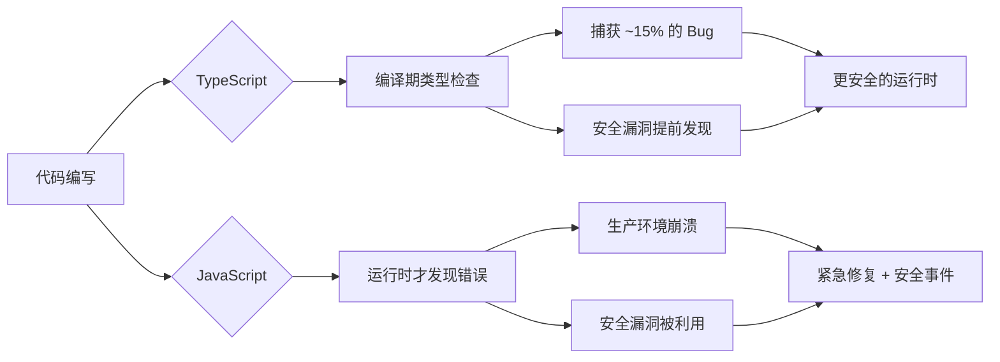

## 2. TypeScript类型安全

### 2.1 为什么安全开发需要类型系统

JavaScript 是一门动态类型语言，变量可以在运行时被赋予任意类型的值，函数参数不做类型检查，属性访问不会在编译期报错。这种灵活性是 JavaScript 生态繁荣的原因之一，但也正是大量安全漏洞的根源。

**动态类型导致的安全问题统计**：

| 问题类别 | 典型漏洞 | JavaScript中的表现 | TypeScript预防方式 |
|---------|---------|-------------------|------------------|
| 类型混淆 | 类型强制转换攻击 | `"5" - 1 === 4` 但 `"5" + 1 === "51"` | 编译期类型检查拒绝隐式转换 |
| 空值访问 | NullPointerException | `undefined.prop` 抛出运行时异常 | `strictNullChecks` 强制判空 |
| 属性拼写 | 未定义行为 | `{name: "a"}.naem` 返回 `undefined` | 属性名拼写检查 |
| API契约 | 参数类型不匹配 | 传入字符串当ID导致SQL注入 | 接口约束函数签名 |
| 返回值 | 未处理错误分支 | `JSON.parse` 可能抛异常但被忽略 | 返回类型联合标注 |

TypeScript 的类型系统在编译阶段（而非运行时）捕获这些错误，将错误发现时间从"部署后"提前到"编写时"，显著降低了安全风险暴露面。

### 2.2 TypeScript类型系统核心机制

#### 2.2.1 基础类型与类型注解

TypeScript 的类型注解语法在变量名后使用 `: Type`，为编译器提供静态类型信息：

```typescript
// 基础类型注解
let userId: number = 42;
let username: string = "alice";
let isActive: boolean = true;
let tags: string[] = ["admin", "user"];
let scores: Array<number> = [95, 87, 92];

// 对象类型注解
let point: { x: number; y: number } = { x: 10, y: 20 };

// 函数类型注解
function add(a: number, b: number): number {
    return a + b;
}

// 箭头函数类型
const multiply: (x: number, y: number) => number = (x, y) => x * y;
```

**类型推断**：TypeScript 不要求所有地方都显式标注类型，编译器可以根据赋值自动推断：

```typescript
let count = 10;          // 推断为 number
let name = "TypeScript"; // 推断为 string
let items = [1, 2, 3];   // 推断为 number[]

// 推断失败的情况需要显式标注
let mixed: (string | number)[] = [1, "two", 3];
```

#### 2.2.2 接口（Interface）与类型别名（Type Alias）

接口是 TypeScript 类型系统的核心构建块，定义对象的结构契约：

```typescript
// 接口定义 —— 约束对象必须拥有的属性和方法
interface User {
    id: number;
    name: string;
    email: string;
    role: 'admin' | 'user' | 'guest';  // 字面量联合类型
    createdAt: Date;
    lastLoginAt?: Date;  // 可选属性
}

// 只读属性 —— 创建后不可修改，防止敏感字段被篡改
interface ImmutableConfig {
    readonly apiKey: string;
    readonly endpoint: string;
    readonly timeout: number;
}

// 接口继承 —— 组合复用
interface AdminUser extends User {
    permissions: string[];
    sudoEnabled: boolean;
}

// 类型别名 —— 更灵活的类型定义工具
type UserID = string | number;
type HttpMethod = 'GET' | 'POST' | 'PUT' | 'DELETE' | 'PATCH';
type ApiResult<T> = 
    | { success: true; data: T }
    | { success: false; error: string; code: number };
```

**Interface vs Type Alias 选择指南**：

| 特性 | Interface | Type Alias |
|------|-----------|------------|
| 声明合并 | ✅ 同名自动合并 | ❌ 同名报错 |
| 继承 | `extends` 关键字 | `&` 交叉类型 |
| 联合类型 | ❌ 不支持 | ✅ `A \| B` |
| 元组 | ❌ 不支持 | ✅ `[string, number]` |
| 映射类型 | ❌ 不支持 | ✅ `Record<K, V>` |
| 使用场景 | 对象形状、类契约 | 联合、交叉、工具类型 |

#### 2.2.3 联合类型与交叉类型

联合类型表示"或"关系，值可以是多个类型之一；交叉类型表示"与"关系，值必须同时满足所有类型：

```typescript
// 联合类型 —— 值只能是其中之一
type StringOrNumber = string | number;
type NullOrUser = User | null;
type Direction = 'up' | 'down' | 'left' | 'right';

// 交叉类型 —— 值必须同时满足所有类型
type Timestamped = {
    createdAt: Date;
    updatedAt: Date;
};

type SoftDeletable = {
    deletedAt: Date | null;
    isDeleted: boolean;
};

type AuditableEntity = Timestamped & SoftDeletable;
// AuditableEntity 同时拥有 createdAt, updatedAt, deletedAt, isDeleted

// 实际使用：API响应的统一处理
type ApiResponse<T> = {
    status: number;
    headers: Record<string, string>;
} & (
    | { ok: true; body: T }
    | { ok: false; error: Error }
);
```

#### 2.2.4 泛型（Generics）—— 类型参数化

泛型是 TypeScript 类型系统中最强大的机制之一，允许编写类型安全的通用代码：

```typescript
// 基础泛型函数
function identity<T>(value: T): T {
    return value;
}

identity<string>("hello");  // 显式指定
identity(42);               // 自动推断为 number

// 泛型约束 —— 限制泛型参数的范围
interface HasId {
    id: number;
}

function findById<T extends HasId>(items: T[], id: number): T | undefined {
    return items.find(item => item.id === id);
}

// 泛型接口
interface Repository<T extends HasId> {
    findById(id: number): Promise<T | null>;
    findAll(): Promise<T[]>;
    create(entity: Omit<T, 'id'>): Promise<T>;
    update(id: number, entity: Partial<T>): Promise<T>;
    delete(id: number): Promise<boolean>;
}

// 泛型实现
class UserRepository implements Repository<User> {
    async findById(id: number): Promise<User | null> {
        // 实现省略
        return null;
    }
    async findAll(): Promise<User[]> { return []; }
    async create(entity: Omit<User, 'id'>): Promise<User> {
        return { ...entity, id: Math.random() } as User;
    }
    async update(id: number, entity: Partial<User>): Promise<User> {
        return {} as User;
    }
    async delete(id: number): Promise<boolean> { return true; }
}

// 条件类型 —— 根据条件选择返回类型
type IsString<T> = T extends string ? true : false;
type A = IsString<string>;  // true
type B = IsString<number>;  // false
```

### 2.3 TypeScript 安全编码实践

#### 2.3.1 严格模式配置

安全编码的第一步是启用 TypeScript 的严格检查选项。在 `tsconfig.json` 中：

```json
{
    "compilerOptions": {
        "strict": true,
        "noUncheckedIndexedAccess": true,
        "noImplicitOverride": true,
        "exactOptionalPropertyTypes": true,
        "noPropertyAccessFromIndexSignature": true,
        "forceConsistentCasingInFileNames": true,
        "noFallthroughCasesInSwitch": true,
        "noImplicitReturns": true
    }
}
```

**各选项的安全意义**：

| 选项 | 作用 | 防止的安全问题 |
|------|------|--------------|
| `strictNullChecks` | null/undefined 必须显式处理 | 空值访问导致的崩溃和信息泄露 |
| `noUncheckedIndexedAccess` | 数组索引返回 `T \| undefined` | 越界访问未处理 |
| `exactOptionalPropertyTypes` | 可选属性不能赋值 undefined | 属性存在性语义混乱 |
| `noPropertyAccessFromIndexSignature` | 索引签名必须用 `[]` 访问 | 拼写错误绕过类型检查 |
| `noFallthroughCasesInSwitch` | switch 必须 break/return | 遗漏分支导致逻辑漏洞 |

#### 2.3.2 用 unknown 替代 any

`any` 是 TypeScript 类型系统的"逃生舱"，使用它等于完全放弃类型检查。`unknown` 是类型安全的替代品：

```typescript
// ❌ any —— 类型检查被完全绕过
function unsafeParse(input: string): any {
    return JSON.parse(input);
}
const result1 = unsafeParse('{"name": "test"}');
result1.nonExistentMethod();  // 编译通过，运行时崩溃

// ✅ unknown —— 必须先做类型检查才能使用
function safeParse(input: string): unknown {
    return JSON.parse(input);
}
const result2 = safeParse('{"name": "test"}');
// result2.name;  // 编译错误：'result2' 的类型为 'unknown'

// 安全使用 unknown 值的模式
function processParsedData(data: unknown): string {
    if (typeof data === 'object' && data !== null && 'name' in data) {
        const obj = data as { name: unknown };
        if (typeof obj.name === 'string') {
            return obj.name;
        }
    }
    throw new Error('Invalid data format');
}
```

#### 2.3.3 类型守卫（Type Guard）

类型守卫是运行时类型检查与编译期类型推断的桥梁：

```typescript
// 自定义类型守卫函数 —— 返回类型为 `param is Type`
interface Admin {
    type: 'admin';
    permissions: string[];
}

interface RegularUser {
    type: 'user';
    email: string;
}

type AppUser = Admin | RegularUser;

function isAdmin(user: AppUser): user is Admin {
    return user.type === 'admin';
}

function processUser(user: AppUser): void {
    // 使用类型守卫收窄类型
    if (isAdmin(user)) {
        // TypeScript 知道这里 user 是 Admin 类型
        console.log(user.permissions.join(', '));
    } else {
        // TypeScript 知道这里 user 是 RegularUser 类型
        console.log(user.email);
    }
}

// typeof 守卫 —— 内置类型检查
function formatValue(value: string | number | boolean): string {
    if (typeof value === 'string') {
        return value.toUpperCase();
    } else if (typeof value === 'number') {
        return value.toFixed(2);
    } else {
        return value ? 'YES' : 'NO';
    }
}

// instanceof 守卫 —— 类实例检查
function handleError(error: Error | string): void {
    if (error instanceof Error) {
        console.error(error.message, error.stack);
    } else {
        console.error(error);
    }
}

// in 操作符守卫 —— 属性存在性检查
function processShape(shape: { kind: 'circle'; radius: number } | { kind: 'rect'; width: number; height: number }): number {
    if ('radius' in shape) {
        return Math.PI * shape.radius ** 2;
    } else {
        return shape.width * shape.height;
    }
}
```

#### 2.3.4 严格处理 null 和 undefined

空值是 JavaScript 中最常见的崩溃原因。TypeScript 的 `strictNullChecks` 将 null/undefined 变为独立类型，必须显式处理：

```typescript
// ❌ 不安全：假设值一定存在
function getUserName(users: User[], id: number): string {
    const user = users.find(u => u.id === id);
    return user.name;  // 可能是 undefined
}

// ✅ 方式一：显式检查
function getUserName1(users: User[], id: number): string {
    const user = users.find(u => u.id === id);
    if (!user) {
        throw new Error(`User ${id} not found`);
    }
    return user.name;  // TypeScript 知道 user 不是 undefined
}

// ✅ 方式二：可选链 + 空值合并
function getUserName2(users: User[], id: number): string {
    return users.find(u => u.id === id)?.name ?? 'Unknown User';
}

// ✅ 方式三：Result 模式
function findUser(users: User[], id: number): User | null {
    return users.find(u => u.id === id) ?? null;
}

const user = findUser(users, 42);
if (user !== null) {
    // 类型收窄：user 在这里是 User 类型
    console.log(user.name);
}

// 非空断言操作符（!）—— 谨慎使用
function dangerous(): void {
    const el = document.getElementById('app')!;  // 告诉编译器 el 一定不是 null
    // 如果 #app 不存在，el.innerHTML 会在运行时崩溃
    el.innerHTML = 'Hello';
}
```

### 2.4 高级类型安全模式

#### 2.4.1 映射类型（Mapped Types）

映射类型基于已有类型创建新类型，是 TypeScript 工具类型的基础：

```typescript
// 内置映射类型
type Partial<T> = { [K in keyof T]?: T[K] };      // 所有属性变可选
type Required<T> = { [K in keyof T]-?: T[K] };     // 所有属性变必选
type Readonly<T> = { readonly [K in keyof T]: T[K] }; // 所有属性变只读
type Mutable<T> = { -readonly [K in keyof T]: T[K] }; // 移除只读

// 自定义映射类型
type Nullable<T> = { [K in keyof T]: T[K] | null };
type Stringify<T> = { [K in keyof T]: string };

// 实际场景：表单字段全部可选（编辑表单只修改部分字段）
interface CreateUserDTO {
    name: string;
    email: string;
    password: string;
    avatar?: string;
}

type UpdateUserDTO = Partial<CreateUserDTO>;
// 等价于 { name?: string; email?: string; password?: string; avatar?: string }

// Pick 和 Omit —— 选择/排除特定属性
type UserPublicInfo = Pick<User, 'id' | 'name' | 'email'>;
type UserWithoutPassword = Omit<User & { password: string }, 'password'>;

// Record —— 键值对映射
type PermissionMap = Record<string, string[]>;
const permissions: PermissionMap = {
    admin: ['read', 'write', 'delete'],
    user: ['read'],
};
```

#### 2.4.2 条件类型与 infer

条件类型根据类型关系选择不同的类型分支：

```typescript
// 基础条件类型
type IsNever<T> = [T] extends [never] ? true : false;
type IsAny<T> = 0 extends (1 & T) ? true : false;

// infer 关键字 —— 在条件类型中提取类型
type ReturnTypeOf<T> = T extends (...args: any[]) => infer R ? R : never;
type ParamType<T> = T extends (first: infer P, ...rest: any[]) => any ? P : never;

// 提取 Promise 内部类型
type UnwrapPromise<T> = T extends Promise<infer U> ? U : T;
type A = UnwrapPromise<Promise<string>>;  // string
type B = UnwrapPromise<number>;           // number

// 提取数组元素类型
type ElementOf<T> = T extends (infer E)[] ? E : never;
type C = ElementOf<string[]>;  // string
type D = ElementOf<[number, boolean]>;  // number | boolean

// 深度递归条件类型
type DeepReadonly<T> = T extends object
    ? { readonly [K in keyof T]: DeepReadonly<T[K]> }
    : T;

interface Config {
    db: {
        host: string;
        port: number;
        credentials: {
            user: string;
            pass: string;
        };
    };
}

type FrozenConfig = DeepReadonly<Config>;
// Config.db.credentials.pass 也是 readonly
```

#### 2.4.3 模板字面量类型

TypeScript 4.1 引入的模板字面量类型，可以在类型层面操作字符串：

```typescript
// 基础用法
type Greeting = `Hello, ${string}!`;
const valid: Greeting = "Hello, World!";  // ✅
// const invalid: Greeting = "Hi, World!"; // ❌

// 联合类型展开
type Color = 'red' | 'green' | 'blue';
type Shade = 'light' | 'dark';
type ColorVariant = `${Shade}-${Color}`;
// "light-red" | "light-green" | "light-blue" | "dark-red" | "dark-green" | "dark-blue"

// CSS 属性类型安全
type CSSUnit = 'px' | 'rem' | 'em' | '%' | 'vh' | 'vw';
type CSSValue = `${number}${CSSUnit}`;
function setWidth(value: CSSValue): void { /* ... */ }
setWidth('100px');   // ✅
setWidth('50%');    // ✅
// setWidth('100');  // ❌

// 事件名称类型
type EventName<T extends string> = `on${Capitalize<T>}`;
type ButtonEvents = EventName<'click' | 'hover' | 'focus'>;
// "onClick" | "onHover" | "onFocus"
```

#### 2.4.4 枚举与常量断言

枚举和常量断言提供类型安全的常量集合：

```typescript
// 数字枚举 —— 有反向映射，但容易误用
enum Status {
    Pending,    // 0
    Active,     // 1
    Suspended,  // 2
    Deleted,    // 3
}

// 字符串枚举 —— 更安全，值有明确语义
enum HttpMethod {
    GET = 'GET',
    POST = 'POST',
    PUT = 'PUT',
    DELETE = 'DELETE',
    PATCH = 'PATCH',
}

// const 枚举 —— 编译时内联，无运行时开销
const enum Direction {
    Up = 'UP',
    Down = 'DOWN',
    Left = 'LEFT',
    Right = 'RIGHT',
}

// 推荐：as const + 联合类型（比枚举更灵活）
const HTTP_METHODS = ['GET', 'POST', 'PUT', 'DELETE', 'PATCH'] as const;
type HttpMethod2 = typeof HTTP_METHODS[number];
// 'GET' | 'POST' | 'PUT' | 'DELETE' | 'PATCH'

// 对象 as const 模式
const ERROR_CODES = {
    NOT_FOUND: 404,
    UNAUTHORIZED: 401,
    FORBIDDEN: 403,
    INTERNAL: 500,
} as const;

type ErrorCode = typeof ERROR_CODES[keyof typeof ERROR_CODES];
// 404 | 401 | 403 | 500
```

### 2.5 TypeScript 安全防护场景

#### 2.5.1 API 输入验证

类型系统只在编译期生效，运行时的外部输入（用户提交、API响应、环境变量）必须额外验证：

```typescript
// 运行时验证库：zod —— 同时提供类型推断
import { z } from 'zod';

// 定义 schema（运行时验证规则）
const UserSchema = z.object({
    id: z.number().int().positive(),
    name: z.string().min(1).max(100),
    email: z.string().email(),
    role: z.enum(['admin', 'user', 'guest']),
    age: z.number().int().min(0).max(150).optional(),
});

// 从 schema 自动推导 TypeScript 类型
type UserFromSchema = z.infer<typeof UserSchema>;
// 等价于 { id: number; name: string; email: string; role: 'admin'|'user'|'guest'; age?: number }

// 安全的 API 输入处理
function handleCreateUser(requestBody: unknown): UserFromSchema {
    const result = UserSchema.safeParse(requestBody);
    if (!result.success) {
        throw new ValidationError(
            result.error.issues.map(i => `${i.path.join('.')}: ${i.message}`)
        );
    }
    return result.data;  // 类型已被收窄为 UserFromSchema
}
```

#### 2.5.2 防止原型链污染

TypeScript 的类型检查可以在编译期发现原型链污染的写法：

```typescript
// ❌ 危险：使用对象作为字典时，__proto__ 可能被污染
function merge(target: Record<string, any>, source: Record<string, any>): void {
    for (const key in source) {
        if (typeof source[key] === 'object' && source[key] !== null) {
            if (!target[key]) target[key] = {};
            merge(target[key], source[key]);
        } else {
            target[key] = source[key];  // key 可能是 "__proto__"、"constructor"、"prototype"
        }
    }
}

// ✅ 安全：使用 Map 替代对象字典
function safeMerge(target: Map<string, unknown>, source: Map<string, unknown>): void {
    for (const [key, value] of source) {
        if (value instanceof Map && target.get(key) instanceof Map) {
            safeMerge(target.get(key) as Map<string, unknown>, value);
        } else {
            target.set(key, value);  // Map 的键不受原型链影响
        }
    }
}

// ✅ 安全：使用 Object.create(null) 创建无原型对象
const safeDict: Record<string, unknown> = Object.create(null);
```

#### 2.5.3 类型安全的数据库查询

防止 SQL 注入的关键在于参数化查询，TypeScript 的类型系统可以让查询参数的类型在编译期被验证：

```typescript
// 使用类型安全的查询构建器（以 Prisma 为例）
import { PrismaClient } from '@prisma/client';

const prisma = new PrismaClient();

// 查询条件类型安全
async function findUsers(filter: {
    name?: string;
    email?: string;
    role?: 'admin' | 'user';
    createdAt?: { gte?: Date; lte?: Date };
}) {
    return prisma.user.findMany({
        where: {
            name: filter.name ? { contains: filter.name } : undefined,
            email: filter.email,
            role: filter.role,
            createdAt: filter.createdAt,
        },
        select: {            // 只返回需要的字段，避免泄露敏感数据
            id: true,
            name: true,
            email: true,
            role: true,
        },
    });
}

// ❌ 字符串拼接 —— SQL 注入风险（即使 TypeScript 也无法阻止）
// const query = `SELECT * FROM users WHERE name = '${userName}'`;
```

#### 2.5.4 XSS 防护的类型层面策略

```typescript
// 用类型标记不同来源的字符串
type SafeHTML = string & { __brand: 'SafeHTML' };
type UnsafeHTML = string & { __brand: 'UnsafeHTML' };
type RawUserInput = string & { __brand: 'RawUserInput' };

// 只有经过净化的字符串才能设置 innerHTML
function sanitize(input: RawUserInput): SafeHTML {
    return input
        .replace(/&/g, '&amp;')
        .replace(/</g, '&lt;')
        .replace(/>/g, '&gt;')
        .replace(/"/g, '&quot;')
        .replace(/'/g, '&#x27;') as SafeHTML;
}

function setInnerHTML(element: HTMLElement, html: SafeHTML): void {
    element.innerHTML = html;
}

// 使用
const userInput: RawUserInput = '<script>alert("xss")</script>' as RawUserInput;
const safe = sanitize(userInput);
setInnerHTML(document.getElementById('app')!, safe);  // ✅

// setInnerHTML(document.getElementById('app')!, userInput);  // ❌ 编译错误
```

### 2.6 TypeScript 安全工具链

| 工具 | 用途 | 安全收益 |
|------|------|---------|
| `eslint-plugin-security` | 检测不安全的代码模式 | 捕获 eval()、new Function()、非字面量 require() |
| `eslint-plugin-unicorn` | 现代 JS/TS 最佳实践 | 防止正则 DoS、强制安全正则写法 |
| `zod` / `yup` / `io-ts` | 运行时类型验证 | 外部输入校验，类型安全的数据解析 |
| `typebox` | JSON Schema → TypeScript 类型 | API schema 验证与类型推断一体化 |
| `ts-reset` | 增强 TypeScript 内置类型 | 修复 `JSON.parse` 返回 `any` 等问题 |
| `typescript-eslint` | TS 感知的 ESLint 规则 | 类型感知的 lint 检查 |
| `knip` | 检测未使用的导出和依赖 | 减少攻击面，清理死代码 |

### 2.7 常见类型安全误区

**误区一：类型断言（as）绕过检查**

```typescript
// ❌ 滥用 as 断言 —— 编译器信任你，但你可能错了
const data = JSON.parse(userInput) as User;
// 如果 userInput 不是合法的 User 结构，运行时会出问题

// ✅ 使用 zod 等库做运行时验证
const data = UserSchema.parse(JSON.parse(userInput));
```

**误区二：用 `!` 非空断言忽略 null**

```typescript
// ❌ 非空断言掩盖了可能的 null
function getUser(id: number): User {
    const user = users.find(u => u.id === id);
    return user!;  // 如果 user 是 undefined，调用方会崩溃
}

// ✅ 正确处理
function getUser(id: number): User {
    const user = users.find(u => u.id === id);
    if (!user) throw new Error(`User ${id} not found`);
    return user;
}
```

**误区三：以为 TypeScript 能防止运行时类型错误**

TypeScript 类型在编译后被擦除，运行时不存在。以下来源的数据必须运行时验证：
- `req.body` / `req.query` / `req.params`（HTTP 请求参数）
- `JSON.parse()` 的结果
- `process.env` 环境变量
- 第三方 API 响应
- 数据库查询结果
- 文件读取内容

**误区四：接口声明与实际数据不一致**

```typescript
// ❌ 接口声称 API 返回 User，但实际可能不包含某些字段
interface User {
    id: number;
    name: string;
    email: string;  // 但实际 API 可能不返回 email
}

// ✅ 使用 OpenAPI/Swagger 自动生成类型，保证一致性
// 或使用 zod schema 做运行时验证
```

### 2.8 TypeScript 与 JavaScript 的安全对比



| 维度 | JavaScript | TypeScript |
|------|-----------|-----------|
| 类型检查时机 | 无（运行时出错） | 编译期 |
| IDE 支持 | 基础补全 | 完整类型感知补全、重构 |
| 重构安全性 | 低（靠开发者记忆） | 高（编译器追踪所有引用） |
| API 契约 | 靠文档和约定 | 接口强制约束 |
| 新人上手风险 | 高（隐式错误） | 低（编译期提示） |
| 代码审查效率 | 低（需要运行才能发现类型问题） | 高（类型系统分担大量检查） |
| 运行时开销 | 无额外开销 | 编译为 JS 后无额外开销 |

TypeScript 的价值不仅在于"少写 bug"，更在于它将安全检查从"人工审查"提升为"机器强制"——任何绕过类型安全的尝试都需要显式的 `as` 或 `any`，这些会在代码审查中成为醒目的警示信号。
