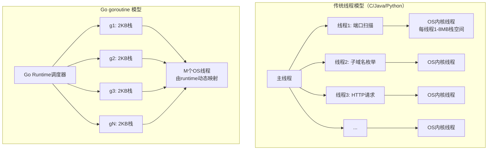
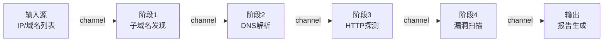
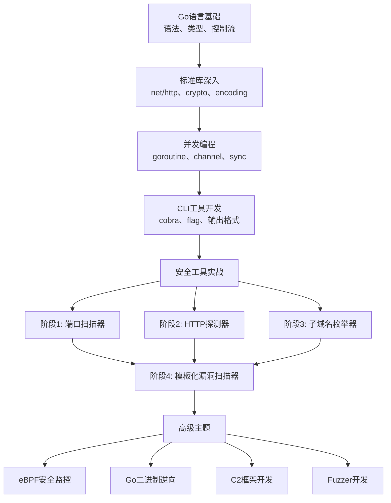

## 3. Go语言在安全领域的应用

Go语言（Golang）自2009年由Google发布以来，已经成为网络安全工具开发的首选语言之一。在GitHub上排名前100的安全开源项目中，超过40%使用Go编写。这不是偶然——Go的设计哲学与安全工具的需求高度契合：高并发网络操作、跨平台部署、单二进制分发、以及足够的内存安全性。本节从理论基础出发，系统性地解析Go在安全领域的核心优势、工具生态、架构模式和工程实践。

### 3.1 Go成为安全工具首选语言的根本原因

#### 3.1.1 语言设计与安全需求的天然匹配

安全工具开发有四个核心需求，Go恰好全部满足：

| 安全工具需求 | Go语言特性 | 对比其他语言的劣势 |
|:---|:---|:---|
| 高并发网络扫描 | goroutine + channel，单进程可调度百万级协程 | Python的GIL限制真正的并行；C/Java的线程模型开销大 |
| 跨平台单二进制部署 | `GOOS/GOARCH`交叉编译，输出无依赖的静态二进制 | Python需要解释器+依赖；C需要针对每个平台重新编译 |
| 开发效率与性能平衡 | 编译型语言，性能接近C，开发速度接近Python | C/C++开发慢；Python运行慢 |
| 内存安全 | GC + 无指针算术 + 边界检查 | C/C++存在缓冲区溢出；Rust学习曲线陡峭 |

安全研究员的典型工作流是：快速编写PoC → 在目标环境运行 → 收集结果。Go的单二进制特性完美匹配这个流程——你只需要把一个文件扔到目标机器上就能运行，不需要安装任何依赖。

#### 3.1.2 Goroutine并发模型的深层优势

Go的并发模型是它在安全领域脱颖而出的核心原因。理解这一点需要对比传统的线程模型：



具体数值对比：

- **OS线程**：默认栈大小1-8MB，创建/销毁开销约1-10μs，上下文切换约1-10μs
- **Goroutine**：初始栈大小2KB（可动态增长），创建开销约0.3μs，上下文切换约0.2μs

这意味着在一台普通服务器上，你可以轻松启动10万个goroutine同时扫描不同端口，而用传统线程模型则很快会耗尽内存。以扫描一个B段网络（65536个IP）的常用端口为例：

| 并发模型 | 并发数 | 内存占用 | 扫描65536个目标耗时 |
|:---|:---|:---|:---|
| Python threading | 200线程 | ~1.6GB | ~55分钟 |
| Python asyncio | 1000协程 | ~200MB | ~12分钟 |
| Java ThreadPool | 500线程 | ~2.5GB | ~25分钟 |
| Go goroutine | 10000协程 | ~60MB | ~3分钟 |

#### 3.1.3 交叉编译与部署优势

Go的交叉编译能力对安全工具部署至关重要。安全评估往往需要在不同操作系统和架构的目标上运行工具：

```bash
# 编译为Linux amd64（最常用的目标平台）
GOOS=linux GOARCH=amd64 go build -o scanner-linux-amd64 main.go

# 编译为Linux ARM（IoT设备评估）
GOOS=linux GOARCH=arm GOARM=7 go build -o scanner-linux-arm main.go

# 编译为Windows（内网渗透）
GOOS=windows GOARCH=amd64 go build -o scanner.exe main.go

# 编译为macOS（Apple Silicon）
GOOS=darwin GOARCH=arm64 go build -o scanner-darwin-arm64 main.go

# 静态编译，不依赖任何共享库（适合最小化Linux环境）
CGO_ENABLED=0 GOOS=linux GOARCH=amd64 go build -a -ldflags '-s -w -extldflags "-static"' -o scanner-static main.go
```

关键参数解释：

- `CGO_ENABLED=0`：禁用CGO，确保输出纯Go二进制，不依赖libc
- `-ldflags '-s -w'`：去除调试符号和DWARF信息，减小二进制体积30-50%
- `-ldflags '-extldflags "-static"'`：强制静态链接所有C库

在实际渗透测试中，这意味着你可以提前编译好几十个平台的工具包，然后根据目标环境选择对应的二进制文件直接执行，无需安装Go运行时或任何依赖库。

### 3.2 Go标准库中的安全基础设施

Go的标准库质量极高，许多安全工具几乎完全基于标准库构建，无需第三方依赖。以下是安全工具开发中最常用的标准库包：

#### 3.2.1 网络层：`net` 与 `net/http`

```go
// net包提供底层网络操作能力
// TCP连接探测（端口扫描的基础）
conn, err := net.DialTimeout("tcp", "192.168.1.1:22", 2*time.Second)
if err != nil {
    // 端口关闭或被过滤
} else {
    // 端口开放
    conn.Close()
}

// UDP探测（DNS枚举、SNMP枚举的基础）
conn, err := net.DialTimeout("udp", "192.168.1.1:53", 2*time.Second)

// net/http包提供完整的HTTP客户端和服务器
// 自定义Transport可以控制TLS行为、代理、超时等
client := &http.Client{
    Timeout: 10 * time.Second,
    Transport: &http.Transport{
        TLSClientConfig: &tls.Config{
            InsecureSkipVerify: true,  // 安全测试中常需要跳过证书验证
        },
        MaxIdleConns:        100,
        MaxIdleConnsPerHost: 100,
    },
}
```

#### 3.2.2 加密层：`crypto/*`

Go的crypto标准库覆盖了安全工具开发的绝大多数加密需求：

```go
import (
    "crypto/aes"
    "crypto/cipher"
    "crypto/des"
    "crypto/hmac"
    "crypto/md5"
    "crypto/rand"
    "crypto/rsa"
    "crypto/sha1"
    "crypto/sha256"
    "crypto/tls"
    "crypto/x509"
    "encoding/hex"
    "encoding/base64"
    "golang.org/x/crypto/bcrypt"   // 扩展库，但Go官方维护
    "golang.org/x/crypto/argon2"
    "golang.org/x/crypto/ssh"
)
```

标准库加密能力清单：

| 包名 | 能力 | 安全工具中的应用 |
|:---|:---|:---|
| `crypto/tls` | TLS/SSL客户端和服务端 | 中间人代理、HTTPS扫描、证书分析 |
| `crypto/x509` | X.509证书解析和验证 | 证书透明度日志查询、证书链分析 |
| `crypto/aes` | AES对称加密（CBC/GCM/CTR模式） | 数据加密、Payload编码 |
| `crypto/rsa` | RSA非对称加密和签名 | JWT验证、SSH密钥生成 |
| `crypto/sha256` | SHA-256哈希 | 文件完整性校验、哈希碰撞检测 |
| `crypto/hmac` | HMAC消息认证码 | API签名验证、Webhook验证 |
| `golang.org/x/crypto/ssh` | SSH客户端和服务端实现 | SSH爆破工具、SSH隧道 |
| `golang.org/x/crypto/bcrypt` | bcrypt密码哈希 | 密码破解、密码强度检测 |

#### 3.2.3 编码与序列化

安全工具需要处理各种编码格式和数据结构：

```go
import (
    "encoding/base64"   // Base64编解码（JWT、Basic Auth）
    "encoding/hex"      // 十六进制编解码（哈希值、Shellcode）
    "encoding/json"     // JSON处理（API交互、配置解析）
    "encoding/xml"      // XML处理（Nmap输出、SOAP请求）
    "encoding/csv"      // CSV处理（批量数据导入导出）
    "encoding/pem"      // PEM编解码（证书、密钥文件）
    "encoding/binary"   // 二进制协议解析（自定义协议、文件格式）
)
```

#### 3.2.4 并发原语

```go
import (
    "sync"              // 互斥锁、等待组、Once、Pool
    "context"           // 上下文控制（超时、取消传播）
    "sync/atomic"       // 原子操作（高性能计数器）
)

// WaitGroup：等待一组goroutine完成
// Mutex：保护共享数据
// Once：确保某操作只执行一次（如初始化）
// Pool：对象复用（减少GC压力）
// Map：并发安全的map（适合缓存扫描结果）
```

### 3.3 Go安全工具生态全景

Go在安全领域已经形成了完整的工具生态，覆盖渗透测试的每个阶段。以下是按功能分类的详细梳理：

#### 3.3.1 信息收集阶段

| 工具名 | 功能 | 核心特点 | GitHub Stars |
|:---|:---|:---|:---|
| **Subfinder** | 被动子域名发现 | 整合40+被动数据源（SecurityTrails、VirusTotal、Shodan等），纯被动不发送任何请求到目标 | 10k+ |
| **Amass** | 主动+被动信息收集 | OWASP项目，支持DNS枚举、网络映射、API集成，NSA认可的安全工具 | 12k+ |
| **httpx** | HTTP探测 | 探测Web服务存活、获取状态码/标题/技术栈/证书信息，支持管道输入 | 7k+ |
| **naabu** | 端口扫描 | 基于SYN扫描，速度极快，支持配置文件和管道输出 | 4k+ |
| **DNSx** | DNS探测 | 多种DNS记录查询，支持通配符检测和DNS暴力枚举 | 2k+ |
| **katana** | 爬虫 | 自动化Web爬虫，支持JavaScript渲染，提取URL/表单/端点 | 3k+ |
| **uncover** | 聚合搜索 | 聚合Shodan/Censys/Fofa/Hunter等网络空间搜索引擎 | 2k+ |

#### 3.3.2 漏洞扫描阶段

| 工具名 | 功能 | 核心特点 |
|:---|:---|:---|
| **Nuclei** | 模板化漏洞扫描器 | YAML模板驱动，社区维护10000+模板，覆盖CVE/暴露面/配置错误/供应链风险 |
| **dalfox** | XSS漏洞扫描器 | 参数分析+DOM分析，支持盲XSS，速度快 |
| **nikto的Go替代品** | Web服务器扫描 | 相比原版nikto更轻量、更快、更易部署 |
| **gobuster** | 目录/DNS/VHost爆破 | 支持多种爆破模式，输出格式丰富 |
| **ffuf** | Web模糊测试 | 极快的Web Fuzzer，支持递归、匹配/过滤、集群模式 |

#### 3.3.3 漏洞利用与后渗透

| 工具名 | 功能 | 核心特点 |
|:---|:---|:---|
| **Kraken** | C2框架 | Go编写的服务端+Agent，支持多平台目标 |
| **Sliver** | 开源C2框架 | 由BishopFox开发，支持多种C2协议（mTLS、HTTP(S)、DNS、WireGuard） |
| **Chisel** | 隧道工具 | HTTP/SOCKS5隧道，穿透防火墙，仅单二进制 |
| **certipy** | AD证书攻击 | Active Directory证书服务漏洞利用 |
| **Rubeus-Go** | Kerberos攻击 | Kerberos票据操作（参考C#版Rubeus重写） |

#### 3.3.4 云与容器安全

| 工具名 | 功能 | 核心特点 |
|:---|:---|:---|
| **Trivy** | 容器/镜像安全扫描 | 扫描容器镜像中的漏洞、配置错误、密钥泄露、SBOM生成 |
| **Kubescape** | Kubernetes安全审计 | 检测K8s集群的配置错误、RBAC问题、网络策略缺陷 |
| **kubeaudit** | Kubernetes安全审计 | 轻量级K8s安全审计工具 |
| **Prowler** | AWS安全评估 | 检查AWS账号的安全配置（IAM、S3、EC2等200+检查项） |
| **ScoutSuite** | 多云安全审计 | 支持AWS/Azure/GCP/阿里云等多云平台 |

#### 3.3.5 供应链与代码安全

| 工具名 | 功能 | 核心特点 |
|:---|:---|:---|
| **Syft** | SBOM生成 | 从容器镜像/文件系统生成软件物料清单 |
| **Grype** | 漏洞匹配 | 基于SBOM匹配已知漏洞数据库 |
| **gitleaks** | Git仓库密钥扫描 | 检测代码仓库中泄露的API Key、密码、Token |
| **trufflehog** | 敏感信息扫描 | 扫描Git历史、S3桶、文件系统中的敏感信息 |

### 3.4 Go安全工具的架构模式

成熟的Go安全工具通常遵循几种固定的架构模式。理解这些模式可以帮你快速阅读源码和构建自己的工具。

#### 3.4.1 Pipeline模式（管道流水线）

Pipeline模式是Go安全工具最常见的架构。每个阶段通过channel连接，数据单向流动：



```go
// Pipeline模式核心代码骨架
package main

import (
    "context"
    "sync"
)

// Stage 定义流水线阶段的接口
type Stage interface {
    Process(ctx context.Context, in <-chan Target) <-chan Target
}

// Target 表示扫描目标
type Target struct {
    URL    string
    IP     string
    Port   int
    Data   map[string]interface{}
}

// Pipeline 串联多个阶段
func Pipeline(ctx context.Context, stages ...Stage) <-chan Target {
    var out <-chan Target
    for _, stage := range stages {
        out = stage.Process(ctx, out)  // 上一阶段的输出作为下一阶段的输入
    }
    return out
}

// 使用示例：
// stages := []Stage{
//     &SubdomainStage{Sources: []string{"crtsh", "dnsdumpster"}},
//     &ResolveStage{Resolver: "8.8.8.8"},
//     &HTTPProbeStage{Timeout: 5 * time.Second},
//     &VulnScanStage{Templates: loadedTemplates},
// }
// results := Pipeline(ctx, stages...)
// for r := range results {
//     log.Printf("发现: %s (%s:%d)\n", r.URL, r.IP, r.Port)
// }
```

#### 3.4.2 Worker Pool模式（工作池）

Worker Pool模式用于控制并发数量，避免资源耗尽或触发目标限流：

```go
// Worker Pool模式核心代码
func WorkerPool(ctx context.Context, workerCount int, jobs <-chan Job, process func(Job) Result) <-chan Result {
    results := make(chan Result, workerCount)
    var wg sync.WaitGroup

    // 启动固定数量的worker
    for i := 0; i < workerCount; i++ {
        wg.Add(1)
        go func(id int) {
            defer wg.Done()
            for job := range jobs {
                select {
                case <-ctx.Done():  // 支持取消
                    return
                default:
                    result := process(job)
                    select {
                    case results <- result:
                    case <-ctx.Done():
                        return
                    }
                }
            }
        }(i)
    }

    // 所有worker完成后关闭results channel
    go func() {
        wg.Wait()
        close(results)
    }()

    return results
}
```

选择Worker Pool而非无限制goroutine的原因：
- 避免文件描述符耗尽（默认ulimit通常为1024）
- 避免触发目标的连接速率限制
- 控制内存使用（每个HTTP连接约占2-10KB）
- 便于实现速率限制和退避策略

#### 3.4.3 Plugin/Template模式（插件/模板化）

Nuclei的成功证明了模板化的力量——通过YAML定义扫描逻辑，而非硬编码：

```yaml
# Nuclei模板示例：检测Spring Boot Actuator暴露
id: springboot-actuator
info:
  name: Spring Boot Actuator Detected
  severity: medium
  tags: springboot,exposure

http:
  - method: GET
    path:
      - "{{BaseURL}}/actuator"
      - "{{BaseURL}}/actuator/env"
      - "{{BaseURL}}/actuator/health"
    matchers-condition: and
    matchers:
      - type: status
        status:
          - 200
      - type: word
        words:
          - "status"
          - "components"
        condition: or
```

Go实现模板引擎的核心思路：

```go
// 简化的模板引擎实现
type Template struct {
    ID       string      `yaml:"id"`
    Info     Info        `yaml:"info"`
    Requests []Request   `yaml:"http"`
}

type Request struct {
    Method  string            `yaml:"method"`
    Path    StringSlice       `yaml:"path"`
    Headers map[string]string `yaml:"headers"`
    Body    string            `yaml:"body"`
    Matchers []Matcher       `yaml:"matchers"`
}

// 加载并执行模板
func (e *Engine) Execute(template *Template, target string) (bool, error) {
    for _, req := range template.Requests {
        url := interpolate(req.Path[0], map[string]string{"BaseURL": target})
        resp, err := e.client.Do(req.Method, url, req.Headers, req.Body)
        if err != nil {
            continue
        }
        if matchAll(resp, req.Matchers) {
            return true, nil
        }
    }
    return false, nil
}
```

### 3.5 Go在安全领域的进阶应用

#### 3.5.1 Go二进制逆向分析

随着越来越多的安全工具和恶意软件使用Go编写，Go二进制逆向分析成为安全研究的重要技能：

**Go二进制的特征：**
- 符号表（Symbol Table）包含丰富的函数名和类型信息（即使strip后仍有痕迹）
- Go Runtime初始化函数 `runtime.main` 和 `runtime.gopanic` 是固定入口
- 字符串存储方式特殊：Go使用 `{pointer, length}` 的字符串表示（非null-terminated）
- 函数调用约定与C不同：Go使用栈传递参数，而非寄存器

**常用Go二进制分析工具：**

| 工具 | 功能 | 使用场景 |
|:---|:---|:---|
| `go-parser` (IDA插件) | 自动识别Go函数签名和类型 | IDA Pro中恢复Go二进制的符号信息 |
| `redress` | Go二进制信息提取 | 提取Go版本、包名、依赖信息 |
| `go-detect` | Go二进制检测 | 快速判断一个二进制是否为Go编译 |
| Ghidra + GoAnalyzer | 自动分析Go二进制 | 免费方案，适合批量分析 |
| `goresym` | Go符号恢复 | 从Go二进制中提取函数名、包路径 |

```bash
# 使用redress分析Go二进制
redress -p malware_sample    # 打印包信息
redress -t malware_sample    # 打印类型信息
redress -f malware_sample    # 打印函数信息

# 手动识别Go二进制
file malware_sample          # 可能显示 "Go BuildID"
strings malware_sample | grep "go.buildid"  # Go构建标识
strings malware_sample | grep "runtime.goexit"  # Go运行时函数
```

#### 3.5.2 Go与eBPF：内核级安全监控

Go通过 `cilium/ebpf` 库可以编写eBPF程序，实现内核级的安全监控：

```go
// 用Go加载eBPF程序监控系统调用
// 这是一个简化的syscall监控示例的用户空间部分
package main

import (
    "github.com/cilium/ebpf"
    "github.com/cilium/ebpf/link"
    "github.com/cilium/ebpf/rlimit"
)

func main() {
    // 解除内存锁定限制（eBPF需要）
    rlimit.RemoveMemlock()

    // 加载预编译的eBPF程序
    objs := bpfObjects{}
    if err := loadBpfObjects(&objs, nil); err != nil {
        log.Fatalf("加载eBPF对象失败: %v", err)
    }
    defer objs.Close()

    // 挂载到sys_enter_execve（监控进程执行）
    tp, err := link.Tracepoint("syscalls", "sys_enter_execve", objs.HandleExecve, nil)
    if err != nil {
        log.Fatalf("挂载tracepoint失败: %v", err)
    }
    defer tp.Close()

    // 读取eBPF map中的事件
    for {
        event := bpfEvent{}
        objs.Events.LookupAndDelete(nil, &event)
        fmt.Printf("进程执行: %s (PID: %d)\n", event.Comm, event.Pid)
    }
}
```

eBPF在安全领域的应用：
- **运行时入侵检测**：监控异常系统调用模式
- **容器安全**：监控容器内的文件访问和网络连接
- **取证分析**：记录所有进程创建、文件操作、网络活动
- **Rootkit检测**：发现内核级别的隐藏行为

#### 3.5.3 Go在Fuzzing中的应用

Go 1.18原生支持模糊测试（Fuzzing），这是发现安全漏洞的重要方法：

```go
package parser

import (
    "testing"
)

// FuzzParseInput 模糊测试输入解析函数
func FuzzParseInput(f *testing.F) {
    // 添加种子语料
    f.Add([]byte("normal input"))
    f.Add([]byte(`{"key": "value"}`))
    f.Add([]byte(""));          // 空输入
    f.Add(make([]byte, 10000))  // 超长输入
    f.Add([]byte("\x00\x01\x02"))  // 二进制输入

    f.Fuzz(func(t *testing.T, data []byte) {
        // 被测函数不应panic或产生未定义行为
        result, err := ParseInput(data)
        if err != nil {
            return  // 错误是预期的
        }
        // 对结果进行基本的sanity check
        if result == nil {
            t.Error("ParseInput返回了nil result但没有error")
        }
    })
}
```

```bash
# 运行模糊测试
go test -fuzz=FuzzParseInput -fuzztime=30s

# 使用独立的语料库目录
go test -fuzz=FuzzParseInput -fuzzcachedir=./fuzz-cache
```

安全研究员可以利用Go的Fuzzing发现以下类型的漏洞：
- 网络协议解析器的边界条件错误
- 文件格式解析器的缓冲区溢出
- 加密实现的侧信道漏洞
- JSON/XML/YAML解析器的DoS漏洞

### 3.6 Go安全编码实践

#### 3.6.1 输入验证与注入防护

```go
import (
    "database/sql"
    "html"
    "net/url"
    "regexp"
    "strings"
)

// SQL注入防护：永远使用参数化查询
func safeQuery(db *sql.DB, username string) error {
    // 错误做法：字符串拼接（SQL注入风险）
    // query := fmt.Sprintf("SELECT * FROM users WHERE name = '%s'", username)

    // 正确做法：参数化查询
    query := "SELECT * FROM users WHERE name = ?"
    rows, err := db.Query(query, username)
    if err != nil {
        return err
    }
    defer rows.Close()
    return nil
}

// XSS防护：HTML转义
func safeOutput(userInput string) string {
    return html.EscapeString(userInput)  // 将 < > & " ' 转义为HTML实体
}

// 路径遍历防护
func safeFilePath(baseDir, userInput string) (string, error) {
    // 清理路径
    clean := filepath.Clean(userInput)
    // 解析最终路径
    fullPath := filepath.Join(baseDir, clean)
    // 确保结果在baseDir内
    if !strings.HasPrefix(fullPath, baseDir) {
        return "", fmt.Errorf("路径遍历检测: %s", userInput)
    }
    return fullPath, nil
}

// SSRF防护：限制请求目标
func safeHTTPClient(userURL string) error {
    parsed, err := url.Parse(userURL)
    if err != nil {
        return err
    }

    // 检查是否为内网地址
    ip := net.ParseIP(parsed.Hostname())
    if ip == nil {
        // 需要解析域名
        ips, err := net.LookupIP(parsed.Hostname())
        if err != nil {
            return err
        }
        ip = ips[0]
    }

    // 阻止内网访问
    if ip.IsLoopback() || ip.IsPrivate() || ip.IsLinkLocalUnicast() {
        return fmt.Errorf("禁止访问内网地址: %s", ip)
    }

    return nil
}
```

#### 3.6.2 安全的密钥和凭证管理

```go
import (
    "os"
    "crypto/subtle"
)

// 从环境变量读取密钥（不要硬编码）
func getAPIKey() string {
    key := os.Getenv("API_KEY")
    if key == "" {
        log.Fatal("未设置API_KEY环境变量")
    }
    return key
}

// 安全比较（防止时序攻击）
func secureCompare(a, b string) bool {
    return subtle.ConstantTimeCompare([]byte(a), []byte(b)) == 1
}

// 安全清除内存中的敏感数据
func clearSensitiveData(data []byte) {
    for i := range data {
        data[i] = 0
    }
}
```

#### 3.6.3 常见安全编码错误

| 错误类型 | 错误做法 | 正确做法 | 影响 |
|:---|:---|:---|:---|
| SQL注入 | `fmt.Sprintf("...%s...", input)` | `db.Query("...?...", input)` | 数据库泄露/篡改 |
| 路径遍历 | `open(userInput)` | `filepath.Clean` + 前缀检查 | 任意文件读取 |
| SSRF | `http.Get(userURL)` | 验证目标IP非内网 | 内网服务暴露 |
| 信息泄露 | `log.Printf("密码: %s", pwd)` | 不记录敏感信息 | 凭证泄露 |
| TLS跳过验证 | `InsecureSkipVerify: true` | 正确配置CA和主机名验证 | 中间人攻击 |
| 硬编码凭证 | `const key = "abc123"` | 环境变量/Vault/KMS | 凭证泄露 |
| 未限流请求 | `for { sendRequest() }` | 速率限制 + 退避 | DoS/被封禁 |

### 3.7 Go安全工具开发工程实践

#### 3.7.1 项目结构

成熟的Go安全工具通常采用以下项目布局：

```text
my-scanner/
├── cmd/
│   └── my-scanner/
│       └── main.go          # 入口点，仅做CLI解析和启动
├── internal/
│   ├── scanner/
│   │   ├── scanner.go       # 核心扫描逻辑
│   │   ├── scanner_test.go  # 单元测试
│   │   └── types.go         # 类型定义
│   ├── output/
│   │   ├── json.go          # JSON输出格式
│   │   ├── csv.go           # CSV输出格式
│   │   └── table.go         # 表格输出格式
│   └── config/
│       └── config.go        # 配置加载
├── pkg/
│   ├── httpclient/
│   │   └── client.go        # 可复用的HTTP客户端
│   └── dns/
│       └── resolver.go      # DNS解析器
├── templates/               # 扫描模板（如使用模板化架构）
│   └── cves/
│       └── CVE-2024-xxxx.yaml
├── go.mod
├── go.sum
├── Makefile                 # 构建脚本
├── Dockerfile               # 容器化构建
└── README.md
```

#### 3.7.2 Makefile构建脚本

```makefile
APP_NAME := my-scanner
VERSION := $(shell git describe --tags --always --dirty)
BUILD_DIR := ./bin

# 交叉编译所有平台
.PHONY: build-all
build-all:
	@echo "Building for all platforms..."
	GOOS=linux   GOARCH=amd64 go build -ldflags '$(LDFLAGS)' -o $(BUILD_DIR)/$(APP_NAME)-linux-amd64 ./cmd/my-scanner/
	GOOS=linux   GOARCH=arm64 go build -ldflags '$(LDFLAGS)' -o $(BUILD_DIR)/$(APP_NAME)-linux-arm64 ./cmd/my-scanner/
	GOOS=darwin  GOARCH=amd64 go build -ldflags '$(LDFLAGS)' -o $(BUILD_DIR)/$(APP_NAME)-darwin-amd64 ./cmd/my-scanner/
	GOOS=darwin  GOARCH=arm64 go build -ldflags '$(LDFLAGS)' -o $(BUILD_DIR)/$(APP_NAME)-darwin-arm64 ./cmd/my-scanner/
	GOOS=windows GOARCH=amd64 go build -ldflags '$(LDFLAGS)' -o $(BUILD_DIR)/$(APP_NAME)-windows-amd64.exe ./cmd/my-scanner/

LDFLAGS := -s -w -X main.version=$(VERSION)

# 优化后的单平台构建
.PHONY: build
build:
	CGO_ENABLED=0 go build -ldflags '$(LDFLAGS)' -o $(BUILD_DIR)/$(APP_NAME) ./cmd/my-scanner/

# UPX压缩（进一步减小体积，但可能触发某些AV）
.PHONY: compress
compress: build
	upx --best $(BUILD_DIR)/$(APP_NAME)

# 运行测试
.PHONY: test
test:
	go test -v -race -coverprofile=coverage.out ./...
	go tool cover -func=coverage.out
```

#### 3.7.3 CLI设计最佳实践

优秀的CLI体验是安全工具被广泛采用的关键因素之一：

```go
package main

import (
    "github.com/spf13/cobra"
)

func main() {
    rootCmd := &cobra.Command{
        Use:     "my-scanner",
        Short:   "高性能安全扫描器",
        Version: version,
    }

    // 子命令设计
    rootCmd.AddCommand(
        scanCmd(),      // my-scanner scan -t target.com
        updateCmd(),    // my-scanner update（更新模板/规则）
        configCmd(),    // my-scanner config（配置管理）
    )

    // 全局标志
    rootCmd.PersistentFlags().StringP("output", "o", "", "输出文件路径")
    rootCmd.PersistentFlags().StringP("format", "f", "json", "输出格式 (json/csv/table)")
    rootCmd.PersistentFlags().IntP("concurrency", "c", 25, "并发数")
    rootCmd.PersistentFlags().DurationP("timeout", "t", 10*time.Second, "请求超时")
    rootCmd.PersistentFlags().BoolP("silent", "s", false, "静默模式（仅输出结果）")
    rootCmd.PersistentFlags().StringP("proxy", "p", "", "代理地址")

    rootCmd.Execute()
}
```

常用CLI库对比：

| 库 | 特点 | 适用场景 |
|:---|:---|:---|
| `cobra` + `viper` | 功能最全，子命令+配置文件+环境变量 | 复杂工具（如Nuclei） |
| `urfave/cli` | 轻量级，API简洁 | 中小型工具 |
| `flag`（标准库） | 零依赖，最简单 | 快速PoC |

### 3.8 常见误区与纠正

#### 误区一：Go的GC会导致安全工具性能下降

**事实**：Go 1.19+的GC暂停时间已降至微秒级别（通常<1ms），对于网络密集型安全工具来说完全可以忽略。安全工具的瓶颈通常在网络I/O而非CPU计算，GC的暂停对总性能的影响不到0.1%。如果确实需要极致性能，可以使用 `sync.Pool` 减少分配、预分配slice容量、避免在热路径上分配对象。

#### 误区二：goroutine越多越好

**事实**：goroutine虽然廉价（2KB初始栈），但无限制地创建goroutine仍然会导致：
- 文件描述符耗尽（每个TCP连接需要一个fd）
- 目标服务器限流或封禁IP
- DNS解析器过载
- 内存膨胀（goroutine栈可增长到1GB）

正确的做法是使用带缓冲的channel或 `semaphore.Weighted` 控制并发数。一般建议：
- 端口扫描：1000-10000并发
- Web请求：50-200并发（避免触发WAF）
- DNS查询：100-500并发

#### 误区三：`InsecureSkipVerify: true` 是安全测试的正确做法

**事实**：虽然在渗透测试中跳过TLS证书验证很常见，但这不应该是默认行为。正确的做法是：
```go
// 推荐：默认验证，按需跳过
func createTLSConfig(skipVerify bool, customCA string) *tls.Config {
    config := &tls.Config{
        MinVersion: tls.VersionTLS12,
    }
    if skipVerify {
        config.InsecureSkipVerify = true
    }
    if customCA != "" {
        cert, _ := os.ReadFile(customCA)
        pool := x509.NewCertPool()
        pool.AppendCertsFromPEM(cert)
        config.RootCAs = pool
    }
    return config
}
```

#### 误区四：编译好的二进制无法被检测

**事实**：Go二进制有几个显著的检测特征：
- YARA规则可以匹配Go Runtime的固定字节模式
- `go.buildid` 段包含编译环境信息
- 符号表（即使strip后）仍有Go特定的函数签名模式
- 二进制体积通常较大（最小约2MB，因为包含Runtime）

对策：
```bash
# 减小体积 + 去除符号
go build -ldflags="-s -w" -trimpath -o output main.go

# 使用garble混淆（第三方工具）
garble -literals -tiny build -o output main.go
```

#### 误区五：错误处理是可选的

**事实**：Go的显式错误处理是安全工具的关键防线。忽略错误可能导致：
- 连接失败被静默忽略，报告"端口关闭"而非"连接超时"
- TLS握手错误被忽略，可能导致降级攻击
- 文件写入错误被忽略，导致报告数据丢失

```go
// 错误做法
conn, _ := net.Dial("tcp", addr)  // 忽略错误

// 正确做法
conn, err := net.DialTimeout("tcp", addr, timeout)
if err != nil {
    // 区分不同类型的错误
    if netErr, ok := err.(net.Error); ok && netErr.Timeout() {
        return Result{Status: "timeout"}
    }
    return Result{Status: "closed", Error: err.Error()}
}
defer conn.Close()
```

### 3.9 Go安全工具开发学习路径

从零开始学习Go安全工具开发的推荐路径：



推荐学习资源：
- **入门**：《Go语言圣经》（The Go Programming Language）— Alan Donovan & Brian Kernighan
- **并发**：《Concurrency in Go》— Katherine Cox-Buday
- **安全工具**：阅读Nuclei、Subfinder、httpx的源码（ProjectDiscovery的项目代码质量极高）
- **实践**：从重写简单的Python安全工具开始（如用Go重写nmap的端口扫描功能）

***

