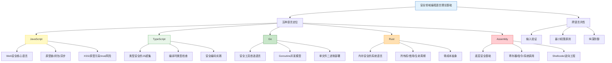
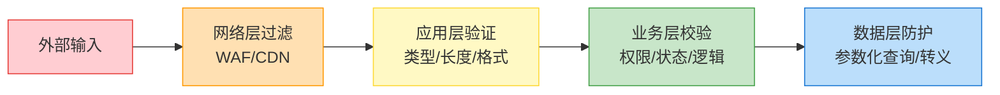
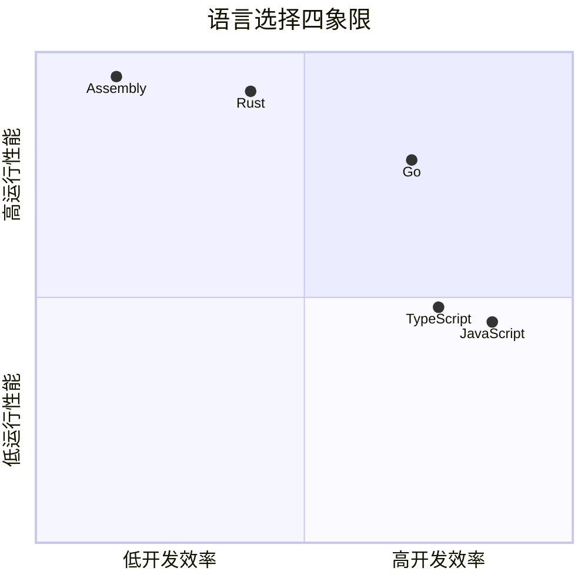

## 7. 理论基础总结

本节对 JS/TS/Go/Rust/Assembly 五种语言在安全领域的理论基础进行系统性梳理，帮助读者建立完整的知识框架，为后续的核心技巧和实战案例打下坚实根基。

### 7.1 知识体系全景图



### 7.2 五种语言的核心理论回顾

#### 7.2.1 JavaScript：Web安全的基石

JavaScript 是浏览器原生语言，也是整个 Web 安全攻防的核心战场。理解 JS 的理论基础，本质上就是理解浏览器如何执行代码、如何处理用户输入、以及如何被攻击者利用。

**三大核心机制：**

1. **原型链（Prototype Chain）**：JS 中每个对象都通过 `__proto__` 链接到其构造函数的 `prototype` 对象，形成一条查找链。攻击者可以通过污染 `Object.prototype` 来影响所有对象的行为，这就是原型链污染（Prototype Pollution）的原理——当服务端代码执行 `JSON.parse()` 解析用户输入后，如果直接将结果合并到目标对象，`__proto__` 字段会沿着原型链向上污染，导致任意属性注入。

2. **闭包（Closure）**：函数可以捕获其词法作用域中的变量，即使外部函数已经返回。这一特性使得 JS 在事件回调和异步编程中无处不在，但也带来了作用域逃逸和内存泄漏的安全隐患——如果闭包持有对敏感数据的引用，该数据的生命周期会被意外延长。

3. **异步编程模型**：基于事件循环（Event Loop）的单线程异步模型，通过 `Promise`/`async-await` 实现非阻塞 I/O。攻击者需要理解这一模型才能精准构造竞态条件攻击（TOCTOU），例如在认证检查和业务逻辑之间插入恶意操作。

**安全风险三要素：**

- **XSS（跨站脚本攻击）**：通过 `innerHTML`、`eval()`、`document.write()` 等将未过滤的用户输入直接插入 DOM，执行任意 JavaScript 代码。反射型 XSS 通过 URL 参数注入，存储型 XSS 通过数据库持久化，DOM 型 XSS 完全在客户端完成。
- **原型链污染**：`JSON.parse('{"__proto__": {"isAdmin": true}}')` 会导致所有对象继承 `isAdmin: true`，绕过权限检查。
- **ReDoS（正则表达式拒绝服务）**：含有嵌套量词的正则（如 `/^(a+)+$/`）在不匹配输入上触发灾难性回溯，消耗大量 CPU 时间。

#### 7.2.2 TypeScript：用类型系统构建安全防线

TypeScript 在 JavaScript 基础上增加了静态类型系统，其理论核心在于**将运行时错误前移到编译时发现**。对于安全开发而言，这意味着大量类型混淆、空值引用、API 误用等问题可以在代码部署前被拦截。

**类型安全的三个层次：**

1. **基础类型约束**：通过接口（`interface`）和类型别名（`type`）定义数据形状，确保函数接收和返回的数据结构符合预期。例如 `interface User { id: number; name: string }` 可以防止将字符串类型的 ID 传入期望数字的函数。

2. **高级类型操作**：联合类型（`A | B`）、交叉类型（`A & B`）、条件类型（`T extends U ? X : Y`）和映射类型（`Partial<T>`、`Readonly<T>`）提供了强大的类型推导能力，可以精确描述复杂的 API 契约。

3. **类型守卫与运行时桥梁**：TypeScript 的类型信息在编译后会被擦除（类型擦除），因此需要用类型守卫（`user is Admin`）、Zod 等校验库来确保运行时数据确实符合编译时的类型声明。这是 TS 安全开发中最容易被忽视的理论盲区——编译时通过不等于运行时安全。

**关键安全编码原则：**

- 用 `unknown` 代替 `any`，强制显式类型检查
- 开启 `strictNullChecks`，消除空值导致的运行时崩溃
- 对外部输入使用运行时校验库（Zod、io-ts），弥补类型擦除的缺口
- 枚举类型限制参数范围，防止非法值传入

#### 7.2.3 Go：安全工具的工程化语言

Go 语言在安全领域的理论优势可以归纳为三个词：**并发、简洁、可部署**。其设计哲学是"少即是多"——没有泛型（1.18 之前）、没有异常机制、没有继承，但正是这种克制带来了极高的工程效率和可维护性。

**并发模型的理论基础：**

Go 的并发模型基于 CSP（Communicating Sequential Processes）理论——Tony Hoare 在 1978 年提出的并发计算模型。核心思想是"不要通过共享内存来通信，而要通过通信来共享内存"。

- **Goroutine**：Go 运行时管理的轻量级协程，初始栈仅 2KB（可动态增长），单机可轻松创建数十万个。相比操作系统线程（通常 1-8MB 栈空间），goroutine 的创建和切换开销降低了 2-3 个数量级。
- **Channel**：类型安全的消息管道，用于 goroutine 之间的数据传递。无缓冲 channel 提供同步保证，带缓冲 channel 提供异步缓冲。
- **select 语句**：多路复用多个 channel 操作，实现超时控制和非阻塞通信。

这使得 Go 天然适合编写高并发安全工具——端口扫描器可以同时对数万个端口发起探测，漏洞扫描器可以并行检测数百个目标，而代码复杂度远低于传统的多线程方案。

**编译与部署优势：**

Go 编译为静态链接的单文件二进制，无需运行时依赖。交叉编译只需设置 `GOOS` 和 `GOARCH` 环境变量即可生成不同平台的可执行文件。对于安全工具而言，这意味着可以直接将二进制扔到目标机器上运行，无需安装 Python、Node.js 或任何依赖——在渗透测试场景中，目标机器上通常不会预装这些运行时。

**错误处理哲学：**

Go 没有 try-catch 异常机制，而是通过显式的 `error` 返回值处理错误。这种设计强制开发者在每个可能出错的地方做出决策——忽略错误需要显式地用 `_` 赋值，而不是像异常机制那样被意外吞掉。在安全工具中，每一个被忽略的错误都可能是一个安全漏洞的来源。

#### 7.2.4 Rust：编译时安全的终极方案

Rust 的理论核心是**在编译时通过所有权系统（Ownership System）消除一整类内存安全错误**，无需垃圾回收器的运行时开销。这对于安全领域意味着：如果代码能通过 Rust 编译器的检查，就可以在内存层面排除大量漏洞。

**所有权系统的三大支柱：**

1. **所有权规则**：每个值在任意时刻有且只有一个所有者；当所有者离开作用域时，值自动被释放（`drop`）。这一规则从根本上消除了双重释放（Double Free）和内存泄漏的可能性。

2. **借用检查器（Borrow Checker）**：在同一时刻，要么有多个不可变引用（`&T`），要么只有一个可变引用（`&mut T`），二者不能共存。这一规则在编译时消除了数据竞争（Data Race）——当多个线程同时访问同一数据且至少一个在写入时，Rust 编译器会直接拒绝编译。

3. **生命周期标注（Lifetime Annotation）**：通过 `'a` 标注引用的有效范围，确保引用不会指向已经被释放的内存——即悬垂引用（Dangling Reference）。编译器会验证所有引用的生命周期不超过其指向数据的生命周期。

**Rust 安全性的理论边界：**

Rust 的安全保证是**内存安全**，而非逻辑安全。它不能防止：
- 逻辑错误（如 off-by-one 漏洞在数组边界内）
- `unsafe` 代码块中的未定义行为
- 算法层面的拒绝服务攻击
- 密码学实现错误

`unsafe` 关键字是 Rust 的"逃生舱口"——在 `unsafe` 块中，开发者可以解引用裸指针、调用外部 C 函数、访问可变静态变量等。正确使用 `unsafe` 需要程序员自己维护安全不变量，编译器不再代为检查。安全领域的 Rust 代码应尽量将 `unsafe` 封装在经过充分审计的安全抽象之后。

#### 7.2.5 Assembly：理解底层的必经之路

汇编语言是 CPU 执行的最直接表达，学习汇编的理论意义在于**建立从高级语言到底层执行的完整心智模型**。在安全领域，不理解汇编就无法真正理解漏洞利用的工作原理。

**x86-64 架构要点：**

1. **寄存器体系**：x86-64 提供 16 个通用寄存器（RAX、RBX、RCX、RDX、RSI、RDI、RBP、RSP、R8-R15）和一个指令指针（RIP）。其中 RAX 用于函数返回值，RDI/RSI/RDX/RCX/R8/R9 用于传递前 6 个整型参数（System V AMD64 ABI），RSP 指向栈顶，RBP 指向栈帧基址。

2. **调用约定与栈帧**：函数调用时，调用者将参数放入指定寄存器，执行 `call` 指令（将返回地址压栈并跳转），被调用者通过 `push rbp; mov rbp, rsp` 建立栈帧。栈溢出漏洞（Buffer Overflow）就是通过覆写栈上的返回地址来劫持控制流。

3. **系统调用接口**：用户态程序通过 `syscall` 指令进入内核态，RAX 存放系统调用号，后续寄存器存放参数。理解系统调用是编写 Shellcode 的基础——Shellcode 本质上就是一组精心构造的系统调用序列。

**Shellcode 编写的核心挑战：**

- **避免坏字符**：`\x00`（null）会截断字符串拷贝，`\x0a`（换行）会截断 `gets()` 读取。需要通过等价指令替换来消除坏字符。
- **地址无关代码（PIC）**：Shellcode 不知道自身在内存中的加载地址，需要通过 `jmp-call-pop` 技术或 `lea` 指令获取当前位置。
- **极小化体积**：栈空间有限，Shellcode 通常需要控制在几百字节以内。

### 7.3 跨语言对比：安全特性矩阵

| 特性维度 | JavaScript | TypeScript | Go | Rust | Assembly |
|---------|-----------|-----------|-----|------|---------|
| **内存管理** | GC（V8） | GC（同JS） | GC | 所有权系统 | 手动管理 |
| **类型安全** | 动态类型 | 静态类型 | 静态类型 | 静态类型 | 无类型 |
| **并发安全** | 单线程+事件循环 | 同JS | Goroutine+Channel | 所有权+借用检查 | 无保证 |
| **缓冲区溢出** | 不可能 | 不可能 | 不可能 | 不可能 | 极高风险 |
| **编译时安全** | 无 | 部分 | 部分 | 强 | 无 |
| **运行时开销** | 中（JIT） | 中（同JS） | 低 | 极低 | 无 |
| **部署复杂度** | 需要运行时 | 需要编译+运行时 | 单二进制 | 单二进制 | 需要汇编器 |
| **安全工具开发** | 适合原型 | 适合中型项目 | 适合生产工具 | 适合安全关键组件 | 适合底层研究 |
| **学习曲线** | 低 | 中 | 中 | 高 | 极高 |

### 7.4 跨语言安全设计原则

无论使用哪种语言，以下三条安全设计原则贯穿始终：

**原则一：输入验证——洋葱模型**



每种语言实现输入验证的方式不同，但理念一致：**永远不信任外部输入，在每一层都做验证**。JS 用 DOMPurify 净化 HTML，TS 用 Zod 在运行时校验类型，Go 用结构体标签 + validator 库，Rust 用类型系统 + `Result` 强制处理错误路径。

**原则二：最小权限原则**

程序只应拥有完成其功能所必需的最小权限。Go 的 goroutine 可以通过 context 控制生命周期和超时；Rust 的所有权系统天然限制了数据的访问范围；JS 的 CSP（Content Security Policy）限制了脚本的执行权限。Assembly 层面，现代操作系统通过 NX（No-Execute）位、ASLR（地址空间布局随机化）、Stack Canary 等机制限制 Shellcode 的执行能力。

**原则三：纵深防御**

不依赖单一安全机制，而是在每一层都部署独立的防线。即使 JS 的 XSS 过滤被绕过，CSP 头可以阻止内联脚本执行；即使 Go 的输入验证存在缺陷，参数化查询可以防止 SQL 注入；即使 Rust 的 `unsafe` 代码存在内存错误，操作系统层面的 ASLR 可以增加利用难度。

### 7.5 语言选择的理论决策框架

选择安全工具的语言，本质上是在**开发效率、运行性能、内存安全、部署便利性**四个维度之间做权衡：



**决策规则：**

1. **快速原型验证 → JavaScript/TypeScript**：需要快速验证一个攻击思路或写一个 PoC 时，JS 的动态性和生态丰富性是最大优势。浏览器扩展、Burp Suite 插件、自动化脚本，JS 是首选。

2. **生产级安全工具 → Go**：需要部署到客户环境的扫描器、代理、监控系统，Go 的单二进制部署和高并发能力是无可替代的。Nuclei、Subfinder、httpx 等行业标准工具都选择 Go 并非偶然。

3. **安全关键组件 → Rust**：处理不可信输入的网络代理、解析器、加密库等组件，Rust 的编译时内存安全保证可以从根本上消除一整类漏洞。代价是更高的开发复杂度和更陡峭的学习曲线。

4. **底层研究与漏洞利用 → Assembly + C**：需要直接操作内存、编写 Shellcode、构造 ROP 链、分析恶意软件的底层工作，汇编是不可回避的基础。没有捷径，必须亲手写过 Shellcode 才能真正理解漏洞利用。

5. **跨平台 + 类型安全 → TypeScript**：当项目需要同时覆盖前端和后端（Electron 应用、全栈安全平台），TypeScript 提供了统一的类型系统和跨平台能力。

### 7.6 理论基础常见误区

| 误区 | 纠正 |
|------|------|
| "学安全只需要会 Python" | Python 适合快速脚本，但无法替代 JS（Web安全）、Go（工具开发）、Rust（系统编程）、Assembly（底层研究）各自不可替代的角色 |
| "TypeScript 的类型系统能保证运行时安全" | TS 的类型信息在编译后被擦除，运行时的外部输入仍需 Zod 等库进行校验，否则类型安全只是一纸空文 |
| "Go 有垃圾回收所以不存在内存安全问题" | Go 的 GC 防止了大多数内存错误，但 `unsafe` 包、CGO 调用、数据竞争仍可能导致未定义行为 |
| "Rust 编译通过就一定安全" | Rust 只保证内存安全，不保证逻辑安全。`unsafe` 块、算法错误、密码学误用等问题不会被编译器捕获 |
| "汇编太底层，现在没人用" | Shellcode 编写、恶意软件分析、漏洞利用开发、固件逆向等场景仍然离不开汇编。CTF PWN 竞赛中汇编能力直接决定成绩 |
| "安全工具用什么都行，语言不重要" | 语言选择直接影响工具的性能上限、部署复杂度、可维护性和安全属性。用 JS 写端口扫描器和用 Go 写，在并发能力上有数量级的差距 |

### 7.7 从理论到实践的桥梁

理论基础的学习最终要服务于实践。以下是每个理论模块到实际应用的映射关系：

```text
理论知识                    实践应用
─────────────────────────────────────────────────
JS 原型链机制        ──→   构造原型链污染 Payload
JS DOM 操作模型      ──→   编写 XSS 利用代码
TS 类型系统          ──→   设计类型安全的安全 API
Go Goroutine 模型    ──→   编写高并发端口扫描器
Go Channel 通信      ──→   实现任务分发和结果收集
Rust 所有权系统      ──→   开发无内存漏洞的网络代理
Rust 生命周期标注    ──→   安全地处理零拷贝缓冲区
x86-64 寄存器体系    ──→   阅读反汇编代码
Linux 系统调用       ──→   编写 execve Shellcode
栈帧结构             ──→   理解和利用栈溢出漏洞
```

在接下来的**核心技巧**部分，我们将把这些理论知识转化为可操作的技术手段；在**实战案例**部分，你将看到这些理论如何在真实的安全场景中发挥作用。

### 7.8 自测清单

完成理论基础学习后，用以下问题检验自己的掌握程度：

**JavaScript 理论：**
- [ ] 能解释原型链污染的完整触发路径
- [ ] 能区分反射型、存储型、DOM 型 XSS 的原理差异
- [ ] 能说明 Event Loop 的工作机制及其安全含义

**TypeScript 理论：**
- [ ] 能解释类型擦除的概念及其对运行时安全的影响
- [ ] 能说明 `unknown` 和 `any` 的本质区别
- [ ] 能解释为什么需要运行时校验库来弥补类型擦除

**Go 理论：**
- [ ] 能解释 Goroutine 与操作系统线程的区别
- [ ] 能说明 Channel 的同步语义（无缓冲 vs 带缓冲）
- [ ] 能解释 Go 的错误处理哲学及其对安全编码的影响

**Rust 理论：**
- [ ] 能解释所有权规则及其如何消除双重释放
- [ ] 能说明借用检查器如何防止数据竞争
- [ ] 能解释 `unsafe` 的作用和使用边界

**Assembly 理论：**
- [ ] 能列出 x86-64 的 6 个参数传递寄存器
- [ ] 能解释栈溢出如何劫持控制流
- [ ] 能说明 Shellcode 需要避免坏字符的原因

如果以上问题中有超过 3 个无法回答，建议回头重新阅读对应的理论基础章节。

***

> **下一步**：进入[核心技巧](../核心技巧/)部分，将理论知识转化为可操作的安全技术手段。
