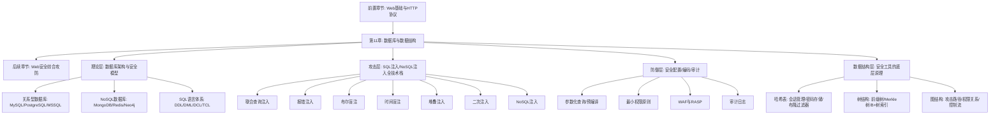
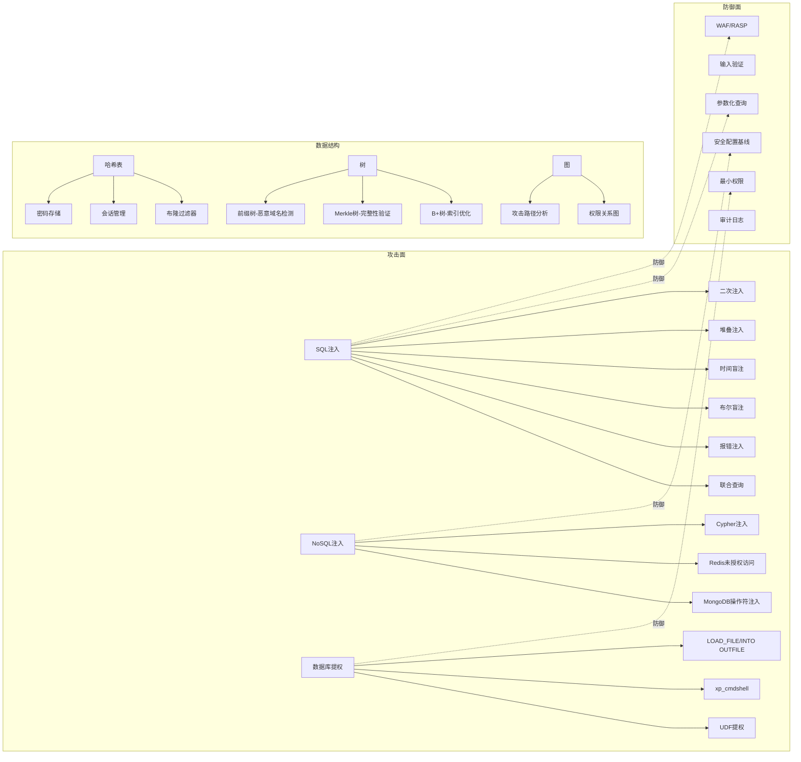

# 第11章 数据库与数据结构

## 为什么数据库安全是网络安全的核心战场

数据库是几乎所有应用系统的"心脏"——用户凭证、交易记录、业务数据、配置信息全部存储其中。对攻击者而言，拿下数据库意味着一次性获取最高价值的目标资产；对防御者而言，数据库安全是整个安全体系的最后一道防线。

一组数据可以说明问题的严重性：

- **OWASP Top 10 (2021)** 将"注入"（Injection）列为第三大安全风险，其中SQL注入占据注入类漏洞的绝大多数。在2017版中，注入曾连续多年排名第一。
- **IBM《数据泄露成本报告》(2024)** 显示，全球数据泄露平均成本达到488万美元，其中因数据库被攻破导致的泄露占比超过30%。
- **CVE数据库**中，仅MySQL相关的安全漏洞就有数百个，覆盖认证绕过、权限提升、信息泄露等多个类别。
- 2019年MongoDB勒索事件中，攻击者利用未授权访问在数天内清空了超过27,000个MongoDB实例的数据。
- 2023年MOVEit漏洞事件中，攻击者通过SQL注入窃取了数千家企业数据，影响人数超过6700万。

这些数字背后是一个残酷的现实：数据库安全不仅仅是"加个WAF"就能解决的问题。它需要从架构设计、编码规范、配置加固、监控审计等多个维度进行系统化防御。本章的目标就是让读者建立这种系统化的攻防认知。

## 本章定位与知识地图

在整本书的知识体系中，本章处于**承上启下的关键位置**：



**道法术器四个层次的对应关系：**

| 层次 | 含义 | 本章对应内容 |
|------|------|-------------|
| **道** | 核心原理与认知 | SQL注入的本质（代码与数据边界模糊）、数据库安全模型（认证→授权→审计的纵深防御） |
| **法** | 方法论与框架 | 注入检测方法论（判断注入点→判断列数→定位回显→提取数据）、安全配置基线体系 |
| **术** | 具体技术与技巧 | 联合查询、报错注入、盲注、堆叠注入、二次注入、NoSQL注入等具体技术 |
| **器** | 工具与自动化 | sqlmap、NoSQLMap、数据库审计工具、安全扫描器的使用 |

## 学习目标

通过本章的系统学习，读者将获得以下能力：

**基础能力（入门级）**
1. 理解关系型数据库和NoSQL数据库的核心架构差异
2. 掌握SQL语言的DDL/DML/DCL语法，能读懂和编写基本SQL语句
3. 理解SQL注入的根本成因——用户输入与SQL代码的边界模糊
4. 能够使用手工方式完成最基础的SQL注入检测

**核心能力（进阶级）**
5. 熟练掌握联合查询注入、报错注入、布尔盲注、时间盲注、堆叠注入等全部主流注入技术
6. 理解并实践二次注入（Second-Order Injection）的利用链
7. 掌握MongoDB和Redis等NoSQL数据库的注入与未授权访问攻击
8. 能够从数据库权限提升到操作系统权限（数据库提权）
9. 理解参数化查询、存储过程、WAF等防御机制的原理和绕过思路

**高阶能力（专家级）**
10. 能够设计和评估企业级数据库安全架构
11. 掌握数据库安全审计工具的使用和日志分析
12. 理解哈希表、树、图等数据结构在安全工具中的应用原理
13. 能够针对特定业务场景定制数据库安全防护方案

## 内容结构

本章按照"理论→技术→实战→反思→练习"的递进逻辑组织，共分为六个部分：

### 第一部分：理论基础（理论基础/目录）

本部分建立数据库安全的知识地基，涵盖9个核心主题：

| 文件 | 主题 | 核心内容 |
|------|------|---------|
| 01-关系型数据库基础 | SQL与MySQL/PostgreSQL架构 | SQL语言体系（DDL/DML/DCL）、MySQL四层安全模型（网络层→认证层→授权层→审计层）、PostgreSQL行级安全策略、pg_hba.conf认证配置 |
| 02-NoSQL数据库基础 | MongoDB/Redis架构与安全 | MongoDB文档模型与BSON格式、Redis五种数据类型（String/Hash/List/Set/ZSet）、默认安全配置问题 |
| 03-数据结构基础 | 安全场景中的数据结构 | 哈希表（密码存储/会话管理/布隆过滤器/HashDoS攻击）、树结构（前缀树用于恶意域名检测、Merkle树用于完整性验证、B+树用于索引理解）、图结构（攻击路径分析/权限关系图/控制流图） |
| 04-SQL注入原理 | 注入的本质与分类 | 注入三要素（输入拼接→SQL执行→结果返回）、按位置分类（GET/POST/Cookie/HTTP头/二阶）、按获取方式分类（联合查询/报错/布尔盲注/时间盲注/堆叠）、按数据库类型分类 |
| 05-数据库安全配置基线 | 加固操作指南 | MySQL六项加固（删除匿名用户/禁止远程root/删除测试库/强密码策略/审计日志/限制文件操作）、MongoDB五项加固（启用认证/应用专用用户/TLS/限制网络/审计） |
| 06-理论基础总结 | 知识点回顾 | 融会贯通，建立完整的理论认知框架 |
| 07-SQL注入深度分析 | 高级注入原理 | 深入分析注入的底层机制，为后续高级技巧做铺垫 |
| 08-数据库安全防护方案 | 纵深防御体系 | 从架构层面设计多层防护方案 |
| 09-安全防护方案续 | 防护落地细节 | 具体的防护配置和实施步骤 |

**学习建议：** 理论基础部分是整个章节的根基。即使是有经验的安全从业者，也建议快速浏览以确认自己对数据库安全模型的理解是否完整。特别要关注MySQL的四层安全模型和PostgreSQL的行级安全策略——这些是理解后续攻击和防御的关键框架。

### 第二部分：核心技巧（核心技巧/目录）

本部分是全章的技术核心，系统讲解10种注入与利用技术：

| 文件 | 技术 | 难度 | 关键要点 |
|------|------|------|---------|
| 01-SQL注入基础 | 手动注入流程 | ★★☆☆☆ | 四步法：判断注入点→判断列数（ORDER BY）→定位回显（UNION SELECT）→提取数据。覆盖数字型和字符型两种注入点判断方式 |
| 02-报错注入 | 利用错误信息回显 | ★★★☆☆ | extractvalue()、updatexml()、floor()三大报错函数的原理和Payload构造。适用于页面会显示数据库错误信息但不直接显示查询结果的场景 |
| 03-盲注技术 | 无回显数据提取 | ★★★★☆ | 布尔盲注（通过页面差异逐位判断）和时间盲注（通过SLEEP/IF组合逐位判断）。这是实战中最常见的注入场景，因为大多数生产环境不会回显查询结果 |
| 04-堆叠注入 | 执行多条SQL语句 | ★★★★☆ | 利用mysqli_multi_query()等函数执行多条SQL。可以执行INSERT/UPDATE/DELETE等非SELECT操作，危害极大但受限于API和WAF |
| 05-NoSQL注入 | MongoDB/Redis攻击 | ★★★☆☆ | MongoDB的$gt/$ne操作符绕过认证、JavaScript注入（$where子句）、Redis未授权访问的利用链（写入WebShell、写入SSH公钥、创建定时任务） |
| 06-二次注入 | 存储后触发的注入 | ★★★★★ | 数据先被存储（看似安全），在后续查询中被不安全地拼接使用。最经典的例子是注册用户名为`admin'--`，在密码重置功能中触发。需要理解应用的完整数据流才能发现 |
| 07-SQL注入防御 | 防御体系 | ★★★☆☆ | 参数化查询（根本方法）、输入验证（白名单优于黑名单）、最小权限原则、WAF部署、ORM框架的安全使用。同时讲解各防御措施的已知绕过方法 |
| 08-核心技巧总结 | 技术回顾 | ★★☆☆☆ | 将10种技术进行横向对比，建立选择策略 |
| 09-NoSQL注入深度技术 | 高级NoSQL攻击 | ★★★★☆ | 更深入的MongoDB注入技巧、Redis Lua脚本注入、图数据库Cypher注入 |
| 10-数据库安全审计工具 | 工具使用 | ★★☆☆☆ | sqlmap高级用法、NoSQLMap、数据库审计工具、日志分析方法 |

**技术选择决策树：**

```text
发现注入点后，如何选择注入技术？
│
├── 页面是否直接显示查询结果？
│   ├── 是 → 联合查询注入（最快、最直接）
│   └── 否 → 页面是否有数据库错误信息？
│       ├── 是 → 报错注入（extractvalue/updatexml/floor）
│       └── 否 → 页面内容是否会根据条件变化？
│           ├── 是 → 布尔盲注（逐字符判断）
│           └── 否 → 时间盲注（通过延迟判断）
│
├── 是否支持多语句执行？
│   ├── 是 → 堆叠注入（可执行任意SQL）
│   └── 否 → 只能使用单语句注入技术
│
└── 目标是NoSQL数据库？
    ├── MongoDB → MongoDB注入（$gt/$ne/$where）
    └── Redis → 未授权访问利用链
```

### 第三部分：实战案例（实战案例/目录）

本部分通过8个真实场景的完整复现，将理论和技术转化为可操作的实战能力：

| 案例 | 场景 | 核心技能 |
|------|------|---------|
| 案例一：联合查询注入获取管理员密码 | 攻击一个存在SQL注入的登录页面，通过UNION SELECT获取管理员密码哈希，然后使用彩虹表破解 | 联合查询注入的完整流程、information_schema的使用、密码哈希破解 |
| 案例二：时间盲注提取数据库 | 在无回显的环境下，通过时间延迟逐字符提取数据库名、表名和数据 | 时间盲注的Payload构造、自动化脚本编写、效率优化 |
| 案例三：MongoDB注入绕过认证 | 利用MongoDB的$gt操作符绕过登录认证，获取管理员权限 | NoSQL注入原理、$gt/$ne/$regex操作符的利用 |
| 案例四：Redis未授权访问拿下服务器 | 利用未配置认证的Redis实例，通过写入SSH公钥获取服务器shell | Redis未授权访问利用链、SSH公钥写入、crontab定时任务 |
| 案例五：二次注入修改管理员密码 | 通过注册恶意用户名，在密码重置功能中触发二次注入，修改管理员密码 | 二次注入的发现和利用、数据流分析 |
| 案例六：MongoDB未授权访问导致数据泄露 | 扫描互联网上未配置认证的MongoDB实例，提取敏感数据 | MongoDB安全配置审计、Shodan/ZoomEye等搜索引擎的使用 |
| 案例七：Redis未授权访问写入WebShell | 利用Redis的CONFIG SET和dir/dbfilename参数写入PHP WebShell | Redis文件写入技巧、路径遍历、WebShell构造 |

每个案例都包含**完整的攻击链**：环境搭建→信息收集→漏洞发现→漏洞利用→权限获取→痕迹清理，确保读者能在隔离环境中完整复现。

### 第四部分：常见误区（04-常见误区.md）

识别和纠正常见的认知偏差和技术错误，包括但不限于：

- "有WAF就不用防SQL注入了"——WAF可以被绕过，参数化查询才是根本
- "NoSQL数据库不会被注入"——MongoDB的$gt操作符注入、Redis的Lua脚本注入都是真实威胁
- "盲注只能手工做"——自动化工具和脚本可以大幅提升效率
- "参数化查询100%安全"——存储过程中的动态SQL、LIKE子句的通配符仍需注意
- "数据库不暴露到公网就安全了"——SQL注入通过Web应用间接访问数据库，不需要直接连接

### 第五部分：练习方法（05-练习方法.md）

提供从入门到精通的系统化学习路径：

- **环境搭建**：使用Docker快速部署包含漏洞的靶场环境（SQLi-labs、DVWA、WebGoat）
- **循序渐进**：从手工注入基础练习开始，逐步过渡到自动化工具使用，最终挑战CTF题目
- **实战导向**：推荐VulnHub、HackTheBox等平台的数据库相关靶机
- **能力评估**：每个阶段的自测标准和进阶条件

### 第六部分：本章小结（06-本章小结.md）

总结本章核心知识点，建立完整的技术图谱，并为后续章节的学习做好衔接。

### 深度拓展（07-深度拓展.md）

为高阶读者提供更深层次的技术探讨，包括数据库安全的前沿话题和高级攻防技术。

## 前置知识

学习本章前，读者应具备以下基础知识。不具备也不必担心，但了解这些会让你的学习效率大幅提升：

| 前置知识 | 要求程度 | 与本章的关联 |
|----------|---------|-------------|
| **Web开发基础（HTML、HTTP协议）** | 熟悉 | 理解注入点的位置（URL参数、表单、Cookie、HTTP头）需要HTTP协议基础。不了解HTTP请求结构就无法理解为什么注入可以从GET/POST/Cookie/HTTP头等多个位置发生 |
| **至少一门编程语言（Python或JavaScript）** | 基础即可 | 编写盲注自动化脚本、理解Web应用与数据库的交互方式、使用sqlmap等工具。Python是最常用的安全脚本语言 |
| **Linux命令行基础** | 熟悉 | 数据库提权后的操作系统操作、Redis未授权访问中的SSH公钥写入和crontab利用 |
| **计算机网络基础** | 了解 | 理解数据库的网络通信（MySQL默认3306端口、Redis默认6379端口）、防火墙配置、内网渗透中的数据库利用 |

**如果缺少前置知识的补救方案：**
- Web开发基础：先完成本书前面的Web基础章节，或在MDN Web Docs上学习HTTP协议
- 编程语言：推荐Python，可以在Codecademy或廖雪峰Python教程上快速入门
- Linux基础：安装一个Ubuntu虚拟机，跟着Linux命令行基础教程练习一周即可

## 学习时间建议

根据读者的现有水平，以下是各部分的时间投入建议：

| 内容模块 | 初学者 | 有经验者 | 专家级 |
|----------|--------|---------|--------|
| 数据库基础与SQL语言 | 15-20小时 | 5-8小时 | 1-2小时（浏览确认） |
| SQL注入原理与基础技术 | 20-25小时 | 10-15小时 | 3-5小时 |
| 高级注入技术（盲注/堆叠/二次注入） | 25-30小时 | 15-20小时 | 5-8小时 |
| NoSQL注入与利用 | 10-15小时 | 8-10小时 | 3-5小时 |
| 数据结构安全应用 | 10-15小时 | 5-8小时 | 2-3小时 |
| 实战案例复现 | 20-30小时 | 15-20小时 | 8-10小时 |
| **总计** | **100-135小时** | **58-81小时** | **22-33小时** |
| **全日制学习参考** | **5-7周** | **3-4周** | **1-2周** |

**高效学习策略：**
- 先通读理论基础部分，建立知识框架（不要跳过，即使你有经验）
- 核心技巧部分边学边练，每学一种技术就在靶场中实践
- 实战案例部分先自己尝试，遇到困难再看解答
- 最后做常见误区部分的自测，查漏补缺

## 数据库类型速查

不同类型数据库的安全攻击面差异巨大。下表帮助读者快速建立全局认知：

| 数据库类型 | 代表产品 | 数据模型 | 默认端口 | 典型应用场景 | 核心攻击面 | OWASP关注度 |
|-----------|---------|---------|---------|-------------|-----------|------------|
| 关系型 | MySQL | 行列表（关系模型） | 3306 | Web应用、企业系统、电商 | SQL注入、权限配置不当、UDF提权 | ★★★★★ |
| 关系型 | PostgreSQL | 行列表（关系模型） | 5432 | 金融系统、地理信息、大型应用 | SQL注入、COPY命令执行、大对象写文件 | ★★★★☆ |
| 关系型 | MSSQL | 行列表（关系模型） | 1433 | Windows企业环境、.NET应用 | SQL注入、xp_cmdshell执行、链接服务器 | ★★★★☆ |
| 关系型 | SQLite | 单文件数据库 | 无（嵌入式） | 移动应用、嵌入式系统、浏览器 | SQL注入、数据库文件读取、ATTACH DATABASE | ★★★☆☆ |
| 文档型 | MongoDB | JSON/BSON文档 | 27017 | 大数据、日志存储、内容管理 | NoSQL注入（$gt/$ne）、未授权访问、JavaScript注入 | ★★★★☆ |
| 键值型 | Redis | 键值对 | 6379 | 缓存、会话存储、消息队列 | 未授权访问、文件写入（WebShell/SSH）、Lua注入 | ★★★★☆ |
| 图数据库 | Neo4j | 节点+边（属性图） | 7474/7687 | 社交网络、推荐系统、知识图谱 | Cypher注入、未授权访问 | ★★☆☆☆ |
| 时序数据库 | InfluxDB | 时间序列 | 8086 | IoT、监控、指标存储 | 认证绕过、未授权数据访问 | ★★☆☆☆ |
| 搜索引擎 | Elasticsearch | JSON文档（倒排索引） | 9200 | 全文搜索、日志分析（ELK） | 未授权访问、Script注入、数据泄露 | ★★★☆☆ |

## 本章核心攻防知识框架

以下是本章所有知识点之间的逻辑关系，帮助读者建立全局视角：



## 学习路径推荐

根据不同目标，推荐不同的学习路径：

**路径A：Web渗透测试工程师（最常见）**
> 理论基础（快速浏览）→ SQL注入基础 → 联合查询注入 → 报错注入 → 盲注技术 → 堆叠注入 → 二次注入 → 实战案例1-5 → 常见误区 → sqlmap工具

**路径B：数据库安全管理员（防御导向）**
> 理论基础（深入学习）→ 数据库安全配置基线 → SQL注入原理（理解攻击才能防御）→ SQL注入防御 → 安全防护方案 → 审计工具 → 常见误区

**路径C：全栈安全研究员（深度研究）**
> 全部内容按顺序学习 → 深度拓展 → 尝试发现新的注入技术或绕过方法 → 向安全社区提交技术文章

**路径D：CTF竞赛选手（实战导向）**
> SQL注入基础 → 报错注入 → 盲注技术 → 堆叠注入 → 二次注入 → NoSQL注入 → 实战案例全部 → CTF平台练习（SQLi-labs、BUUCTF、攻防世界）

---

> ⚠️ **安全警告与免责声明**
>
> 本章内容仅供**合法的安全测试与教育目的**使用。所有技术、工具和方法的讨论均旨在帮助安全从业者在**获得明确授权**的前提下进行防御性安全研究。
>
> - 🚫 **未经授权**对任何系统、网络或应用进行安全测试是**违法行为**，可能触犯《中华人民共和国网络安全法》《刑法》第285条（非法侵入计算机信息系统罪）和第286条（破坏计算机信息系统罪）
> - ✅ 所有实践活动应在**隔离的实验环境**中进行（如Docker容器、虚拟机、CTF靶场平台）
> - ✅ 遵守所在国家和地区的**网络安全法律法规**
> - ✅ 遵循**负责任的漏洞披露**原则——发现漏洞后通过合法渠道报告给厂商
> - ✅ 在企业内部进行渗透测试前，必须获得**书面授权**（渗透测试授权书）
>
> 作者不对因滥用本章内容造成的任何后果承担责任。
