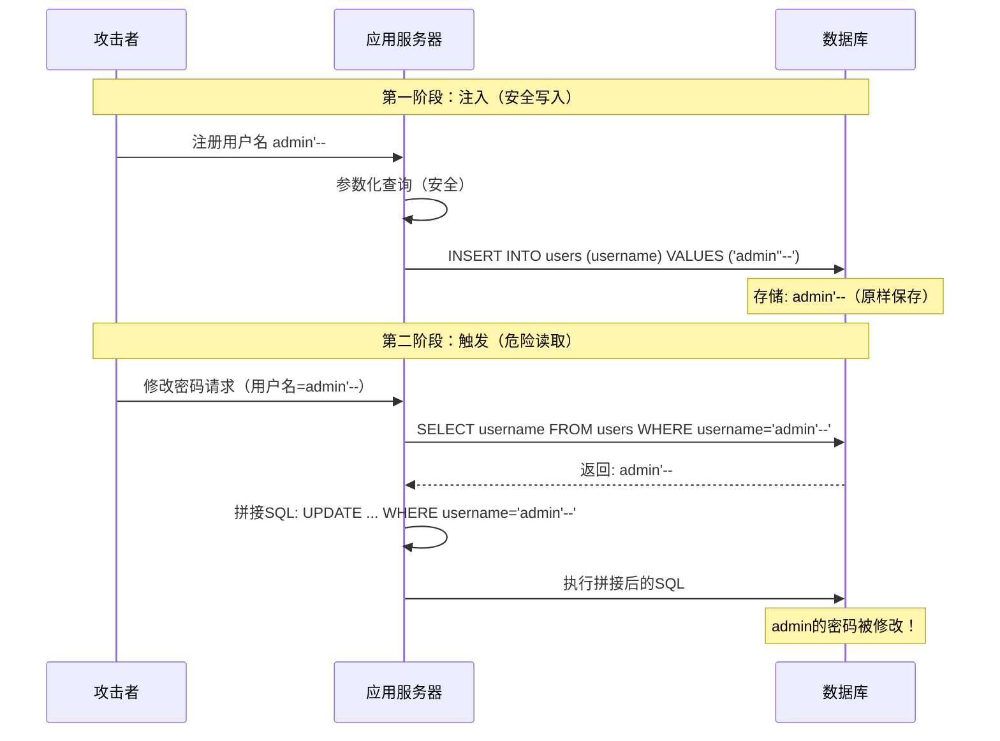

## 案例五：二次注入修改管理员密码

二次注入（Second-Order SQL Injection）是SQL注入家族中最容易被忽视的漏洞类型。开发者在写入数据库时使用了参数化查询，误以为已经"安全了"，却忽略了读取数据后再次拼接的危险。本案例通过一个用户管理系统的完整攻防过程，彻底拆解二次注入的原理、利用与防御。

### 5.1 一次注入 vs 二次注入：本质区别

理解二次注入之前，先搞清楚它和一次注入（First-Order Injection）的根本差异：

| 维度 | 一次注入（First-Order） | 二次注入（Second-Order） |
|------|------------------------|--------------------------|
| 触发时机 | 输入后**立即**执行恶意SQL | 输入先被存储，**后续操作**才触发 |
| 攻击路径 | 用户输入 → SQL拼接 → 执行 | 用户输入 → 安全存储 → 读取 → SQL拼接 → 执行 |
| 漏洞位置 | 写入点（INSERT/UPDATE的输入处理） | 读取后的二次使用点 |
| 防御难度 | 参数化查询即可解决 | 需要全链路安全意识 |
| 常见诱因 | 开发者偷懒直接拼接 | 开发者认为"从数据库读出的数据是可信的" |

核心认知：**数据库是不可信数据的中转站，不是消毒站。** 参数化查询能防止恶意数据在写入时被执行为SQL代码，但它不会改变数据本身的值。恶意payload原样存储在数据库中，等待被后续的不安全代码捞出来利用。



### 5.2 漏洞代码深度剖析

以下是一个典型的用户管理系统，其中 `register` 方法安全，`change_password` 方法存在二次注入：

```python
# user_manager.py
import hashlib
import pymysql

class UserManager:
    def __init__(self):
        self.conn = pymysql.connect(
            host='localhost',
            user='root',
            password='',
            db='user_db',
            charset='utf8mb4'
        )
    
    def register(self, username, password):
        """注册用户 - 安全（参数化查询）"""
        cursor = self.conn.cursor()
        # 安全：使用 %s 占位符，pymysql自动处理转义
        query = "INSERT INTO users (username, password) VALUES (%s, %s)"
        cursor.execute(query, (username, hashlib.md5(password.encode()).hexdigest()))
        self.conn.commit()
    
    def change_password(self, username, new_password):
        """修改密码 - 存在二次注入漏洞！"""
        cursor = self.conn.cursor()
        
        # 第一步：从数据库获取用户名（参数化，安全）
        cursor.execute(
            "SELECT username FROM users WHERE username = %s", (username,)
        )
        result = cursor.fetchone()
        if not result:
            return False
        
        stored_username = result[0]  # 从数据库读出，可能是恶意payload
        
        # 第二步：漏洞点！直接拼接从数据库读出的值
        # 开发者认为 stored_username 来自数据库，是"安全的"
        # 错！它可能包含 admin'-- 这样的恶意内容
        query = (
            f"UPDATE users SET password = "
            f"'{hashlib.md5(new_password.encode()).hexdigest()}' "
            f"WHERE username = '{stored_username}'"  # 危险拼接
        )
        cursor.execute(query)  # 执行拼接后的SQL
        self.conn.commit()
        return True
```

**漏洞根因分析：**

开发者在 `change_password` 中犯了一个典型错误——**信任数据库返回的数据**。代码分两步走：

1. 第一步用参数化查询从数据库安全地取出了 `stored_username`（值为 `admin'--`）
2. 第二步直接把这个值用 f-string 拼接进 SQL 语句

第二步中，`stored_username` 的值 `admin'--` 被原样代入 SQL，生成：

```sql
UPDATE users SET password = '5f4dcc3b5aa765d61d8327deb882cf99' WHERE username = 'admin'--'
```

`--` 是SQL注释符，`'` 被注释掉，实际等价于：

```sql
UPDATE users SET password = '5f4dcc3b5aa765d61d8327deb882cf99' WHERE username = 'admin'
```

**admin 用户的密码被修改为攻击者设定的值。**

### 5.3 完整攻击流程

攻击分为四个阶段，每一步都有明确目的：

**阶段一：注册恶意账户**

```python
manager = UserManager()
manager.register("admin'--", "attacker123")
```

数据库中存储的记录：

```text
+----+------------+----------------------------------+
| id | username   | password                         |
+----+------------+----------------------------------+
|  1 | admin      | e10adc3949ba59abbe56e057f20f883e |
|  2 | admin'--   | 4297f44b13955235245b2497399d7a93 |
+----+------------+----------------------------------+
```

注意：`register` 使用参数化查询，`admin'--` 被安全存储为普通字符串，不会触发任何SQL注入。

**阶段二：登录恶意账户**

攻击者使用 `admin'--` 作为用户名、`attacker123` 作为密码正常登录。此时攻击者拥有一个看似普通的用户账户，没有任何异常行为。

**阶段三：触发二次注入**

```python
# 攻击者请求修改自己的密码
manager.change_password("admin'--", "hacked_password")
```

内部执行流程：

```text
1. 参数化查询: SELECT username FROM users WHERE username = 'admin''--'
   → 返回: admin'--

2. 拼接SQL:
   UPDATE users SET password = '4297f44b13955235245b2497399d7a93'
   WHERE username = 'admin'--'

3. 实际执行（注释生效）:
   UPDATE users SET password = '4297f44b13955235245b2497399d7a93'
   WHERE username = 'admin'
```

**阶段四：接管管理员账户**

攻击者使用用户名 `admin`、密码 `hacked_password` 登录，成功接管管理员账户。

### 5.4 变体攻击：不只是修改密码

二次注入的危害远不止修改密码。以下是常见的变体攻击场景：

**变体一：权限提升（role字段注入）**

假设存在一个更新用户资料的函数：

```python
def update_profile(self, username, email):
    cursor = self.conn.cursor()
    cursor.execute("SELECT username FROM users WHERE username = %s", (username,))
    stored = cursor.fetchone()[0]
    
    # 漏洞拼接
    query = f"UPDATE users SET email = '{email}' WHERE username = '{stored}'"
    cursor.execute(query)
    self.conn.commit()
```

攻击者注册用户名 `admin' OR '1'='1`，触发后：

```sql
UPDATE users SET email = 'attacker@evil.com' WHERE username = 'admin' OR '1'='1'
```

所有用户的邮箱被修改为攻击者的邮箱，攻击者可以通过"忘记密码"功能重置任意账户。

**变体二：数据窃取（UNION注入）**

注册用户名 `admin' UNION SELECT password FROM admin_users WHERE '1'='1`，配合特定的查询逻辑，可以将敏感数据暴露到可观察的输出中。

**变体三：堆叠注入（Stacked Queries）**

如果数据库支持多语句执行（如MySQL的 `multi_statements=True`、PostgreSQL默认支持），注册：

```text
admin'; DROP TABLE users; --
```

在后续拼接操作中可能执行毁灭性的DDL语句。不过实际利用中，堆叠注入对MySQL的限制较大，需要特定的连接配置。

### 5.5 不同数据库的利用差异

不同数据库对二次注入的利用方式存在差异：

| 数据库 | 注释符 | 字符串转义 | 堆叠支持 | 利用难度 |
|--------|--------|-----------|----------|---------|
| MySQL | `-- ` (注意空格)、`#` | `\'` 或 `''` | 需 `multi_statements=True` | 中等 |
| PostgreSQL | `--` | `''` 或 `\'` | 默认支持 | 较低 |
| MSSQL | `--` | `''` | 默认支持 | 较低 |
| SQLite | `--` | `''` | 默认支持 | 较低 |
| Oracle | `--` | `''` | 需 `EXECUTE IMMEDIATE` | 较高 |

**MySQL的关键差异：**

```python
# MySQL连接配置影响堆叠注入
pymysql.connect(host='localhost', user='root', password='',
                db='user_db', client_flag=CLIENT.MULTI_STATEMENTS)
# 如果设置了 MULTI_STATEMENTS，堆叠注入才能生效
# pymysql 默认不启用，因此堆叠注入在默认配置下不可用
```

**PostgreSQL的特殊之处：**

PostgreSQL的 `psycopg2` 驱动默认不支持在同一 `cursor.execute()` 中执行多条语句，但可以通过 `COPY` 命令、`pg_sleep()` 时间盲注等方式利用二次注入。

### 5.6 检测方法

**静态分析（代码审计）：**

检测二次注入的核心思路：追踪从数据库读取的数据是否被不安全地用于构建SQL语句。

```text
审计检查清单：
1. 搜索所有 SELECT 语句，标记返回值的存储变量
2. 追踪这些变量是否出现在后续的 SQL 拼接中
3. 重点检查：
   - f-string / format() / % 格式化
   - 字符串拼接 (+)
   - .join() 构建SQL
4. 特别关注涉及 WHERE 条件的拼接
```

**自动化工具扫描：**

```bash
# Semgrep 规则检测Python中的SQL拼接
semgrep --config=p/sql-injection --lang=python ./src/

# Bandit 安全扫描（Python专用）
bandit -r ./src/ -s B608  # B608: SQL injection via string formatting

# CodeQL 查询（适用于大型代码库）
# 查找：数据库读取值 → 字符串格式化 → SQL执行 的数据流
```

**动态测试（渗透测试）：**

```python
# 二次注入检测脚本
import requests
import time

BASE_URL = "http://target.com"

# 步骤1: 注册包含payload的用户名
payloads = [
    "test' AND 1=1--",
    "test' AND 1=2--",
    "test' AND SLEEP(3)--",
    "test' OR '1'='1",
]

for payload in payloads:
    # 注册
    requests.post(f"{BASE_URL}/register", data={
        "username": payload,
        "password": "test123"
    })
    
    # 登录
    session = requests.Session()
    session.post(f"{BASE_URL}/login", data={
        "username": payload,
        "password": "test123"
    })
    
    # 触发修改密码，观察行为差异
    start = time.time()
    session.post(f"{BASE_URL}/change_password", data={
        "new_password": "newpass123"
    })
    elapsed = time.time() - start
    
    if elapsed > 3:
        print(f"[!] 时间盲注确认: {payload}")
```

### 5.7 完整修复方案

**核心原则：所有用于构建SQL语句的数据，无论来源，都必须使用参数化查询。**

```python
def change_password(self, username, new_password):
    """安全的修改密码 - 全链路参数化"""
    cursor = self.conn.cursor()
    
    # 方案一：直接用原始用户名参数化查询（推荐）
    # 不需要先从数据库读出来再拼接
    query = "UPDATE users SET password = %s WHERE username = %s"
    cursor.execute(query, (
        hashlib.md5(new_password.encode()).hexdigest(),
        username  # 直接使用原始输入，参数化处理
    ))
    self.conn.commit()
    return True
```

```python
def change_password_safe_v2(self, username, new_password):
    """安全方案二：即使从数据库读取，也用参数化"""
    cursor = self.conn.cursor()
    
    # 第一步：安全读取
    cursor.execute(
        "SELECT id FROM users WHERE username = %s", (username,)
    )
    result = cursor.fetchone()
    if not result:
        return False
    
    user_id = result[0]
    
    # 第二步：用id（整数）而不是username来更新
    # id是自增主键，不存在注入风险
    query = "UPDATE users SET password = %s WHERE id = %s"
    cursor.execute(query, (
        hashlib.md5(new_password.encode()).hexdigest(),
        user_id
    ))
    self.conn.commit()
    return True
```

**最佳实践对比：**

| 方案 | 安全性 | 可读性 | 推荐度 |
|------|--------|--------|--------|
| 直接参数化（方案一） | 高 | 高 | ★★★★★ |
| 用主键ID替代（方案二） | 高 | 中 | ★★★★☆ |
| 手动转义（不推荐） | 中（易遗漏） | 低 | ★★☆☆☆ |
| ORM自动处理 | 高 | 高 | ★★★★★ |

### 5.8 纵深防御策略

仅靠参数化查询一层防护不够，真正的安全需要多层防御：

**第一层：输入验证**

```python
import re

def validate_username(username: str) -> bool:
    """用户名只允许字母、数字、下划线"""
    if not username or len(username) > 32:
        return False
    return bool(re.match(r'^[a-zA-Z0-9_]+$', username))

# 在注册时调用
if not validate_username(username):
    raise ValueError("用户名只能包含字母、数字和下划线")
```

**第二层：ORM隔离**

```python
# 使用 SQLAlchemy ORM，彻底避免手写SQL
from sqlalchemy import create_engine, Column, Integer, String
from sqlalchemy.orm import declarative_base, Session

Base = declarative_base()

class User(Base):
    __tablename__ = 'users'
    id = Column(Integer, primary_key=True)
    username = Column(String(32), unique=True, nullable=False)
    password = Column(String(64), nullable=False)

def change_password_orm(session: Session, username: str, new_password: str):
    """ORM方式修改密码 - 无SQL拼接"""
    user = session.query(User).filter(User.username == username).first()
    if user:
        user.password = hashlib.md5(new_password.encode()).hexdigest()
        session.commit()
        return True
    return False
```

**第三层：最小权限原则**

```sql
-- 数据库用户只授予必要权限
CREATE USER 'app_user'@'localhost' IDENTIFIED BY 'strong_password';
GRANT SELECT, INSERT, UPDATE ON user_db.users TO 'app_user'@'localhost';
-- 不授予 DELETE、DROP、ALTER 等高危权限
-- 即使注入成功，也无法执行破坏性操作
```

**第四层：审计日志**

```python
import logging

sql_logger = logging.getLogger('sql_audit')

def execute_query_safe(self, query, params):
    """带审计的查询执行"""
    sql_logger.info(f"Query: {query} | Params: {params}")
    cursor = self.conn.cursor()
    cursor.execute(query, params)
    
    # 检测异常：UPDATE/DELETE 影响行数过多
    if query.strip().upper().startswith(('UPDATE', 'DELETE')):
        if cursor.rowcount > 100:
            sql_logger.warning(
                f"Mass operation detected: {cursor.rowcount} rows affected "
                f"by query: {query}"
            )
    
    return cursor
```

### 5.9 常见误区与纠正

**误区一："我用了参数化查询，所以没有SQL注入"**

纠正：参数化查询只保护**当前这次**SQL执行。如果参数化取出的数据又被拼接进下一条SQL，二次注入仍然存在。安全必须贯穿整个数据生命周期。

**误区二："数据库里的数据是可信的"**

纠正：数据库只是数据的存储介质，它不会对数据做任何"消毒"处理。存进去什么，取出来就是什么。来自数据库的数据必须和来自用户输入的数据同等对待。

**误区三："转义一下就行了"**

纠正：手动转义是最脆弱的防御方式。不同数据库的转义规则不同，不同字符集下转义行为可能不一致，开发者极易遗漏边界情况。参数化查询由数据库驱动在协议层处理，远比手动转义可靠。

**误区四："二次注入很难利用，实际危害不大"**

纠正：二次注入的触发条件确实比一次注入多一步，但一旦存在，利用门槛极低。攻击者只需要注册一个账号就能完成整个攻击链，不需要任何特殊权限或技术条件。而且二次注入能直接修改数据、提升权限，危害等级与一次注入相当。

**误区五："WAF能防住二次注入"**

纠正：WAF（Web应用防火墙）主要检测HTTP请求中的恶意payload。二次注入的恶意数据在写入时是完全合法的HTTP请求，触发时的HTTP请求也是合法的。WAF几乎无法检测二次注入，因为恶意SQL始终在应用内部流转，不经过WAF的检测点。

### 5.10 进阶：自动化二次注入检测

对于大型代码库，手动审计二次注入不现实。以下是自动化检测方案：

**Python AST 静态分析器：**

```python
import ast
import sys

class SecondOrderDetector(ast.NodeVisitor):
    """检测Python代码中的二次注入风险"""
    
    def __init__(self):
        self.db_reads = {}       # 从数据库读取的变量
        self.dangerous_fstrings = []  # 危险的f-string使用
    
    def visit_Call(self, node):
        # 检测 cursor.fetchone() / cursor.fetchall() 的赋值
        if isinstance(node.func, ast.Attribute):
            if node.func.attr in ('fetchone', 'fetchall', 'fetchmany'):
                # 标记这些变量来自数据库
                if hasattr(node, '_assigned_to'):
                    for var in node._assigned_to:
                        self.db_reads[var] = node.lineno
        self.generic_visit(node)
    
    def visit_JoinedStr(self, node):
        """检测 f-string 中是否包含数据库读取的变量"""
        for value in node.values:
            if isinstance(value, ast.FormattedValue):
                if isinstance(value.value, ast.Name):
                    var_name = value.value.id
                    if var_name in self.db_reads:
                        self.dangerous_fstrings.append({
                            'line': node.lineno,
                            'variable': var_name,
                            'read_line': self.db_reads[var_name]
                        })
        self.generic_visit(node)

# 使用方式
with open(sys.argv[1]) as f:
    tree = ast.parse(f.read())

detector = SecondOrderDetector()
detector.visit(tree)

for finding in detector.dangerous_fstrings:
    print(f"[!] 二次注入风险: 变量 '{finding['variable']}' "
          f"在第{finding['read_line']}行从数据库读取，"
          f"在第{finding['line']}行用于f-string拼接")
```

**Semgrep 自定义规则：**

```yaml
# .semgrep/second-order-sqli.yaml
rules:
  - id: second-order-sql-injection
    patterns:
      - pattern: |
          $VAR = $CURSOR.fetchone(...)[...]
          ...
          $CURSOR.execute(f"...{$VAR}...")
    message: >
      检测到潜在的二次注入：从数据库读取的值被直接用于SQL拼接。
      请使用参数化查询。
    languages: [python]
    severity: ERROR
```

### 5.11 案例总结

二次注入的核心教训可以用一句话概括：**数据在任何阶段都不可信，安全必须贯穿整个数据生命周期。**

防御要点速查：

```text
1. 参数化查询：所有SQL操作都使用参数化，无论数据来源
2. 输入验证：在入口处严格限制输入格式（白名单优于黑名单）
3. ORM优先：使用ORM框架避免手写SQL
4. 最小权限：数据库账户只授予必要权限
5. 安全审计：定期用静态分析工具扫描代码
6. 纵深防御：不依赖单一防护措施
```

二次注入提醒我们：安全不是某个函数调用正确就够了，而是一种需要贯穿整个数据流的思维方式。每一个从数据库取出的数据、每一个函数返回的值、每一个配置文件读取的参数，都可能是攻击者的下一个注入点。

***
