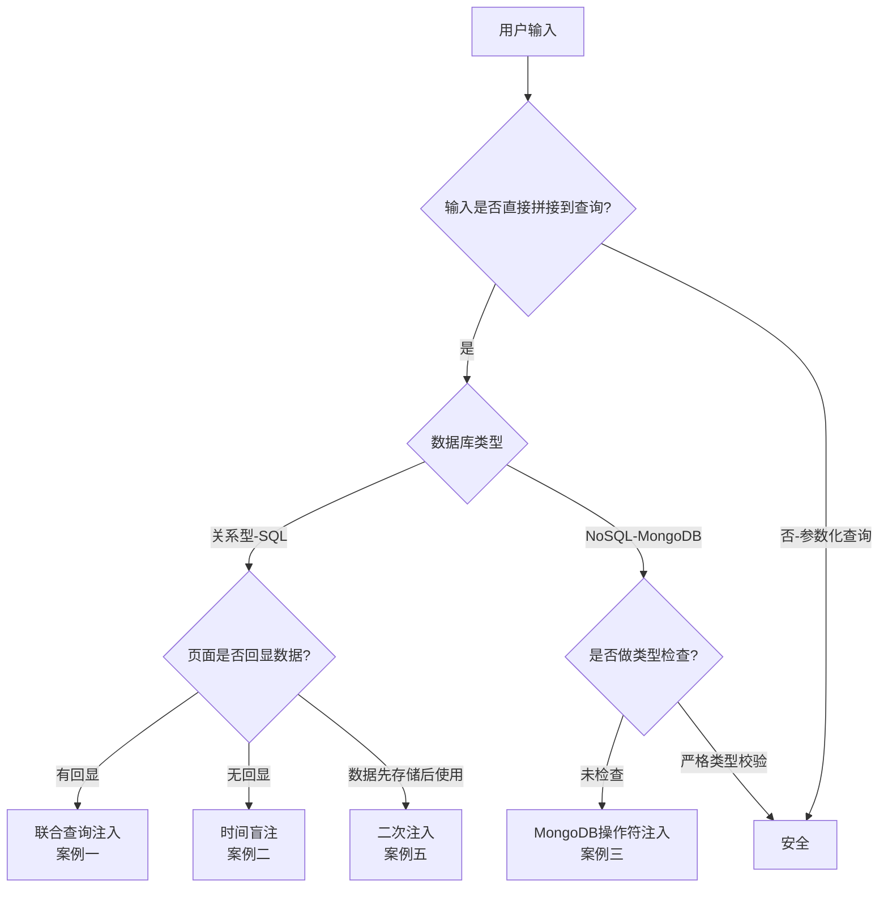
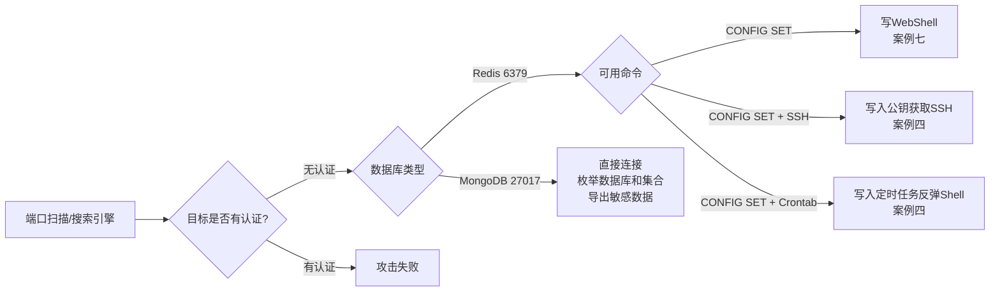
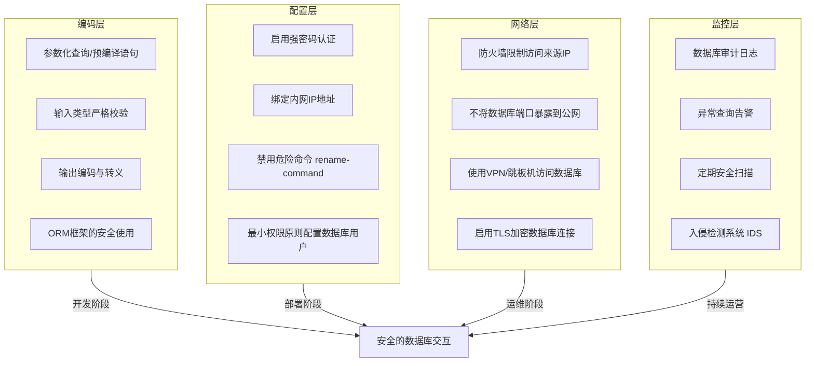
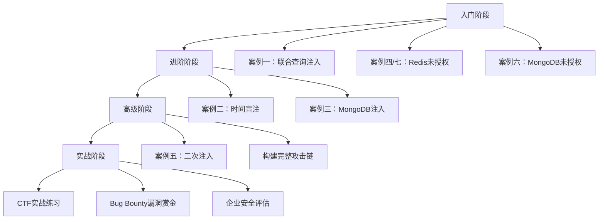

## 案例总结

本节对前述七个实战案例进行系统性复盘。每一个案例都不是孤立的攻击技巧演示——它们共同构成了一幅完整的数据库安全攻防图谱。通过横向对比不同数据库类型、不同注入方式、不同利用路径，读者应建立起"识别漏洞→选择技术→实施攻击→加固防御"的完整思维模型。

### 案例全景对照表

| 编号 | 案例名称 | 目标数据库 | 漏洞根因 | 攻击难度 | 关键技术 | 最终影响 |
|------|---------|-----------|---------|---------|---------|---------|
| 案例一 | 联合查询注入获取管理员密码 | MySQL | 字符串拼接拼接用户输入 | ★★☆☆☆ | `UNION SELECT`、`information_schema` | 数据泄露（管理员凭据） |
| 案例二 | 时间盲注提取数据库 | MySQL | 字符串拼接，无回显 | ★★★☆☆ | `SLEEP()` + 逐字符提取脚本 | 数据泄露（完整数据库结构） |
| 案例三 | MongoDB注入绕过认证 | MongoDB | 直接将用户输入作为查询条件 | ★★★☆☆ | `$ne`、`$gt`、`$regex` 操作符注入 | 认证绕过（任意用户登录） |
| 案例四 | Redis未授权访问拿下服务器 | Redis | 无密码保护 + 端口对外开放 | ★★☆☆☆ | `CONFIG SET` + 写文件/SSH公钥/Crontab | 服务器完全控制（RCE） |
| 案例五 | 二次注入修改管理员密码 | MySQL | 存储的恶意数据在后续操作中拼接执行 | ★★★★☆ | 存储→触发两阶段攻击 | 权限提升（接管管理员账户） |
| 案例六 | MongoDB未授权访问数据泄露 | MongoDB | 未启用认证 + 端口暴露 | ★★☆☆☆ | Shodan/ZoomEye 搜索 + 直连导出 | 大规模数据泄露 |
| 案例七 | Redis未授权写入WebShell | Redis | 无密码保护 + CONFIG命令未禁用 | ★★☆☆☆ | `CONFIG SET dir/dbfilename` + `SAVE` | 远程代码执行（WebShell） |

### 攻击路径分类与技术对比

七个案例可以按照攻击入口和利用方式归为三大类：

#### 一、注入类攻击（案例一、二、三、五）

注入类攻击的共同特征是**应用程序信任了不可信的用户输入**，将其直接拼接到数据库查询语句中。区别在于数据库类型和注入反馈机制不同。



**四种注入方式的详细对比：**

| 对比维度 | 联合查询注入 | 时间盲注 | MongoDB注入 | 二次注入 |
|---------|------------|---------|------------|---------|
| 适用数据库 | MySQL/PostgreSQL/MSSQL | MySQL（及其他支持时间函数的DB） | MongoDB | MySQL/PostgreSQL |
| 前提条件 | 页面有数据回显点 | 页面无回显但可测量响应时间 | 应用未校验输入类型 | 输入先存储，后续拼接使用 |
| 注入速度 | 快（单次请求获取大量数据） | 慢（逐字符提取，每个字符多次请求） | 快（单次请求绕过认证） | 中等（需先注册再触发） |
| 检测难度 | 容易（响应中直接看到数据） | 困难（需要时间差分析） | 中等（需要理解查询语法） | 困难（注入点不在输入处） |
| 典型Payload | `' UNION SELECT 1,2,3--` | `' OR IF(SUBSTR(database(),1,1)='a',SLEEP(3),0)--` | `{"$ne":""}` | `admin'--`（存储后触发） |
| WAF绕过难度 | 中等 | 较高（可配合二分法、异或等变体） | 较低（JSON格式常被忽略） | 高（攻击发生在应用层内部） |

#### 二、未授权访问类攻击（案例四、六、七）

未授权访问攻击不依赖注入——它们利用的是**数据库服务本身的配置缺陷**。Redis 和 MongoDB 默认安装后往往不启用认证，如果同时暴露在公网，攻击者可以直接连接并执行任意操作。



**未授权访问攻击要素对比：**

| 对比维度 | Redis（案例四、七） | MongoDB（案例六） |
|---------|-------------------|-----------------|
| 默认端口 | 6379 | 27017 |
| 默认认证 | 无（需手动配置 `requirepass`） | 无（需手动创建用户） |
| 发现方式 | Shodan/ZoomEye 搜索 `port:6379` | Shodan 搜索 `port:27017` |
| 连接工具 | `redis-cli`、Python `redis` 库 | `mongosh`、MongoDB Compass |
| 最大危害 | 写文件→RCE/SSH/Crontab | 数据泄露（用户信息、业务数据） |
| 攻击前提 | 需要知道Web目录路径或有写入权限的目录 | 无需任何额外信息 |

#### 三、漏洞根因深层分析

所有七个案例的根因可以归纳为以下四类编码和配置错误：

**根因一：字符串拼接（案例一、二、五）**

这是最经典也最常见的漏洞成因。开发者为了方便，直接将用户输入拼接到 SQL 语句中：

```python
# 危险写法
query = f"SELECT * FROM users WHERE id = '{user_input}'"

# 安全写法
query = "SELECT * FROM users WHERE id = %s"
cursor.execute(query, (user_input,))
```

参数化查询（Prepared Statement）让数据库引擎将用户数据与 SQL 语法分开处理，从根本上阻断注入。这不是"更好的做法"，而是**唯一正确的做法**。

**根因二：缺乏类型校验（案例三）**

MongoDB 的查询语言基于 JSON/文档结构，当应用将用户输入直接作为查询条件对象传递时，攻击者可以通过注入操作符（`$ne`、`$gt`、`$regex` 等）改变查询语义：

```javascript
// 危险写法 —— 用户可以直接传入 {"$ne":""} 作为 password
const user = await User.findOne({ username, password });

// 安全写法 —— 先校验类型为字符串
if (typeof password !== 'string') return res.status(400).json({error:'Invalid'});
const user = await User.findOne({ username, password });
```

**根因三：默认配置未加固（案例四、六、七）**

Redis 和 MongoDB 安装后默认不启用认证，且监听所有网络接口（`bind 0.0.0.0`）。开发者在本地开发时没有问题，但一旦部署到云服务器且未配置防火墙，数据库就直接暴露在公网上。根据 Shodan 的统计数据，全球互联网上长期存在数十万个未认证的 Redis 和 MongoDB 实例。

**根因四：二次信任（案例五）**

二次注入的特殊性在于：数据进入数据库时是安全的（使用了参数化查询），但从数据库读出后又被不安全地使用（字符串拼接）。这揭示了一个深层问题——**数据从数据库读出后不应被视为可信数据**，它仍然可能包含恶意内容。

### 防御体系全景

针对以上漏洞类型，完整的数据库安全防御需要覆盖四个层面：



**各案例对应的防御措施速查：**

| 案例 | 核心防御 | 补充防御 |
|------|---------|---------|
| 案例一（联合查询注入） | 参数化查询 | WAF 规则、最小权限 DB 用户、禁用 `information_schema` 访问 |
| 案例二（时间盲注） | 参数化查询 | 请求超时限制、WAF 时间函数检测、查询日志监控 |
| 案例三（MongoDB注入） | 输入类型校验 + Mongoose Schema 验证 | 使用 bcrypt 哈希密码、启用 MongoDB 认证 |
| 案例四（Redis未授权-服务器） | `requirepass` + `bind 127.0.0.1` | 防火墙规则、禁用 CONFIG 命令、以低权限用户运行 |
| 案例五（二次注入） | 读取数据后同样使用参数化查询 | 数据输出时转义、不信任数据库中的"已存储"数据 |
| 案例六（MongoDB未授权-数据泄露） | 启用认证 + 绑定内网 IP | 防火墙、TLS 加密、定期扫描公网暴露面 |
| 案例七（Redis未授权-WebShell） | `requirepass` + 禁用 `CONFIG` 命令 | 以非 root 用户运行、Web 目录不可写、文件完整性监控 |

### 攻击链延伸：从单点漏洞到完整入侵

在实际渗透测试中，单个漏洞往往只能获取有限的访问权限。真正的高危攻击是将多个漏洞串联成攻击链。以下是基于本章案例可以构建的典型攻击链：

**攻击链一：信息收集 → 注入 → 提权**

```text
Shodan搜索开放MySQL端口
  → 发现目标Web应用存在SQL注入（案例一/二技术）
    → 通过注入获取数据库用户密码哈希
      → 破解哈希获取明文密码
        → 使用密码登录phpMyAdmin管理后台
          → 通过`INTO OUTFILE`写入WebShell
            → 获取服务器控制权
```

**攻击链二：未授权访问 → 横向移动**

```text
Shodan搜索开放Redis端口（案例六的发现方法）
  → 确认Redis未授权访问（案例四/七技术）
    → 写入SSH公钥获取服务器Shell
      → 读取应用配置文件获取数据库连接信息
        → 连接内部MySQL数据库（内网通常无注入防护）
          → 导出全部业务数据
```

**攻击链三：社工 + 二次注入 → 权限接管**

```text
注册恶意用户名 `admin'--`（案例五技术）
  → 触发密码修改功能，覆盖admin密码
    → 以admin身份登录后台
      → 利用后台文件上传功能获取WebShell
        → 提权至服务器管理员
```

这些攻击链说明：防御不能只关注单个漏洞的修补，需要从整体架构层面建立纵深防御体系。

### 技术能力成长路径

基于七个案例的难度递进，建议读者按照以下路径练习：



**入门阶段（1-2周）：** 联合查询注入是最直观的 SQL 注入方式，页面直接返回数据，便于理解注入原理。Redis/MongoDB 未授权访问门槛最低，只需要基本的连接操作。建议使用 SQLi-labs 靶场（案例一对应 Less-1 到 Less-10）反复练习直到闭眼能写 Payload。

**进阶阶段（2-3周）：** 时间盲注需要编写自动化脚本，锻炼编程能力和对数据库内部机制的理解。MongoDB 注入需要理解 NoSQL 查询语法和 JSON 结构。建议同时学习 sqlmap 的工作原理，理解它如何自动判断注入类型并构造 Payload。

**高级阶段（3-4周）：** 二次注入是最难理解的注入类型——你需要跳出"输入点就是注入点"的思维定式，理解数据在应用中的完整生命周期。完成此阶段后，尝试在 DVWA、Mutillidae 等综合靶场中独立完成从信息收集到获取权限的完整攻击链。

**实战阶段（持续）：** 在掌握所有基础技术后，可以通过 CTF 比赛（如 Hack The Box、TryHackMe）磨练实战技巧。具备足够能力后，可以在合法授权范围内参与 Bug Bounty 项目，将技术应用于真实场景。

### 关键教训与认知升级

通过七个案例的系统学习，以下认知升级至关重要：

**教训一：数据库类型决定攻击手法，但漏洞根因相同。** SQL 注入、NoSQL 注入、未授权访问看似是三种完全不同的技术，但根因都指向同一个问题——对用户输入/外部访问缺乏信任边界。无论数据库类型如何，"永远不信任外部输入"和"默认拒绝外部访问"是两条铁律。

**教训二：自动化工具不能替代手动理解。** sqlmap 可以自动完成注入，但如果不理解联合查询、盲注、时间盲注的原理，面对 WAF、自定义过滤、非标准回显等场景时就会束手无策。建议先手动完成所有案例，再使用自动化工具验证和提效。

**教训三：防御不是单点措施，而是体系工程。** 仅使用参数化查询可以防止注入，但无法防御未授权访问。仅设置 Redis 密码可以防止未授权连接，但无法防御注入。真正的安全需要编码层、配置层、网络层、监控层的协同配合。

**教训四：安全是一个持续过程，不是一次性任务。** 新的漏洞类型和攻击手法不断出现（如 GraphQL 注入、ORM 注入、Server-Side Template Injection 等）。保持对安全社区的关注，定期更新知识库，是每一个安全从业者的必修课。

***
