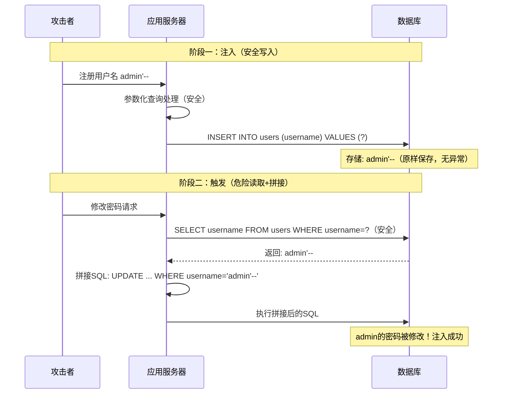
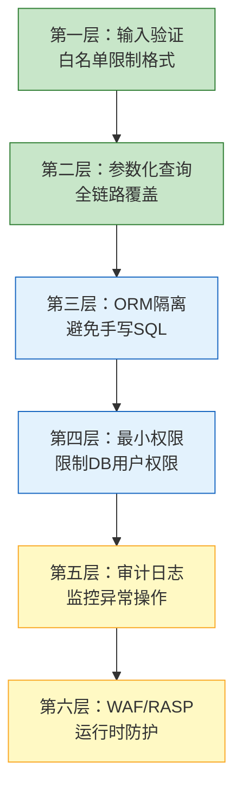

## 6. 二次注入（Second-Order SQL Injection）

### 6.1 什么是二次注入

一次注入（First-Order Injection）在输入提交的**同一个请求**中触发——用户输入直接拼入SQL，数据库立即执行恶意语句。二次注入则完全不同：恶意payload在**写入阶段**被安全处理（通常通过参数化查询），原样存储在数据库中；随后在**另一个操作**中，应用代码从数据库读出该数据，错误地信任其"安全性"，将其直接拼入新的SQL语句，触发注入。

关键认知差异：

| 维度 | 一次注入 | 二次注入 |
|------|---------|---------|
| 触发时机 | 输入后立即执行 | 输入先存储，后续操作才触发 |
| 攻击路径 | 用户输入 → SQL拼接 → 执行 | 用户输入 → 安全写入 → 读取 → SQL拼接 → 执行 |
| 漏洞位置 | 写入点（INSERT/UPDATE的输入处理） | 读取后的二次使用点 |
| WAF检测 | 可以在HTTP请求中检测payload | payload在应用内部流转，WAF无法检测 |
| 开发者心理 | "我忘了转义" | "从数据库来的数据应该是安全的" |

> **核心原则：数据库不是消毒站，只是中转站。** 参数化查询防止恶意数据在写入时被解释为SQL代码，但它不会改变数据本身的值。`admin'--` 这样的字符串会被原样存储，等待后续不安全的代码将其取出利用。

### 6.2 攻击原理与完整链路

二次注入的攻击链分为两个阶段，中间通过数据库存储桥接：



**阶段一的技术细节：**

写入端使用参数化查询，数据库驱动在协议层将 `admin'--` 作为纯字符串处理。MySQL实际存储时，单引号不需要额外转义——它在BLOB/VARCHAR字段中就是普通字符。这一步完全安全，没有任何WAF、IDS或日志系统会报警。

**阶段二的技术细节：**

从数据库读出 `stored_username = "admin'--"` 后，应用代码犯了致命错误——用f-string将其拼入SQL：

```python
query = f"UPDATE users SET password='{hashed}' WHERE username='{stored_username}'"
# 实际生成: UPDATE users SET password='abc123' WHERE username='admin'--'
#                                                                    ^^^^^^
#                                                                    注释符生效
```

`--` 是SQL标准注释符（MySQL中需跟空格，PostgreSQL/MSSQL无需），其后的 `'` 被注释掉，WHERE条件实际变为 `username='admin'`，攻击者的密码被写入了admin账户。

### 6.3 常见触发场景

二次注入的触发点不限于"修改密码"。任何从数据库读取数据后拼入SQL的操作都可能成为触发点：

**场景一：用户资料更新**

```python
def update_profile(self, username, email):
    # 从数据库取出用户名（参数化，安全）
    cursor.execute("SELECT username FROM users WHERE username=%s", (username,))
    stored = cursor.fetchone()[0]
    
    # 漏洞：用取出的用户名拼接UPDATE
    query = f"UPDATE users SET email='{email}' WHERE username='{stored}'"
    cursor.execute(query)
```

攻击者注册 `admin' OR '1'='1`，触发后：

```sql
UPDATE users SET email='attacker@evil.com' WHERE username='admin' OR '1'='1'
```

所有用户的邮箱被篡改，攻击者通过"忘记密码"功能可接管任意账户。

**场景二：权限系统中的角色查询**

```python
def check_permission(self, username, resource):
    cursor.execute("SELECT role FROM users WHERE username=%s", (username,))
    role = cursor.fetchone()[0]
    
    # 漏洞：role被拼入查询
    query = f"SELECT * FROM permissions WHERE role='{role}' AND resource='{resource}'"
    cursor.execute(query)
```

攻击者注册时用户名包含UNION子句，可将任意角色的权限数据泄露出来。

**场景三：日志系统中的审计查询**

```python
def log_action(self, username, action):
    cursor.execute("SELECT username FROM users WHERE username=%s", (username,))
    stored = cursor.fetchone()[0]
    
    # 漏洞：stored被拼入INSERT中的子查询
    query = f"INSERT INTO audit_log (user_id, action) VALUES ((SELECT id FROM users WHERE username='{stored}'), '{action}')"
    cursor.execute(query)
```

**场景四：分页/搜索中的排序注入**

```python
def search_users(self, sort_field_from_db):
    # sort_field_from_db 从数据库的配置表读取
    query = f"SELECT * FROM users ORDER BY {sort_field_from_db}"
    cursor.execute(query)
```

如果配置表中的排序字段被篡改为 `1; DROP TABLE users--`，在支持堆叠查询的数据库上可直接执行DDL。

### 6.4 不同数据库的利用差异

| 数据库 | 注释符 | 堆叠查询支持 | 字符串转义 | 二次注入利用难度 |
|--------|--------|-------------|-----------|----------------|
| MySQL | `-- `（需空格）、`#` | 需 `multi_statements=True` | `\'` 或 `''` | 中等 |
| PostgreSQL | `--`（无需空格） | 默认支持（psycopg2需特殊配置） | `''` 或 `\'` | 较低 |
| MSSQL/SQL Server | `--`（无需空格） | 默认支持 | `''` | 较低 |
| SQLite | `--`（无需空格） | 默认支持 | `''` | 较低 |
| Oracle | `--`（无需空格） | 需 `EXECUTE IMMEDIATE` | `''` | 较高 |

**MySQL特殊注意事项：**

```python
# pymysql默认不启用多语句执行，堆叠注入不可用
# 但以下配置会启用：
pymysql.connect(host='localhost', user='root', password='',
                db='user_db', client_flag=CLIENT.MULTI_STATEMENTS)
# 启用后，admin'; DROP TABLE users; -- 可执行DDL
```

**PostgreSQL特殊注意事项：**

psycopg2的 `cursor.execute()` 默认不支持多语句，但可以通过以下方式绕过：
- 使用 `cursor.executemany()` 或 `COPY` 命令
- 利用 `pg_sleep()` 进行时间盲注型二次注入
- 使用 `CASE WHEN` 进行布尔盲注

**MSSQL特殊注意事项：**

SQL Server支持 `xp_cmdshell`，如果数据库服务账户有足够权限，二次注入可以升级为远程命令执行（RCE）：

```sql
-- 注册用户名包含: admin'; EXEC xp_cmdshell('whoami'); --
-- 触发后可执行操作系统命令
```

### 6.5 检测方法

#### 6.5.1 静态代码审计

检测二次注入的核心思路：**追踪数据流**——从数据库读取的值是否被不安全地用于构建SQL语句。

审计检查清单：

```text
1. 搜索所有 cursor.fetchone() / cursor.fetchall() 调用，标记返回值变量
2. 追踪这些变量是否出现在后续的 SQL 拼接中（f-string、format()、+拼接、.join()）
3. 重点检查涉及 WHERE/SET/ORDER BY 子句的拼接
4. 检查 ORM 的 .raw() / .extra() / execute(text()) 调用是否包含来自数据库的变量
5. 关注配置表/系统表中读取的值是否被拼入SQL
```

**自动化工具：**

```bash
# Semgrep：通用静态分析，支持多语言
semgrep --config=p/sql-injection --lang=python ./src/

# Bandit：Python专用安全扫描
bandit -r ./src/ -s B608  # B608: SQL injection via string formatting

# CodeQL：适用于大型代码库的数据流分析
# 追踪：数据库读取值 → 字符串格式化 → SQL执行 的完整数据流
```

**Python AST分析器（自定义检测）：**

```python
import ast
import sys

class SecondOrderDetector(ast.NodeVisitor):
    """通过AST分析检测二次注入风险：追踪从DB读取的变量是否被拼入SQL"""
    
    def __init__(self):
        self.db_reads = {}        # 变量名 → 读取行号
        self.findings = []        # 发现的风险点
    
    def visit_Assign(self, node):
        """检测赋值语句，标记从数据库读取的变量"""
        if isinstance(node.value, ast.Call):
            func = node.value.func
            if isinstance(func, ast.Attribute) and func.attr in ('fetchone', 'fetchall'):
                for target in node.targets:
                    if isinstance(target, ast.Name):
                        self.db_reads[target.id] = node.lineno
                    elif isinstance(target, ast.Tuple):
                        for elt in target.elts:
                            if isinstance(elt, ast.Name):
                                self.db_reads[elt.id] = node.lineno
        self.generic_visit(node)
    
    def visit_JoinedStr(self, node):
        """检测f-string中是否包含来自数据库的变量"""
        for value in node.values:
            if isinstance(value, ast.FormattedValue):
                if isinstance(value.value, ast.Name):
                    var_name = value.value.id
                    if var_name in self.db_reads:
                        self.findings.append({
                            'variable': var_name,
                            'read_line': self.db_reads[var_name],
                            'use_line': node.lineno
                        })
        self.generic_visit(node)

# 使用方式
with open(sys.argv[1]) as f:
    tree = ast.parse(f.read())

detector = SecondOrderDetector()
detector.visit(tree)

for f in detector.findings:
    print(f"[!] 二次注入风险: 变量 '{f['variable']}' "
          f"在第{f['read_line']}行从DB读取，第{f['use_line']}行用于SQL拼接")
```

#### 6.5.2 动态渗透测试

```python
import requests
import time

BASE_URL = "http://target.com"

# 二次注入检测：注册payload → 登录 → 触发操作 → 观察差异
payloads = [
    ("test' AND 1=1--", "布尔真"),
    ("test' AND 1=2--", "布尔假"),
    ("test' AND SLEEP(3)--", "时间盲注"),
    ("test' OR '1'='1", "条件永真"),
    ("admin'--", "注释截断"),
]

for payload, desc in payloads:
    # 注册恶意用户名
    requests.post(f"{BASE_URL}/register", data={
        "username": payload, "password": "test123"
    })
    
    # 登录
    session = requests.Session()
    session.post(f"{BASE_URL}/login", data={
        "username": payload, "password": "test123"
    })
    
    # 触发可能的二次注入操作（修改密码、更新资料等）
    start = time.time()
    resp = session.post(f"{BASE_URL}/change_password", data={
        "new_password": "newpass123"
    })
    elapsed = time.time() - start
    
    # 分析结果
    if elapsed > 3:
        print(f"[!] 时间盲注确认 ({desc}): {payload}")
    elif "error" in resp.text.lower():
        print(f"[!] 错误响应 ({desc}): {payload}")
    # 还需验证admin密码是否被修改
```

#### 6.5.3 SQLMap检测

SQLMap本身主要针对一次注入，但可以通过以下方式辅助检测二次注入：

```bash
# 方法一：使用 --second-order 参数指定二次请求URL
sqlmap -u "http://target.com/register" --data="username=TEST&password=123" \
  --second-order="http://target.com/profile" --level=3 --risk=2

# 方法二：使用 --tamper 脚本自定义payload处理
# 配合自定义脚本，先注册payload，再触发二次操作
```

### 6.6 防御策略

#### 6.6.1 核心原则：全链路参数化

防御二次注入的**唯一根本方案**：所有用于构建SQL语句的数据，无论来源（用户输入、数据库读取、配置文件、API返回），都必须使用参数化查询。

```python
def change_password(self, username, new_password):
    """安全方案：直接参数化，不从DB取出再拼接"""
    cursor = self.conn.cursor()
    query = "UPDATE users SET password = %s WHERE username = %s"
    cursor.execute(query, (hash_password(new_password), username))
    self.conn.commit()

def change_password_v2(self, username, new_password):
    """安全方案：用主键ID替代字符串字段"""
    cursor = self.conn.cursor()
    cursor.execute("SELECT id FROM users WHERE username = %s", (username,))
    result = cursor.fetchone()
    if not result:
        return False
    user_id = result[0]  # 整数主键，不存在注入风险
    cursor.execute("UPDATE users SET password = %s WHERE id = %s",
                   (hash_password(new_password), user_id))
    self.conn.commit()
```

#### 6.6.2 纵深防御层次



**第一层：输入验证（白名单）**

```python
import re

def validate_username(username: str) -> bool:
    """用户名白名单：只允许字母、数字、下划线，长度3-32"""
    if not username or len(username) < 3 or len(username) > 32:
        return False
    return bool(re.match(r'^[a-zA-Z0-9_]+$', username))

# 在注册入口处强制验证，从源头杜绝恶意payload写入
if not validate_username(username):
    raise ValueError("用户名只能包含字母、数字和下划线")
```

输入验证虽然不能替代参数化查询（因为不是所有字段都适合白名单，如评论内容），但它能在源头大幅减少攻击面。

**第二层：ORM隔离**

```python
from sqlalchemy import create_engine, Column, Integer, String
from sqlalchemy.orm import declarative_base, Session

Base = declarative_base()

class User(Base):
    __tablename__ = 'users'
    id = Column(Integer, primary_key=True)
    username = Column(String(32), unique=True, nullable=False)
    password = Column(String(64), nullable=False)

def change_password_orm(session: Session, username: str, new_password: str):
    """ORM方式：完全无SQL拼接，从根源消除二次注入"""
    user = session.query(User).filter(User.username == username).first()
    if user:
        user.password = hash_password(new_password)
        session.commit()
        return True
    return False
```

ORM的filter方法内部使用参数化查询，开发者接触不到SQL字符串。但需注意：ORM的 `.raw()`、`.extra()`、`session.execute(text(...))` 等方法绕过了ORM保护，仍然可能引入二次注入。

**第三层：最小权限原则**

```sql
-- 应用数据库用户只授予必要权限
CREATE USER 'app_user'@'localhost' IDENTIFIED BY 'strong_password';
GRANT SELECT, INSERT, UPDATE ON mydb.users TO 'app_user'@'localhost';
GRANT SELECT, INSERT ON mydb.logs TO 'app_user'@'localhost';
-- 不授予 DELETE、DROP、ALTER、GRANT 等高危权限
-- 即使注入成功，攻击者也无法执行破坏性操作
```

**第四层：审计日志与异常检测**

```python
import logging

sql_logger = logging.getLogger('sql_audit')

def monitored_execute(self, query, params=None):
    """带审计的查询执行，检测异常模式"""
    sql_logger.info(f"Query: {query} | Params: {params}")
    cursor = self.conn.cursor()
    
    if params:
        cursor.execute(query, params)
    else:
        # 无参数的直接执行——记录警告
        sql_logger.warning(f"Direct SQL without params: {query}")
        cursor.execute(query)
    
    # 检测批量操作异常
    if query.strip().upper().startswith(('UPDATE', 'DELETE')) and cursor.rowcount > 100:
        sql_logger.critical(
            f"Mass operation: {cursor.rowcount} rows affected | Query: {query}"
        )
        # 可选：触发告警、回滚事务
    return cursor
```

### 6.7 常见误区

**误区一："我用了参数化查询，所以没有SQL注入"**

参数化查询只保护**当前这次**SQL执行。如果参数化取出的数据又被拼接进下一条SQL，二次注入仍然存在。安全必须贯穿整个数据生命周期，不能只看单个操作。

**误区二："数据库里的数据是可信的"**

数据库只是存储介质，不会对数据做任何"消毒"。来自数据库的数据必须和来自用户输入的数据同等对待——**永远不信任，永远验证**。

**误区三："转义一下就行了"**

手动转义（如 `mysql_real_escape_string`）是最脆弱的防御：不同数据库转义规则不同，不同字符集下行为可能不一致，开发者极易遗漏边界情况。参数化查询由数据库驱动在协议层处理，远比手动转义可靠。

**误区四："二次注入很难利用，实际危害不大"**

利用门槛极低——攻击者只需注册一个账号。触发条件确实比一次注入多一步，但一旦存在漏洞，利用成功率接近100%。且二次注入可直接修改数据、提升权限，危害等级与一次注入相当。

**误区五："WAF能防住二次注入"**

WAF检测的是HTTP请求中的恶意payload。二次注入的恶意数据在写入时是完全合法的请求内容，触发时也是合法的HTTP请求。恶意SQL始终在应用内部流转，不经过WAF的检测点，WAF对此无能为力。

### 6.8 与其他注入类型的关联

| 注入类型 | 与二次注入的关系 | 区别 |
|---------|----------------|------|
| 一次注入 | 同族，SQL注入的两种形态 | 一次注入在同一请求中触发，二次注入跨请求 |
| 盲注 | 二次注入可以是盲注型 | 盲注是信息获取方式，二次注入是触发机制，二者可组合 |
| 堆叠注入 | 二次注入可结合堆叠 | 在支持多语句的DB上，二次注入payload可包含多条SQL |
| NoSQL注入 | 类似原理可应用于NoSQL | MongoDB等也有"存储后拼接"的风险 |
| ORM注入 | ORM的raw()方法可导致二次注入 | ORM本身安全，但绕过ORM保护的方法会引入风险 |

二次注入可以与任何注入技术组合：布尔盲注型二次注入（通过观察返回数据差异推断信息）、时间盲注型二次注入（通过SLEEP延迟判断条件真假）、UNION型二次注入（通过合并查询窃取数据）、堆叠型二次注入（执行额外SQL语句）。组合方式取决于目标数据库能力和应用的具体逻辑。

### 6.9 企业级防御架构

在生产环境中，防御二次注入需要系统化方案，不能仅依赖开发者的安全意识：

**CI/CD集成安全扫描：**

```yaml
# .github/workflows/security.yml
name: Security Scan
on: [push, pull_request]
jobs:
  sast:
    runs-on: ubuntu-latest
    steps:
      - uses: actions/checkout@v4
      - name: Semgrep SAST
        uses: semgrep/semgrep-action@v1
        with:
          config: >-
            p/sql-injection
            p/owasp-top-ten
      - name: Bandit (Python)
        run: bandit -r ./src/ -f json -o bandit-report.json || true
```

**运行时应用自防护（RASP）：**

RASP在应用运行时监控SQL执行，可以检测异常的SQL模式（如单次UPDATE影响行数异常、WHERE条件中出现注释符等），比WAF更精准。

**数据库审计：**

```sql
-- MySQL审计插件
INSTALL PLUGIN audit_log SONAME 'audit_log.so';
SET GLOBAL audit_log_policy = 'ALL';

-- PostgreSQL pgAudit
ALTER SYSTEM SET pgaudit.log = 'write, ddl';
SELECT pg_reload_conf();
```

### 6.10 小结

二次注入的核心教训：**安全不是某个函数调用正确就够了，而是需要贯穿整个数据生命周期的思维方式。**

防御要点速查：

```text
1. 全链路参数化：所有SQL操作都使用参数化，无论数据来源
2. 输入白名单验证：在入口处严格限制输入格式
3. ORM优先：使用ORM框架，避免手写SQL
4. 最小权限：数据库账户只授予必要权限
5. 安全扫描：CI/CD集成Semgrep/Bandit等工具
6. 审计日志：记录所有SQL执行，监控异常模式
7. 纵深防御：不依赖任何单一防护措施
```

每一个从数据库取出的数据、每一个函数返回的值、每一个配置文件读取的参数，都可能是攻击者的下一个注入点。二次注入提醒我们：**信任边界必须在每一层重新建立。**

***
