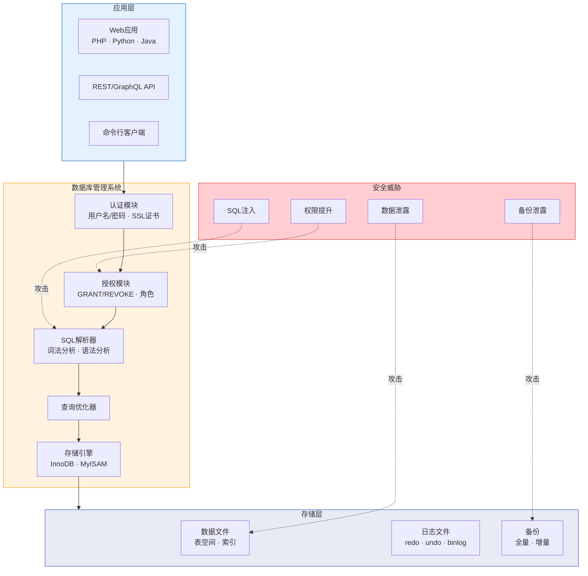
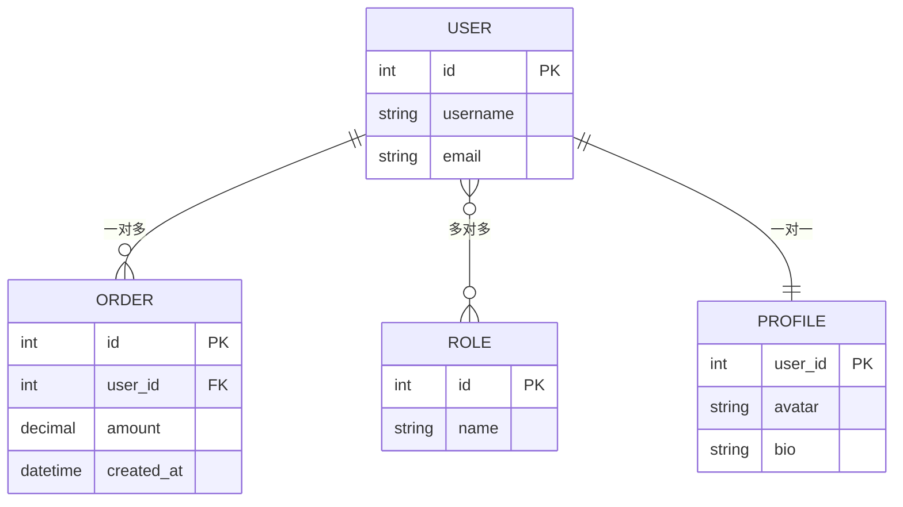
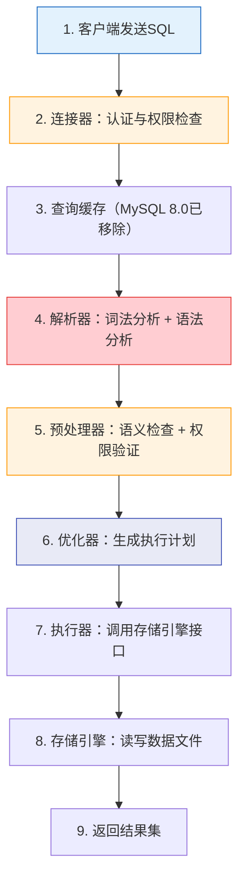
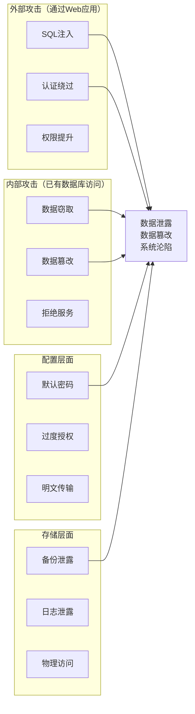

## 1. 关系型数据库基础

关系型数据库（Relational Database）是当今企业应用中使用最广泛的数据库类型。全球排名前五的数据库系统中有四个是关系型的（Oracle、MySQL、PostgreSQL、Microsoft SQL Server）。理解关系型数据库的架构、SQL语言体系和安全模型，是研究数据库安全攻击与防御的必要前提。

从安全视角来看，关系型数据库既是攻击者的高价值目标——一次成功的SQL注入可能泄露整个数据库，也是防御者必须加固的核心资产——权限配置、审计日志、加密传输每一环都不能松懈。

> **数据库安全架构全景图**



上图展示了数据库的四层架构以及各层面临的安全威胁。攻击者可以从应用层注入恶意SQL（攻击解析器），通过权限漏洞提升权限（攻击授权模块），直接窃取数据文件，或者获取备份文件。理解这个全景图是学习本章的基础。

---

### 1.1 关系模型理论基础

#### 1.1.1 关系模型的数学定义

关系型数据库的理论基础是E.F. Codd于1970年在论文《A Relational Model of Data for Large Shared Data Banks》中提出的关系模型。这个模型将数据组织为**关系**（relation），在实现层面就是我们熟悉的**表**（table）。

关系模型的核心概念：

| 概念 | 术语 | 对应实现 | 说明 |
|------|------|---------|------|
| 关系（Relation） | 表（Table） | `CREATE TABLE` | 一个二维的数据结构，由行和列组成 |
| 元组（Tuple） | 行（Row） | 一条记录 | 表示一个实体的具体实例 |
| 属性（Attribute） | 列（Column） | 字段 | 描述实体的某个特征，有明确的数据类型 |
| 域（Domain） | 数据类型 | `INT`、`VARCHAR` | 属性的取值范围和约束条件 |
| 主键（Primary Key） | 唯一标识 | `PRIMARY KEY` | 能唯一确定一行的属性或属性组合 |
| 外键（Foreign Key） | 关联字段 | `REFERENCES` | 引用其他表主键的属性，建立表间关系 |

关系模型的三大完整性约束：

1. **实体完整性**：主键不能为空（`NOT NULL`），且必须唯一
2. **参照完整性**：外键的值必须是被引用表中已存在的主键值，或者是`NULL`
3. **用户自定义完整性**：业务规则约束，如年龄必须大于0、邮箱格式验证等

从安全角度看，这些约束本身就是第一道防线——如果数据库设计正确，一个年龄字段被注入负数或字符串时，约束检查就会拒绝。但很多开发者为了"方便"禁用了约束检查，等于自毁防线。

#### 1.1.2 表、键与关系类型

**主键（Primary Key）的选择策略：**

```sql
-- 策略一：自然主键（使用业务数据作为主键）
-- 优点：有意义，可读性好
-- 缺点：业务变更时主键需要修改，级联更新代价大
CREATE TABLE users (
    username VARCHAR(50) PRIMARY KEY,  -- 自然主键
    email VARCHAR(100) NOT NULL
);

-- 策略二：代理主键（使用无意义的自增ID）
-- 优点：稳定不变，查询效率高
-- 缺点：无业务含义，需要额外的唯一约束
CREATE TABLE users (
    id BIGINT PRIMARY KEY AUTO_INCREMENT,  -- 代理主键
    username VARCHAR(50) NOT NULL UNIQUE,
    email VARCHAR(100) NOT NULL
);

-- 策略三：UUID主键（分布式系统常用）
-- 优点：全局唯一，无需协调
-- 缺点：占用空间大（36字符），索引效率低于整数
CREATE TABLE users (
    id CHAR(36) PRIMARY KEY DEFAULT (UUID()),
    username VARCHAR(50) NOT NULL UNIQUE
);
```

**外键与表间关系：**

关系型数据库通过外键建立表之间的关联，共有三种基本关系类型：



| 关系类型 | 实现方式 | 安全关注点 |
|---------|---------|-----------|
| 一对多（1:N） | 外键放在"多"方 | 级联删除可能被利用删除关联数据；外键未加索引导致慢查询被用于DoS |
| 多对多（M:N） | 中间关联表 | 关联表是注入的常见目标；权限检查必须覆盖关联表 |
| 一对一（1:1） | 外键加唯一约束 | 常用于敏感数据隔离（如将密码哈希独立存储） |

**安全实践：** 将用户凭证（密码哈希、密钥）与用户基本信息分表存储，可以减少SQL注入一次性泄露的数据量。即使注入获取了用户表的数据，攻击者仍然无法直接获取密码哈希。

---

### 1.2 SQL语言体系

SQL（Structured Query Language）是关系型数据库的标准语言，由ISO/IEC 9075标准定义。SQL不是一种过程式语言——你描述"要什么"而不是"怎么做"，由数据库的查询优化器决定执行路径。

从安全视角，SQL注入的本质就是：**攻击者通过操控用户输入，改变了SQL语句的原始语义**。理解SQL的每种语法结构，才能理解注入可以发生在哪些位置。

#### 1.2.1 DDL——数据定义语言

DDL（Data Definition Language）用于定义和修改数据库结构。安全相关的核心操作：

```sql
-- 创建数据库
CREATE DATABASE IF NOT EXISTS mydb
    CHARACTER SET utf8mb4
    COLLATE utf8mb4_unicode_ci;

-- 创建表（含安全相关的字段设计）
CREATE TABLE users (
    id INT PRIMARY KEY AUTO_INCREMENT,
    username VARCHAR(50) NOT NULL UNIQUE COMMENT '用户名',
    password_hash CHAR(60) NOT NULL COMMENT 'bcrypt哈希，固定60字符',
    email VARCHAR(100) NOT NULL UNIQUE,
    role ENUM('user', 'editor', 'admin') DEFAULT 'user' COMMENT '角色枚举，限制可选值',
    login_attempts INT DEFAULT 0 COMMENT '登录失败次数',
    locked_until DATETIME DEFAULT NULL COMMENT '账户锁定截止时间',
    created_at TIMESTAMP DEFAULT CURRENT_TIMESTAMP,
    updated_at TIMESTAMP DEFAULT CURRENT_TIMESTAMP ON UPDATE CURRENT_TIMESTAMP,
    INDEX idx_email (email),
    INDEX idx_role (role)
) ENGINE=InnoDB DEFAULT CHARSET=utf8mb4 COMMENT='用户表';

-- 修改表结构（安全审计点：ALTER TABLE操作应该被记录）
ALTER TABLE users ADD COLUMN last_login_ip VARCHAR(45) DEFAULT NULL;

-- 删除表（极度危险操作，生产环境应该禁止直接执行）
-- DROP TABLE temp_data;
```

**安全要点：**

- `ENUM`类型限制了字段的可选值，可以防止非法角色注入
- `CHAR(60)`用于bcrypt哈希，固定长度避免了长度相关的侧信道攻击
- `COMMENT`字段为审计和代码审查提供上下文
- `ENGINE=InnoDB`支持事务和行级锁，比MyISAM更安全
- `ALTER TABLE`和`DROP TABLE`等DDL操作应该被审计日志捕获，因为攻击者一旦获得高权限可能执行这些破坏性操作

#### 1.2.2 DML——数据操作语言

DML（Data Manipulation Language）用于操作数据。这是SQL注入发生最频繁的地方：

```sql
-- INSERT：插入数据
INSERT INTO users (username, password_hash, email, role)
VALUES ('alice', '$2b$12$LJ3m4ys...', 'alice@example.com', 'user');

-- 批量插入（注意：大量INSERT可能被用于数据填充攻击）
INSERT INTO users (username, password_hash, email, role) VALUES
    ('bob', '$2b$12$...', 'bob@example.com', 'user'),
    ('charlie', '$2b$12$...', 'charlie@example.com', 'user');

-- SELECT：查询数据（注入最常见的位置）
-- 正常查询
SELECT id, username, email FROM users WHERE role = 'user' AND status = 'active';

-- 分页查询（LIMIT/OFFSET也可被注入）
SELECT id, username FROM users LIMIT 10 OFFSET 0;

-- 子查询（攻击者可利用子查询提取其他表的数据）
SELECT * FROM users WHERE id IN (
    SELECT user_id FROM orders WHERE total > 1000
);

-- UPDATE：更新数据（注入可导致批量数据篡改）
UPDATE users SET login_attempts = login_attempts + 1 WHERE id = 123;

-- 危险：如果WHERE条件被注入，可能更新所有行
UPDATE users SET role = 'admin' WHERE username = '输入的用户名';

-- DELETE：删除数据（注入可导致数据丢失）
DELETE FROM sessions WHERE expired_at < NOW();

-- 危险：如果WHERE条件被注入，可能删除所有会话
DELETE FROM sessions WHERE session_id = '输入的session_id';
```

**DML注入攻击原理示例：**

```sql
-- 原始查询（应用代码拼接用户输入）
-- SELECT * FROM users WHERE username = '$input' AND password = '$pass'
-- 
-- 攻击者输入：admin' --
-- 拼接后变成：
SELECT * FROM users WHERE username = 'admin' -- ' AND password = 'anything'
-- -- 注释掉了密码检查，绕过认证
--
-- 攻击者输入：' OR 1=1 --
-- 拼接后变成：
SELECT * FROM users WHERE username = '' OR 1=1 -- ' AND password = ''
-- 返回所有用户数据
```

#### 1.2.3 DCL——数据控制语言

DCL（Data Control Language）用于权限管理。这是数据库安全的核心机制：

```sql
-- 创建用户
CREATE USER 'webapp'@'192.168.1.%' IDENTIFIED BY 'Strongyour_password!2024';
CREATE USER 'readonly'@'10.0.0.%' IDENTIFIED BY 'R3ad0nly!2024';

-- 授权：遵循最小权限原则
-- webapp用户只需要对业务表的增删改查权限
GRANT SELECT, INSERT, UPDATE, DELETE ON mydb.users TO 'webapp'@'192.168.1.%';
GRANT SELECT, INSERT, UPDATE, DELETE ON mydb.orders TO 'webapp'@'192.168.1.%';

-- readonly用户只需要查询权限（用于报表、审计）
GRANT SELECT ON mydb.* TO 'readonly'@'10.0.0.%';

-- 收回权限
REVOKE DELETE ON mydb.users FROM 'webapp'@'192.168.1.%';
REVOKE ALL PRIVILEGES ON mydb.* FROM 'untrusted_user'@'%';

-- 查看权限（审计用途）
SHOW GRANTS FOR 'webapp'@'192.168.1.%';
```

**DCL安全最佳实践：**

| 原则 | 错误做法 | 正确做法 |
|------|---------|---------|
| 最小权限 | `GRANT ALL ON *.* TO 'app'@'%'` | 只授予业务所需的SELECT/INSERT/UPDATE/DELETE |
| 限制来源 | `TO 'app'@'%'`（允许任意IP） | `TO 'app'@'192.168.1.%'`（限制内网段） |
| 密码强度 | `'password123'` | `'Kj#9mP!2xL@5nQ'`（16位以上混合字符） |
| 禁止共享 | 多个应用共用一个账号 | 每个应用独立账号，便于审计和权限隔离 |
| 定期清理 | 不删除离职员工的数据库账号 | 定期审计并删除不再使用的账号 |

#### 1.2.4 TCL——事务控制语言

TCL（Transaction Control Language）用于管理事务，与数据一致性密切相关：

```sql
-- 开启事务
START TRANSACTION;

-- 执行一系列操作
UPDATE accounts SET balance = balance - 500 WHERE id = 1;
UPDATE accounts SET balance = balance + 500 WHERE id = 2;

-- 检查结果
SELECT balance FROM accounts WHERE id = 1;
-- 如果余额不足，回滚
-- ROLLBACK;
-- 否则提交
COMMIT;

-- 使用保存点（嵌套回滚）
START TRANSACTION;
INSERT INTO orders (user_id, total) VALUES (1, 299.00);
SAVEPOINT after_order;

INSERT INTO order_items (order_id, product_id, qty) VALUES (LAST_INSERT_ID(), 101, 2);
-- 如果库存不足，回滚到保存点（不影响订单创建）
-- ROLLBACK TO SAVEPOINT after_order;

COMMIT;
```

**安全关联：** 事务的隔离级别决定了并发事务之间能看到彼此的哪些修改。错误的隔离级别配置可能导致脏读（读到未提交的数据）、幻读（同一查询返回不同结果）等问题，攻击者可以利用这些特性进行竞争条件攻击。

---

### 1.3 数据库查询执行流程

理解SQL语句从接收到达执行的完整流程，有助于识别每一步可能的安全漏洞：



各阶段的安全含义：

| 阶段 | 安全含义 |
|------|---------|
| 连接器 | 验证用户名密码和来源IP；检查`max_connections`限制；SSL/TLS握手 |
| 解析器 | **SQL注入就发生在这里**——解析器无法区分"正常SQL"和"注入SQL"，因为它只看到拼接后的完整字符串 |
| 预处理器 | 检查表和列是否存在；再次验证权限（表级别和列级别） |
| 优化器 | 选择最优执行计划；攻击者可通过注入影响优化器选择全表扫描（DoS） |
| 执行器 | 调用存储引擎API；`FILE`权限允许读写服务器文件 |
| 存储引擎 | InnoDB的MVCC机制、MyISAM的表级锁等影响并发安全性 |

**关键认知：** SQL注入之所以能够发生，根本原因在于解析器在词法分析阶段，将用户输入的恶意内容当作SQL语法的一部分来解析。参数化查询（Prepared Statement）之所以能防御注入，是因为它将SQL模板和用户数据在解析阶段就分离——SQL模板被正常解析，用户数据被当作纯数据绑定，永远不会被解析为SQL语法。

---

### 1.4 主流关系型数据库安全架构

#### 1.4.1 MySQL安全模型

MySQL采用四层安全模型，从外到内逐层收紧：

**第一层：网络安全**

```ini
# my.cnf 网络安全配置
[mysqld]
# 绑定地址：只监听本地回环，禁止远程直连
bind-address = 127.0.0.1

# 禁用本地文件加载（防止LOAD_FILE注入读取服务器文件）
local-infile = 0

# 限制连接数，防止暴力破解和DoS
max_connections = 200
max_user_connections = 20

# 启用SSL/TLS加密连接
require_secure_transport = ON
ssl-ca = /etc/mysql/ssl/ca-cert.pem
ssl-cert = /etc/mysql/ssl/server-cert.pem
ssl-key = /etc/mysql/ssl/server-key.pem
```

**第二层：认证安全**

```sql
-- MySQL 8.0默认使用caching_sha2_password认证插件（比mysql_native_password更安全）
-- 创建用户时指定认证插件
CREATE USER 'secure_app'@'192.168.1.%'
    IDENTIFIED WITH caching_sha2_password BY 'Str0ng!P@ss#2024';

-- 设置密码过期策略
ALTER USER 'secure_app'@'192.168.1.%' PASSWORD EXPIRE INTERVAL 90 DAY;

-- 设置登录失败锁定
ALTER USER 'secure_app'@'192.168.1.%'
    FAILED_LOGIN_ATTEMPTS 5
    PASSWORD_LOCK_TIME 2;  -- 锁定2天

-- 禁止使用空密码
-- MySQL配置文件中设置：
-- validate_password.policy = STRONG
-- validate_password.length = 12
```

**第三层：授权安全**

```sql
-- 授权的层次结构（从宽到窄）
GRANT SELECT ON *.* TO 'user'@'host';               -- 全局权限
GRANT SELECT ON mydb.* TO 'user'@'host';             -- 数据库级权限
GRANT SELECT ON mydb.users TO 'user'@'host';         -- 表级权限
GRANT SELECT (username, email) ON mydb.users TO 'user'@'host';  -- 列级权限

-- 安全审计：查看所有用户的权限
SELECT user, host, authentication_string FROM mysql.user;
SHOW GRANTS FOR 'webapp'@'192.168.1.%';

-- 删除匿名用户（MySQL默认安装可能包含匿名用户）
DELETE FROM mysql.user WHERE User = '';
FLUSH PRIVILEGES;

-- 删除测试数据库
DROP DATABASE IF EXISTS test;
```

**第四层：审计安全**

```sql
-- 启用通用查询日志（记录所有SQL，用于安全审计，但性能开销大）
SET GLOBAL general_log = 'ON';
SET GLOBAL general_log_file = '/var/log/mysql/general.log';

-- 启用慢查询日志（检测潜在的DoS攻击）
SET GLOBAL slow_query_log = 'ON';
SET GLOBAL long_query_time = 2;

-- 二进制日志（记录所有数据变更，用于恢复和审计）
-- 在my.cnf中配置：
-- server-id = 1
-- log-bin = /var/log/mysql/mysql-bin
-- binlog_format = ROW  -- ROW格式记录最完整的变更信息
-- expire_logs_days = 30

-- MySQL Enterprise Audit插件（商业版）
-- 开源替代：MariaDB Audit Plugin
-- INSTALL PLUGIN server_audit SONAME 'server_audit.so';
-- SET GLOBAL server_audit_logging = 'ON';
-- SET GLOBAL server_audit_events = 'QUERY_DDL,QUERY_DML,QUERY_DCL';
```

**MySQL安全配置速查表：**

| 配置项 | 安全值 | 说明 |
|--------|--------|------|
| `bind-address` | `127.0.0.1` | 只监听本地，通过SSH隧道或VPN远程访问 |
| `local-infile` | `0` | 禁止`LOAD DATA LOCAL INFILE`，防止客户端文件读取 |
| `secure-file-priv` | `/var/lib/mysql-files/` | 限制`LOAD_FILE()`和`INTO OUTFILE`的目录 |
| `skip-symbolic-links` | `ON` | 禁用符号链接，防止文件系统攻击 |
| `sql_mode` | `STRICT_ALL_TABLES,NO_ZERO_DATE` | 启用严格模式，拒绝不合法数据 |
| `max_connections` | `200`（按需调整） | 限制并发连接数，防止DoS |
| `validate_password.policy` | `STRONG` | 强密码策略 |

#### 1.4.2 PostgreSQL安全特性

PostgreSQL在安全方面有一些MySQL不具备的高级特性，特别适合对安全要求较高的场景：

**行级安全策略（Row Level Security, RLS）：**

这是PostgreSQL最重要的安全特性之一。它允许数据库管理员定义策略，控制每个用户只能看到或修改属于自己的数据行——即使多个用户使用同一个数据库账号。

```sql
-- 启用行级安全
ALTER TABLE documents ENABLE ROW LEVEL SECURITY;

-- 策略：用户只能查看自己的文档
CREATE POLICY user_select_documents ON documents
    FOR SELECT
    USING (owner = current_user);

-- 策略：用户只能插入自己的文档
CREATE POLICY user_insert_documents ON documents
    FOR INSERT
    WITH CHECK (owner = current_user);

-- 策略：用户只能修改自己的文档
CREATE POLICY user_update_documents ON documents
    FOR UPDATE
    USING (owner = current_user)
    WITH CHECK (owner = current_user);

-- 策略：用户只能删除自己的文档
CREATE POLICY user_delete_documents ON documents
    FOR DELETE
    USING (owner = current_user);

-- 管理员可以绕过RLS
ALTER TABLE documents FORCE ROW LEVEL SECURITY;
-- 超级用户默认绕过RLS，普通用户通过GRANT获取的权限受限于策略
```

**RLS的安全价值：** 在传统模式下，如果Web应用使用同一个数据库账号，SQL注入可以访问所有用户的数据。启用RLS后，即使注入成功，攻击者也只能看到当前数据库用户关联的数据行，大幅缩小了泄露范围。

**角色与权限分离：**

```sql
-- PostgreSQL使用ROLE统一管理用户和角色
-- 创建角色层次结构

-- 只读角色
CREATE ROLE readonly NOLOGIN;
GRANT CONNECT ON DATABASE mydb TO readonly;
GRANT USAGE ON SCHEMA public TO readonly;
GRANT SELECT ON ALL TABLES IN SCHEMA public TO readonly;
ALTER DEFAULT PRIVILEGES IN SCHEMA public GRANT SELECT ON TABLES TO readonly;

-- 应用角色（在只读基础上增加写权限）
CREATE ROLE app_user NOLOGIN;
GRANT readonly TO app_user;
GRANT INSERT, UPDATE, DELETE ON users, orders, products TO app_user;
GRANT USAGE ON ALL SEQUENCES IN SCHEMA public TO app_user;

-- 管理角色（具有DDL权限）
CREATE ROLE db_admin NOLOGIN;
GRANT app_user TO db_admin;
GRANT CREATE ON SCHEMA public TO db_admin;

-- 将角色分配给实际登录用户
CREATE USER web_worker WITH PASSWORD 'W0rk3r!2024' IN ROLE app_user;
CREATE USER db_manager WITH PASSWORD 'M@nag3r!2024' IN ROLE db_admin;
```

**pg_hba.conf 认证配置：**

```ini
# pg_hba.conf — PostgreSQL的访问控制核心文件
# 格式：TYPE  DATABASE  USER  ADDRESS  METHOD

# 本地Unix socket连接使用peer认证（操作系统用户=数据库用户）
local   all   postgres   peer
local   all   all        peer

# 本地TCP连接使用scram-sha-256（PostgreSQL 10+推荐）
host    all   all   127.0.0.1/32   scram-sha-256

# 内网段使用scram-sha-256
host    all   all   10.0.0.0/8     scram-sha-256

# 禁止所有其他远程连接
host    all   all   0.0.0.0/0      reject

# SSL连接（要求客户端证书验证）
hostssl mydb  app_user  0.0.0.0/0  cert clientcert=verify-full
```

**认证方法安全性对比：**

| 认证方法 | 安全性 | 说明 |
|---------|--------|------|
| `trust` | ❌ 极低 | 无需密码，仅用于本地开发 |
| `password` | ❌ 低 | 明文传输密码，禁止在生产使用 |
| `md5` | ⚠️ 中 | MD5哈希传输，可被彩虹表攻击 |
| `scram-sha-256` | ✅ 高 | PostgreSQL 10+推荐，挑战-响应机制 |
| `cert` | ✅ 最高 | SSL客户端证书双向验证 |

---

### 1.5 主流RDBMS安全特性对比

不同数据库系统的安全机制存在显著差异，了解这些差异有助于针对性地进行安全评估和加固：

| 安全特性 | MySQL 8.0 | PostgreSQL 16 | SQL Server 2022 | Oracle 21c |
|---------|-----------|---------------|-----------------|------------|
| 行级安全 | ❌ 不支持（需应用层实现） | ✅ 原生RLS | ✅ 行级安全策略 | ✅ Virtual Private Database |
| 列级加密 | ✅ AES加密函数 | ✅ pgcrypto扩展 | ✅ Always Encrypted | ✅ TDE列加密 |
| 透明数据加密(TDE) | ✅ InnoDB加密 | ✅ pgcrypto | ✅ TDE | ✅ TDE |
| 审计插件 | ⚠️ Enterprise Audit | ✅ pgAudit | ✅ SQL Server Audit | ✅ Unified Auditing |
| LDAP/AD集成 | ✅ 认证插件 | ✅ 认证方法 | ✅ 原生支持 | ✅ 原生支持 |
| 证书认证 | ✅ SSL/TLS | ✅ SSL/TLS + 证书 | ✅ SSL/TLS | ✅ SSL/TLS |
| SQL防火墙 | ❌ 需第三方 | ⚠️ 有限制 | ✅ 内置防火墙 | ✅ Database Firewall |
| 密码策略 | ✅ validate_password | ✅ 认证配置 | ✅ 密码策略 | ✅ Profile |

**选择建议：**

- **对行级安全有强需求**：PostgreSQL的原生RLS是最成熟的方案
- **Windows企业环境**：SQL Server与Active Directory集成最好
- **已有Oracle基础设施**：Oracle的安全特性最全面，但成本最高
- **Web应用+成本敏感**：MySQL社区版通过合理配置可以满足大多数需求

---

### 1.6 关系型数据库常见攻击面

从攻击者视角理解数据库的攻击面，是做好防御的前提：



**高危攻击面详细分析：**

| 攻击面 | 攻击方式 | 危害等级 | 典型案例 |
|--------|---------|---------|---------|
| SQL注入 | 通过用户输入拼接恶意SQL | 🔴 致命 | 2023年MOVEit漏洞，6700万用户数据泄露 |
| 认证绕过 | 利用认证逻辑缺陷或默认凭证 | 🔴 致命 | MongoDB默认无认证，2019年27000+实例被勒索 |
| 权限提升 | 利用存储过程、UDF等功能提升权限 | 🟠 高危 | MySQL UDF提权获取操作系统shell |
| 文件读写 | `LOAD_FILE()`、`INTO OUTFILE` | 🟠 高危 | 读取`/etc/passwd`、写入WebShell |
| 信息泄露 | 错误消息暴露数据库版本、表结构 | 🟡 中危 | 报错注入利用详细错误信息提取数据 |
| 拒绝服务 | 恶意查询消耗CPU/内存/磁盘IO | 🟡 中危 | 全表扫描+排序+笛卡尔积组合耗尽资源 |

---

### 1.7 数据库安全加固要点

基于上述攻击面，以下是关系型数据库的系统化加固方案：

**网络层加固：**

```bash
# 防火墙规则示例（iptables）
# 只允许应用服务器(192.168.1.100)访问MySQL(3306)
iptables -A INPUT -p tcp -s 192.168.1.100 --dport 3306 -j ACCEPT
iptables -A INPUT -p tcp --dport 3306 -j DROP

# 只允许应用服务器(192.168.1.100)访问PostgreSQL(5432)
iptables -A INPUT -p tcp -s 192.168.1.100 --dport 5432 -j ACCEPT
iptables -A INPUT -p tcp --dport 5432 -j DROP

# SSH隧道访问数据库（比直接暴露端口更安全）
# 在应用服务器上执行：
ssh -L 3306:db-server:3306 admin@app-server
# 然后连接 localhost:3306 即可访问远程数据库
```

**应用层加固（防止SQL注入的根本方案）：**

```python
# ❌ 错误做法：字符串拼接（SQL注入的温床）
def get_user_unsafe(username):
    query = f"SELECT * FROM users WHERE username = '{username}'"
    cursor.execute(query)
    # 如果 username = "admin' --"，密码检查被绕过

# ✅ 正确做法：参数化查询
def get_user_safe(username):
    query = "SELECT * FROM users WHERE username = %s"
    cursor.execute(query, (username,))
    # 参数 %s 会被自动转义，'admin' --' 被当作普通字符串

# ✅ 使用ORM框架（SQLAlchemy示例）
from sqlalchemy import create_engine, text
engine = create_engine("mysql+pymysql://app:password@db/mydb")

with engine.connect() as conn:
    result = conn.execute(
        text("SELECT * FROM users WHERE username = :username"),
        {"username": username}
    )
```

```java
// ✅ Java JDBC参数化查询
String sql = "SELECT * FROM users WHERE username = ? AND password = ?";
PreparedStatement pstmt = conn.prepareStatement(sql);
pstmt.setString(1, username);
pstmt.setString(2, passwordHash);
ResultSet rs = pstmt.executeQuery();
```

```php
// ✅ PHP PDO参数化查询
$stmt = $pdo->prepare("SELECT * FROM users WHERE username = :username");
$stmt->execute(['username' => $username]);
$user = $stmt->fetch();
```

**备份安全：**

```bash
# 备份文件加密（使用gpg）
mysqldump -u backup_user -p mydb | gpg --encrypt --recipient admin@example.com > mydb_backup.sql.gpg

# 备份文件权限控制
chmod 600 /backups/mysql/*
chown mysql:mysql /backups/mysql/*

# 备份文件完整性校验
sha256sum /backups/mysql/mydb_backup.sql.gpg > /backups/mysql/checksums.sha256

# 定期测试备份恢复
mysql -u root -p mydb_test < mydb_backup.sql
```

---

### 1.8 常见误区与纠正

| 误区 | 纠正 |
|------|------|
| "MySQL比PostgreSQL更安全/更不安全" | 安全性取决于配置而非产品选择。MySQL通过合理配置可以满足绝大多数安全需求，PostgreSQL的RLS等特性只是在特定场景下提供了更多便利 |
| "使用ORM就不用防SQL注入了" | ORM框架使用不当仍然可能产生注入，如Django的`raw()`查询、Hibernate的HQL拼接。ORM降低了风险但没有消除风险 |
| "数据库不暴露公网就安全了" | SQL注入通过Web应用间接访问数据库，攻击者不需要直连数据库端口。内网横向移动同样可以到达数据库服务器 |
| "加密密码就是安全的" | MD5、SHA1等快速哈希可以被彩虹表秒破。必须使用bcrypt、scrypt、Argon2等慢哈希算法，并加入盐值 |
| "有WAF就不用参数化查询了" | WAF是基于规则的过滤，可以被编码绕过、分块传输绕过、HTTP参数污染绕过。参数化查询从SQL解析层面消除了注入可能，是根本防御 |

---

### 1.9 本节小结

本节从理论到实践系统讲解了关系型数据库的核心知识：

1. **关系模型理论**：基于集合论和一阶谓词逻辑，通过表、行、列、键等概念组织数据，三大完整性约束是数据一致性的基础保障
2. **SQL语言体系**：DDL定义结构、DML操作数据、DCL控制权限、TCL管理事务，每种语法都有对应的安全关注点
3. **查询执行流程**：从连接认证到SQL解析、优化、执行的完整链路，SQL注入的根源在于解析器无法区分代码与数据
4. **MySQL四层安全模型**：网络安全→认证安全→授权安全→审计安全，层层递进
5. **PostgreSQL安全特性**：RLS行级安全、角色层次分离、pg_hba.conf认证配置
6. **攻击面与加固方案**：从网络层、应用层、存储层三个维度系统化防御

这些知识为后续学习SQL注入原理（第04节）、数据库安全配置基线（第05节）以及核心技巧中的各种注入技术奠定了坚实基础。

---

> **下一节预告：** [2. NoSQL数据库基础](02-2NoSQL数据库基础.md) 将讲解MongoDB、Redis等非关系型数据库的架构与安全模型，它们与关系型数据库的攻击面有本质区别。
