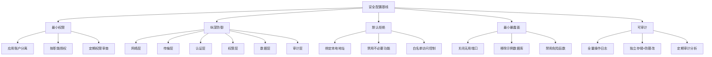

## 5. 数据库安全配置基线

数据库安全配置基线（Security Configuration Baseline）是一套经过安全评估和最佳实践验证的最小安全配置集合。它定义了数据库系统在部署到生产环境之前必须满足的安全要求，是防御SQL注入、未授权访问、数据泄露等攻击的第一道也是最关键的防线。

为什么安全配置基线如此重要？因为绝大多数数据库安全事件并非源于高深的零日漏洞，而是源于**配置缺陷**——默认密码未修改、远程访问未限制、审计日志未开启、权限分配过宽。Verizon《2024年数据泄露调查报告》显示，超过30%的数据泄露事件与数据库配置错误直接相关。CIS（Center for Internet Security）发布的数据库安全基准（CIS Benchmarks）已成为全球公认的配置标准，被PCI DSS、HIPAA、GDPR、等保2.0等合规框架广泛引用。

### 5.1 安全配置基线的核心原则

在制定任何数据库的安全配置基线之前，需要理解以下五条核心原则，它们贯穿所有数据库类型：

**最小权限原则（Principle of Least Privilege）**

每个数据库账户只应拥有完成其职能所需的最小权限集合。应用程序连接数据库时，绝不应使用DBA或root账户。具体策略：按应用模块创建独立账户，只授予必要的SELECT/INSERT/UPDATE/DELETE权限，禁止GRANT OPTION，定期审查权限并回收不再使用的授权。

**纵深防御原则（Defense in Depth）**

单一安全措施不可靠，必须在多个层面部署防护：网络层（防火墙、VPC隔离）、传输层（TLS/SSL加密）、认证层（强密码+MFA）、权限层（RBAC/ABAC）、数据层（加密存储）、审计层（全量日志记录）。任何单一层的突破不应导致数据泄露。

**默认拒绝原则（Default Deny）**

所有未明确允许的访问都应被拒绝。数据库默认配置通常偏向"易用性"而非"安全性"，安全基线的目标是将默认状态从"开放"转为"封闭"。新部署的数据库应默认绑定localhost，密码策略默认最严格，审计日志默认开启。

**最小暴露面原则（Minimal Attack Surface）**

关闭所有不需要的功能、端口、协议和插件。MySQL的LOCAL INFILE功能、MongoDB的eval()函数、PostgreSQL的dblink扩展——如果业务不需要，就应该禁用。每个多余的功能都是潜在的攻击向量。

**可审计原则（Auditability）**

所有安全相关的操作必须可追溯。这包括：用户登录/登出、权限变更、数据定义语言（DDL）操作、敏感数据访问、批量数据导出。审计日志应独立存储、防篡改、有合理的保留周期。



### 5.2 MySQL / MariaDB 安全配置基线

MySQL是全球使用最广泛的关系型数据库之一，也是攻击者最常针对的目标。以下配置基于CIS MySQL Benchmark 8.0和等保2.0三级要求。

#### 5.2.1 安装后初始化加固

MySQL安装后存在多个安全隐患，必须在首次投入生产前完成以下初始化操作：

```sql
-- 1. 运行内置安全脚本（MySQL 5.7+）
-- mysql_secure_installation 替代手动操作，但需理解其每一步含义
-- 设置root密码 → 删除匿名用户 → 禁止远程root登录 → 删除test数据库 → 刷新权限

-- 2. 手动删除匿名用户
DELETE FROM mysql.user WHERE User='';
FLUSH PRIVILEGES;

-- 3. 禁止远程root登录（仅允许本地连接）
DELETE FROM mysql.user 
WHERE User='root' AND Host NOT IN ('localhost', '127.0.0.1', '::1');
FLUSH PRIVILEGES;

-- 4. 删除测试数据库及其权限
DROP DATABASE IF EXISTS test;
DELETE FROM mysql.db WHERE Db='test' OR Db='test\\_%';
FLUSH PRIVILEGES;

-- 5. 查看当前所有用户及其主机，确认无多余账户
SELECT User, Host, plugin, authentication_string FROM mysql.user;
```

**关键解读**：匿名用户（User为空字符串的行）允许任何人无需密码连接到MySQL，这是最严重的默认安全隐患之一。`test`数据库虽然为空，但默认所有用户都有完全访问权限，攻击者可利用它作为跳板执行CREATETABLESPACE等操作。

#### 5.2.2 认证与密码策略

```sql
-- 1. 安装密码验证组件（MySQL 8.0+）
INSTALL COMPONENT 'file://component_validate_password';

-- MySQL 5.7使用插件方式
-- INSTALL PLUGIN validate_password SONAME 'validate_password.so';

-- 2. 配置密码策略
SET GLOBAL validate_password.policy = MEDIUM;     -- MEDIUM: 长度+数字+大小写+特殊字符
SET GLOBAL validate_password.length = 12;          -- 最小长度12位
SET GLOBAL validate_password.mixed_case_count = 1; -- 至少1个大写+1个小写
SET GLOBAL validate_password.number_count = 1;     -- 至少1个数字
SET GLOBAL validate_password.special_char_count = 1; -- 至少1个特殊字符
SET GLOBAL validate_password.dictionary_file = '';  -- 可选：配置字典文件路径

-- 3. 设置密码过期策略
SET GLOBAL default_password_lifetime = 90;  -- 密码90天强制更换
ALTER USER 'app_user'@'%' PASSWORD EXPIRE INTERVAL 180 DAY;

-- 4. 防止密码重用
SET GLOBAL password_history = 5;             -- 记住最近5个密码
SET GLOBAL password_reuse_interval = 365;    -- 365天内不允许重用
SET GLOBAL password_require_current = ON;    -- 修改密码需提供当前密码

-- 5. 配置登录失败锁定（MySQL 8.0.19+）
ALTER USER 'app_user'@'%' FAILED_LOGIN_ATTEMPTS 5 PASSWORD_LOCK_TIME 1;
-- 5次失败后锁定1天

-- 6. 使用强认证插件（MySQL 8.0默认caching_sha2_password）
-- 确认所有用户使用强认证方式
SELECT User, Host, plugin FROM mysql.user WHERE plugin != 'caching_sha2_password';
-- 对仍在使用mysql_native_password的用户升级认证方式
ALTER USER 'legacy_user'@'%' IDENTIFIED WITH caching_sha2_password BY 'NewStr0ng!Pass';
```

**常见误区**：`validate_password.policy = LOW`只检查密码长度，不检查复杂度，等于没有策略。`LENGTH = 8`对于现代硬件的暴力破解能力来说远远不够。务必使用MEDIUM或HIGH策略，长度不低于12。

#### 5.2.3 网络与连接安全

在 `my.cnf`（Linux: `/etc/mysql/my.cnf` 或 `/etc/my.cnf`）中配置：

```ini
[mysqld]
# 1. 绑定地址：仅监听本地，如需远程访问绑定内网IP
bind-address = 127.0.0.1

# 2. 修改默认端口（可选，安全通过隐匿实现）
port = 3307

# 3. 启用TLS加密连接
require_secure_transport = ON
ssl-ca = /etc/mysql/ssl/ca-cert.pem
ssl-cert = /etc/mysql/ssl/server-cert.pem
ssl-key = /etc/mysql/ssl/server-key.pem
tls_version = TLSv1.2,TLSv1.3
ssl-cipher = ECDHE-ECDSA-AES256-GCM-SHA384:ECDHE-RSA-AES256-GCM-SHA384

# 4. 限制连接数（防暴力破解和DoS）
max_connections = 200
max_connect_errors = 10        -- 10次连接失败后拒绝该主机
connect_timeout = 10           -- 连接超时10秒
wait_timeout = 600             -- 空闲连接600秒后断开
interactive_timeout = 600

# 5. 禁用LOCAL INFILE（防止通过SQL注入读取服务器文件）
local_infile = OFF

# 6. 禁用符号链接（防止通过符号链接攻击数据文件）
symbolic-links = OFF

# 7. 禁用SHOW DATABASES对非特权用户
skip-show-database
```

```sql
-- 运行时检查TLS状态
SHOW VARIABLES LIKE '%ssl%';
-- 确认连接使用了TLS
SHOW STATUS LIKE 'Ssl_cipher';
-- 如果返回空值，说明当前连接未使用TLS

-- 查看被拒绝的连接尝试
SHOW GLOBAL STATUS LIKE 'Connection_errors_max_connections';
SHOW GLOBAL STATUS LIKE 'Aborted_connects';
```

**关键配置解读**：

| 配置项 | 危险值 | 安全值 | 风险说明 |
|--------|--------|--------|----------|
| `bind-address` | `0.0.0.0` | `127.0.0.1` 或内网IP | 0.0.0.0暴露到公网 |
| `local_infile` | `ON` | `OFF` | 被SQL注入利用读取服务器文件 |
| `max_connect_errors` | `1000000` 或默认 | `10`-`100` | 防暴力破解 |
| `require_secure_transport` | `OFF` | `ON` | 明文传输可被嗅探 |
| `skip-grant-tables` | 存在 | 移除 | 绕过所有认证 |

#### 5.2.4 权限精细化管理

```sql
-- 1. 创建应用专用账户（最小权限原则）
CREATE USER 'webapp_readonly'@'10.0.1.%' 
    IDENTIFIED BY 'R3ad0nly!Str0ng'
    PASSWORD EXPIRE INTERVAL 90 DAY
    FAILED_LOGIN_ATTEMPTS 5 PASSWORD_LOCK_TIME 1;

GRANT SELECT ON production_db.* TO 'webapp_readonly'@'10.0.1.%';

-- 2. 读写账户（限定具体库和表）
CREATE USER 'webapp_rw'@'10.0.1.%' 
    IDENTIFIED BY 'RW!Str0ng2024'
    PASSWORD EXPIRE INTERVAL 90 DAY;

GRANT SELECT, INSERT, UPDATE, DELETE 
    ON production_db.orders TO 'webapp_rw'@'10.0.1.%';
GRANT SELECT, INSERT, UPDATE, DELETE 
    ON production_db.users TO 'webapp_rw'@'10.0.1.%';
-- 注意：不授予 DROP, ALTER, CREATE, GRANT OPTION

-- 3. 禁止危险操作权限
-- 以下权限绝不授予应用账户：
-- FILE: 读写服务器文件
-- PROCESS: 查看所有连接的SQL
-- SUPER: 杀死任何连接、设置全局变量
-- SHUTDOWN: 关闭数据库
-- GRANT OPTION: 授予自身更多权限
-- RELOAD: FLUSH操作
-- REPLICATION SLAVE/CLIENT: 复制相关

-- 4. 审查当前权限
SHOW GRANTS FOR 'webapp_rw'@'10.0.1.%';

-- 5. 回收多余权限
REVOKE ALL PRIVILEGES, GRANT OPTION FROM 'compromised_user'@'%';

-- 6. 列出所有用户及其权限概览
SELECT 
    u.User, u.Host, u.Super_priv, u.File_priv, 
    u.Grant_priv, u.Repl_slave_priv
FROM mysql.user u
WHERE u.User NOT IN ('mysql.sys', 'mysql.session', 'mysql.infoschema', 'root');
```

#### 5.2.5 审计日志配置

```ini
# my.cnf 中启用审计日志

# 方式一：通用查询日志（开发环境/调试用，生产慎用）
# 记录所有SQL，性能影响极大
general_log = OFF                    -- 生产环境默认关闭
general_log_file = /var/log/mysql/general.log

# 方式二：慢查询日志（定位性能问题+可疑查询）
slow_query_log = ON
slow_query_log_file = /var/log/mysql/slow.log
long_query_time = 2                  -- 超过2秒的查询记录
log_queries_not_using_indexes = ON   -- 记录未使用索引的查询

# 方式三：错误日志（必须开启）
log_error = /var/log/mysql/error.log
log_error_verbosity = 3              -- 1=Error, +2=Warning, +3=Note

# 方式四：二进制日志（用于恢复和审计）
log-bin = /var/log/mysql/mysql-bin
binlog_format = ROW                  -- ROW格式记录更详细
expire_logs_days = 30                -- 保留30天
max_binlog_size = 100M

# 方式五：MySQL Enterprise Audit / MariaDB Audit Plugin（推荐）
# MySQL 8.0 Enterprise
# plugin-load-add = audit_log.so
# audit_log_policy = ALL
# audit_log_format = JSON

# MariaDB
# plugin-load-add = server_audit.so
# server_audit_logging = ON
# server_audit_events = CONNECT,QUERY_DDL,QUERY_DML
# server_audit_file_rotate_size = 100000000
# server_audit_file_rotations = 10
```

```sql
-- 启用连接失败日志（所有版本）
SET GLOBAL log_error_verbosity = 3;

-- MySQL 8.0 组件化审计
INSTALL COMPONENT 'file://component_audit_api_message_emit';
-- 配合企业版audit_log插件使用

-- 验证审计配置生效
SHOW VARIABLES LIKE '%audit%';
SHOW VARIABLES LIKE '%general_log%';
SHOW VARIABLES LIKE '%slow_query%';
```

#### 5.2.6 其他安全加固

```ini
[mysqld]
# 数据加密（表空间加密）
early-plugin-load = keyring_file.so
keyring_file_data = /var/lib/mysql-keyring/keyring
# 然后对表启用加密：
# ALTER TABLE sensitive_data ENCRYPTION='Y';

# SQL模式（严格模式，防止数据截断和无效值）
sql_mode = STRICT_TRANS_TABLES,NO_ZERO_IN_DATE,NO_ZERO_DATE,ERROR_FOR_DIVISION_BY_ZERO,NO_ENGINE_SUBSTITUTION

# 禁用LOAD DATA LOCAL（双重保险）
local_infile = OFF

# 文件操作限制
secure_file_priv = /var/lib/mysql-files/
# NULL = 禁用LOAD/SELECT INTO OUTFILE
# 空字符串 = 任意目录（极不安全）
# 指定路径 = 仅允许该目录
```

```sql
-- 检查是否启用了表空间加密
SELECT TABLE_SCHEMA, TABLE_NAME, CREATE_OPTIONS 
FROM information_schema.TABLES 
WHERE CREATE_OPTIONS LIKE '%ENCRYPTION%';

-- 定期检查安全配置
-- 1. 查找弱密码用户（密码哈希为空）
SELECT User, Host FROM mysql.user WHERE authentication_string = '' OR authentication_string IS NULL;

-- 2. 查找拥有过高权限的非系统用户
SELECT User, Host FROM mysql.user 
WHERE Super_priv = 'Y' AND User NOT IN ('root', 'mysql.sys', 'mysql.session');

-- 3. 查找允许从任意主机连接的用户
SELECT User, Host FROM mysql.user WHERE Host = '%';
-- Host='%' 意味着该用户可以从任何IP连接，高风险
```

### 5.3 PostgreSQL 安全配置基线

PostgreSQL以其强大的安全特性著称（行级安全策略、标签安全扩展等），但默认配置仍有改进空间。

#### 5.3.1 认证配置（pg_hba.conf）

`pg_hba.conf`（Host-Based Authentication）是PostgreSQL安全的第一道门，控制哪些客户端可以从哪里以什么方式连接哪个数据库。

```conf
# TYPE  DATABASE    USER        ADDRESS           METHOD

# 1. 本地连接使用SCRAM-SHA-256（PostgreSQL 10+默认）
local   all         all                           scram-sha-256

# 2. 本地TCP连接要求加密认证
host    all         all         127.0.0.1/32      scram-sha-256
host    all         all         ::1/128           scram-sha-256

# 3. 内网应用连接：限定具体数据库和用户，使用SCRAM
host    app_db      app_user    10.0.0.0/8        scram-sha-256
host    app_db      readonly    10.0.0.0/8        scram-sha-256

# 4. 复制连接（如使用流复制）
host    replication repl_user   10.0.0.5/32       scram-sha-256

# 5. 拒绝所有其他连接（隐式存在，但显式写出更清晰）
host    all         all         0.0.0.0/0         reject
```

**关键规则**：
- **绝不使用 `trust`**：trust方法允许无密码认证，等同于裸奔
- **绝不在公网使用 `password`**：password方法使用MD5哈希传输，可被中间人攻击
- **使用 `scram-sha-256`**：PostgreSQL 10+支持的最安全密码认证方式
- **规则顺序敏感**：pg_hba.conf从上到下匹配，第一条匹配的规则生效。将更具体的规则放在前面，通用拒绝规则放在最后
- **绝不使用 `0.0.0.0/0` 配合 `trust` 或 `password`**

#### 5.3.2 postgresql.conf 安全参数

```conf
# === 连接安全 ===
listen_addresses = '127.0.0.1'           # 仅监听本地（需远程时绑定内网IP）
port = 5432                              # 默认端口，可更改
max_connections = 100                    # 限制最大连接数
superuser_reserved_connections = 3       # 为超级用户保留的连接数
password_encryption = scram-sha-256      # 密码加密算法

# === SSL/TLS配置 ===
ssl = on
ssl_cert_file = '/etc/postgresql/ssl/server.crt'
ssl_key_file = '/etc/postgresql/ssl/server.key'
ssl_ca_file = '/etc/postgresql/ssl/ca.crt'
ssl_min_protocol_version = 'TLSv1.2'
ssl_ciphers = 'HIGH:!aNULL:!MD5:!3DES:!RC4'

# === 日志与审计 ===
logging_collector = on
log_directory = 'pg_log'
log_filename = 'postgresql-%Y-%m-%d.log'
log_rotation_age = 1d
log_rotation_size = 100MB
log_connections = on                     # 记录连接尝试
log_disconnections = on                  # 记录断开连接
log_line_prefix = '%t [%p]: user=%u,db=%d,app=%a,client=%h '
log_statement = 'ddl'                    # none/ddl/mod/all
# 'ddl'记录CREATE/ALTER/DROP，'mod'额外记录INSERT/UPDATE/DELETE
log_min_duration_statement = 1000        # 记录超过1秒的慢查询（毫秒）
log_lock_waits = on                      # 记录锁等待
log_temp_files = 0                       # 记录所有临时文件使用

# === 安全加固 ===
shared_preload_libraries = 'pgaudit'     # 加载审计扩展
# pgaudit.log = 'ddl,role,write'         # pgaudit配置
row_security = on                        # 启用行级安全策略
```

#### 5.3.3 权限管理与行级安全

```sql
-- 1. 创建角色（PostgreSQL推荐用角色替代用户）
-- 应用只读角色
CREATE ROLE app_readonly NOLOGIN;
GRANT CONNECT ON DATABASE app_db TO app_readonly;
GRANT USAGE ON SCHEMA public TO app_readonly;
GRANT SELECT ON ALL TABLES IN SCHEMA public TO app_readonly;
ALTER DEFAULT PRIVILEGES IN SCHEMA public GRANT SELECT ON TABLES TO app_readonly;

-- 应用读写角色
CREATE ROLE app_readwrite NOLOGIN;
GRANT CONNECT ON DATABASE app_db TO app_readwrite;
GRANT USAGE ON SCHEMA public TO app_readwrite;
GRANT SELECT, INSERT, UPDATE, DELETE ON ALL TABLES IN SCHEMA public TO app_readwrite;
ALTER DEFAULT PRIVILEGES IN SCHEMA public 
    GRANT SELECT, INSERT, UPDATE, DELETE ON TABLES TO app_readwrite;

-- 创建登录用户并赋予角色
CREATE USER webapp_user WITH PASSWORD 'W3bApp!Str0ng2024';
GRANT app_readwrite TO webapp_user;

CREATE USER report_user WITH PASSWORD 'R3port!Str0ng2024';
GRANT app_readonly TO report_user;

-- 2. 行级安全策略（RLS）— PostgreSQL独有强大特性
-- 例如：用户只能看到自己的订单
CREATE TABLE orders (
    id SERIAL PRIMARY KEY,
    user_id INT NOT NULL,
    amount DECIMAL(10,2),
    created_at TIMESTAMP DEFAULT NOW()
);

ALTER TABLE orders ENABLE ROW LEVEL SECURITY;

-- 创建策略：用户只能访问自己的数据
CREATE POLICY user_orders_policy ON orders
    FOR ALL
    USING (user_id = current_setting('app.current_user_id')::INT)
    WITH CHECK (user_id = current_setting('app.current_user_id')::INT);

-- 应用在每次请求时设置当前用户ID
-- SET app.current_user_id = '12345';
-- SELECT * FROM orders;  -- 自动只返回user_id=12345的行

-- 3. 定期审查权限
SELECT r.rolname, r.rolsuper, r.rolinherit, r.rolcreaterole, 
       r.rolcreatedb, r.rolcanlogin
FROM pg_catalog.pg_roles r
WHERE r.rolname NOT LIKE 'pg_%'
ORDER BY r.rolname;

-- 查找所有表的权限
SELECT grantee, table_schema, table_name, privilege_type
FROM information_schema.table_privileges
WHERE grantee NOT IN ('postgres')
ORDER BY grantee, table_name;

-- 4. pgAudit扩展（比内置日志更强大）
-- 安装: CREATE EXTENSION IF NOT EXISTS pgaudit;
-- 配置示例
ALTER SYSTEM SET pgaudit.log = 'ddl, role, write';
ALTER SYSTEM SET pgaudit.log_catalog = off;  -- 减少噪音
SELECT pg_reload_conf();
```

#### 5.3.4 安全最佳实践要点

| 安全措施 | 配置/命令 | 说明 |
|----------|-----------|------|
| 禁止trust认证 | pg_hba.conf中无trust行 | trust等同于无密码 |
| 默认schema隔离 | 每个应用独立schema | 避免public schema共享 |
| 禁用不需要的扩展 | `DROP EXTENSION IF EXISTS dblink;` | dblink可跨库查询 |
| 限制COPY操作 | 通过RLS和权限控制 | 防止数据导出攻击 |
| 使用`pg_hba.conf.reload()` | 不重启生效 | 但SSL证书变更需重启 |
| 定期运行`ANALYZE` | `ANALYZE;` | 更新统计信息辅助查询计划 |

### 5.4 MongoDB 安全配置基线

MongoDB在2015-2017年间因默认无认证配置导致数万实例被勒索攻击（MongoDB Apocalypse），此后默认安全配置大幅提升，但仍需手动加固。

#### 5.4.1 启用访问控制与认证

```javascript
// 1. 创建管理员用户（必须首先创建）
use admin
db.createUser({
    user: "admin_user",
    pwd: "Adm!nStr0ng2024",
    roles: [
        { role: "userAdminAnyDatabase", db: "admin" },
        { role: "clusterAdmin", db: "admin" }
    ]
});

// 2. 创建应用专用用户（遵循最小权限原则）
use myapp
db.createUser({
    user: "app_readwrite",
    pwd: "AppRW!Str0ng2024",
    roles: [
        { role: "readWrite", db: "myapp" }
    ]
});

// 只读用户
db.createUser({
    user: "app_readonly",
    pwd: "AppR3ad!Str0ng2024",
    roles: [
        { role: "read", db: "myapp" }
    ]
});

// 3. 启动时启用认证
// mongod --auth
// 或在配置文件中：
// security:
//   authorization: enabled
```

**MongoDB角色说明**：

| 角色 | 权限级别 | 适用场景 |
|------|----------|----------|
| `read` | 只读 | 报表查询、数据分析 |
| `readWrite` | 读写 | 应用正常操作 |
| `dbAdmin` | 数据库管理（不含用户管理） | DBA日常维护 |
| `userAdmin` | 用户管理 | 安全管理员 |
| `clusterAdmin` | 集群管理 | MongoDB管理员 |
| `readAnyDatabase` | 所有数据库只读 | 全局报表 |
| `root` | 超级管理员 | 紧急维护，慎用 |

#### 5.4.2 网络安全配置

```yaml
# mongod.conf 完整安全配置
net:
  port: 27017
  bindIp: 127.0.0.1,10.0.1.100    # 仅绑定本地和内网IP
  # bindIpAll: true               # 绝不在生产环境使用
  tls:
    mode: requireTLS
    certificateKeyFile: /etc/ssl/mongodb/server.pem
    CAFile: /etc/ssl/mongodb/ca.pem
    disabledProtocols: TLS1_0,TLS1_1
    allowConnectionsWithoutCertificates: false

security:
  authorization: enabled            # 启用RBAC
  javascriptEnabled: false          # 禁用服务端JavaScript
  # 禁用eval()、$where等JavaScript操作
  
operationProfiling:
  mode: slowOp
  slowOpThresholdMs: 1000           # 记录超过1秒的操作

systemLog:
  destination: file
  path: /var/log/mongodb/mongod.log
  logAppend: true
  
storage:
  dbPath: /var/lib/mongodb
  journal:
    enabled: true                   # 启用日志（数据持久性）
```

```javascript
// 运行时安全检查
// 1. 验证TLS连接
db.adminCommand({getParameter: 1, tlsMode: 1});

// 2. 检查当前连接
db.currentOp(true);

// 3. 查看审计配置
db.adminCommand({getParameter: 1, auditAuthorizationSuccess: 1});
```

#### 5.4.3 字段级加密与审计

```javascript
// 1. 客户端字段级加密（CSFLE, MongoDB 4.2+）
// 敏感字段在客户端加密后存储，服务端看不到明文
// 需要在应用代码中配置：
const encryption = {
    keyVaultNamespace: "encryption.__keyVault",
    kmsProviders: {
        local: {
            key: BinData(0, "base64encodedMasterKey...")
        }
    },
    schemaMap: {
        "myapp.patients": {
            bsonType: "object",
            properties: {
                ssn: {
                    encrypt: {
                        bsonType: "string",
                        algorithm: "AEAD_AES_256_CBC_HMAC_SHA_512-Deterministic"
                    }
                },
                creditCard: {
                    encrypt: {
                        bsonType: "string",
                        algorithm: "AEAD_AES_256_CBC_HMAC_SHA_512-Random"
                    }
                }
            }
        }
    }
};

// 2. 审计日志（Enterprise版）
// mongod.conf
// auditLog:
//   destination: file
//   format: JSON
//   path: /var/log/mongodb/audit.json
//   filter: '{ atype: { $in: ["authenticate", "authCheck", "createUser", "dropUser", "updateUser"] } }'

// 3. 社区版审计替代方案：使用Profiler
db.setProfilingLevel(1, { slowms: 0 });  // 记录所有慢操作
// 查看profile集合
db.system.profile.find().sort({ts: -1}).limit(10).pretty();
```

#### 5.4.4 MongoDB安全配置检查清单

```javascript
// 自动化安全检查脚本
// 保存为 check_mongo_security.js，使用 mongo < check_mongo_security.js 执行

// 1. 检查是否启用认证
print("=== 认证状态 ===");
var authStatus = db.adminCommand({getParameter: 1, authenticationMechanisms: 1});
printjson(authStatus);

// 2. 检查绑定IP
print("=== 绑定地址 ===");
var bindIp = db.adminCommand({getParameter: 1, net.bindIp: 1});
printjson(bindIp);

// 3. 检查是否有空密码用户
print("=== 用户检查 ===");
db.getSiblingDB("admin").system.users.find({credentials: {$exists: true}}).forEach(function(u) {
    print("User: " + u.user + " | DB: " + u.db + " | Roles: " + JSON.stringify(u.roles));
});

// 4. 检查JavaScript是否被禁用
print("=== JavaScript状态 ===");
var jsStatus = db.adminCommand({getParameter: 1, javascriptEnabled: 1});
printjson(jsStatus);

// 5. 检查TLS配置
print("=== TLS状态 ===");
var tlsStatus = db.adminCommand({getParameter: 1, tlsMode: 1});
printjson(tlsStatus);
```

### 5.5 Redis 安全配置基线

Redis默认**无认证、绑定所有接口、无加密**，是高风险默认配置的典型代表。2018-2020年间，数万个暴露在公网的Redis实例被植入挖矿木马。

#### 5.5.1 核心安全配置

```conf
# redis.conf 安全基线

# 1. 绑定地址（最基础的防护）
bind 127.0.0.1 -::1
# 生产环境：bind 127.0.0.1 10.0.1.50

# 2. 启用密码认证（Redis 6.0+推荐使用ACL）
requirepass YourStr0ngRedis!Pass2024

# 3. Redis 6.0+ ACL（更细粒度的访问控制）
# 创建受限用户
# user app_readonly on >R3adPass! ~* +@read -@write -@admin -@dangerous
# user app_readwrite on >RWPass! ~app:* +@read +@write -@admin -@dangerous

# 4. 禁用危险命令
rename-command FLUSHDB ""
rename-command FLUSHALL ""
rename-command DEBUG ""
rename-command CONFIG ""
rename-command KEYS ""
rename-command SHUTDOWN ""
rename-command SAVE ""
rename-command BGSAVE ""
rename-command BGREWRITEAOF ""
rename-command SLAVEOF ""
# 注意：rename-command在Redis 6.2+中推荐使用ACL替代

# 5. 启用TLS（Redis 6.0+）
tls-port 6380
port 0                              # 禁用非TLS端口
tls-cert-file /etc/redis/tls/redis.crt
tls-key-file /etc/redis/tls/redis.key
tls-ca-cert-file /etc/redis/tls/ca.crt
tls-auth-clients optional           # 或 yes（双向认证）
tls-protocols "TLSv1.2 TLSv1.3"

# 6. 保护模式（默认开启）
protected-mode yes
# 当没有密码且绑定非本地地址时拒绝外部连接

# 7. 以非root用户运行
user redis                          # 创建redis用户
# 在systemd unit中设置 User=redis

# 8. 禁用Lua脚本的危险操作
# 默认已限制，但确认：
lua-time-limit 5000                 # Lua脚本最长执行5秒

# 9. 慢日志
slowlog-log-slower-than 10000       # 超过10ms的命令记录
slowlog-max-len 128                 # 保留128条

# 10. 最大内存限制（防DoS）
maxmemory 2gb
maxmemory-policy allkeys-lru
```

#### 5.5.2 Redis ACL 详解（6.0+）

```bash
# Redis CLI 中配置ACL

# 查看当前所有用户
ACL LIST

# 默认用户（相当于requirepass）
ACL SETUSER default on >YourStr0ngRedis!Pass2024 ~* +@all

# 创建应用只读用户
ACL SETUSER app_reader on >R3ad0nly!Pass ~cache:* +@read -@write -@admin -@dangerous -@slow

# 创建应用读写用户
ACL SETUSER app_writer on >RW!Str0ng2024 ~cache:* +@read +@write -@admin -@dangerous

# 创建管理用户（仅从本地连接）
ACL SETUSER redis_admin on >Adm!nPass2024 ~* +@all

# 保存ACL配置到文件
ACL SAVE

# 查看用户权限
ACL GETUSER app_reader

# 查看命令分类
ACL CAT
ACL CAT dangerous

# 查看当前连接使用的用户
ACL WHOAMI
```

**Redis ACL权限类别**：

| 类别 | 包含的命令示例 | 风险级别 |
|------|---------------|----------|
| `@read` | GET, MGET, HGET, LRANGE, SCAN | 低 |
| `@write` | SET, DEL, EXPIRE, LPUSH | 中 |
| `@admin` | CONFIG, DEBUG, SAVE, SHUTDOWN | 高 |
| `@dangerous` | KEYS, FLUSHALL, FLUSHDB, DEBUG | 极高 |
| `@slow` | KEYS, SORT, SAVE, BGSAVE | 中（影响性能） |
| `@scripting` | EVAL, EVALSHA | 中 |

#### 5.5.3 Redis持久化与数据安全

```conf
# RDB持久化（定期快照）
save 900 1                          # 900秒内1次变更则快照
save 300 10                         # 300秒内10次变更则快照
save 60 10000                       # 60秒内10000次变更则快照
dbfilename dump.rdb
dir /var/lib/redis

# AOF持久化（记录每个写操作，更安全）
appendonly yes
appendfilename "appendonly.aof"
appendfsync everysec                # 每秒同步（性能与安全的平衡）
# appendfsync always               # 每个命令同步（最安全但最慢）
auto-aof-rewrite-percentage 100
auto-aof-rewrite-min-size 64mb

# AOF文件安全校验
aof-load-truncated yes
aof-use-rdb-preamble yes           # 混合持久化（推荐）
```

### 5.6 SQL Server 安全配置基线

SQL Server广泛应用于企业环境，其安全配置与Windows域控深度集成。

#### 5.6.1 认证模式与账户管理

```sql
-- 1. 使用Windows认证模式（推荐在域环境中）
-- Windows认证比SQL Server认证更安全，利用Kerberos/NTLM
-- 混合模式（Mixed Mode）仅在无法使用Windows认证时启用

-- 2. 禁用sa账户（SQL Server认证模式下必须操作）
ALTER LOGIN sa DISABLE;
ALTER LOGIN sa WITH NAME = [disabled_sa];  -- 重命名sa账户

-- 3. 创建应用专用账户
USE [AppDB];
CREATE LOGIN AppUser WITH PASSWORD = 'App!Str0ng2024',
    CHECK_POLICY = ON,           -- 应用Windows密码策略
    CHECK_EXPIRATION = ON;       -- 密码过期

CREATE USER AppUser FOR LOGIN AppUser;
-- 授予最小权限
GRANT SELECT, INSERT, UPDATE, DELETE ON SCHEMA::dbo TO AppUser;
-- 不授予CREATE TABLE, ALTER, DROP, CONTROL等

-- 4. 创建只读用户
CREATE LOGIN ReportUser WITH PASSWORD = 'R3port!Str0ng2024',
    CHECK_POLICY = ON, CHECK_EXPIRATION = ON;
CREATE USER ReportUser FOR LOGIN ReportUser;
ALTER ROLE db_datareader ADD MEMBER ReportUser;

-- 5. 审查所有登录名和权限
SELECT sp.name, sp.type_desc, sp.is_disabled,
       dp.name AS database_user, dp.type_desc
FROM sys.server_principals sp
LEFT JOIN sys.database_principals dp ON sp.sid = dp.sid
WHERE sp.type IN ('S', 'U', 'G')
ORDER BY sp.name;
```

#### 5.6.2 加密与审计

```sql
-- 1. 启用连接加密（TDE透明数据加密 — 静态加密）
-- 创建主密钥
USE master;
CREATE MASTER KEY ENCRYPTION BY PASSWORD = 'Mast3r!KeyStr0ng2024';
-- 创建证书
CREATE CERTIFICATE TDECert WITH SUBJECT = 'TDE Certificate';
-- 创建数据库加密密钥
USE AppDB;
CREATE DATABASE ENCRYPTION KEY
    WITH ALGORITHM = AES_256
    ENCRYPTION BY SERVER CERTIFICATE TDECert;
ALTER DATABASE AppDB SET ENCRYPTION ON;

-- 2. Always Encrypted（列级加密，应用端加密/解密）
-- 通过SQL Server Management Studio或PowerShell配置
-- 适用于SSN、信用卡号等极端敏感字段

-- 3. 配置SQL Server Audit
USE master;
CREATE SERVER AUDIT AppAudit
    TO FILE (FILEPATH = 'C:\SQLAudit\', MAXSIZE = 1000 MB, MAX_ROLLOVER_FILES = 10)
    WITH (ON_FAILURE = CONTINUE);
ALTER SERVER AUDIT AppAudit WITH (STATE = ON);

-- 创建服务器级审计规范
CREATE SERVER AUDIT SPECIFICATION ServerAuditSpec
    FOR SERVER AUDIT AppAudit
    ADD (SUCCESSFUL_LOGIN_GROUP),
    ADD (FAILED_LOGIN_GROUP),
    ADD (LOGOUT_GROUP),
    ADD (SERVER_ROLE_MEMBER_CHANGE_GROUP),
    ADD (DATABASE_ROLE_MEMBER_CHANGE_GROUP);
ALTER SERVER AUDIT SPECIFICATION ServerAuditSpec WITH (STATE = ON);

-- 创建数据库级审计规范
USE AppDB;
CREATE DATABASE AUDIT SPECIFICATION DBAuditSpec
    FOR SERVER AUDIT AppAudit
    ADD (SELECT ON SCHEMA::dbo BY AppUser),
    ADD (INSERT ON SCHEMA::dbo BY AppUser),
    ADD (UPDATE ON SCHEMA::dbo BY AppUser),
    ADD (DELETE ON SCHEMA::dbo BY AppUser),
    ADD (SCHEMA_OBJECT_CHANGE_GROUP);
ALTER DATABASE AUDIT SPECIFICATION DBAuditSpec WITH (STATE = ON);

-- 查看审计日志
SELECT event_time, server_principal_name, database_name, 
       statement, succeeded
FROM sys.fn_get_audit_file('C:\SQLAudit\*', DEFAULT, DEFAULT)
ORDER BY event_time DESC;
```

#### 5.6.3 SQL Server安全配置检查

```sql
-- 安全基线验证脚本

-- 1. 检查是否启用SQL Server认证（应为1=混合模式，域环境应为2=仅Windows）
SELECT SERVERPROPERTY('IsIntegratedSecurityOnly') AS WindowsAuthOnly;

-- 2. 检查sa账户状态
SELECT name, is_disabled FROM sys.server_principals WHERE name = 'sa';

-- 3. 检查拥有sysadmin权限的账户
SELECT sp.name, sp.type_desc 
FROM sys.server_principals sp
JOIN sys.server_role_members srm ON sp.principal_id = srm.member_principal_id
WHERE srm.role_principal_id = SUSER_ID('sysadmin');

-- 4. 检查TDE状态
SELECT name, is_encrypted FROM sys.databases WHERE is_encrypted = 1;

-- 5. 检查审计状态
SELECT name, status_desc FROM sys.server_audits;

-- 6. 检查SQL注入防护（参数化查询相关）
-- 确认应用使用参数化查询，而非字符串拼接
-- 此项无法通过SQL Server配置验证，需代码审计

-- 7. 检查xp_cmdshell（应禁用）
EXEC sp_configure 'xp_cmdshell';
-- 如果启用，立即禁用：
-- EXEC sp_configure 'xp_cmdshell', 0; RECONFIGURE;
```

### 5.7 合规框架与基线标准

安全配置基线不是凭空制定的，它与多个权威合规框架紧密关联。

#### 5.7.1 主要合规框架

| 框架 | 适用范围 | 数据库相关要求 |
|------|----------|---------------|
| **CIS Benchmarks** | 通用 | MySQL/PostgreSQL/MongoDB/SQL Server/Oracle/Redis均有专用Benchmark |
| **等保2.0（三级）** | 中国 | 身份鉴别、访问控制、安全审计、数据完整性/保密性、剩余信息保护 |
| **PCI DSS 4.0** | 支付行业 | 要求加密存储卡数据、最小权限、日志审计、漏洞管理 |
| **HIPAA** | 医疗 | PHI加密、访问控制、审计日志、数据备份 |
| **GDPR** | 欧盟 | 数据最小化、存储限制、加密、数据主体访问权 |
| **SOC 2 Type II** | SaaS/云 | 安全性、可用性、保密性、处理完整性 |

#### 5.7.2 等保2.0三级数据库安全要求映射

等保2.0三级是中国企业最常见的合规要求，其对数据库的安全要求可直接映射到配置基线：

| 等保要求 | 配置基线对应措施 |
|----------|-----------------|
| 身份鉴别 | 强密码策略 + 多因素认证 + 登录失败锁定 |
| 访问控制 | 最小权限原则 + RBAC + 行级安全策略 |
| 安全审计 | 全量审计日志 + 独立存储 + 定期分析 |
| 数据完整性 | 完整性约束 + 事务日志 + 备份校验 |
| 数据保密性 | TLS传输加密 + 静态加密 + 字段级加密 |
| 剩余信息保护 | 会话清理 + 内存锁定 + 安全删除 |

#### 5.7.3 CIS Benchmark快速对标

```bash
# 使用CIS-CAT工具自动扫描MySQL合规性
# CIS-CAT Pro: https://www.cisecurity.org/cybersecurity-tools/cis-cat-pro

# 开源替代方案
# 1. Lynis（Linux系统审计，包含数据库检查）
sudo lynis audit system --tests-from-group "database"

# 2. Docker-bench-security（容器环境）
docker run --rm --net host --pid host --userns host --cap-add audit_control \
    -v /var/lib:/var/lib:ro -v /var/run/docker.sock:/var/run/docker.sock:ro \
    docker/docker-bench-security

# 3. 数据库专用检查工具
# MySQL: mysql_secure_installation（官方内置）
# PostgreSQL: pgaudit + pgwatch2
# MongoDB: mongod --verbose + 官方安全检查清单
```

### 5.8 自动化基线检查与持续合规

手动检查基线效率低且容易遗漏。生产环境应建立自动化基线检查机制。

#### 5.8.1 Ansible自动化基线检查

```yaml
# mysql_security_baseline.yml
---
- name: MySQL Security Baseline Check
  hosts: db_servers
  become: yes
  vars:
    mysql_root_password: "{{ vault_mysql_root_password }}"
    
  tasks:
    - name: 检查MySQL绑定地址
      command: mysql -u root -p{{ mysql_root_password }} -e "SHOW VARIABLES LIKE 'bind_address';"
      register: bind_result
      changed_when: false
      
    - name: 验证绑定地址为localhost或内网
      assert:
        that:
          - "'127.0.0.1' in bind_result.stdout or '10.' in bind_result.stdout"
        fail_msg: "FAIL: MySQL绑定地址不安全，当前值为 {{ bind_result.stdout }}"
        success_msg: "PASS: MySQL绑定地址正确"

    - name: 检查匿名用户
      command: mysql -u root -p{{ mysql_root_password }} -N -e "SELECT COUNT(*) FROM mysql.user WHERE User='';"
      register: anon_result
      changed_when: false
      
    - name: 验证无匿名用户
      assert:
        that:
          - anon_result.stdout | trim == "0"
        fail_msg: "FAIL: 存在匿名用户"
        success_msg: "PASS: 无匿名用户"

    - name: 检查密码策略
      command: mysql -u root -p{{ mysql_root_password }} -N -e "SHOW VARIABLES LIKE 'validate_password.length';"
      register: pwd_len
      
    - name: 验证密码最小长度
      assert:
        that:
          - (pwd_len.stdout.split()[-1]) | int >= 12
        fail_msg: "FAIL: 密码最小长度不足12位"
        success_msg: "PASS: 密码长度策略正确"

    - name: 检查root远程登录
      command: mysql -u root -p{{ mysql_root_password }} -N -e "SELECT COUNT(*) FROM mysql.user WHERE User='root' AND Host NOT IN ('localhost','127.0.0.1','::1');"
      register: root_remote
      
    - name: 验证root不允许远程登录
      assert:
        that:
          - root_remote.stdout | trim == "0"
        fail_msg: "FAIL: root允许远程登录"

    - name: 检查TLS是否启用
      command: mysql -u root -p{{ mysql_root_password }} -N -e "SHOW VARIABLES LIKE 'have_ssl';"
      register: tls_result
      
    - name: 验证TLS已启用
      assert:
        that:
          - "'YES' in tls_result.stdout"
        fail_msg: "FAIL: TLS未启用"
```

#### 5.8.2 自定义Python检查脚本

```python
#!/usr/bin/env python3
"""
数据库安全基线自动检查工具
支持MySQL、PostgreSQL、MongoDB、Redis
输出JSON格式检查报告
"""

import json
import sys
from datetime import datetime

class SecurityBaselineChecker:
    def __init__(self):
        self.results = []
    
    def add_result(self, check_id, name, status, detail=""):
        """
        status: PASS / FAIL / WARN / INFO
        """
        self.results.append({
            "id": check_id,
            "name": name,
            "status": status,
            "detail": detail,
            "timestamp": datetime.now().isoformat()
        })
    
    def generate_report(self):
        total = len(self.results)
        passed = sum(1 for r in self.results if r["status"] == "PASS")
        failed = sum(1 for r in self.results if r["status"] == "FAIL")
        warned = sum(1 for r in self.results if r["status"] == "WARN")
        
        report = {
            "summary": {
                "total": total,
                "passed": passed,
                "failed": failed,
                "warnings": warned,
                "score": round(passed / total * 100, 1) if total > 0 else 0
            },
            "checks": self.results
        }
        return json.dumps(report, indent=2, ensure_ascii=False)


def check_mysql(host="127.0.0.1", port=3306, user="root", password=""):
    """MySQL安全基线检查"""
    import pymysql
    
    checker = SecurityBaselineChecker()
    
    try:
        conn = pymysql.connect(host=host, port=port, user=user, password=password)
        cursor = conn.cursor()
        
        # 检查1：匿名用户
        cursor.execute("SELECT COUNT(*) FROM mysql.user WHERE User=''")
        count = cursor.fetchone()[0]
        checker.add_result("MYSQL-001", "匿名用户检查",
                          "PASS" if count == 0 else "FAIL",
                          f"发现 {count} 个匿名用户")
        
        # 检查2：root远程登录
        cursor.execute("SELECT COUNT(*) FROM mysql.user WHERE User='root' AND Host NOT IN ('localhost','127.0.0.1','::1')")
        count = cursor.fetchone()[0]
        checker.add_result("MYSQL-002", "Root远程登录检查",
                          "PASS" if count == 0 else "FAIL",
                          f"发现 {count} 个允许远程登录的root账户")
        
        # 检查3：TLS状态
        cursor.execute("SHOW VARIABLES LIKE 'have_ssl'")
        result = cursor.fetchone()
        ssl_status = result[1] if result else "NO"
        checker.add_result("MYSQL-003", "TLS加密检查",
                          "PASS" if ssl_status == "YES" else "FAIL",
                          f"TLS状态: {ssl_status}")
        
        # 检查4：密码验证插件
        cursor.execute("SHOW VARIABLES LIKE 'validate_password.policy'")
        result = cursor.fetchone()
        if result:
            policy = result[1]
            checker.add_result("MYSQL-004", "密码策略检查",
                              "PASS" if policy in ("MEDIUM", "STRONG") else "WARN",
                              f"密码策略: {policy}")
        else:
            checker.add_result("MYSQL-004", "密码策略检查", "FAIL",
                              "validate_password插件未安装")
        
        # 检查5：安全文件目录
        cursor.execute("SHOW VARIABLES LIKE 'secure_file_priv'")
        result = cursor.fetchone()
        if result and result[1]:
            checker.add_result("MYSQL-005", "安全文件目录检查",
                              "PASS", f"secure_file_priv = {result[1]}")
        else:
            checker.add_result("MYSQL-005", "安全文件目录检查", "FAIL",
                              "secure_file_priv未设置或为空字符串，LOAD DATA可能读写任意文件")
        
        # 检查6：LOCAL INFILE
        cursor.execute("SHOW VARIABLES LIKE 'local_infile'")
        result = cursor.fetchone()
        checker.add_result("MYSQL-006", "LOCAL INFILE检查",
                          "PASS" if result and result[1] == "OFF" else "FAIL",
                          f"local_infile = {result[1] if result else 'ON'}")
        
        # 检查7：测试数据库
        cursor.execute("SHOW DATABASES LIKE 'test'")
        result = cursor.fetchone()
        checker.add_result("MYSQL-007", "测试数据库检查",
                          "PASS" if not result else "WARN",
                          "test数据库应被删除")
        
        # 检查8：拥有SUPER权限的用户
        cursor.execute("SELECT User, Host FROM mysql.user WHERE Super_priv='Y' AND User NOT IN ('root','mysql.sys','mysql.session','mysql.infoschema')")
        super_users = cursor.fetchall()
        checker.add_result("MYSQL-008", "SUPER权限检查",
                          "PASS" if len(super_users) == 0 else "WARN",
                          f"SUPER权限用户: {super_users}")
        
        conn.close()
        
    except Exception as e:
        checker.add_result("MYSQL-ERR", "连接错误", "FAIL", str(e))
    
    return checker.generate_report()


if __name__ == "__main__":
    if len(sys.argv) < 2:
        print("用法: python security_check.py <mysql|pg|mongo|redis> [host] [port]")
        sys.exit(1)
    
    db_type = sys.argv[1]
    host = sys.argv[2] if len(sys.argv) > 2 else "127.0.0.1"
    
    if db_type == "mysql":
        print(check_mysql(host=host))
    else:
        print(f"暂不支持 {db_type}，请扩展SecurityBaselineChecker类")
```

### 5.9 常见配置误区与纠正

在数据库安全配置实践中，以下误区反复出现，需要特别警惕：

#### 误区一：修改默认端口等于安全

**错误做法**：将MySQL从3306改为33067，认为攻击者扫描不到。

**真相**：端口扫描工具（nmap、masscan）可以扫描全端口范围，修改端口只是"隐匿式安全"（Security by Obscurity），不能替代真正的安全措施。真正的防护是：绑定地址限制 + 防火墙规则 + 认证机制 + TLS加密。

**正确做法**：修改端口可以作为附加层减少自动扫描噪音，但**绝不作为主要安全措施**。

#### 误区二：数据库不需要防火墙

**错误做法**：仅依赖数据库自身认证，不配置主机防火墙。

**真相**：数据库认证机制可能被绕过（如MySQL认证协议漏洞CVE-2012-5611），防火墙提供独立于数据库的网络层防护。

**正确做法**：

```bash
# iptables示例：仅允许应用服务器(10.0.1.0/24)访问MySQL
iptables -A INPUT -p tcp --dport 3306 -s 10.0.1.0/24 -j ACCEPT
iptables -A INPUT -p tcp --dport 3306 -j DROP

# 使用firewalld
firewall-cmd --permanent --add-rich-rule='rule family="ipv4" source address="10.0.1.0/24" port port="3306" protocol="tcp" accept'
firewall-cmd --permanent --add-rich-rule='rule family="ipv4" port port="3306" protocol="tcp" reject'
firewall-cmd --reload
```

#### 误区三：密码哈希等于密码安全

**错误做法**：看到数据库存储的是哈希值就认为密码安全。

**真相**：MySQL 5.6及以前版本的`mysql_native_password`使用SHA1双哈希，可被彩虹表和GPU暴力破解快速破解。即使MySQL 8.0的`caching_sha2_password`，弱密码仍然可以在几秒内被破解。

**正确做法**：强密码策略 + 认证方式升级 + 登录失败锁定 + 定期更换。密码本身必须强，哈希算法只是增加破解成本。

#### 误区四：数据库加密就不需要其他安全措施

**错误做法**：启用了TDE（透明数据加密）后忽视访问控制和审计。

**真相**：TDE保护的是静态数据（磁盘被盗时），无法防御通过合法连接的数据泄露。如果攻击者获取了数据库账户密码，TDE对数据泄露毫无防护作用。TDE只解决"物理介质丢失"这一种场景。

**正确做法**：加密是纵深防御的一层，必须与强认证、最小权限、审计日志、网络隔离等措施配合使用。

#### 误区五：备份不需要加密

**错误做法**：数据库本体加密了，但备份文件（.sql dump、物理备份）以明文存储在共享存储或传输到备份服务器。

**真相**：数据库泄露事件中，备份文件往往是更容易被窃取的目标。备份服务器的安全级别通常低于数据库服务器。

**正确做法**：

```bash
# MySQL备份加密（使用openssl）
mysqldump --all-databases | openssl enc -aes-256-cbc -salt -pbkdf2 -out backup_$(date +%Y%m%d).sql.enc

# PostgreSQL备份加密
pg_dump app_db | openssl enc -aes-256-cbc -salt -pbkdf2 -out app_db_$(date +%Y%m%d).sql.enc

# MongoDB备份加密
mongodump --archive | openssl enc -aes-256-cbc -salt -pbkdf2 -out dump_$(date +%Y%m%d).archive.enc
```

#### 误区六：开发环境和生产环境共用配置

**错误做法**：开发环境的宽松配置（弱密码、test账户、详细日志）带入生产环境。

**真相**：开发环境的数据库实例如果与生产环境网络可达，可被作为攻击跳板。

**正确做法**：环境隔离 + 配置分离。使用配置管理工具（Ansible、Terraform）为不同环境生成不同配置。生产环境配置必须经过安全审查。

### 5.10 进阶话题

#### 5.10.1 零信任架构下的数据库安全

零信任（Zero Trust）理念正在重塑数据库安全架构。传统模型假设内网可信，零信任则假设任何网络位置都不可信。

**核心实践**：
- **无默认信任**：即使来自内网的连接也需要身份验证和授权
- **持续验证**：不仅在连接时验证，持续监控会话行为
- **微隔离**：数据库与其他服务之间通过策略引擎（如Envoy、Istio）进行细粒度访问控制
- **设备信任**：连接数据库的客户端必须满足设备健康检查（如已打补丁、已加密）

```yaml
# Istio Service Mesh中的数据库访问策略示例
apiVersion: security.istio.io/v1beta1
kind: AuthorizationPolicy
metadata:
  name: db-access-policy
  namespace: production
spec:
  selector:
    matchLabels:
      app: mysql
  action: ALLOW
  rules:
  - from:
    - source:
        principals: ["cluster.local/ns/production/sa/app-server"]
    to:
    - operation:
        methods: ["POST"]
        paths: ["/query"]
    when:
    - key: request.headers.x-db-user
      values: ["app_readonly", "app_readwrite"]
```

#### 5.10.2 动态基线与自适应安全

传统静态基线是"一次配置，长期不变"的模式。但攻击手段在进化，数据库版本在更新，业务需求在变化，静态基线会逐渐失效。

**动态基线的实现路径**：
1. **版本追踪**：当数据库升级到新版本时，自动检查CIS Benchmark更新并生成新的基线差异
2. **威胁情报集成**：当出现新漏洞（如MySQL认证绕过CVE），自动更新基线要求
3. **行为基线**：使用机器学习建立数据库访问的行为基线（连接时间、查询模式、数据量），偏离基线时告警
4. **自动化修复**：检测到配置漂移时，自动修复或触发告警

```python
# 配置漂移检测概念代码
def detect_drift(expected_config, current_config):
    """
    比较期望配置与当前配置，返回漂移项
    """
    drifts = []
    for key, expected_value in expected_config.items():
        current_value = current_config.get(key)
        if current_value != expected_value:
            drifts.append({
                "parameter": key,
                "expected": expected_value,
                "actual": current_value,
                "severity": classify_severity(key)
            })
    return drifts

def classify_severity(parameter):
    """根据参数安全影响分类严重程度"""
    critical_params = [
        "bind_address", "ssl", "require_secure_transport",
        "authorization", "local_infile", "auth"
    ]
    high_params = [
        "validate_password.policy", "audit_log", "password_encryption"
    ]
    if parameter in critical_params:
        return "CRITICAL"
    elif parameter in high_params:
        return "HIGH"
    return "MEDIUM"
```

#### 5.10.3 云数据库安全基线

云托管数据库（AWS RDS、阿里云RDS、Azure Database、Google Cloud SQL）的安全配置与自建数据库有所不同——底层操作系统和网络由云厂商管理，但上层的认证、权限、加密、审计仍需用户负责。

**云数据库特有的安全要点**：

| 安全措施 | AWS RDS | 阿里云RDS | Azure SQL |
|----------|---------|-----------|-----------|
| 网络隔离 | VPC安全组 | VPC白名单 | VNet规则 |
| 静态加密 | KMS加密 | TDE加密 | TDE + CMK |
| 传输加密 | SSL强制 | SSL强制 | SSL强制 |
| 审计 | CloudTrail + Performance Insights | SQL审计日志 | Auditing |
| IAM认证 | IAM数据库认证 | RAM授权 | Azure AD认证 |
| 自动备份 | 自动快照 | 自动备份 | 自动备份 |
| 高可用 | Multi-AZ | 高可用版 | 业务关键级 |

```bash
# AWS RDS启用IAM认证示例
# 1. 创建RDS实例时启用IAM认证
aws rds create-db-instance \
    --db-instance-identifier mydb \
    --db-instance-class db.t3.micro \
    --engine mysql \
    --master-username admin \
    --manage-master-user-password \
    --enable-iam-database-authentication

# 2. 在MySQL中创建IAM认证用户
# CREATE USER 'iam_user' IDENTIFIED WITH AWSAuthenticationPlugin AS 'RDS';
# GRANT SELECT ON mydb.* TO 'iam_user';

# 3. 获取临时认证token
aws rds generate-db-auth-token \
    --hostname mydb.xxxx.rds.amazonaws.com \
    --port 3306 \
    --username iam_user

# 4. 使用token连接
mysql -h mydb.xxxx.rds.amazonaws.com -P 3306 -u iam_user -p'<token>'
```

### 5.11 总结

数据库安全配置基线是数据库安全防御体系的基石。本节覆盖的核心要点如下：

**理论层面**：理解五大核心原则（最小权限、纵深防御、默认拒绝、最小暴露面、可审计），这些原则适用于所有数据库类型和所有安全场景。

**实践层面**：掌握MySQL、PostgreSQL、MongoDB、Redis、SQL Server五大主流数据库的安全配置方法，涵盖认证、网络、权限、加密、审计五个维度。

**合规层面**：将配置基线与CIS Benchmark、等保2.0、PCI DSS等合规框架对标，确保配置既有技术合理性又有合规支撑。

**自动化层面**：使用Ansible、Python脚本、CI/CD集成等工具实现基线的自动化检查和持续合规监控，避免人工疏漏和配置漂移。

**进阶层面**：关注零信任架构、动态基线、云数据库安全等前沿方向，适应不断变化的安全威胁格局。

安全配置不是一次性工作，而是持续的过程。每一次数据库升级、每一次业务变更、每一次安全事件都可能需要重新审视和调整配置基线。建立"配置即代码"的理念，将基线纳入版本控制和CI/CD流程，是实现持续安全的关键。
